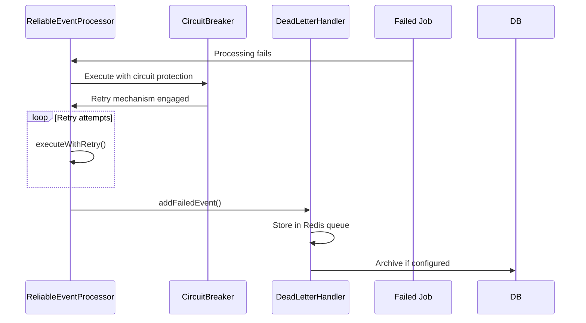
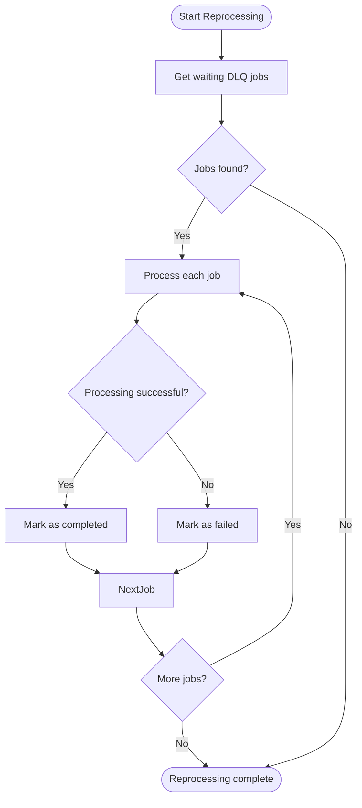
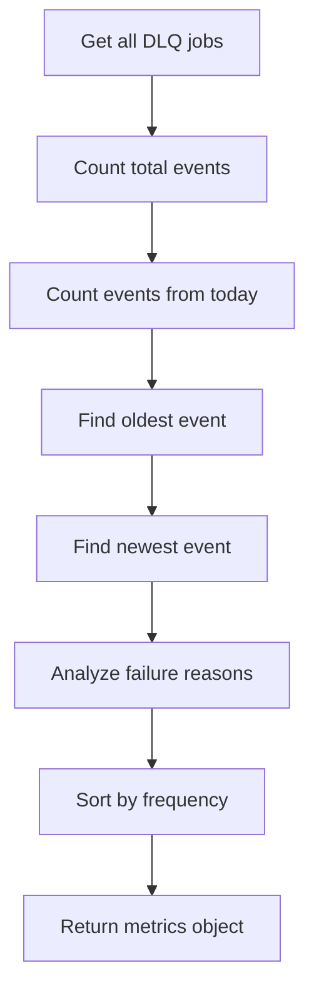
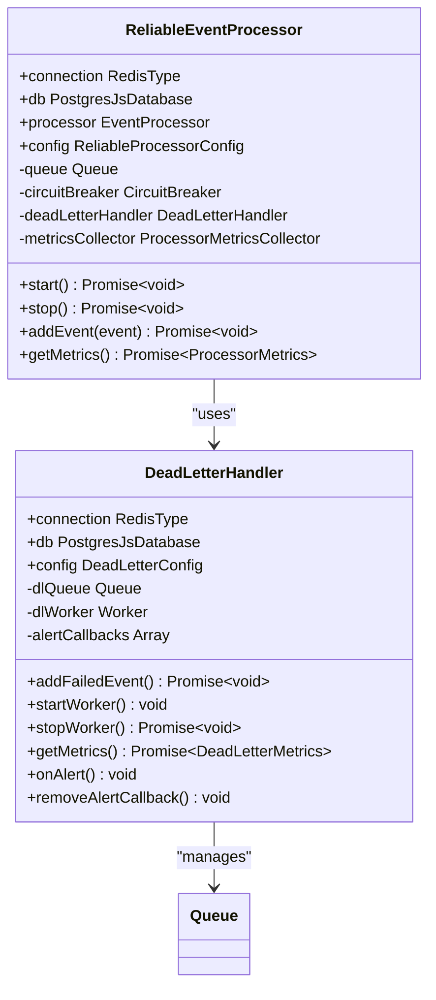

# Dead Letter Queue Integration

<cite>
**Referenced Files in This Document**   
- [dead-letter-queue.ts](file://packages/audit/src/queue/dead-letter-queue.ts)
- [reliable-processor.ts](file://packages/audit/src/queue/reliable-processor.ts)
- [0005_snapshot.json](file://packages/audit-db/drizzle/migrations/meta/0005_snapshot.json)
</cite>

## Table of Contents
1. [Introduction](#introduction)
2. [DLQ Trigger Conditions](#dlq-trigger-conditions)
3. [DLQ Entry Structure](#dlq-entry-structure)
4. [Retrieval and Reprocessing](#retrieval-and-reprocessing)
5. [Operational Monitoring](#operational-monitoring)
6. [Configuration and Integration](#configuration-and-integration)

## Introduction
The Dead Letter Queue (DLQ) system provides a safety net for audit log events that cannot be successfully processed after exhausting retry mechanisms. This documentation details the implementation and operational aspects of the DLQ functionality within the reliable processing pipeline, focusing on failure handling, message structure, and recovery workflows.

**Section sources**
- [dead-letter-queue.ts](file://packages/audit/src/queue/dead-letter-queue.ts#L1-L367)
- [reliable-processor.ts](file://packages/audit/src/queue/reliable-processor.ts#L1-L538)

## DLQ Trigger Conditions
Messages are routed to the Dead Letter Queue under the following conditions:

1. **Exhausted Retry Attempts**: When an event fails processing and has exhausted all retry attempts configured in the reliable processor's retry configuration.
2. **Permanent Failures**: When the system encounters non-recoverable errors such as database connection failures, schema validation errors, or other critical system errors.
3. **Circuit Breaker Trips**: When the circuit breaker is in OPEN state, indicating that the downstream service is unavailable and further processing attempts would be futile.

The reliable processor integrates with the DLQ system by forwarding events that fail after retry attempts to the dead letter handler. This integration is established during the processor's initialization phase.



**Diagram sources**
- [reliable-processor.ts](file://packages/audit/src/queue/reliable-processor.ts#L220-L280)
- [dead-letter-queue.ts](file://packages/audit/src/queue/dead-letter-queue.ts#L100-L150)

**Section sources**
- [reliable-processor.ts](file://packages/audit/src/queue/reliable-processor.ts#L220-L280)
- [dead-letter-queue.ts](file://packages/audit/src/queue/dead-letter-queue.ts#L100-L150)

## DLQ Entry Structure
Each entry in the Dead Letter Queue contains comprehensive information about the failed event, enabling effective troubleshooting and recovery. The structure includes:

### Core Properties
- **originalEvent**: The complete audit log event payload that failed processing
- **failureReason**: Human-readable description of why processing failed
- **failureCount**: Number of failed processing attempts
- **firstFailureTime**: Timestamp when the event first failed
- **lastFailureTime**: Timestamp of the most recent failure
- **originalJobId**: Identifier of the original processing job
- **originalQueueName**: Name of the source queue where processing began

### Metadata Object
The metadata field contains additional diagnostic information:
- **errorStack**: Full stack trace of the error that caused failure
- **retryHistory**: Array of all retry attempts with timestamps and error messages

### Database Schema
When archiving is enabled, DLQ entries are persisted in the `archive_dlq_event` table with the following schema:

```mermaid
erDiagram
archive_dlq_event {
timestamp "timestamp with time zone" PK
action "varchar(255)"
failure_reason "text"
failure_count "integer"
first_failure_time "timestamp with time zone"
last_failure_time "timestamp with time zone"
original_job_id "varchar(255)"
original_queue_name "varchar(255)"
original_event "jsonb"
metadata "jsonb"
}
```

**Diagram sources**
- [0005_snapshot.json](file://packages/audit-db/drizzle/migrations/meta/0005_snapshot.json#L448-L496)

**Section sources**
- [dead-letter-queue.ts](file://packages/audit/src/queue/dead-letter-queue.ts#L50-L90)
- [0005_snapshot.json](file://packages/audit-db/drizzle/migrations/meta/0005_snapshot.json#L448-L496)

## Retrieval and Reprocessing
The system provides multiple mechanisms for retrieving and reprocessing failed messages from the Dead Letter Queue.

### Manual Reprocessing
The `processPendingEvents()` method allows administrators to manually trigger processing of all pending DLQ events:



**Diagram sources**
- [dead-letter-queue.ts](file://packages/audit/src/queue/dead-letter-queue.ts#L340-L360)

### Automated Processing Workflow
The DLQ worker automatically processes entries according to the following workflow:

1. Check if event should be archived (based on `archiveAfterDays` configuration)
2. Check if event should be removed (based on `maxRetentionDays` configuration)
3. Log event details for monitoring purposes
4. Complete the job (removing it from the active queue)

Events are automatically removed from the DLQ when they exceed the maximum retention period (default: 30 days).

**Section sources**
- [dead-letter-queue.ts](file://packages/audit/src/queue/dead-letter-queue.ts#L175-L214)

## Operational Monitoring
Effective monitoring of the DLQ is critical for maintaining system health and identifying systemic issues.

### Metrics Collection
The system exposes comprehensive metrics through the `getMetrics()` method:



**Diagram sources**
- [dead-letter-queue.ts](file://packages/audit/src/queue/dead-letter-queue.ts#L250-L300)

The metrics include:
- **totalEvents**: Total number of events in the DLQ
- **eventsToday**: Number of events that failed today
- **oldestEvent**: Timestamp of the oldest event
- **newestEvent**: Timestamp of the newest event
- **topFailureReasons**: List of the most common failure reasons

### Alerting System
The DLQ implements an alerting mechanism that triggers when the number of failed events exceeds a configurable threshold (default: 10). The system includes a cooldown period (5 minutes) to prevent alert storms.

Alert callbacks are notified with the full metrics object, allowing integration with external monitoring systems. The system gracefully handles errors in alert callbacks to prevent cascading failures.

**Section sources**
- [dead-letter-queue.ts](file://packages/audit/src/queue/dead-letter-queue.ts#L298-L346)

## Configuration and Integration
The DLQ system is configured through the `DeadLetterConfig` interface and integrates seamlessly with the reliable processor.

### Configuration Options
| Configuration Parameter | Default Value | Description |
|------------------------|-------------|-------------|
| queueName | audit-dead-letter | Redis queue name for DLQ storage |
| maxRetentionDays | 30 | Maximum days to retain DLQ entries |
| alertThreshold | 10 | Number of events that triggers alerts |
| processingInterval | 300000 | Interval (ms) for DLQ processing (5 minutes) |
| archiveAfterDays | undefined | Days after which to archive entries |

### Integration with Reliable Processor
The reliable processor automatically integrates with the DLQ during initialization:



**Diagram sources**
- [reliable-processor.ts](file://packages/audit/src/queue/reliable-processor.ts#L74-L122)
- [dead-letter-queue.ts](file://packages/audit/src/queue/dead-letter-queue.ts#L40-L90)

The integration includes automatic alert forwarding from the DLQ to the processor, allowing the processor to react to DLQ buildup as part of its health monitoring.

**Section sources**
- [reliable-processor.ts](file://packages/audit/src/queue/reliable-processor.ts#L74-L122)
- [dead-letter-queue.ts](file://packages/audit/src/queue/dead-letter-queue.ts#L40-L90)