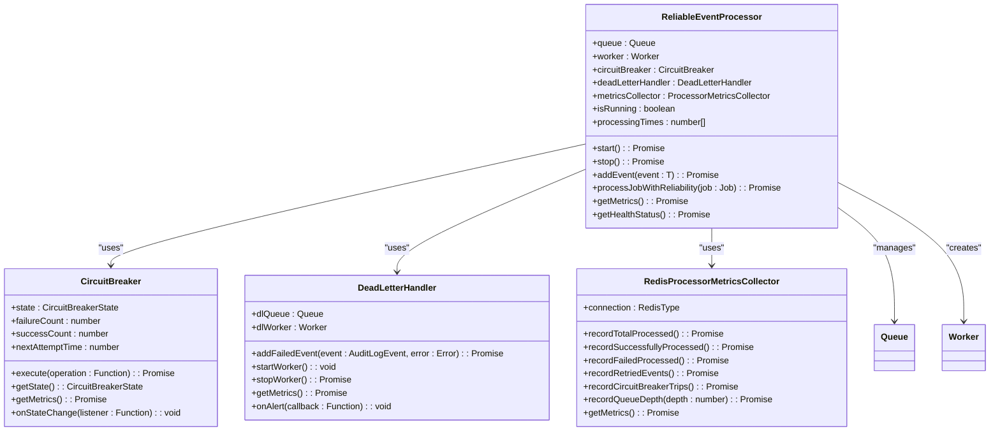
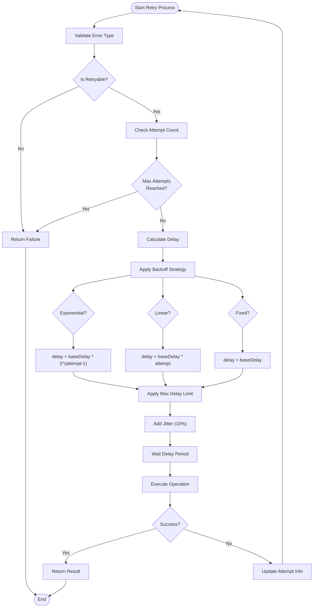
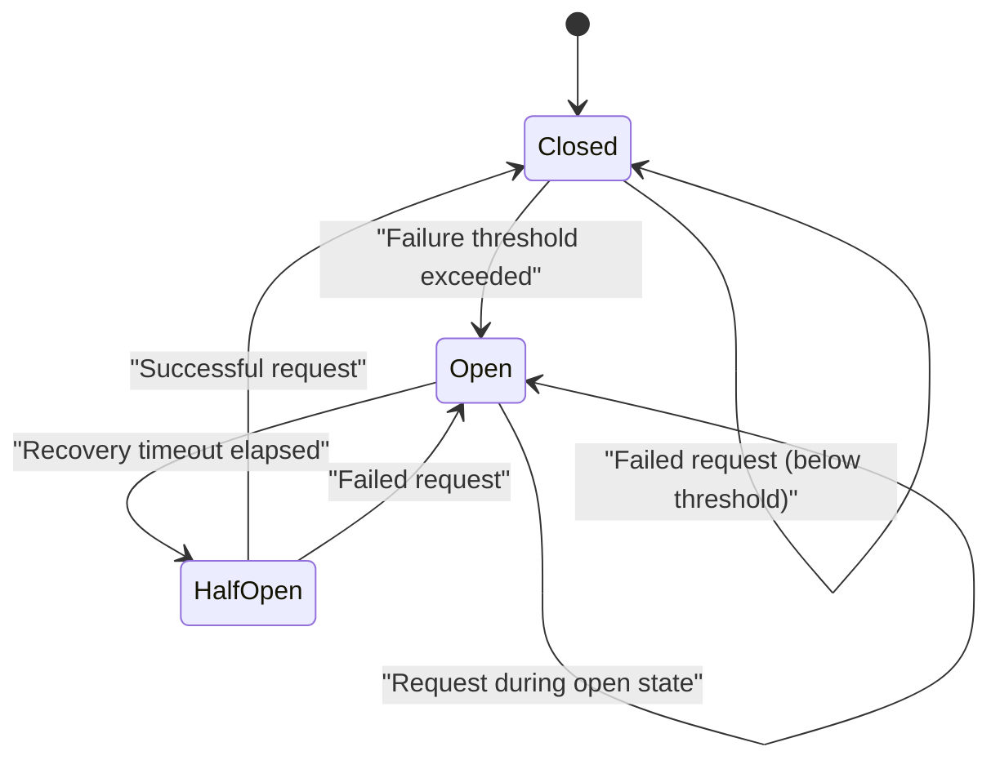
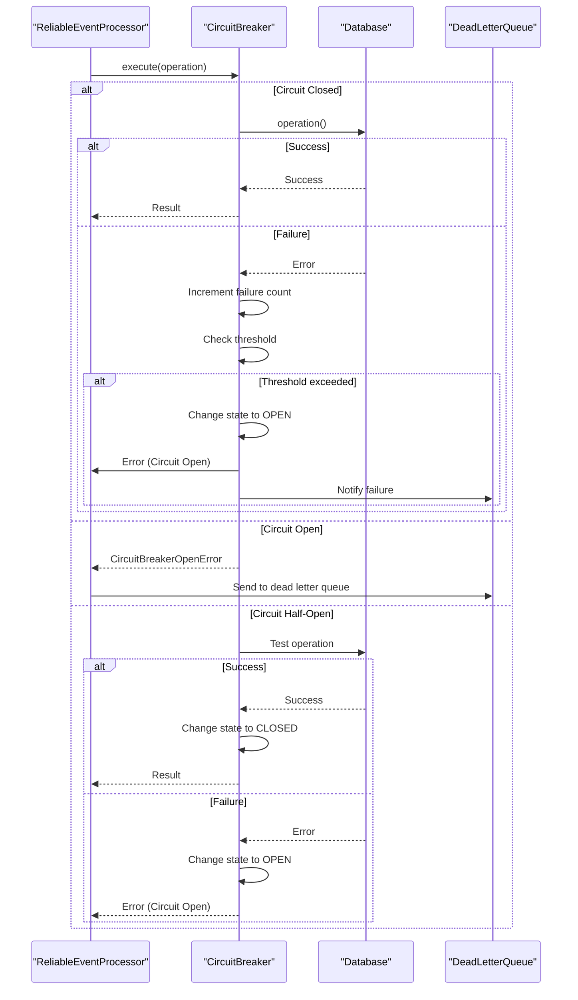
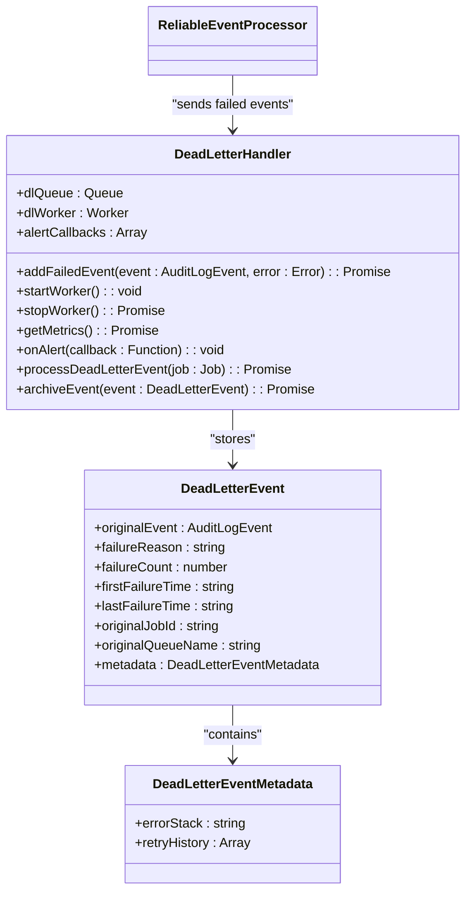
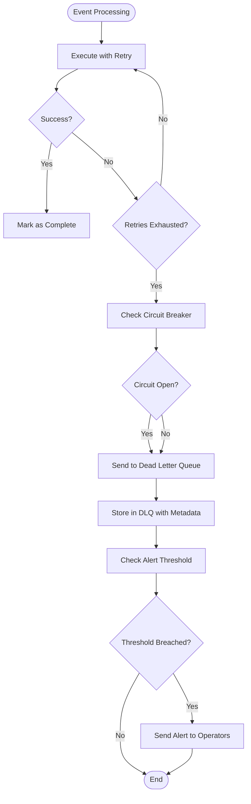
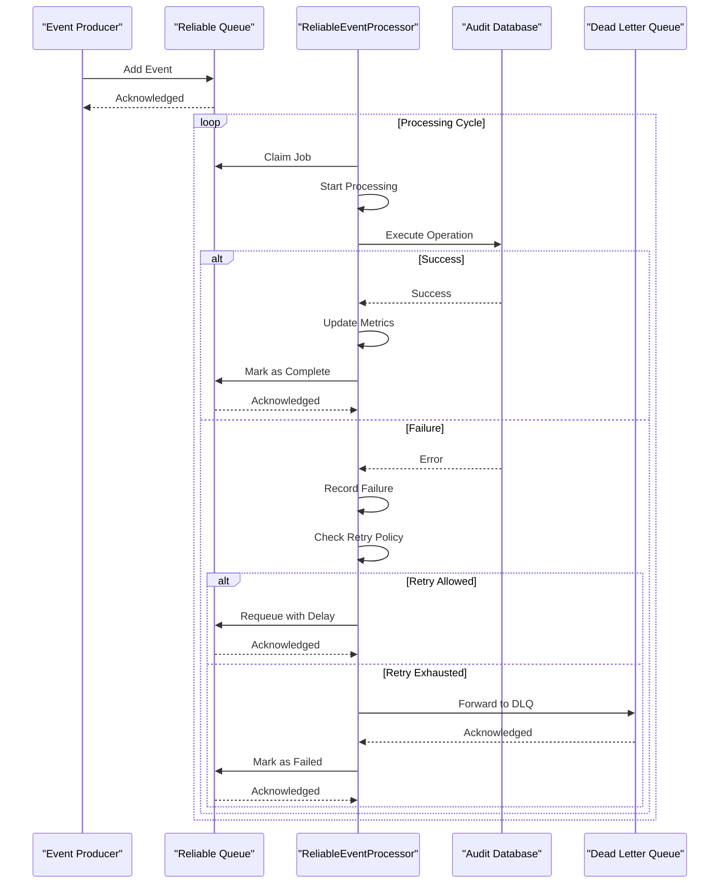
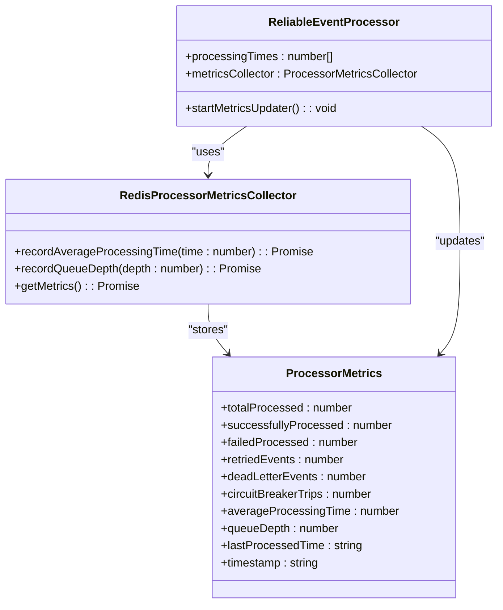
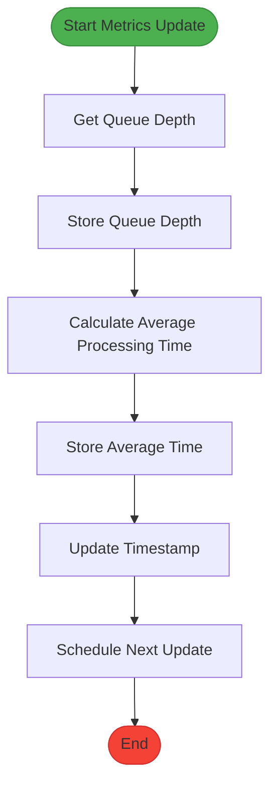
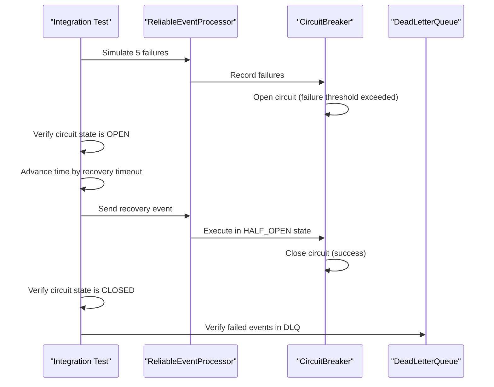

# Reliable Event Processing

<cite>
**Referenced Files in This Document**   
- [reliable-processor.ts](file://packages/audit/src/queue/reliable-processor.ts)
- [retry.ts](file://packages/audit/src/retry.ts)
- [circuit-breaker.ts](file://packages/audit/src/queue/circuit-breaker.ts)
- [dead-letter-queue.ts](file://packages/audit/src/queue/dead-letter-queue.ts)
- [reliable-processor.test.ts](file://packages/audit/src/__tests__/reliable-processor.test.ts)
</cite>

## Table of Contents
1. [Introduction](#introduction)
2. [Core Components](#core-components)
3. [Reliable Processor Architecture](#reliable-processor-architecture)
4. [Retry Mechanism Implementation](#retry-mechanism-implementation)
5. [Circuit Breaker Integration](#circuit-breaker-integration)
6. [Dead Letter Queue and Fallback](#dead-letter-queue-and-fallback)
7. [Message Acknowledgment and In-Flight Tracking](#message-acknowledgment-and-in-flight-tracking)
8. [Latency Monitoring and Backpressure](#latency-monitoring-and-backpressure)
9. [Configuration Options](#configuration-options)
10. [Integration Testing and Recovery Scenarios](#integration-testing-and-recovery-scenarios)

## Introduction
The Reliable Event Processing subsystem ensures guaranteed delivery of audit events to the database through a sophisticated combination of retry mechanisms, circuit breaker patterns, and dead letter queue fallbacks. This document provides a comprehensive analysis of the system's architecture and implementation, focusing on how it maintains data integrity during transient failures and database outages. The system is designed to handle high-volume event processing while providing robust error handling, comprehensive monitoring, and configurable resilience parameters.

## Core Components
The reliable event processing system consists of several interconnected components that work together to ensure message delivery:

- **ReliableEventProcessor**: The main orchestrator that manages event processing with retry and circuit breaker integration
- **Retry Mechanism**: Implements exponential backoff retry logic with configurable parameters
- **CircuitBreaker**: Prevents cascading failures during prolonged database outages
- **DeadLetterHandler**: Provides fallback storage for events that exceed retry limits
- **MetricsCollector**: Tracks processing performance and system health

These components work in concert to provide a resilient event processing pipeline that can recover from transient failures while maintaining data integrity.

**Section sources**
- [reliable-processor.ts](file://packages/audit/src/queue/reliable-processor.ts#L1-L50)
- [retry.ts](file://packages/audit/src/retry.ts#L1-L20)
- [circuit-breaker.ts](file://packages/audit/src/queue/circuit-breaker.ts#L1-L20)

## Reliable Processor Architecture
The ReliableEventProcessor class serves as the central component of the reliable event processing system. It integrates multiple resilience patterns to ensure message delivery to the audit database. The processor uses BullMQ for queue management, providing durable storage and concurrent processing capabilities.



**Diagram sources**
- [reliable-processor.ts](file://packages/audit/src/queue/reliable-processor.ts#L1-L538)
- [circuit-breaker.ts](file://packages/audit/src/queue/circuit-breaker.ts#L1-L365)
- [dead-letter-queue.ts](file://packages/audit/src/queue/dead-letter-queue.ts#L1-L367)

**Section sources**
- [reliable-processor.ts](file://packages/audit/src/queue/reliable-processor.ts#L1-L538)

## Retry Mechanism Implementation
The retry mechanism is implemented in the retry.ts file and provides configurable retry logic with exponential backoff. The system uses a sophisticated retry strategy that considers both the number of attempts and the nature of the error.



The retry configuration is defined by the RetryConfig interface, which includes:

- **maxRetries**: Maximum number of retry attempts (default: 5)
- **backoffStrategy**: Strategy for increasing delay between attempts (exponential, linear, or fixed)
- **baseDelay**: Initial delay in milliseconds (default: 1000ms)
- **maxDelay**: Maximum delay in milliseconds (default: 30000ms)
- **jitter**: Whether to add random variation to delay (default: true)
- **retryableErrors**: List of error codes and patterns that trigger retries

The executeWithRetry function implements the core retry logic, handling both success and failure cases while tracking attempt history. It automatically determines if an error is retryable based on the configuration and applies the appropriate backoff strategy.

**Diagram sources**
- [retry.ts](file://packages/audit/src/retry.ts#L1-L190)

**Section sources**
- [retry.ts](file://packages/audit/src/retry.ts#L1-L190)

## Circuit Breaker Integration
The circuit breaker pattern is implemented to prevent cascading failures during database outages. The CircuitBreaker class monitors the health of the database connection and automatically stops sending requests when failure rates exceed configured thresholds.

### State Transitions
The circuit breaker has three states with specific transition rules:



**Diagram sources**
- [circuit-breaker.ts](file://packages/audit/src/queue/circuit-breaker.ts#L1-L365)

### Circuit Breaker Configuration
The circuit breaker is configured with the following parameters:

- **failureThreshold**: Number of consecutive failures before opening the circuit (default: 5)
- **recoveryTimeout**: Time in milliseconds to wait before attempting recovery (default: 30000ms)
- **monitoringPeriod**: Time window for calculating failure rate (default: 60000ms)
- **minimumThroughput**: Minimum number of requests needed to evaluate failure rate (default: 10)

The circuit breaker works in conjunction with the reliable processor to prevent overwhelming the database during outages. When the circuit is open, new requests are immediately rejected with a CircuitBreakerOpenError, preventing additional load on the failing system.



**Diagram sources**
- [circuit-breaker.ts](file://packages/audit/src/queue/circuit-breaker.ts#L1-L365)
- [reliable-processor.ts](file://packages/audit/src/queue/reliable-processor.ts#L1-L538)

**Section sources**
- [circuit-breaker.ts](file://packages/audit/src/queue/circuit-breaker.ts#L1-L365)

## Dead Letter Queue and Fallback
When events fail to process after exhausting all retry attempts, they are routed to a dead letter queue (DLQ) for later analysis and recovery. The DeadLetterHandler class manages this fallback mechanism.

### Dead Letter Queue Architecture


**Diagram sources**
- [dead-letter-queue.ts](file://packages/audit/src/queue/dead-letter-queue.ts#L1-L367)

### Fallback Process Flow


**Diagram sources**
- [reliable-processor.ts](file://packages/audit/src/queue/reliable-processor.ts#L1-L538)
- [dead-letter-queue.ts](file://packages/audit/src/queue/dead-letter-queue.ts#L1-L367)

The dead letter queue stores comprehensive information about failed events, including:
- The original event data
- Failure reason and count
- Timestamps of first and last failure
- Original job ID and queue name
- Full error stack trace
- Complete retry history with timestamps and errors

The system also provides alerting capabilities when the DLQ size exceeds configurable thresholds, enabling proactive monitoring and intervention.

**Section sources**
- [dead-letter-queue.ts](file://packages/audit/src/queue/dead-letter-queue.ts#L1-L367)

## Message Acknowledgment and In-Flight Tracking
The system implements comprehensive message acknowledgment and in-flight tracking to ensure exactly-once processing semantics and prevent message loss.

### Message Acknowledgment Lifecycle
The acknowledgment process follows a well-defined lifecycle:



**Diagram sources**
- [reliable-processor.ts](file://packages/audit/src/queue/reliable-processor.ts#L1-L538)

### In-Flight Tracking and Concurrency Controls
The system uses several mechanisms to track in-flight messages and control concurrency:

- **Job State Management**: BullMQ tracks job states (waiting, active, completed, failed)
- **Concurrency Limits**: Configurable concurrency parameter limits simultaneous processing
- **Processing Time Tracking**: Maintains a rolling window of processing times for performance monitoring
- **Queue Depth Monitoring**: Tracks the number of pending events in the queue

The ReliableEventProcessor class maintains an array of processing times to calculate average processing duration, keeping only the most recent 1,000 measurements to prevent memory issues. This data is used for both performance monitoring and backpressure calculations.

**Section sources**
- [reliable-processor.ts](file://packages/audit/src/queue/reliable-processor.ts#L1-L538)

## Latency Monitoring and Backpressure
The system implements comprehensive latency monitoring and backpressure mechanisms to maintain stability during periods of high load or slow downstream systems.

### Latency Monitoring Architecture


**Diagram sources**
- [reliable-processor.ts](file://packages/audit/src/queue/reliable-processor.ts#L1-L538)

### Backpressure Implementation
The system applies backpressure through several mechanisms:

1. **Queue Depth Monitoring**: The metrics updater periodically checks queue depth and adjusts processing behavior
2. **Circuit Breaker Activation**: High failure rates trigger the circuit breaker, reducing load on downstream systems
3. **Configurable Concurrency**: Limits the number of simultaneous processing operations
4. **Health Score Calculation**: Provides a composite metric for system health that can inform scaling decisions

The startMetricsUpdater method runs every 30 seconds to update key metrics, including queue depth and average processing time. This information is used to calculate a health score that reflects the overall system status.



**Diagram sources**
- [reliable-processor.ts](file://packages/audit/src/queue/reliable-processor.ts#L1-L538)

**Section sources**
- [reliable-processor.ts](file://packages/audit/src/queue/reliable-processor.ts#L1-L538)

## Configuration Options
The reliable event processing system provides extensive configuration options to tune behavior for different environments and requirements.

### Reliable Processor Configuration
The ReliableProcessorConfig interface defines the following configurable parameters:

```typescript
interface ReliableProcessorConfig {
    queueName: string
    concurrency: number
    retryConfig: RetryConfig
    circuitBreakerConfig: CircuitBreakerConfig
    deadLetterConfig: DeadLetterConfig
    persistentStorage: boolean
    durabilityGuarantees: boolean
}
```

### Default Configuration Values
| Parameter | Default Value | Description |
|---------|-------------|-------------|
| **queueName** | "audit-reliable" | Name of the Redis queue |
| **concurrency** | 5 | Maximum concurrent processing jobs |
| **persistentStorage** | true | Whether to persist completed jobs |
| **durabilityGuarantees** | true | Whether to ensure message durability |

### Retry Configuration Options
| Parameter | Default Value | Description |
|---------|-------------|-------------|
| **maxRetries** | 5 | Maximum number of retry attempts |
| **backoffStrategy** | "exponential" | Strategy for increasing delay between attempts |
| **baseDelay** | 1000ms | Initial delay between retries |
| **maxDelay** | 30000ms | Maximum delay between retries |
| **jitter** | true | Whether to add random variation to delays |
| **retryableErrors** | ECONNRESET, ETIMEDOUT, etc. | List of error codes that trigger retries |

### Circuit Breaker Configuration Options
| Parameter | Default Value | Description |
|---------|-------------|-------------|
| **failureThreshold** | 5 | Failures needed to open circuit |
| **recoveryTimeout** | 30000ms | Time to wait before testing recovery |
| **monitoringPeriod** | 60000ms | Window for calculating failure rate |
| **minimumThroughput** | 10 | Minimum requests to evaluate failure rate |

### Dead Letter Queue Configuration Options
| Parameter | Default Value | Description |
|---------|-------------|-------------|
| **queueName** | "audit-dead-letter" | Name of the DLQ Redis queue |
| **maxRetentionDays** | 30 | Maximum days to retain DLQ events |
| **alertThreshold** | 10 | Number of events to trigger alerts |
| **processingInterval** | 300000ms | Interval for DLQ processing |
| **archiveAfterDays** | undefined | Days after which to archive events |

These configuration options can be customized based on specific requirements, allowing the system to be tuned for different performance, reliability, and operational needs.

**Section sources**
- [reliable-processor.ts](file://packages/audit/src/queue/reliable-processor.ts#L1-L538)
- [retry.ts](file://packages/audit/src/retry.ts#L1-L190)
- [circuit-breaker.ts](file://packages/audit/src/queue/circuit-breaker.ts#L1-L365)
- [dead-letter-queue.ts](file://packages/audit/src/queue/dead-letter-queue.ts#L1-L367)

## Integration Testing and Recovery Scenarios
The system includes comprehensive integration tests that validate recovery from various failure scenarios.

### Test Coverage
The reliable-processor.test.ts file contains tests for the following scenarios:

- **Processor lifecycle**: Starting and stopping the processor
- **Event processing**: Successful processing and failure handling
- **Circuit breaker integration**: Opening and recovery from failures
- **Metrics tracking**: Correct recording of processing metrics
- **Queue management**: Adding events to the queue
- **Integration scenarios**: High-volume processing and mixed success/failure cases
- **Resource cleanup**: Proper cleanup of resources

### Recovery Scenario Examples


**Diagram sources**
- [reliable-processor.test.ts](file://packages/audit/src/__tests__/reliable-processor.test.ts#L1-L471)

The tests validate that the system correctly handles:
- **Transient failures**: Temporary database connectivity issues that resolve after retries
- **Prolonged outages**: Extended database downtime that triggers the circuit breaker
- **Mixed workloads**: Combinations of successful and failed events
- **High volume**: Large numbers of events processed concurrently
- **Resource cleanup**: Proper shutdown and cleanup of all components

The integration tests use Vitest with mocked dependencies to verify the behavior of the reliable processor under various conditions, ensuring that the system meets its reliability requirements.

**Section sources**
- [reliable-processor.test.ts](file://packages/audit/src/__tests__/reliable-processor.test.ts#L1-L471)