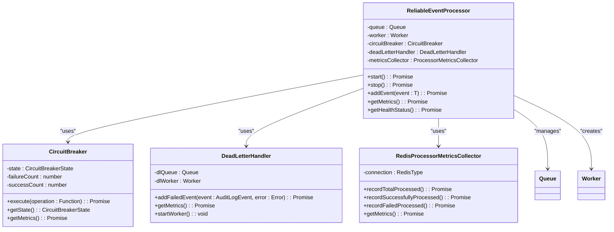
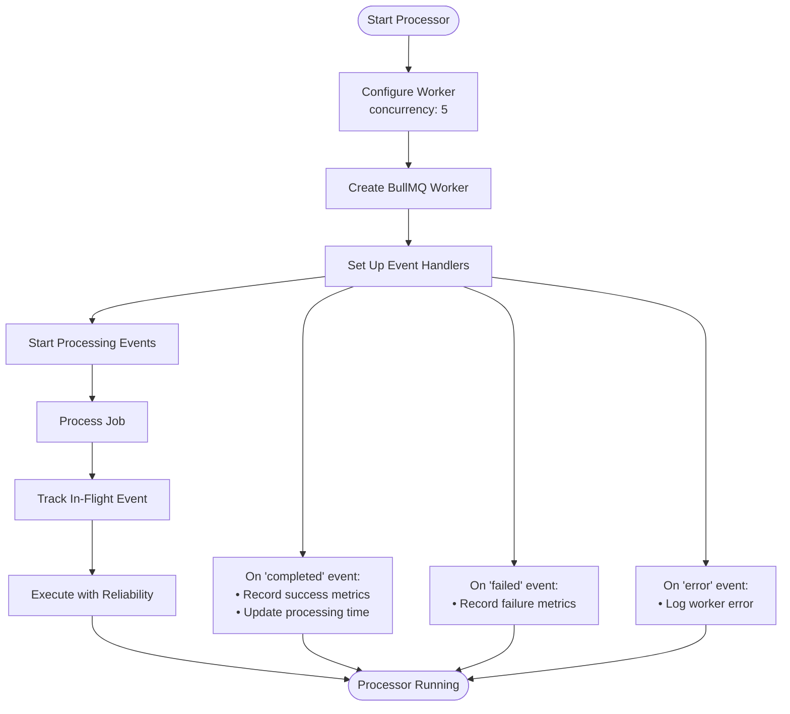
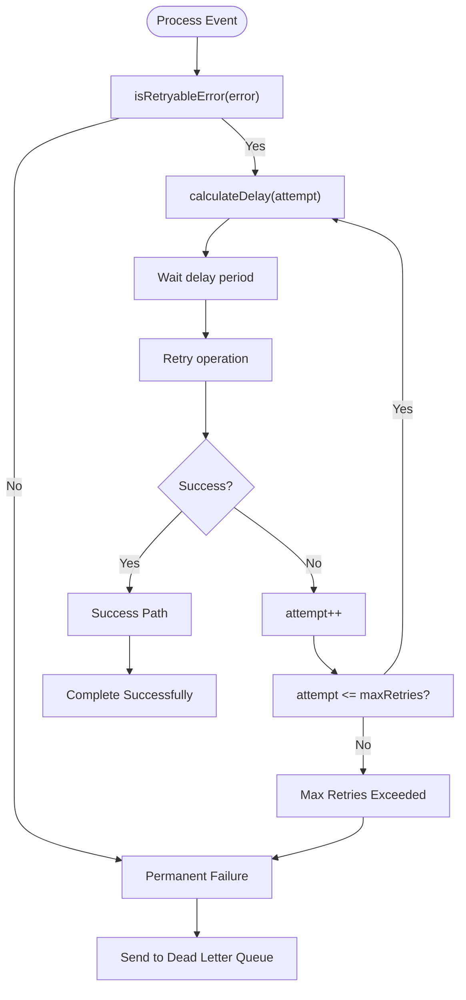
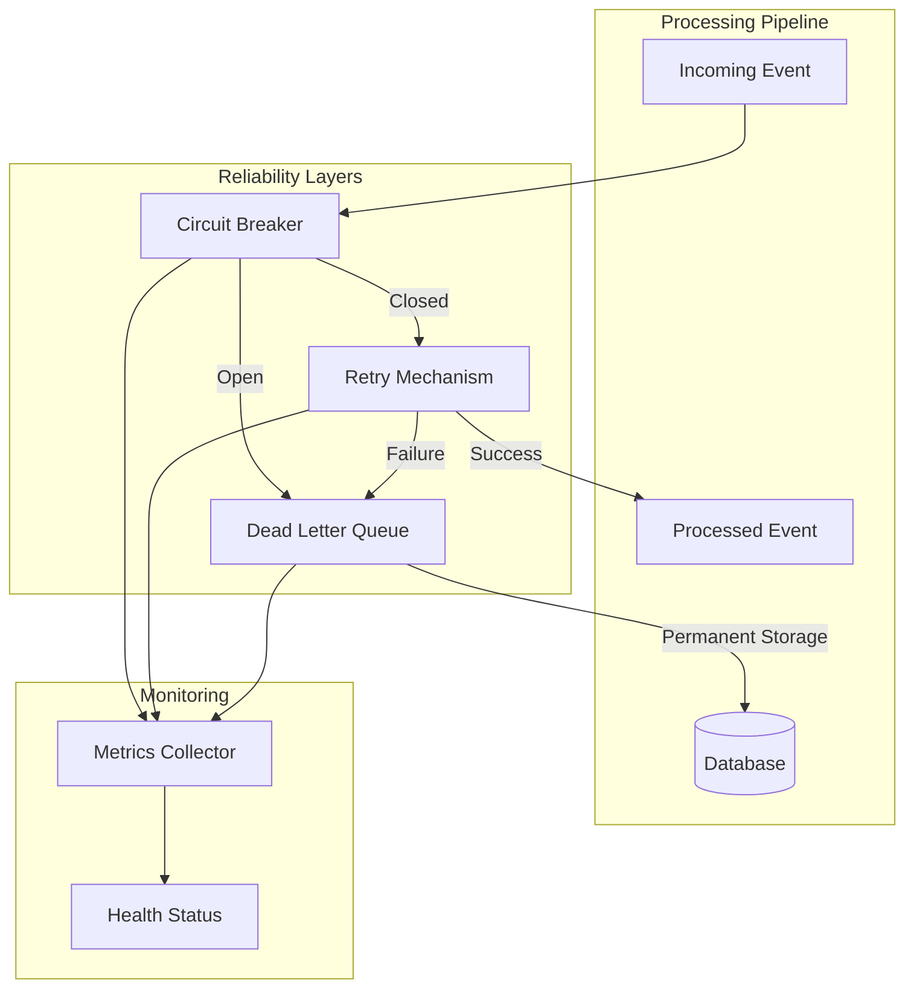
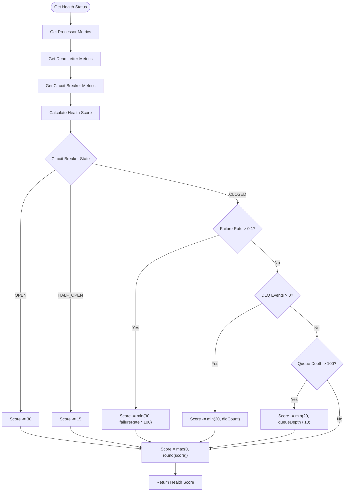

# Reliable Processor Implementation

<cite>
**Referenced Files in This Document**   
- [reliable-processor.ts](file://packages/audit/src/queue/reliable-processor.ts)
- [circuit-breaker.ts](file://packages/audit/src/queue/circuit-breaker.ts)
- [dead-letter-queue.ts](file://packages/audit/src/queue/dead-letter-queue.ts)
- [retry.ts](file://packages/audit/src/retry.ts)
- [types.ts](file://packages/audit/src/types.ts)
</cite>

## Table of Contents
1. [Introduction](#introduction)
2. [Core Architecture](#core-architecture)
3. [Message Lifecycle](#message-lifecycle)
4. [Concurrency and Worker Management](#concurrency-and-worker-management)
5. [Error Handling and Retry Strategies](#error-handling-and-retry-strategies)
6. [Integration with Resilience Patterns](#integration-with-resilience-patterns)
7. [Performance Considerations](#performance-considerations)
8. [Configuration and Code Examples](#configuration-and-code-examples)
9. [Metrics and Health Monitoring](#metrics-and-health-monitoring)
10. [Conclusion](#conclusion)

## Introduction
The ReliableEventProcessor class provides a robust message processing system with guaranteed delivery, retry coordination, and circuit breaker integration. This implementation ensures that audit log events are processed reliably even in the face of transient failures or system outages. The processor uses BullMQ for queue management, Redis for state storage, and Postgres for persistent data storage, creating a comprehensive reliability framework for critical audit processing.

**Section sources**
- [reliable-processor.ts](file://packages/audit/src/queue/reliable-processor.ts#L1-L50)

## Core Architecture
The ReliableEventProcessor implements a comprehensive reliability framework that orchestrates message processing through multiple resilience layers. At its core, the processor uses BullMQ to manage a Redis-backed queue, ensuring durability and persistence of messages. The architecture integrates three key reliability patterns: retry mechanisms, circuit breakers, and dead letter queues, all coordinated through a unified processing pipeline.



**Diagram sources**
- [reliable-processor.ts](file://packages/audit/src/queue/reliable-processor.ts#L53-L412)
- [circuit-breaker.ts](file://packages/audit/src/queue/circuit-breaker.ts#L78-L364)
- [dead-letter-queue.ts](file://packages/audit/src/queue/dead-letter-queue.ts#L68-L366)
- [reliable-processor.ts](file://packages/audit/src/queue/reliable-processor.ts#L434-L536)

**Section sources**
- [reliable-processor.ts](file://packages/audit/src/queue/reliable-processor.ts#L53-L412)

## Message Lifecycle
The message lifecycle in the ReliableEventProcessor follows a well-defined path from receipt to final acknowledgment or dead-lettering. When an event is added to the processor, it enters the BullMQ queue where it waits for processing. The lifecycle includes several stages: queueing, processing with reliability features, success handling, and failure management.

```mermaid
sequenceDiagram
participant Producer as "Event Producer"
participant Processor as "ReliableEventProcessor"
participant Queue as "BullMQ Queue"
participant CircuitBreaker as "Circuit Breaker"
participant Retry as "Retry Mechanism"
participant DLQ as "Dead Letter Queue"
participant Consumer as "Event Consumer"
Producer->>Processor : addEvent(event)
Processor->>Queue : Add job to queue
Queue->>Processor : Job available
Processor->>Processor : processJobWithReliability()
Processor->>CircuitBreaker : execute()
alt Circuit Breaker OPEN
CircuitBreaker-->>Processor : Reject (OPEN state)
Processor->>DLQ : Add to dead letter queue
else Circuit Breaker CLOSED
CircuitBreaker->>Retry : executeWithRetry()
retry
Retry->>Consumer : Attempt processing
alt Success
Consumer-->>Retry : Success
Retry-->>CircuitBreaker : Success
CircuitBreaker-->>Processor : Success
Processor->>Processor : Record success metrics
else Failure
Consumer-->>Retry : Failure
Retry->>Retry : Apply backoff delay
end
end
alt All retries failed
Retry-->>CircuitBreaker : Permanent failure
CircuitBreaker-->>Processor : Failure
Processor->>DLQ : Add to dead letter queue
else Success after retries
Retry-->>CircuitBreaker : Success
CircuitBreaker-->>Processor : Success
Processor->>Processor : Record success metrics
end
end
Processor-->>Producer : Processing complete (async)
```

**Diagram sources**
- [reliable-processor.ts](file://packages/audit/src/queue/reliable-processor.ts#L203-L263)
- [retry.ts](file://packages/audit/src/retry.ts#L135-L189)
- [circuit-breaker.ts](file://packages/audit/src/queue/circuit-breaker.ts#L107-L189)
- [dead-letter-queue.ts](file://packages/audit/src/queue/dead-letter-queue.ts#L107-L149)

**Section sources**
- [reliable-processor.ts](file://packages/audit/src/queue/reliable-processor.ts#L203-L263)

## Concurrency and Worker Management
The ReliableEventProcessor implements sophisticated concurrency controls using in-flight tracking and worker pooling to maximize throughput while maintaining system stability. The processor creates a BullMQ worker with configurable concurrency, allowing multiple events to be processed simultaneously. Each worker operates within a defined concurrency limit, preventing resource exhaustion and ensuring predictable performance under load.

The processor tracks in-flight events through processing time metrics, maintaining an array of the last 1,000 processing times to calculate average performance. This tracking enables the system to adapt to changing workloads and identify performance bottlenecks. The worker configuration ensures that events are processed efficiently while maintaining the integrity of the reliability guarantees.



**Diagram sources**
- [reliable-processor.ts](file://packages/audit/src/queue/reliable-processor.ts#L138-L176)
- [reliable-processor.ts](file://packages/audit/src/queue/reliable-processor.ts#L246-L254)

**Section sources**
- [reliable-processor.ts](file://packages/audit/src/queue/reliable-processor.ts#L138-L176)

## Error Handling and Retry Strategies
The ReliableEventProcessor implements a comprehensive error handling strategy that distinguishes between transient and permanent failures through its integrated retry mechanism. The system uses the executeWithRetry function with configurable backoff strategies (exponential, linear, or fixed) to handle transient failures gracefully. The retry configuration includes jitter to prevent thundering herd problems during recovery.

Transient failures, such as network timeouts or connection resets, are identified by specific error codes and message patterns. These errors trigger the retry mechanism with increasing delays between attempts. Permanent failures, which occur when the maximum retry count is exceeded or when the error is not retryable, result in the event being moved to the dead letter queue for further analysis and potential manual intervention.



**Diagram sources**
- [retry.ts](file://packages/audit/src/retry.ts#L98-L189)
- [reliable-processor.ts](file://packages/audit/src/queue/reliable-processor.ts#L215-L233)

**Section sources**
- [retry.ts](file://packages/audit/src/retry.ts#L98-L189)

## Integration with Resilience Patterns
The ReliableEventProcessor integrates seamlessly with key resilience patterns through dedicated modules for circuit breaking and dead letter queue management. The circuit breaker pattern prevents cascading failures by temporarily blocking requests to a failing service, allowing it time to recover. When the circuit breaker detects excessive failures, it opens the circuit, rejecting new requests until a recovery timeout period has elapsed.

The dead letter queue serves as a safety net for events that cannot be processed after exhausting all retry attempts. Failed events are preserved with complete context, including the original event data, failure reason, retry history, and error stack traces. This comprehensive failure recording enables post-mortem analysis and potential recovery of critical audit events.



**Diagram sources**
- [reliable-processor.ts](file://packages/audit/src/queue/reliable-processor.ts#L203-L263)
- [circuit-breaker.ts](file://packages/audit/src/queue/circuit-breaker.ts#L107-L189)
- [dead-letter-queue.ts](file://packages/audit/src/queue/dead-letter-queue.ts#L107-L149)

**Section sources**
- [reliable-processor.ts](file://packages/audit/src/queue/reliable-processor.ts#L203-L263)

## Performance Considerations
For high-throughput scenarios, the ReliableEventProcessor offers several performance optimizations and considerations. The system maintains processing time metrics for the last 1,000 events, enabling accurate calculation of average processing times without excessive memory usage. The metrics collector updates queue depth and average processing time every 30 seconds, balancing monitoring granularity with performance overhead.

Under heavy load, memory usage is controlled through the limited retention of processing time data and the use of Redis for external metrics storage. The processor's concurrency can be adjusted based on available system resources, with higher concurrency values enabling greater throughput at the cost of increased memory and CPU usage. For optimal performance, the system should be configured with appropriate retry limits and backoff strategies to prevent overwhelming downstream services during periods of high load or failure.

**Section sources**
- [reliable-processor.ts](file://packages/audit/src/queue/reliable-processor.ts#L283-L308)
- [reliable-processor.ts](file://packages/audit/src/queue/reliable-processor.ts#L246-L254)

## Configuration and Code Examples
The ReliableEventProcessor can be configured with various settings to meet specific reliability and performance requirements. Below are code examples demonstrating configuration of worker count, batch size, and timeout settings.

```typescript
// Example: Custom configuration for the ReliableEventProcessor
import { ReliableEventProcessor } from './reliable-processor';
import { Redis } from 'ioredis';
import { drizzle } from 'drizzle-orm/postgres-js';

// Database and Redis connections
const redisConnection = new Redis(process.env.REDIS_URL);
const db = drizzle(pgClient);

// Custom processor function
const auditProcessor = async (event: AuditLogEvent) => {
  // Process the audit event
  await saveToDatabase(event);
  await sendToAnalytics(event);
};

// Custom configuration
const customConfig = {
  queueName: 'audit-reliable-critical',
  concurrency: 10, // Increased worker count for higher throughput
  retryConfig: {
    maxRetries: 3,
    backoffStrategy: 'exponential',
    baseDelay: 2000, // 2 second base delay
    maxDelay: 60000, // 1 minute maximum delay
    retryableErrors: [
      'ECONNRESET',
      'ETIMEDOUT',
      'ENOTFOUND',
      'EAI_AGAIN'
    ],
    jitter: true
  },
  circuitBreakerConfig: {
    failureThreshold: 3, // Open after 3 failures
    recoveryTimeout: 60000, // 1 minute recovery
    monitoringPeriod: 30000, // 30 second monitoring window
    minimumThroughput: 5 // Minimum requests for decision
  },
  deadLetterConfig: {
    queueName: 'audit-dead-letter-critical',
    maxRetentionDays: 90,
    alertThreshold: 5, // Alert on 5+ failed events
    processingInterval: 60000 // Process every minute
  },
  persistentStorage: true,
  durabilityGuarantees: true
};

// Create and start the processor
const processor = new ReliableEventProcessor(
  redisConnection,
  db,
  auditProcessor,
  customConfig
);

await processor.start();

// Add events to the processor
await processor.addEvent({
  timestamp: new Date().toISOString(),
  action: 'userLogin',
  status: 'SUCCESS',
  principalId: 'user-123'
});
```

**Section sources**
- [reliable-processor.ts](file://packages/audit/src/queue/reliable-processor.ts#L28-L36)
- [reliable-processor.ts](file://packages/audit/src/queue/reliable-processor.ts#L18-L26)

## Metrics and Health Monitoring
The ReliableEventProcessor provides comprehensive metrics and health monitoring capabilities through its integrated metrics collector and health status system. The processor collects various performance and reliability metrics, including total processed events, success and failure rates, retry statistics, dead letter queue events, circuit breaker trips, average processing time, and current queue depth.

The health status system calculates a health score based on multiple factors, providing a single metric that reflects the overall system reliability. The health score ranges from 0 to 100, with deductions for circuit breaker issues, high failure rates, dead letter queue buildup, and excessive queue depth. This comprehensive monitoring enables proactive identification of potential issues before they impact system reliability.



**Diagram sources**
- [reliable-processor.ts](file://packages/audit/src/queue/reliable-processor.ts#L338-L387)
- [reliable-processor.ts](file://packages/audit/src/queue/reliable-processor.ts#L310-L336)

**Section sources**
- [reliable-processor.ts](file://packages/audit/src/queue/reliable-processor.ts#L310-L387)

## Conclusion
The ReliableEventProcessor implementation provides a comprehensive solution for reliable message processing in distributed systems. By integrating retry mechanisms, circuit breakers, and dead letter queues, the processor ensures that audit log events are processed with high reliability and durability. The system's modular design allows for flexible configuration of concurrency, retry strategies, and failure handling, making it adaptable to various performance and reliability requirements.

The processor's comprehensive metrics and health monitoring capabilities enable proactive system management and rapid identification of potential issues. With its robust error handling and resilience patterns, the ReliableEventProcessor serves as a critical component in ensuring the integrity and reliability of audit logging in the system.