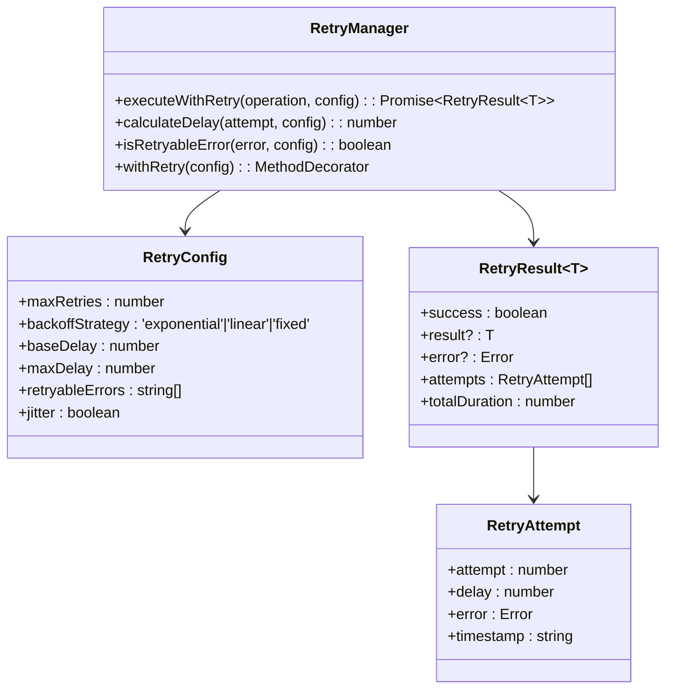
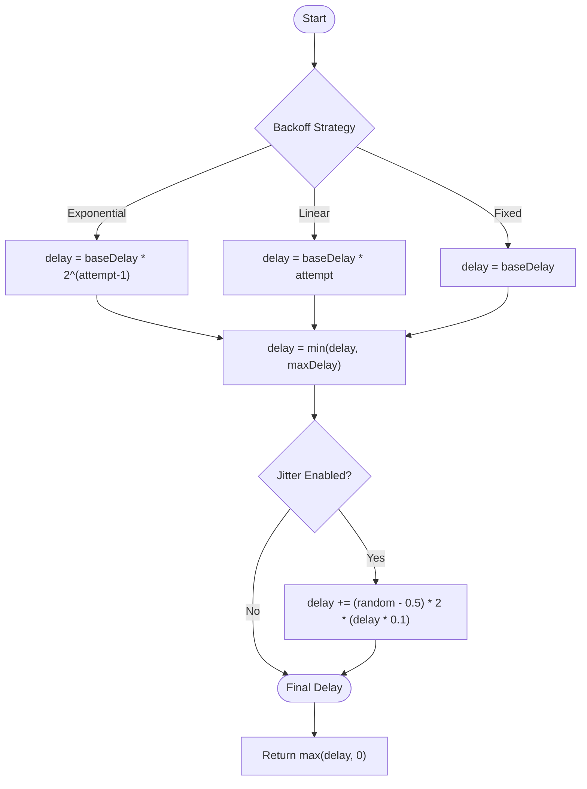
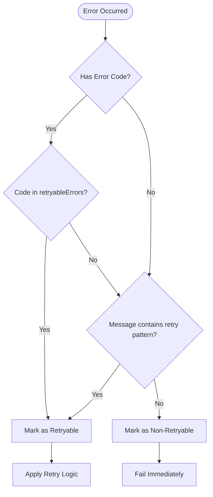
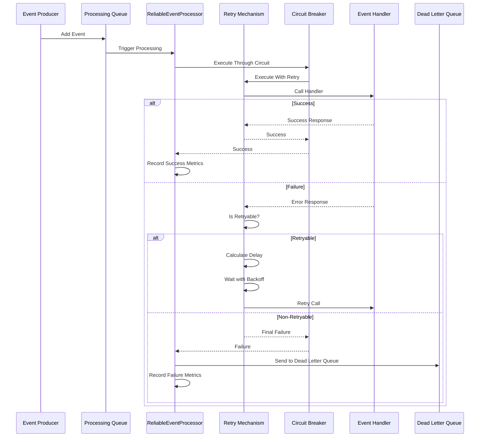
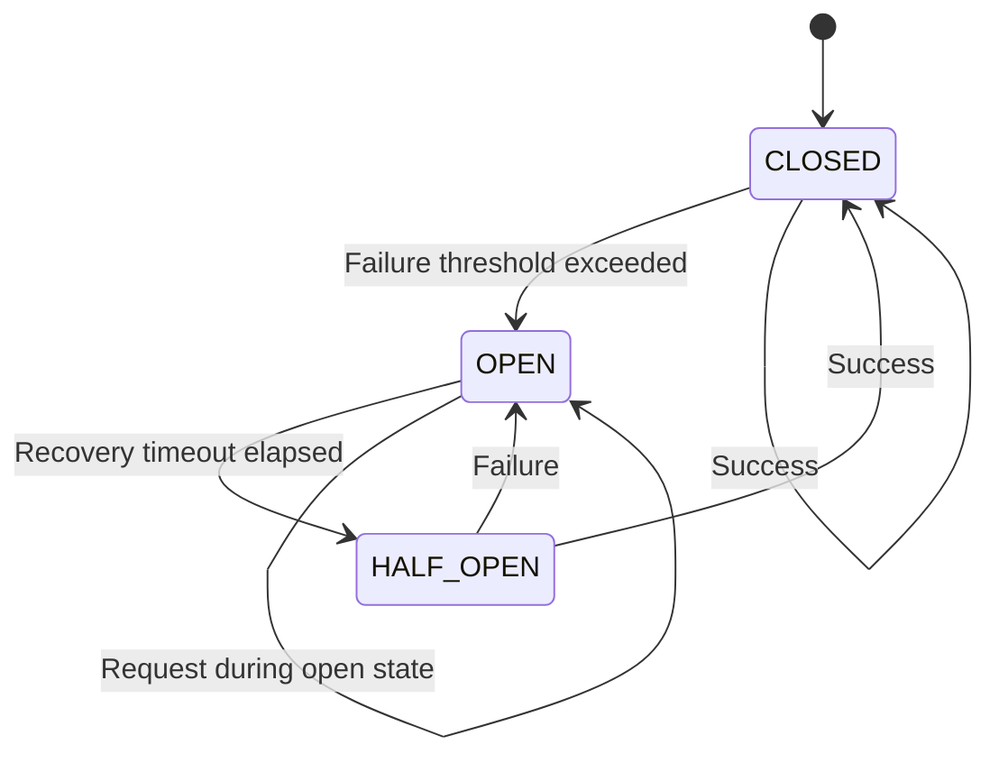
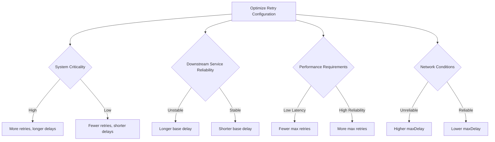

# Retry Strategy with Exponential Backoff

<cite>
**Referenced Files in This Document**   
- [retry.ts](file://packages/audit/src/retry.ts)
- [reliable-processor.ts](file://packages/audit/src/queue/reliable-processor.ts)
- [circuit-breaker.ts](file://packages/audit/src/queue/circuit-breaker.ts)
- [retry.test.ts](file://packages/audit/src/__tests__/retry.test.ts)
- [reliable-processor.test.ts](file://packages/audit/src/__tests__/reliable-processor.test.ts)
</cite>

## Table of Contents
1. [Introduction](#introduction)
2. [Core Retry Mechanism](#core-retry-mechanism)
3. [Exponential Backoff with Jitter](#exponential-backoff-with-jitter)
4. [Error Type Classification](#error-type-classification)
5. [Integration with Reliable Processor](#integration-with-reliable-processor)
6. [Circuit Breaker Coordination](#circuit-breaker-coordination)
7. [Retry Schedule Calculation Examples](#retry-schedule-calculation-examples)
8. [Test Cases and Validation](#test-cases-and-validation)
9. [Configuration Tuning Guidelines](#configuration-tuning-guidelines)
10. [Conclusion](#conclusion)

## Introduction
The retry mechanism in the event processing system provides robust fault tolerance through exponential backoff, jitter, and intelligent error handling. This documentation details the implementation of the retry strategy used across the audit logging system, focusing on the `retry.ts` module and its integration with the reliable processor and circuit breaker patterns. The system ensures reliable event delivery while preventing cascading failures and thundering herd problems during service disruptions.

## Core Retry Mechanism

The retry mechanism is implemented in `retry.ts` as a comprehensive solution for handling transient failures in event processing. It provides configurable retry policies with multiple backoff strategies, jitter support, and sophisticated error classification.



**Diagram sources**
- [retry.ts](file://packages/audit/src/retry.ts#L1-L190)

**Section sources**
- [retry.ts](file://packages/audit/src/retry.ts#L1-L190)

## Exponential Backoff with Jitter

The retry system implements exponential backoff with jitter to prevent synchronized retry storms. The algorithm calculates delays based on attempt number, base delay, multiplier, and maximum delay constraints.

### Algorithm Implementation



**Diagram sources**
- [retry.ts](file://packages/audit/src/retry.ts#L120-L180)

The exponential backoff algorithm follows these rules:
- **Base Delay**: Initial delay of 1000ms (configurable)
- **Multiplier**: Power of 2 for exponential growth (2^(n-1))
- **Maximum Delay**: Caps at 30,000ms to prevent excessively long waits
- **Jitter**: Adds ±10% random variation to prevent synchronized retries

For example, with default configuration:
- Attempt 1: 1000ms ± 10% jitter
- Attempt 2: 2000ms ± 10% jitter  
- Attempt 3: 4000ms ± 10% jitter
- Attempt 4: 8000ms ± 10% jitter
- Attempt 5: 16000ms ± 10% jitter

**Section sources**
- [retry.ts](file://packages/audit/src/retry.ts#L120-L180)
- [retry.test.ts](file://packages/audit/src/__tests__/retry.test.ts#L46-L81)

## Error Type Classification

The retry system distinguishes between transient (retryable) and permanent (non-retryable) errors to optimize recovery behavior.

### Retryable Error Detection



**Diagram sources**
- [retry.ts](file://packages/audit/src/retry.ts#L80-L110)

The system identifies retryable errors through multiple criteria:
- **Error Codes**: Specific network and connection errors like 'ECONNRESET', 'ETIMEDOUT', 'ENOTFOUND'
- **Error Messages**: Contains keywords like 'connection', 'timeout', 'network', 'unavailable'
- **Error Types**: HTTP 5xx server errors, network connectivity issues

Default retryable error codes include:
- ECONNRESET
- ETIMEDOUT  
- ENOTFOUND
- ECONNREFUSED
- EHOSTUNREACH
- ENETUNREACH
- EAI_AGAIN
- EPIPE
- ECONNABORTED

**Section sources**
- [retry.ts](file://packages/audit/src/retry.ts#L80-L110)
- [retry.test.ts](file://packages/audit/src/__tests__/retry.test.ts#L0-L48)

## Integration with Reliable Processor

The retry mechanism is tightly integrated with the reliable event processor to ensure guaranteed delivery of audit events.

### Processing Workflow



**Diagram sources**
- [reliable-processor.ts](file://packages/audit/src/queue/reliable-processor.ts#L249-L294)
- [retry.ts](file://packages/audit/src/retry.ts#L150-L180)

The reliable processor orchestrates the retry process by:
1. Receiving events from the processing queue
2. Routing them through the circuit breaker
3. Applying retry logic with exponential backoff
4. Recording metrics for monitoring
5. Forwarding failed events to the dead letter queue

**Section sources**
- [reliable-processor.ts](file://packages/audit/src/queue/reliable-processor.ts#L249-L294)

## Circuit Breaker Coordination

The retry mechanism works in conjunction with the circuit breaker pattern to prevent overwhelming failing services.

### Circuit Breaker States



**Diagram sources**
- [circuit-breaker.ts](file://packages/audit/src/queue/circuit-breaker.ts#L150-L250)

When the circuit breaker is in the OPEN state:
- All retry attempts are immediately rejected
- No network calls are made to the failing service
- Requests fail fast with a circuit breaker error
- After recovery timeout, transitions to HALF_OPEN state for testing

This prevents the retry mechanism from continuously hammering a service that is known to be failing, allowing it time to recover.

**Section sources**
- [circuit-breaker.ts](file://packages/audit/src/queue/circuit-breaker.ts#L150-L250)
- [reliable-processor.ts](file://packages/audit/src/queue/reliable-processor.ts#L249-L294)

## Retry Schedule Calculation Examples

The following examples demonstrate how retry schedules are calculated under different configurations.

### Default Configuration Example
With `baseDelay: 1000`, `maxDelay: 30000`, `backoffStrategy: 'exponential'`, and `jitter: true`:

| Attempt | Base Delay (ms) | With Jitter Range (ms) | Cumulative Time (ms) |
|---------|----------------|----------------------|---------------------|
| 1 | 1000 | 800-1200 | 800-1200 |
| 2 | 2000 | 1600-2400 | 2400-3600 |
| 3 | 4000 | 3200-4800 | 5600-8400 |
| 4 | 8000 | 6400-9600 | 12000-18000 |
| 5 | 16000 | 12800-19200 | 24800-37200 |

### High Availability Configuration
With `baseDelay: 500`, `maxDelay: 10000`, `backoffStrategy: 'exponential'`:

| Attempt | Base Delay (ms) | Cumulative Time (ms) |
|---------|----------------|---------------------|
| 1 | 500 | 500 |
| 2 | 1000 | 1500 |
| 3 | 2000 | 3500 |
| 4 | 4000 | 7500 |
| 5 | 8000 | 15500 |

### Maximum Delay Capping
When exponential growth would exceed maxDelay:


**Diagram sources**
- [retry.test.ts](file://packages/audit/src/__tests__/retry.test.ts#L46-L81)
- [retry.test.ts](file://packages/audit/src/__tests__/retry.test.ts#L181-L232)

**Section sources**
- [retry.test.ts](file://packages/audit/src/__tests__/retry.test.ts#L46-L81)

## Test Cases and Validation

The retry mechanism is thoroughly tested to ensure reliable behavior under various failure scenarios.

### Key Test Scenarios

```mermaid
flowchart TD
TestSuite[Retry Test Suite] --> Test1[Retryable Error Detection]
TestSuite --> Test2[Exponential Backoff Calculation]
TestSuite --> Test3[Maximum Delay Capping]
TestSuite --> Test4[Linear Backoff Strategy]
TestSuite --> Test5[Fixed Delay Strategy]
TestSuite --> Test6[Jitter Application]
TestSuite --> Test7[Retry Exhaustion]
TestSuite --> Test8[Non-Retryable Errors]
TestSuite --> Test9[Integration with Circuit Breaker]
TestSuite --> Test10[Decorator Functionality]
Test1 --> Verify[Verify ECONNRESET, ETIMEDOUT detected]
Test2 --> Verify[1000, 2000, 4000 sequence]
Test3 --> Verify[Delays capped at maxDelay]
Test6 --> Verify[Delays vary within ±10% range]
Test7 --> Verify[Fail after maxRetries]
Test8 --> Verify[Validation errors not retried]
Test9 --> Verify[Circuit OPEN blocks retries]
Test10 --> Verify[@withRetry decorator works]
```

**Diagram sources**
- [retry.test.ts](file://packages/audit/src/__tests__/retry.test.ts#L0-L333)

Key test cases include:
- **Retryable Error Identification**: Verifies that network errors trigger retries
- **Backoff Algorithm Accuracy**: Confirms exponential, linear, and fixed strategies
- **Maximum Delay Enforcement**: Ensures delays don't exceed configured maximum
- **Jitter Implementation**: Validates random variation within expected range
- **Retry Exhaustion**: Tests behavior when all retry attempts are exhausted
- **Integration Scenarios**: Validates end-to-end behavior with circuit breaker

**Section sources**
- [retry.test.ts](file://packages/audit/src/__tests__/retry.test.ts#L0-L333)
- [reliable-processor.test.ts](file://packages/audit/src/__tests__/reliable-processor.test.ts#L181-L232)

## Configuration Tuning Guidelines

Proper configuration of retry parameters is essential for balancing reliability and performance across different deployment environments.

### Environment-Specific Recommendations

| Parameter | Development | Staging | Production | High Availability |
|---------|------------|---------|------------|------------------|
| **maxRetries** | 3 | 5 | 5 | 7 |
| **baseDelay** | 500ms | 1000ms | 1000ms | 500ms |
| **maxDelay** | 5000ms | 15000ms | 30000ms | 15000ms |
| **jitter** | true | true | true | true |
| **backoffStrategy** | exponential | exponential | exponential | exponential |

### Tuning Principles



**Diagram sources**
- [reliable-processor.test.ts](file://packages/audit/src/__tests__/reliable-processor.test.ts#L91-L139)
- [chaos-engineering.test.ts](file://packages/audit/src/__tests__/chaos-engineering.test.ts#L646-L698)

**Section sources**
- [reliable-processor.test.ts](file://packages/audit/src/__tests__/reliable-processor.test.ts#L91-L139)

General guidelines:
- **Development**: Shorter delays for faster feedback
- **Production**: Conservative settings to ensure reliability
- **High Traffic**: Consider lower maxRetries to prevent queue buildup
- **Critical Systems**: Increase maxRetries and maxDelay for maximum resilience
- **Unreliable Networks**: Increase baseDelay and enable jitter

## Conclusion
The retry strategy with exponential backoff provides a robust mechanism for handling transient failures in event processing. By combining exponential backoff with jitter, intelligent error classification, and circuit breaker integration, the system achieves high reliability while preventing cascading failures. The configurable nature of the retry parameters allows optimization for different deployment environments and performance requirements. Comprehensive testing ensures the mechanism behaves correctly under various failure scenarios, making it a critical component of the overall system resilience architecture.