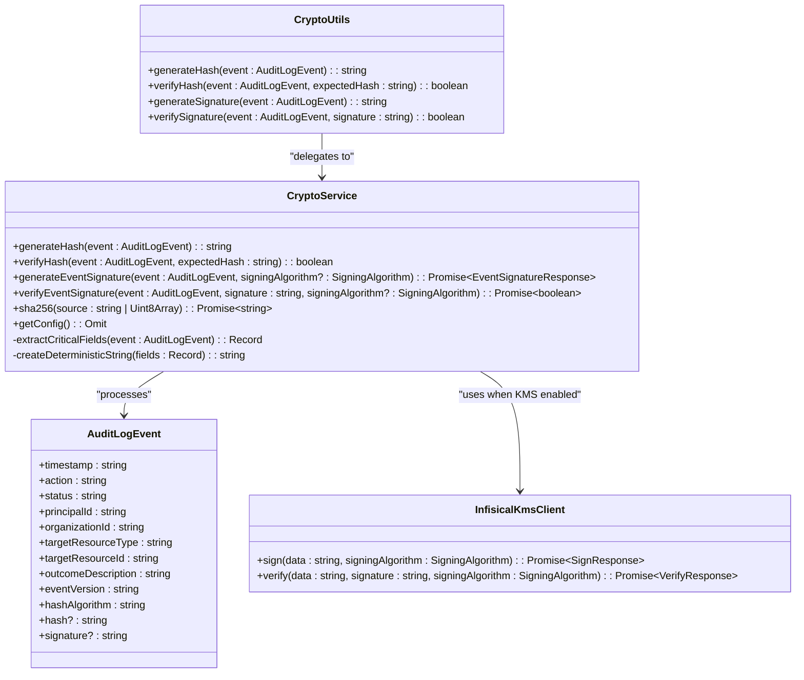
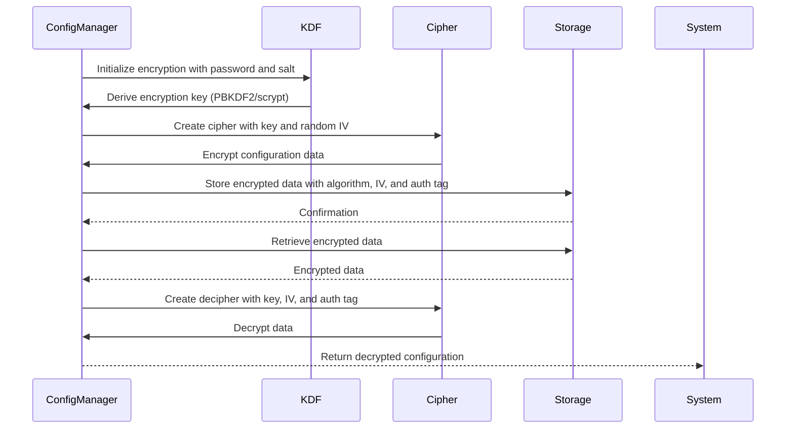

# Cryptography

<cite>
**Referenced Files in This Document**   
- [crypto.ts](file://packages/audit/src/crypto.ts) - *Updated in recent commit*
- [crypto.test.ts](file://packages/audit/src/__tests__/crypto.test.ts)
- [manager.ts](file://packages/audit/src/config/manager.ts)
- [types.ts](file://packages/audit/src/types.ts)
- [types.ts](file://packages/audit/src/config/types.ts)
- [audit.ts](file://packages/audit/src/audit.ts) - *Updated in recent commit*
- [client.ts](file://packages/infisical-kms/src/client.ts) - *KMS integration*
- [types.ts](file://packages/infisical-kms/src/types.ts) - *KMS types*
</cite>

## Update Summary
- Added documentation for async event signature generation with KMS algorithms
- Updated Secure Hashing Algorithms section to include KMS integration
- Enhanced HMAC-SHA256 Signatures section with KMS support details
- Updated Cryptographic Operations Examples with KMS usage scenarios
- Added integration details with Infisical KMS service
- Updated section sources to reflect new file references

## Table of Contents
1. [Introduction](#introduction)
2. [Secure Hashing Algorithms](#secure-hashing-algorithms)
3. [Async SHA-256 Base64 Encoding](#async-sha-256-base64-encoding)
4. [Secure Random Value Generation](#secure-random-value-generation)
5. [Encryption and Decryption Utilities](#encryption-and-decryption-utilities)
6. [Cryptographic Operations Examples](#cryptographic-operations-examples)
7. [Integration with Security Components](#integration-with-security-components)
8. [Best Practices](#best-practices)
9. [Configuration Options](#configuration-options)

## Introduction
The Cryptography module provides essential security services for the audit logging system, ensuring data integrity, confidentiality, and authenticity. This document details the implementation of cryptographic functions used throughout the system, with a focus on secure hashing, random value generation, encryption, and their integration with other security components. The primary implementation is located in `crypto.ts`, with comprehensive test coverage in `crypto.test.ts` that demonstrates various usage scenarios and edge cases.

## Secure Hashing Algorithms

The cryptographic system implements SHA-256 hashing for audit event integrity verification. The `CryptoService` class provides a robust implementation that ensures consistent hashing regardless of object property order through deterministic string representation.



**Diagram sources**
- [crypto.ts](file://packages/audit/src/crypto.ts#L1-L384)
- [types.ts](file://packages/infisical-kms/src/types.ts#L1-L57)

**Section sources**   
- [crypto.ts](file://packages/audit/src/crypto.ts#L1-L384)
- [crypto.test.ts](file://packages/audit/src/__tests__/crypto.test.ts#L0-L460)

### Hash Generation Process
The hash generation process follows these steps:
1. Extract critical fields from the audit event
2. Create a deterministic string representation by sorting keys alphabetically
3. Generate SHA-256 hash of the deterministic string

The `extractCriticalFields` method identifies essential fields for integrity verification:
- timestamp
- action
- status
- principalId
- organizationId
- targetResourceType
- targetResourceId
- outcomeDescription

The `createDeterministicString` method ensures consistent hashing by:
- Sorting object keys alphabetically
- Creating key-value pairs in sorted order
- Joining pairs with a pipe (|) separator

This approach prevents hash inconsistencies due to different object property ordering in JavaScript.

### HMAC-SHA256 Signatures
The system implements HMAC-SHA256 signatures for additional security through secret key authentication. The signature generation process:
1. First generates the SHA-256 hash of the event
2. Creates an HMAC signature using the hash and secret key
3. Returns the signature as a hexadecimal string

This two-layer approach (hash + HMAC) provides both data integrity and authentication, ensuring that only parties with the secret key can generate valid signatures.

**Updated** Added support for KMS-based signatures

When KMS is enabled in the configuration, the system uses the Infisical KMS service for signing operations:
- Uses `InfisicalKmsClient` to sign event hashes
- Supports multiple signing algorithms including RSASSA-PSS and RSASSA-PKCS1
- Returns both signature and algorithm information in `EventSignatureResponse`

The KMS integration provides enhanced security by:
- Using hardware security modules (HSMs) for key storage
- Supporting stronger asymmetric algorithms
- Centralized key management
- Audit trails for cryptographic operations

**Section sources**
- [crypto.ts](file://packages/audit/src/crypto.ts#L150-L218)
- [client.ts](file://packages/infisical-kms/src/client.ts#L15-L145)
- [types.ts](file://packages/infisical-kms/src/types.ts#L1-L57)

## Async SHA-256 Base64 Encoding
The system has been extended with an async SHA-256 hashing method that returns results in RFC4648-compliant base64 encoding. This implementation leverages the Web Crypto API for enhanced security and performance.

**Updated** Added documentation for the new async sha256 method

```typescript
/**
 * Generate a base64 string from a Uint8Array
 * @param source string or Uint8Array to hash
 * @returns base64 string
 */
async sha256(source: string | Uint8Array): Promise<string> {
    const buf = typeof source === 'string' ? new TextEncoder().encode(source) : source

    const hash = await crypto.subtle.digest('sha-256', buf)
    return this.b64(hash)
}
```

The implementation uses the following components:
- **Web Crypto API**: Uses `crypto.subtle.digest()` for secure hashing operations
- **RFC4648 Base64 Encoding**: Implements standard-compliant base64 encoding through the `b64()` method
- **TextEncoder**: Converts string input to Uint8Array for consistent processing

The `b64()` method provides RFC4648-compliant base64 encoding:
```typescript
/**
 * CREDIT: https://gist.github.com/enepomnyaschih/72c423f727d395eeaa09697058238727
 * Encodes a given Uint8Array, ArrayBuffer or string into RFC4648 base64 representation
 * @param data
 * @returns
 */
private b64(data: ArrayBuffer | string): string {
    // Implementation details...
}
```

**Section sources**   
- [crypto.ts](file://packages/audit/src/crypto.ts#L300-L340) - *Updated in recent commit*

## Secure Random Value Generation

The system generates secure random values for cryptographic operations using Node.js's built-in `crypto.randomBytes()` function. This cryptographically secure pseudorandom number generator (CSPRNG) is used for:

1. **Default secret key generation**: When no secret key is provided via environment variables, the system generates a 32-byte random secret using `randomBytes(32).toString('hex')`.

2. **Initialization vectors (IVs)**: Used in encryption operations to ensure that identical plaintexts produce different ciphertexts.

The `generateDefaultSecret()` function serves as a fallback mechanism:
```typescript
export function generateDefaultSecret(): string {
	console.warn(
		'[CryptoService] No AUDIT_CRYPTO_SECRET provided, generating random secret. This should be set in production.'
	)
	return randomBytes(32).toString('hex')
}
```

This function includes a warning to alert developers that a randomly generated secret is being used, which should be replaced with a securely managed secret in production environments.

**Section sources**
- [crypto.ts](file://packages/audit/src/crypto.ts#L25-L35)
- [crypto.test.ts](file://packages/audit/src/__tests__/crypto.test.ts#L0-L460)

## Encryption and Decryption Utilities

The system provides encryption and decryption utilities for protecting sensitive audit data at rest. These utilities are implemented in the `ConfigManager` class, which handles secure storage of configuration data.



**Diagram sources**
- [manager.ts](file://packages/audit/src/config/manager.ts#L510-L641)

**Section sources**
- [manager.ts](file://packages/audit/src/config/manager.ts#L510-L641)

### Key Derivation
The system uses key derivation functions (KDFs) to transform passwords into encryption keys:
- **PBKDF2**: Configurable with iterations and SHA-256 hashing
- **scrypt**: Memory-hard function providing additional protection against brute force attacks

The key derivation process:
1. Takes a password from the `AUDIT_CONFIG_PASSWORD` environment variable
2. Uses a configured salt value
3. Applies the selected KDF to derive a 32-byte encryption key

### Encryption Process
The encryption process uses AES-256 in either GCM or CBC mode:
- **AES-256-GCM**: Provides authenticated encryption with associated data (AEAD)
- **AES-256-CBC**: Cipher Block Chaining mode

For GCM mode, the system stores the authentication tag to verify ciphertext integrity during decryption.

## Cryptographic Operations Examples

The test suite in `crypto.test.ts` provides comprehensive examples of cryptographic operations under various scenarios.

### Hash Generation and Verification
```typescript
// Generate hash for audit event
const hash = cryptoService.generateHash(sampleEvent)

// Verify hash
const isValid = cryptoService.verifyHash(sampleEvent, hash)
```

The tests demonstrate:
- Consistent hash generation for identical events
- Different hashes for modified events
- Graceful error handling for verification failures

### Signature Operations
```typescript
// Generate signature
const signatureResponse = await cryptoService.generateEventSignature(sampleEvent)

// Verify signature
const isValid = await cryptoService.verifyEventSignature(sampleEvent, signatureResponse.signature)
```

The tests verify:
- Consistent signature generation with the same secret key
- Different signatures with different secret keys
- Rejection of signatures when the event is tampered with
- Proper handling of KMS-based signatures when enabled

### Async SHA-256 Base64 Usage
```typescript
// Generate SHA-256 hash in base64 format
const base64Hash = await cryptoService.sha256('sample data')

// Verify the base64 hash format
expect(base64Hash).toMatch(/^[A-Za-z0-9+/]+={0,2}$/)
```

The tests validate:
- Proper RFC4648 base64 encoding
- Consistent results for identical inputs
- Support for both string and Uint8Array inputs
- Error handling for invalid inputs

### KMS Integration Testing
```typescript
// Test KMS signature generation
const config = {
    security: {
        enableEventSigning: true,
        kms: {
            enabled: true,
            baseUrl: 'https://kms.example.com',
            encryptionKey: 'enc-key-123',
            signingKey: 'sign-key-456',
            accessToken: 'token-789'
        }
    }
}
const cryptoService = new CryptoService(config.security)
const signatureResponse = await cryptoService.generateEventSignature(event)
expect(signatureResponse.algorithm).toBe('RSASSA_PSS_SHA_256')
```

The tests validate:
- Proper initialization of InfisicalKmsClient
- Successful signature generation via KMS
- Correct verification of KMS-generated signatures
- Error handling for KMS connection failures

**Section sources**
- [crypto.test.ts](file://packages/audit/src/__tests__/crypto.test.ts#L0-L460)
- [audit.ts](file://packages/audit/src/audit.ts#L150-L200)

## Integration with Security Components

The cryptographic system integrates with various security components to provide comprehensive protection.

### Authentication Integration
The cryptographic utilities are used to verify the integrity of authentication-related audit events:
- User login/logout events
- Password change operations
- Session creation/destruction

The HMAC signatures ensure that these critical security events cannot be tampered with, providing an additional layer of protection beyond simple hashing.

### Session Management
While not directly handling session data, the cryptographic system protects audit logs of session management operations. This ensures that any attempt to manipulate session-related audit records can be detected.

### Secure Logging
The system provides end-to-end protection for audit logs:
1. Events are hashed upon creation
2. Events are signed with HMAC
3. Configuration data is encrypted at rest
4. Integrity is verified before processing

This multi-layered approach ensures the authenticity and integrity of the entire audit trail.

**Section sources**
- [crypto.ts](file://packages/audit/src/crypto.ts#L1-L384)
- [manager.ts](file://packages/audit/src/config/manager.ts#L510-L641)
- [audit.ts](file://packages/audit/src/audit.ts#L150-L200)

## Best Practices

### Key Storage
The system follows best practices for key storage:
- **Environment variables**: The primary method for providing the AUDIT_CRYPTO_SECRET
- **Secure configuration storage**: Configuration files can be encrypted using a separate password
- **Key derivation**: Uses PBKDF2 or scrypt to derive encryption keys from passwords
- **Salt usage**: Configurable salt values prevent rainbow table attacks
- **KMS integration**: For production environments, use Infisical KMS for hardware-backed key storage

The system warns when using generated secrets instead of environment-provided secrets, encouraging proper key management in production.

### Algorithm Selection
The system uses industry-standard algorithms:
- **SHA-256**: For hashing, providing 256-bit security
- **HMAC-SHA256**: For message authentication
- **AES-256**: For encryption, available in GCM and CBC modes
- **PBKDF2/scrypt**: For key derivation
- **RSASSA-PSS/RSASSA-PKCS1**: For asymmetric signatures via KMS

These algorithms are configurable through the system's configuration, allowing for future updates as cryptographic standards evolve.

### Resistance to Attacks
The system provides protection against common attacks:
- **Brute force**: Mitigated through the use of strong algorithms and key derivation functions with configurable iteration counts
- **Rainbow table lookups**: Prevented through the use of salts in key derivation and the deterministic string representation that includes all critical fields
- **Tampering**: Detected through hash verification and HMAC signature validation
- **Replay attacks**: Mitigated through timestamp inclusion in the hashed data
- **Key compromise**: Reduced risk through KMS integration and hardware security modules

The deterministic string representation ensures that even if an attacker reorders JSON properties, the hash will remain the same, preventing this potential attack vector.

**Section sources**
- [crypto.ts](file://packages/audit/src/crypto.ts#L1-L384)
- [manager.ts](file://packages/audit/src/config/manager.ts#L510-L641)
- [types.ts](file://packages/audit/src/config/types.ts#L377-L444)

## Configuration Options

The cryptographic system provides several configuration options for customizing behavior:

### Crypto Configuration
```typescript
interface CryptoConfig {
	hashAlgorithm: 'SHA-256'
	signatureAlgorithm: 'HMAC-SHA256'
	secretKey?: string
}
```

The default configuration uses SHA-256 for hashing and HMAC-SHA256 for signatures, with the secret key provided via environment variable or generated as a fallback.

### KMS Configuration
```typescript
interface KMSConfig {
	enabled: boolean
	baseUrl: string
	encryptionKey: string
	signingKey: string
	accessToken: string
	algorithm?: 'AES-256-GCM' | 'AES-256-CBC'
	kdf?: 'PBKDF2' | 'scrypt'
	salt?: string
	iterations?: number
}
```

When KMS is enabled, the system uses the Infisical KMS service for cryptographic operations, providing enhanced security through hardware security modules and centralized key management.

### Secure Storage Configuration
```typescript
interface SecureStorageConfig {
	enabled: boolean
	algorithm: 'AES-256-GCM' | 'AES-256-CBC'
	kdf: 'PBKDF2' | 'scrypt'
	salt: string
	iterations: number
}
```

This configuration allows customization of:
- Encryption algorithm selection
- Key derivation function choice
- Salt value for key derivation
- Iteration count for PBKDF2

### Performance Trade-offs
The system balances security strength with computational overhead:
- **Higher iteration counts** in PBKDF2 increase security but also computational cost
- **scrypt** provides better resistance to hardware-based attacks but requires more memory
- **AES-256-GCM** provides authenticated encryption but may have slightly higher overhead than CBC mode
- **KMS operations** introduce network latency but provide superior key security

Administrators can adjust these parameters based on their security requirements and performance constraints, with higher values providing greater security at the cost of increased processing time.

**Section sources**
- [crypto.ts](file://packages/audit/src/crypto.ts#L1-L384)
- [manager.ts](file://packages/audit/src/config/manager.ts#L510-L641)
- [types.ts](file://packages/audit/src/config/types.ts#L377-L444)