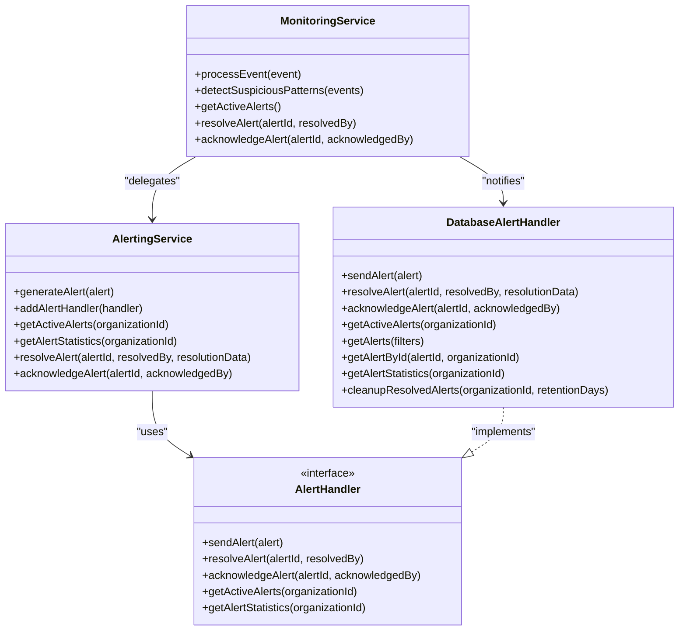
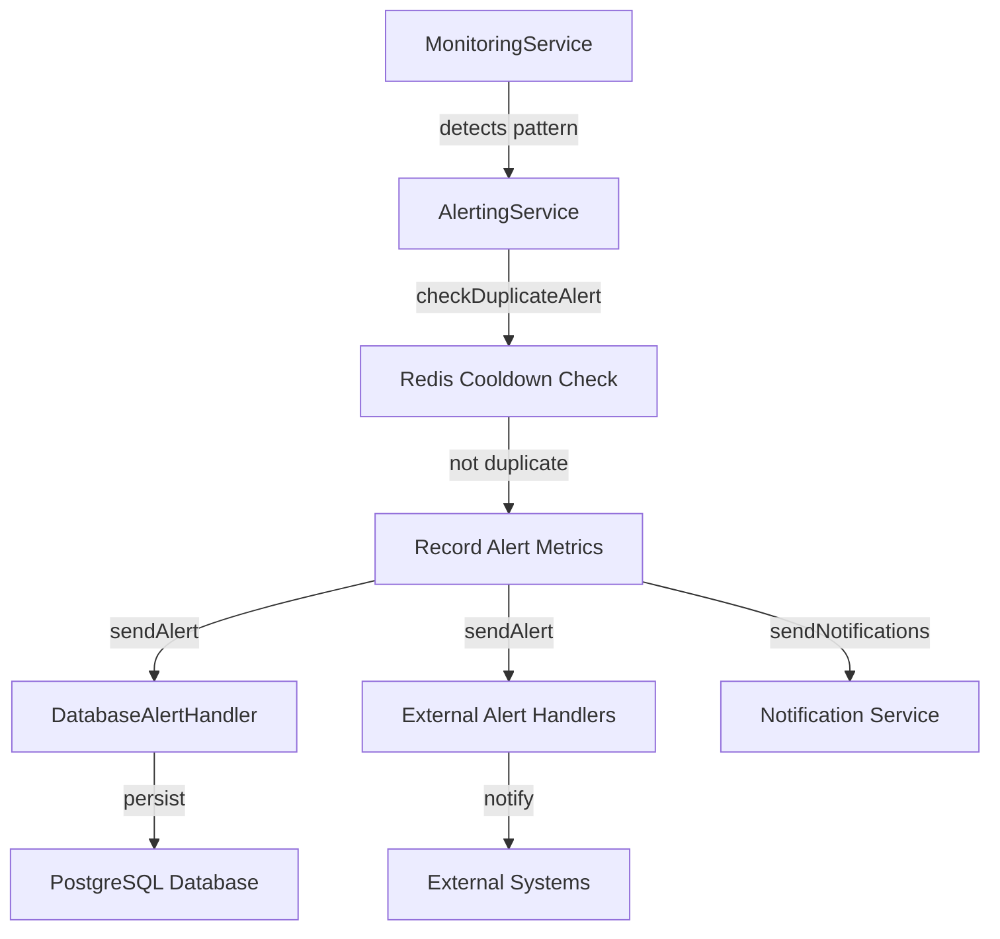
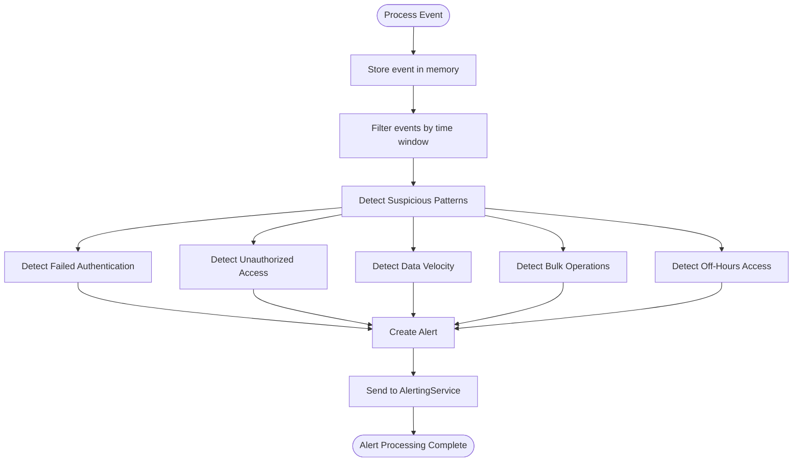
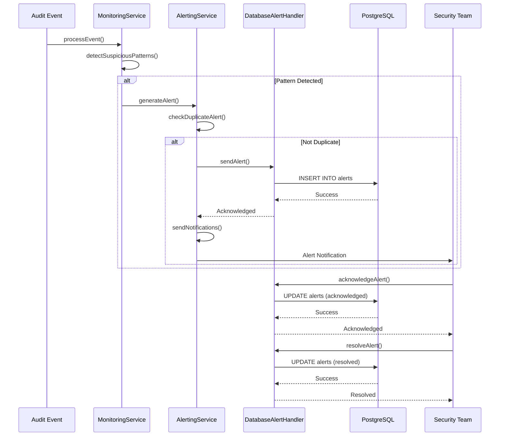
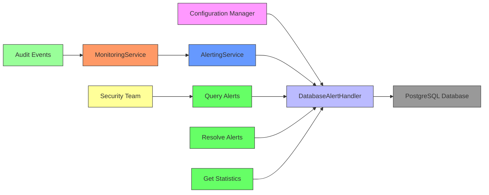

# Database Security Alerting

<cite>
**Referenced Files in This Document**   
- [database-alert-handler.ts](file://packages/audit/src/monitor/database-alert-handler.ts) - *Updated in recent commit*
- [database-alert-handler.test.ts](file://packages/audit/src/__tests__/database-alert-handler.test.ts)
- [monitoring.ts](file://packages/audit/src/monitor/monitoring.ts) - *Refactored to use AlertingService*
- [alerting.ts](file://packages/audit/src/monitor/alerting.ts) - *New AlertingService implementation*
- [database-alert-integration.ts](file://packages/audit/src/examples/database-alert-integration.ts) - *Updated in recent commit*
- [manager.ts](file://packages/audit/src/config/manager.ts) - *Configuration management*
- [index.ts](file://packages/audit-db/src/db/index.ts) - *EnhancedAuditDb client*
- [connection.ts](file://packages/redis-client/src/connection.ts) - *Redis connection management*
- [permissions.ts](file://packages/auth/src/permissions.ts) - *Redis caching for authorization and role management*
- [context.ts](file://apps/server/src/lib/hono/context.ts) - *Service context with AlertingService*
- [init.ts](file://apps/server/src/lib/hono/init.ts) - *Initialization with AlertingService*
</cite>

## Update Summary
**Changes Made**   
- Updated the Core Components section to reflect the refactoring of alert handling to AlertingService
- Added new section for AlertingService architecture and responsibilities
- Updated the Alert Lifecycle and Notification Flow section to show the new service interaction
- Modified the Real-World Deployment Example to reflect the new service context initialization
- Added documentation for the new service initialization pattern in the server
- Updated section sources to reflect the new files analyzed
- Removed outdated references to direct alert handling in MonitoringService

## Table of Contents
1. [Introduction](#introduction)
2. [Core Components](#core-components)
3. [Alerting Service Architecture](#alerting-service-architecture)
4. [Detection Logic and Pattern Recognition](#detection-logic-and-pattern-recognition)
5. [Threshold Configurations and Sensitivity Settings](#threshold-configurations-and-sensitivity-settings)
6. [Alert Lifecycle and Notification Flow](#alert-lifecycle-and-notification-flow)
7. [False Positive Reduction and Correlation Rules](#false-positive-reduction-and-correlation-rules)
8. [Integration with External Alerting Services](#integration-with-external-alerting-services)
9. [Performance Considerations for High-Volume Monitoring](#performance-considerations-for-high-volume-monitoring)
10. [Configuration Guidance and Customization](#configuration-guidance-and-customization)
11. [Real-World Deployment Example](#real-world-deployment-example)

## Introduction
The Database Security Alerting system provides comprehensive monitoring of database activities to detect and respond to suspicious patterns such as unauthorized access attempts, anomalous query volumes, and schema changes. Built as part of a multi-organizational audit system, this solution combines real-time pattern detection with persistent alert storage and management. The system is designed to identify potential security incidents through configurable thresholds and correlation rules, while minimizing false positives through intelligent deduplication and organizational isolation. This document details the architecture, detection mechanisms, and operational characteristics of the alerting system, providing guidance for customization and deployment in production environments.

## Core Components

The Database Security Alerting system consists of three primary components: the `MonitoringService` responsible for detecting suspicious patterns in audit events, the `AlertingService` that manages alert generation and distribution, and the `DatabaseAlertHandler` that persists alerts to a PostgreSQL database with multi-organizational support. The `MonitoringService` analyzes incoming audit events against configurable thresholds to identify potential security incidents, while the `AlertingService` coordinates alert handling across multiple handlers. The `DatabaseAlertHandler` implements the `AlertHandler` interface to store alerts with full organizational isolation, enabling secure multi-tenancy.



**Diagram sources**
- [monitoring.ts](file://packages/audit/src/monitor/monitoring.ts)
- [alerting.ts](file://packages/audit/src/monitor/alerting.ts)
- [database-alert-handler.ts](file://packages/audit/src/monitor/database-alert-handler.ts)

**Section sources**
- [monitoring.ts](file://packages/audit/src/monitor/monitoring.ts#L49-L1025)
- [alerting.ts](file://packages/audit/src/monitor/alerting.ts#L6-L297)
- [database-alert-handler.ts](file://packages/audit/src/monitor/database-alert-handler.ts#L1-L451)

## Alerting Service Architecture

The `AlertingService` has been introduced as part of a refactoring effort to separate alert handling concerns from the `MonitoringService`. This service is responsible for managing the lifecycle of alerts, including generation, deduplication, distribution to handlers, and notification delivery. The separation of concerns allows for more flexible alert handling configurations and easier integration with external systems.

### Service Responsibilities
The `AlertingService` has several key responsibilities:

**: Alert Generation**
- Receives alert candidates from the `MonitoringService`
- Performs duplicate detection using Redis-based cooldown mechanism
- Generates unique alert identifiers and timestamps
- Records alert generation metrics

**: Alert Distribution**
- Maintains a registry of `AlertHandler` implementations
- Distributes alerts to all registered handlers
- Handles errors in individual handlers without affecting overall alert processing
- Supports multiple handlers for different persistence and notification mechanisms

**: Alert Management**
- Provides methods for retrieving active alerts with optional filtering
- Manages alert statistics by severity, type, and source
- Handles alert resolution and acknowledgment workflows
- Supports alert dismissal functionality

**: Notification Handling**
- Sends notifications based on alert severity
- Implements different notification strategies for critical vs. non-critical alerts
- Integrates with external notification systems through configurable endpoints
- Logs notification events for audit purposes

### Service Initialization
The `AlertingService` is initialized with the same configuration as the `MonitoringService` and shares the same metrics collector and logger instances. During initialization, it automatically registers the `DatabaseAlertHandler` as the primary alert handler, ensuring that all generated alerts are persisted to the database.



**Diagram sources**
- [alerting.ts](file://packages/audit/src/monitor/alerting.ts#L6-L297)
- [init.ts](file://apps/server/src/lib/hono/init.ts#L300-L320)

**Section sources**
- [alerting.ts](file://packages/audit/src/monitor/alerting.ts#L6-L297)
- [init.ts](file://apps/server/src/lib/hono/init.ts#L300-L320)

## Detection Logic and Pattern Recognition

The `MonitoringService` employs multiple detection algorithms to identify suspicious database activities. These algorithms analyze audit events for specific patterns that may indicate security threats. The detection logic is implemented through several specialized methods that examine different types of suspicious behavior.



**Diagram sources**
- [monitoring.ts](file://packages/audit/src/monitor/monitoring.ts#L49-L1025)

**Section sources**
- [monitoring.ts](file://packages/audit/src/monitor/monitoring.ts#L49-L1025)

### Failed Authentication Detection
The system detects failed authentication attempts by monitoring events with action types containing 'auth.login.failure' and a failure status. It groups these events by principal ID or IP address and triggers an alert when the number of failed attempts exceeds the configured threshold within the specified time window. This helps identify potential brute force attacks or credential stuffing attempts.

### Unauthorized Access Detection
Unauthorized access attempts are identified by filtering events with a failure status and outcome descriptions containing terms like 'unauthorized', 'access denied', or 'forbidden'. The system groups these events by principal ID and generates a critical severity alert when the threshold is exceeded, indicating potential privilege escalation attempts or unauthorized data access.

### High-Velocity Data Access Detection
The system monitors for anomalous data access patterns by tracking successful read operations (actions containing 'data.read' or 'fhir.'). When a principal performs a number of data access operations exceeding the velocity threshold within the configured time window, a medium severity alert is generated. This helps detect potential data exfiltration attempts or automated scraping activities.

### Bulk Operation Detection
Bulk operations such as data exports, imports, or bulk updates are detected by monitoring actions containing 'data.export', 'data.import', or 'bulk', or by identifying events with a record count greater than 10. When the number of such operations exceeds the threshold within the time window, a medium severity alert is triggered, helping to identify potential bulk data manipulation or export activities.

### Off-Hours Access Detection
The system identifies data access during off-hours by checking the hour component of event timestamps against the configured off-hours window (default: 10 PM to 6 AM). Successful data access operations during these hours trigger a low severity alert, which may indicate legitimate after-hours work or potential unauthorized access by compromised accounts.

## Threshold Configurations and Sensitivity Settings

The detection system uses configurable thresholds to determine when suspicious patterns should generate alerts. These thresholds are defined in the `PatternDetectionConfig` interface and can be customized to match organizational security policies and risk tolerance.


**Diagram sources**
- [monitoring.ts](file://packages/audit/src/monitor/monitoring.ts#L28-L64)
- [monitoring-types.ts](file://packages/audit/src/monitor/monitoring-types.ts#L1-L198)

**Section sources**
- [monitoring.ts](file://packages/audit/src/monitor/monitoring.ts#L28-L64)
- [monitoring-types.ts](file://packages/audit/src/monitor/monitoring-types.ts#L1-L198)

### Default Threshold Values
The system provides sensible default values for all detection thresholds:

**: Failed Authentication**
- **Threshold**: 5 attempts
- **Time Window**: 5 minutes
- **Severity**: HIGH

**: Unauthorized Access**
- **Threshold**: 3 attempts
- **Time Window**: 10 minutes
- **Severity**: CRITICAL

**: Data Access Velocity**
- **Threshold**: 50 operations
- **Time Window**: 1 minute
- **Severity**: MEDIUM

**: Bulk Operations**
- **Threshold**: 100 operations
- **Time Window**: 5 minutes
- **Severity**: MEDIUM

**: Off-Hours Access**
- **Start Time**: 22:00 (10 PM)
- **End Time**: 06:00 (6 AM)
- **Severity**: LOW

These default values can be overridden by providing a custom configuration when instantiating the `MonitoringService`. Organizations can adjust these thresholds based on their specific security requirements, user behavior patterns, and risk tolerance.

## Alert Lifecycle and Notification Flow

The alert lifecycle begins with detection and ends with resolution, involving multiple stages of processing, notification, and state management. The system ensures that alerts are properly tracked, deduplicated, and persisted throughout their lifecycle.



**Diagram sources**
- [monitoring.ts](file://packages/audit/src/monitor/monitoring.ts#L49-L1025)
- [alerting.ts](file://packages/audit/src/monitor/alerting.ts#L6-L297)
- [database-alert-handler.ts](file://packages/audit/src/monitor/database-alert-handler.ts#L1-L451)

**Section sources**
- [monitoring.ts](file://packages/audit/src/monitor/monitoring.ts#L49-L1025)
- [alerting.ts](file://packages/audit/src/monitor/alerting.ts#L6-L297)
- [database-alert-handler.ts](file://packages/audit/src/monitor/database-alert-handler.ts#L1-L451)

### Alert Generation
When the `MonitoringService` detects a suspicious pattern, it creates an alert with detailed metadata including the pattern type, event count, and relevant contextual information. The alert is then passed to the `AlertingService` which checks for duplicates using an alert hash based on the source, title, and severity. This deduplication mechanism prevents alert fatigue by suppressing identical alerts within a 5-minute cooldown period.

### Alert Persistence
The `DatabaseAlertHandler` persists alerts to a PostgreSQL database with comprehensive organizational isolation. Each alert is stored with its full metadata, including organization ID, severity, type, and resolution status. The handler ensures that all operations are scoped to the appropriate organization, preventing cross-organizational data access.

### Alert Resolution and Acknowledgment
The system supports both acknowledgment and resolution of alerts. Acknowledgment indicates that a security team member has seen the alert, while resolution indicates that the issue has been addressed. Both operations update the alert record in the database with timestamps and the identity of the user who performed the action, providing an audit trail for security operations.

## False Positive Reduction and Correlation Rules

The system employs several strategies to minimize false positives and ensure that alerts represent genuine security concerns. These mechanisms help reduce alert fatigue and improve the signal-to-noise ratio in security monitoring.

### Duplicate Alert Suppression
The system implements a cooldown mechanism to prevent duplicate alerts. When an alert is generated, a hash is created from its source, title, and severity. This hash is stored in Redis with a 5-minute TTL. Subsequent alerts with the same hash are suppressed during this period, preventing multiple notifications for the same issue.

### Organizational Isolation
The `DatabaseAlertHandler` enforces strict organizational isolation by requiring an organization ID in the alert metadata. All queries and operations are scoped to the specified organization, ensuring that alerts from one organization cannot be accessed by users from another organization. This prevents false positives arising from cross-organizational data leakage.

### Contextual Pattern Detection
The detection algorithms consider multiple contextual factors when identifying suspicious patterns. For example, failed authentication attempts are grouped by principal ID or IP address, allowing the system to distinguish between a legitimate user with a forgotten password and a genuine brute force attack. Similarly, data access patterns are analyzed by principal and resource type, providing more accurate context for anomaly detection.

### Severity-Based Notification
The system uses different notification strategies based on alert severity. Critical alerts trigger immediate notifications with higher priority, while lower severity alerts may be batched or delivered through less intrusive channels. This ensures that security teams can focus on the most pressing issues without being overwhelmed by lower-priority notifications.

## Integration with External Alerting Services

The modular design of the alerting system allows for integration with various external alerting services through the `AlertHandler` interface. While the `DatabaseAlertHandler` provides persistent storage, additional handlers can be implemented to integrate with popular alerting platforms.

### Handler Interface
The `AlertHandler` interface defines the contract for alert handling components:

**: AlertHandler Interface**
- **sendAlert(alert)**: Called when a new alert is generated
- **resolveAlert(alertId, resolvedBy)**: Called when an alert is resolved
- **acknowledgeAlert(alertId, acknowledgedBy)**: Called when an alert is acknowledged
- **getActiveAlerts(organizationId)**: Retrieves currently active alerts for an organization
- **getAlertStatistics(organizationId)**: Provides alert statistics by severity and type for an organization

Multiple handlers can be registered with the `AlertingService`, allowing alerts to be sent to multiple destinations simultaneously. For example, an organization might use both the `DatabaseAlertHandler` for persistent storage and a `SlackAlertHandler` for real-time notifications.

### Example Integration Points
Potential integration points for external alerting services include:

- **Email Notifications**: Send email alerts to security teams using the `send-mail` package
- **Slack/Microsoft Teams**: Post alerts to collaboration channels with rich formatting
- **PagerDuty/ServiceNow**: Create incidents in IT service management systems
- **SIEM Integration**: Forward alerts to security information and event management platforms
- **Webhooks**: Send alerts to custom endpoints for further processing

## Performance Considerations for High-Volume Monitoring

The system is designed to handle high-volume transaction environments while maintaining performance and responsiveness. Several optimization strategies are employed to ensure efficient operation under heavy load.

### Memory Management
The `MonitoringService` maintains a rolling window of recent events in memory for pattern detection. Events older than the maximum time window (determined by the longest configured window) are automatically filtered out. This prevents unbounded memory growth and ensures that the system can operate efficiently over extended periods.

### Database Query Optimization
The `DatabaseAlertHandler` uses several techniques to optimize database performance:

- **Parameterized Queries**: All database operations use parameterized queries to prevent SQL injection and improve query plan caching
- **Index Utilization**: The alerts table should be indexed on organization_id, severity, type, and timestamp fields to support efficient querying
- **Caching**: Frequently accessed data such as alert statistics are cached using Redis to reduce database load
- **Batch Operations**: Where possible, operations are batched to minimize round trips to the database

### Asynchronous Processing
All alert handling operations are performed asynchronously, ensuring that the main event processing pipeline is not blocked by potentially slow operations like database writes or external notifications. This allows the system to maintain high throughput even when downstream systems are experiencing latency.

### Scalability
The system can be scaled horizontally by deploying multiple instances of the `MonitoringService` behind a load balancer. Each instance can process events independently, with alerts being stored in a shared database. This architecture allows the system to handle increasing event volumes by simply adding more processing nodes.

## Configuration Guidance and Customization

The alerting system provides extensive configuration options to tailor its behavior to specific organizational requirements. These configurations can be adjusted to balance security sensitivity with operational efficiency.

### Customizing Detection Rules
Organizations can customize the detection rules by providing a custom `PatternDetectionConfig` when instantiating the `MonitoringService`:

```typescript
const customConfig = {
  failedAuthThreshold: 3,
  failedAuthTimeWindow: 3 * 60 * 1000, // 3 minutes
  unauthorizedAccessThreshold: 2,
  unauthorizedAccessTimeWindow: 5 * 60 * 1000, // 5 minutes
  dataAccessVelocityThreshold: 25,
  dataAccessTimeWindow: 30 * 1000, // 30 seconds
  bulkOperationThreshold: 50,
  bulkOperationTimeWindow: 2 * 60 * 1000, // 2 minutes
  offHoursStart: 20, // 8 PM
  offHoursEnd: 7, // 7 AM
};

const monitoringService = new MonitoringService(customConfig);
```

### Response Action Customization
The system supports custom response actions through the implementation of additional `AlertHandler` classes. Organizations can create handlers that perform specific actions when alerts are generated, such as:

- Automatically blocking IP addresses after multiple failed authentication attempts
- Temporarily suspending user accounts after unauthorized access attempts
- Triggering additional security checks or multi-factor authentication challenges
- Integrating with incident response workflows

### Sensitivity Level Adjustment
The sensitivity of the detection system can be adjusted by modifying the threshold values. Lower thresholds increase sensitivity but may result in more false positives, while higher thresholds reduce sensitivity but may miss subtle attack patterns. Organizations should tune these values based on their risk tolerance and historical attack patterns.

## Real-World Deployment Example

The `database-alert-integration.ts` example demonstrates a complete real-world deployment of the Database Security Alerting system. This example shows how to set up monitoring with database alert persistence, process audit events, and manage alerts in a multi-organizational environment.



**Updated** The diagram has been updated to reflect the new configuration management system, the use of EnhancedAuditDb client, and the introduction of AlertingService.

**Diagram sources**
- [database-alert-integration.ts](file://packages/audit/src/examples/database-alert-integration.ts#L1-L283)
- [manager.ts](file://packages/audit/src/config/manager.ts#L33-L843)
- [index.ts](file://packages/audit-db/src/db/index.ts#L160-L222)
- [connection.ts](file://packages/redis-client/src/connection.ts#L73-L135)
- [init.ts](file://apps/server/src/lib/hono/init.ts#L300-L320)

**Section sources**
- [database-alert-integration.ts](file://packages/audit/src/examples/database-alert-integration.ts#L1-L283)
- [manager.ts](file://packages/audit/src/config/manager.ts#L33-L843)
- [index.ts](file://packages/audit-db/src/db/index.ts#L160-L222)
- [connection.ts](file://packages/redis-client/src/connection.ts#L73-L135)
- [init.ts](file://apps/server/src/lib/hono/init.ts#L300-L320)

### Integration Example Walkthrough
The example demonstrates several key aspects of real-world deployment:

1. **Setup**: The `setupMonitoringWithDatabaseAlerts` function now uses a `ConfigurationManager` to centralize configuration management, replaces direct database connection with the `EnhancedAuditDb` client, improves Redis integration and error handling, and properly initializes the `AlertingService`.

2. **Event Processing**: The `processAuditEventsWithAlerts` function simulates suspicious activity (multiple failed login attempts) and processes these events through the monitoring service, demonstrating how alerts are automatically generated and passed to the `AlertingService`.

3. **Alert Management**: The example shows how to retrieve active alerts, resolve alerts with resolution notes, and obtain alert statistics for reporting and analysis through the `AlertingService` interface.

4. **Multi-Organizational Isolation**: The `demonstrateMultiOrganizationalIsolation` function verifies that alerts from one organization cannot be accessed by another organization, ensuring data privacy and compliance.

5. **Maintenance Operations**: The `demonstrateAlertMaintenance` function shows how to clean up old resolved alerts based on retention policies, helping to manage database size and performance.

This comprehensive example provides a blueprint for integrating the Database Security Alerting system into production environments, demonstrating best practices for configuration, usage, and maintenance with the updated architecture.