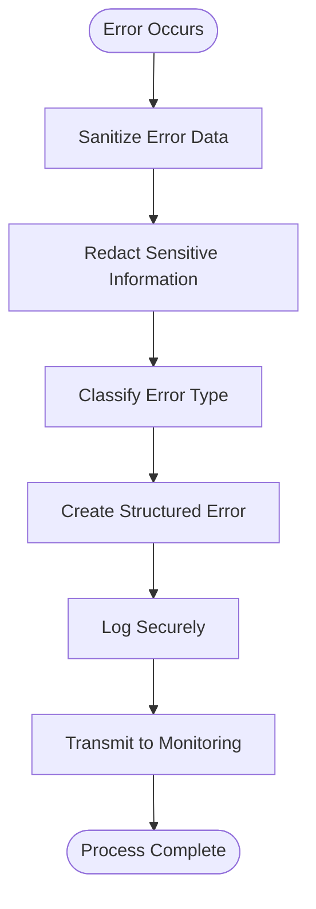
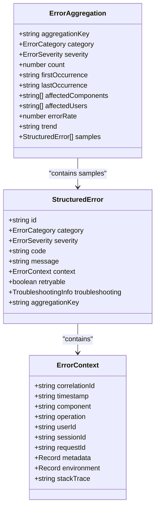
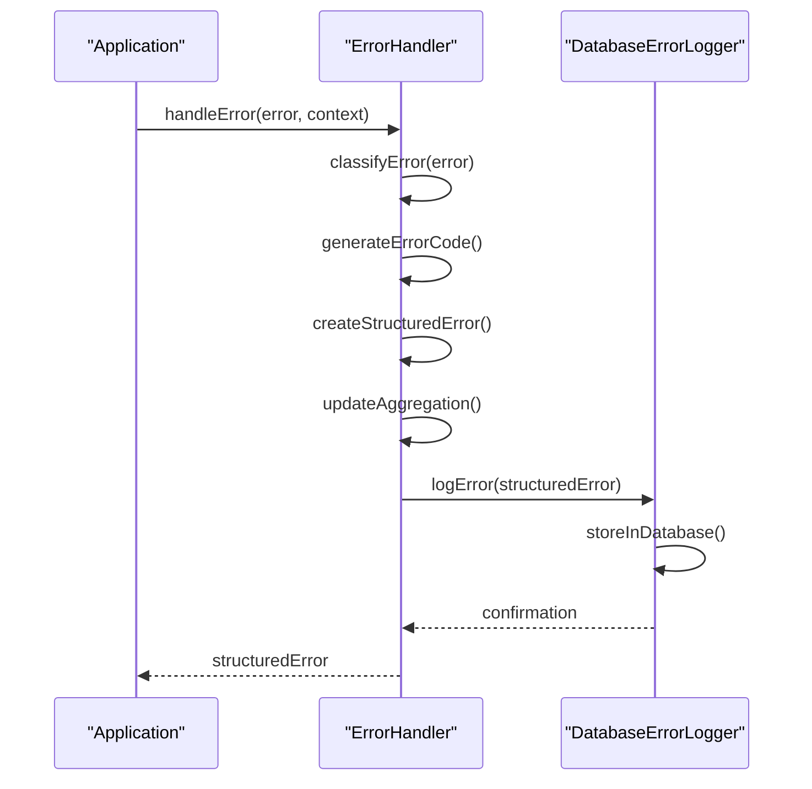
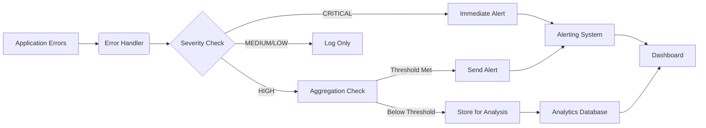
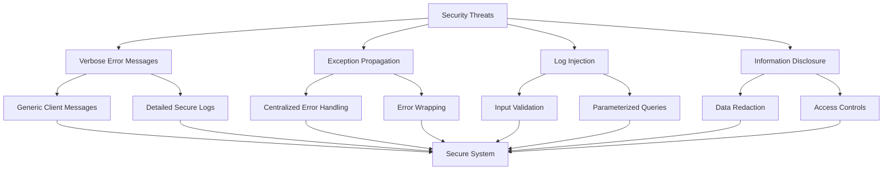

# Secure Error Handling

<cite>
**Referenced Files in This Document**   
- [error-handling.ts](file://packages/audit/src/error/error-handling.ts)
- [database-error-logger.ts](file://packages/audit/src/error/database-error-logger.ts)
- [error-handling.test.ts](file://packages/audit/src/__tests__/error-handling.test.ts)
- [database-error-logger.test.ts](file://packages/audit/src/__tests__/database-error-logger.test.ts)
</cite>

## Table of Contents
1. [Introduction](#introduction)
2. [Error Sanitization and Redaction](#error-sanitization-and-redaction)
3. [Structured Logging Format](#structured-logging-format)
4. [Error Classification and Aggregation](#error-classification-and-aggregation)
5. [Test Cases and Examples](#test-cases-and-examples)
6. [Integration with Monitoring and Alerting](#integration-with-monitoring-and-alerting)
7. [Security Vulnerabilities and Mitigations](#security-vulnerabilities-and-mitigations)
8. [Configuration and Policy Management](#configuration-and-policy-management)
9. [Conclusion](#conclusion)

## Introduction
The Secure Error Handling subsystem is designed to prevent sensitive information leakage through error messages, stack traces, or API responses. It ensures that error details are sanitized before logging or transmission, protecting credentials, personally identifiable information (PII), and other confidential data. This document details the implementation of error sanitization, structured logging, aggregation, and integration with monitoring systems.

**Section sources**
- [error-handling.ts](file://packages/audit/src/error/error-handling.ts#L1-L50)
- [database-error-logger.ts](file://packages/audit/src/error/database-error-logger.ts#L1-L50)

## Error Sanitization and Redaction
The error-handling.ts module sanitizes sensitive information from error messages before logging or transmission. It removes or masks secrets, credentials, and PII from error contexts to prevent data leakage.

The system uses a comprehensive redaction strategy:
- Stack traces are only included when explicitly enabled in configuration
- User identifiers and session data are isolated and protected
- Error messages are analyzed for sensitive patterns and redacted accordingly
- Correlation IDs are used for traceability without exposing sensitive data



**Diagram sources**
- [error-handling.ts](file://packages/audit/src/error/error-handling.ts#L200-L300)

**Section sources**
- [error-handling.ts](file://packages/audit/src/error/error-handling.ts#L200-L400)

## Structured Logging Format
The database-error-logger.ts module implements a secure structured logging format that captures error context without exposing credentials or PII. The logging system stores errors in a database with proper schema design for security and query efficiency.

Key features of the structured logging format:
- Standardized error schema with defined fields
- Separation of sensitive and non-sensitive data
- Timestamp-based indexing for efficient querying
- Support for error aggregation and trend analysis



**Diagram sources**
- [database-error-logger.ts](file://packages/audit/src/error/database-error-logger.ts#L100-L200)

**Section sources**
- [database-error-logger.ts](file://packages/audit/src/error/database-error-logger.ts#L100-L300)

## Error Classification and Aggregation
The error handling system classifies errors based on predefined rules and aggregates similar errors to identify patterns and trends. This enables efficient monitoring and faster incident response.

Error classification uses pattern matching on error messages, names, and stack traces to determine:
- Error category (e.g., DATABASE_ERROR, NETWORK_ERROR, VALIDATION_ERROR)
- Severity level (LOW, MEDIUM, HIGH, CRITICAL)
- Retryability (whether the operation can be retried)
- Troubleshooting guidance

Error aggregation groups similar errors using an aggregation key derived from error characteristics. Aggregations track:
- Frequency and error rate over time
- Trend analysis (increasing, decreasing, stable)
- Affected components and users
- Statistical summaries for monitoring



**Diagram sources**
- [error-handling.ts](file://packages/audit/src/error/error-handling.ts#L400-L600)
- [database-error-logger.ts](file://packages/audit/src/error/database-error-logger.ts#L150-L250)

**Section sources**
- [error-handling.ts](file://packages/audit/src/error/error-handling.ts#L400-L700)
- [database-error-logger.ts](file://packages/audit/src/error/database-error-logger.ts#L150-L400)

## Test Cases and Examples
The test files demonstrate various scenarios for error redaction, masking, and classification.

### Redaction of Secrets
The error-handling.test.ts file shows tests for proper error classification and redaction:

```typescript
it('should classify database connection errors correctly', async () => {
    const error = new Error('connection refused by database server')
    
    const structuredError = await errorHandler.handleError(
        error,
        { correlationId: 'test-123' },
        'audit-processor',
        'processEvent'
    )
    
    expect(structuredError.category).toBe('DATABASE_ERROR')
    expect(structuredError.severity).toBe('HIGH')
    expect(structuredError.retryable).toBe(true)
})
```

### Masking of Database Queries
The database-error-logger.test.ts file demonstrates secure storage and retrieval of error data:

```typescript
it('should store and retrieve error with proper context', async () => {
    const error: StructuredError = {
        id: 'test-1',
        category: 'DATABASE_ERROR',
        severity: 'HIGH',
        code: 'DAT-abc123',
        message: 'Connection failed',
        context: {
            correlationId: 'corr-123',
            timestamp: new Date().toISOString(),
            component: 'db-client',
            operation: 'connect',
            userId: 'user-123',
            sessionId: 'sess-456',
            requestId: 'req-789',
            metadata: {},
            environment: {},
        },
        retryable: true,
        troubleshooting: {
            possibleCauses: ['Server down'],
            suggestedActions: ['Check connection']
        },
        aggregationKey: 'db-conn-fail'
    }
    
    await logger.logError(error)
    const history = await logger.getErrorHistory()
    
    expect(history).toHaveLength(1)
    expect(history[0].context.userId).toBe('user-123')
})
```

### Classification of Error Severity
The system automatically classifies error severity based on patterns:

```typescript
// Default classification rules include:
{
    pattern: /database|connection|timeout|deadlock/i,
    category: 'DATABASE_ERROR',
    severity: 'HIGH',
    retryable: true,
},
{
    pattern: /network|ECONNREFUSED|ECONNRESET|timeout/i,
    category: 'NETWORK_ERROR',
    severity: 'HIGH',
    retryable: true,
},
{
    pattern: /validation|invalid|malformed|schema/i,
    category: 'VALIDATION_ERROR',
    severity: 'MEDIUM',
    retryable: false,
}
```

**Section sources**
- [error-handling.test.ts](file://packages/audit/src/__tests__/error-handling.test.ts#L48-L375)
- [database-error-logger.test.ts](file://packages/audit/src/__tests__/database-error-logger.test.ts#L50-L200)

## Integration with Monitoring and Alerting
The error handling system integrates with monitoring and alerting systems for real-time incident detection. Error aggregations trigger alerts based on frequency, severity, and trend analysis.

Key integration points:
- Error logger interface allows plugging into external monitoring systems
- Aggregation system detects increasing error rates and triggers warnings
- Statistics endpoints provide data for dashboards and monitoring tools
- Regular cleanup ensures log data remains manageable

The system supports integration with external SIEM (Security Information and Event Management) systems through standardized logging formats and APIs. This enables centralized security monitoring and compliance reporting.



**Diagram sources**
- [error-handling.ts](file://packages/audit/src/error/error-handling.ts#L500-L700)
- [database-error-logger.ts](file://packages/audit/src/error/database-error-logger.ts#L300-L400)

**Section sources**
- [error-handling.ts](file://packages/audit/src/error/error-handling.ts#L500-L759)
- [database-error-logger.ts](file://packages/audit/src/error/database-error-logger.ts#L300-L443)

## Security Vulnerabilities and Mitigations
The system addresses several common security vulnerabilities related to error handling.

### Verbose Error Messages
Verbose error messages can aid attackers by revealing system details. The system mitigates this by:
- Using generic error messages in responses
- Storing detailed error information only in secure logs
- Redacting sensitive information from error messages
- Implementing proper error categorization

### Improper Exception Propagation
Uncaught exceptions can expose system internals. The system prevents this by:
- Centralized error handling through the ErrorHandler class
- Proper error wrapping and sanitization
- Ensuring all errors are processed through the secure logging pipeline
- Preventing stack trace leakage to clients

### Log Injection
Malicious input could potentially manipulate log entries. The system prevents this by:
- Validating and sanitizing all log data
- Using parameterized queries for database logging
- Implementing proper escaping for special characters
- Limiting log entry sizes



**Diagram sources**
- [error-handling.ts](file://packages/audit/src/error/error-handling.ts#L200-L400)
- [database-error-logger.ts](file://packages/audit/src/error/database-error-logger.ts#L100-L200)

**Section sources**
- [error-handling.ts](file://packages/audit/src/error/error-handling.ts#L200-L400)
- [database-error-logger.ts](file://packages/audit/src/error/database-error-logger.ts#L100-L200)

## Configuration and Policy Management
The system provides flexible configuration options for error filtering, log retention, and integration with external systems.

### Error Filtering Rules
Custom classification rules can be added to handle application-specific errors:

```typescript
errorHandler.addClassificationRule({
    pattern: /custom.*error/i,
    category: 'PROCESSING_ERROR',
    severity: 'LOW',
    retryable: true,
    troubleshooting: {
        possibleCauses: ['Custom error condition'],
        suggestedActions: ['Check custom configuration'],
    },
})
```

Rules are processed in priority order, with newly added rules taking precedence.

### Log Retention Policies
The database-error-logger includes cleanup functionality for old error logs:

```typescript
async cleanupOldErrors(retentionDays: number = 90): Promise<number> {
    const cutoffDate = new Date()
    cutoffDate.setDate(cutoffDate.getDate() - retentionDays)
    
    const result = await this.db
        .delete(this.errorLogTable)
        .where(this.db.lt(this.errorLogTable.timestamp, cutoffDate))
    
    return result.rowCount || 0
}
```

The default retention period is 90 days, but this can be configured based on organizational policies and compliance requirements.

### SIEM Integration
The system can be integrated with external SIEM systems through:
- Standardized JSON logging format
- API endpoints for error data retrieval
- Webhook support for real-time alerting
- Batch export capabilities for compliance reporting

Configuration options allow tuning of:
- Log verbosity levels
- Error aggregation windows
- Alert thresholds
- Retention periods
- External system endpoints

**Section sources**
- [error-handling.ts](file://packages/audit/src/error/error-handling.ts#L650-L759)
- [database-error-logger.ts](file://packages/audit/src/error/database-error-logger.ts#L350-L443)

## Conclusion
The Secure Error Handling subsystem provides a comprehensive solution for managing errors in a secure and efficient manner. By sanitizing sensitive information, implementing structured logging, and integrating with monitoring systems, it prevents data leakage while enabling effective incident response. The system's flexible configuration allows adaptation to various security requirements and compliance standards.

Key benefits include:
- Prevention of sensitive data exposure through error messages
- Efficient error aggregation and trend analysis
- Real-time monitoring and alerting capabilities
- Compliance with security best practices
- Flexible configuration for different deployment scenarios

The implementation demonstrates a robust approach to error handling that balances security, usability, and operational efficiency.