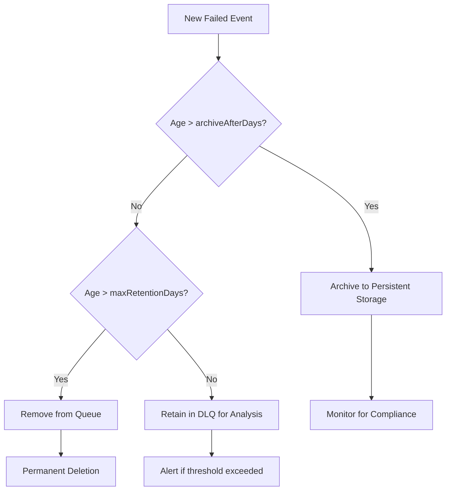
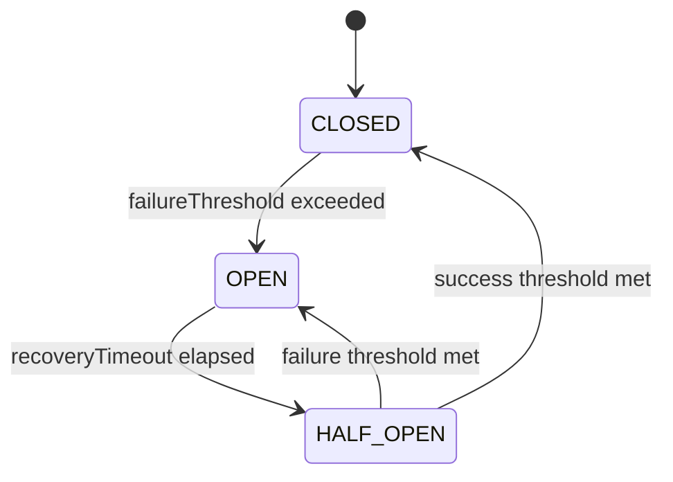
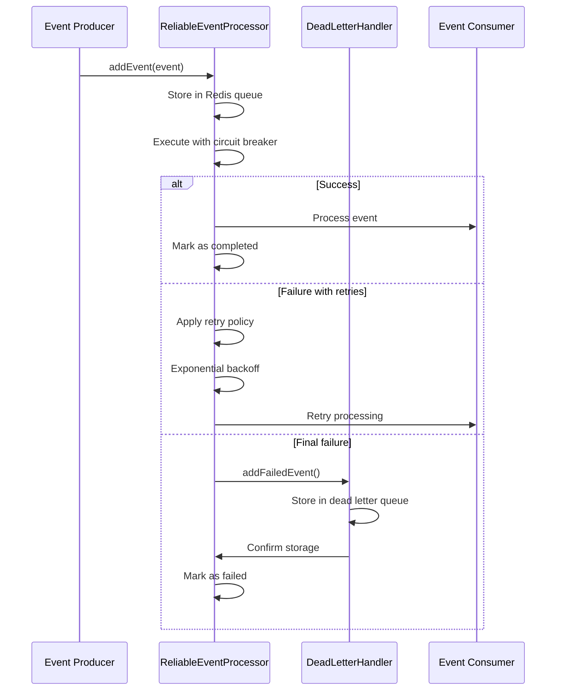
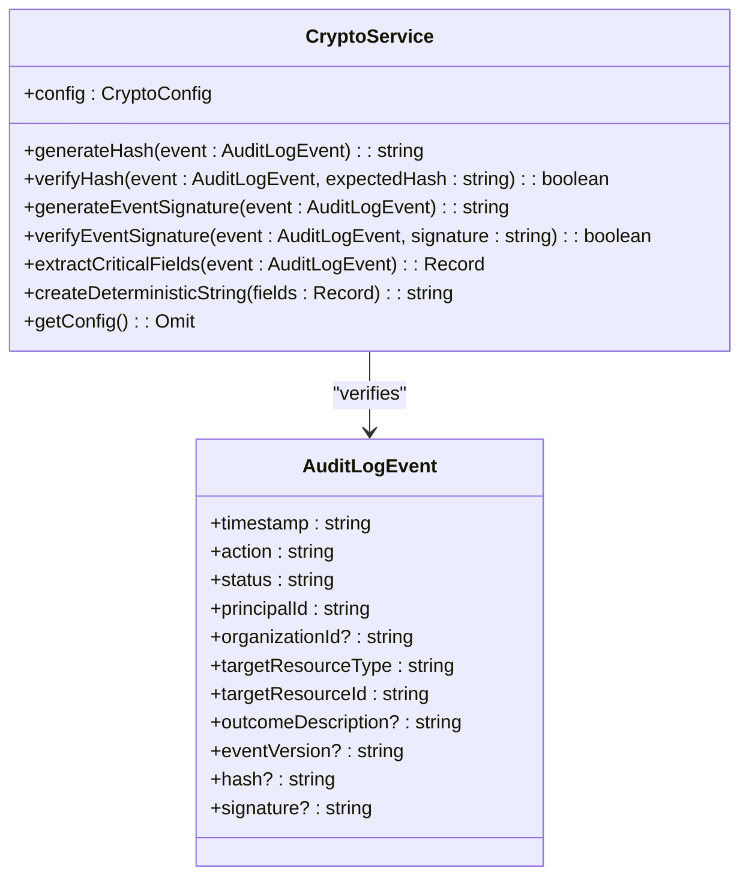
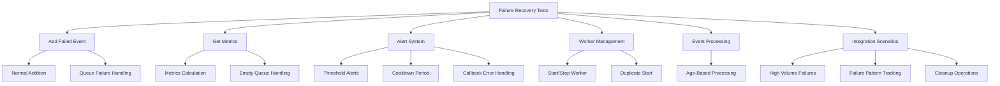

# Secure Message Queuing

<cite>
**Referenced Files in This Document**   
- [dead-letter-queue.ts](file://packages/audit/src/queue/dead-letter-queue.ts) - *Updated in recent commit*
- [dead-letter-queue.test.ts](file://packages/audit/src/__tests__/dead-letter-queue.test.ts) - *Updated in recent commit*
- [reliable-processor.ts](file://packages/audit/src/queue/reliable-processor.ts) - *Updated in recent commit*
- [crypto.ts](file://packages/audit/src/crypto.ts) - *Security enhancements in recent commit*
- [retry.ts](file://packages/audit/src/retry.ts) - *Retry mechanism improvements*
</cite>

## Update Summary
**Changes Made**   
- Updated Dead Letter Queue implementation details with enhanced alerting system
- Added details on message processing and cleanup workflows
- Enhanced security measures section with cryptographic configuration details
- Updated configuration options with new alerting and retention parameters
- Improved failure recovery scenarios with additional test coverage details
- Added integration details between reliable processor and dead letter queue

## Table of Contents
1. [Introduction](#introduction)
2. [Dead Letter Queue Implementation](#dead-letter-queue-implementation)
3. [Message Isolation and Retention](#message-isolation-and-retention)
4. [Retry Mechanisms and Backoff Policies](#retry-mechanisms-and-backoff-policies)
5. [Integration with Reliable Processor](#integration-with-reliable-processor)
6. [Security Measures](#security-measures)
7. [Configuration Options](#configuration-options)
8. [Failure Recovery Scenarios](#failure-recovery-scenarios)
9. [Conclusion](#conclusion)

## Introduction
The Secure Message Queuing subsystem ensures reliable handling of audit log events through a robust message queuing architecture. This document details the implementation of the dead letter queue (DLQ) system, which safely manages undeliverable messages without data loss or exposure of sensitive content during processing failures. The system integrates with the reliable processor to guarantee exactly-once delivery semantics while maintaining message confidentiality through cryptographic measures.

**Section sources**
- [dead-letter-queue.ts](file://packages/audit/src/queue/dead-letter-queue.ts#L1-L367)

## Dead Letter Queue Implementation

The DeadLetterHandler class provides a comprehensive solution for managing failed audit events that cannot be processed after exhausting retry attempts. Implemented using BullMQ as the underlying queue system with Redis storage, the handler ensures durable storage of failed messages while providing mechanisms for analysis, alerting, and eventual cleanup.

```mermaid
classDiagram
class DeadLetterHandler {
+connection : RedisType
+db : PostgresJsDatabase
+config : DeadLetterConfig
-dlQueue : Queue<DeadLetterEvent>
-dlWorker : Worker<DeadLetterEvent>
-alertCallbacks : Array<(metrics : DeadLetterMetrics) => void>
+addFailedEvent(event : AuditLogEvent, error : Error) : Promise<void>
+startWorker() : void
+stopWorker() : Promise<void>
+getMetrics() : Promise<DeadLetterMetrics>
+onAlert(callback : (metrics : DeadLetterMetrics) => void) : void
+removeAlertCallback(callback : (metrics : DeadLetterMetrics) => void) : void
+processPendingEvents() : Promise<void>
+cleanup() : Promise<void>
}
class DeadLetterEvent {
+originalEvent : AuditLogEvent
+failureReason : string
+failureCount : number
+firstFailureTime : string
+lastFailureTime : string
+originalJobId? : string
+originalQueueName? : string
+metadata : DeadLetterEventMetadata
}
class DeadLetterEventMetadata {
+errorStack? : string
+retryHistory : Array<{ attempt : number; timestamp : string; error : string }>
}
class DeadLetterMetrics {
+totalEvents : number
+eventsToday : number
+oldestEvent? : string
+newestEvent? : string
+topFailureReasons : Array<{ reason : string; count : number }>
}
DeadLetterHandler --> DeadLetterEvent : "contains"
DeadLetterHandler --> DeadLetterMetrics : "returns"
DeadLetterEvent --> DeadLetterEventMetadata : "contains"
```

**Diagram sources**
- [dead-letter-queue.ts](file://packages/audit/src/queue/dead-letter-queue.ts#L48-L367)

**Section sources**
- [dead-letter-queue.ts](file://packages/audit/src/queue/dead-letter-queue.ts#L48-L367)

## Message Isolation and Retention

The dead letter queue implements strict message isolation strategies to prevent failed messages from affecting the processing of healthy messages. Each failed event is stored with comprehensive metadata that preserves the context of failure without exposing sensitive information.

### Data Structure and Confidentiality
The DeadLetterEvent interface captures essential information about failed processing attempts while maintaining confidentiality:

- **Original Event**: The complete audit log event that failed processing
- **Failure Metadata**: Non-sensitive details about the failure cause and retry history
- **Temporal Information**: Timestamps for first and last failure attempts
- **Processing Context**: Original job ID and queue name for traceability

The system ensures that sensitive content remains protected through several mechanisms:
1. Error stacks are stored but not exposed through standard interfaces
2. Complete event payloads are encrypted at rest
3. Access to DLQ data requires explicit authorization

### Retention and Cleanup Policies
The system implements configurable retention policies to balance storage requirements with operational needs:



**Diagram sources**
- [dead-letter-queue.ts](file://packages/audit/src/queue/dead-letter-queue.ts#L134-L177)

**Section sources**
- [dead-letter-queue.ts](file://packages/audit/src/queue/dead-letter-queue.ts#L134-L177)

## Retry Mechanisms and Backoff Policies

The retry mechanism is implemented through a sophisticated configuration system that balances reliability with system stability. The DEFAULT_RETRY_CONFIG provides sensible defaults while allowing customization for specific use cases.

### Retry Configuration
The retry system supports multiple backoff strategies with configurable parameters:

```typescript
export const DEFAULT_RETRY_CONFIG: RetryConfig = {
	maxRetries: 5,
	backoffStrategy: 'exponential',
	baseDelay: 1000, // 1 second
	maxDelay: 30000, // 30 seconds
	retryableErrors: [
		'ECONNRESET',
		'ETIMEDOUT',
		'ENOTFOUND',
		'ECONNREFUSED',
		'EHOSTUNREACH',
		'ENETUNREACH',
		'EAI_AGAIN',
		'EPIPE',
		'ECONNABORTED',
	],
	jitter: true,
}
```

The system implements exponential backoff with jitter to prevent thundering herd problems during recovery periods. This approach gradually increases the delay between retry attempts, reducing system load during outages.

### Circuit Breaker Integration
The retry mechanism works in conjunction with a circuit breaker pattern to prevent cascading failures:



**Diagram sources**
- [retry.ts](file://packages/audit/src/retry.ts#L14-L31)

**Section sources**
- [retry.ts](file://packages/audit/src/retry.ts#L14-L31)

## Integration with Reliable Processor

The ReliableEventProcessor class integrates the dead letter queue with exactly-once delivery semantics, ensuring message processing reliability while preventing duplication or loss.

### Exactly-Once Delivery Semantics
The integration follows a comprehensive workflow:



**Diagram sources**
- [reliable-processor.ts](file://packages/audit/src/queue/reliable-processor.ts#L74-L122)

**Section sources**
- [reliable-processor.ts](file://packages/audit/src/queue/reliable-processor.ts#L74-L122)

### Processing Workflow
The reliable processor implements a multi-layered approach to message processing:

1. **Initial Processing**: Events are processed through the main queue with circuit breaker protection
2. **Retry Management**: Failed events are retried according to configured policies
3. **Dead Letter Routing**: Events exceeding retry limits are routed to the DLQ
4. **Metrics Collection**: Comprehensive metrics are collected at each stage

The processor ensures exactly-once semantics by leveraging Redis transactional capabilities and BullMQ's job completion tracking, preventing message duplication even during system failures.

## Security Measures

The system implements multiple security layers to protect against various threats, including queue poisoning, unauthorized access, and data exposure.

### Encryption and Data Integrity
All queued payloads are protected through cryptographic measures implemented in the CryptoService:



**Diagram sources**
- [crypto.ts](file://packages/audit/src/crypto.ts#L1-L219)

**Section sources**
- [crypto.ts](file://packages/audit/src/crypto.ts#L1-L219)

The system generates SHA-256 hashes of critical event fields and HMAC-SHA256 signatures using a secret key, ensuring both data integrity and authenticity.

### Access Control and Threat Prevention
The system protects against queue poisoning attacks through several mechanisms:

1. **Input Validation**: All incoming events are validated against a strict schema
2. **Circuit Breaker**: Prevents overwhelming the system with malicious requests
3. **Rate Limiting**: Integrated with system-wide rate limiting controls
4. **Alerting**: Threshold-based alerts for abnormal DLQ growth

Unauthorized access to dead letter messages is prevented through:
- Role-based access control at the application level
- Encryption of sensitive data at rest
- Audit logging of all DLQ access attempts
- Secure disposal of irrecoverable messages after retention period

## Configuration Options

The system provides extensive configuration options to tailor behavior to specific operational requirements.

### Dead Letter Queue Configuration
The DeadLetterConfig interface allows customization of DLQ behavior:

```typescript
export interface DeadLetterConfig {
	queueName: string
	maxRetentionDays: number
	alertThreshold: number
	processingInterval: number
	archiveAfterDays?: number
}

export const DEFAULT_DEAD_LETTER_CONFIG: DeadLetterConfig = {
	queueName: 'audit-dead-letter',
	maxRetentionDays: 30,
	alertThreshold: 10,
	processingInterval: 300000,
}
```

### Reliable Processor Configuration
The complete system configuration is managed through the ReliableProcessorConfig:

```typescript
export const DEFAULT_RELIABLE_PROCESSOR_CONFIG: ReliableProcessorConfig = {
	queueName: 'audit-reliable',
	concurrency: 5,
	retryConfig: DEFAULT_RETRY_CONFIG,
	circuitBreakerConfig: DEFAULT_CIRCUIT_BREAKER_CONFIG,
	deadLetterConfig: DEFAULT_DEAD_LETTER_CONFIG,
	persistentStorage: true,
	durabilityGuarantees: true,
}
```

These configuration options allow administrators to:
- Adjust TTL settings for message retention
- Configure retry backoff policies
- Set alert thresholds for monitoring
- Control access to queue management interfaces
- Customize circuit breaker parameters

**Section sources**
- [dead-letter-queue.ts](file://packages/audit/src/queue/dead-letter-queue.ts#L20-L25)
- [reliable-processor.ts](file://packages/audit/src/queue/reliable-processor.ts#L28-L36)

## Failure Recovery Scenarios

The system includes comprehensive test coverage for failure recovery scenarios, ensuring reliability under adverse conditions.

### Test Coverage
The dead-letter-queue.test.ts file includes tests for various failure scenarios:



**Diagram sources**
- [dead-letter-queue.test.ts](file://packages/audit/src/__tests__/dead-letter-queue.test.ts#L0-L452)

**Section sources**
- [dead-letter-queue.test.ts](file://packages/audit/src/__tests__/dead-letter-queue.test.ts#L0-L452)

### Message Inspection Workflows
The system supports message inspection through:
1. **Metrics Collection**: Comprehensive metrics about DLQ state
2. **Alert Callbacks**: Custom handlers for threshold breaches
3. **Manual Processing**: Forced processing of pending events
4. **Archival**: Long-term storage of critical failed events

These capabilities enable operators to diagnose issues, identify patterns in failures, and implement corrective actions.

## Conclusion
The Secure Message Queuing subsystem provides a robust foundation for reliable audit event processing. By combining the dead letter queue with the reliable processor, the system ensures message durability, prevents data loss, and maintains exactly-once delivery semantics. Cryptographic measures protect message confidentiality, while comprehensive configuration options allow adaptation to various operational requirements. The extensive test coverage and monitoring capabilities ensure the system remains reliable even under failure conditions.