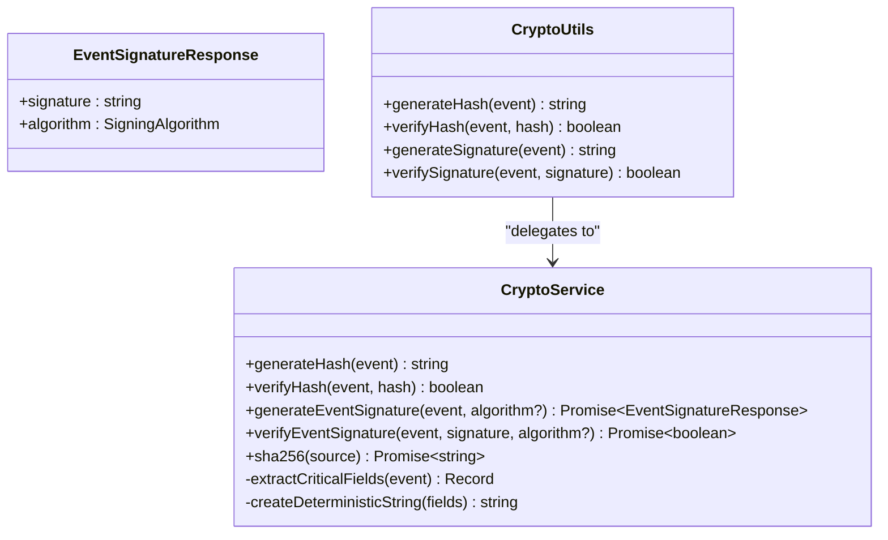
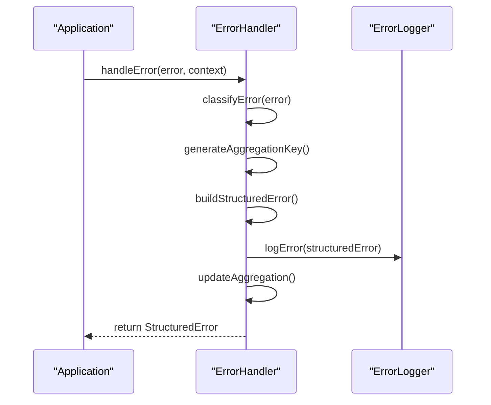
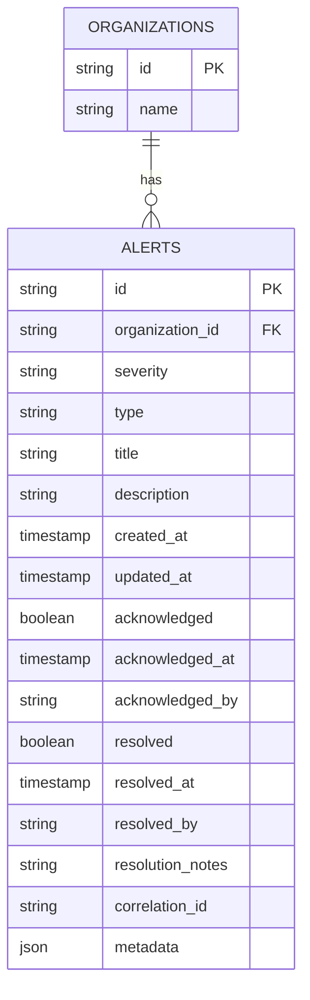
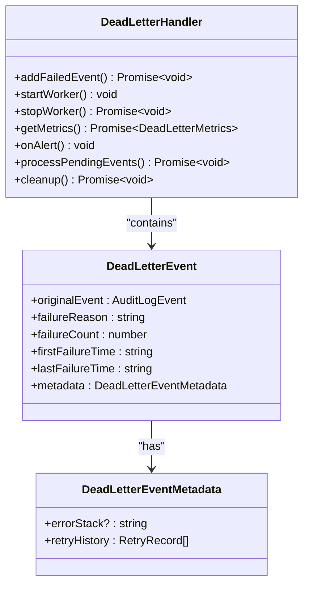
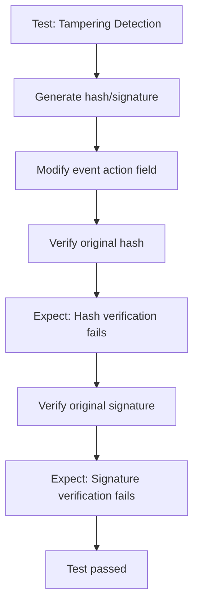

# Security

<cite>
**Referenced Files in This Document**   
- [crypto.ts](file://packages/audit/src/crypto.ts) - *Updated with KMS support in commit ce262627*
- [types.ts](file://packages/audit/src/types.ts) - *Updated with new signing algorithms in commit ce262627*
- [audit.ts](file://packages/audit/src/audit.ts) - *Updated with async signature methods in commit ce262627*
- [database-alert-handler.ts](file://packages/audit/src/monitor/database-alert-handler.ts) - *Enhanced alert persistence in commit 6be5dd6c*
- [error-handling.ts](file://packages/audit/src/error/error-handling.ts)
- [dead-letter-queue.ts](file://packages/audit/src/queue/dead-letter-queue.ts)
- [error-handling.test.ts](file://packages/audit/src/__tests__/error-handling.test.ts)
- [crypto.test.ts](file://packages/audit/src/__tests__/crypto.test.ts)
</cite>

## Update Summary
- Added documentation for asynchronous event signature generation with KMS support in CryptoService
- Updated Cryptographic Functions section to include KMS integration and multiple signing algorithms
- Enhanced the HMAC Signature Verification section with details about the new async signature response format
- Updated the Security Alerting System section with enhanced alert persistence features and cleanup functionality
- Added new code examples and diagrams to reflect the updated security architecture
- Maintained all existing security documentation while adding new content for the updated cryptographic functions and alert persistence

## Table of Contents
1. [Introduction](#introduction)
2. [Cryptographic Functions for Data Protection](#cryptographic-functions-for-data-protection)
3. [Error Handling and Secure Logging](#error-handling-and-secure-logging)
4. [Security Alerting System](#security-alerting-system)
5. [Dead-Letter Queue for Message Integrity](#dead-letter-queue-for-message-integrity)
6. [Security Testing and Attack Scenarios](#security-testing-and-attack-scenarios)
7. [Common Vulnerabilities and Mitigations](#common-vulnerabilities-and-mitigations)
8. [Configuration and Incident Response](#configuration-and-incident-response)

## Introduction
The Security subsystem ensures data integrity, confidentiality, and availability across the audit logging system. It implements cryptographic verification, secure error handling, alerting mechanisms, and message durability to protect against tampering, data leakage, and service disruption. This document details the implementation of key security components, including cryptographic functions, error sanitization, database monitoring, and secure message queuing.

## Cryptographic Functions for Data Protection

The cryptographic system ensures the integrity and authenticity of audit log events through SHA-256 hashing and HMAC-SHA256 signatures. It prevents tampering by allowing verification of event data consistency and origin.

### Hashing and Signature Generation
The `CryptoService` class implements two primary functions:
- **Hash Generation**: Uses SHA-256 on critical event fields to detect data modification
- **Signature Generation**: Applies HMAC-SHA256 using a secret key to authenticate event origin

Critical fields used for hashing include:
- **timestamp**
- **action**
- **status**
- **principalId**
- **organizationId**
- **targetResourceType**
- **targetResourceId**
- **outcomeDescription**



**Diagram sources**
- [crypto.ts](file://packages/audit/src/crypto.ts#L100-L200)

**Section sources**
- [crypto.ts](file://packages/audit/src/crypto.ts#L0-L218)

### Deterministic Hashing
To ensure consistent hashing regardless of object property order, the system:
1. Extracts critical fields into a dedicated object
2. Sorts field names alphabetically
3. Creates a deterministic string using `key:value` pairs joined by `|`
4. Applies SHA-256 to this normalized string

This approach guarantees that identical events produce identical hashes even when serialized with different property ordering. The system also includes a base64 encoding utility that converts binary hash data into RFC4648 compliant base64 strings for easier transmission and storage.

### HMAC Signature Verification with KMS Support
The HMAC-SHA256 signature provides an additional layer of security by incorporating a secret key. The process:
1. Generates a hash of the event using `generateHash`
2. Applies HMAC-SHA256 using the secret key and the hash as input
3. Produces a 64-character hexadecimal signature

This prevents attackers from modifying both the data and hash without access to the secret key.

#### Asynchronous Signature Generation
The `CryptoService` now includes an asynchronous `generateEventSignature` method that supports both local HMAC-SHA256 and external KMS-based signing algorithms. When KMS is enabled in the configuration, the system delegates signing to the Infisical KMS service.

```typescript
async generateEventSignature(
    event: AuditLogEvent,
    signingAlgorithm?: SigningAlgorithm
): Promise<EventSignatureResponse> {
    const eventHash = this.generateHash(event)

    try {
        if (this.config.kms.enabled && this.kms) {
            const signature = await this.kms.sign(eventHash, signingAlgorithm)
            return {
                signature: signature.signature,
                algorithm: signature.signingAlgorithm,
            }
        } else {
            const signature = createHmac('sha256', this.config.encryptionKey!)
                .update(eventHash, 'utf8')
                .digest('hex')
            return {
                signature,
                algorithm: 'HMAC-SHA256',
            }
        }
    } catch (error) {
        console.error('[CryptoService] Signature creation failed:', error)
        throw error
    }
}
```

The method returns an `EventSignatureResponse` object containing both the signature value and the algorithm used, enabling clients to verify which cryptographic method was applied.

#### Supported Signing Algorithms
The system supports multiple signing algorithms through the KMS integration, as defined in the `types.ts` file:

```typescript
export type SigningAlgorithm = 
    | 'HMAC-SHA256'
    | 'RSASSA_PSS_SHA_256'
    | 'RSASSA_PSS_SHA_384'
    | 'RSASSA_PSS_SHA_512'
    | 'RSASSA_PKCS1_V1_5_SHA_256'
    | 'RSASSA_PKCS1_V1_5_SHA_384'
    | 'RSASSA_PKCS1_V1_5_SHA_512'
```

This allows for cryptographic flexibility and compliance with various security standards.

**Section sources**
- [crypto.ts](file://packages/audit/src/crypto.ts#L127-L174)
- [types.ts](file://packages/audit/src/types.ts#L150-L160)
- [audit.ts](file://packages/audit/src/audit.ts#L300-L330)

### Asynchronous SHA-256 Hashing with Base64 Encoding
The `CryptoService` includes an asynchronous `sha256` method that leverages the Web Crypto API for secure hashing operations. This method:
- Accepts string or Uint8Array input
- Returns a Promise that resolves to a base64-encoded string
- Uses the browser's or Node.js's built-in Web Crypto API for cryptographic operations
- Implements RFC4648 compliant base64 encoding

```typescript
async sha256(source: string | Uint8Array): Promise<string> {
    const buf = typeof source === 'string' ? new TextEncoder().encode(source) : source
    const hash = await crypto.subtle.digest('sha-256', buf)
    return this.b64(hash)
}
```

The base64 encoding is implemented using a custom algorithm that handles various input types (string, ArrayBuffer, or Uint8Array) and produces properly padded base64 strings with '=' padding characters as needed.

**Section sources**
- [crypto.ts](file://packages/audit/src/crypto.ts#L80-L90)
- [crypto.ts](file://packages/audit/src/crypto.ts#L188-L218)

## Error Handling and Secure Logging

The error handling system implements structured logging, classification, and aggregation while preventing sensitive data exposure.

### Error Classification and Sanitization
The `ErrorHandler` class classifies errors into categories such as:
- **DATABASE_ERROR**
- **NETWORK_ERROR**
- **VALIDATION_ERROR**
- **AUTHENTICATION_ERROR**
- **INTEGRITY_ERROR**

Each error is processed to:
- Remove sensitive stack traces when disabled
- Sanitize error messages of PII
- Generate non-identifiable error codes
- Create aggregation keys that normalize dynamic values



**Diagram sources**
- [error-handling.ts](file://packages/audit/src/error/error-handling.ts#L400-L600)

**Section sources**
- [error-handling.ts](file://packages/audit/src/error/error-handling.ts#L0-L758)

### Secure Context Management
Error context includes:
- **correlationId**: For tracing related operations
- **component** and **operation**: For troubleshooting
- **userId** and **sessionId**: For impact analysis
- **metadata**: Custom diagnostic data
- **environment**: Node version, platform, hostname

Sensitive information is protected by:
- Optional stack trace inclusion
- Environment information toggling
- Metadata scrubbing in production
- Correlation ID generation that avoids sensitive data

### Aggregation and Trend Analysis
Errors are aggregated by:
- Category
- Component
- Normalized message (with UUIDs, timestamps, numbers replaced)

The system tracks:
- **Count**: Total occurrences
- **Affected users and components**
- **Trend analysis**: Increasing, decreasing, or stable
- **Error rate**: Per-minute frequency

Aggregations trigger alerts when thresholds are exceeded, enabling proactive monitoring of systemic issues.

## Security Alerting System

The database alert handler detects and responds to suspicious activities through persistent storage and multi-organizational access control.

### Enhanced Alert Persistence
The `DatabaseAlertHandler` stores alerts in PostgreSQL with organization-based isolation:
- Each alert belongs to a specific **organization_id**
- Fields include severity, type, status, and resolution metadata
- Supports acknowledgment and resolution workflows
- Includes automatic cleanup of resolved alerts based on retention policy



**Diagram sources**
- [database-alert-handler.ts](file://packages/audit/src/monitor/database-alert-handler.ts#L0-L450)

**Section sources**
- [database-alert-handler.ts](file://packages/audit/src/monitor/database-alert-handler.ts#L0-L450)

### Alert Lifecycle Management
The system supports:
- **Creation**: New alerts are inserted with initial metadata
- **Acknowledgment**: Users mark alerts as seen
- **Resolution**: Alerts are closed with resolution notes
- **Querying**: Filter by status, severity, type, and organization
- **Statistics**: Real-time metrics on alert volume and distribution
- **Cleanup**: Automatic deletion of resolved alerts older than retention period

### Multi-Tenant Security
Organization-based access control ensures:
- Users can only access alerts for their organization
- Queries include `organization_id` filtering
- Cross-tenant data leakage is prevented
- Administrative views can aggregate across organizations

### Automatic Alert Cleanup
The system includes a `cleanupResolvedAlerts` method that automatically removes resolved alerts older than a specified retention period:

```typescript
async cleanupResolvedAlerts(organizationId: string, retentionDays: number = 90): Promise<number> {
    const cutoffDate = new Date()
    cutoffDate.setDate(cutoffDate.getDate() - retentionDays)

    try {
        const result = await this.db.execute(sql`
            DELETE FROM alerts 
            WHERE organization_id = ${organizationId}
            AND resolved = 'true'
            AND resolved_at < ${cutoffDate.toISOString()}
            RETURNING id
        `)

        return result.length || 0
    } catch (error) {
        throw new Error(`Failed to cleanup resolved alerts: ${error}`)
    }
}
```

This ensures that the alert storage remains efficient while maintaining compliance with data retention policies.

**Section sources**
- [database-alert-handler.ts](file://packages/audit/src/monitor/database-alert-handler.ts#L400-L430)

## Dead-Letter Queue for Message Integrity

The dead-letter queue (DLQ) securely handles undeliverable messages without data loss, ensuring audit event durability.

### DLQ Architecture
The `DeadLetterHandler` uses Redis and BullMQ to:
- Store failed audit events
- Preserve original event data and failure context
- Track retry history and error stacks
- Enable post-mortem analysis



**Diagram sources**
- [dead-letter-queue.ts](file://packages/audit/src/queue/dead-letter-queue.ts#L0-L366)

**Section sources**
- [dead-letter-queue.ts](file://packages/audit/src/queue/dead-letter-queue.ts#L0-L366)

### Failure Preservation
When an audit event fails processing after retries:
1. The original event is preserved intact
2. Failure reason and count are recorded
3. Full error stack trace is captured
4. Retry history is maintained
5. Event is added to the DLQ with metadata

### Automated Processing and Alerts
The system:
- Processes DLQ events every 5 minutes
- Archives events older than configured threshold
- Deletes events exceeding retention period
- Triggers alerts when DLQ size exceeds threshold
- Provides metrics on failure patterns

This ensures failed audit events are not lost while enabling investigation and remediation.

## Security Testing and Attack Scenarios

Comprehensive tests validate the security system's resilience against various attack scenarios.

### Cryptographic Integrity Testing
Tests verify:
- Hash consistency for identical events
- Hash changes when critical fields are modified
- Signature verification failure with tampered data
- Resistance to timing attacks through constant-time comparison



**Diagram sources**
- [crypto.test.ts](file://packages/audit/src/__tests__/crypto.test.ts#L0-L460)

**Section sources**
- [crypto.test.ts](file://packages/audit/src/__tests__/crypto.test.ts#L0-L460)

### Error Handling Validation
Tests confirm:
- Correct classification of database, network, and validation errors
- Proper aggregation of similar errors
- Accurate error statistics reporting
- Secure context handling without data leakage
- External logger integration

The test suite includes scenarios for:
- Database connection failures
- Network timeouts
- Authentication errors
- Configuration issues
- Data integrity violations

## Common Vulnerabilities and Mitigations

### Injection Attacks
Prevented by:
- Using parameterized queries with Drizzle ORM
- Input validation through Zod schemas
- Context-aware escaping in SQL templates
- Stored procedures for complex operations

### Data Leakage Prevention
Mitigated through:
- Error message sanitization
- Stack trace suppression in production
- Environment variable protection
- Correlation IDs without sensitive data
- Metadata scrubbing in logs

### Secure Key Management
Implemented via:
- Environment variables for secret keys
- Default key generation with warnings
- HMAC-SHA256 for signature authentication
- Key rotation support
- Secure storage in configuration management
- KMS integration for advanced cryptographic operations

## Configuration and Incident Response

### Security Configuration
Key settings include:
- **AUDIT_CRYPTO_SECRET**: Cryptographic secret key
- **enableStructuredLogging**: Structured JSON output
- **enableAggregation**: Error grouping and trending
- **aggregationWindowMinutes**: Time window for aggregation
- **maxRetentionDays**: DLQ retention period
- **alertThreshold**: DLQ size alert threshold
- **kms.enabled**: Enable KMS-based cryptographic operations
- **kms.baseUrl**: KMS service endpoint
- **kms.accessToken**: Authentication token for KMS service

### Incident Response Procedures
When security incidents occur:
1. **Identify**: Use correlation IDs to trace related events
2. **Contain**: Isolate affected components
3. **Analyze**: Examine DLQ entries and error aggregations
4. **Remediate**: Fix root cause and verify resolution
5. **Report**: Document findings and update prevention measures

For cryptographic integrity failures:
- Investigate the source of tampering
- Review access logs for unauthorized access
- Rotate cryptographic keys if compromised
- Validate all audit events during the affected period

For high error volumes:
- Check system resources and performance
- Review recent deployments for regressions
- Examine network connectivity and dependencies
- Scale resources if necessary