# Audit Database

<cite>
**Referenced Files in This Document**   
- [schema.ts](file://packages\audit-db\src\db\schema.ts) - *Updated in recent commit*
- [pseudonym_mapping](file://packages\audit-db\drizzle\migrations\0006_silly_tyger_tiger.sql) - *Added in recent commit*
- [gdpr-compliance.ts](file://packages\audit\src\gdpr\gdpr-compliance.ts) - *Updated in recent commit*
- [README.md](file://packages\audit-db\README.md) - *Updated in recent commit*
- [future-enhancements.md](file://packages\audit-db\docs\future-enhancements.md) - *Updated in recent commit*
- [organization_role](file://packages\auth\drizzle\0005_fluffy_donald_blake.sql) - *Added in recent commit*
- [authz.ts](file://packages\auth\src\db\schema\authz.ts) - *Added in recent commit*
</cite>

## Update Summary
- Added new section on organization role management with database integration and Redis caching
- Updated data model documentation to include the new organization_role table
- Added details on role-based access control implementation and permission management
- Updated architecture overview to include role management components
- Added new diagram for organization role management architecture
- Updated section sources to reflect new and modified files

## Table of Contents
1. [Introduction](#introduction)
2. [Data Model](#data-model)
3. [Partitioning Strategy](#partitioning-strategy)
4. [Data Lifecycle and Retention](#data-lifecycle-and-retention)
5. [Query Caching Strategy](#query-caching-strategy)
6. [Performance Monitoring Tools](#performance-monitoring-tools)
7. [Access Control and Security](#access-control-and-security)
8. [Migration and Version Management](#migration-and-version-management)
9. [Architecture Overview](#architecture-overview)
10. [Alert Persistence with Database Integration](#alert-persistence-with-database-integration)
11. [GDPR Pseudonymization and Compliance](#gdpr-pseudonymization-and-compliance)
12. [Organization Role Management](#organization-role-management)
13. [Conclusion](#conclusion)

## Introduction

The Audit Database is a comprehensive system designed to store, manage, and analyze audit events across multiple organizations. It provides robust capabilities for compliance, security monitoring, and operational visibility. Built with PostgreSQL and optimized through Drizzle ORM, the system implements advanced database techniques including time-based partitioning, Redis caching, and comprehensive performance monitoring.

This documentation provides a detailed overview of the Audit Database's data model, architecture, and operational characteristics. The system is designed to handle high-volume audit data while maintaining performance, security, and compliance with regulatory requirements such as HIPAA and GDPR.

The database schema supports a wide range of audit-related entities including audit events, alerts, compliance records, and metadata tables. It implements a multi-tenant architecture with organizational isolation, ensuring data privacy and security across different tenants.

**Section sources**
- [schema.ts](file://packages\audit-db\src\db\schema.ts)

## Data Model

### Entity Relationship Diagram

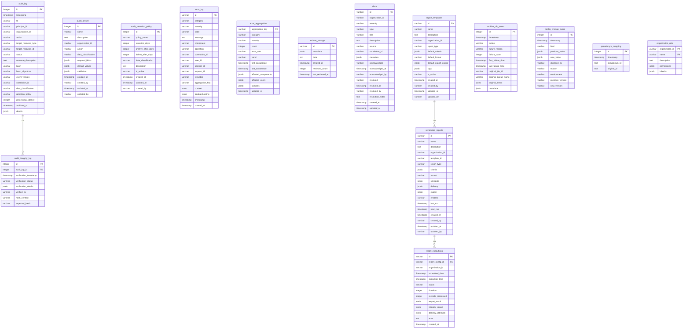

**Diagram sources**
- [schema.ts](file://packages\audit-db\src\db\schema.ts)
- [authz.ts](file://packages\auth\src\db\schema\authz.ts)

**Section sources**
- [schema.ts](file://packages\audit-db\src\db\schema.ts)
- [authz.ts](file://packages\auth\src\db\schema\authz.ts)

### Core Entities

#### audit_log
The primary table storing audit events with comprehensive metadata.

**Fields:**
- **id**: serial - Primary key
- **timestamp**: timestamp with time zone - Event timestamp (ISO string format)
- **ttl**: varchar(255) - Time-to-live specification
- **principalId**: varchar(255) - Identifier of the entity performing the action
- **organizationId**: varchar(255) - Tenant identifier for multi-organizational support
- **action**: varchar(255) - Type of action performed (e.g., 'user.login', 'document.update')
- **targetResourceType**: varchar(255) - Type of resource affected (e.g., 'Patient', 'Order')
- **targetResourceId**: varchar(255) - Identifier of the specific resource
- **status**: varchar(50) - Event status ('attempt', 'success', 'failure')
- **outcomeDescription**: text - Detailed description of the outcome
- **hash**: varchar(64) - Cryptographic hash (SHA-256) for immutability
- **hashAlgorithm**: varchar(50) - Hash algorithm used (default: 'SHA-256')
- **eventVersion**: varchar(20) - Schema version (default: '1.0')
- **correlationId**: varchar(255) - Identifier for tracing related events
- **dataClassification**: varchar(20) - Data sensitivity level ('PUBLIC', 'INTERNAL', 'CONFIDENTIAL', 'PHI')
- **retentionPolicy**: varchar(50) - Retention policy name (default: 'standard')
- **processingLatency**: integer - Processing time in milliseconds
- **archivedAt**: timestamp with time zone - Timestamp when archived
- **details**: jsonb - Additional structured or unstructured data

#### audit_preset
Stores predefined audit configurations for consistent event creation.

**Fields:**
- **id**: serial - Primary key
- **name**: varchar(255) - Preset name
- **description**: text - Description of the preset
- **organizationId**: varchar(255) - Owner organization
- **action**: varchar(255) - Action type this preset applies to
- **dataClassification**: varchar(20) - Required data classification
- **requiredFields**: jsonb - List of required fields for this preset
- **defaultValues**: jsonb - Default values for event fields
- **validation**: jsonb - Validation rules and configuration
- **createdAt**: timestamp - Creation timestamp
- **createdBy**: varchar(255) - User who created the preset
- **updatedAt**: timestamp - Last update timestamp
- **updatedBy**: varchar(255) - User who last updated the preset

#### alerts
Stores persistent alert records with multi-organizational support.

**Fields:**
- **id**: varchar(255) - Alert identifier (UUID)
- **organizationId**: varchar(255) - Tenant identifier
- **severity**: varchar(20) - Alert severity ('LOW', 'MEDIUM', 'HIGH', 'CRITICAL')
- **type**: varchar(20) - Alert type ('SECURITY', 'COMPLIANCE', 'PERFORMANCE', 'SYSTEM')
- **title**: varchar(500) - Alert title
- **description**: text - Detailed alert description
- **source**: varchar(100) - Component that generated the alert
- **correlationId**: varchar(255) - Link to related events
- **metadata**: jsonb - Additional alert context
- **acknowledged**: varchar(10) - Acknowledgment status ('true'/'false')
- **acknowledgedAt**: timestamp - Timestamp when acknowledged
- **acknowledgedBy**: varchar(255) - User who acknowledged
- **resolved**: varchar(10) - Resolution status ('true'/'false')
- **resolvedAt**: timestamp - Timestamp when resolved
- **resolvedBy**: varchar(255) - User who resolved
- **resolutionNotes**: text - Notes about resolution
- **createdAt**: timestamp - Creation timestamp
- **updatedAt**: timestamp - Last update timestamp

#### pseudonym_mapping
Stores encrypted pseudonym-to-original ID mappings for GDPR compliance.

**Fields:**
- **id**: serial - Primary key
- **timestamp**: timestamp with time zone - Creation timestamp
- **pseudonymId**: text - Pseudonymized identifier
- **originalId**: text - Encrypted original identifier

#### organization_role
Stores role definitions and permissions for organizational access control.

**Fields:**
- **organizationId**: varchar(50) - Organization identifier (composite primary key)
- **name**: varchar(50) - Role name (composite primary key)
- **description**: text - Role description
- **permissions**: jsonb - Array of permission objects with resource and action
- **inherits**: jsonb - Array of role names that this role inherits from

## Partitioning Strategy

The Audit Database implements a sophisticated partitioning strategy to optimize performance and manageability of large audit datasets. The system uses range partitioning based on the timestamp column, creating monthly partitions for the audit_log table.

### Partitioning Implementation

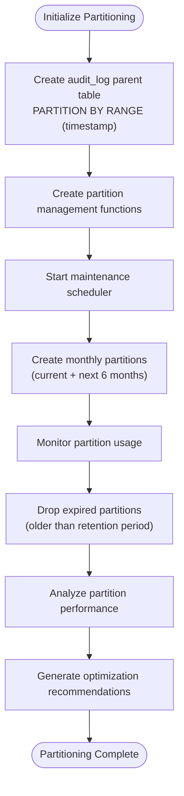

**Diagram sources**
- [partitioning.ts](file://packages/audit-db/src/db/partitioning.ts)

**Section sources**
- [partitioning.ts](file://packages/audit-db/src/db/partitioning.ts)

### Key Features

- **Time-based partitioning**: The audit_log table is partitioned by timestamp using range partitioning with monthly intervals.
- **Automatic partition creation**: The system automatically creates partitions for the current month and the next six months.
- **Retention-based cleanup**: Expired partitions are automatically dropped based on the configured retention policy.
- **Optimized indexing**: Each partition has a comprehensive set of indexes tailored for common query patterns.

### Configuration

The partitioning strategy is configured through the `PartitionConfig` interface:

```typescript
interface PartitionConfig {
  strategy: 'range' | 'hash' | 'list'
  partitionColumn: string
  interval?: 'monthly' | 'quarterly' | 'yearly'
  partitionCount?: number
  retentionDays: number
}
```

For the audit_log table, the configuration uses:
- **strategy**: 'range' (only supported strategy for audit_log)
- **partitionColumn**: 'timestamp'
- **interval**: 'monthly' (default)
- **retentionDays**: 2555 (7 years)

### Performance Benefits

1. **Query performance**: Queries that include timestamp filters can leverage partition pruning, significantly reducing the amount of data scanned.
2. **Maintenance efficiency**: Operations like VACUUM and ANALYZE can be performed on individual partitions rather than the entire table.
3. **Storage optimization**: Older partitions can be moved to slower, cheaper storage while keeping recent data on faster storage.
4. **Backup and recovery**: Individual partitions can be backed up and restored independently.

The `DatabasePartitionManager` class handles all partitioning operations, including creating partitions, managing indexes, and cleaning up expired partitions. The `PartitionMaintenanceScheduler` runs periodic maintenance tasks to ensure the partitioning system remains optimized.

## Data Lifecycle and Retention

The Audit Database implements a comprehensive data lifecycle management system that ensures compliance with regulatory requirements while optimizing storage and performance.

### Retention Policies

The system enforces a 7-year retention policy for audit data, implemented through the `audit_retention_policy` table:

```typescript
interface AuditRetentionPolicy {
  policyName: string
  retentionDays: number // 2555 days = 7 years
  archiveAfterDays?: number
  deleteAfterDays?: number
  dataClassification: DataClassification
  description: string
  isActive: string
  createdAt: Date
  updatedAt: Date
  createdBy: string
}
```

### Archival Rules

Data is archived according to the following rules:
1. **Active retention**: Data remains in the primary audit_log table for the full retention period (7 years).
2. **Partition management**: Monthly partitions are automatically created and expired partitions are dropped when they exceed the retention period.
3. **Compression**: Archived data is compressed and stored in the archive_storage table using base64 encoding.
4. **Integrity verification**: Cryptographic hashes are stored to ensure data integrity during archival.

### Data Lifecycle Process

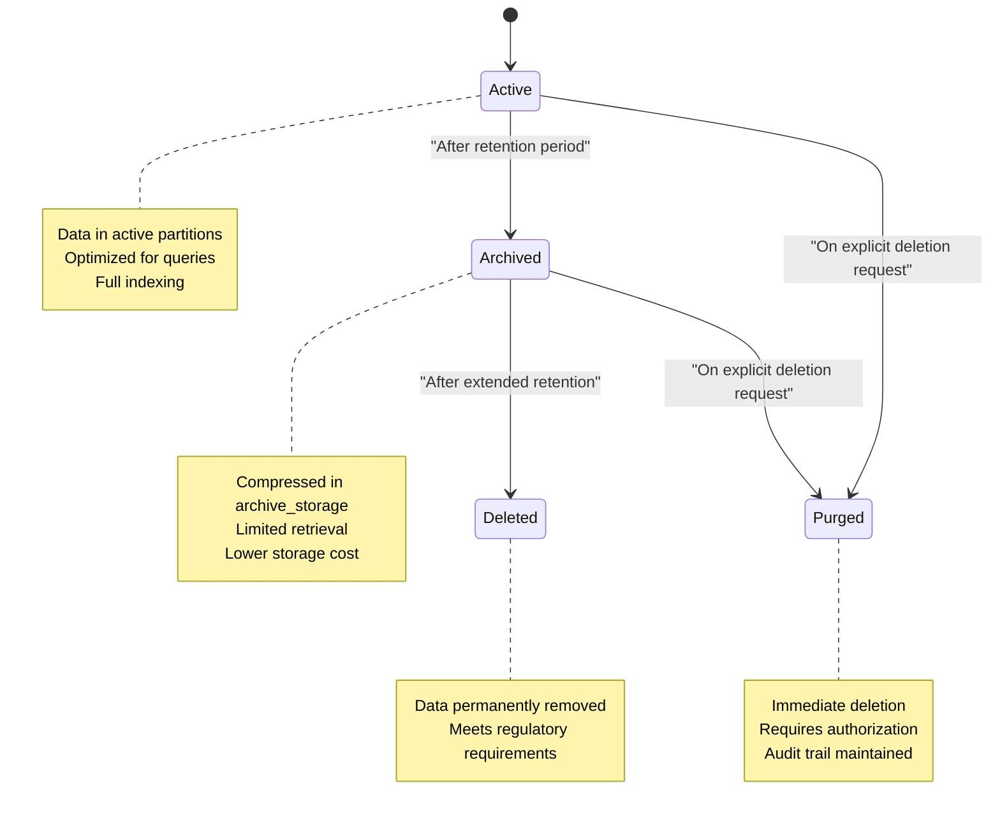

**Diagram sources**
- [schema.ts](file://packages/audit-db/src/db/schema.ts)
- [partitioning.ts](file://packages/audit-db/src/db/partitioning.ts)

**Section sources**
- [schema.ts](file://packages/audit-db/src/db/schema.ts)
- [partitioning.ts](file://packages/audit-db/src/db/partitioning.ts)

The `dropExpiredPartitions` method in the `DatabasePartitionManager` class automatically removes partitions that are older than the retention period. This process runs on a scheduled basis through the `PartitionMaintenanceScheduler`.

## Query Caching Strategy

The Audit Database implements a sophisticated caching strategy using Redis to optimize query performance and reduce database load.

### Caching Architecture

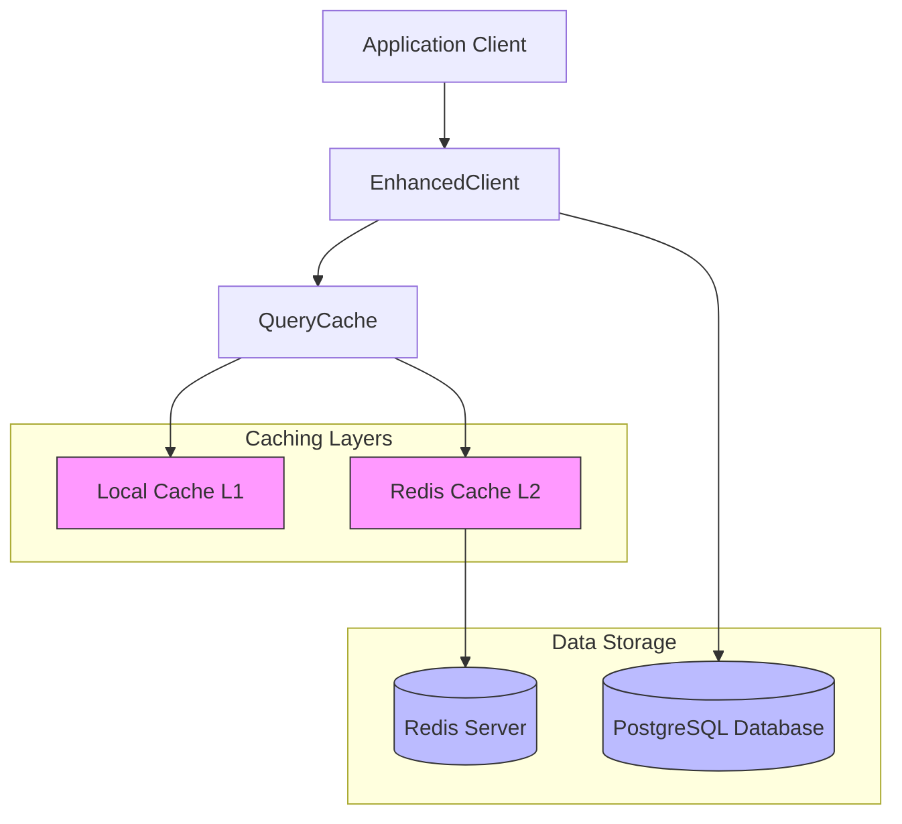

**Diagram sources**
- [redis-query-cache.ts](file://packages/audit-db/src/cache/redis-query-cache.ts)
- [query-cache.ts](file://packages/audit-db/src/cache/query-cache.ts)

**Section sources**
- [redis-query-cache.ts](file://packages/audit-db/src/cache/redis-query-cache.ts)
- [query-cache.ts](file://packages/audit-db/src/cache/query-cache.ts)

### Implementation Details

The caching system is implemented through several key components:

#### QueryCache Class
The base in-memory cache implementation with LRU eviction and TTL support:

```typescript
class QueryCache {
  private cache = new Map<string, CacheEntry>()
  private accessOrder: string[] = []
  
  get<T>(key: string): T | null
  set<T>(key: string, data: T, ttl?: number): void
  delete(key: string): boolean
  clear(): void
}
```

#### RedisQueryCache Class
The distributed cache implementation that uses Redis as the primary store with optional local L1 cache:

```typescript
class RedisQueryCache {
  private redis: Redis
  private localCache?: QueryCache
  
  async get<T>(key: string): Promise<T | null>
  async set<T>(key: string, data: T, ttl?: number): Promise<void>
  async delete(key: string): Promise<boolean>
  async clear(): Promise<void>
}
```

### Cache Configuration

The caching strategy is configured through the `RedisQueryCacheConfig` interface:

```typescript
interface RedisQueryCacheConfig extends QueryCacheConfig {
  redisKeyPrefix: string
  enableLocalCache: boolean
  localCacheSizeMB: number
  enableCompression: boolean
  serializationFormat: 'json' | 'msgpack'
}
```

Default configuration:
- **enabled**: true
- **maxSizeMB**: 100
- **defaultTTL**: 300 seconds (5 minutes)
- **maxQueries**: 1000
- **keyPrefix**: 'audit_cache'
- **redisKeyPrefix**: 'audit_redis_cache'
- **enableLocalCache**: true
- **localCacheSizeMB**: 20
- **enableCompression**: true (for values > 1KB)

### Cache Access Pattern

The system uses a multi-layer cache access pattern:

1. **L1 Cache Check**: First check the local in-memory cache
2. **L2 Cache Check**: If not found, check Redis
3. **Database Query**: If not found in cache, query the database
4. **Cache Population**: Store results in both L1 and L2 caches

This approach minimizes latency for frequently accessed data while maintaining consistency across distributed application instances.

## Performance Monitoring Tools

The Audit Database includes comprehensive performance monitoring capabilities to ensure optimal operation and identify potential issues.

### Monitoring Architecture

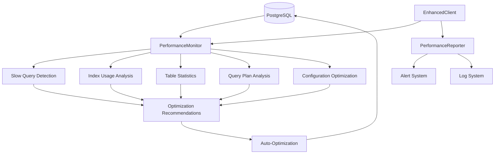

**Diagram sources**
- [performance-monitoring.ts](file://packages/audit-db/src/db/performance-monitoring.ts)
- [enhanced-client.ts](file://packages/audit-db/src/db/enhanced-client.ts)

**Section sources**
- [performance-monitoring.ts](file://packages/audit-db/src/db/performance-monitoring.ts)
- [enhanced-client.ts](file://packages/audit-db/src/db/enhanced-client.ts)

### Key Monitoring Components

#### DatabasePerformanceMonitor Class
The core performance monitoring class that provides various diagnostic capabilities:

```typescript
class DatabasePerformanceMonitor {
  async getSlowQueries(limit = 20, minExecutionTime = 1000): Promise<SlowQueryInfo[]>
  async getIndexUsageStats(): Promise<IndexUsageStats[]>
  async getTableStats(): Promise<TableStats[]>
  async getUnusedIndexes(): Promise<IndexUsageStats[]>
  async suggestMissingIndexes(): Promise<string[]>
  async analyzeQueryPlan(query: string): Promise<QueryPlanAnalysis>
  async getPerformanceSummary(): Promise<PerformanceSummary>
  async optimizeConfiguration(): Promise<ConfigurationOptimization>
  async runMaintenance(): Promise<MaintenanceResults>
}
```

#### Performance Metrics

The system tracks the following key performance indicators:

- **Slow queries**: Queries with mean execution time exceeding the threshold (default: 1000ms)
- **Index usage**: Identification of unused indexes that consume storage without providing benefit
- **Table statistics**: Row counts, table sizes, and access patterns
- **Cache hit ratio**: Percentage of queries served from cache
- **Connection pool metrics**: Connection acquisition times and success rates

### Automatic Optimization

The EnhancedAuditDatabaseClient implements automatic optimization based on performance monitoring:

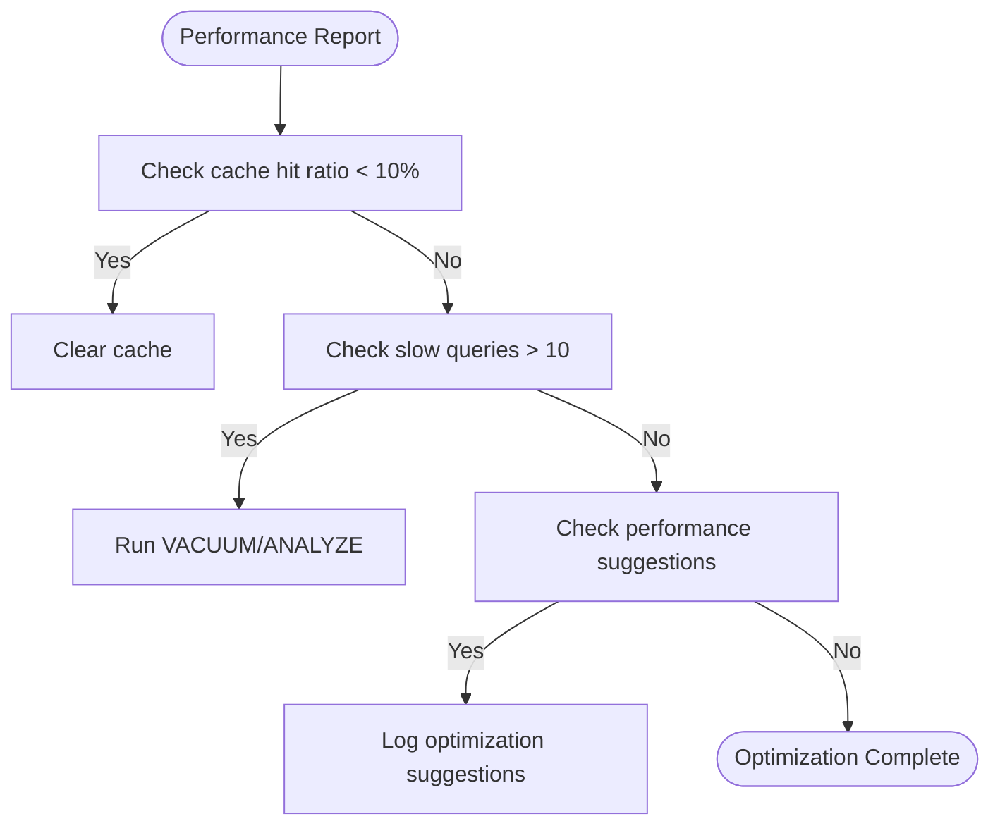

**Diagram sources**
- [enhanced-client.ts](file://packages/audit-db/src/db/enhanced-client.ts)

The system generates performance reports every 5 minutes and takes automatic actions when certain thresholds are exceeded, such as clearing the cache when the hit ratio is very low or running maintenance operations when there are many slow queries.

## Access Control and Security

The Audit Database implements robust security measures to protect sensitive audit data and ensure compliance with regulatory requirements.

### Enhanced Client Security

The `EnhancedAuditDatabaseClient` provides comprehensive access control through the enhanced client implementation:

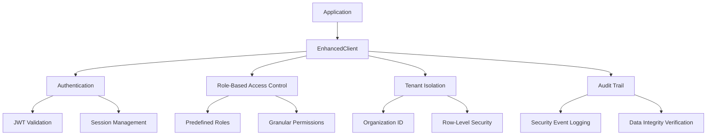

**Diagram sources**
- [enhanced-client.ts](file://packages/audit-db/src/db/enhanced-client.ts)

**Section sources**
- [enhanced-client.ts](file://packages/audit-db/src/db/enhanced-client.ts)

### Security Features

#### Data Encryption
- **Encryption at rest**: All data is encrypted when stored on disk
- **Cryptographic hashing**: Audit events are hashed using SHA-256 to ensure immutability
- **Integrity verification**: The audit_integrity_log table tracks all verification attempts and results

#### Access Control
- **Multi-tenant isolation**: All queries include organization_id filters to prevent cross-tenant data access
- **Row-level security**: Database policies ensure users can only access data belonging to their organization
- **Authentication**: Integration with the authentication system to validate user identities
- **Authorization**: Role-based access control to limit operations based on user privileges

#### Audit Trail
- **Self-auditing**: The system logs its own security-relevant operations
- **Immutable records**: Once created, audit records cannot be modified or deleted
- **Chain of custody**: Cryptographic hashes create a verifiable chain of custody for audit data

### Security Configuration

The enhanced client is configured with security best practices:

```typescript
const defaultConfig: EnhancedClientConfig = {
  connectionPool: {
    ssl: true,
    validateConnections: true,
  },
  monitoring: {
    enabled: true,
    slowQueryThreshold: 1000,
  },
  // Other security-related defaults
}
```

The system also implements defense-in-depth principles with multiple layers of security controls, including network security, database security, application security, and operational security.

## Migration and Version Management

The Audit Database uses Drizzle ORM for migration and version management, ensuring reliable schema evolution and deployment.

### Migration Strategy

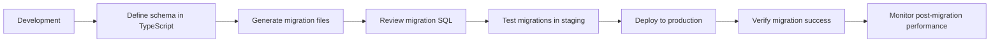

**Section sources**
- [schema.ts](file://packages/audit-db/src/db/schema.ts)

### Drizzle ORM Implementation

The system uses Drizzle ORM for type-safe database interactions and migration management:

1. **Schema Definition**: Database schema is defined in TypeScript using Drizzle's fluent API
2. **Migration Generation**: Drizzle generates SQL migration files from schema changes
3. **Migration Execution**: Migrations are applied in order using timestamp-based versioning
4. **Rollback Support**: Migration history is tracked to enable rollbacks if needed

### Migration Files

Migration files are stored in the drizzle/migrations directory with sequential numbering:

```
drizzle/migrations/
├── 0000_burly_namor.sql
├── 0001_aberrant_natasha_romanoff.sql
├── 0002_tearful_blonde_phantom.sql
├── 0003_easy_prowler.sql
├── 0004_mixed_roughhouse.sql
├── 0005_marvelous_christian_walker.sql
└── 0006_silly_tyger_tiger.sql
```

Each migration file contains the SQL statements needed to upgrade the database schema, along with a corresponding rollback section.

### Version Management

The system implements version management through:

- **Schema versioning**: Each audit event includes an eventVersion field (default: '1.0')
- **Migration versioning**: Sequential migration files with timestamps
- **Compatibility management**: Support for multiple schema versions during transitions
- **Rollback capability**: Ability to revert to previous schema versions if issues are detected

The MIGRATION_GUIDE.md document provides detailed instructions for creating and managing migrations, including best practices for backward compatibility and data migration.

## Architecture Overview

### System Architecture

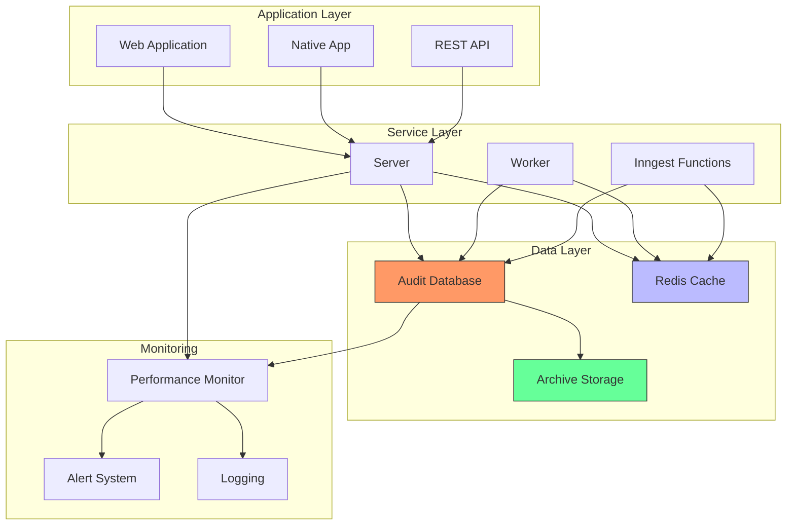

**Diagram sources**
- [project_structure](file://)
- [enhanced-client.ts](file://packages/audit-db/src/db/enhanced-client.ts)

**Section sources**
- [project_structure](file://)
- [enhanced-client.ts](file://packages/audit-db/src/db/enhanced-client.ts)

### Data Access Patterns

The Audit Database supports several key data access patterns:

1. **Time-range queries**: Most common pattern, leveraging partition pruning for efficiency
2. **Organization-scoped queries**: All queries include organization_id for multi-tenancy
3. **Event-type queries**: Filtering by action type for specific audit trails
4. **Principal-based queries**: Tracking activities by specific users or services
5. **Compliance queries**: Complex queries for regulatory reporting

### Integration Points

The system integrates with several external components:

- **Authentication system**: For user identity and access control
- **Alerting system**: For real-time monitoring and notifications
- **Reporting system**: For scheduled compliance reports
- **Archival system**: For long-term data retention
- **Monitoring tools**: For system health and performance tracking

The architecture is designed to be scalable and maintainable, with clear separation of concerns and well-defined interfaces between components.

## Alert Persistence with Database Integration

The Audit Database now supports persistent alert storage through the DatabaseAlertHandler class, which integrates with the EnhancedAuditDatabaseClient to store and manage alerts in the PostgreSQL database.

### Database Alert Handler Architecture

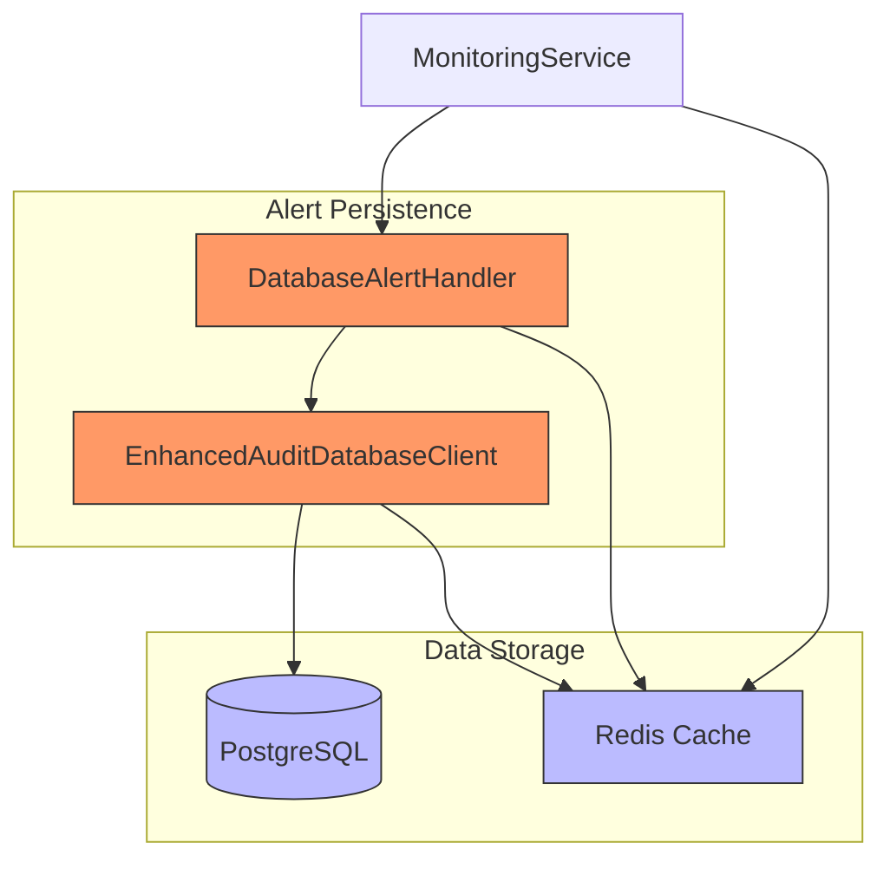

**Diagram sources**
- [database-alert-handler.ts](file://packages/audit/src/monitor/database-alert-handler.ts)
- [enhanced-client.ts](file://packages/audit-db/src/db/enhanced-client.ts)

**Section sources**
- [database-alert-handler.ts](file://packages/audit/src/monitor/database-alert-handler.ts)
- [database-alert-integration.ts](file://packages/audit/src/examples/database-alert-integration.ts)

### DatabaseAlertHandler Class

The DatabaseAlertHandler class implements the AlertHandler interface to provide persistent storage of alerts in the database:

```typescript
class DatabaseAlertHandler implements AlertHandler {
  private client: EnhancedAuditDatabaseClient
  private db: PostgresJsDatabase<any>
  
  constructor(auditDbInstance: EnhancedAuditDb) {
    this.client = auditDbInstance.getEnhancedClientInstance()
    this.db = this.client.getDatabase()
  }
  
  async sendAlert(alert: Alert): Promise<void>
  async acknowledgeAlert(alertId: string, acknowledgedBy: string): Promise<{ success: boolean }>
  async resolveAlert(alertId: string, resolvedBy: string, resolutionData?: AlertResolution): Promise<{ success: boolean }>
  async getActiveAlerts(organizationId?: string): Promise<Alert[]>
  async getAlerts(filters: AlertQueryFilters): Promise<Alert[]>
  async getAlertById(alertId: string, organizationId: string): Promise<Alert | null>
  async getAlertStatistics(organizationId?: string): Promise<AlertStatistics>
  async cleanupResolvedAlerts(organizationId: string, retentionDays: number = 90): Promise<number>
}
```

### Key Features

- **Multi-organizational support**: All alerts are stored with organization_id for tenant isolation
- **Persistent storage**: Alerts are stored in the PostgreSQL database for reliability
- **Caching integration**: Uses Redis caching for improved query performance
- **Comprehensive querying**: Supports filtering by severity, type, status, and other criteria
- **Statistics and metrics**: Provides alert statistics by severity, type, and status
- **Retention management**: Automatically cleans up resolved alerts based on retention policy

### Integration Example

The integration example has been updated to use the EnhancedAuditDb client instead of direct database connections:

```typescript
export async function setupMonitoringWithDatabaseAlerts() {
  // Initialize configuration
  if (!configManager) {
    configManager = new ConfigurationManager(process.env.CONFIG_PATH!, 's3')
    await configManager.initialize()
  }
  const config = configManager.getConfig()

  if (!connection) connection = getSharedRedisConnectionWithConfig(config.redis)

  if (!auditDbInstance) {
    auditDbInstance = new EnhancedAuditDb(connection, config.enhancedClient)
    const isConnected = await auditDbInstance.checkAuditDbConnection()
    if (!isConnected) {
      console.error('Failed to connect to the audit database. Exiting.')
      process.exit(1)
    }
  }

  // Create database alert handler
  if (!databaseAlertHandler) databaseAlertHandler = new DatabaseAlertHandler(auditDbInstance)

  if (!monitoringService) {
    if (!metricsCollector) metricsCollector = new RedisMetricsCollector(connection)
    monitoringService = new MonitoringService(config.monitoring, metricsCollector)
    monitoringService.addAlertHandler(databaseAlertHandler)
  }

  return {
    monitoringService,
    databaseAlertHandler,
    cleanup: () => auditDbInstance?.getEnhancedClientInstance().close(),
  }
}
```

**Section sources**
- [database-alert-integration.ts](file://packages/audit/src/examples/database-alert-integration.ts)

### Alert Data Model

The alerts table in the database stores the following fields:

- **id**: varchar(255) - Alert identifier (UUID)
- **organizationId**: varchar(255) - Tenant identifier for multi-organizational support
- **severity**: varchar(20) - Alert severity ('LOW', 'MEDIUM', 'HIGH', 'CRITICAL')
- **type**: varchar(20) - Alert type ('SECURITY', 'COMPLIANCE', 'PERFORMANCE', 'SYSTEM')
- **title**: varchar(500) - Alert title
- **description**: text - Detailed alert description
- **source**: varchar(100) - Component that generated the alert
- **correlationId**: varchar(255) - Link to related events
- **metadata**: jsonb - Additional alert context
- **acknowledged**: varchar(10) - Acknowledgment status ('true'/'false')
- **acknowledgedAt**: timestamp - Timestamp when acknowledged
- **acknowledgedBy**: varchar(255) - User who acknowledged
- **resolved**: varchar(10) - Resolution status ('true'/'false')
- **resolvedAt**: timestamp - Timestamp when resolved
- **resolvedBy**: varchar(255) - User who resolved
- **resolutionNotes**: text - Notes about resolution
- **createdAt**: timestamp - Creation timestamp
- **updatedAt**: timestamp - Last update timestamp

### Usage Patterns

The DatabaseAlertHandler supports several key usage patterns:

1. **Alert creation**: Persist alerts generated by monitoring systems
2. **Alert acknowledgment**: Track when alerts have been acknowledged by users
3. **Alert resolution**: Record when alerts have been resolved and by whom
4. **Alert querying**: Retrieve alerts with various filters and sorting options
5. **Alert statistics**: Get summary statistics about active alerts
6. **Alert cleanup**: Automatically remove old resolved alerts based on retention policy

## GDPR Pseudonymization and Compliance

The Audit Database now supports GDPR-compliant pseudonymization through the GDPRComplianceService class, which integrates with the EnhancedAuditDatabaseClient to manage pseudonymized data while maintaining referential integrity.

### GDPR Pseudonymization Architecture

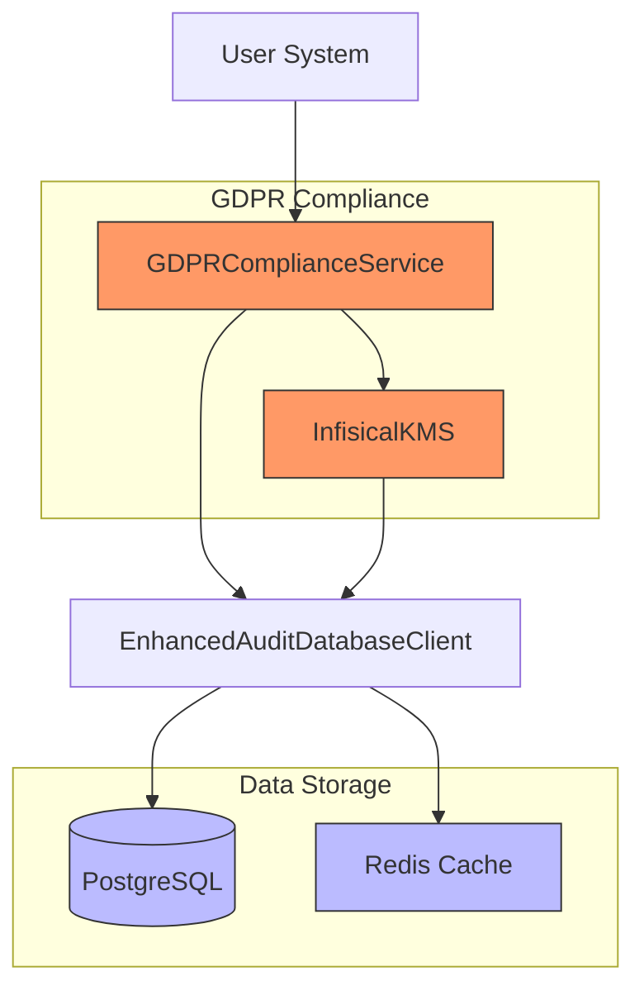

**Diagram sources**
- [gdpr-compliance.ts](file://packages/audit/src/gdpr/gdpr-compliance.ts)
- [enhanced-client.ts](file://packages/audit-db/src/db/enhanced-client.ts)
- [pseudonym_mapping](file://packages/audit-db/drizzle/migrations/0006_silly_tyger_tiger.sql)

**Section sources**
- [gdpr-compliance.ts](file://packages/audit/src/gdpr/gdpr-compliance.ts)
- [pseudonymMapping](file://packages/audit-db/src/db/schema.ts)

### GDPRComplianceService Class

The GDPRComplianceService class implements GDPR requirements for data subject rights and privacy-by-design principles:

```typescript
class GDPRComplianceService {
  private db: PostgresJsDatabase<typeof auditSchema>

  constructor(
    private client: EnhancedAuditDatabaseClient,
    private audit: Audit,
    private kms: InfisicalKmsClient
  ) {
    this.db = this.client.getDatabase()
  }
  
  async exportUserData(request: GDPRDataExportRequest): Promise<GDPRDataExport>
  async pseudonymizeUserData(principalId: string, strategy: PseudonymizationStrategy, requestedBy: string): Promise<{ pseudonymId: string; recordsAffected: number }>
  async applyRetentionPolicies(): Promise<ArchivalResult[]>
  async deleteUserDataWithAuditTrail(principalId: string, requestedBy: string, preserveComplianceAudits: boolean): Promise<{ recordsDeleted: number; complianceRecordsPreserved: number }>
  async getOriginalId(pseudonymId: string): Promise<string | undefined>
}
```

### Key Features

- **Persistent pseudonym mapping**: Stores encrypted pseudonym-to-original ID mappings in the pseudonym_mapping table
- **Multiple pseudonymization strategies**: Supports hash, token, and encryption strategies
- **Referential integrity**: Maintains relationships between pseudonymized records
- **Authorized reverse lookup**: Allows authorized users to retrieve original IDs for compliance investigations
- **Comprehensive audit trail**: Logs all GDPR-related activities for compliance verification
- **Data subject rights**: Implements access, rectification, erasure, portability, and restriction rights

### Pseudonym Mapping Data Model

The pseudonym_mapping table stores the following fields:

- **id**: serial - Primary key
- **timestamp**: timestamp with time zone - Creation timestamp
- **pseudonymId**: text - Pseudonymized identifier
- **originalId**: text - Encrypted original identifier

### Pseudonymization Strategies

The system supports three pseudonymization strategies:

1. **Hash-based**: Uses SHA-256 hashing with salt for deterministic pseudonymization
2. **Token-based**: Generates random tokens for non-deterministic pseudonymization
3. **Encryption-based**: Uses KMS encryption for reversible pseudonymization

### Integration Example

```typescript
// Initialize GDPR compliance service
const gdprService = new GDPRComplianceService(
  enhancedAuditDbClient,
  auditService,
  kmsClient
)

// Pseudonymize user data
const result = await gdprService.pseudonymizeUserData(
  'user-123',
  'hash',
  'admin-user'
)

console.log('Pseudonym ID:', result.pseudonymId)
console.log('Records affected:', result.recordsAffected)

// Retrieve original ID (authorized use only)
const originalId = await gdprService.getOriginalId(result.pseudonymId)
console.log('Original ID:', originalId)

// Export user data for GDPR compliance
const exportRequest = {
  principalId: 'user-123',
  organizationId: 'org-456',
  requestType: 'access',
  format: 'json',
  requestedBy: 'admin-user',
  requestTimestamp: new Date().toISOString()
}

const exportResult = await gdprService.exportUserData(exportRequest)
console.log('Export completed:', exportResult.recordCount, 'records')
```

**Section sources**
- [gdpr-compliance.ts](file://packages/audit/src/gdpr/gdpr-compliance.ts)

### Usage Patterns

The GDPRComplianceService supports several key usage patterns:

1. **User data export**: Export audit data in portable formats (JSON, CSV, XML) for data subject access requests
2. **Data pseudonymization**: Replace original identifiers with pseudonyms while maintaining referential integrity
3. **Right to erasure**: Delete user data while preserving compliance-critical audit trails
4. **Retention policy enforcement**: Automatically archive and delete data based on retention policies
5. **Authorized investigation**: Retrieve original identifiers for compliance investigations with proper authorization
6. **Compliance reporting**: Generate reports for regulatory audits and compliance verification

## Organization Role Management

The Audit Database now supports organization-level role management through the AuthorizationService class, which integrates with the EnhancedAuditDatabaseClient to manage role-based access control with Redis caching and PostgreSQL persistence.

### Organization Role Management Architecture

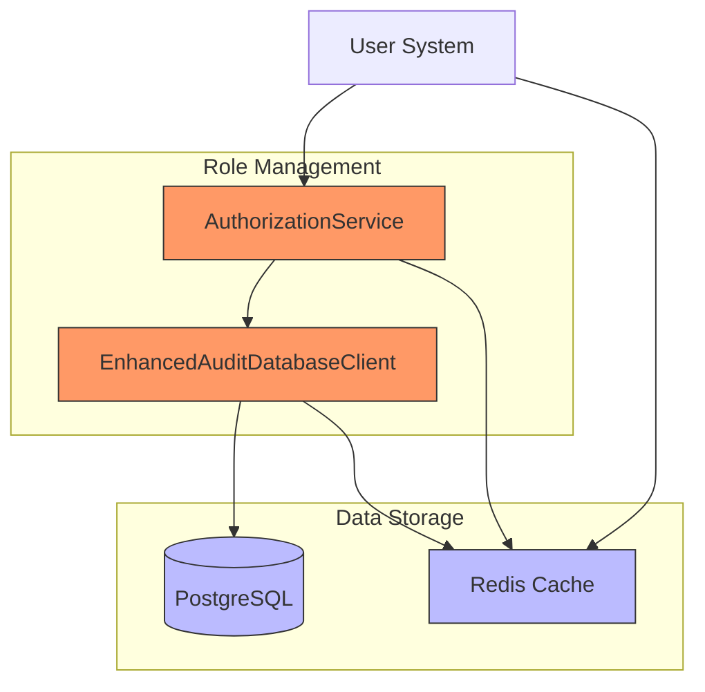

**Diagram sources**
- [authz.ts](file://packages/auth/src/permissions.ts)
- [enhanced-client.ts](file://packages/audit-db/src/db/enhanced-client.ts)
- [organization_role](file://packages/auth/drizzle/0005_fluffy_donald_blake.sql)

**Section sources**
- [authz.ts](file://packages/auth/src/permissions.ts)
- [organization_role](file://packages/auth/drizzle/0005_fluffy_donald_blake.sql)

### AuthorizationService Class

The AuthorizationService class implements role-based access control for organizational permissions:

```typescript
class AuthorizationService {
  private readonly roleCachePrefix = 'authz:roles:'
  private readonly permissionCachePrefix = 'authz:permissions:'
  private readonly retentionPeriod = 5 * 60 // 5 minutes

  constructor(
    private db: PostgresJsDatabase<typeof authSchema>,
    private redis: RedisInstanceType
  ) {
    this.initializeRoles()
  }
  
  async hasPermission(session: Session, resource: string, action: string, context?: Record<string, any>): Promise<boolean>
  async getUserPermissions(session: Session): Promise<Permission[]>
  async getRole(roleName: string): Promise<Role | undefined>
  async getAllRoles(): Promise<Role[]>
  private async initializeRoles(): Promise<void>
  private async getRolePermissions(role: Role): Promise<Permission[]>
  private async checkRolePermissions(role: Role, resource: string, action: string, context?: Record<string, any>): Promise<boolean>
  private async checkResourceSpecificPermissions(session: Session, resource: string, action: string, context?: Record<string, any>): Promise<boolean>
  private async addRoleToDatabase(role: Role): Promise<void>
  private async removeRoleFromDatabase(roleName: string): Promise<void>
}
```

### Key Features

- **Organization-specific roles**: Stores roles with organization_id and name as composite primary key
- **Permission inheritance**: Supports role inheritance through the inherits field
- **Redis caching**: Caches roles and permissions for improved performance
- **PostgreSQL persistence**: Stores role definitions in the organization_role table
- **Composite primary key**: Uses organization_id and name as composite primary key for uniqueness
- **Foreign key constraint**: Enforces referential integrity with the organization table
- **Index optimization**: Includes indexes on organization_id and name for query performance

### Organization Role Data Model

The organization_role table stores the following fields:

- **organizationId**: varchar(50) - Organization identifier (composite primary key)
- **name**: varchar(50) - Role name (composite primary key)
- **description**: text - Role description
- **permissions**: jsonb - Array of permission objects with resource and action
- **inherits**: jsonb - Array of role names that this role inherits from

### Role Management Usage

The AuthorizationService supports several key usage patterns:

1. **Permission checking**: Verify if a user has permission to perform an action on a resource
2. **Role retrieval**: Get role definitions from cache or database
3. **Permission caching**: Cache permission results for 5 minutes to reduce database load
4. **Role inheritance**: Support hierarchical role structures through inheritance
5. **Resource-specific permissions**: Handle ownership and organization-level access rules
6. **System integration**: Integrate with GraphQL resolvers and other services for access control

### Integration Example

```typescript
// Initialize authorization service
const authorizationService = createAuthorizationService(db, redis)

// Check if user has permission
const hasPermission = await authorizationService.hasPermission(
  session,
  'audit.events',
  'read',
  { organizationId: 'org-123' }
)

if (!hasPermission) {
  throw new Error('Access denied')
}

// Get user permissions
const permissions = await authorizationService.getUserPermissions(session)
console.log('User permissions:', permissions)

// Get specific role
const role = await authorizationService.getRole('org-123:admin')
if (role) {
  console.log('Role permissions:', role.permissions)
}
```

**Section sources**
- [authz.ts](file://packages/auth/src/permissions.ts)
- [organization_role](file://packages/auth/drizzle/0005_fluffy_donald_blake.sql)

## Conclusion

The Audit Database is a comprehensive, high-performance system designed to meet the demanding requirements of modern audit and compliance scenarios. By implementing advanced database techniques such as time-based partitioning, Redis caching, and comprehensive performance monitoring, the system delivers excellent performance even with large volumes of audit data.

Key strengths of the system include:

- **Scalability**: The partitioning strategy allows the system to handle massive amounts of data while maintaining query performance.
- **Compliance**: Built-in support for regulatory requirements with 7-year retention, cryptographic integrity verification, and comprehensive audit trails.
- **Security**: Robust access control, encryption at rest, and multi-tenant isolation ensure data protection.
- **Maintainability**: Automated maintenance tasks and comprehensive monitoring reduce operational overhead.
- **Extensibility**: The modular architecture and Drizzle ORM integration make it easy to evolve the schema as requirements change.
- **Alert Persistence**: The new DatabaseAlertHandler provides reliable, persistent storage of alerts with multi-organizational support and comprehensive querying capabilities.
- **GDPR Compliance**: The GDPRComplianceService and pseudonym_mapping table provide robust support for data subject rights and privacy-by-design principles.
- **Organization Role Management**: The AuthorizationService and organization_role table provide fine-grained access control with Redis caching and PostgreSQL persistence.

The system is well-positioned to serve as the foundation for audit and compliance capabilities across various domains, with particular strength in healthcare applications requiring HIPAA compliance. By following the documented patterns and best practices, organizations can ensure their audit data is secure, reliable, and available when needed.