# Database Schema

<cite>
**Referenced Files in This Document**   
- [audit-db.md](file://apps/docs/src/content/docs/audit/audit-db.md)
- [schema.test.ts](file://packages/audit-db/src/__tests__/schema.test.ts)
- [migration-utils.ts](file://packages/audit-db/src/migration-utils.ts)
- [basic-usage.ts](file://packages/audit-sdk/examples/basic-usage.ts)
- [examples.ts](file://packages/audit-sdk/src/__tests__/examples.ts)
- [0004_snapshot.json](file://packages/audit-db/drizzle/migrations/meta/0004_snapshot.json)
- [0003_snapshot.json](file://packages/audit-db/drizzle/migrations/meta/0003_snapshot.json)
- [partitioning.ts](file://packages/audit-db/src/db/partitioning.ts)
- [audit.test.ts](file://packages/audit/src/__tests__/audit.test.ts)
- [0006_silly_tyger_tiger.sql](file://packages/audit-db/drizzle/migrations/0006_silly_tyger_tiger.sql) - *Added in recent commit*
- [schema.ts](file://packages/audit-db/src/db/schema.ts) - *Updated in recent commit*
- [gdpr-compliance.ts](file://packages/audit/src/gdpr/gdpr-compliance.ts) - *Updated in recent commit*
- [gdpr-utils.ts](file://packages/audit/src/gdpr/gdpr-utils.ts) - *Updated in recent commit*
- [0005_fluffy_donald_blake.sql](file://packages/auth/drizzle/0005_fluffy_donald_blake.sql) - *Added in recent commit*
- [authz.ts](file://packages/auth/src/db/schema/authz.ts) - *Added in recent commit*
- [permissions.ts](file://packages/auth/src/permissions.ts) - *Contains permission definitions and role logic*
- [0007_keen_ego.sql](file://packages/audit-db/drizzle/migrations/0007_keen_ego.sql) - *Added in recent commit*
- [0008_swift_black_panther.sql](file://packages/audit-db/drizzle/migrations/0008_swift_black_panther.sql) - *Added in recent commit*
- [0017_past_bishop.sql](file://packages/audit-db/drizzle/migrations/0017_past_bishop.sql) - *Added in recent commit*
</cite>

## Update Summary
**Changes Made**   
- Added new section for delivery system database schema including delivery_destinations, delivery_logs, delivery_queue, destination_health, and webhook_secrets tables
- Updated Data Model Diagram to include new delivery system components and their relationships
- Enhanced Core Components section to include delivery system components
- Updated Architecture Overview diagram to include delivery system components
- Added new sources for migration file 0017_past_bishop.sql
- Updated Constraints and Indexes section to include indexes for new delivery system tables
- Added new sample data entries for delivery system components
- Updated Data Validation and Business Logic section to include delivery system business logic

## Table of Contents
1. [Introduction](#introduction)
2. [Project Structure](#project-structure)
3. [Core Components](#core-components)
4. [Architecture Overview](#architecture-overview)
5. [Detailed Component Analysis](#detailed-component-analysis)
6. [Data Model Diagram](#data-model-diagram)
7. [Entity Relationship Details](#entity-relationship-details)
8. [Sample Data Entries](#sample-data-entries)
9. [Constraints and Indexes](#constraints-and-indexes)
10. [Data Validation and Business Logic](#data-validation-and-business-logic)

## Introduction

This document provides comprehensive data model documentation for the Audit Database schema used in the SMEDREC smart-logs system. The audit logging system is designed to capture, store, and manage audit events with strong emphasis on compliance, data integrity, and retention policies. The schema supports healthcare-specific requirements including HIPAA and GDPR compliance through structured data classification and retention mechanisms.

The database schema is implemented using Drizzle ORM and features partitioned tables for performance optimization, integrity verification mechanisms, and compliance tracking. This documentation details the entity relationships, field definitions, constraints, indexes, and business logic encoded in the schema structure.

## Project Structure

The audit database functionality is organized within the monorepo structure with clear separation of concerns:

- **packages/audit-db**: Contains the core database schema, migrations, and low-level database operations
- **packages/audit-sdk**: Provides the client-facing interface for logging events
- **apps/docs**: Contains documentation including schema references
- **apps/server**: Implements API endpoints that interact with the audit system
- **packages/audit**: Contains core audit service logic and processing
- **packages/auth**: Manages authentication and authorization including role-based access control

The audit database package uses Drizzle ORM for schema definition and migration management, with JSON snapshots used to track schema evolution across versions.

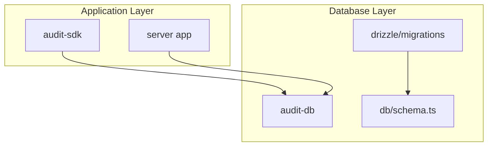

**Diagram sources**
- [audit-db.md](file://apps/docs/src/content/docs/audit/audit-db.md)
- [schema.test.ts](file://packages/audit-db/src/__tests__/schema.test.ts)

**Section sources**
- [audit-db.md](file://apps/docs/src/content/docs/audit/audit-db.md)
- [schema.test.ts](file://packages/audit-db/src/__tests__/schema.test.ts)

## Core Components

The audit database schema consists of several key components that work together to provide a robust audit logging system:

- **audit_log**: Primary table storing all audit events with comprehensive metadata
- **audit_integrity_log**: Tracks integrity verification results for audit records
- **audit_retention_policy**: Defines retention rules based on data classification
- **audit_presets**: Stores predefined logging configurations for consistent event patterns
- **alerts**: Manages alerting based on audit event patterns and anomalies
- **scheduled_reports**: Handles configuration for automated compliance reporting
- **pseudonym_mapping**: Table for GDPR pseudonymization mapping with strategy and unique constraints (updated in recent update)
- **organization_role**: Table for role-based access control with permissions (added in recent update)
- **delivery_destinations**: Table for managing delivery endpoints with configuration and usage tracking (added in recent update)
- **delivery_logs**: Table for tracking delivery attempts, status, and results (added in recent update)
- **delivery_queue**: Table for managing pending deliveries with priority support (added in recent update)
- **destination_health**: Table for monitoring destination status and metrics (added in recent update)
- **webhook_secrets**: Table for secure signature management and secret rotation (added in recent update)

The schema implements partitioning on the audit_log table by timestamp to optimize query performance and storage management. This allows efficient querying of recent data while maintaining historical records.

**Section sources**
- [schema.test.ts](file://packages/audit-db/src/__tests__/schema.test.ts)
- [partitioning.ts](file://packages/audit-db/src/db/partitioning.ts)
- [0006_silly_tyger_tiger.sql](file://packages/audit-db/drizzle/migrations/0006_silly_tyger_tiger.sql) - *Added in recent commit*
- [0005_fluffy_donald_blake.sql](file://packages/auth/drizzle/0005_fluffy_donald_blake.sql) - *Added in recent commit*
- [0007_keen_ego.sql](file://packages/audit-db/drizzle/migrations/0007_keen_ego.sql) - *Added in recent commit*
- [0008_swift_black_panther.sql](file://packages/audit-db/drizzle/migrations/0008_swift_black_panther.sql) - *Added in recent commit*
- [0017_past_bishop.sql](file://packages/audit-db/drizzle/migrations/0017_past_bishop.sql) - *Added in recent commit*
- [schema.ts](file://packages/audit-db/src/db/schema.ts) - *Updated in recent commit*

## Architecture Overview

The audit database architecture follows a layered approach with clear separation between data ingestion, storage, and analysis components. Events are ingested through the audit SDK, processed by the audit service, and stored in the partitioned audit_log table. Secondary processes handle integrity verification, alert generation, report scheduling, and delivery management.

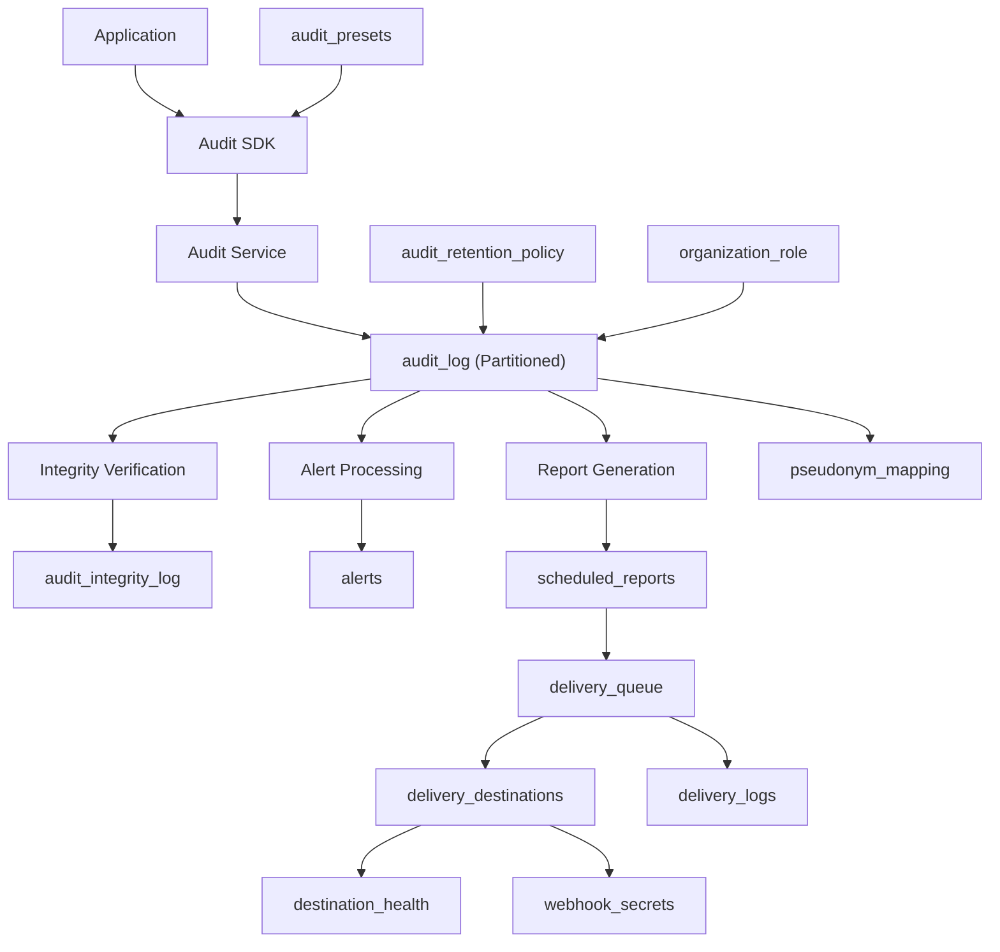

**Diagram sources**
- [schema.test.ts](file://packages/audit-db/src/__tests__/schema.test.ts)
- [migration-utils.ts](file://packages/audit-db/src/migration-utils.ts)
- [0006_silly_tyger_tiger.sql](file://packages/audit-db/drizzle/migrations/0006_silly_tyger_tiger.sql) - *Added in recent commit*
- [0005_fluffy_donald_blake.sql](file://packages/auth/drizzle/0005_fluffy_donald_blake.sql) - *Added in recent commit*
- [0007_keen_ego.sql](file://packages/audit-db/drizzle/migrations/0007_keen_ego.sql) - *Added in recent commit*
- [0008_swift_black_panther.sql](file://packages/audit-db/drizzle/migrations/0008_swift_black_panther.sql) - *Added in recent commit*
- [0017_past_bishop.sql](file://packages/audit-db/drizzle/migrations/0017_past_bishop.sql) - *Added in recent commit*
- [schema.ts](file://packages/audit-db/src/db/schema.ts) - *Updated in recent commit*

## Detailed Component Analysis

### Audit Log Table Analysis

The audit_log table is the central component of the audit system, designed to store comprehensive event data with compliance-focused metadata.

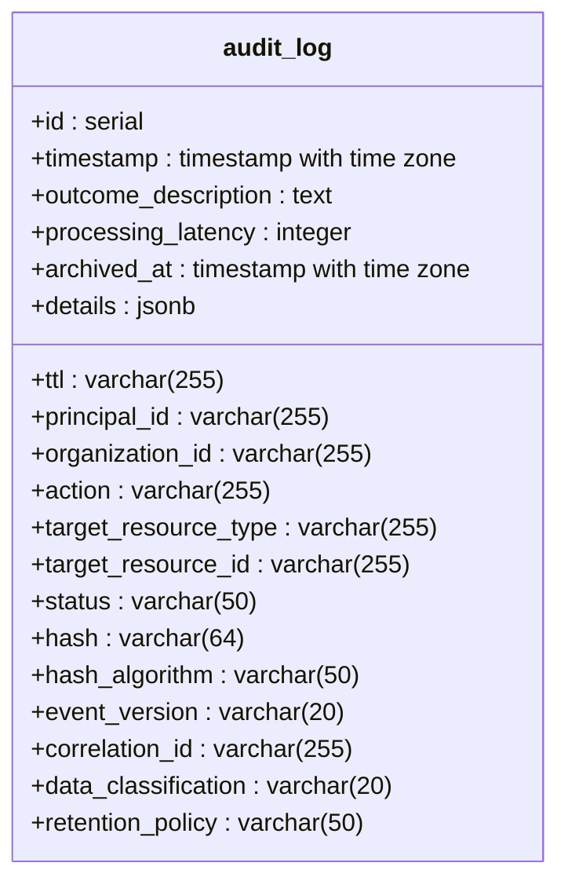

**Diagram sources**
- [0004_snapshot.json](file://packages/audit-db/drizzle/migrations/meta/0004_snapshot.json)
- [partitioning.ts](file://packages/audit-db/src/db/partitioning.ts)

### Integrity Verification Analysis

The audit_integrity_log table provides a mechanism for verifying the integrity of audit records and detecting potential tampering.

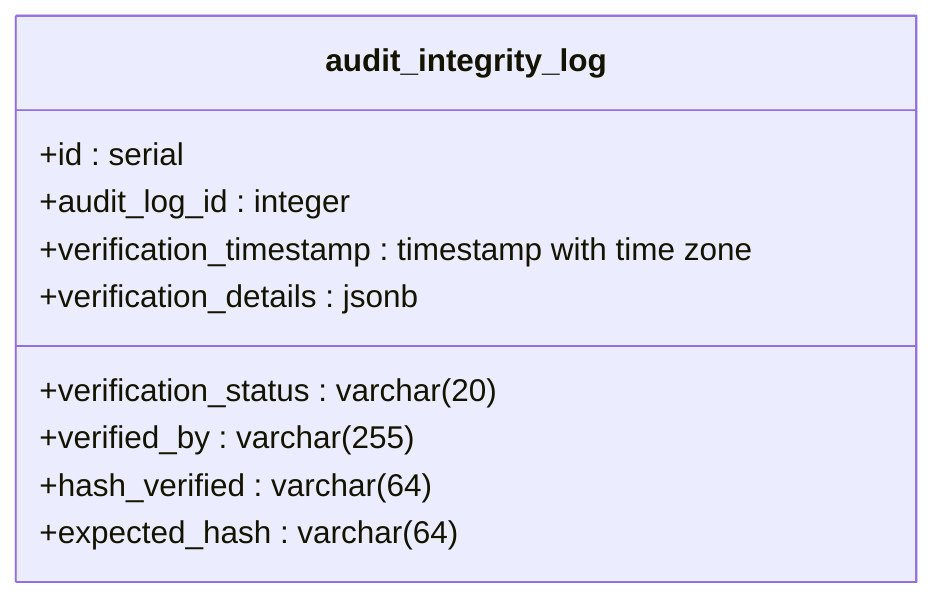

**Diagram sources**
- [0004_snapshot.json](file://packages/audit-db/drizzle/migrations/meta/0004_snapshot.json)
- [schema.test.ts](file://packages/audit-db/src/__tests__/schema.test.ts)

### Pseudonym Mapping Analysis

The pseudonym_mapping table provides GDPR-compliant pseudonymization capabilities by maintaining a secure mapping between original identifiers and pseudonymized identifiers with strategy specification.

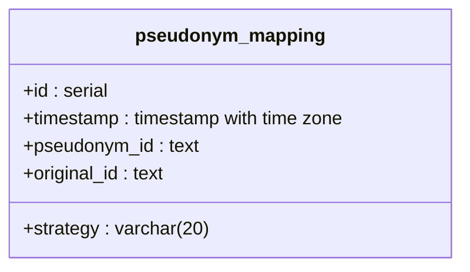

**Diagram sources**
- [0007_keen_ego.sql](file://packages/audit-db/drizzle/migrations/0007_keen_ego.sql)
- [0008_swift_black_panther.sql](file://packages/audit-db/drizzle/migrations/0008_swift_black_panther.sql)
- [schema.ts](file://packages/audit-db/src/db/schema.ts)
- [gdpr-compliance.ts](file://packages/audit/src/gdpr/gdpr-compliance.ts)

### Organization Role Analysis

The organization_role table provides role-based access control by defining roles with specific permissions within organizations.

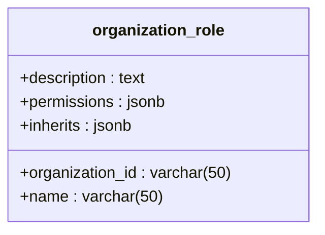

**Diagram sources**
- [0005_fluffy_donald_blake.sql](file://packages/auth/drizzle/0005_fluffy_donald_blake.sql)
- [authz.ts](file://packages/auth/src/db/schema/authz.ts)
- [permissions.ts](file://packages/auth/src/permissions.ts)

### Delivery Destinations Analysis

The delivery_destinations table manages delivery endpoints with configuration, usage tracking, and organizational isolation.

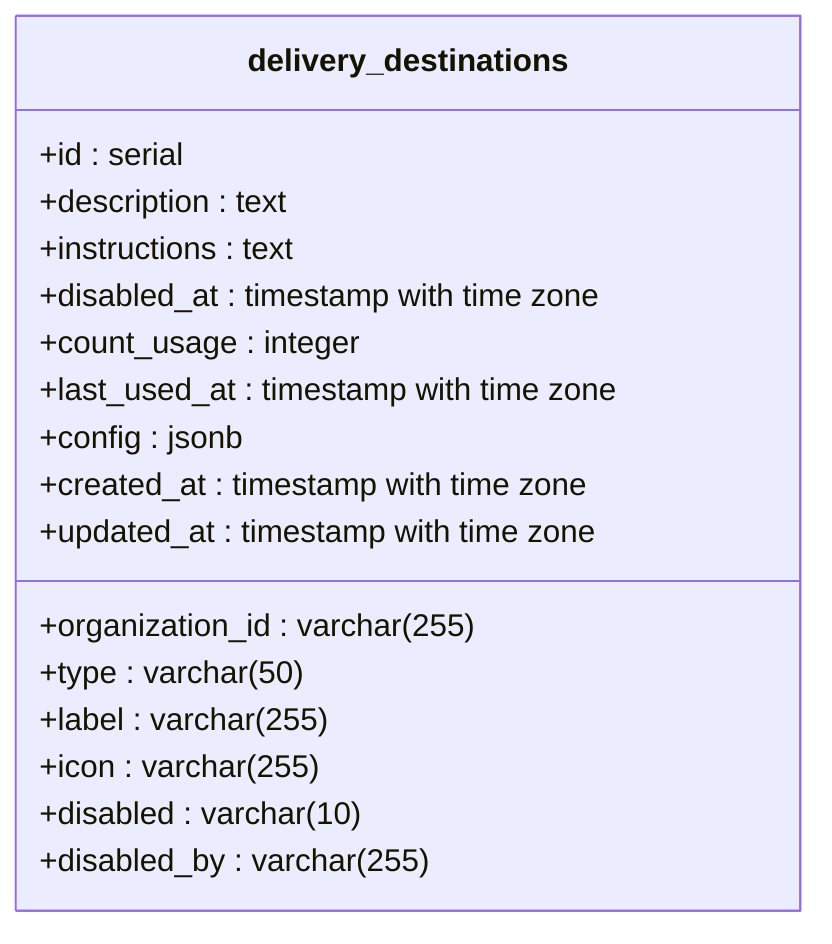

**Diagram sources**
- [0017_past_bishop.sql](file://packages/audit-db/drizzle/migrations/0017_past_bishop.sql)
- [schema.ts](file://packages/audit-db/src/db/schema.ts)

### Delivery Logs Analysis

The delivery_logs table tracks delivery attempts, status, and results with comprehensive metadata for monitoring and troubleshooting.

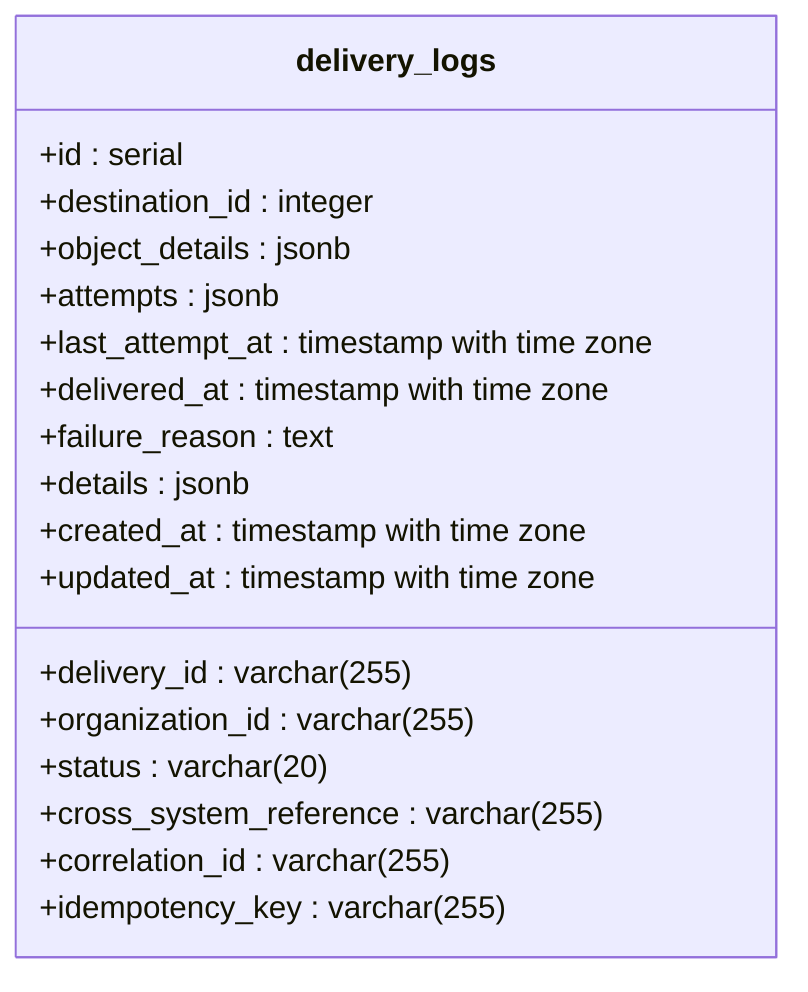

**Diagram sources**
- [0017_past_bishop.sql](file://packages/audit-db/drizzle/migrations/0017_past_bishop.sql)
- [schema.ts](file://packages/audit-db/src/db/schema.ts)

### Delivery Queue Analysis

The delivery_queue table manages pending deliveries with priority support, retry mechanisms, and scheduling.

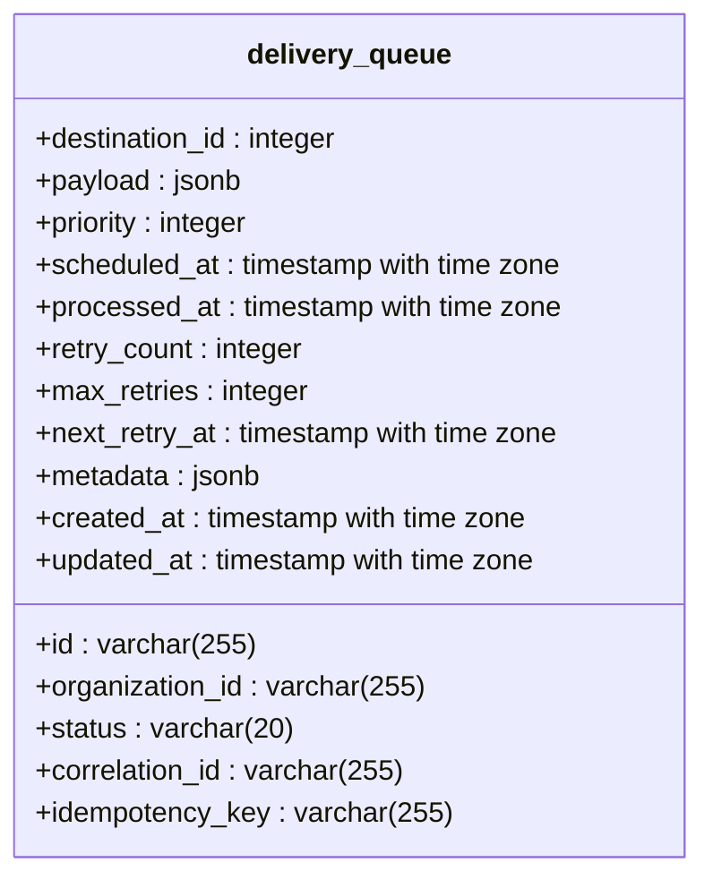

**Diagram sources**
- [schema.ts](file://packages/audit-db/src/db/schema.ts)

### Destination Health Analysis

The destination_health table monitors destination status and metrics with circuit breaker support.

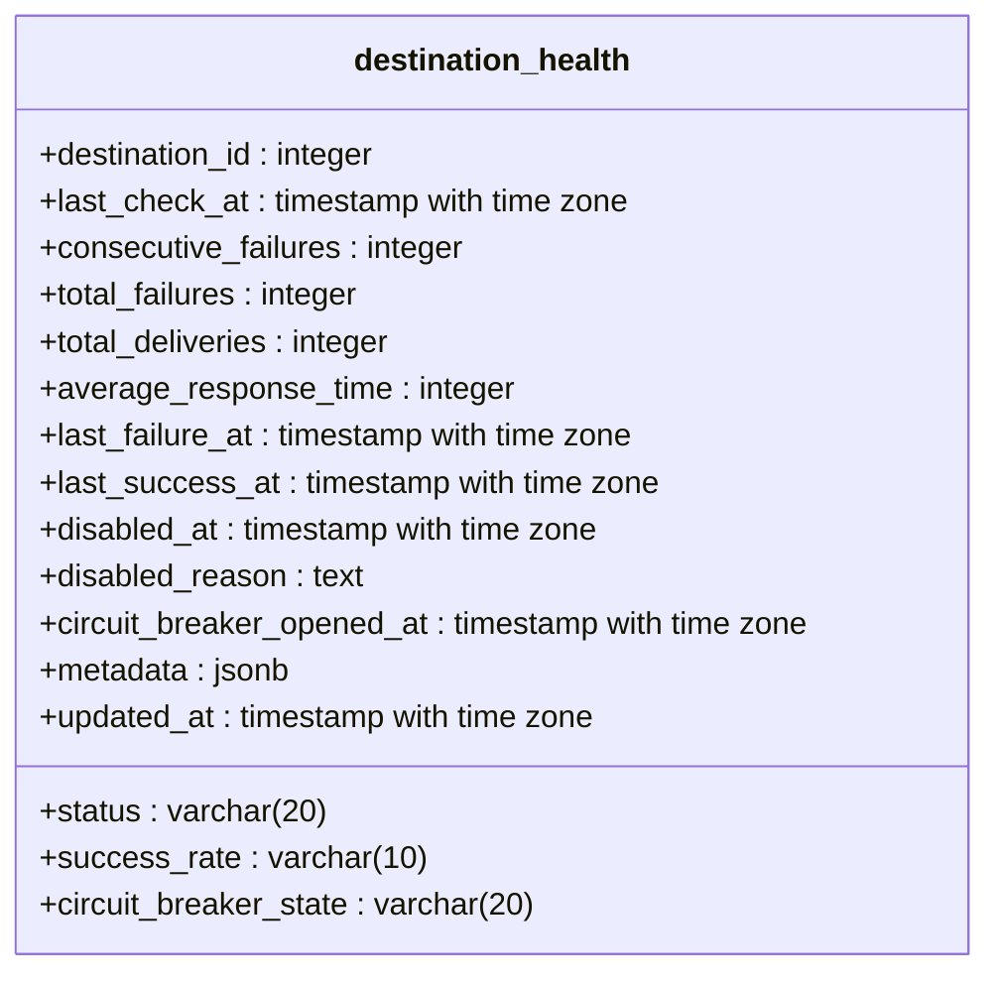

**Diagram sources**
- [schema.ts](file://packages/audit-db/src/db/schema.ts)

### Webhook Secrets Analysis

The webhook_secrets table manages secure signature keys with rotation support and expiration.

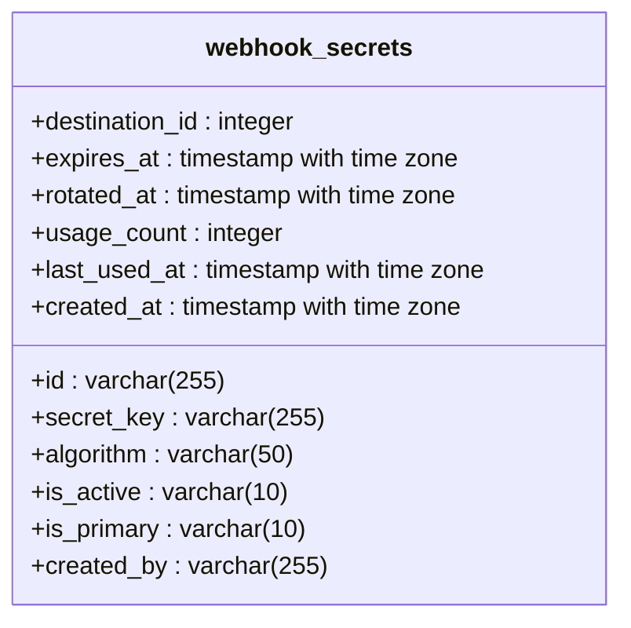

**Diagram sources**
- [schema.ts](file://packages/audit-db/src/db/schema.ts)

## Data Model Diagram

```mermaid
erDiagram
audit_log {
serial id PK
timestamp with time zone timestamp
varchar(255) ttl
varchar(255) principal_id
varchar(255) organization_id
varchar(255) action
varchar(255) target_resource_type
varchar(255) target_resource_id
varchar(50) status
text outcome_description
varchar(64) hash
varchar(50) hash_algorithm
varchar(20) event_version
varchar(255) correlation_id
varchar(20) data_classification
varchar(50) retention_policy
integer processing_latency
timestamp with time zone archived_at
jsonb details
}
audit_integrity_log {
serial id PK
integer audit_log_id FK
timestamp with time zone verification_timestamp
varchar(20) verification_status
jsonb verification_details
varchar(255) verified_by
varchar(64) hash_verified
varchar(64) expected_hash
}
audit_retention_policy {
serial id PK
varchar(50) policy_name UK
integer retention_days
integer archive_after_days
varchar(20) data_classification
text description
boolean is_active
varchar(255) created_by
varchar(255) updated_by
timestamp with time zone created_at
timestamp with time zone updated_at
}
audit_presets {
serial id PK
varchar(50) name UK
jsonb fields
jsonb validation
text description
boolean is_active
varchar(255) created_by
varchar(255) updated_by
timestamp with time zone created_at
timestamp with time zone updated_at
}
alerts {
serial id PK
varchar(50) alert_type
varchar(20) severity
varchar(255) title
text description
varchar(255) source
varchar(50) status
integer count
varchar(20) error_rate
varchar(20) trend
timestamp with time zone first_occurrence
timestamp with time zone last_occurrence
jsonb affected_components
jsonb affected_users
jsonb samples
timestamp with time zone created_at
timestamp with time zone updated_at
timestamp with time zone resolved_at
varchar(255) resolved_by
}
scheduled_reports {
serial id PK
varchar(255) organization_id
varchar(50) report_type
varchar(255) template_id
varchar(255) name
text description
jsonb filters
jsonb recipients
varchar(20) frequency
varchar(20) format
boolean enabled
timestamp with time zone last_run
timestamp with time zone next_run
timestamp with time zone created_at
timestamp with time zone updated_at
varchar(255) created_by
varchar(255) updated_by
}
pseudonym_mapping {
serial id PK
timestamp with time zone timestamp
text pseudonym_id
text original_id
varchar(20) strategy
}
organization_role {
varchar(50) organization_id PK
varchar(50) name PK
text description
jsonb permissions
jsonb inherits
}
delivery_destinations {
serial id PK
varchar(255) organization_id
varchar(50) type
varchar(255) label
text description
varchar(255) icon
text instructions
varchar(10) disabled
timestamp with time zone disabled_at
varchar(255) disabled_by
integer count_usage
timestamp with time zone last_used_at
jsonb config
timestamp with time zone created_at
timestamp with time zone updated_at
}
delivery_logs {
serial id PK
varchar(255) delivery_id
integer destination_id FK
varchar(255) organization_id
jsonb object_details
varchar(20) status
jsonb attempts
timestamp with time zone last_attempt_at
timestamp with time zone delivered_at
text failure_reason
varchar(255) cross_system_reference
varchar(255) correlation_id
varchar(255) idempotency_key
jsonb details
timestamp with time zone created_at
timestamp with time zone updated_at
}
delivery_queue {
varchar(255) id PK
varchar(255) organization_id
integer destination_id FK
jsonb payload
integer priority
timestamp with time zone scheduled_at
timestamp with time zone processed_at
varchar(20) status
varchar(255) correlation_id
varchar(255) idempotency_key
integer retry_count
integer max_retries
timestamp with time zone next_retry_at
jsonb metadata
timestamp with time zone created_at
timestamp with time zone updated_at
}
destination_health {
integer destination_id PK
varchar(20) status
timestamp with time zone last_check_at
integer consecutive_failures
integer total_failures
integer total_deliveries
varchar(10) success_rate
integer average_response_time
timestamp with time zone last_failure_at
timestamp with time zone last_success_at
timestamp with time zone disabled_at
text disabled_reason
varchar(20) circuit_breaker_state
timestamp with time zone circuit_breaker_opened_at
jsonb metadata
timestamp with time zone updated_at
}
webhook_secrets {
varchar(255) id PK
integer destination_id FK
varchar(255) secret_key
varchar(50) algorithm
varchar(10) is_active
varchar(10) is_primary
timestamp with time zone expires_at
timestamp with time zone rotated_at
integer usage_count
timestamp with time zone last_used_at
timestamp with time zone created_at
varchar(255) created_by
}
audit_log ||--o{ audit_integrity_log : "1 to many"
audit_log }|--|| audit_retention_policy : "retention_policy → policy_name"
audit_log }|--|| audit_presets : "preset references"
alerts }|--|| audit_log : "references events"
scheduled_reports }|--|| audit_presets : "uses templates"
audit_log }|--|| pseudonym_mapping : "GDPR pseudonymization"
audit_log }|--|| organization_role : "organization role management"
scheduled_reports }|--|| delivery_queue : "scheduled delivery"
delivery_queue }|--|| delivery_destinations : "delivery destination"
delivery_queue }|--|| delivery_logs : "delivery tracking"
delivery_destinations }|--|| destination_health : "health monitoring"
delivery_destinations }|--|| webhook_secrets : "secure signatures"
delivery_queue }|--|| destination_health : "circuit breaker"
```

**Diagram sources**
- [0004_snapshot.json](file://packages/audit-db/drizzle/migrations/meta/0004_snapshot.json)
- [0003_snapshot.json](file://packages/audit-db/drizzle/migrations/meta/0003_snapshot.json)
- [0006_silly_tyger_tiger.sql](file://packages/audit-db/drizzle/migrations/0006_silly_tyger_tiger.sql) - *Added in recent commit*
- [schema.ts](file://packages/audit-db/src/db/schema.ts) - *Updated in recent commit*
- [0005_fluffy_donald_blake.sql](file://packages/auth/drizzle/0005_fluffy_donald_blake.sql) - *Added in recent commit*
- [0007_keen_ego.sql](file://packages/audit-db/drizzle/migrations/0007_keen_ego.sql) - *Added in recent commit*
- [0008_swift_black_panther.sql](file://packages/audit-db/drizzle/migrations/0008_swift_black_panther.sql) - *Added in recent commit*
- [0017_past_bishop.sql](file://packages/audit-db/drizzle/migrations/0017_past_bishop.sql) - *Added in recent commit*

## Entity Relationship Details

### audit_log Table

The audit_log table serves as the primary repository for all audit events in the system. It is designed with compliance and performance in mind, featuring partitioning by timestamp and comprehensive metadata fields.

**Field Definitions:**
- **id**: Serial primary key, auto-incrementing identifier
- **timestamp**: Timestamp with time zone, records when the event occurred (indexed)
- **ttl**: Time-to-live indicator for record retention
- **principal_id**: Identifier of the entity performing the action
- **organization_id**: Identifier of the organization associated with the event
- **action**: Descriptive name of the action performed (e.g., "userLoginAttempt", "dataAccess")
- **target_resource_type**: Type of resource targeted by the action
- **target_resource_id**: Identifier of the specific resource targeted
- **status**: Outcome status of the action (e.g., "success", "failure")
- **outcome_description**: Human-readable description of the outcome
- **hash**: Cryptographic hash of the event data for integrity verification
- **hash_algorithm**: Algorithm used for hashing (default: SHA-256)
- **event_version**: Version of the event schema (default: 1.0)
- **correlation_id**: Identifier for correlating related events across systems
- **data_classification**: Sensitivity level of the data involved (INTERNAL, PHI, CONFIDENTIAL, PUBLIC)
- **retention_policy**: Name of the retention policy to apply to this record
- **processing_latency**: Processing time in milliseconds
- **archived_at**: Timestamp when the record was archived
- **details**: JSONB field for additional structured data specific to the event type

**Constraints:**
- Primary Key: id
- Not Null Constraints: timestamp, action, status
- Default Values: hash_algorithm ('SHA-256'), event_version ('1.0'), data_classification ('INTERNAL'), retention_policy ('standard')

**Indexes:**
- audit_log_timestamp_idx: Index on timestamp for time-based queries
- audit_log_principal_id_idx: Index on principal_id for user activity tracking
- audit_log_action_idx: Index on action for operation type filtering
- audit_log_status_idx: Index on status for success/failure analysis
- audit_log_correlation_id_idx: Index on correlation_id for traceability
- audit_log_data_classification_idx: Index on data_classification for compliance reporting
- audit_log_retention_policy_idx: Index on retention_policy for lifecycle management
- audit_log_archived_at_idx: Index on archived_at for archival status queries

**Section sources**
- [partitioning.ts](file://packages/audit-db/src/db/partitioning.ts)
- [0004_snapshot.json](file://packages/audit-db/drizzle/migrations/meta/0004_snapshot.json)

### audit_integrity_log Table

The audit_integrity_log table provides a mechanism for verifying the integrity of audit records and detecting potential tampering or data corruption.

**Field Definitions:**
- **id**: Serial primary key, auto-incrementing identifier
- **audit_log_id**: Foreign key referencing the audited record in audit_log
- **verification_timestamp**: When the integrity verification was performed
- **verification_status**: Result of the verification (e.g., "SUCCESS", "FAILURE", "WARNING")
- **verification_details**: JSONB field containing detailed verification information
- **verified_by**: Identifier of the entity or system that performed the verification
- **hash_verified**: The hash value that was verified
- **expected_hash**: The expected hash value for comparison

**Constraints:**
- Primary Key: id
- Foreign Key: audit_log_id references audit_log(id)
- Not Null Constraints: audit_log_id, verification_timestamp, verification_status
- Default Values: verification_timestamp (current timestamp)

**Indexes:**
- audit_integrity_log_audit_log_id_idx: Index on audit_log_id for event lookup
- audit_integrity_log_verification_timestamp_idx: Index on verification_timestamp for temporal analysis
- audit_integrity_log_verification_status_idx: Index on verification_status for health monitoring
- audit_integrity_log_verified_by_idx: Index on verified_by for accountability

**Section sources**
- [0004_snapshot.json](file://packages/audit-db/drizzle/migrations/meta/0004_snapshot.json)
- [schema.test.ts](file://packages/audit-db/src/__tests__/schema.test.ts)

### audit_retention_policy Table

The audit_retention_policy table defines retention rules based on data classification and regulatory requirements.

**Field Definitions:**
- **id**: Serial primary key, auto-incrementing identifier
- **policy_name**: Unique name of the retention policy
- **retention_days**: Number of days to retain records before deletion
- **archive_after_days**: Number of days after which records should be archived
- **data_classification**: Data classification level this policy applies to
- **description**: Human-readable description of the policy
- **is_active**: Boolean indicating if the policy is currently active
- **created_by**: Identifier of the entity that created the policy
- **updated_by**: Identifier of the entity that last updated the policy
- **created_at**: Timestamp when the policy was created
- **updated_at**: Timestamp when the policy was last updated

**Constraints:**
- Primary Key: id
- Unique Constraint: policy_name
- Not Null Constraints: policy_name, retention_days, archive_after_days, data_classification, is_active, created_by, created_at, updated_at
- Default Values: is_active (true), created_at (current timestamp), updated_at (current timestamp)

**Indexes:**
- audit_retention_policy_policy_name_idx: Index on policy_name for direct lookup
- audit_retention_policy_data_classification_idx: Index on data_classification for classification-based queries
- audit_retention_policy_is_active_idx: Index on is_active for active policy filtering

**Section sources**
- [migration-utils.ts](file://packages/audit-db/src/migration-utils.ts)
- [0004_snapshot.json](file://packages/audit-db/drizzle/migrations/meta/0004_snapshot.json)

### audit_presets Table

The audit_presets table stores predefined logging configurations to ensure consistency in event logging across the system.

**Field Definitions:**
- **id**: Serial primary key, auto-incrementing identifier
- **name**: Unique name of the preset
- **fields**: JSONB field defining required and optional fields for this preset
- **validation**: JSONB field containing validation rules for the preset
- **description**: Human-readable description of the preset's purpose
- **is_active**: Boolean indicating if the preset is currently active
- **created_by**: Identifier of the entity that created the preset
- **updated_by**: Identifier of the entity that last updated the preset
- **created_at**: Timestamp when the preset was created
- **updated_at**: Timestamp when the preset was last updated

**Constraints:**
- Primary Key: id
- Unique Constraint: name
- Not Null Constraints: name, fields, validation, is_active, created_by, created_at, updated_at
- Default Values: is_active (true), created_at (current timestamp), updated_at (current timestamp)

**Indexes:**
- audit_presets_name_idx: Index on name for direct lookup
- audit_presets_is_active_idx: Index on is_active for active preset filtering

**Section sources**
- [migration-utils.ts](file://packages/audit-db/src/migration-utils.ts)
- [0004_snapshot.json](file://packages/audit-db/drizzle/migrations/meta/0004_snapshot.json)

### alerts Table

The alerts table manages alerting based on audit event patterns, anomalies, and system health issues.

**Field Definitions:**
- **id**: Serial primary key, auto-incrementing identifier
- **alert_type**: Category of the alert (e.g., "SECURITY", "PERFORMANCE", "COMPLIANCE")
- **severity**: Severity level (HIGH, MEDIUM, LOW)
- **title**: Brief descriptive title of the alert
- **description**: Detailed description of the alert condition
- **source**: System or component that generated the alert
- **status**: Current status (ACTIVE, RESOLVED, ACKNOWLEDGED)
- **count**: Number of occurrences
- **error_rate**: Error rate percentage as string
- **trend**: Trend analysis (STABLE, INCREASING, DECREASING)
- **first_occurrence**: When the alert condition was first detected
- **last_occurrence**: When the alert condition was last detected
- **affected_components**: JSONB array of affected system components
- **affected_users**: JSONB array of affected users
- **samples**: JSONB array of sample event IDs for investigation
- **created_at**: Timestamp when the alert was created
- **updated_at**: Timestamp when the alert was last updated
- **resolved_at**: Timestamp when the alert was resolved
- **resolved_by**: Identifier of the entity that resolved the alert

**Constraints:**
- Primary Key: id
- Not Null Constraints: alert_type, severity, title, source, status, count, error_rate, trend, first_occurrence, last_occurrence, affected_components, affected_users, samples, created_at, updated_at
- Default Values: count (0), error_rate ('0'), trend ('STABLE'), created_at (current timestamp), updated_at (current timestamp)

**Indexes:**
- alerts_alert_type_idx: Index on alert_type for category filtering
- alerts_severity_idx: Index on severity for priority sorting
- alerts_status_idx: Index on status for workflow management
- alerts_first_occurrence_idx: Index on first_occurrence for temporal analysis
- alerts_last_occurrence_idx: Index on last_occurrence for recency filtering
- alerts_resolved_at_idx: Index on resolved_at for resolution tracking

**Section sources**
- [0004_snapshot.json](file://packages/audit-db/drizzle/migrations/meta/0004_snapshot.json)
- [resolvers.test.ts](file://apps/server/src/lib/graphql/__tests__/resolvers.test.ts)

### scheduled_reports Table

The scheduled_reports table handles configuration for automated compliance reporting.

**Field Definitions:**
- **id**: Serial primary key, auto-incrementing identifier
- **organization_id**: Identifier of the organization for which the report is scheduled
- **report_type**: Type of report (e.g., "DAILY_SUMMARY", "WEEKLY_COMPLIANCE")
- **template_id**: Identifier of the report template to use
- **name**: Descriptive name of the scheduled report
- **description**: Detailed description of the report purpose
- **filters**: JSONB object containing report filters and parameters
- **recipients**: JSONB array of email addresses or user IDs to receive the report
- **frequency**: Schedule frequency (DAILY, WEEKLY, MONTHLY)
- **format**: Output format (PDF, CSV, JSON)
- **enabled**: Boolean indicating if the schedule is active
- **last_run**: Timestamp of the last report generation
- **next_run**: Timestamp when the next report should be generated
- **created_at**: Timestamp when the schedule was created
- **updated_at**: Timestamp when the schedule was last updated
- **created_by**: Identifier of the entity that created the schedule
- **updated_by**: Identifier of the entity that last updated the schedule

**Constraints:**
- Primary Key: id
- Not Null Constraints: organization_id, report_type, template_id, name, filters, recipients, frequency, format, enabled, created_at, updated_at, created_by
- Default Values: enabled (true), created_at (current timestamp), updated_at (current timestamp)

**Indexes:**
- scheduled_reports_organization_id_idx: Index on organization_id for organizational filtering
- scheduled_reports_template_id_idx: Index on template_id for template-based queries
- scheduled_reports_enabled_idx: Index on enabled for active schedule filtering
- scheduled_reports_next_run_idx: Index on next_run for scheduling efficiency
- scheduled_reports_created_at_idx: Index on created_at for creation time sorting
- scheduled_reports_created_by_idx: Index on created_by for accountability
- scheduled_reports_org_enabled_idx: Composite index on organization_id and enabled for common queries

**Section sources**
- [0004_snapshot.json](file://packages/audit-db/drizzle/migrations/meta/0004_snapshot.json)
- [resolvers.test.ts](file://apps/server/src/lib/graphql/__tests__/resolvers.test.ts)

### pseudonym_mapping Table

The pseudonym_mapping table provides GDPR-compliant pseudonymization capabilities by securely maintaining the mapping between original identifiers and their pseudonymized counterparts. This enables data subject rights fulfillment while preserving referential integrity in audit logs. The table now includes a strategy column to specify the pseudonymization method used and a unique constraint on original_id to prevent duplicate mappings.

**Field Definitions:**
- **id**: Serial primary key, auto-incrementing identifier
- **timestamp**: Timestamp when the pseudonymization mapping was created
- **pseudonym_id**: The pseudonymized identifier used in place of the original ID
- **original_id**: The encrypted original identifier, stored securely for authorized reversal
- **strategy**: The pseudonymization strategy used (hash, token, encryption)

**Constraints:**
- Primary Key: id
- Not Null Constraints: timestamp, pseudonym_id, original_id, strategy
- Unique Constraint: original_id (ensures each original ID has only one pseudonym mapping)

**Indexes:**
- pseudonym_mapping_timestamp_idx: B-tree index on timestamp for temporal analysis of pseudonymization activities
- pseudonym_mapping_pseudonym_id_idx: B-tree index on pseudonym_id for efficient lookup of pseudonymized IDs
- pseudonym_mapping_original_id_idx: B-tree unique index on original_id for efficient lookup and prevention of duplicate mappings
- pseudonym_mapping_strategy_idx: B-tree index on strategy for querying by pseudonymization method

**Section sources**
- [0007_keen_ego.sql](file://packages/audit-db/drizzle/migrations/0007_keen_ego.sql) - *Added in recent commit*
- [0008_swift_black_panther.sql](file://packages/audit-db/drizzle/migrations/0008_swift_black_panther.sql) - *Added in recent commit*
- [schema.ts](file://packages/audit-db/src/db/schema.ts) - *Updated in recent commit*
- [gdpr-compliance.ts](file://packages/audit/src/gdpr/gdpr-compliance.ts) - *Updated in recent commit*

### organization_role Table

The organization_role table provides role-based access control by defining roles with specific permissions within organizations. Each role is scoped to an organization and contains a set of permissions that define what actions users with that role can perform.

**Field Definitions:**
- **organization_id**: Organization identifier, part of composite primary key and foreign key to organization table
- **name**: Role name, part of composite primary key (e.g., "admin", "member", "viewer")
- **description**: Human-readable description of the role's purpose and responsibilities
- **permissions**: JSONB array containing permission objects with resource and action fields
- **inherits**: JSONB array of role names that this role inherits permissions from

**Constraints:**
- Primary Key: organization_id and name (composite primary key)
- Foreign Key: organization_id references organization.id with cascade delete
- Not Null Constraints: organization_id, name, permissions

**Indexes:**
- organization_role_organization_id_idx: B-tree index on organization_id for organization-based queries
- organization_role_name_idx: B-tree index on name for role-based queries

**Section sources**
- [0005_fluffy_donald_blake.sql](file://packages/auth/drizzle/0005_fluffy_donald_blake.sql) - *Added in recent commit*
- [authz.ts](file://packages/auth/src/db/schema/authz.ts) - *Added in recent commit*
- [permissions.ts](file://packages/auth/src/permissions.ts) - *Contains permission definitions and role logic*

### delivery_destinations Table

The delivery_destinations table manages delivery endpoints with configuration, usage tracking, and organizational isolation. It supports various delivery types including email, S3, and FTP with flexible configuration storage in JSONB format.

**Field Definitions:**
- **id**: Serial primary key, auto-incrementing identifier
- **organization_id**: Identifier of the organization that owns this destination
- **type**: Type of delivery destination (e.g., 'email', 's3', 'ftp')
- **label**: Human-readable label for the destination
- **description**: Optional description of the destination
- **icon**: URL or icon name for visual representation
- **instructions**: Setup or usage instructions for the destination
- **disabled**: Boolean indicating if the destination is disabled (stored as varchar)
- **disabled_at**: Timestamp when the destination was disabled
- **disabled_by**: Identifier of the entity that disabled the destination
- **count_usage**: Counter for tracking usage frequency
- **last_used_at**: Timestamp of the last delivery attempt
- **config**: JSONB field containing configuration details specific to the destination type
- **created_at**: Timestamp when the destination was created
- **updated_at**: Timestamp when the destination was last updated

**Constraints:**
- Primary Key: id
- Not Null Constraints: organization_id, type, label, config
- Default Values: disabled ('false'), count_usage (0), created_at (current timestamp), updated_at (current timestamp)
- Unique Constraint: organization_id and label (ensures unique labels within each organization)

**Indexes:**
- delivery_destinations_type_idx: B-tree index on type for delivery type filtering
- delivery_destinations_organization_id_idx: B-tree index on organization_id for organizational queries
- delivery_destinations_disabled_idx: B-tree index on disabled for status filtering
- delivery_destinations_last_used_at_idx: B-tree index on last_used_at for usage analysis
- delivery_destinations_org_label_unique: B-tree unique index on organization_id and label for preventing duplicate labels
- delivery_destinations_created_at_idx: B-tree index on created_at for creation time sorting
- delivery_destinations_updated_at_idx: B-tree index on updated_at for modification time sorting

**Section sources**
- [0017_past_bishop.sql](file://packages/audit-db/drizzle/migrations/0017_past_bishop.sql) - *Added in recent commit*
- [schema.ts](file://packages/audit-db/src/db/schema.ts) - *Updated in recent commit*

### delivery_logs Table

The delivery_logs table tracks delivery attempts, status, and results with comprehensive metadata for monitoring and troubleshooting. It provides a complete history of delivery operations for auditing and analysis.

**Field Definitions:**
- **id**: Serial primary key, auto-incrementing identifier
- **delivery_id**: Global delivery identifier for cross-system tracking
- **destination_id**: Foreign key referencing the delivery destination
- **organization_id**: Identifier of the organization for organizational isolation
- **object_details**: JSONB field containing details about the delivered object (type, id, name, size, format, etc.)
- **status**: Current status of the delivery (pending, delivered, failed, retrying)
- **attempts**: JSONB array containing timestamps and details of each delivery attempt
- **last_attempt_at**: Timestamp of the last delivery attempt
- **delivered_at**: Timestamp when the delivery was successfully completed
- **failure_reason**: Text field containing the reason for delivery failure
- **cross_system_reference**: External tracking reference for integration with other systems
- **correlation_id**: Identifier for request correlation across systems
- **idempotency_key**: Key for duplicate detection and prevention
- **details**: JSONB field for additional delivery details and metadata
- **created_at**: Timestamp when the delivery log was created
- **updated_at**: Timestamp when the delivery log was last updated

**Constraints:**
- Primary Key: id
- Foreign Key: destination_id references delivery_destinations.id
- Not Null Constraints: delivery_id, destination_id, organization_id, object_details, status, attempts, created_at, updated_at
- Default Values: attempts ('[]'), created_at (current timestamp), updated_at (current timestamp)

**Indexes:**
- delivery_logs_delivery_id_idx: B-tree index on delivery_id for delivery tracking
- delivery_logs_destination_id_idx: B-tree index on destination_id for destination-based queries
- delivery_logs_organization_id_idx: B-tree index on organization_id for organizational filtering
- delivery_logs_status_idx: B-tree index on status for workflow management
- delivery_logs_attempts_idx: B-tree index on attempts for retry analysis
- delivery_logs_last_attempt_at_idx: B-tree index on last_attempt_at for recency filtering
- delivery_logs_delivered_at_idx: B-tree index on delivered_at for success tracking
- delivery_logs_cross_system_reference_idx: B-tree index on cross_system_reference for external tracking
- delivery_logs_correlation_id_idx: B-tree index on correlation_id for request correlation
- delivery_logs_idempotency_key_idx: B-tree index on idempotency_key for duplicate detection
- delivery_logs_created_at_idx: B-tree index on created_at for creation time sorting
- delivery_logs_updated_at_idx: B-tree index on updated_at for modification time sorting
- delivery_logs_destination_status_idx: Composite index on destination_id and status for common queries
- delivery_logs_status_attempts_idx: Composite index on status and attempts for retry analysis
- delivery_logs_org_status_idx: Composite index on organization_id and status for organizational workflow management
- delivery_logs_org_created_idx: Composite index on organization_id and created_at for organizational time-based queries

**Section sources**
- [schema.ts](file://packages/audit-db/src/db/schema.ts) - *Updated in recent commit*

### delivery_queue Table

The delivery_queue table manages pending deliveries with priority support, retry mechanisms, and scheduling. It implements a queue-based processing system for reliable delivery operations.

**Field Definitions:**
- **id**: Varchar primary key, globally unique delivery identifier
- **organization_id**: Identifier of the organization for organizational isolation
- **destination_id**: Foreign key referencing the delivery destination
- **payload**: JSONB field containing the complete delivery payload
- **priority**: Integer indicating delivery priority (0-10, higher = more priority)
- **scheduled_at**: Timestamp when the delivery is scheduled to be processed
- **processed_at**: Timestamp when the delivery was successfully processed
- **status**: Current status of the delivery (pending, processing, completed, failed)
- **correlation_id**: Identifier for request correlation across systems
- **idempotency_key**: Key for duplicate detection and prevention
- **retry_count**: Number of retry attempts made
- **max_retries**: Maximum number of retry attempts allowed
- **next_retry_at**: Timestamp when the next retry should be attempted
- **metadata**: JSONB field for additional metadata and context
- **created_at**: Timestamp when the delivery was queued
- **updated_at**: Timestamp when the delivery record was last updated

**Constraints:**
- Primary Key: id
- Foreign Key: destination_id references delivery_destinations.id
- Not Null Constraints: organization_id, destination_id, payload, priority, scheduled_at, status, retry_count, max_retries, created_at, updated_at
- Default Values: priority (0), status ('pending'), retry_count (0), max_retries (5), created_at (current timestamp), updated_at (current timestamp)

**Indexes:**
- delivery_queue_organization_id_idx: B-tree index on organization_id for organizational queries
- delivery_queue_destination_id_idx: B-tree index on destination_id for destination-based queries
- delivery_queue_status_idx: B-tree index on status for workflow management
- delivery_queue_priority_idx: B-tree index on priority for priority-based processing
- delivery_queue_scheduled_at_idx: B-tree index on scheduled_at for scheduling efficiency
- delivery_queue_next_retry_at_idx: B-tree index on next_retry_at for retry scheduling
- delivery_queue_correlation_id_idx: B-tree index on correlation_id for request correlation
- delivery_queue_idempotency_key_idx: B-tree index on idempotency_key for duplicate detection
- delivery_queue_created_at_idx: B-tree index on created_at for creation time sorting
- delivery_queue_status_priority_idx: Composite index on status and priority for queue processing
- delivery_queue_status_scheduled_idx: Composite index on status and scheduled_at for scheduling efficiency
- delivery_queue_org_status_idx: Composite index on organization_id and status for organizational workflow management
- delivery_queue_retry_scheduled_idx: Composite index on next_retry_at and status for retry scheduling

**Section sources**
- [schema.ts](file://packages/audit-db/src/db/schema.ts) - *Updated in recent commit*

### destination_health Table

The destination_health table monitors destination status and metrics with circuit breaker support. It provides real-time health monitoring and failure tracking for delivery destinations.

**Field Definitions:**
- **destination_id**: Integer primary key, referencing the delivery destination
- **status**: Current status of the destination (healthy, degraded, unhealthy, disabled)
- **last_check_at**: Timestamp of the last health check
- **consecutive_failures**: Counter for consecutive delivery failures
- **total_failures**: Counter for total delivery failures
- **total_deliveries**: Counter for total delivery attempts
- **success_rate**: Success rate percentage as string
- **average_response_time**: Average response time in milliseconds
- **last_failure_at**: Timestamp of the last failure
- **last_success_at**: Timestamp of the last successful delivery
- **disabled_at**: Timestamp when the destination was disabled
- **disabled_reason**: Text field containing the reason for disabling
- **circuit_breaker_state**: Current state of the circuit breaker (closed, open, half-open)
- **circuit_breaker_opened_at**: Timestamp when the circuit breaker was opened
- **metadata**: JSONB field for additional health monitoring metadata
- **updated_at**: Timestamp when the health record was last updated

**Constraints:**
- Primary Key: destination_id
- Foreign Key: destination_id references delivery_destinations.id
- Not Null Constraints: status, last_check_at, consecutive_failures, total_failures, total_deliveries, success_rate, updated_at
- Default Values: consecutive_failures (0), total_failures (0), total_deliveries (0), success_rate ('0'), circuit_breaker_state ('closed'), updated_at (current timestamp)

**Indexes:**
- destination_health_status_idx: B-tree index on status for health status filtering
- destination_health_last_check_at_idx: B-tree index on last_check_at for health check timing
- destination_health_consecutive_failures_idx: B-tree index on consecutive_failures for failure analysis
- destination_health_success_rate_idx: B-tree index on success_rate for performance monitoring
- destination_health_circuit_breaker_state_idx: B-tree index on circuit_breaker_state for circuit breaker management
- destination_health_last_failure_at_idx: B-tree index on last_failure_at for failure timing
- destination_health_last_success_at_idx: B-tree index on last_success_at for success timing
- destination_health_disabled_at_idx: B-tree index on disabled_at for disable timing
- destination_health_updated_at_idx: B-tree index on updated_at for modification time sorting

**Section sources**
- [schema.ts](file://packages/audit-db/src/db/schema.ts) - *Updated in recent commit*

### webhook_secrets Table

The webhook_secrets table manages secure signature keys with rotation support and expiration. It provides secure authentication for webhook deliveries with key lifecycle management.

**Field Definitions:**
- **id**: Varchar primary key, unique identifier for the secret
- **destination_id**: Foreign key referencing the delivery destination
- **secret_key**: Encrypted secret key for secure storage
- **algorithm**: Cryptographic algorithm used for signatures (default: HMAC-SHA256)
- **is_active**: Boolean indicating if the secret is currently active (stored as varchar)
- **is_primary**: Boolean indicating if the secret is the primary key for rotation (stored as varchar)
- **expires_at**: Timestamp when the secret expires
- **rotated_at**: Timestamp when the secret was rotated
- **usage_count**: Counter for tracking secret usage
- **last_used_at**: Timestamp of the last usage
- **created_at**: Timestamp when the secret was created
- **created_by**: Identifier of the entity that created the secret

**Constraints:**
- Primary Key: id
- Foreign Key: destination_id references delivery_destinations.id
- Not Null Constraints: destination_id, secret_key, algorithm, is_active, is_primary, created_at
- Default Values: algorithm ('HMAC-SHA256'), is_active ('true'), is_primary ('false'), created_at (current timestamp)

**Indexes:**
- webhook_secrets_destination_id_idx: B-tree index on destination_id for destination-based queries
- webhook_secrets_is_active_idx: B-tree index on is_active for active secret filtering
- webhook_secrets_is_primary_idx: B-tree index on is_primary for primary secret identification
- webhook_secrets_expires_at_idx: B-tree index on expires_at for expiration management
- webhook_secrets_created_at_idx: B-tree index on created_at for creation time sorting
- webhook_secrets_last_used_at_idx: B-tree index on last_used_at for usage analysis
- webhook_secrets_destination_active_idx: Composite index on destination_id and is_active for secret management
- webhook_secrets_destination_primary_idx: Composite index on destination_id and is_primary for rotation management

**Section sources**
- [schema.ts](file://packages/audit-db/src/db/schema.ts) - *Updated in recent commit*

## Sample Data Entries

### audit_log Sample Entries

```json
{
  "id": 1001,
  "timestamp": "2024-01-15T10:30:45.123Z",
  "principal_id": "user-88888",
  "organization_id": "org-medical-001",
  "action": "authentication.mfa.enabled",
  "target_resource_type": "User",
  "target_resource_id": "user-88888",
  "status": "success",
  "outcome_description": "Multi-factor authentication enabled for user account",
  "data_classification": "INTERNAL",
  "retention_policy": "standard",
  "session_context": {
    "session_id": "sess-abc123",
    "ip_address": "192.168.1.100",
    "user_agent": "Mozilla/5.0 (Windows NT 10.0; Win64; x64) AppleWebKit/537.36"
  },
  "hash": "a1b2c3d4e5f67890a1b2c3d4e5f67890a1b2c3d4e5f67890a1b2c3d4e5f67890",
  "hash_algorithm": "SHA-256",
  "event_version": "1.0",
  "correlation_id": "auth-mfa-2024-001"
}
```

```json
{
  "id": 1002,
  "timestamp": "2024-01-15T11:15:30.456Z",
  "principal_id": "practitioner-99999",
  "organization_id": "org-medical-001",
  "action": "fhir.patient.access",
  "target_resource_type": "Patient",
  "target_resource_id": "patient-11111",
  "status": "success",
  "outcome_description": "Accessed patient chart during emergency",
  "data_classification": "PHI",
  "retention_policy": "phi_extended",
  "clinical_context": {
    "encounter_id": "enc-77777",
    "reason_for_visit": "Emergency consultation",
    "access_purpose": "TREATMENT"
  },
  "hash": "f6e5d4c3b2a10987f6e5d4c3b2a10987f6e5d4c3b2a10987f6e5d4c3b2a10987",
  "event_version": "1.0",
  "correlation_id": "fhir-access-2024-001"
}
```

### audit_integrity_log Sample Entry

```json
{
  "id": 501,
  "audit_log_id": 1001,
  "verification_timestamp": "2024-01-16T02:00:00.000Z",
  "verification_status": "SUCCESS",
  "verification_details": {
    "algorithm": "SHA-256",
    "block_chain_verification": true,
    "signature_valid": true
  },
  "verified_by": "integrity-service",
  "hash_verified": "a1b2c3d4e5f67890a1b2c3d4e5f67890a1b2c3d4e5f67890a1b2c3d4e5f67890",
  "expected_hash": "a1b2c3d4e5f67890a1b2c3d4e5f67890a1b2c3d4e5f67890a1b2c3d4e5f67890"
}
```

### audit_retention_policy Sample Entries

```json
[
  {
    "policy_name": "standard",
    "retention_days": 2555,
    "archive_after_days": 365,
    "data_classification": "INTERNAL",
    "description": "Standard retention policy for internal audit data",
    "created_by": "system"
  },
  {
    "policy_name": "phi_extended",
    "retention_days": 2555,
    "archive_after_days": 365,
    "data_classification": "PHI",
    "description": "Extended retention policy for PHI data to meet HIPAA requirements",
    "created_by": "system"
  },
  {
    "policy_name": "minimal",
    "retention_days": 90,
    "archive_after_days": 30,
    "data_classification": "PUBLIC",
    "description": "Minimal retention policy for public data",
    "created_by": "system"
  },
  {
    "policy_name": "confidential",
    "retention_days": 1825,
    "archive_after_days": 365,
    "data_classification": "CONFIDENTIAL",
    "description": "Extended retention policy for confidential business data",
    "created_by": "system"
  }
]
```

### alerts Sample Entry

```json
{
  "id": 2001,
  "alert_type": "SECURITY",
  "severity": "HIGH",
  "title": "Multiple Failed Login Attempts",
  "description": "Detected 15 failed login attempts from suspicious IP address within 5 minutes",
  "source": "security-monitor",
  "status": "ACTIVE",
  "count": 15,
  "error_rate": "100",
  "trend": "INCREASING",
  "first_occurrence": "2024-01-15T09:30:15.000Z",
  "last_occurrence": "2024-01-15T09:35:22.000Z",
  "affected_components": ["authentication-service", "user-database"],
  "affected_users": ["user-001", "user-002", "user-003"],
  "samples": ["evt-98765", "evt-98764", "evt-98763"],
  "created_at": "2024-01-15T09:35:30.000Z"
}
```

### scheduled_reports Sample Entry

```json
{
  "id": 3001,
  "organization_id": "org-medical-001",
  "report_type": "WEEKLY_COMPLIANCE",
  "template_id": "tpl-compliance-weekly-001",
  "name": "Weekly HIPAA Compliance Report",
  "description": "Weekly summary of PHI access events and compliance metrics",
  "filters": {
    "data_classification": ["PHI"],
    "actions": ["fhir.*", "patient.*"],
    "time_range": "LAST_7_DAYS"
  },
  "recipients": ["compliance@medical.org", "security@medical.org"],
  "frequency": "WEEKLY",
  "format": "PDF",
  "enabled": true,
  "next_run": "2024-01-22T01:00:00.000Z",
  "created_at": "2024-01-01T10:00:00.000Z",
  "created_by": "admin-001"
}
```

### pseudonym_mapping Sample Entry

```json
{
  "id": 101,
  "timestamp": "2024-01-16T08:30:00.000Z",
  "pseudonym_id": "pseudo-a1b2c3d4e5f67890",
  "original_id": "encrypted:user-123:salt123",
  "strategy": "hash"
}
```

### organization_role Sample Entry

```json
{
  "organization_id": "org-medical-001",
  "name": "org:admin",
  "description": "Organization administrator with full access to audit system",
  "permissions": [
    {
      "resource": "audit.events",
      "action": "read"
    },
    {
      "resource": "audit.events",
      "action": "create"
    },
    {
      "resource": "audit.events",
      "action": "update"
    },
    {
      "resource": "audit.events",
      "action": "delete"
    },
    {
      "resource": "audit.reports",
      "action": "read"
    },
    {
      "resource": "audit.reports",
      "action": "create"
    }
  ],
  "inherits": []
}
```

### delivery_destinations Sample Entry

```json
{
  "id": 1,
  "organization_id": "org-medical-001",
  "type": "email",
  "label": "Compliance Team Email",
  "description": "Email destination for compliance reports",
  "icon": "email-icon.png",
  "instructions": "Configure SMTP settings for secure email delivery",
  "disabled": "false",
  "count_usage": 45,
  "last_used_at": "2024-01-15T14:30:00.000Z",
  "config": {
    "email": {
      "address": "compliance@medical.org",
      "smtp_host": "smtp.medical.org",
      "smtp_port": 587,
      "use_tls": true
    }
  },
  "created_at": "2024-01-01T09:00:00.000Z",
  "updated_at": "2024-01-01T09:00:00.000Z"
}
```

### delivery_logs Sample Entry

```json
{
  "id": 1001,
  "delivery_id": "del-abc123",
  "destination_id": 1,
  "organization_id": "org-medical-001",
  "object_details": {
    "type": "report",
    "id": "rep-weekly-001",
    "name": "Weekly Compliance Report",
    "size": 2048,
    "format": "PDF",
    "url": "https://storage.medical.org/reports/weekly-001.pdf"
  },
  "status": "delivered",
  "attempts": [
    {
      "timestamp": "2024-01-15T14:30:00Z",
      "status": "delivered"
    }
  ],
  "last_attempt_at": "2024-01-15T14:30:00.000Z",
  "delivered_at": "2024-01-15T14:30:00.000Z",
  "cross_system_reference": "ext-del-789",
  "correlation_id": "corr-del-456",
  "idempotency_key": "idem-del-123",
  "details": {
    "response_code": 200,
    "response_message": "Email sent successfully"
  },
  "created_at": "2024-01-15T14:30:00.000Z",
  "updated_at": "2024-01-15T14:30:00.000Z"
}
```

### delivery_queue Sample Entry

```json
{
  "id": "del-abc123",
  "organization_id": "org-medical-001",
  "destination_id": 1,
  "payload": {
    "report_id": "rep-weekly-001",
    "recipient": "compliance@medical.org",
    "subject": "Weekly Compliance Report",
    "body": "Please find attached the weekly compliance report."
  },
  "priority": 5,
  "scheduled_at": "2024-01-15T14:30:00.000Z",
  "status": "completed",
  "correlation_id": "corr-del-456",
  "idempotency_key": "idem-del-123",
  "retry_count": 0,
  "max_retries": 5,
  "metadata": {
    "trigger": "scheduled",
    "source": "report-service"
  },
  "created_at": "2024-01-15T14:25:00.000Z",
  "updated_at": "2024-01-15T14:30:00.000Z"
}
```

### destination_health Sample Entry

```json
{
  "destination_id": 1,
  "status": "healthy",
  "last_check_at": "2024-01-15T14:35:00.000Z",
  "consecutive_failures": 0,
  "total_failures": 2,
  "total_deliveries": 45,
  "success_rate": "95.6",
  "average_response_time": 150,
  "last_success_at": "2024-01-15T14:30:00.000Z",
  "circuit_breaker_state": "closed",
  "metadata": {
    "latency_percentiles": {
      "p95": 200,
      "p99": 300
    }
  },
  "updated_at": "2024-01-15T14:35:00.000Z"
}
```

### webhook_secrets Sample Entry

```json
{
  "id": "sec-webhook-001",
  "destination_id": 1,
  "secret_key": "encrypted:abc123xyz789",
  "algorithm": "HMAC-SHA256",
  "is_active": "true",
  "is_primary": "true",
  "expires_at": "2025-01-01T00:00:00.000Z",
  "rotated_at": "2024-01-01T00:00:00.000Z",
  "usage_count": 45,
  "last_used_at": "2024-01-15T14:30:00.000Z",
  "created_at": "2024-01-01T00:00:00.000Z",
  "created_by": "admin-001"
}
```

**Section sources**
- [migration-utils.ts](file://packages/audit-db/src/migration-utils.ts)
- [basic-usage.ts](file://packages/audit-sdk/examples/basic-usage.ts)
- [examples.ts](file://packages/audit-sdk/src/__tests__/examples.ts)
- [0006_silly_tyger_tiger.sql](file://packages/audit-db/drizzle/migrations/0006_silly_tyger_tiger.sql) - *Added in recent commit*
- [gdpr-compliance.ts](file://packages/audit/src/gdpr/gdpr-compliance.ts) - *Updated in recent commit*
- [0005_fluffy_donald_blake.sql](file://packages/auth/drizzle/0005_fluffy_donald_blake.sql) - *Added in recent commit*
- [authz.ts](file://packages/auth/src/db/schema/authz.ts) - *Added in recent commit*
- [0007_keen_ego.sql](file://packages/audit-db/drizzle/migrations/0007_keen_ego.sql) - *Added in recent commit*
- [0008_swift_black_panther.sql](file://packages/audit-db/drizzle/migrations/0008_swift_black_panther.sql) - *Added in recent commit*
- [0017_past_bishop.sql](file://packages/audit-db/drizzle/migrations/0017_past_bishop.sql) - *Added in recent commit*
- [schema.ts](file://packages/audit-db/src/db/schema.ts) - *Updated in recent commit*

## Constraints and Indexes

The audit database schema implements comprehensive constraints and indexes to ensure data integrity, enforce business rules, and optimize query performance.

### Primary Keys
- All tables have a primary key for unique record identification
- audit_log.id: Serial primary key with auto-increment
- audit_integrity_log.id: Serial primary key with auto-increment
- audit_retention_policy.id: Serial primary key with auto-increment
- audit_presets.id: Serial primary key with auto-increment
- alerts.id: Varchar primary key for global identification
- scheduled_reports.id: Varchar primary key for global identification
- pseudonym_mapping.id: Serial primary key with auto-increment
- organization_role: Composite primary key on organization_id and name
- delivery_destinations.id: Serial primary key with auto-increment
- delivery_logs.id: Serial primary key with auto-increment
- delivery_queue.id: Varchar primary key for global identification
- destination_health.destination_id: Integer primary key referencing delivery_destinations
- webhook_secrets.id: Varchar primary key for global identification

### Foreign Keys
- audit_integrity_log.audit_log_id references audit_log.id: Ensures integrity records only reference existing audit events
- organization_role.organization_id references organization.id: Ensures roles are associated with valid organizations
- delivery_logs.destination_id references delivery_destinations.id: Ensures delivery logs reference valid destinations
- delivery_queue.destination_id references delivery_destinations.id: Ensures queue entries reference valid destinations
- destination_health.destination_id references delivery_destinations.id: Ensures health records reference valid destinations
- webhook_secrets.destination_id references delivery_destinations.id: Ensures secrets reference valid destinations
- Other relationships are maintained through logical references rather than foreign keys to maintain performance in high-volume logging scenarios

### Unique Constraints
- audit_retention_policy.policy_name: Ensures policy names are unique
- audit_presets.name: Ensures preset names are unique
- pseudonym_mapping.original_id: Ensures each original ID has only one pseudonym mapping
- organization_role: Composite primary key ensures unique role names within each organization
- delivery_destinations.organization_id and label: Ensures unique labels within each organization
- delivery_queue.id: Ensures unique delivery identifiers

### Check Constraints
- Various fields have domain-specific constraints enforced at the application level through validation rules in the audit SDK
- Data classification fields are restricted to predefined values: INTERNAL, PHI, CONFIDENTIAL, PUBLIC
- Status fields are restricted to predefined values (e.g., pending, delivered, failed for delivery status)
- Boolean fields are stored as varchar with values 'true' or 'false' for consistency

### Indexes
The schema includes numerous indexes to optimize common query patterns:

**audit_log Indexes:**
- audit_log_timestamp_idx: B-tree index on timestamp for time-range queries
- audit_log_principal_id_idx: B-tree index on principal_id for user activity analysis
- audit_log_action_idx: B-tree index on action for operation type filtering
- audit_log_status_idx: B-tree index on status for success/failure reporting
- audit_log_correlation_id_idx: B-tree index on correlation_id for distributed tracing
- audit_log_data_classification_idx: B-tree index on data_classification for compliance queries
- audit_log_retention_policy_idx: B-tree index on retention_policy for lifecycle management
- audit_log_archived_at_idx: B-tree index on archived_at for archival status

**audit_integrity_log Indexes:**
- audit_integrity_log_audit_log_id_idx: B-tree index on audit_log_id for event lookup
- audit_integrity_log_verification_timestamp_idx: B-tree index on verification_timestamp for temporal analysis
- audit_integrity_log_verification_status_idx: B-tree index on verification_status for health monitoring
- audit_integrity_log_verified_by_idx: B-tree index on verified_by for accountability

**audit_retention_policy Indexes:**
- audit_retention_policy_policy_name_idx: B-tree index on policy_name for direct lookup
- audit_retention_policy_data_classification_idx: B-tree index on data_classification for classification-based queries
- audit_retention_policy_is_active_idx: B-tree index on is_active for active policy filtering

**alerts Indexes:**
- alerts_alert_type_idx: B-tree index on alert_type for category filtering
- alerts_severity_idx: B-tree index on severity for priority sorting
- alerts_status_idx: B-tree index on status for workflow management
- alerts_first_occurrence_idx: B-tree index on first_occurrence for temporal analysis
- alerts_last_occurrence_idx: B-tree index on last_occurrence for recency filtering
- alerts_resolved_at_idx: B-tree index on resolved_at for resolution tracking

**scheduled_reports Indexes:**
- scheduled_reports_organization_id_idx: B-tree index on organization_id for organizational filtering
- scheduled_reports_template_id_idx: B-tree index on template_id for template-based queries
- scheduled_reports_enabled_idx: B-tree index on enabled for active schedule filtering
- scheduled_reports_next_run_idx: B-tree index on next_run for scheduling efficiency
- scheduled_reports_created_at_idx: B-tree index on created_at for creation time sorting
- scheduled_reports_created_by_idx: B-tree index on created_by for accountability
- scheduled_reports_org_enabled_idx: Composite index on organization_id and enabled for common queries

**pseudonym_mapping Indexes:**
- pseudonym_mapping_timestamp_idx: B-tree index on timestamp for temporal analysis of pseudonymization activities
- pseudonym_mapping_pseudonym_id_idx: B-tree index on pseudonym_id for efficient lookup of pseudonymized IDs
- pseudonym_mapping_original_id_idx: B-tree unique index on original_id for efficient lookup and prevention of duplicate mappings
- pseudonym_mapping_strategy_idx: B-tree index on strategy for querying by pseudonymization method

**organization_role Indexes:**
- organization_role_organization_id_idx: B-tree index on organization_id for organization-based queries
- organization_role_name_idx: B-tree index on name for role-based queries

**delivery_destinations Indexes:**
- delivery_destinations_type_idx: B-tree index on type for delivery type filtering
- delivery_destinations_organization_id_idx: B-tree index on organization_id for organizational queries
- delivery_destinations_disabled_idx: B-tree index on disabled for status filtering
- delivery_destinations_last_used_at_idx: B-tree index on last_used_at for usage analysis
- delivery_destinations_org_label_unique: B-tree unique index on organization_id and label for preventing duplicate labels
- delivery_destinations_created_at_idx: B-tree index on created_at for creation time sorting
- delivery_destinations_updated_at_idx: B-tree index on updated_at for modification time sorting

**delivery_logs Indexes:**
- delivery_logs_delivery_id_idx: B-tree index on delivery_id for delivery tracking
- delivery_logs_destination_id_idx: B-tree index on destination_id for destination-based queries
- delivery_logs_organization_id_idx: B-tree index on organization_id for organizational filtering
- delivery_logs_status_idx: B-tree index on status for workflow management
- delivery_logs_attempts_idx: B-tree index on attempts for retry analysis
- delivery_logs_last_attempt_at_idx: B-tree index on last_attempt_at for recency filtering
- delivery_logs_delivered_at_idx: B-tree index on delivered_at for success tracking
- delivery_logs_cross_system_reference_idx: B-tree index on cross_system_reference for external tracking
- delivery_logs_correlation_id_idx: B-tree index on correlation_id for request correlation
- delivery_logs_idempotency_key_idx: B-tree index on idempotency_key for duplicate detection
- delivery_logs_created_at_idx: B-tree index on created_at for creation time sorting
- delivery_logs_updated_at_idx: B-tree index on updated_at for modification time sorting
- delivery_logs_destination_status_idx: Composite index on destination_id and status for common queries
- delivery_logs_status_attempts_idx: Composite index on status and attempts for retry analysis
- delivery_logs_org_status_idx: Composite index on organization_id and status for organizational workflow management
- delivery_logs_org_created_idx: Composite index on organization_id and created_at for organizational time-based queries

**delivery_queue Indexes:**
- delivery_queue_organization_id_idx: B-tree index on organization_id for organizational queries
- delivery_queue_destination_id_idx: B-tree index on destination_id for destination-based queries
- delivery_queue_status_idx: B-tree index on status for workflow management
- delivery_queue_priority_idx: B-tree index on priority for priority-based processing
- delivery_queue_scheduled_at_idx: B-tree index on scheduled_at for scheduling efficiency
- delivery_queue_next_retry_at_idx: B-tree index on next_retry_at for retry scheduling
- delivery_queue_correlation_id_idx: B-tree index on correlation_id for request correlation
- delivery_queue_idempotency_key_idx: B-tree index on idempotency_key for duplicate detection
- delivery_queue_created_at_idx: B-tree index on created_at for creation time sorting
- delivery_queue_status_priority_idx: Composite index on status and priority for queue processing
- delivery_queue_status_scheduled_idx: Composite index on status and scheduled_at for scheduling efficiency
- delivery_queue_org_status_idx: Composite index on organization_id and status for organizational workflow management
- delivery_queue_retry_scheduled_idx: Composite index on next_retry_at and status for retry scheduling

**destination_health Indexes:**
- destination_health_status_idx: B-tree index on status for health status filtering
- destination_health_last_check_at_idx: B-tree index on last_check_at for health check timing
- destination_health_consecutive_failures_idx: B-tree index on consecutive_failures for failure analysis
- destination_health_success_rate_idx: B-tree index on success_rate for performance monitoring
- destination_health_circuit_breaker_state_idx: B-tree index on circuit_breaker_state for circuit breaker management
- destination_health_last_failure_at_idx: B-tree index on last_failure_at for failure timing
- destination_health_last_success_at_idx: B-tree index on last_success_at for success timing
- destination_health_disabled_at_idx: B-tree index on disabled_at for disable timing
- destination_health_updated_at_idx: B-tree index on updated_at for modification time sorting

**webhook_secrets Indexes:**
- webhook_secrets_destination_id_idx: B-tree index on destination_id for destination-based queries
- webhook_secrets_is_active_idx: B-tree index on is_active for active secret filtering
- webhook_secrets_is_primary_idx: B-tree index on is_primary for primary secret identification
- webhook_secrets_expires_at_idx: B-tree index on expires_at for expiration management
- webhook_secrets_created_at_idx: B-tree index on created_at for creation time sorting
- webhook_secrets_last_used_at_idx: B-tree index on last_used_at for usage analysis
- webhook_secrets_destination_active_idx: Composite index on destination_id and is_active for secret management
- webhook_secrets_destination_primary_idx: Composite index on destination_id and is_primary for rotation management

**Section sources**
- [0004_snapshot.json](file://packages/audit-db/drizzle/migrations/meta/0004_snapshot.json)
- [0003_snapshot.json](file://packages/audit-db/drizzle/migrations/meta/0003_snapshot.json)
- [0006_silly_tyger_tiger.sql](file://packages/audit-db/drizzle/migrations/0006_silly_tyger_tiger.sql) - *Added in recent commit*
- [0005_fluffy_donald_blake.sql](file://packages/auth/drizzle/0005_fluffy_donald_blake.sql) - *Added in recent commit*
- [0007_keen_ego.sql](file://packages/audit-db/drizzle/migrations/0007_keen_ego.sql) - *Added in recent commit*
- [0008_swift_black_panther.sql](file://packages/audit-db/drizzle/migrations/0008_swift_black_panther.sql) - *Added in recent commit*
- [0017_past_bishop.sql](file://packages/audit-db/drizzle/migrations/0017_past_bishop.sql) - *Added in recent commit*
- [schema.ts](file://packages/audit-db/src/db/schema.ts) - *Updated in recent commit*

## Data Validation and Business Logic

The audit database schema incorporates several layers of data validation and business logic to ensure data quality and compliance with regulatory requirements.

### Data Classification Rules
The system implements a data classification framework with four levels:
- **PUBLIC**: Information that can be freely shared
- **INTERNAL**: General internal information not intended for public disclosure
- **CONFIDENTIAL**: Sensitive business information requiring protection
- **PHI**: Protected Health Information subject to HIPAA regulations

Each classification level has associated retention policies and access controls. The schema defaults to "INTERNAL" classification for events that don't specify a classification.

### Retention Policy Management
Retention policies are defined in the audit_retention_policy table and applied to audit events based on their data classification. The system automatically applies the appropriate policy when events are logged. Default policies are inserted during database initialization:

- **standard**: 7 years retention (2555 days) for internal data
- **phi_extended**: 7 years retention (2555 days) for PHI data, meeting HIPAA requirements
- **minimal**: 3 months retention (90 days) for public data
- **confidential**: 5 years retention (1825 days) for confidential business data

### Integrity Verification Process
The system implements cryptographic integrity verification through:
- SHA-256 hashing of audit event data
- Storage of hashes in the audit_log table
- Periodic verification recorded in audit_integrity_log
- Comparison of stored vs. recalculated hashes to detect tampering

### Event Versioning
The event_version field allows for schema evolution while maintaining backward compatibility. The current default version is "1.0", and future versions can introduce new fields or modify existing ones while preserving the ability to process historical events.

### Partitioning Strategy
The audit_log table uses range partitioning by timestamp to optimize performance:
- Partitions are created monthly
- Recent partitions remain in high-performance storage
- Older partitions can be moved to cost-effective storage
- Query performance is maintained for recent data while historical data remains accessible

### GDPR Pseudonymization
The system implements GDPR-compliant pseudonymization through the pseudonym_mapping table:
- Original identifiers are replaced with pseudonymized IDs in audit logs
- A secure mapping is maintained between original and pseudonymized IDs
- Original IDs are encrypted before storage in the mapping table
- Pseudonymization supports multiple strategies: deterministic hashing, random tokens, and encryption
- Authorized personnel can reverse the mapping for compliance investigations
- The system maintains referential integrity while protecting data subject privacy
- The pseudonym_mapping table now includes a strategy column to specify the pseudonymization method used
- A unique constraint on original_id prevents duplicate mappings and ensures data integrity

### Role-Based Access Control
The system implements role-based access control through the organization_role table:
- Roles are defined at the organization level with specific permissions
- Each role contains a JSONB array of permissions specifying allowed resources and actions
- Roles can inherit permissions from other roles through the inherits field
- Permissions follow a hierarchical structure where more specific permissions override inherited ones
- The system caches role permissions in Redis for performance optimization
- Role changes are automatically synchronized between database and cache
- Permission checks are performed with a 5-minute cache retention period to balance security and performance

### Delivery System Business Logic
The system implements a comprehensive delivery system with the following components:

**Delivery Destinations Management:**
- Supports multiple delivery types (email, S3, FTP) with flexible configuration
- Organizational isolation ensures multi-tenant security
- Usage tracking and last used timestamps for monitoring
- Unique labels within organizations to prevent naming conflicts
- Disabled status with timestamps and responsible user tracking

**Delivery Queue Processing:**
- Priority-based processing (0-10 scale) for critical deliveries
- Scheduled delivery with precise timing control
- Idempotency keys to prevent duplicate deliveries
- Correlation IDs for end-to-end tracing
- Retry mechanism with configurable maximum retries
- Circuit breaker integration through destination health monitoring
- Composite indexes optimized for queue processing workflows

**Delivery Monitoring and Logging:**
- Comprehensive delivery logs with status tracking
- Detailed attempt history with timestamps and outcomes
- Cross-system references for integration with external systems
- Failure reasons and troubleshooting information
- Object details including type, size, format, and download URLs
- Idempotency and correlation tracking for reliability

**Destination Health Monitoring:**
- Real-time health status (healthy, degraded, unhealthy, disabled)
- Consecutive and total failure counters for failure analysis
- Success rate calculations for performance monitoring
- Average response time tracking
- Circuit breaker implementation with state management
- Last success and failure timestamps for trend analysis
- Metadata storage for additional monitoring context

**Webhook Security:**
- Secure secret management with encrypted storage
- HMAC-SHA256 as default signing algorithm
- Active/inactive status for key rotation
- Primary/secondary key support for seamless rotation
- Expiration and rotation timestamps for lifecycle management
- Usage counting and last used timestamps for monitoring
- Composite indexes optimized for secret management operations

### Compliance Features
The schema includes several features specifically designed for regulatory compliance:
- **Data Classification**: Explicit tagging of data sensitivity
- **Retention Policies**: Configurable retention periods based on regulations
- **Integrity Verification**: Tamper-evident logging
- **Audit Presets**: Standardized event formats for consistent logging
- **Correlation IDs**: End-to-end tracing of related operations
- **Immutable Records**: Once written, audit records cannot be modified
- **GDPR Pseudonymization**: Secure handling of personal data for data subject rights fulfillment
- **Role-Based Access Control**: Granular permission system for audit data access
- **Delivery System**: Secure, reliable delivery of audit reports and data with comprehensive monitoring
- **Webhook Security**: Secure authentication for webhook deliveries with key rotation support

These features collectively ensure that the audit system meets requirements for healthcare compliance standards including HIPAA, GDPR, and other data protection regulations.

**Section sources**
- [migration-utils.ts](file://packages/audit-db/src/migration-utils.ts)
- [basic-usage.ts](file://packages/audit-sdk/examples/basic-usage.ts)
- [partitioning.ts](file://packages/audit-db/src/db/partitioning.ts)
- [0006_silly_tyger_tiger.sql](file://packages/audit-db/drizzle/migrations/0006_silly_tyger_tiger.sql) - *Added in recent commit*
- [gdpr-compliance.ts](file://packages/audit/src/gdpr/gdpr-compliance.ts) - *Updated in recent commit*
- [gdpr-utils.ts](file://packages/audit/src/gdpr/gdpr-utils.ts) - *Updated in recent commit*
- [0005_fluffy_donald_blake.sql](file://packages/auth/drizzle/0005_fluffy_donald_blake.sql) - *Added in recent commit*
- [authz.ts](file://packages/auth/src/db/schema/authz.ts) - *Added in recent commit*
- [permissions.ts](file://packages/auth/src/permissions.ts) - *Contains permission definitions and role logic*
- [0007_keen_ego.sql](file://packages/audit-db/drizzle/migrations/0007_keen_ego.sql) - *Added in recent commit*
- [0008_swift_black_panther.sql](file://packages/audit-db/drizzle/migrations/0008_swift_black_panther.sql) - *Added in recent commit*
- [0017_past_bishop.sql](file://packages/audit-db/drizzle/migrations/0017_past_bishop.sql) - *Added in recent commit*
- [schema.ts](file://packages/audit-db/src/db/schema.ts) - *Updated in recent commit*