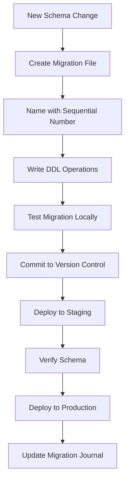
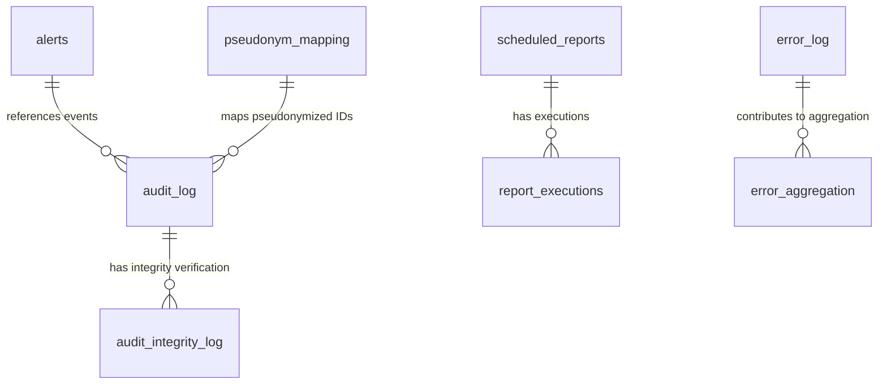
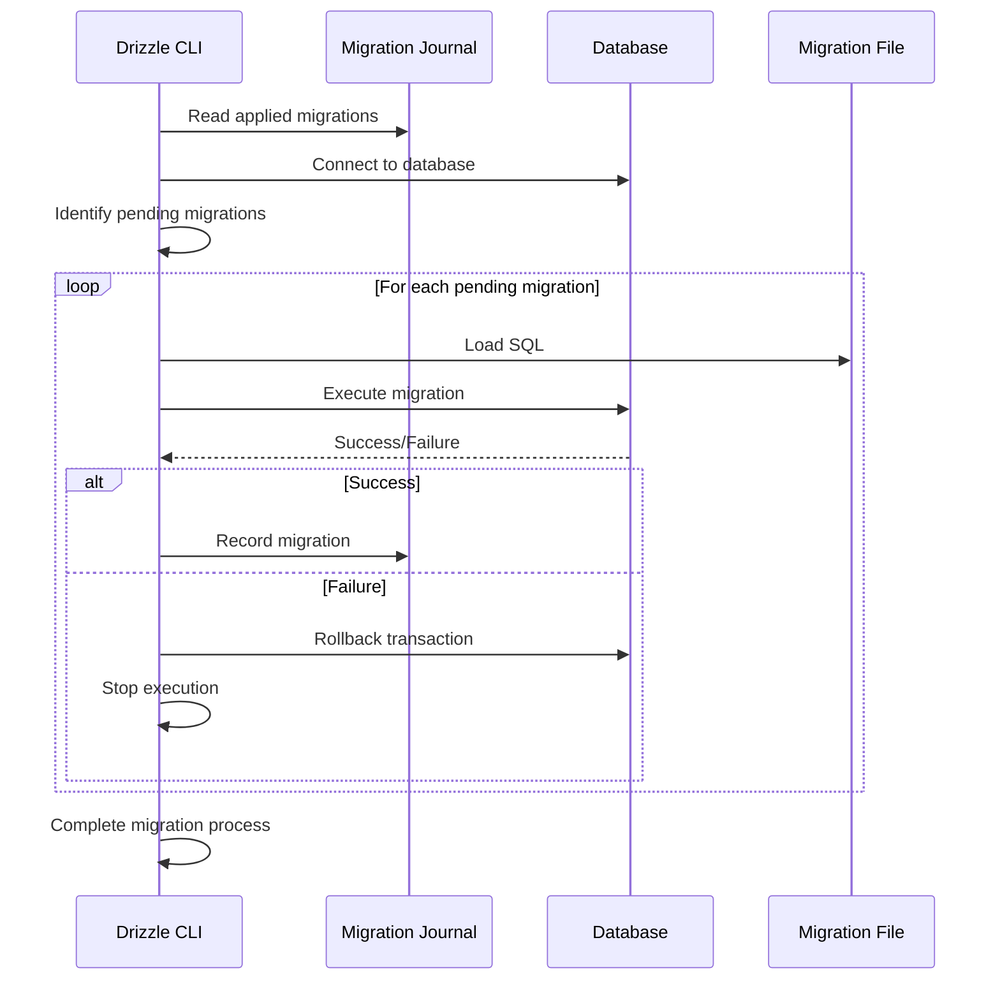
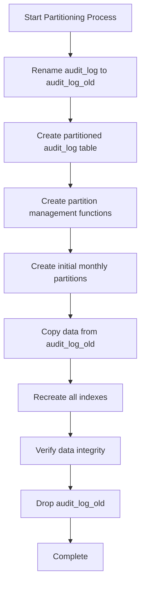
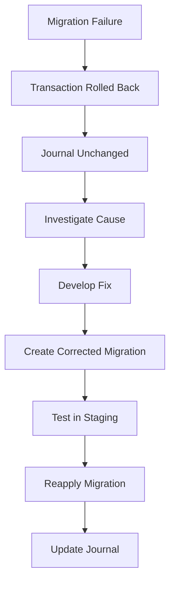
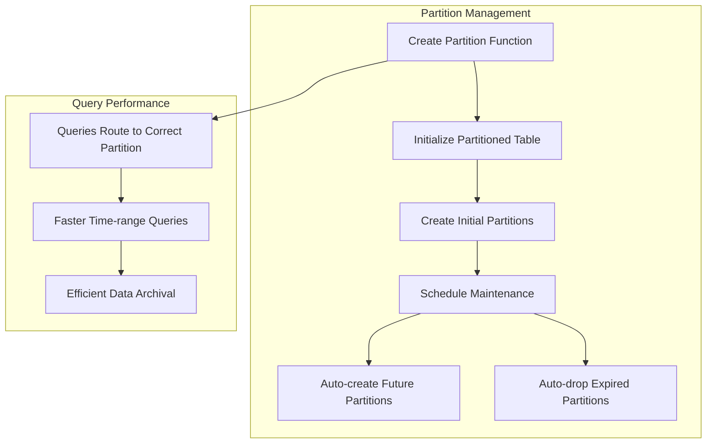
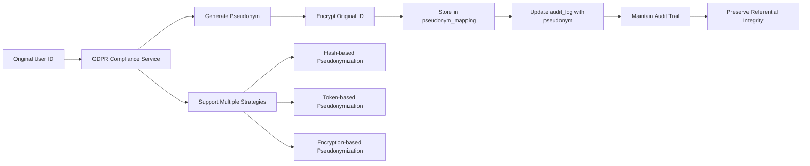

# Migration Management

<cite>
**Referenced Files in This Document**   
- [0000_burly_namor.sql](file://packages/audit-db/drizzle/migrations/0000_burly_namor.sql)
- [0001_aberrant_natasha_romanoff.sql](file://packages/audit-db/drizzle/migrations/0001_aberrant_natasha_romanoff.sql)
- [0002_tearful_blonde_phantom.sql](file://packages/audit-db/drizzle/migrations/0002_tearful_blonde_phantom.sql)
- [0003_easy_prowler.sql](file://packages/audit-db/drizzle/migrations/0003_easy_prowler.sql)
- [0004_mixed_roughhouse.sql](file://packages/audit-db/drizzle/migrations/0004_mixed_roughhouse.sql)
- [0006_silly_tyger_tiger.sql](file://packages/audit-db/drizzle/migrations/0006_silly_tyger_tiger.sql) - *Added pseudonym mapping table for GDPR compliance*
- [convert-to-partitioned.sql](file://packages/audit-db/src/db/migrations/convert-to-partitioned.sql)
- [partitioning.ts](file://packages/audit-db/src/db/partitioning.ts)
- [setup-partitions.ts](file://packages/audit-db/src/db/setup-partitions.ts)
- [schema.ts](file://packages/audit-db/src/db/schema.ts)
- [gdpr-compliance.ts](file://packages/audit/src/gdpr/gdpr-compliance.ts) - *Implements pseudonymization logic*
</cite>

## Update Summary
**Changes Made**   
- Added new section on GDPR pseudonymization migration
- Updated migration workflow section to include GDPR-related changes
- Added new diagram showing pseudonymization data flow
- Updated structure of migration files section to include the new pseudonym_mapping table
- Enhanced best practices section with GDPR compliance considerations
- Added new sources for GDPR-related files and updated migration

## Table of Contents
1. [Introduction](#introduction)
2. [Migration Workflow and Versioning Strategy](#migration-workflow-and-versioning-strategy)
3. [Structure of Migration Files](#structure-of-migration-files)
4. [Migration Execution Process](#migration-execution-process)
5. [Partitioning and Large Table Management](#partitioning-and-large-table-management)
6. [Rollback Procedures and Failure Recovery](#rollback-procedures-and-failure-recovery)
7. [Best Practices for Writing Migrations](#best-practices-for-writing-migrations)
8. [Complex Migration Examples](#complex-migration-examples)
9. [GDPR Pseudonymization Migration](#gdpr-pseudonymization-migration)
10. [Validation and Monitoring](#validation-and-monitoring)

## Introduction
This document provides comprehensive documentation for the database migration system using Drizzle ORM in the audit-db package. It details the migration workflow, versioning strategy, rollback procedures, and execution process. The system supports atomic schema changes, data transformations, and advanced features like table partitioning for large audit datasets. The migration framework ensures schema consistency across environments while enabling safe, reversible changes with minimal downtime.

## Migration Workflow and Versioning Strategy

The database migration system uses Drizzle ORM's migration tooling to manage schema evolution in a controlled and versioned manner. Each migration is represented as a sequentially numbered SQL file in the `drizzle/migrations` directory, ensuring deterministic application order.

Migrations are versioned using a zero-padded numeric prefix (e.g., `0000_burly_namor.sql`) followed by a descriptive name. This naming convention ensures proper sorting and execution order. The system maintains a migration journal in `_journal.json` to track applied migrations and prevent re-execution.

The versioning strategy follows an incremental approach where each migration represents a single, atomic change to the database schema. This enables precise tracking of schema evolution and simplifies rollback procedures when needed.



**Diagram sources**
- [0000_burly_namor.sql](file://packages/audit-db/drizzle/migrations/0000_burly_namor.sql)
- [0001_aberrant_natasha_romanoff.sql](file://packages/audit-db/drizzle/migrations/0001_aberrant_natasha_romanoff.sql)

**Section sources**
- [0000_burly_namor.sql](file://packages/audit-db/drizzle/migrations/0000_burly_namor.sql#L1-L320)
- [0001_aberrant_natasha_romanoff.sql](file://packages/audit-db/drizzle/migrations/0001_aberrant_natasha_romanoff.sql#L1)

## Structure of Migration Files

Migration files contain SQL statements that define schema changes using standard DDL operations. Each file may contain multiple related operations separated by `--> statement-breakpoint` comments.

The initial migration (`0000_burly_namor.sql`) establishes the complete database schema with all core tables:
- `audit_log`: Main audit event storage with partitioning
- `error_log`: Structured error logging
- `alerts`: Alert management system
- `scheduled_reports`: Automated report configurations
- `report_executions`: Report execution history

Subsequent migrations apply incremental changes. For example:
- `0001_aberrant_natasha_romanoff.sql` adds a `report_type` column to `scheduled_reports`
- `0002_tearful_blonde_phantom.sql` adds `integrity_report` to `report_executions` and `export` to `scheduled_reports`
- `0003_easy_prowler.sql` adds acknowledgment fields to `alerts`
- `0004_mixed_roughhouse.sql` drops a foreign key constraint from `audit_integrity_log`
- `0006_silly_tyger_tiger.sql` adds the `pseudonym_mapping` table for GDPR compliance

Each migration file follows a consistent pattern:
1. DDL statements for schema changes
2. Index creation statements
3. Constraint modifications
4. Data transformations (when needed)

The system uses PostgreSQL-specific syntax including `varchar`, `timestamp with time zone`, `jsonb`, and partitioning clauses.



**Diagram sources**
- [schema.ts](file://packages/audit-db/src/db/schema.ts#L20-L662)
- [0000_burly_namor.sql](file://packages/audit-db/drizzle/migrations/0000_burly_namor.sql#L1-L320)

**Section sources**
- [0000_burly_namor.sql](file://packages/audit-db/drizzle/migrations/0000_burly_namor.sql#L1-L320)
- [0001_aberrant_natasha_romanoff.sql](file://packages/audit-db/drizzle/migrations/0001_aberrant_natasha_romanoff.sql#L1)
- [0002_tearful_blonde_phantom.sql](file://packages/audit-db/drizzle/migrations/0002_tearful_blonde_phantom.sql#L1-L2)
- [0003_easy_prowler.sql](file://packages/audit-db/drizzle/migrations/0003_easy_prowler.sql#L1-L5)
- [0004_mixed_roughhouse.sql](file://packages/audit-db/drizzle/migrations/0004_mixed_roughhouse.sql#L1)
- [0006_silly_tyger_tiger.sql](file://packages/audit-db/drizzle/migrations/0006_silly_tyger_tiger.sql#L1-L9)

## Migration Execution Process

The migration execution process is managed by Drizzle ORM's CLI tools, which read the migration files and apply them in sequence. The system maintains a journal of applied migrations to ensure idempotency.

When executing migrations, the process follows these steps:
1. Connect to the target database
2. Read the migration journal to determine the current schema version
3. Identify pending migrations (those not in the journal)
4. Apply migrations in sequential order
5. Update the journal after each successful migration
6. Roll back all changes if any migration fails

The system supports both forward migrations (up) and rollback operations (down), though rollback scripts are not explicitly defined in the current implementation.

For production deployments, migrations should be executed during maintenance windows or using online DDL techniques to minimize downtime. The system supports connection pooling and can handle migrations on live databases with proper planning.



**Diagram sources**
- [0000_burly_namor.sql](file://packages/audit-db/drizzle/migrations/0000_burly_namor.sql)
- [_journal.json](file://packages/audit-db/drizzle/migrations/meta/_journal.json)

**Section sources**
- [0000_burly_namor.sql](file://packages/audit-db/drizzle/migrations/0000_burly_namor.sql#L1-L320)

## Partitioning and Large Table Management

The system implements table partitioning to manage large audit datasets efficiently. The `audit_log` and `error_log` tables are partitioned by timestamp range to optimize query performance and maintenance operations.

The partitioning strategy is implemented through:
1. Initial schema definition with `PARTITION BY RANGE (timestamp)`
2. A dedicated migration script (`convert-to-partitioned.sql`) for converting existing tables
3. TypeScript utilities in `partitioning.ts` for programmatic management

The `convert-to-partitioned.sql` script follows a safe approach for converting existing tables:
1. Rename the original table
2. Create a new partitioned table with the same structure
3. Create initial partitions
4. Copy data from the old table
5. Recreate indexes
6. Drop the old table (after verification)

The `DatabasePartitionManager` class provides programmatic control over partitioning with methods for:
- Creating time-based partitions
- Dropping expired partitions based on retention
- Creating optimized indexes on partitions
- Analyzing partition performance

Monthly partitions are created in advance, and a maintenance scheduler can automatically manage partition lifecycle.



**Diagram sources**
- [convert-to-partitioned.sql](file://packages/audit-db/src/db/migrations/convert-to-partitioned.sql#L1-L66)
- [partitioning.ts](file://packages/audit-db/src/db/partitioning.ts#L1-L497)

**Section sources**
- [convert-to-partitioned.sql](file://packages/audit-db/src/db/migrations/convert-to-partitioned.sql#L1-L66)
- [partitioning.ts](file://packages/audit-db/src/db/partitioning.ts#L1-L497)
- [setup-partitions.ts](file://packages/audit-db/src/db/setup-partitions.ts#L1-L50)

## Rollback Procedures and Failure Recovery

The migration system incorporates several mechanisms for rollback and failure recovery:

1. **Transactional Safety**: Each migration is executed within a transaction, ensuring atomicity. If any statement fails, the entire migration is rolled back.

2. **Journal-Based Tracking**: The migration journal prevents re-application of completed migrations and helps identify the current schema state.

3. **Constraint Management**: Migrations can modify or drop constraints (as seen in `0004_mixed_roughhouse.sql` which drops a foreign key), but should include corresponding rollback logic.

4. **Data Preservation**: The partition conversion script uses a rename-and-copy approach that preserves original data until verification is complete.

For emergency rollbacks, the recommended procedure is:
1. Identify the last successful migration from the journal
2. Create a new migration that reverses the changes of failed migrations
3. Apply the rollback migration
4. Verify data integrity

The system does not currently implement automated rollback scripts, so manual intervention may be required for complex schema reversions.

Critical tables like `audit_log` should be backed up before major migrations, especially those involving structural changes or data transformations.



**Section sources**
- [0004_mixed_roughhouse.sql](file://packages/audit-db/drizzle/migrations/0004_mixed_roughhouse.sql#L1)
- [convert-to-partitioned.sql](file://packages/audit-db/src/db/migrations/convert-to-partitioned.sql#L1-L66)

## Best Practices for Writing Migrations

The following best practices should be followed when writing database migrations:

### Atomic Changes
Each migration should represent a single logical change:
```sql
-- GOOD: Single focused migration
ALTER TABLE scheduled_reports ADD COLUMN report_type varchar(50) NOT NULL;
```

### Reversible Operations
Design migrations to be reversible when possible:
```sql
-- Include both up and down operations
-- Up: ALTER TABLE ...
-- Down: ALTER TABLE ... DROP COLUMN ...
```

### Index Management
Create indexes after data population for large tables:
```sql
-- Create table and populate data first
-- Then add indexes to avoid slowing down inserts
CREATE INDEX CONCURRENTLY IF NOT EXISTS idx_name ON table(column);
```

### Production Safety
Use online DDL operations to minimize downtime:
- Add columns with default values carefully
- Use `CREATE INDEX CONCURRENTLY` for large tables
- Avoid long-running transactions on production

### Testing
Test migrations thoroughly:
1. On empty databases (initial setup)
2. On populated databases (schema evolution)
3. In staging environments that mirror production

### Documentation
Include clear comments in migration files explaining the purpose and impact of changes.

### GDPR Compliance
When implementing GDPR-related migrations:
- Ensure pseudonymization mappings are encrypted
- Maintain referential integrity for audit trails
- Implement proper access controls for reverse mapping
- Document data protection impact assessments

**Section sources**
- [0001_aberrant_natasha_romanoff.sql](file://packages/audit-db/drizzle/migrations/0001_aberrant_natasha_romanoff.sql#L1)
- [0003_easy_prowler.sql](file://packages/audit-db/drizzle/migrations/0003_easy_prowler.sql#L1-L5)
- [0006_silly_tyger_tiger.sql](file://packages/audit-db/drizzle/migrations/0006_silly_tyger_tiger.sql#L1-L9)

## Complex Migration Examples

### Adding Partitions to Large Tables
The system demonstrates a sophisticated approach to partitioning large audit tables:

1. **Preparation Phase**: Create the partition management functions
```sql
CREATE OR REPLACE FUNCTION create_audit_log_partitions()
RETURNS void AS $$
DECLARE
    start_date date;
    end_date date;
    partition_name text;
BEGIN
    FOR i IN 0..6 LOOP
        start_date := date_trunc('month', CURRENT_DATE + (i || ' months')::interval);
        end_date := start_date + interval '1 month';
        partition_name := 'audit_log_' || to_char(start_date, 'YYYY_MM');
        
        EXECUTE format('CREATE TABLE IF NOT EXISTS %I PARTITION OF audit_log FOR VALUES FROM (%L) TO (%L)',
            partition_name, start_date, end_date);
    END LOOP;
END;
$$ LANGUAGE plpgsql;
```

2. **Execution Phase**: Initialize and create partitions
```typescript
async initializePartitionedTable(): Promise<void> {
    await this.db.execute(sql`
        CREATE TABLE IF NOT EXISTS audit_log (
            id serial,
            timestamp timestamp with time zone NOT NULL,
            -- other columns
        ) PARTITION BY RANGE (timestamp);
    `);
    
    await this.createPartitionManagementFunctions();
    await this.db.execute(sql`SELECT create_audit_log_partitions();`);
}
```

3. **Maintenance Phase**: Automated partition lifecycle management
```typescript
class PartitionMaintenanceScheduler {
    async performMaintenance(): Promise<void> {
        if (this.config.autoCreatePartitions) {
            await this.partitionManager.createAuditLogPartitions({
                strategy: 'range',
                interval: 'monthly',
                retentionDays: this.config.retentionDays,
            });
        }
        
        if (this.config.autoDropPartitions) {
            const droppedPartitions = await this.partitionManager.dropExpiredPartitions(
                this.config.retentionDays
            );
        }
    }
}
```

This approach ensures minimal downtime during the partitioning process while maintaining data integrity and query performance.



**Diagram sources**
- [partitioning.ts](file://packages/audit-db/src/db/partitioning.ts#L1-L497)
- [convert-to-partitioned.sql](file://packages/audit-db/src/db/migrations/convert-to-partitioned.sql#L1-L66)

**Section sources**
- [partitioning.ts](file://packages/audit-db/src/db/partitioning.ts#L1-L497)
- [convert-to-partitioned.sql](file://packages/audit-db/src/db/migrations/convert-to-partitioned.sql#L1-L66)
- [setup-partitions.ts](file://packages/audit-db/src/db/setup-partitions.ts#L1-L50)

## GDPR Pseudonymization Migration

The system implements GDPR-compliant pseudonymization through a dedicated migration and supporting infrastructure. The `0006_silly_tyger_tiger.sql` migration introduces the `pseudonym_mapping` table to maintain referential integrity while protecting personal data.

### Migration Details
The `pseudonym_mapping` table structure:
- `id`: Serial primary key
- `timestamp`: Timestamp of mapping creation
- `pseudonym_id`: Text field storing the pseudonymized identifier
- `original_id`: Text field storing the encrypted original identifier

The migration creates three indexes for efficient lookups:
- `pseudonym_mapping_timestamp_idx` on timestamp
- `pseudonym_mapping_pseudonym_id_idx` on pseudonym_id
- `pseudonym_mapping_original_id_idx` on original_id

### Data Flow


**Diagram sources**
- [0006_silly_tyger_tiger.sql](file://packages/audit-db/drizzle/migrations/0006_silly_tyger_tiger.sql#L1-L9)
- [gdpr-compliance.ts](file://packages/audit/src/gdpr/gdpr-compliance.ts#L234-L275)

**Section sources**
- [0006_silly_tyger_tiger.sql](file://packages/audit-db/drizzle/migrations/0006_silly_tyger_tiger.sql#L1-L9)
- [gdpr-compliance.ts](file://packages/audit/src/gdpr/gdpr-compliance.ts#L234-L275)
- [gdpr-utils.test.ts](file://packages/audit/src/__tests__/gdpr-utils.test.ts#L0-L37)

## Validation and Monitoring

The system includes several validation and monitoring mechanisms to ensure migration integrity:

### Schema Validation
The TypeScript schema definitions in `schema.ts` provide type-safe definitions that should match the actual database schema:
```typescript
export const auditLog = pgTable(
    'audit_log',
    {
        id: serial('id'),
        timestamp: timestamp('timestamp', { withTimezone: true, mode: 'string' }).notNull(),
        // ... other columns
    }
)
```

### Index Verification
Critical indexes are defined in both the initial migration and schema file to ensure consistency:
```sql
CREATE INDEX "audit_log_timestamp_idx" ON "audit_log" USING btree ("timestamp");
```

### Partition Health Monitoring
The `DatabasePartitionManager` includes methods to analyze partition performance:
```typescript
async analyzePartitionPerformance(): Promise<{
    totalPartitions: number
    totalSize: number
    totalRecords: number
    averagePartitionSize: number
    recommendations: string[]
}> {
    // Returns analysis and optimization recommendations
}
```

### GDPR Compliance Monitoring
The system monitors pseudonymization operations:
```typescript
async logGDPRActivity(event: AuditLogEvent): Promise<void> {
    await this.audit.log(event, {
        generateHash: true,
        generateSignature: true,
    })
}
```

These monitoring capabilities help ensure that migrations maintain optimal database performance and that partitioning strategies remain effective as data volumes grow.

**Section sources**
- [schema.ts](file://packages/audit-db/src/db/schema.ts#L20-L662)
- [partitioning.ts](file://packages/audit-db/src/db/partitioning.ts#L1-L497)
- [gdpr-compliance.ts](file://packages/audit/src/gdpr/gdpr-compliance.ts#L234-L275)