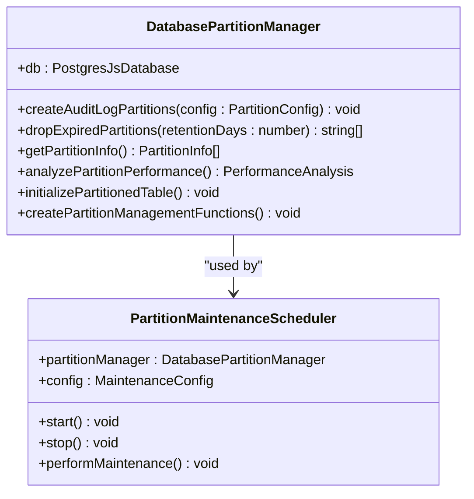
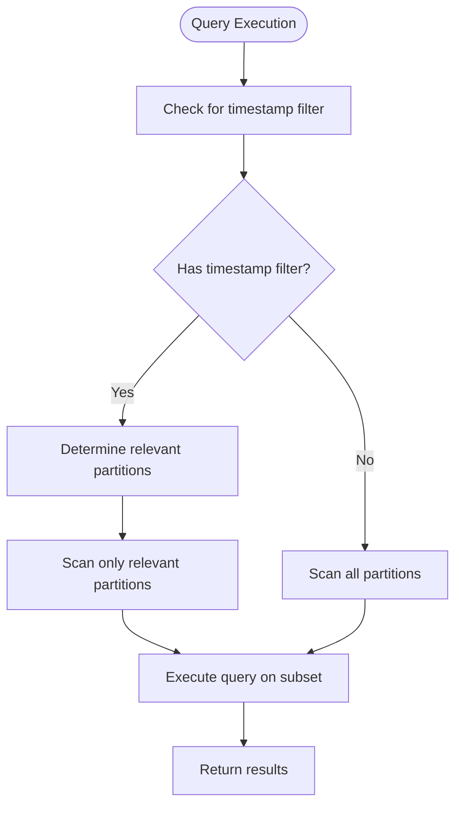
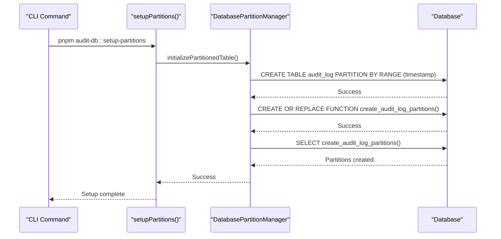
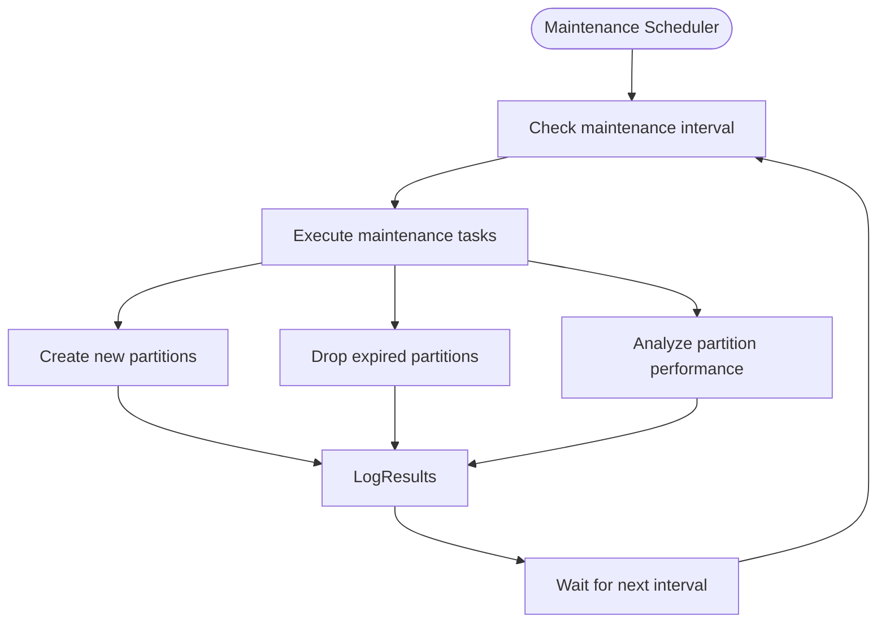

# Partitioning Strategy

<cite>
**Referenced Files in This Document**   
- [PARTITIONING.md](file://packages/audit-db/PARTITIONING.md)
- [partitioning.ts](file://packages/audit-db/src/db/partitioning.ts)
- [setup-partitions.ts](file://packages/audit-db/src/db/setup-partitions.ts)
- [convert-to-partitioned.sql](file://packages/audit-db/src/db/migrations/convert-to-partitioned.sql)
- [schema.ts](file://packages/audit-db/src/db/schema.ts)
</cite>

## Table of Contents
1. [Introduction](#introduction)
2. [Partitioning Implementation](#partitioning-implementation)
3. [Time-Based Horizontal Partitioning](#time-based-horizontal-partitioning)
4. [Tenant-Based Horizontal Partitioning](#tenant-based-horizontal-partitioning)
5. [Partition Creation Workflow](#partition-creation-workflow)
6. [Maintenance Procedures](#maintenance-procedures)
7. [Query Routing and Optimization](#query-routing-and-optimization)
8. [Performance Benefits](#performance-benefits)
9. [Troubleshooting Guide](#troubleshooting-guide)
10. [Monitoring Tips](#monitoring-tips)

## Introduction
The database partitioning strategy is designed to optimize performance, scalability, and maintenance for large audit datasets. This document details the implementation of time-based and tenant-based horizontal partitioning for the `audit_log` table and related large tables. The strategy leverages PostgreSQL's native partitioning capabilities to distribute data across multiple partitions based on timestamp and organizational boundaries, enabling efficient data management and query performance.

**Section sources**
- [PARTITIONING.md](file://packages/audit-db/PARTITIONING.md#L1-L112)

## Partitioning Implementation
The partitioning strategy is implemented through a combination of database schema design, automated management functions, and application-level coordination. The core implementation resides in the `DatabasePartitionManager` class, which provides methods for creating, managing, and optimizing partitions.

The system supports range partitioning by timestamp with monthly intervals, automatically creating partitions for the current month plus six months in advance. Each partition follows a naming convention of `audit_log_YYYY_MM` (e.g., `audit_log_2025_08`) and is defined by a range of timestamps from the first day of the month to the first day of the following month.



**Diagram sources**
- [partitioning.ts](file://packages/audit-db/src/db/partitioning.ts#L36-L495)

**Section sources**
- [partitioning.ts](file://packages/audit-db/src/db/partitioning.ts#L0-L497)

## Time-Based Horizontal Partitioning
Time-based horizontal partitioning is implemented on the `audit_log` table using the `timestamp` column as the partition key. This approach divides the data into monthly partitions, which aligns with common query patterns and retention policies.

The partitioning strategy creates partitions for:
- Current month
- Next six months (pre-created for performance)
- Previous months (based on retention policy)

This implementation ensures that queries with date range filters can leverage partition pruning, where PostgreSQL automatically eliminates irrelevant partitions from the query execution plan. For example, a query filtering for events in August 2025 will only scan the `audit_log_2025_08` partition, significantly reducing I/O operations.



**Diagram sources**
- [partitioning.ts](file://packages/audit-db/src/db/partitioning.ts#L100-L150)
- [schema.ts](file://packages/audit-db/src/db/schema.ts#L60-L100)

**Section sources**
- [partitioning.ts](file://packages/audit-db/src/db/partitioning.ts#L100-L150)
- [schema.ts](file://packages/audit-db/src/db/schema.ts#L60-L100)

## Tenant-Based Horizontal Partitioning
Tenant-based horizontal partitioning is achieved through the `organization_id` column, which enables multi-tenancy support and organizational isolation. While not implemented as a formal partitioning strategy, the system leverages the `organization_id` in composite indexes to optimize queries for specific tenants.

The partitioning strategy complements tenant isolation by ensuring that even within a partition, queries can efficiently filter by organization. This dual-layer approach (time + tenant) provides optimal performance for the most common query patterns in multi-tenant environments.

Key composite indexes supporting tenant-based queries include:
- `audit_log_organization_id_idx`: Single-column index on organization_id
- `audit_log_org_timestamp_idx`: Composite index on organization_id and timestamp
- `audit_log_principal_action_idx`: Composite index on principal_id and action

These indexes enable efficient filtering for tenant-specific audit events within specific time ranges, supporting compliance requirements and operational monitoring.

```mermaid
erDiagram
audit_log ||--o{ audit_log_2025_08 : "partition"
audit_log ||--o{ audit_log_2025_09 : "partition"
audit_log_2025_08 }|--|| organization : "organization_id"
audit_log_2025_09 }|--|| organization : "organization_id"
class audit_log_2025_08 {
id
timestamp
organization_id
action
status
}
class audit_log_2025_09 {
id
timestamp
organization_id
action
status
}
```

**Diagram sources**
- [schema.ts](file://packages/audit-db/src/db/schema.ts#L100-L150)
- [partitioning.ts](file://packages/audit-db/src/db/partitioning.ts#L200-L250)

**Section sources**
- [schema.ts](file://packages/audit-db/src/db/schema.ts#L100-L150)

## Partition Creation Workflow
The partition creation workflow is automated through the `DatabasePartitionManager` class and can be initiated through multiple methods depending on the deployment scenario.

For fresh database setups, the recommended approach uses the setup script:
```bash
pnpm audit-db:setup-partitions
```

This script executes the `setupPartitions` function, which initializes the partitioned table structure and creates the necessary management functions.

For existing databases with data, the migration process involves:
1. Renaming the existing `audit_log` table
2. Creating a new partitioned table with the same structure
3. Creating initial partitions
4. Copying data from the old table to the new partitioned table
5. Recreating indexes
6. Dropping the old table

The SQL migration script `convert-to-partitioned.sql` implements this workflow with transactional safety.



**Diagram sources**
- [setup-partitions.ts](file://packages/audit-db/src/db/setup-partitions.ts#L0-L50)
- [convert-to-partitioned.sql](file://packages/audit-db/src/db/migrations/convert-to-partitioned.sql#L0-L65)

**Section sources**
- [setup-partitions.ts](file://packages/audit-db/src/db/setup-partitions.ts#L0-L50)
- [convert-to-partitioned.sql](file://packages/audit-db/src/db/migrations/convert-to-partitioned.sql#L0-L65)

## Maintenance Procedures
The partitioning system includes automated maintenance procedures to ensure optimal performance and adherence to retention policies. The `PartitionMaintenanceScheduler` class manages these procedures on a configurable interval.

Maintenance tasks include:
- Creating new partitions for upcoming months
- Dropping expired partitions based on retention policy
- Analyzing partition performance and generating optimization recommendations

The scheduler runs at a configurable interval (default: daily) and performs maintenance tasks based on the configuration:

```typescript
const scheduler = new PartitionMaintenanceScheduler(partitionManager, {
  maintenanceInterval: 24 * 60 * 60 * 1000, // Daily
  retentionDays: 2555, // 7 years
  autoCreatePartitions: true,
  autoDropPartitions: true
});
scheduler.start();
```

The retention policy is configurable, with the default set to 2555 days (approximately 7 years). When the maintenance task runs, it identifies partitions with end dates before the cutoff date and drops them, freeing up storage space.



**Diagram sources**
- [partitioning.ts](file://packages/audit-db/src/db/partitioning.ts#L421-L495)

**Section sources**
- [partitioning.ts](file://packages/audit-db/src/db/partitioning.ts#L421-L495)

## Query Routing and Optimization
Query routing and optimization leverage PostgreSQL's query planner and partition pruning capabilities. When a query is executed against the `audit_log` table, the query planner analyzes the WHERE clause conditions and eliminates partitions that cannot contain relevant data.

For time-based queries, the system automatically routes queries to the appropriate partitions based on the timestamp filter. For example:

```sql
-- This query will only scan partitions for 2025
SELECT * FROM audit_log 
WHERE timestamp >= '2025-01-01' 
AND timestamp < '2026-01-01';
```

The system also employs optimized indexing strategies for partitioned tables. Each partition has its own set of indexes, including:
- Primary performance indexes (id, timestamp, principal_id, etc.)
- Compliance query indexes (data_classification, retention_policy, etc.)
- Composite indexes for common query patterns
- JSONB indexes for the details column

Code examples demonstrating partitioned queries:

```typescript
// Using Drizzle ORM with partitioned tables
const events = await db.query.auditLog.findMany({
  where: and(
    eq(auditLog.organizationId, 'org-123'),
    gte(auditLog.timestamp, '2025-08-01'),
    lt(auditLog.timestamp, '2025-09-01')
  ),
  orderBy: [desc(auditLog.timestamp)],
  limit: 100
});
```

```sql
-- Manual query with explicit partition pruning
EXPLAIN SELECT * FROM audit_log 
WHERE organization_id = 'org-123' 
AND timestamp >= '2025-08-01' 
AND timestamp < '2025-09-01';
```

**Section sources**
- [partitioning.ts](file://packages/audit-db/src/db/partitioning.ts#L250-L300)
- [schema.ts](file://packages/audit-db/src/db/schema.ts#L150-L200)

## Performance Benefits
The partitioning strategy delivers significant performance benefits across multiple dimensions:

1. **Query Efficiency**: Queries with timestamp filters experience dramatically improved performance due to partition pruning. Instead of scanning millions of records, queries only scan the relevant monthly partition.

2. **Maintenance Operations**: Bulk operations like data archival and deletion are optimized by dropping entire partitions rather than executing DELETE statements on large tables.

3. **Parallel Processing**: Different partitions can be processed in parallel for operations like backups, vacuuming, and index rebuilding.

4. **Storage Optimization**: Smaller partition sizes enable more efficient index maintenance and reduce memory requirements for query execution.

5. **Scalability**: The strategy enables horizontal scaling of audit data storage, allowing the system to handle increasing data volumes without performance degradation.

Performance metrics from the `analyzePartitionPerformance` method provide insights into the effectiveness of the partitioning strategy, including total partitions, total size, total records, and average partition size. These metrics help identify potential optimization opportunities, such as adjusting partition intervals or cleaning up empty partitions.

**Section sources**
- [partitioning.ts](file://packages/audit-db/src/db/partitioning.ts#L350-L400)

## Troubleshooting Guide
Common partitioning issues and their solutions:

### Issue: "audit_log is not partitioned" error
**Solution**: Run the partition setup script:
```bash
pnpm audit-db:setup-partitions
```

### Issue: Missing partitions for current month
**Solution**: Manually create the partition:
```sql
CREATE TABLE audit_log_2025_08 PARTITION OF audit_log
FOR VALUES FROM ('2025-08-01') TO ('2025-09-01');
```

### Issue: Performance degradation despite partitioning
**Solution**: Verify partition pruning is working:
```sql
EXPLAIN SELECT * FROM audit_log 
WHERE timestamp >= '2025-08-01' 
AND timestamp < '2025-09-01';
```
Ensure the query plan shows only the relevant partition is scanned.

### Issue: Excessive number of partitions
**Solution**: Adjust the partition interval or retention policy in the configuration.

Diagnostic queries:
```sql
-- Check if table is partitioned
SELECT schemaname, tablename, 
CASE WHEN c.relkind = 'p' THEN 'partitioned' ELSE 'regular' END as table_type
FROM pg_tables t
JOIN pg_class c ON c.relname = t.tablename
WHERE t.tablename = 'audit_log';

-- List existing partitions
SELECT * FROM get_audit_partition_stats();
```

**Section sources**
- [PARTITIONING.md](file://packages/audit-db/PARTITIONING.md#L80-L112)
- [partitioning.ts](file://packages/audit-db/src/db/partitioning.ts#L300-L350)

## Monitoring Tips
Effective monitoring of partition health includes:

1. **Regular Performance Analysis**: Use the `analyzePartitionPerformance` method to monitor partition statistics and receive optimization recommendations.

2. **Partition Count Monitoring**: Track the number of partitions to ensure it remains within optimal ranges (typically 12-60 for monthly partitions).

3. **Partition Size Monitoring**: Monitor average partition size to identify potential issues. Partitions significantly larger than 1GB may benefit from smaller intervals.

4. **Empty Partition Detection**: Regularly check for empty partitions that can be cleaned up to reduce overhead.

5. **Retention Policy Compliance**: Verify that expired partitions are being dropped according to the retention policy.

6. **Index Health**: Monitor index usage and performance on partitioned tables to ensure optimal query execution.

Automated monitoring can be implemented using the `PartitionMaintenanceScheduler`, which logs partition statistics during each maintenance cycle, providing visibility into the health and performance of the partitioning system.

**Section sources**
- [partitioning.ts](file://packages/audit-db/src/db/partitioning.ts#L350-L400)
- [PARTITIONING.md](file://packages/audit-db/PARTITIONING.md#L60-L80)