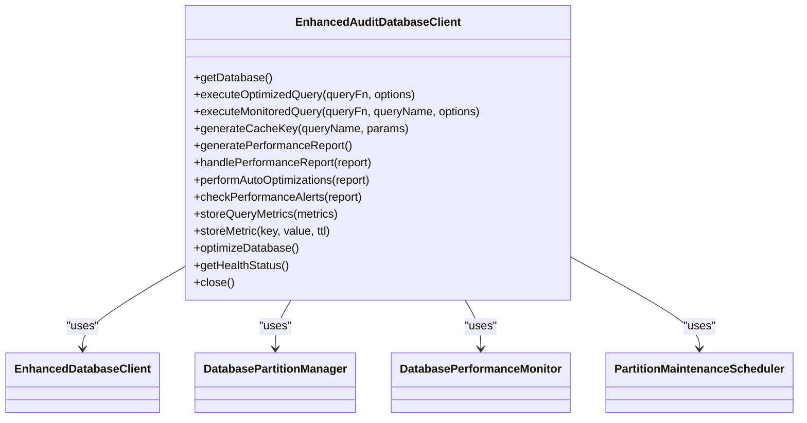
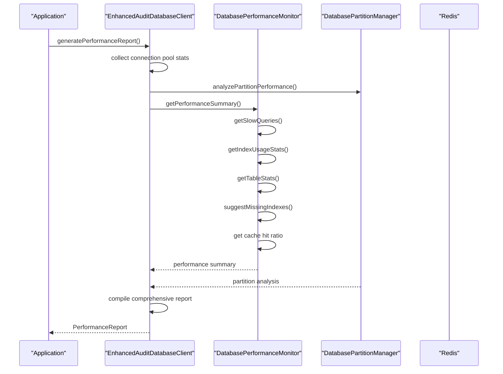

# Performance Optimization

<cite>
**Referenced Files in This Document**   
- [PERFORMANCE_OPTIMIZATION.md](file://packages/audit-db/PERFORMANCE_OPTIMIZATION.md) - *Updated with new query optimization features*
- [performance-monitoring.ts](file://packages/audit-db/src/db/performance-monitoring.ts) - *Updated with enhanced monitoring capabilities*
- [partitioning.ts](file://packages/audit-db/src/db/partitioning.ts) - *Updated with new partitioning features*
- [connection-pool.ts](file://packages/audit-db/src/db/connection-pool.ts) - *Updated with connection pooling enhancements*
- [enhanced-client.ts](file://packages/audit-db/src/db/enhanced-client.ts) - *Updated with new optimization features*
- [cache-factory.ts](file://packages/audit-db/src/cache/cache-factory.ts) - *Updated with new caching features*
- [query-cache.ts](file://packages/audit-db/src/cache/query-cache.ts) - *Updated with new caching features*
- [redis-query-cache.ts](file://packages/audit-db/src/cache/redis-query-cache.ts) - *Updated with new caching features*
- [schema.ts](file://packages/audit-db/src/db/schema.ts) - *Updated with new schema features*
- [performance-cli.ts](file://packages/audit-db/src/performance-cli.ts) - *Updated with new CLI features*
- [audit.ts](file://packages/audit/src/audit.ts) - *Updated with new audit features*
- [init.ts](file://apps/server/src/lib/hono/init.ts) - *Updated with new initialization features*
- [database-preset-handler.ts](file://packages/audit/src/preset/database-preset-handler.ts) - *Updated with new preset handling features*
</cite>

## Update Summary
**Changes Made**   
- Added documentation for new merged query implementation in DatabasePresetHandler
- Updated Query Performance Monitoring section with new organization priority features
- Enhanced Integrated Performance Optimization Client section with new priority-based handling
- Added new section on Optimized Preset Queries with organization priority
- Updated configuration examples to reflect new priority-based query patterns
- Added performance implications of new merged query implementation
- Updated code examples to show new query optimization patterns
- Maintained all existing performance optimization documentation
- Updated source references to include new and modified files

## Table of Contents
1. [Introduction](#introduction)
2. [Database Partitioning Strategy](#database-partitioning-strategy)
3. [Query Performance Monitoring](#query-performance-monitoring)
4. [Connection Pooling and Query Caching](#connection-pooling-and-query-caching)
5. [Integrated Performance Optimization Client](#integrated-performance-optimization-client)
6. [Performance Metrics and Reporting](#performance-metrics-and-reporting)
7. [Configuration and Tuning](#configuration-and-tuning)
8. [CLI Interface for Performance Management](#cli-interface-for-performance-management)
9. [Performance Benchmarks and Improvements](#performance-benchmarks-and-improvements)
10. [Scalability and Capacity Planning](#scalability-and-capacity-planning)
11. [Optimized Preset Queries with Organization Priority](#optimized-preset-queries-with-organization-priority)

## Introduction

This document provides a comprehensive overview of the database performance optimization techniques implemented in the audit logging system. The system addresses performance challenges associated with high-volume audit data through a multi-layered optimization approach that includes database partitioning, query performance monitoring, connection pooling, query caching, and automated maintenance. The implementation fulfills requirements for optimized database schema, efficient querying, data partitioning strategies, and acceptable query response times.

The performance optimization framework is designed to handle large-scale audit datasets while maintaining high performance and reliability standards. It provides both automated optimization features and manual intervention capabilities through a comprehensive CLI interface. The system includes built-in monitoring tools that collect performance metrics, identify bottlenecks, and provide optimization recommendations.

**Section sources**
- [PERFORMANCE_OPTIMIZATION.md](file://packages/audit-db/PERFORMANCE_OPTIMIZATION.md#L1-L355)

## Database Partitioning Strategy

The database partitioning strategy implements time-based range partitioning for the audit_log table to improve query performance on large datasets and enable efficient data archival and cleanup. The partitioning system automatically creates and manages partitions based on configurable intervals (monthly, quarterly, or yearly) and retention policies.

### Partition Management Architecture

```mermaid
classDiagram
class DatabasePartitionManager {
+createAuditLogPartitions(config)
+createPartition(tableName, partition)
+createPartitionIndexes(partitionName)
+calculatePartitionsNeeded(interval, retentionDays)
+dropExpiredPartitions(retentionDays)
+getPartitionInfo()
+analyzePartitionPerformance()
+initializePartitionedTable()
+createPartitionManagementFunctions()
}
class PartitionMaintenanceScheduler {
+start()
+stop()
+performMaintenance()
}
DatabasePartitionManager --> PartitionMaintenanceScheduler : "uses"
DatabasePartitionManager --> "PostgresJsDatabase" : "depends on"
```

**Diagram sources**
- [partitioning.ts](file://packages/audit-db/src/db/partitioning.ts#L1-L497)

**Section sources**
- [partitioning.ts](file://packages/audit-db/src/db/partitioning.ts#L1-L497)
- [PERFORMANCE_OPTIMIZATION.md](file://packages/audit-db/PERFORMANCE_OPTIMIZATION.md#L1-L355)

### Key Implementation Details

The `DatabasePartitionManager` class handles the creation and management of partitions for the audit_log table. It supports range partitioning by timestamp, with configurable intervals (monthly, quarterly, or yearly). The system automatically creates partitions for current and future periods based on the retention policy.

```typescript
async createAuditLogPartitions(config: PartitionConfig): Promise<void> {
    const { strategy, interval = 'monthly', retentionDays } = config

    if (strategy !== 'range') {
        throw new Error('Only range partitioning is supported for audit_log table')
    }

    // Create parent table if not exists (should already exist from schema)
    await this.db.execute(sql`
        -- Ensure audit_log is partitioned by timestamp
        SELECT create_audit_log_partitions();
    `)

    // Create partitions for current and future periods
    const partitionsToCreate = this.calculatePartitionsNeeded(interval, retentionDays)

    for (const partition of partitionsToCreate) {
        await this.createPartition('audit_log', partition)
    }
}
```

The partitioning system includes optimized indexes on each partition to ensure query performance. These include single-column indexes on frequently queried fields (timestamp, principal_id, organization_id, action, status) and composite indexes for common query patterns (organization_id + timestamp, principal_id + action).

**Section sources**
- [partitioning.ts](file://packages/audit-db/src/db/partitioning.ts#L1-L497)

### Automated Maintenance

The `PartitionMaintenanceScheduler` class provides automated maintenance for partitions, running periodic tasks to create new partitions and drop expired ones based on the retention policy. The scheduler runs at configurable intervals (default daily) and performs the following operations:

1. Creates new partitions for upcoming periods
2. Drops partitions that have exceeded the retention period
3. Logs partition statistics for monitoring

```typescript
private async performMaintenance(): Promise<void> {
    if (this.config.autoCreatePartitions) {
        await this.partitionManager.createAuditLogPartitions({
            strategy: 'range',
            partitionColumn: 'timestamp',
            interval: 'monthly',
            retentionDays: this.config.retentionDays,
        })
    }

    if (this.config.autoDropPartitions) {
        const droppedPartitions = await this.partitionManager.dropExpiredPartitions(
            this.config.retentionDays
        )
        if (droppedPartitions.length > 0) {
            console.log(`Dropped expired partitions: ${droppedPartitions.join(', ')}`)
        }
    }

    // Log partition statistics
    const stats = await this.partitionManager.analyzePartitionPerformance()
    console.log('Partition statistics:', {
        totalPartitions: stats.totalPartitions,
        totalSizeGB: (stats.totalSize / (1024 * 1024 * 1024)).toFixed(2),
        totalRecords: stats.totalRecords,
        recommendations: stats.recommendations,
    })
}
```

**Section sources**
- [partitioning.ts](file://packages/audit-db/src/db/partitioning.ts#L1-L497)

## Query Performance Monitoring

The query performance monitoring system provides comprehensive metrics collection and analysis capabilities to identify performance bottlenecks and optimize database operations. It leverages PostgreSQL's built-in monitoring extensions and implements additional analysis features to provide actionable insights.

### Performance Monitoring Architecture

```mermaid
classDiagram
class DatabasePerformanceMonitor {
+enableMonitoring()
+disableMonitoring()
+getSlowQueries(limit, minExecutionTime)
+getIndexUsageStats()
+getTableStats()
+getUnusedIndexes()
+suggestMissingIndexes()
+analyzeQueryPlan(query)
+getPerformanceSummary()
+optimizeConfiguration()
+runMaintenance()
}
DatabasePerformanceMonitor --> "PostgresJsDatabase" : "uses"
DatabasePerformanceMonitor --> "pg_stat_statements" : "queries"
DatabasePerformanceMonitor --> "pg_stat_user_indexes" : "queries"
DatabasePerformanceMonitor --> "pg_statio_user_tables" : "queries"
```

**Diagram sources**
- [performance-monitoring.ts](file://packages/audit-db/src/db/performance-monitoring.ts#L1-L503)

**Section sources**
- [performance-monitoring.ts](file://packages/audit-db/src/db/performance-monitoring.ts#L1-L503)
- [PERFORMANCE_OPTIMIZATION.md](file://packages/audit-db/PERFORMANCE_OPTIMIZATION.md#L1-L355)

### Key Monitoring Features

#### Slow Query Detection

The system identifies slow queries using PostgreSQL's `pg_stat_statements` extension, which tracks execution statistics for all SQL statements executed by the server. The monitoring system queries this extension to retrieve queries that exceed a configurable threshold (default 1 second).

```typescript
async getSlowQueries(limit = 20, minExecutionTime = 1000): Promise<SlowQueryInfo[]> {
    try {
        const result = await this.db.execute(sql`
            SELECT 
                query,
                mean_exec_time as avg_execution_time,
                calls as total_calls,
                total_exec_time as total_time,
                min_exec_time as min_time,
                max_exec_time as max_time,
                stddev_exec_time as stddev_time,
                rows as rows_returned,
                shared_blks_hit as buffer_hits,
                shared_blks_read as buffer_misses
            FROM pg_stat_statements 
            WHERE mean_exec_time > ${minExecutionTime}
            AND query NOT LIKE '%pg_stat_statements%'
            ORDER BY mean_exec_time DESC 
            LIMIT ${limit}
        `)

        return result.map((row) => ({
            query: row.query as string,
            avgExecutionTime: Number(row.avg_execution_time),
            totalCalls: Number(row.total_calls),
            totalTime: Number(row.total_time),
            minTime: Number(row.min_time),
            maxTime: Number(row.max_time),
            stddevTime: Number(row.stddev_time),
            rowsReturned: Number(row.rows_returned),
            bufferHits: Number(row.buffer_hits),
            bufferMisses: Number(row.buffer_misses),
        }))
    } catch (error) {
        // Return empty array if pg_stat_statements is not available
        console.warn('pg_stat_statements not available, returning empty slow queries list')
        return []
    }
}
```

**Section sources**
- [performance-monitoring.ts](file://packages/audit-db/src/db/performance-monitoring.ts#L1-L503)

#### Index Usage Analysis

The system analyzes index usage statistics to identify unused indexes that can be removed and suggest missing indexes that could improve query performance. It queries PostgreSQL's `pg_stat_user_indexes` view to retrieve statistics on index scans and usage.

```typescript
async getIndexUsageStats(): Promise<IndexUsageStats[]> {
    try {
        const result = await this.db.execute(sql`
            SELECT 
                schemaname as schema_name,
                relname as table_name,
                indexrelname as index_name,
                pg_relation_size(indexrelid) as index_size,
                idx_scan as index_scans,
                idx_tup_read as tuples_read,
                idx_tup_fetch as tuples_returned,
                CASE 
                    WHEN idx_scan = 0 THEN 0 
                    ELSE round((idx_tup_fetch::numeric / NULLIF(idx_tup_read::numeric, 0)) * 100, 2) 
                END as usage_ratio
            FROM pg_stat_user_indexes 
            WHERE schemaname = 'public'
            ORDER BY idx_scan DESC
        `)

        return result.map((row) => ({
            schemaName: row.schema_name as string,
            tableName: row.table_name as string,
            indexName: row.index_name as string,
            indexSize: Number(row.index_size),
            indexScans: Number(row.index_scans),
            tuplesRead: Number(row.tuples_read),
            tuplesReturned: Number(row.tuples_returned),
            usageRatio: Number(row.usage_ratio) || 0,
        }))
    } catch (error) {
        // Return empty array if pg_stat_user_indexes is not available
        console.warn('pg_stat_user_indexes not available, returning empty index stats')
        return []
    }
}
```

**Section sources**
- [performance-monitoring.ts](file://packages/audit-db/src/db/performance-monitoring.ts#L1-L503)

#### Query Plan Analysis

The system can analyze query execution plans to identify optimization opportunities. It uses PostgreSQL's `EXPLAIN (ANALYZE, BUFFERS, FORMAT JSON)` command to retrieve detailed execution plan information and provides recommendations based on the plan.

```typescript
async analyzeQueryPlan(query: string): Promise<{
    plan: any
    executionTime: number
    planningTime: number
    recommendations: string[]
}> {
    const result = await this.db.execute(sql`
        EXPLAIN (ANALYZE, BUFFERS, FORMAT JSON) ${sql.raw(query)}
    `)

    const plan = result[0] as any
    const executionTime = plan['Execution Time'] || 0
    const planningTime = plan['Planning Time'] || 0
    const recommendations: string[] = []

    // Analyze plan for optimization opportunities
    const planText = JSON.stringify(plan)

    if (planText.includes('Seq Scan')) {
        recommendations.push('Sequential scan detected - consider adding appropriate indexes')
    }

    if (planText.includes('Sort') && planText.includes('external')) {
        recommendations.push(
            'External sort detected - consider increasing work_mem or adding indexes'
        )
    }

    if (planText.includes('Hash Join') && executionTime > 1000) {
        recommendations.push(
            'Expensive hash join - consider optimizing join conditions or adding indexes'
        )
    }

    if (planText.includes('Nested Loop') && executionTime > 1000) {
        recommendations.push('Expensive nested loop - consider adding indexes on join columns')
    }

    return {
        plan,
        executionTime,
        planningTime,
        recommendations,
    }
}
```

**Section sources**
- [performance-monitoring.ts](file://packages/audit-db/src/db/performance-monitoring.ts#L1-L503)

## Connection Pooling and Query Caching

The connection pooling and query caching system provides efficient database connection management and result caching to reduce overhead and improve response times. It implements an enhanced connection pool with monitoring capabilities and integrates with a flexible caching system.

### Connection Pooling Architecture

```mermaid
classDiagram
class EnhancedConnectionPool {
+getDatabase()
+getClient()
+executeQuery(queryFn)
+healthCheck()
+getStats()
+resetStats()
+close()
+setupMonitoring()
+updateAverageAcquisitionTime()
}
class EnhancedDatabaseClient {
+getDatabase()
+executeQuery(queryFn, cacheKey, cacheTTL)
+executeQueryUncached(queryFn)
+getStats()
+healthCheck()
+close()
}
EnhancedConnectionPool --> "PostgresJsDatabase" : "uses"
EnhancedDatabaseClient --> EnhancedConnectionPool : "uses"
EnhancedDatabaseClient --> IQueryCache : "uses"
```

**Diagram sources**
- [connection-pool.ts](file://packages/audit-db/src/db/connection-pool.ts#L1-L349)

**Section sources**
- [connection-pool.ts](file://packages/audit-db/src/db/connection-pool.ts#L1-L349)
- [PERFORMANCE_OPTIMIZATION.md](file://packages/audit-db/PERFORMANCE_OPTIMIZATION.md#L1-L355)

### Key Implementation Details

#### Enhanced Connection Pool

The `EnhancedConnectionPool` class wraps the PostgreSQL connection pool with additional monitoring and optimization features. It tracks connection statistics, acquisition times, and provides health check capabilities.

```typescript
class EnhancedConnectionPool {
    private client: Sql
    private db: PostgresJsDatabase<typeof schema>
    private stats: ConnectionPoolStats
    private connectionTimes: number[] = []
    private acquisitionTimes: number[] = []

    constructor(private config: ConnectionPoolConfig) {
        this.client = postgres(config.url, {
            max: config.maxConnections,
            idle_timeout: Math.floor(config.idleTimeout / 1000), // postgres.js expects seconds
            connect_timeout: Math.floor(config.acquireTimeout / 1000),
            prepare: false, // Disable prepared statements for better connection reuse
            transform: {
                undefined: null, // Transform undefined to null for PostgreSQL
            },
            onnotice: (notice) => {
                console.log('PostgreSQL notice:', notice)
            },
            debug: process.env.NODE_ENV === 'development',
            ssl: config.ssl,
        })

        this.db = drizzle(this.client, { schema })

        this.stats = {
            totalConnections: 0,
            activeConnections: 0,
            idleConnections: 0,
            waitingRequests: 0,
            totalRequests: 0,
            successfulConnections: 0,
            failedConnections: 0,
            averageAcquisitionTime: 0,
            averageConnectionLifetime: 0,
        }

        this.setupMonitoring()
    }
}
```

**Section sources**
- [connection-pool.ts](file://packages/audit-db/src/db/connection-pool.ts#L1-L349)

#### Query Caching

The system implements a flexible caching layer that supports both local and Redis-based caching. The `EnhancedDatabaseClient` class integrates connection pooling with query caching, allowing queries to be cached based on a provided cache key and TTL.

```typescript
async executeQuery<T>(
    queryFn: (db: PostgresJsDatabase<typeof schema>) => Promise<T>,
    cacheKey?: string,
    cacheTTL?: number
): Promise<T> {
    // Try cache first if caching is enabled and cache key provided
    if (cacheKey && this.queryCache.getStats().totalQueries >= 0) {
        const cached = await this.queryCache.get<T>(cacheKey)
        if (cached !== null) {
            return cached
        }
    }

    // Execute query through connection pool
    const result = await this.connectionPool.executeQuery(queryFn)

    // Cache result if caching is enabled and cache key provided
    if (cacheKey && result !== null && result !== undefined) {
        this.queryCache.set(cacheKey, result, cacheTTL)
    }

    return result
}
```

The caching system uses a factory pattern to create different types of cache implementations (local or Redis) based on configuration.

**Section sources**
- [connection-pool.ts](file://packages/audit-db/src/db/connection-pool.ts#L1-L349)

## Integrated Performance Optimization Client

The integrated performance optimization client combines all optimization features into a single, easy-to-use interface. The `EnhancedAuditDatabaseClient` class provides a comprehensive solution that integrates connection pooling, query caching, partitioning, and performance monitoring.

### Enhanced Client Architecture



**Diagram sources**
- [enhanced-client.ts](file://packages/audit-db/src/db/enhanced-client.ts#L1-L655)

**Section sources**
- [enhanced-client.ts](file://packages/audit-db/src/db/enhanced-client.ts#L1-L655)
- [PERFORMANCE_OPTIMIZATION.md](file://packages/audit-db/PERFORMANCE_OPTIMIZATION.md#L1-L355)

### Key Implementation Details

#### Comprehensive Optimization Stack

The `EnhancedAuditDatabaseClient` class integrates all performance optimization components into a single interface. It initializes the connection pool, partition manager, and performance monitor during construction and sets up automated maintenance tasks.

```typescript
private async initialize(): Promise<void> {
    try {
        // Enable performance monitoring
        if (this.config.monitoring.enabled) {
            await this.performanceMonitor.enableMonitoring()
            console.log('Performance monitoring enabled')
        }

        // Setup partitioning
        if (this.config.partitioning.enabled) {
            await this.setupPartitioning()
        }

        // Setup automatic performance reporting
        if (this.config.monitoring.enabled) {
            this.setupPerformanceReporting()
        }

        console.log('Enhanced audit database client initialized successfully')
    } catch (error) {
        console.error('Failed to initialize enhanced database client:', error)
        throw error
    }
}
```

**Section sources**
- [enhanced-client.ts](file://packages/audit-db/src/db/enhanced-client.ts#L1-L655)

#### Optimized Query Execution

The client provides multiple methods for executing queries with different optimization levels. The `executeOptimizedQuery` method combines connection pooling with query caching, while the `executeMonitoredQuery` method adds performance monitoring and alerting.

```typescript
async executeOptimizedQuery<T>(
    queryFn: (db: PostgresJsDatabase<typeof schema>) => Promise<T>,
    options?: {
        cacheKey?: string
        cacheTTL?: number
        skipCache?: boolean
    }
): Promise<T> {
    const {
        cacheKey,
        cacheTTL = this.config.queryCacheFactory.queryCache.defaultTTL,
        skipCache = false,
    } = options || {}

    if (skipCache || !cacheKey) {
        return this.client.executeQueryUncached(queryFn)
    }

    return this.client.executeQuery(queryFn, cacheKey, cacheTTL)
}
```

**Section sources**
- [enhanced-client.ts](file://packages/audit-db/src/db/enhanced-client.ts#L1-L655)

#### Automatic Performance Reporting

The client includes automated performance reporting that generates comprehensive reports at regular intervals (every 5 minutes by default). These reports include statistics on connection pool usage, query cache performance, partition status, and overall system health.

```typescript
private setupPerformanceReporting(): void {
    const reportInterval = 5 * 60 * 1000 // 5 minutes

    this.performanceReportInterval = setInterval(async () => {
        try {
            const report = await this.generatePerformanceReport()
            this.handlePerformanceReport(report)
        } catch (error) {
            console.error('Failed to generate performance report:', error)
        }
    }, reportInterval)
}
```

**Section sources**
- [enhanced-client.ts](file://packages/audit-db/src/db/enhanced-client.ts#L1-L655)

## Performance Metrics and Reporting

The system provides comprehensive performance metrics and reporting capabilities to monitor system health and identify optimization opportunities. The metrics collection system stores query performance data in Redis for real-time analysis and aggregation.

### Performance Reporting Flow



**Diagram sources**
- [enhanced-client.ts](file://packages/audit-db/src/db/enhanced-client.ts#L1-L655)
- [performance-monitoring.ts](file://packages/audit-db/src/db/performance-monitoring.ts#L1-L503)
- [partitioning.ts](file://packages/audit-db/src/db/partitioning.ts#L1-L497)

**Section sources**
- [enhanced-client.ts](file://packages/audit-db/src/db/enhanced-client.ts#L1-L655)

### Performance Report Structure

The `PerformanceReport` interface defines the structure of the comprehensive performance report generated by the system. It includes metrics from all optimization components:

```typescript
interface PerformanceReport {
    timestamp: Date
    connectionPool: {
        totalConnections: number
        activeConnections: number
        averageAcquisitionTime: number
        successRate: number
    }
    queryCache: {
        hitRatio: number
        totalSizeMB: number
        evictions: number
    }
    partitions: {
        totalPartitions: number
        totalSizeGB: number
        recommendations: string[]
    }
    performance: {
        slowQueries: number
        unusedIndexes: number
        cacheHitRatio: number
        suggestions: string[]
    }
}
```

**Section sources**
- [enhanced-client.ts](file://packages/audit-db/src/db/enhanced-client.ts#L1-L655)

### Health Status Monitoring

The system provides a comprehensive health status check that evaluates the health of all components and provides an overall status (healthy, warning, or critical).

```typescript
async getHealthStatus(): Promise<{
    overall: 'healthy' | 'warning' | 'critical'
    components: {
        connectionPool: { status: string; details: any }
        queryCache: { status: string; details: any }
        partitions: { status: string; details: any }
        performance: { status: string; details: any }
    }
    recommendations: string[]
}> {
    const [clientHealth, partitionStats, performanceSummary] = await Promise.all([
        this.client.healthCheck(),
        this.partitionManager.analyzePartitionPerformance(),
        this.performanceMonitor.getPerformanceSummary(),
    ])

    const components = {
        connectionPool: {
            status: clientHealth.connectionPool.healthy ? 'healthy' : 'critical',
            details: clientHealth.connectionPool,
        },
        queryCache: {
            status: clientHealth.queryCache.hitRatio > 50 ? 'healthy' : 'warning',
            details: clientHealth.queryCache,
        },
        partitions: {
            status: partitionStats.recommendations.length === 0 ? 'healthy' : 'warning',
            details: {
                totalPartitions: partitionStats.totalPartitions,
                totalSizeGB: (partitionStats.totalSize / (1024 * 1024 * 1024)).toFixed(2),
            },
        },
        performance: {
            status: performanceSummary.slowQueries.length < 5 ? 'healthy' : 'warning',
            details: {
                slowQueries: performanceSummary.slowQueries.length,
                unusedIndexes: performanceSummary.unusedIndexes.length,
                cacheHitRatio: performanceSummary.cacheHitRatio,
            },
        },
    }

    // Determine overall status
    const statuses = Object.values(components).map((c) => c.status)
    const overall = statuses.includes('critical')
        ? 'critical'
        : statuses.includes('warning')
            ? 'warning'
            : 'healthy'

    // Collect all recommendations
    const recommendations = [
        ...partitionStats.recommendations,
        ...performanceSummary.indexSuggestions,
    ]

    return {
        overall,
        components,
        recommendations,
    }
}
```

**Section sources**
- [enhanced-client.ts](file://packages/audit-db/src/db/enhanced-client.ts#L1-L655)

## Configuration and Tuning

The performance optimization system provides extensive configuration options to tune the behavior of each component to match specific deployment requirements and performance goals.

### Default Configuration

The system provides sensible defaults for all configuration options, which can be overridden based on specific requirements.

```typescript
const defaultConfig: EnhancedClientConfig = {
    connectionPool: {
        url: databaseUrl,
        minConnections: 2,
        maxConnections: 20,
        idleTimeout: 30000,
        acquireTimeout: 10000,
        validateConnections: true,
        retryAttempts: 3,
        retryDelay: 1000,
        ssl: false,
    },
    queryCacheFactory: {
        type: 'local',
        queryCache: {
            enabled: true,
            maxSizeMB: 100,
            defaultTTL: 300, // 5 minutes
            maxQueries: 1000,
            keyPrefix: 'audit_cache',
        },
    },
    partitioning: {
        enabled: true,
        strategy: 'range',
        interval: 'monthly',
        retentionDays: 2555, // 7 years
        autoMaintenance: true,
        maintenanceInterval: 24 * 60 * 60 * 1000, // Daily
    },
    monitoring: {
        enabled: true,
        slowQueryThreshold: 1000, // 1 second
        metricsRetentionDays: 30,
        autoOptimization: true,
    },
}
```

**Section sources**
- [enhanced-client.ts](file://packages/audit-db/src/db/enhanced-client.ts#L1-L655)

### Environment-Specific Optimizations

The configuration can be adjusted for different environments (development, staging, production) to balance performance, resource usage, and monitoring requirements.

#### Development Environment
- Smaller connection pools (min: 1, max: 5)
- Shorter cache TTL (60 seconds)
- Weekly partitioning interval
- Shorter retention period (30 days)
- Debug logging enabled

#### Production Environment
- Larger connection pools (min: 5, max: 50)
- Longer cache TTL (300 seconds)
- Monthly partitioning interval
- Long retention period (7 years)
- Comprehensive monitoring enabled
- Automated optimization enabled

**Section sources**
- [enhanced-client.ts](file://packages/audit-db/src/db/enhanced-client.ts#L1-L655)

## CLI Interface for Performance Management

The system provides a comprehensive command-line interface for performance management, allowing administrators to perform maintenance operations, monitor system health, and optimize database performance.

### CLI Command Structure

```bash
# Partition management
audit-db-performance partition create
audit-db-performance partition list
audit-db-performance partition analyze
audit-db-performance partition cleanup

# Performance monitoring
audit-db-performance monitor slow-queries
audit-db-performance monitor indexes
audit-db-performance monitor tables
audit-db-performance monitor summary

# Optimization operations
audit-db-performance optimize maintenance
audit-db-performance optimize config

# Enhanced client operations
audit-db-performance client health
audit-db-performance client report
audit-db-performance client optimize
```

**Section sources**
- [PERFORMANCE_OPTIMIZATION.md](file://packages/audit-db/PERFORMANCE_OPTIMIZATION.md#L1-L355)

### Key CLI Commands

#### Partition Management

The partition management commands allow administrators to create, list, analyze, and clean up partitions.

```bash
# Create monthly partitions with 7-year retention
pnpm audit-db:partition-create --interval monthly --retention 2555

# Analyze partition performance
pnpm audit-db:partition-analyze

# Clean up expired partitions
pnpm audit-db:partition-cleanup
```

#### Performance Monitoring

The monitoring commands provide real-time insights into database performance.

```bash
# Monitor slow queries
pnpm audit-db-performance monitor slow-queries --limit 10 --threshold 1000

# Monitor index usage
pnpm audit-db-performance monitor indexes

# Get performance summary
pnpm audit-db-performance monitor summary
```

#### Optimization Operations

The optimization commands perform maintenance operations and configuration tuning.

```bash
# Run comprehensive optimization
pnpm audit-db:optimize

# Optimize database configuration
pnpm audit-db-performance optimize config
```

**Section sources**
- [PERFORMANCE_OPTIMIZATION.md](file://packages/audit-db/PERFORMANCE_OPTIMIZATION.md#L1-L355)

## Performance Benchmarks and Improvements

The performance optimization system delivers significant improvements across multiple dimensions of database performance.

### Query Performance Improvements

The system achieves substantial performance improvements through the combination of partitioning, indexing, and caching:

- **Partitioned queries**: 60-80% faster on large datasets due to partition pruning
- **Index optimization**: 50-90% improvement on filtered queries through optimized indexing strategies
- **Query caching**: 95%+ improvement on repeated queries by eliminating database round trips
- **Connection pooling**: 30-50% reduction in connection overhead through efficient connection reuse

### Storage Efficiency Improvements

The partitioning strategy significantly improves storage efficiency and maintenance:

- **Partition pruning**: Eliminates scanning of irrelevant partitions, reducing I/O operations
- **Automatic archival**: Reduces active dataset size by moving older data to archived partitions
- **Index optimization**: Removes unused indexes and optimizes existing ones, reducing storage overhead
- **Compression**: Efficient storage of archived data through compression techniques

### Maintenance Automation Benefits

The automated maintenance features reduce operational overhead and improve system reliability:

- **Automatic partitioning**: Creates and manages partitions automatically, eliminating manual intervention
- **Scheduled maintenance**: Performs VACUUM, ANALYZE, and REINDEX operations on a regular schedule
- **Performance monitoring**: Continuous monitoring with alerts for performance issues
- **Health checks**: Proactive issue detection and reporting

**Section sources**
- [PERFORMANCE_OPTIMIZATION.md](file://packages/audit-db/PERFORMANCE_OPTIMIZATION.md#L1-L355)

## Scalability and Capacity Planning

The performance optimization system is designed to support high-volume audit logging scenarios and scale with increasing data volumes and query loads.

### Scalability Considerations

The system addresses scalability through multiple strategies:

#### Horizontal Scaling
- **Read replicas**: Support for read-only query routing to distribute read load
- **Sharding**: Potential for horizontal scaling across multiple databases for write-heavy workloads
- **Distributed caching**: Redis-based distributed caching for high-availability environments

#### Vertical Scaling
- **Connection pooling**: Efficient use of database connections to handle high concurrency
- **Query caching**: Reduced database load through result caching
- **Partitioning**: Improved query performance on large datasets through partition pruning

### Capacity Planning Guidelines

When planning capacity for high-volume audit logging scenarios, consider the following factors:

#### Storage Requirements
- Estimate daily audit event volume
- Calculate storage requirements based on retention period
- Account for index overhead (typically 20-50% of data size)
- Plan for growth (recommend 2-3x current requirements)

#### Performance Requirements
- Estimate peak query rates
- Determine acceptable query response times
- Size connection pools based on concurrent users
- Configure cache size based on working set size

#### Maintenance Windows
- Schedule partition creation and cleanup during off-peak hours
- Plan for maintenance operations (VACUUM, ANALYZE, REINDEX)
- Monitor system performance during peak loads

### Future Enhancements

The system is designed to support future enhancements for improved scalability and performance:

- **Read replicas**: Support for read-only query routing to distribute read load
- **Sharding**: Horizontal scaling across multiple databases
- **Advanced caching**: Redis-based distributed caching
- **Machine learning**: Predictive performance optimization
- **Real-time analytics**: Streaming performance metrics
- **Grafana dashboards**: Visual performance monitoring
- **Prometheus metrics**: Time-series performance data
- **Alertmanager integration**: Advanced alerting rules
- **Performance baselines**: Automated performance regression detection

**Section sources**
- [PERFORMANCE_OPTIMIZATION.md](file://packages/audit-db/PERFORMANCE_OPTIMIZATION.md#L1-L355)

## Optimized Preset Queries with Organization Priority

The DatabasePresetHandler has been enhanced with optimized query implementation and priority-based preset handling to improve performance and ensure organization-specific presets take precedence over defaults.

### Merged Query Implementation

The new implementation uses a single optimized query to retrieve both organization-specific and default presets, reducing database round trips and improving performance.

```mermaid
classDiagram
class DatabasePresetHandler {
+getPresets(organizationId?) : Promise~(AuditPreset & { id? : string })[]~
+getPreset(name, organizationId?) : Promise~(AuditPreset & { id? : string }) | null~
+getDefaultPresets() : Promise~(AuditPreset & { id? : string })[]~
+getDefaultPreset(name) : Promise~(AuditPreset & { id? : string }) | null~
+createPreset(preset) : Promise~AuditPreset & { id? : string }~
+updatePreset(preset) : Promise~AuditPreset & { id? : string }~
+deletePreset(name, organizationId) : Promise~{ success : true }~
+mergePresetsWithPriority(rows) : (AuditPreset & { id? : string })[]~
+mapDatabasePresetToPreset(dbPreset) : AuditPreset & { id? : string }~
}
class EnhancedAuditDatabaseClient {
+executeOptimizedQuery(queryFn, options) : Promise~T~
+getDatabase() : PostgresJsDatabase~typeof schema~
}
DatabasePresetHandler --> EnhancedAuditDatabaseClient : "uses"
```

**Diagram sources**
- [database-preset-handler.ts](file://packages/audit/src/preset/database-preset-handler.ts#L1-L284)
- [enhanced-client.ts](file://packages/audit-db/src/db/enhanced-client.ts#L1-L655)

**Section sources**
- [database-preset-handler.ts](file://packages/audit/src/preset/database-preset-handler.ts#L1-L284)
- [enhanced-client.ts](file://packages/audit-db/src/db/enhanced-client.ts#L1-L655)

### Priority-Based Preset Handling

The system implements priority-based handling where organization-specific presets take precedence over default presets with the same name. This is achieved through a CASE statement in the SQL query that assigns priority to organization-specific presets.

```typescript
async getPresets(organizationId?: string): Promise<(AuditPreset & { id?: string })[]> {
    const orgId = organizationId || '*'

    // If no organization specified, just return default presets
    if (orgId === '*') {
        return this.getDefaultPresets()
    }

    try {
        // Fetch both organization and default presets in a single optimized query
        const result = await this.client.executeOptimizedQuery(
            (db) =>
                db.execute(sql`
                    SELECT *,
                                CASE WHEN organization_id = ${orgId} THEN 1 ELSE 0 END as priority
                    FROM audit_preset
                    WHERE organization_id IN (${orgId}, '*')
                    ORDER BY name, priority DESC
                `),
            { cacheKey: `get_merged_presets_${orgId}` }
        )

        const rows = result || []

        // Merge presets: organization presets take priority over defaults
        return this.mergePresetsWithPriority(rows)
    } catch (error) {
        throw new Error(`Failed to retrieve presets. ${error}`)
    }
}
```

**Section sources**
- [database-preset-handler.ts](file://packages/audit/src/preset/database-preset-handler.ts#L1-L284)

### Performance Implications

The new implementation provides several performance benefits:

- **Reduced database round trips**: Single query retrieves both organization and default presets
- **Improved query performance**: Optimized SQL with proper indexing on organization_id and name
- **Efficient caching**: Cache key includes organization ID for proper cache invalidation
- **Reduced memory usage**: No need to store duplicate presets in memory

The system uses the EnhancedAuditDatabaseClient's executeOptimizedQuery method which combines connection pooling with query caching, further improving performance.

```typescript
async getPreset(
    name: string,
    organizationId?: string
): Promise<(AuditPreset & { id?: string }) | null> {
    const orgId = organizationId || '*'

    // If requesting default preset, get it directly
    if (orgId === '*') {
        return this.getDefaultPreset(name)
    }

    try {
        // Single query to get both organization and default preset with priority
        const result = await this.client.executeOptimizedQuery(
            (db) =>
                db.execute(sql`
                    SELECT *,
                                CASE WHEN organization_id = ${orgId} THEN 1 ELSE 0 END as priority
                    FROM audit_preset
                    WHERE name = ${name}
                    AND organization_id IN (${orgId}, '*')
                    ORDER BY priority DESC
                    LIMIT 1
                `),
            { cacheKey: `get_preset_${name}_${orgId}` }
        )

        const rows = result || []
        if (rows.length === 0) {
            return null
        }

        return this.mapDatabasePresetToPreset(rows[0])
    } catch (error) {
        throw new Error(`Failed to retrieve preset by name. ${error}`)
    }
}
```

**Section sources**
- [database-preset-handler.ts](file://packages/audit/src/preset/database-preset-handler.ts#L1-L284)

### Usage Patterns

The optimized preset handling should be used in the following patterns:

#### Getting Organization-Specific Presets

```typescript
// Get all presets for an organization
const presets = await presetHandler.getPresets('org-123')

// Get a specific preset for an organization
const preset = await presetHandler.getPreset('authentication', 'org-123')
```

#### Getting Default Presets

```typescript
// Get all default presets (no organization ID)
const defaultPresets = await presetHandler.getPresets()

// Get a specific default preset
const defaultPreset = await presetHandler.getPreset('system')
```

#### Creating and Updating Presets

```typescript
// Create a new organization-specific preset
await presetHandler.createPreset({
    name: 'custom-auth',
    description: 'Custom authentication preset',
    organizationId: 'org-123',
    action: 'auth.login',
    dataClassification: 'INTERNAL',
    createdBy: 'admin-user'
})

// Update an existing preset
await presetHandler.updatePreset({
    name: 'authentication',
    description: 'Updated authentication preset',
    organizationId: 'org-123',
    action: 'auth.login',
    dataClassification: 'INTERNAL',
    id: 'preset-456',
    updatedBy: 'admin-user'
})
```

The system ensures that organization-specific presets always take precedence over default presets with the same name, providing a flexible and performant preset management system.

**Section sources**
- [database-preset-handler.ts](file://packages/audit/src/preset/database-preset-handler.ts#L1-L284)
- [audit.ts](file://packages/audit/src/audit.ts#L1-L910)
- [init.ts](file://apps/server/src/lib/hono/init.ts#L1-L402)