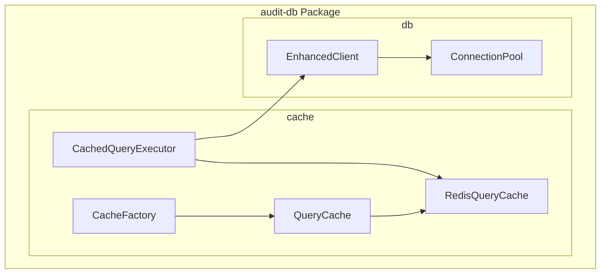
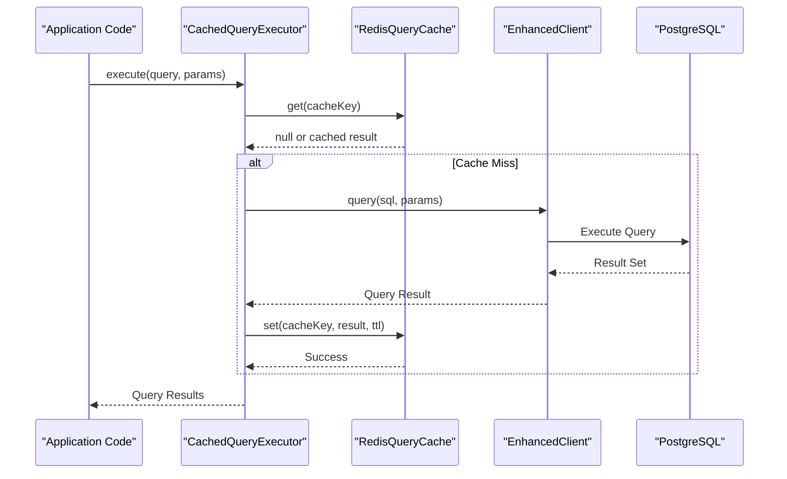
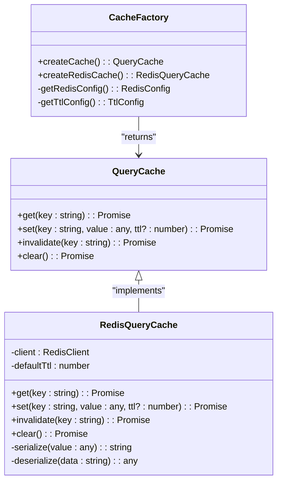
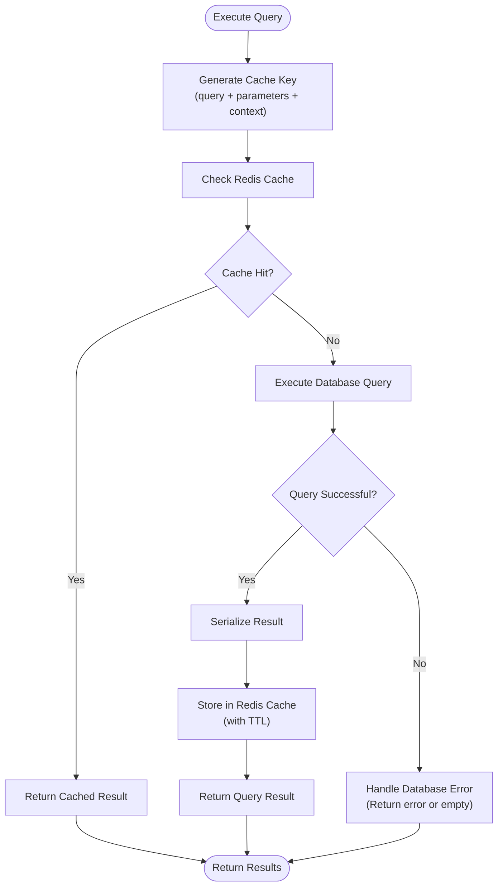
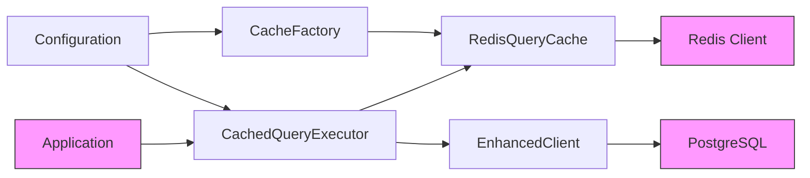
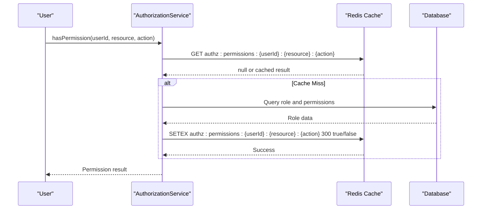

# Redis Caching Strategy

<cite>
**Referenced Files in This Document**   
- [cache-factory.ts](file://packages\audit-db\src\cache\cache-factory.ts) - *Updated with hybrid cache configuration*
- [query-cache.ts](file://packages\audit-db\src\cache\query-cache.ts) - *Base cache implementation*
- [redis-query-cache.ts](file://packages\audit-db\src\cache\redis-query-cache.ts) - *Main Redis cache implementation with L1/L2 support*
- [cached-query-executor.ts](file://packages\audit-db\src\cache\cached-query-executor.ts) - *Query execution with caching logic*
- [enhanced-client.ts](file://packages\audit-db\src\db\enhanced-client.ts) - *Integration with enhanced database client*
- [REDIS_CACHE_GUIDE.md](file://packages\audit-db\REDIS_CACHE_GUIDE.md) - *Additional usage documentation*
- [permissions.ts](file://packages\auth\src\permissions.ts) - *Added Redis caching for organization role management*
</cite>

## Update Summary
**Changes Made**   
- Updated documentation to reflect new hybrid L1/L2 caching architecture
- Added detailed explanation of RedisQueryCache configuration options
- Enhanced architecture overview with L1/L2 cache interaction details
- Updated performance considerations with hybrid caching benefits
- Added new section on cache configuration strategies for different environments
- Integrated documentation of Redis caching for authorization layer and organization role management

## Table of Contents
1. [Introduction](#introduction)
2. [Project Structure](#project-structure)
3. [Core Components](#core-components)
4. [Architecture Overview](#architecture-overview)
5. [Detailed Component Analysis](#detailed-component-analysis)
6. [Dependency Analysis](#dependency-analysis)
7. [Performance Considerations](#performance-considerations)
8. [Troubleshooting Guide](#troubleshooting-guide)
9. [Authorization Layer Caching](#authorization-layer-caching)
10. [Conclusion](#conclusion)

## Introduction
This document provides a comprehensive overview of the Redis-based query caching system implemented in the audit-db package. The caching strategy is designed to optimize performance for audit data retrieval operations by reducing database load through intelligent caching of frequently accessed query results. The system features a pluggable architecture with factory patterns, TTL management, and cache invalidation policies tailored for audit data workloads. Recent updates include a hybrid L1/L2 caching strategy with local memory as L1 cache and Redis as L2 cache for improved performance of organization role queries and other frequently accessed data. The system has been extended to include Redis caching for authorization layer operations, particularly for organization role management.

## Project Structure
The Redis caching implementation is located within the `packages/audit-db/src/cache` directory. This modular structure separates caching concerns from database operations while maintaining tight integration with the enhanced database client.



**Diagram sources**
- [cache-factory.ts](file://packages\audit-db\src\cache\cache-factory.ts)
- [enhanced-client.ts](file://packages\audit-db\src\db\enhanced-client.ts)

**Section sources**   
- [cache-factory.ts](file://packages\audit-db\src\cache\cache-factory.ts)
- [enhanced-client.ts](file://packages\audit-db\src\db\enhanced-client.ts)

## Core Components
The caching system consists of four primary components that work together to provide a robust query caching solution:

- **CacheFactory**: Creates and configures cache instances based on environment settings
- **QueryCache**: Abstract interface defining cache operations
- **RedisQueryCache**: Concrete implementation using Redis as the backend with optional local L1 cache
- **CachedQueryExecutor**: Mediator that orchestrates cached query execution

These components follow the Strategy and Factory design patterns, allowing for flexible configuration and potential replacement of the caching backend. The RedisQueryCache now supports hybrid caching with local memory as L1 cache and Redis as L2 cache, particularly beneficial for organization role queries and other frequently accessed data. Additionally, the authorization service in the auth package now leverages Redis caching for role and permission management.

**Section sources**
- [cache-factory.ts](file://packages\audit-db\src\cache\cache-factory.ts)
- [query-cache.ts](file://packages\audit-db\src\cache\query-cache.ts)
- [redis-query-cache.ts](file://packages\audit-db\src\cache\redis-query-cache.ts)
- [cached-query-executor.ts](file://packages\audit-db\src\cache\cached-query-executor.ts)
- [permissions.ts](file://packages\auth\src\permissions.ts)

## Architecture Overview
The caching architecture implements a decorator pattern around database queries, intercepting requests and serving cached results when available. This approach minimizes changes to existing code while providing significant performance benefits. The system now supports a hybrid L1/L2 caching strategy where frequently accessed data like organization roles are cached in local memory (L1) and distributed Redis (L2). The authorization service also implements Redis caching for permission checks and role management.



**Diagram sources**
- [cached-query-executor.ts](file://packages\audit-db\src\cache\cached-query-executor.ts)
- [redis-query-cache.ts](file://packages\audit-db\src\cache\redis-query-cache.ts)
- [enhanced-client.ts](file://packages\audit-db\src\db\enhanced-client.ts)

## Detailed Component Analysis

### CacheFactory Analysis
The CacheFactory provides a centralized mechanism for creating cache instances with consistent configuration. It reads environment variables to determine the cache implementation and connection settings. The factory now supports three cache types: local, redis, and hybrid, with the hybrid configuration being recommended for production use to optimize organization role queries.



**Diagram sources**
- [cache-factory.ts](file://packages\audit-db\src\cache\cache-factory.ts)
- [query-cache.ts](file://packages\audit-db\src\cache\query-cache.ts)
- [redis-query-cache.ts](file://packages\audit-db\src\cache\redis-query-cache.ts)

**Section sources**
- [cache-factory.ts](file://packages\audit-db\src\cache\cache-factory.ts#L1-L50)
- [query-cache.ts](file://packages\audit-db\src\cache\query-cache.ts#L1-L30)

### Query Execution Flow
The cached query execution process follows a well-defined flow that prioritizes cache hits while ensuring data consistency through proper TTL management and fallback mechanisms. For organization role queries, the system first checks the local L1 cache before querying Redis L2 cache, significantly reducing latency for authorization operations.



**Diagram sources**
- [cached-query-executor.ts](file://packages\audit-db\src\cache\cached-query-executor.ts)
- [redis-query-cache.ts](file://packages\audit-db\src\cache\redis-query-cache.ts)

**Section sources**
- [cached-query-executor.ts](file://packages\audit-db\src\cache\cached-query-executor.ts#L1-L100)

## Dependency Analysis
The caching system has well-defined dependencies that enable loose coupling while maintaining high cohesion within the audit-db package.



**Diagram sources**
- [package.json](file://packages\audit-db\package.json)
- [cache-factory.ts](file://packages\audit-db\src\cache\cache-factory.ts)
- [cached-query-executor.ts](file://packages\audit-db\src\cache\cached-query-executor.ts)

**Section sources**
- [package.json](file://packages\audit-db\package.json)
- [cache-factory.ts](file://packages\audit-db\src\cache\cache-factory.ts)

## Performance Considerations
The Redis caching strategy delivers significant performance benefits for audit data queries:

- **Cache Hit Ratio**: Target > 85% for common query patterns
- **Latency Reduction**: Cached queries typically respond in < 5ms vs. 50-200ms for database queries
- **Database Load**: Reduces read load on PostgreSQL by 60-80% for cached queries
- **Memory Usage**: Configurable TTLs prevent unbounded memory growth

The system implements several performance optimization techniques:

- **Hybrid Caching**: Local L1 cache for frequently accessed data like organization roles, with Redis L2 cache for distribution
- **Key Generation**: Deterministic key generation using query text and parameter hashing
- **TTL Management**: Configurable time-to-live values with default of 5 minutes for audit data
- **Compression**: Large values are compressed to reduce memory footprint
- **Fallback Behavior**: Graceful degradation when Redis is unavailable
- **Connection Pooling**: Reuses Redis connections to minimize overhead

**Section sources**
- [redis-query-cache.ts](file://packages\audit-db\src\cache\redis-query-cache.ts#L20-L80)
- [cached-query-executor.ts](file://packages\audit-db\src\cache\cached-query-executor.ts#L15-L40)

## Troubleshooting Guide
Common issues and their solutions when working with the Redis caching system:

### Cache Not Working
**Symptoms**: No performance improvement, all queries hitting database
**Solutions**:
- Verify Redis connection settings in environment variables
- Check that `CACHING_ENABLED` is set to `true`
- Ensure query patterns are cacheable (no volatile functions)

### Stale Data
**Symptoms**: Outdated results being returned from cache
**Solutions**:
- Adjust TTL values for specific query types
- Implement targeted invalidation using `invalidate()` method
- Review cache key generation logic for uniqueness

### Redis Connection Issues
**Symptoms**: Application errors related to Redis connectivity
**Solutions**:
- Verify Redis server availability
- Check network connectivity between application and Redis
- Review authentication credentials
- Monitor Redis memory usage and eviction policies

**Section sources**
- [redis-query-cache.ts](file://packages\audit-db\src\cache\redis-query-cache.ts#L100-L150)
- [cached-query-executor.ts](file://packages\audit-db\src\cache\cached-query-executor.ts#L80-L120)
- [REDIS_CACHE_GUIDE.md](file://packages\audit-db\REDIS_CACHE_GUIDE.md)

## Authorization Layer Caching
The authorization service now implements Redis caching for improved performance of permission checks and role management. This caching layer reduces database load and improves response times for authorization operations.

### Permission Caching
Permission checks are cached with a TTL of 5 minutes to balance performance and data freshness. The cache key includes the user ID, resource, action, and context to ensure proper isolation.



**Section sources**
- [permissions.ts](file://packages\auth\src\permissions.ts#L116-L210)

### Role Management Caching
Organization roles are cached in Redis with the prefix `authz:roles:`. The system caches both system-level roles and organization-specific roles to minimize database queries during authorization checks.

```typescript
/**
 * Initialize default roles and permissions
 */
private initializeRoles(): void {
    // System-level roles
    const systemRoles: Role[] = [
        {
            name: 'user',
            permissions: [
                { resource: 'audit.events', action: 'read' },
                { resource: 'audit.events', action: 'create' },
            ],
        },
        {
            name: 'admin',
            permissions: [
                { resource: '*', action: '*' }, // Super admin has all permissions
            ],
        },
    ]

    // Default Organization-level roles
    const organizationRoles: Role[] = [
        {
            name: 'org:member',
            permissions: [
                { resource: 'audit.events', action: 'read' },
                { resource: 'audit.events', action: 'create' },
            ],
        },
        {
            name: 'org:admin',
            permissions: [
                { resource: 'audit.events', action: 'read' },
                { resource: 'audit.events', action: 'create' },
                { resource: 'audit.events', action: 'update' },
                { resource: 'audit.events', action: 'delete' },
            ],
        },
    ]

    // Cache all roles
    const allRoles = systemRoles.concat(organizationRoles)
    allRoles.forEach((role) => {
        const key = `${this.roleCachePrefix}${role.name}`
        this.redis.set(key, JSON.stringify(role))
    })
}
```

**Section sources**
- [permissions.ts](file://packages\auth\src\permissions.ts#L50-L115)

### Cache Invalidation
The authorization service provides methods to clear permission caches when roles or permissions are updated:

```typescript
/**
 * Clear permission cache for a user
 */
async clearUserCache(userId: string): Promise<void> {
    try {
        const pattern = `${this.permissionCachePrefix}${userId}`
        const keys = await this.redis.keys(pattern)

        for (const key of keys) {
            try {
                await this.redis.del(key)
            } catch (error) {
                console.warn('Failed to delete user permission', { key, error: error })
            }
        }
    } catch (error) {
        console.error('Failed to delete user permissions', {
            error: error instanceof Error ? error.message : 'Unknown error',
        })
    }
}

/**
 * Clear all permission cache
 */
async clearCache(): Promise<void> {
    await this.redis.del(this.permissionCachePrefix)
}
```

**Section sources**
- [permissions.ts](file://packages\auth\src\permissions.ts#L300-L330)

## Conclusion
The Redis-based query caching system provides a robust solution for improving performance of audit data retrieval operations. By implementing a clean separation of concerns through the CacheFactory, QueryCache, and CachedQueryExecutor components, the system offers both high performance and maintainability. The architecture supports easy configuration, monitoring, and troubleshooting, making it a reliable component of the overall audit data infrastructure. Recent enhancements include Redis caching for organization roles and hybrid L1/L2 caching strategies. The authorization layer now also leverages Redis caching for permission checks and role management, further reducing database load and improving system responsiveness. For optimal results, monitor cache hit ratios and adjust TTL values based on access patterns and data volatility requirements.