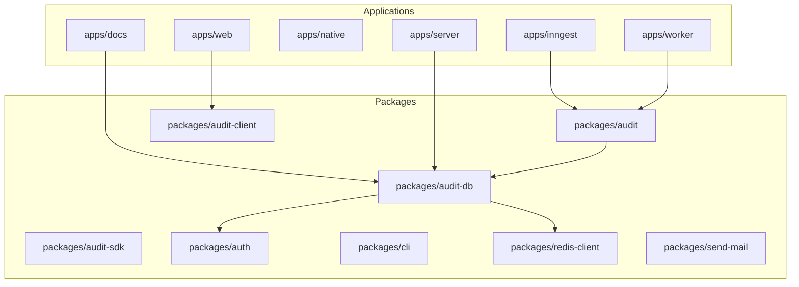
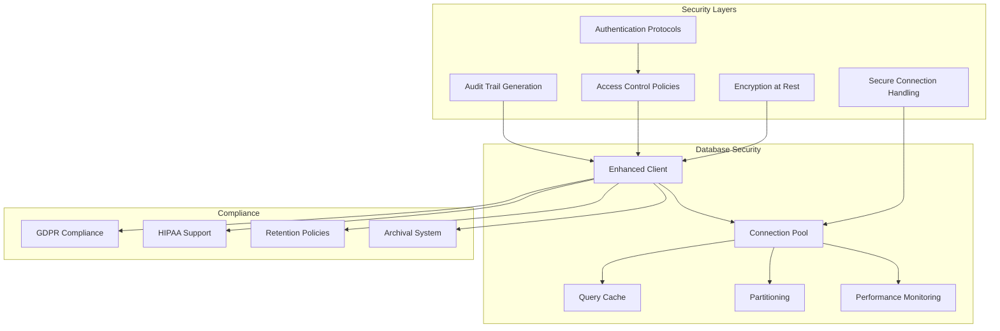
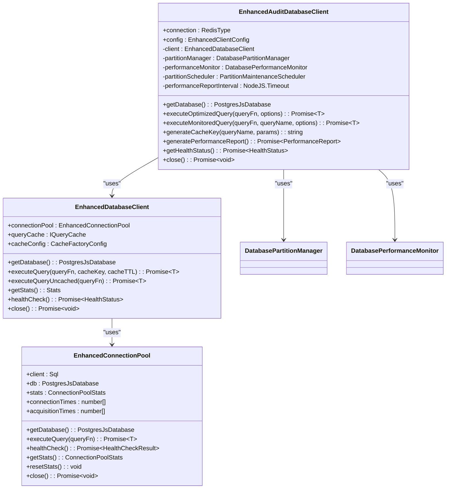
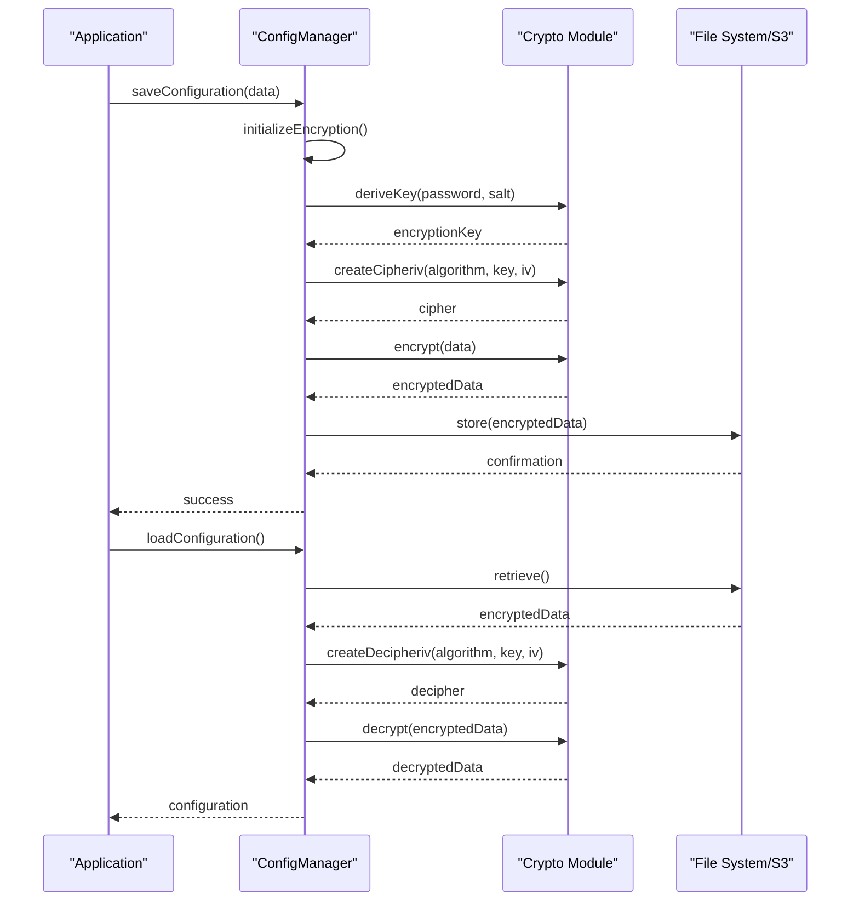
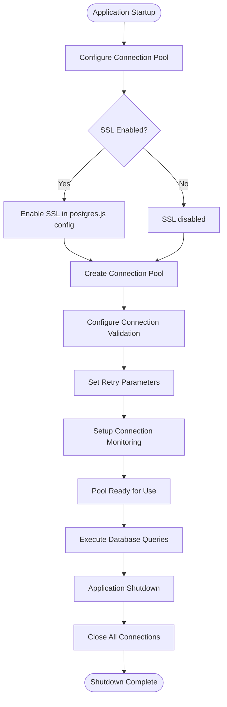
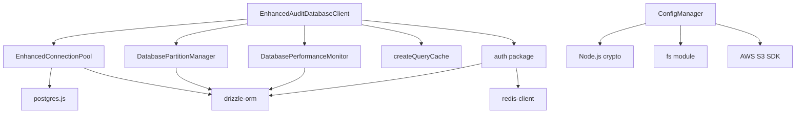

# Security and Access Control

<cite>
**Referenced Files in This Document**   
- [enhanced-client.ts](file://packages/audit-db/src/db/enhanced-client.ts)
- [connection-pool.ts](file://packages/audit-db/src/db/connection-pool.ts)
- [schema.ts](file://packages/audit-db/src/db/schema.ts)
- [manager.ts](file://packages/audit/src/config/manager.ts)
- [database-alert-handler.ts](file://packages/audit/src/monitor/database-alert-handler.ts)
- [database-alert-integration.ts](file://packages/audit/src/examples/database-alert-integration.ts)
</cite>

## Table of Contents
1. [Introduction](#introduction)
2. [Project Structure](#project-structure)
3. [Core Components](#core-components)
4. [Architecture Overview](#architecture-overview)
5. [Detailed Component Analysis](#detailed-component-analysis)
6. [Dependency Analysis](#dependency-analysis)
7. [Performance Considerations](#performance-considerations)
8. [Troubleshooting Guide](#troubleshooting-guide)
9. [Conclusion](#conclusion)

## Introduction
This document provides a comprehensive analysis of the security and access control mechanisms implemented in the smart-logs repository. The system is designed to ensure robust database security, enforce strict access policies, and maintain compliance with data protection regulations. The architecture incorporates encryption at rest, secure connection handling, authentication protocols, tenant isolation, and comprehensive audit trail generation. The enhanced client plays a central role in enforcing access policies, preventing injection attacks through parameterized queries, and managing secure database operations. Recent updates have enhanced the alert persistence system by integrating the EnhancedAuditDb client and configuration management, improving the security and reliability of monitoring operations.

## Project Structure
The repository follows a monorepo structure with multiple applications and packages organized under the `apps` and `packages` directories. The core security components are primarily located in the `packages` directory, specifically within `audit-db`, `audit`, and `auth`. The `apps` directory contains various application implementations including web, native, server, and documentation. The structure supports modular development with clear separation of concerns, enabling independent development and deployment of security-critical components.



**Diagram sources**
- [package.json](file://package.json)

**Section sources**
- [package.json](file://package.json)

## Core Components
The security architecture is built around several core components that work together to provide comprehensive database security and access control. The enhanced database client serves as the primary interface for secure database operations, integrating connection pooling, query caching, and performance monitoring. The audit database package provides the foundation for secure data storage with tenant isolation and compliance features. The configuration manager handles encryption at rest for sensitive configuration data, while the authentication package manages user access and permissions. The DatabaseAlertHandler component has been updated to use the EnhancedAuditDb client, ensuring that all alert persistence operations benefit from the same security and performance features as other database operations.

**Section sources**
- [enhanced-client.ts](file://packages/audit-db/src/db/enhanced-client.ts)
- [manager.ts](file://packages/audit/src/config/manager.ts)
- [schema.ts](file://packages/audit-db/src/db/schema.ts)
- [database-alert-handler.ts](file://packages/audit/src/monitor/database-alert-handler.ts)

## Architecture Overview
The security architecture implements a multi-layered approach to database security and access control. At the foundation is encryption at rest for sensitive data, complemented by secure connection handling with SSL/TLS support. The enhanced client enforces access policies and prevents injection attacks through parameterized queries. Tenant isolation is achieved through organizational identifiers in database tables, ensuring data separation between different organizations. Row-level security considerations are addressed through comprehensive audit trails and cryptographic integrity verification.



**Diagram sources**
- [enhanced-client.ts](file://packages/audit-db/src/db/enhanced-client.ts)
- [connection-pool.ts](file://packages/audit-db/src/db/connection-pool.ts)
- [schema.ts](file://packages/audit-db/src/db/schema.ts)

## Detailed Component Analysis

### Enhanced Client Analysis
The enhanced client is the central component for enforcing security policies and preventing injection attacks. It provides a comprehensive interface for secure database operations, integrating multiple security and performance features. The client uses parameterized queries through the Drizzle ORM and postgres.js driver, which automatically handle proper escaping and prevent SQL injection attacks. All database interactions are routed through this client, ensuring consistent security enforcement across the application.



**Diagram sources**
- [enhanced-client.ts](file://packages/audit-db/src/db/enhanced-client.ts)
- [connection-pool.ts](file://packages/audit-db/src/db/connection-pool.ts)

**Section sources**
- [enhanced-client.ts](file://packages/audit-db/src/db/enhanced-client.ts)

### Encryption at Rest Implementation
The system implements encryption at rest for sensitive configuration data using industry-standard cryptographic algorithms. The configuration manager handles the encryption and decryption of configuration files, supporting both local file storage and S3 storage. The implementation uses AES-256-GCM or PBKDF2-based encryption with configurable key derivation functions, providing strong protection for sensitive data when stored on disk or in cloud storage.



**Diagram sources**
- [manager.ts](file://packages/audit/src/config/manager.ts)

**Section sources**
- [manager.ts](file://packages/audit/src/config/manager.ts)

### Secure Connection Handling
The connection pool implementation provides secure connection handling with support for SSL/TLS encryption. The enhanced connection pool manages database connections with configurable security settings, including SSL enablement, connection validation, and retry mechanisms. The implementation uses the postgres.js driver with proper configuration for secure connections, ensuring that data transmitted between the application and database is encrypted in transit.



**Diagram sources**
- [connection-pool.ts](file://packages/audit-db/src/db/connection-pool.ts)

**Section sources**
- [connection-pool.ts](file://packages/audit-db/src/db/connection-pool.ts)

### Tenant Isolation Strategies
The system implements robust tenant isolation through organizational identifiers in database tables. Each record in multi-tenant tables includes an `organizationId` field that establishes ownership and enables row-level security. This approach ensures that data from different organizations is logically separated within the same database, preventing unauthorized access between tenants. The schema design incorporates organizational identifiers in key tables such as alerts, scheduled reports, and report templates.

```mermaid
erDiagram
AUDIT_LOG {
serial id PK
timestamp with time zone timestamp
varchar ttl
varchar principal_id
varchar organization_id
varchar action
varchar target_resource_type
varchar target_resource_id
varchar status
text outcome_description
varchar hash
varchar hash_algorithm
varchar event_version
varchar correlation_id
varchar data_classification
varchar retention_policy
integer processing_latency
timestamp with time zone archived_at
jsonb details
}
ALERTS {
varchar id PK
varchar organization_id FK
varchar severity
varchar type
varchar title
text description
varchar source
varchar correlation_id
jsonb metadata
varchar acknowledged
timestamp with time zone acknowledged_at
varchar acknowledged_by
varchar resolved
timestamp with time zone resolved_at
varchar resolved_by
text resolution_notes
timestamp with time zone created_at
timestamp with time zone updated_at
}
SCHEDULED_REPORTS {
varchar id PK
varchar name
text description
varchar organization_id FK
varchar template_id
varchar report_type
jsonb criteria
varchar format
jsonb schedule
jsonb delivery
jsonb export
varchar enabled
timestamp with time zone last_run
timestamp with time zone next_run
timestamp with time zone created_at
varchar created_by
timestamp with time zone updated_at
varchar updated_by
}
REPORT_TEMPLATES {
varchar id PK
varchar name
text description
varchar organization_id FK
varchar report_type
jsonb default_criteria
varchar default_format
jsonb default_export_config
jsonb tags
varchar is_active
timestamp with time zone created_at
varchar created_by
timestamp with time zone updated_at
varchar updated_by
}
AUDIT_LOG ||--o{ ALERTS : "generates"
SCHEDULED_REPORTS ||--o{ REPORT_TEMPLATES : "uses"
ALERTS ||--o{ SCHEDULED_REPORTS : "triggers"
AUDIT_LOG }|--|| REPORT_TEMPLATES : "supports"
```



**Diagram sources**
- [schema.ts](file://packages/audit-db/src/db/schema.ts)

**Section sources**
- [schema.ts](file://packages/audit-db/src/db/schema.ts)

### Database Alert Handler Implementation
The DatabaseAlertHandler component has been updated to use the EnhancedAuditDb client, ensuring that all alert persistence operations benefit from the same security and performance features as other database operations. This implementation provides a robust interface for storing alerts in PostgreSQL with organization-based access control. The handler uses the enhanced client's monitoring and caching capabilities to improve performance and reliability.

```mermaid
classDiagram
class DatabaseAlertHandler {
-client : EnhancedAuditDatabaseClient
-db : PostgresJsDatabase
+handlerName() : string
+sendAlert(alert : Alert) : Promise~void~
+acknowledgeAlert(alertId : string, acknowledgedBy : string) : Promise~{success : boolean}~
+resolveAlert(alertId : string, resolvedBy : string, resolutionData? : AlertResolution) : Promise~{success : boolean}~
+getActiveAlerts(organizationId? : string) : Promise~Alert[]~
+numberOfActiveAlerts(organizationId? : string) : Promise~number~
+getAlerts(filters : AlertQueryFilters) : Promise~Alert[]~
+getAlertById(alertId : string, organizationId : string) : Promise~Alert | null~
+getAlertStatistics(organizationId? : string) : Promise~AlertStatistics~
+cleanupResolvedAlerts(organizationId : string, retentionDays : number) : Promise~number~
}
class EnhancedAuditDb {
-client : EnhancedAuditDatabaseClient
+getEnhancedClientInstance() : EnhancedAuditDatabaseClient
+getDrizzleInstance() : PostgresJsDatabase~typeof schema~
+checkAuditDbConnection() : Promise~boolean~
+healthStatus() : Promise~HealthStatus~
+end() : Promise~void~
}
DatabaseAlertHandler --> EnhancedAuditDb : "uses"
```

**Diagram sources**
- [database-alert-handler.ts](file://packages/audit/src/monitor/database-alert-handler.ts)
- [enhanced-client.ts](file://packages/audit-db/src/db/enhanced-client.ts)

**Section sources**
- [database-alert-handler.ts](file://packages/audit/src/monitor/database-alert-handler.ts)
- [database-alert-integration.ts](file://packages/audit/src/examples/database-alert-integration.ts)

## Dependency Analysis
The security components have well-defined dependencies that ensure proper isolation and modular. The enhanced client depends on the connection pool, partition manager, and performance monitor, creating a layered architecture. The connection pool depends on the postgres.js driver and Drizzle ORM for database interactions. The configuration manager depends on Node.js crypto modules for encryption operations. These dependencies are managed through the monorepo structure, allowing for independent versioning and testing of security-critical components.



**Diagram sources**
- [enhanced-client.ts](file://packages/audit-db/src/db/enhanced-client.ts)
- [connection-pool.ts](file://packages/audit-db/src/db/connection-pool.ts)
- [manager.ts](file://packages/audit/src/config/manager.ts)
- [schema.ts](file://packages/audit-db/src/db/schema.ts)

**Section sources**
- [enhanced-client.ts](file://packages/audit-db/src/db/enhanced-client.ts)
- [connection-pool.ts](file://packages/audit-db/src/db/connection-pool.ts)
- [manager.ts](file://packages/audit/src/config/manager.ts)

## Performance Considerations
The security implementation balances robust protection with performance optimization. The enhanced client incorporates query caching to reduce database load while maintaining security. Connection pooling minimizes connection overhead and improves response times. The system includes comprehensive performance monitoring with automatic reporting and optimization recommendations. These features ensure that security measures do not unduly impact system performance, maintaining responsiveness even under heavy load.

**Section sources**
- [enhanced-client.ts](file://packages/audit-db/src/db/enhanced-client.ts)
- [connection-pool.ts](file://packages/audit-db/src/db/connection-pool.ts)

## Troubleshooting Guide
When encountering security-related issues, first verify the configuration of the enhanced client and connection pool. Check that SSL settings are properly configured for production deployments. Ensure that the Redis connection is available for query caching. Verify that encryption keys are properly set in environment variables. Monitor the performance reports for any anomalies in connection acquisition times or cache hit ratios. For tenant isolation issues, confirm that organization IDs are correctly set in queries and that row-level security policies are properly enforced.

**Section sources**
- [enhanced-client.ts](file://packages/audit-db/src/db/enhanced-client.ts)
- [connection-pool.ts](file://packages/audit-db/src/db/connection-pool.ts)
- [manager.ts](file://packages/audit/src/config/manager.ts)

## Conclusion
The security and access control implementation in the smart-logs repository provides a comprehensive solution for protecting sensitive audit data. The architecture combines encryption at rest, secure connection handling, and robust tenant isolation to ensure data confidentiality and integrity. The enhanced client serves as a central security enforcement point, preventing injection attacks through parameterized queries and providing comprehensive audit trail generation. The system is designed to comply with data protection regulations while maintaining high performance through connection pooling and query caching. This implementation provides a solid foundation for secure audit logging in multi-tenant environments.