# Audit Delivery Handlers

<cite>
**Referenced Files in This Document**   
- [delivery-service.ts](file://packages/audit/src/delivery/delivery-service.ts)
- [interfaces.ts](file://packages/audit/src/delivery/interfaces.ts)
- [types.ts](file://packages/audit/src/delivery/types.ts)
- [email-handler.ts](file://packages/audit/src/delivery/handlers/email-handler.ts)
- [storage-handler.ts](file://packages/audit/src/delivery/handlers/storage-handler.ts)
- [webhook-handler.ts](file://packages/audit/src/delivery/handlers/webhook-handler.ts)
- [email-providers.ts](file://packages/audit/src/delivery/handlers/email-providers.ts)
- [s3-provider.ts](file://packages/audit/src/delivery/handlers/storage-providers/s3-provider.ts)
- [webhook-security.ts](file://packages/audit/src/delivery/handlers/webhook-security.ts)
- [health-monitor.ts](file://packages/audit/src/delivery/health-monitor.ts)
- [destination-manager.ts](file://packages/audit/src/delivery/destination-manager.ts)
</cite>

## Table of Contents
1. [Introduction](#introduction)
2. [Architecture Overview](#architecture-overview)
3. [Core Components](#core-components)
4. [Email Handler Implementation](#email-handler-implementation)
5. [Storage Handler Implementation](#storage-handler-implementation)
6. [Webhook Handler Implementation](#webhook-handler-implementation)
7. [Integration Patterns](#integration-patterns)
8. [Practical Examples](#practical-examples)
9. [Troubleshooting Guide](#troubleshooting-guide)
10. [Conclusion](#conclusion)

## Introduction
The Audit Delivery Handlers system provides a comprehensive solution for delivering audit reports and data to various destinations. This documentation covers the purpose, implementation details, API interfaces, and integration patterns for both email and storage handlers. The system is designed to support multiple delivery methods including email, cloud storage, and webhook integrations, with robust validation, security, and monitoring capabilities.

The handlers are part of a larger audit system that ensures compliance with healthcare regulations and provides reliable delivery of sensitive information. The architecture follows a modular design with clear separation of concerns, allowing for extensibility and maintainability.

## Architecture Overview

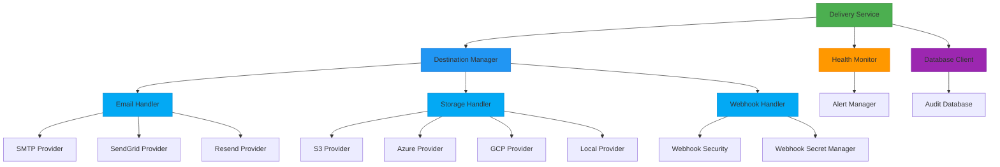

**Diagram sources**
- [delivery-service.ts](file://packages/audit/src/delivery/delivery-service.ts)
- [destination-manager.ts](file://packages/audit/src/delivery/destination-manager.ts)
- [health-monitor.ts](file://packages/audit/src/delivery/health-monitor.ts)

**Section sources**
- [delivery-service.ts](file://packages/audit/src/delivery/delivery-service.ts#L1-L258)
- [interfaces.ts](file://packages/audit/src/delivery/interfaces.ts#L1-L169)

## Core Components

The Audit Delivery Handlers system consists of several core components that work together to provide reliable and secure delivery of audit data. The main components include the Delivery Service, Destination Manager, Health Monitor, and various handler implementations for different delivery methods.

The system follows a service-oriented architecture where each component has a specific responsibility. The Delivery Service acts as the main orchestrator, coordinating between the various components. The Destination Manager handles CRUD operations and validation for delivery destinations. The Health Monitor tracks the health of destinations and implements circuit breaker patterns to prevent overwhelming failing endpoints.

The handlers (email, storage, webhook) implement the IDestinationHandler interface, providing a consistent API for different delivery methods while encapsulating the specific implementation details for each provider.

**Section sources**
- [delivery-service.ts](file://packages/audit/src/delivery/delivery-service.ts#L1-L258)
- [interfaces.ts](file://packages/audit/src/delivery/interfaces.ts#L1-L169)
- [types.ts](file://packages/audit/src/delivery/types.ts#L1-L436)

## Email Handler Implementation

### Email Handler Architecture

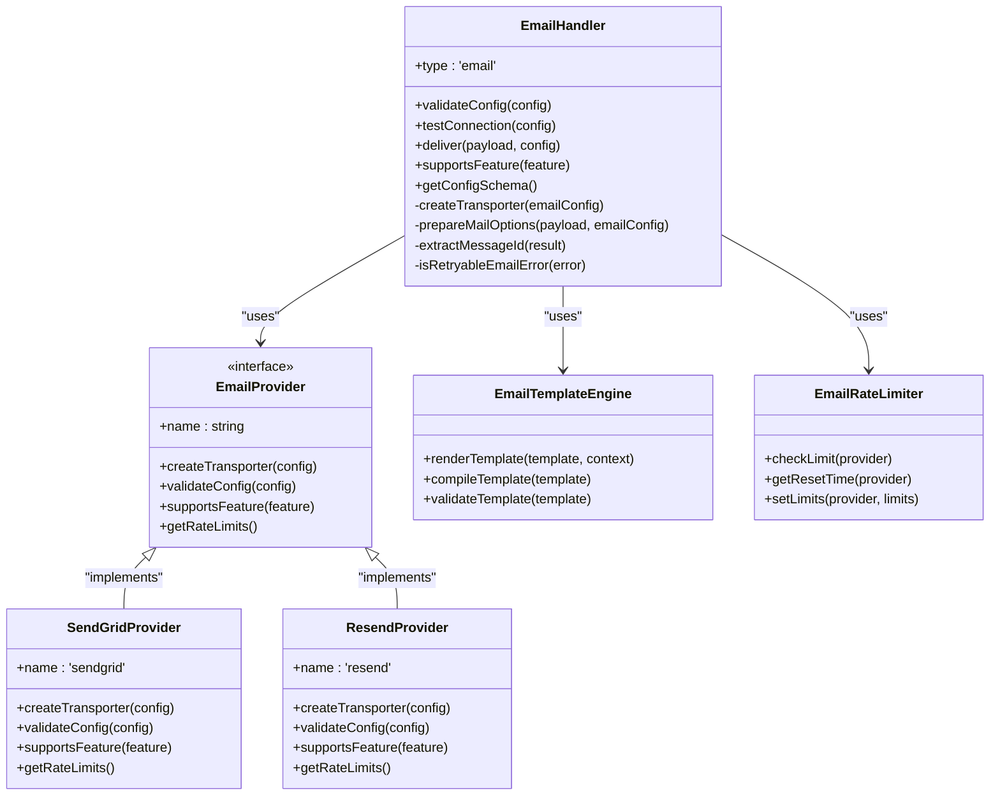

**Diagram sources**
- [email-handler.ts](file://packages/audit/src/delivery/handlers/email-handler.ts#L1-L823)
- [email-providers.ts](file://packages/audit/src/delivery/handlers/email-providers.ts#L1-L488)

### Email Delivery Process

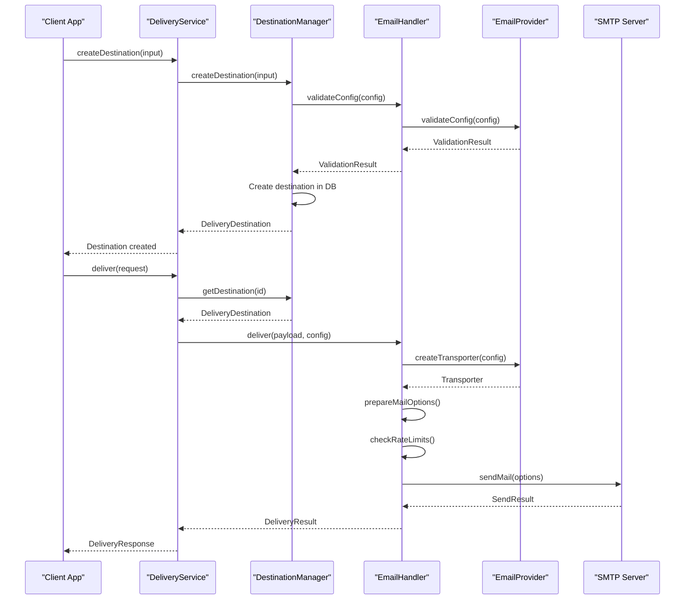

**Diagram sources**
- [delivery-service.ts](file://packages/audit/src/delivery/delivery-service.ts#L1-L258)
- [email-handler.ts](file://packages/audit/src/delivery/handlers/email-handler.ts#L1-L823)

The Email Handler provides a robust solution for delivering audit reports via email with support for multiple providers including SMTP, SendGrid, and Resend. The handler implements the IDestinationHandler interface, ensuring consistency with other delivery methods.

Key features of the Email Handler include:
- Multi-provider support with factory pattern
- Configuration validation with detailed error reporting
- Connection testing capabilities
- Rate limiting to prevent exceeding provider limits
- Template engine for customizable email content
- Connection pooling for improved performance
- Retry logic for transient failures

The handler uses Nodemailer as the underlying email client, providing a consistent interface across different email providers. Each provider (SendGrid, Resend, etc.) implements the EmailProvider interface, allowing for easy addition of new providers.

**Section sources**
- [email-handler.ts](file://packages/audit/src/delivery/handlers/email-handler.ts#L1-L823)
- [email-providers.ts](file://packages/audit/src/delivery/handlers/email-providers.ts#L1-L488)

## Storage Handler Implementation

### Storage Handler Architecture

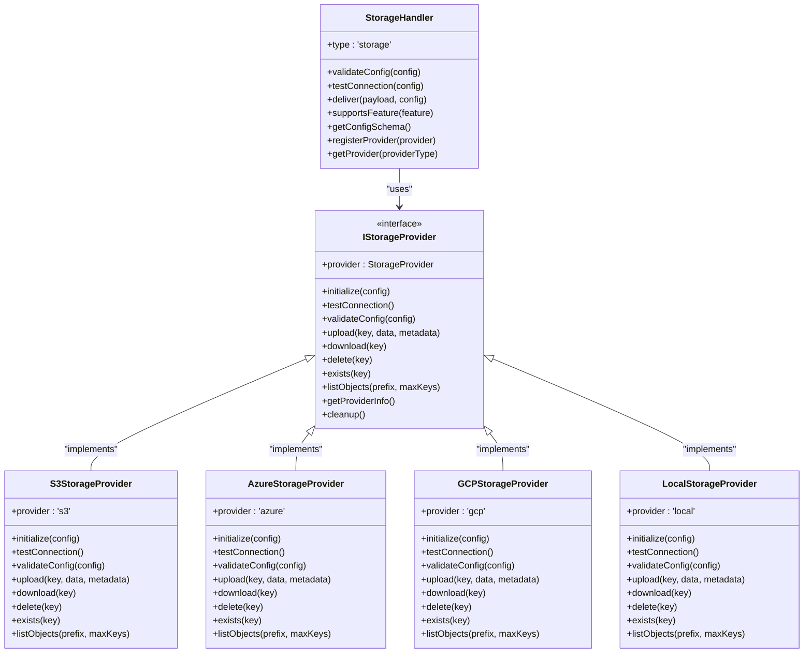

**Diagram sources**
- [storage-handler.ts](file://packages/audit/src/delivery/handlers/storage-handler.ts#L1-L627)
- [s3-provider.ts](file://packages/audit/src/delivery/handlers/storage-providers/s3-provider.ts#L1-L526)

### Storage Delivery Process

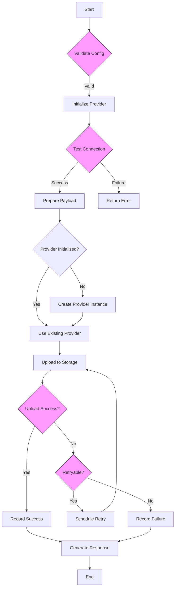

**Diagram sources**
- [storage-handler.ts](file://packages/audit/src/delivery/handlers/storage-handler.ts#L1-L627)
- [s3-provider.ts](file://packages/audit/src/delivery/handlers/storage-providers/s3-provider.ts#L1-L526)

The Storage Handler provides a unified interface for storing audit reports and data in various cloud storage providers including AWS S3, Azure Blob Storage, Google Cloud Storage, and local filesystem storage. The handler follows a provider-based architecture, allowing for easy extension to support additional storage providers.

Key features of the Storage Handler include:
- Support for multiple cloud storage providers
- Comprehensive configuration validation
- Connection testing capabilities
- Automatic provider initialization
- Error handling with specific error types (StorageError, StorageAuthenticationError, etc.)
- Retention policies with configurable auto-cleanup
- Metadata support for stored objects
- Encryption options for sensitive data

The handler uses a factory pattern to instantiate the appropriate provider based on the configuration. Each provider implements the IStorageProvider interface, ensuring consistent behavior across different storage services. The S3 provider, for example, uses the AWS SDK to interact with S3 buckets, handling authentication via access keys, IAM roles, or temporary credentials.

**Section sources**
- [storage-handler.ts](file://packages/audit/src/delivery/handlers/storage-handler.ts#L1-L627)
- [s3-provider.ts](file://packages/audit/src/delivery/handlers/storage-providers/s3-provider.ts#L1-L526)

## Webhook Handler Implementation

### Webhook Handler Architecture

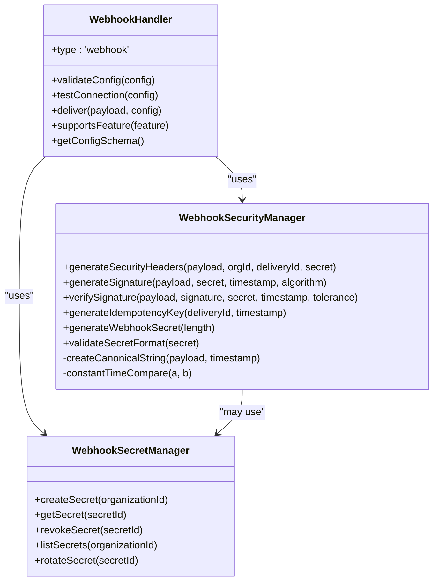

**Diagram sources**
- [webhook-handler.ts](file://packages/audit/src/delivery/handlers/webhook-handler.ts#L1-L557)
- [webhook-security.ts](file://packages/audit/src/delivery/handlers/webhook-security.ts#L1-L330)

### Webhook Delivery Process

```mermaid
sequenceDiagram
participant Client as "Client App"
participant Service as "DeliveryService"
participant Handler as "WebhookHandler"
partner Webhook as "External Webhook"
Client->>Service : deliver(request)
Service->>Handler : deliver(payload, config)
Handler->>Handler : validateConfig(config)
Handler->>Handler : generateSecurityHeaders()
Handler->>Handler : makeHttpRequest()
Handler->>Webhook : POST /webhook-url
Note right of Webhook : Headers : X-Webhook-Signature,<br/>X-Webhook-Timestamp,<br/>X-Idempotency-Key
Webhook-->>Handler : HTTP Response
Handler->>Handler : processResponse()
Handler-->>Service : DeliveryResult
Service-->>Client : DeliveryResponse
alt Signature Verification
Webhook->>Webhook : verifySignature()
Webhook->>Webhook : checkTimestamp()
Webhook->>Webhook : validateIdempotencyKey()
end
```

**Diagram sources**
- [webhook-handler.ts](file://packages/audit/src/delivery/handlers/webhook-handler.ts#L1-L557)
- [webhook-security.ts](file://packages/audit/src/delivery/handlers/webhook-security.ts#L1-L330)

The Webhook Handler enables secure delivery of audit data to external systems via HTTP webhooks. It provides robust security features including HMAC signatures, timestamp validation, and idempotency keys to ensure message integrity and prevent replay attacks.

Key features of the Webhook Handler include:
- Support for POST and PUT methods
- Configurable timeouts and retry policies
- HMAC-SHA256 signature generation and verification
- Timestamp validation with configurable tolerance
- Idempotency key generation to prevent duplicate processing
- Secret management for secure authentication
- Comprehensive configuration validation
- Connection testing capabilities

The handler integrates with the WebhookSecurityManager to handle all security aspects of webhook delivery. When delivering a payload, it generates security headers including the signature, timestamp, and idempotency key. The signature is generated using HMAC-SHA256 with a shared secret, ensuring that only authorized recipients can verify the message authenticity.

**Section sources**
- [webhook-handler.ts](file://packages/audit/src/delivery/handlers/webhook-handler.ts#L1-L557)
- [webhook-security.ts](file://packages/audit/src/delivery/handlers/webhook-security.ts#L1-L330)

## Integration Patterns

### Health Monitoring Integration

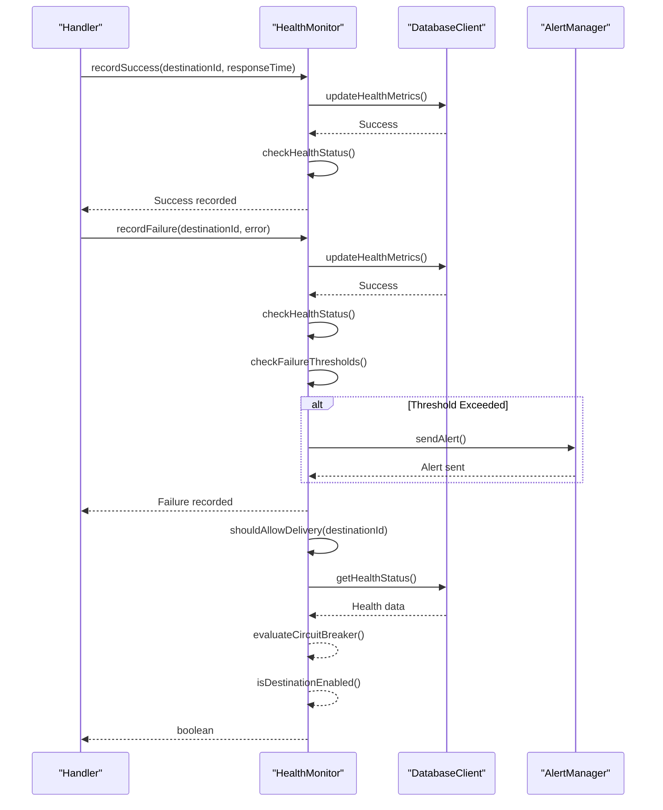

**Diagram sources**
- [health-monitor.ts](file://packages/audit/src/delivery/health-monitor.ts#L1-L394)
- [delivery-service.ts](file://packages/audit/src/delivery/delivery-service.ts#L1-L258)

### Destination Management Flow

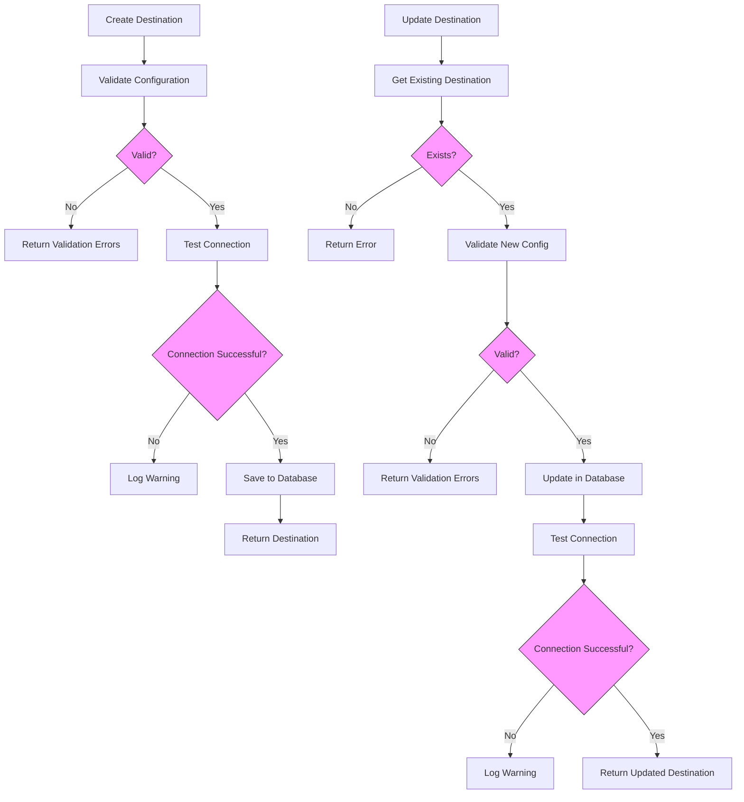

**Diagram sources**
- [destination-manager.ts](file://packages/audit/src/delivery/destination-manager.ts#L1-L423)
- [delivery-service.ts](file://packages/audit/src/delivery/delivery-service.ts#L1-L258)

The Audit Delivery Handlers system supports several integration patterns that enable flexible and reliable delivery of audit data. These patterns are designed to ensure system reliability, security, and maintainability.

The health monitoring integration pattern uses a circuit breaker approach to prevent overwhelming failing endpoints. When a destination experiences consecutive failures, it is automatically disabled or placed in a degraded state. The system periodically tests the health of unhealthy destinations and gradually restores them to service when they become available again.

The destination management pattern provides a consistent API for creating, updating, and deleting delivery destinations. Each operation includes comprehensive validation and optional connection testing to ensure the destination is properly configured before use. The system maintains detailed health metrics for each destination, which are used to inform delivery decisions and trigger alerts when thresholds are exceeded.

**Section sources**
- [health-monitor.ts](file://packages/audit/src/delivery/health-monitor.ts#L1-L394)
- [destination-manager.ts](file://packages/audit/src/delivery/destination-manager.ts#L1-L423)

## Practical Examples

### Email Delivery Configuration

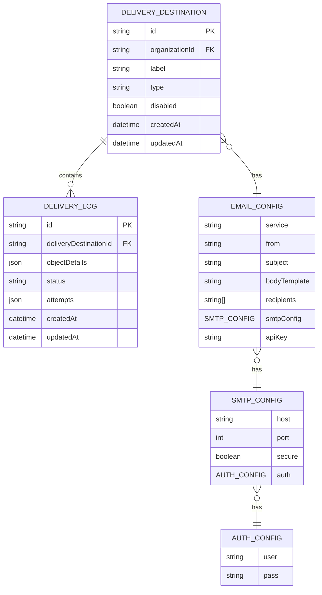

**Diagram sources**
- [types.ts](file://packages/audit/src/delivery/types.ts#L1-L436)
- [email-handler.ts](file://packages/audit/src/delivery/handlers/email-handler.ts#L1-L823)

### Storage Delivery Configuration

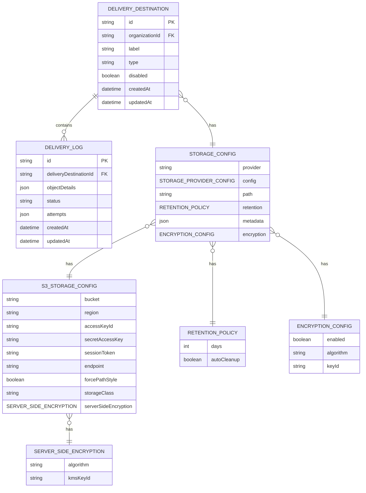

**Diagram sources**
- [types.ts](file://packages/audit/src/delivery/types.ts#L1-L436)
- [storage-handler.ts](file://packages/audit/src/delivery/handlers/storage-handler.ts#L1-L627)

The Audit Delivery Handlers system provides practical examples for configuring and using both email and storage delivery methods. These examples demonstrate the required configuration structure and highlight important considerations for production use.

For email delivery, the configuration includes the email service provider (SMTP, SendGrid, Resend, etc.), authentication credentials, sender information, and message templates. The system validates all configuration options and provides detailed error messages for invalid configurations.

For storage delivery, the configuration includes the storage provider (S3, Azure, GCP, etc.), authentication credentials, bucket/container information, and path structure. The system supports advanced features like retention policies, server-side encryption, and metadata tagging.

**Section sources**
- [types.ts](file://packages/audit/src/delivery/types.ts#L1-L436)
- [email-handler.ts](file://packages/audit/src/delivery/handlers/email-handler.ts#L1-L823)
- [storage-handler.ts](file://packages/audit/src/delivery/handlers/storage-handler.ts#L1-L627)

## Troubleshooting Guide

### Common Issues and Solutions

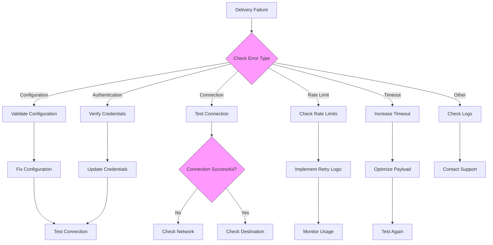

**Diagram sources**
- [email-handler.ts](file://packages/audit/src/delivery/handlers/email-handler.ts#L1-L823)
- [storage-handler.ts](file://packages/audit/src/delivery/handlers/storage-handler.ts#L1-L627)
- [webhook-handler.ts](file://packages/audit/src/delivery/handlers/webhook-handler.ts#L1-L557)

The troubleshooting guide provides solutions for common issues encountered when using the Audit Delivery Handlers system. These issues are categorized by error type, with specific steps for diagnosis and resolution.

Common configuration issues include missing required fields, invalid email addresses, or incorrect storage bucket names. The system provides detailed validation error messages to help identify and fix these issues.

Connection issues may be caused by network problems, firewall restrictions, or incorrect endpoint URLs. The system includes connection testing capabilities to help diagnose these issues before attempting delivery.

Authentication issues typically involve incorrect credentials or expired tokens. For cloud storage providers, ensure that the appropriate IAM permissions are configured and that credentials have not expired.

Rate limiting issues occur when delivery attempts exceed the provider's rate limits. The system includes rate limiting functionality to prevent this, but in high-volume scenarios, you may need to implement additional queuing or batching.

**Section sources**
- [email-handler.ts](file://packages/audit/src/delivery/handlers/email-handler.ts#L1-L823)
- [storage-handler.ts](file://packages/audit/src/delivery/handlers/storage-handler.ts#L1-L627)
- [webhook-handler.ts](file://packages/audit/src/delivery/handlers/webhook-handler.ts#L1-L557)

## Conclusion
The Audit Delivery Handlers system provides a comprehensive and extensible solution for delivering audit reports and data to various destinations. The modular architecture, with its clear separation of concerns, enables reliable and secure delivery through email, cloud storage, and webhook integrations.

Key strengths of the system include its robust validation and error handling, comprehensive health monitoring with circuit breaker patterns, and support for multiple providers across different delivery methods. The security features, particularly for webhook delivery, ensure that sensitive audit data is transmitted securely with protection against replay attacks and unauthorized access.

The system is designed to be extensible, allowing for easy addition of new delivery methods and providers. The consistent interface across handlers simplifies integration and maintenance, while the detailed logging and monitoring capabilities provide visibility into delivery performance and issues.

For organizations handling sensitive healthcare data, this system provides a reliable foundation for audit trail delivery that meets regulatory requirements while maintaining high availability and security standards.

**Section sources**
- [delivery-service.ts](file://packages/audit/src/delivery/delivery-service.ts#L1-L258)
- [interfaces.ts](file://packages/audit/src/delivery/interfaces.ts#L1-L169)
- [types.ts](file://packages/audit/src/delivery/types.ts#L1-L436)