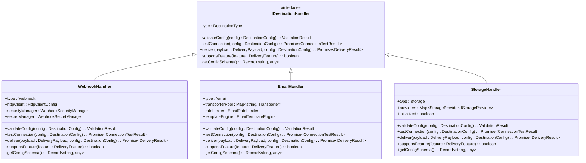

# Audit Delivery System

<cite>
**Referenced Files in This Document**   
- [index.ts](file://packages/audit/src/index.ts)
- [delivery-service.ts](file://packages/audit/src/delivery/delivery-service.ts)
- [destination-manager.ts](file://packages/audit/src/delivery/destination-manager.ts)
- [types.ts](file://packages/audit/src/delivery/types.ts)
- [interfaces.ts](file://packages/audit/src/delivery/interfaces.ts)
- [health-monitor.ts](file://packages/audit/src/delivery/health-monitor.ts)
- [validation/destination-validator.ts](file://packages/audit/src/delivery/validation/destination-validator.ts)
- [validation/connection-tester.ts](file://packages/audit/src/delivery/validation/connection-tester.ts)
- [database-client.ts](file://packages/audit/src/delivery/database-client.ts)
- [handlers/webhook-handler.ts](file://packages/audit/src/delivery/handlers/webhook-handler.ts)
- [handlers/email-handler.ts](file://packages/audit/src/delivery/handlers/email-handler.ts)
- [handlers/storage-handler.ts](file://packages/audit/src/delivery/handlers/storage-handler.ts)
</cite>

## Table of Contents
1. [Introduction](#introduction)
2. [Project Structure](#project-structure)
3. [Core Components](#core-components)
4. [Architecture Overview](#architecture-overview)
5. [Detailed Component Analysis](#detailed-component-analysis)
6. [Dependency Analysis](#dependency-analysis)
7. [Performance Considerations](#performance-considerations)
8. [Troubleshooting Guide](#troubleshooting-guide)
9. [Conclusion](#conclusion)

## Introduction
The Audit Delivery System is a comprehensive solution for managing and delivering audit-related data across various destinations. It provides a robust framework for configuring delivery destinations, validating connections, monitoring health, and ensuring reliable delivery of audit information. The system supports multiple destination types including email, webhook, storage, SFTP, and download links, with extensive validation, security, and monitoring capabilities.

The system is designed with modularity in mind, separating concerns between destination management, delivery orchestration, health monitoring, and validation. It implements industry-standard patterns such as circuit breakers for fault tolerance, retry mechanisms with exponential backoff, and comprehensive monitoring for observability.

## Project Structure
The Audit Delivery System is organized within the `packages/audit` directory, following a modular architecture that separates concerns into distinct components. The core delivery functionality resides in the `src/delivery` directory, which contains specialized modules for different aspects of the delivery process.


**Diagram sources**
- [delivery-service.ts](file://packages/audit/src/delivery/delivery-service.ts)
- [destination-manager.ts](file://packages/audit/src/delivery/destination-manager.ts)
- [health-monitor.ts](file://packages/audit/src/delivery/health-monitor.ts)

**Section sources**
- [delivery-service.ts](file://packages/audit/src/delivery/delivery-service.ts)
- [destination-manager.ts](file://packages/audit/src/delivery/destination-manager.ts)

## Core Components

The Audit Delivery System consists of several core components that work together to provide a comprehensive delivery solution. The main entry point is the `DeliveryService` class, which orchestrates destination management and health monitoring. This service delegates to specialized components like the `DestinationManager` for CRUD operations, the `HealthMonitor` for monitoring destination health, and various handlers for specific destination types.

The system exposes a rich API through the `IDeliveryService` interface, providing methods for creating, updating, and deleting destinations, as well as testing connections and retrieving health information. The `DeliveryDatabaseClient` provides a data access layer that abstracts database operations, while the validation components ensure that destination configurations are correct before they are used.

**Section sources**
- [index.ts](file://packages/audit/src/index.ts)
- [delivery-service.ts](file://packages/audit/src/delivery/delivery-service.ts)
- [types.ts](file://packages/audit/src/delivery/types.ts)

## Architecture Overview

The Audit Delivery System follows a layered architecture with clear separation of concerns. At the top level, the `DeliveryService` acts as the facade for the entire system, exposing a clean API to consumers. Below this, specialized components handle specific responsibilities, communicating through well-defined interfaces.


**Diagram sources**
- [delivery-service.ts](file://packages/audit/src/delivery/delivery-service.ts)
- [destination-manager.ts](file://packages/audit/src/delivery/destination-manager.ts)
- [health-monitor.ts](file://packages/audit/src/delivery/health-monitor.ts)
- [handlers/webhook-handler.ts](file://packages/audit/src/delivery/handlers/webhook-handler.ts)
- [handlers/email-handler.ts](file://packages/audit/src/delivery/handlers/email-handler.ts)
- [handlers/storage-handler.ts](file://packages/audit/src/delivery/handlers/storage-handler.ts)

## Detailed Component Analysis

### Delivery Service Analysis
The `DeliveryService` is the main orchestrator of the Audit Delivery System, implementing the `IDeliveryService` interface. It coordinates between the destination manager, health monitor, and database client to provide a comprehensive delivery solution.

```mermaid
classDiagram
class DeliveryService {
+logger : StructuredLogger
+dbClient : DeliveryDatabaseClient
+destinationManager : IDestinationManager
+healthMonitor : HealthMonitor
+config : DeliveryServiceConfig
+isStarted : boolean
+start() : Promise~void~
+stop() : Promise~void~
+healthCheck() : Promise~{healthy : boolean, details : any}~
+createDestination(input : CreateDeliveryDestinationInput) : Promise~DeliveryDestination~
+updateDestination(id : string, input : UpdateDeliveryDestinationInput) : Promise~DeliveryDestination~
+deleteDestination(id : string) : Promise~void~
+getDestination(id : string) : Promise~DeliveryDestination | null~
+listDestinations(options : DeliveryDestinationListOptions) : Promise~DeliveryDestinationListResponse~
+validateDestination(destination : DeliveryDestination) : Promise~ValidationResult~
+testConnection(destination : DeliveryDestination) : Promise~ConnectionTestResult~
+getDestinationHealth(destinationId : string) : Promise~DestinationHealth | null~
+getUnhealthyDestinations() : Promise~DestinationHealth[]~
+shouldAllowDelivery(destinationId : string) : Promise~boolean~
}
DeliveryService --> DeliveryDatabaseClient : "uses"
DeliveryService --> IDestinationManager : "delegates"
DeliveryService --> HealthMonitor : "controls"
```

**Diagram sources**
- [delivery-service.ts](file://packages/audit/src/delivery/delivery-service.ts)
- [database-client.ts](file://packages/audit/src/delivery/database-client.ts)
- [interfaces.ts](file://packages/audit/src/delivery/interfaces.ts)
- [health-monitor.ts](file://packages/audit/src/delivery/health-monitor.ts)

**Section sources**
- [delivery-service.ts](file://packages/audit/src/delivery/delivery-service.ts)

### Destination Management Analysis
The destination management system provides comprehensive CRUD operations for delivery destinations, with built-in validation and connection testing. The `DestinationManager` class implements the `IDestinationManager` interface, handling all aspects of destination lifecycle management.


**Diagram sources**
- [destination-manager.ts](file://packages/audit/src/delivery/destination-manager.ts)
- [validation/destination-validator.ts](file://packages/audit/src/delivery/validation/destination-validator.ts)
- [validation/connection-tester.ts](file://packages/audit/src/delivery/validation/connection-tester.ts)
- [database-client.ts](file://packages/audit/src/delivery/database-client.ts)

**Section sources**
- [destination-manager.ts](file://packages/audit/src/delivery/destination-manager.ts)

### Health Monitoring Analysis
The health monitoring system tracks the status of delivery destinations and implements circuit breaker patterns to prevent cascading failures. The `HealthMonitor` class periodically checks destination health and updates status based on delivery success and failure rates.


**Diagram sources**
- [health-monitor.ts](file://packages/audit/src/delivery/health-monitor.ts)

**Section sources**
- [health-monitor.ts](file://packages/audit/src/delivery/health-monitor.ts)

### Validation System Analysis
The validation system ensures that destination configurations are correct and connections are viable before they are used for delivery. It consists of two main components: the `DestinationValidator` for configuration validation and the `ConnectionTester` for connectivity testing.

```mermaid
classDiagram
class DestinationValidator {
+validationRules : Record<DestinationType, ValidationRule[]>
+validateDestinationConfig(type : DestinationType, config : DestinationConfig) : Promise~ValidationResult~
+validateTypeSpecific(type : DestinationType, config : any) : Promise~{errors : string[], warnings : string[]}~
+validateWebhookConfig(config : any) : {errors : string[], warnings : string[]}
+validateEmailConfig(config : any) : {errors : string[], warnings : string[]}
+validateStorageConfig(config : any) : {errors : string[], warnings : string[]}
+validateSftpConfig(config : any) : {errors : string[], warnings : string[]}
+validateDownloadConfig(config : any) : {errors : string[], warnings : string[]}
}
class ConnectionTester {
+testConnection(destination : DeliveryDestination) : Promise~ConnectionTestResult~
+testWebhookConnection(destination : DeliveryDestination) : Promise~ConnectionTestResult~
+testEmailConnection(destination : DeliveryDestination) : Promise~ConnectionTestResult~
+testStorageConnection(destination : DeliveryDestination) : Promise~ConnectionTestResult~
+testSftpConnection(destination : DeliveryDestination) : Promise~ConnectionTestResult~
+testDownloadConnection(destination : DeliveryDestination) : Promise~ConnectionTestResult~
}
DestinationValidator --> ValidationRule
ConnectionTester --> DestinationValidator
```

**Diagram sources**
- [validation/destination-validator.ts](file://packages/audit/src/delivery/validation/destination-validator.ts)
- [validation/connection-tester.ts](file://packages/audit/src/delivery/validation/connection-tester.ts)

**Section sources**
- [validation/destination-validator.ts](file://packages/audit/src/delivery/validation/destination-validator.ts)
- [validation/connection-tester.ts](file://packages/audit/src/delivery/validation/connection-tester.ts)

### Database Integration Analysis
The database client provides a data access layer that abstracts database operations for the delivery system. It uses Drizzle ORM to interact with PostgreSQL, providing repositories for different entities like delivery destinations, health status, and logs.

```mermaid
classDiagram
class DeliveryDatabaseClient {
+logger : StructuredLogger
+enhancedClient : EnhancedAuditDatabaseClient
+destinationRepo : DeliveryDestinationRepository
+logRepo : DeliveryLogRepository
+queueRepo : DeliveryQueueRepository
+healthRepo : DestinationHealthRepository
+secretRepo : WebhookSecretRepository
+destinations : IDeliveryDestinationRepository
+logs : IDeliveryLogRepository
+queue : IDeliveryQueueRepository
+health : IDestinationHealthRepository
+secrets : IWebhookSecretRepository
+transaction(callback : (client : DeliveryDatabaseClient) => Promise~T~) : Promise~T~
+getConnection() : Promise~PostgresJsDatabase~
+healthCheck() : Promise~{healthy : boolean, details : any}~
}
DeliveryDatabaseClient --> IDeliveryDestinationRepository
DeliveryDatabaseClient --> IDeliveryLogRepository
DeliveryDatabaseClient --> IDeliveryQueueRepository
DeliveryDatabaseClient --> IDestinationHealthRepository
DeliveryDatabaseClient --> IWebhookSecretRepository
DeliveryDatabaseClient --> EnhancedAuditDatabaseClient
```

**Diagram sources**
- [database-client.ts](file://packages/audit/src/delivery/database-client.ts)

**Section sources**
- [database-client.ts](file://packages/audit/src/delivery/database-client.ts)

### Handler Implementation Analysis
The delivery system implements specialized handlers for different destination types, each implementing the `IDestinationHandler` interface. These handlers encapsulate the logic for delivering content to specific destinations like webhooks, email, and storage.



**Diagram sources**
- [interfaces.ts](file://packages/audit/src/delivery/interfaces.ts)
- [handlers/webhook-handler.ts](file://packages/audit/src/delivery/handlers/webhook-handler.ts)
- [handlers/email-handler.ts](file://packages/audit/src/delivery/handlers/email-handler.ts)
- [handlers/storage-handler.ts](file://packages/audit/src/delivery/handlers/storage-handler.ts)

**Section sources**
- [handlers/webhook-handler.ts](file://packages/audit/src/delivery/handlers/webhook-handler.ts)
- [handlers/email-handler.ts](file://packages/audit/src/delivery/handlers/email-handler.ts)
- [handlers/storage-handler.ts](file://packages/audit/src/delivery/handlers/storage-handler.ts)

## Dependency Analysis

The Audit Delivery System has a well-defined dependency structure that promotes loose coupling and high cohesion. The main service depends on specialized components through interfaces, allowing for easy testing and replacement of implementations.


**Diagram sources**
- [delivery-service.ts](file://packages/audit/src/delivery/delivery-service.ts)
- [database-client.ts](file://packages/audit/src/delivery/database-client.ts)
- [destination-manager.ts](file://packages/audit/src/delivery/destination-manager.ts)
- [health-monitor.ts](file://packages/audit/src/delivery/health-monitor.ts)
- [handlers/webhook-handler.ts](file://packages/audit/src/delivery/handlers/webhook-handler.ts)
- [handlers/email-handler.ts](file://packages/audit/src/delivery/handlers/email-handler.ts)
- [handlers/storage-handler.ts](file://packages/audit/src/delivery/handlers/storage-handler.ts)

**Section sources**
- [delivery-service.ts](file://packages/audit/src/delivery/delivery-service.ts)
- [database-client.ts](file://packages/audit/src/delivery/database-client.ts)

## Performance Considerations

The Audit Delivery System incorporates several performance optimizations to ensure efficient operation at scale. The email handler uses connection pooling to reduce the overhead of establishing SMTP connections, while the storage handler supports batch operations for improved throughput. The health monitor uses configurable intervals to balance monitoring frequency with system load, and the circuit breaker pattern prevents cascading failures that could impact overall system performance.

The system also implements rate limiting for email delivery to prevent overwhelming external services, and uses efficient database queries with proper indexing to minimize latency. The validation system is designed to fail fast, identifying configuration issues before they can impact delivery operations.

## Troubleshooting Guide

When troubleshooting issues with the Audit Delivery System, start by checking the health status of delivery destinations using the `getDestinationHealth` method. Unhealthy destinations may be automatically disabled by the health monitor if they exceed failure thresholds. For connection issues, use the `testConnection` method to verify that destination configurations are correct and accessible.

For delivery failures, check the delivery logs to identify the specific error. The system distinguishes between retryable and non-retryable errors, with network issues and server errors typically being retryable while authentication failures are not. If deliveries are being blocked by the circuit breaker, wait for the timeout period to expire or manually enable the destination.

When configuring new destinations, ensure that all required fields are provided and that credentials are correct. The validation system will catch many configuration issues before they cause delivery failures. For webhook destinations, verify that the endpoint is accessible and that any required authentication is properly configured.

**Section sources**
- [health-monitor.ts](file://packages/audit/src/delivery/health-monitor.ts)
- [destination-manager.ts](file://packages/audit/src/delivery/destination-manager.ts)
- [validation/destination-validator.ts](file://packages/audit/src/delivery/validation/destination-validator.ts)
- [validation/connection-tester.ts](file://packages/audit/src/delivery/validation/connection-tester.ts)

## Conclusion

The Audit Delivery System provides a comprehensive solution for managing and delivering audit information to various destinations. Its modular architecture, with clear separation of concerns, makes it easy to maintain and extend. The system's robust validation, monitoring, and error handling capabilities ensure reliable delivery of audit data while providing visibility into system health and performance.

By implementing industry-standard patterns like circuit breakers and connection pooling, the system is well-equipped to handle the challenges of distributed systems. Its support for multiple destination types and extensible handler architecture makes it adaptable to a wide range of use cases, from simple email notifications to complex integration with external systems.