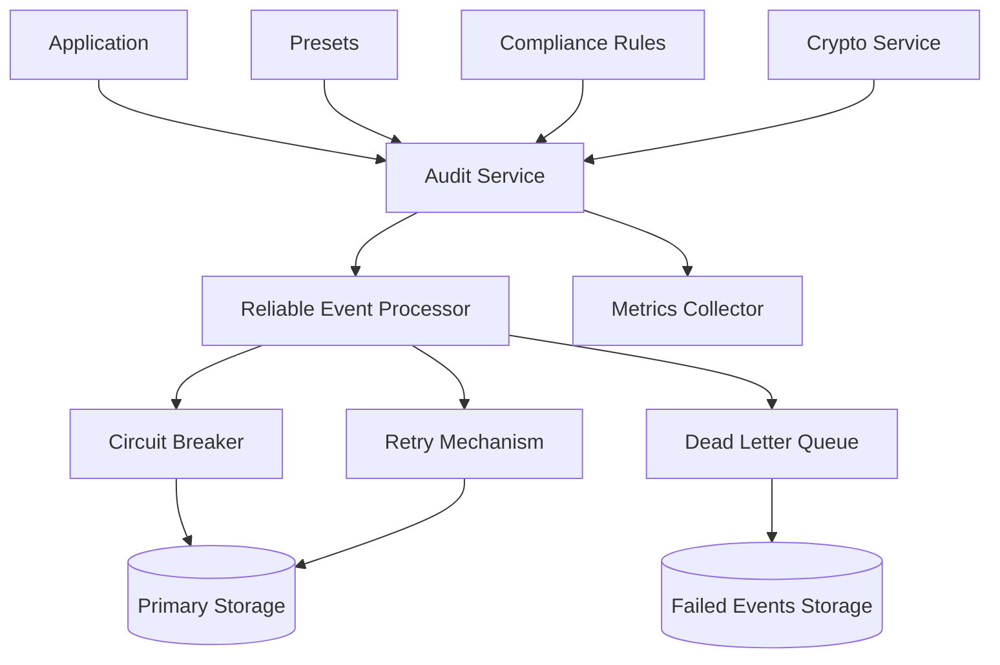
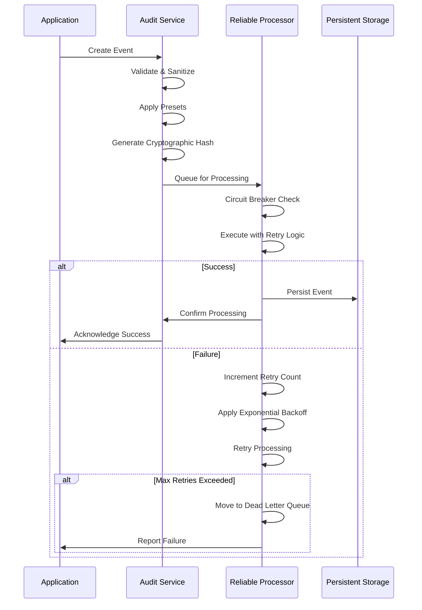
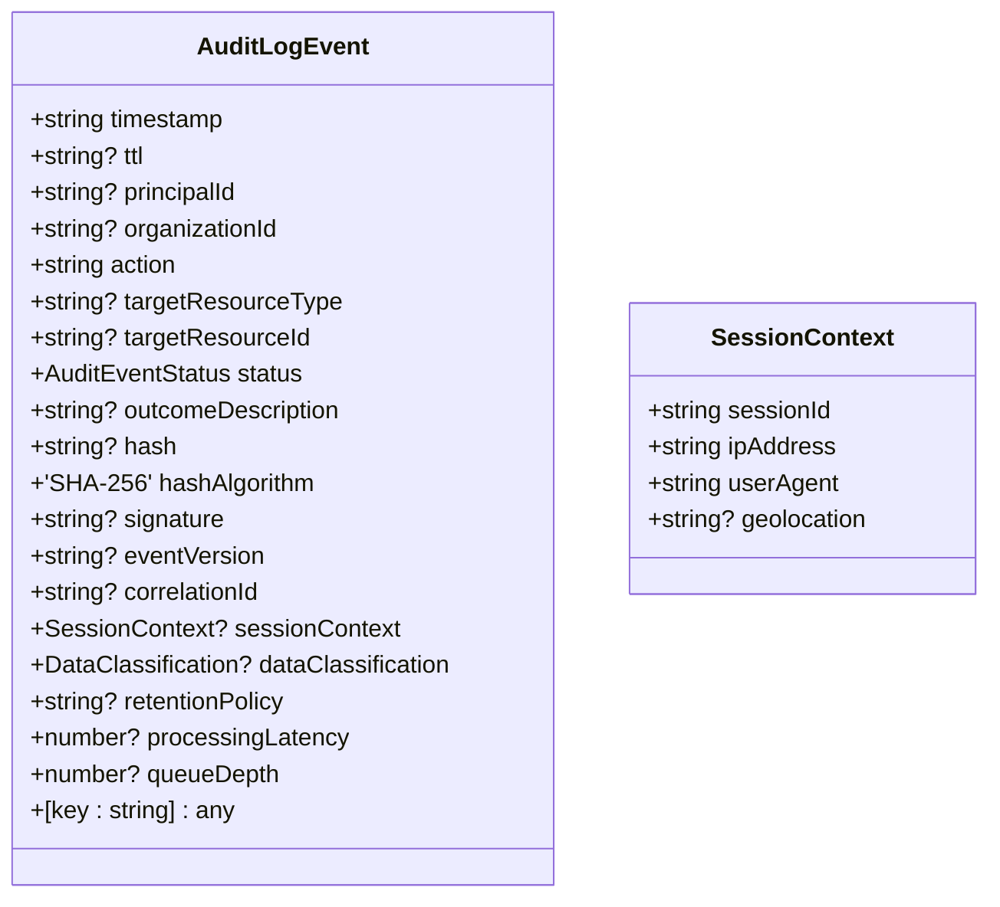
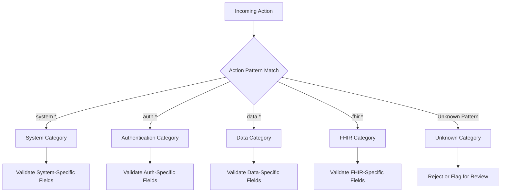
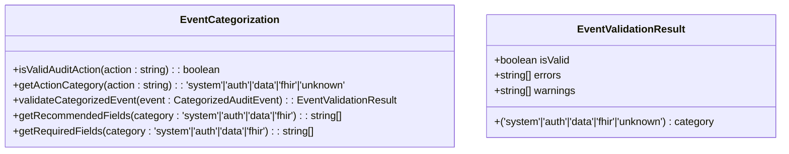
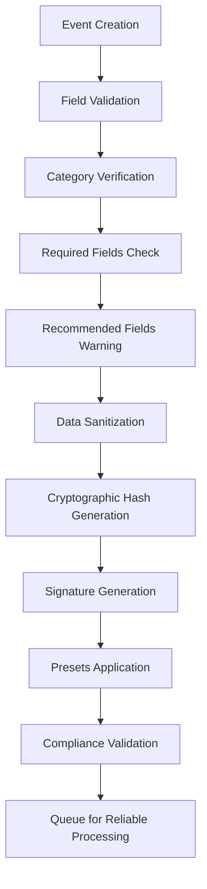
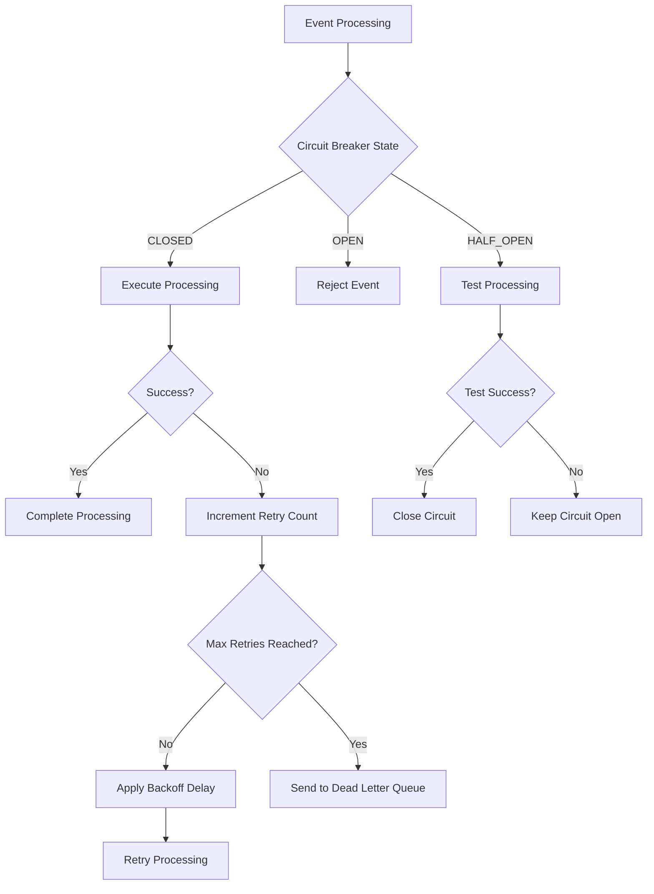
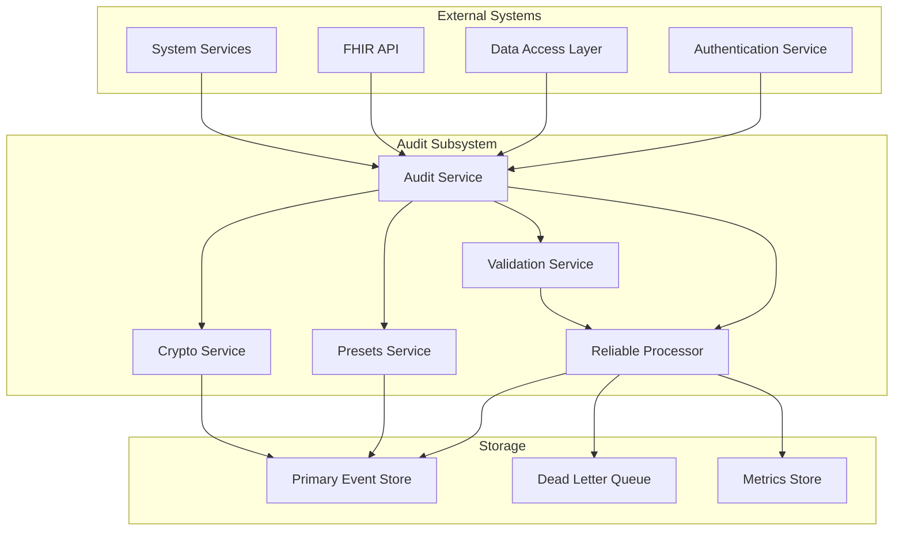

# Audit Event Processing

<cite>
**Referenced Files in This Document**   
- [audit.ts](file://packages/audit/src/audit.ts)
- [event-categorization.ts](file://packages/audit/src/event/event-categorization.ts)
- [event-types.ts](file://packages/audit/src/event/event-types.ts)
- [types.ts](file://packages/audit/src/types.ts)
- [reliable-processor.ts](file://packages/audit/src/queue/reliable-processor.ts)
- [preset-types.ts](file://packages/audit/src/preset/preset-types.ts)
- [audit-preset.ts](file://packages/audit/src/preset/audit-preset.ts)
</cite>

## Table of Contents
1. [Introduction](#introduction)
2. [Architecture Overview](#architecture-overview)
3. [Event Lifecycle](#event-lifecycle)
4. [Domain Models](#domain-models)
5. [Categorization Mechanisms](#categorization-mechanisms)
6. [Processing Rules](#processing-rules)
7. [Error Handling Strategies](#error-handling-strategies)
8. [Integration Points](#integration-points)

## Introduction
The Audit Event Processing subsystem provides a robust framework for capturing, validating, and persisting audit events across the system. It ensures data integrity, supports compliance requirements, and enables reliable event delivery through a comprehensive processing pipeline. This documentation details the architecture, domain models, and operational mechanics of the audit system.

## Architecture Overview



**Diagram sources**
- [audit.ts](file://packages/audit/src/audit.ts#L1-L906)
- [reliable-processor.ts](file://packages/audit/src/queue/reliable-processor.ts#L1-L538)

**Section sources**
- [audit.ts](file://packages/audit/src/audit.ts#L1-L906)
- [reliable-processor.ts](file://packages/audit/src/queue/reliable-processor.ts#L1-L538)

## Event Lifecycle



**Diagram sources**
- [audit.ts](file://packages/audit/src/audit.ts#L1-L906)
- [reliable-processor.ts](file://packages/audit/src/queue/reliable-processor.ts#L1-L538)

**Section sources**
- [audit.ts](file://packages/audit/src/audit.ts#L1-L906)
- [reliable-processor.ts](file://packages/audit/src/queue/reliable-processor.ts#L1-L538)

## Domain Models

### Audit Event Base Structure


**Diagram sources**
- [types.ts](file://packages/audit/src/types.ts#L1-L286)

### Categorized Event Types
```mermaid
classDiagram
AuditLogEvent <|-- SystemAuditEvent
AuditLogEvent <|-- AuthAuditEvent
AuditLogEvent <|-- DataAuditEvent
AuditLogEvent <|-- FHIRAuditEvent
class SystemAuditEvent {
+string category
+SystemAuditAction action
+string? systemComponent
+Record~string, {old : any, new : any}~? configurationChanges
+{type : 'scheduled'|'emergency'|'routine', duration? : number, affectedServices? : string[]}? maintenanceDetails
+{type : 'full'|'incremental'|'differential', size? : number, location? : string}? backupDetails
}
class AuthAuditEvent {
+string category
+AuthAuditAction action
+('password'|'mfa'|'sso'|'api_key'|'oauth')? authMethod
+string? failureReason
+number? sessionDuration
+{method : 'totp'|'sms'|'email'|'hardware', verified : boolean}? mfaDetails
+{complexity : boolean, length : boolean, history : boolean}? passwordPolicy
}
class DataAuditEvent {
+string category
+DataAuditAction action
+string? dataType
+number? recordCount
+number? dataSize
+('json'|'csv'|'xml'|'pdf')? exportFormat
+string? shareRecipient
+('pseudonymization'|'generalization'|'suppression')? anonymizationMethod
+{filters? : Record~string, any~, sortBy? : string, limit? : number, offset? : number}? queryDetails
}
class FHIRAuditEvent {
+string category
+FHIRAuditAction action
+string? fhirResourceType
+string? fhirResourceId
+string? fhirVersion
+('document'|'message'|'transaction'|'batch'|'collection')? bundleType
+number? bundleSize
+{severity : 'information'|'warning'|'error'|'fatal', code : string, details? : string}? operationOutcome
+string? patientId
+string? practitionerId
}
```

**Diagram sources**
- [event-types.ts](file://packages/audit/src/event/event-types.ts#L1-L309)
- [types.ts](file://packages/audit/src/types.ts#L1-L286)

**Section sources**
- [event-types.ts](file://packages/audit/src/event/event-types.ts#L1-L309)
- [types.ts](file://packages/audit/src/types.ts#L1-L286)

## Categorization Mechanisms

### Action Category Mapping


**Diagram sources**
- [event-categorization.ts](file://packages/audit/src/event/event-categorization.ts#L1-L383)

### Category Validation Rules


**Diagram sources**
- [event-categorization.ts](file://packages/audit/src/event/event-categorization.ts#L1-L383)

**Section sources**
- [event-categorization.ts](file://packages/audit/src/event/event-categorization.ts#L1-L383)

## Processing Rules

### Event Processing Pipeline


**Diagram sources**
- [audit.ts](file://packages/audit/src/audit.ts#L1-L906)
- [validation.js](file://packages/audit/src/validation.js)

### Preset Configuration Model
```mermaid
classDiagram
class AuditPreset {
+string name
+string? description
+string organizationId
+string action
+DataClassification dataClassification
+string[] requiredFields
+Record~string, any~? defaultValues
+Partial~ValidationConfig~? validation
}
class PresetHandler {
+getPresets(organizationId? : string) : Promise~(AuditPreset & {id? : string})[]~
+getPreset(name : string, organizationId? : string) : Promise~(AuditPreset & {id? : string}) | null~
+createPreset(preset : AuditPreset & {createdBy : string}) : Promise~AuditPreset & {id? : string}~
+updatePreset(preset : AuditPreset & {id : string, updatedBy : string}) : Promise~AuditPreset & {id? : string}~
+deletePreset(name : string, organizationId : string) : Promise~{success : true}~
}
```

**Diagram sources**
- [preset-types.ts](file://packages/audit/src/preset/preset-types.ts#L1-L17)
- [audit-preset.ts](file://packages/audit/src/preset/audit-preset.ts#L1-L15)

**Section sources**
- [preset-types.ts](file://packages/audit/src/preset/preset-types.ts#L1-L17)
- [audit-preset.ts](file://packages/audit/src/preset/audit-preset.ts#L1-L15)

## Error Handling Strategies

### Reliability Components Architecture
```mermaid
classDiagram
class ReliableEventProcessor {
+Queue~T~ queue
+Worker~T~? worker
+CircuitBreaker circuitBreaker
+DeadLetterHandler deadLetterHandler
+ProcessorMetricsCollector metricsCollector
+boolean isRunning
+number[] processingTimes
+start() : Promise~void~
+stop() : Promise~void~
+addEvent(event : T, options : {priority? : number, delay? : number}) : Promise~void~
+processJobWithReliability(job : Job~T~) : Promise~void~
+getMetrics() : Promise~ProcessorMetrics~
+getHealthStatus() : Promise~any~
}
class CircuitBreaker {
+execute(operation : Function) : Promise~any~
+getState() : 'OPEN'|'CLOSED'|'HALF_OPEN'
+getMetrics() : any
}
class DeadLetterHandler {
+addFailedEvent(event : any, error : Error, jobId : string, queueName : string, attempts : any[]) : Promise~void~
+startWorker() : void
+stopWorker() : Promise~void~
+getMetrics() : Promise~any~
}
class ProcessorMetricsCollector {
+recordTotalProcessed() : Promise~void~
+recordSuccessfullyProcessed() : Promise~void~
+recordFailedProcessed() : Promise~void~
+recordRetriedEvents() : Promise~void~
+recordDeadLetterEvents() : Promise~void~
+recordCircuitBreakerTrips() : Promise~void~
+recordQueueDepth(depth : number) : Promise~void~
+getMetrics() : Promise~ProcessorMetrics~
}
ReliableEventProcessor --> CircuitBreaker
ReliableEventProcessor --> DeadLetterHandler
ReliableEventProcessor --> ProcessorMetricsCollector
```

**Diagram sources**
- [reliable-processor.ts](file://packages/audit/src/queue/reliable-processor.ts#L1-L538)

### Error Handling Workflow


**Diagram sources**
- [reliable-processor.ts](file://packages/audit/src/queue/reliable-processor.ts#L1-L538)

**Section sources**
- [reliable-processor.ts](file://packages/audit/src/queue/reliable-processor.ts#L1-L538)

## Integration Points

### System Integration Architecture


**Diagram sources**
- [audit.ts](file://packages/audit/src/audit.ts#L1-L906)
- [reliable-processor.ts](file://packages/audit/src/queue/reliable-processor.ts#L1-L538)

### API Integration Methods
```mermaid
classDiagram
class Audit {
+log(eventDetails : Omit~AuditLogEvent, 'timestamp'~ options? : LogOptions) : Promise~void~
+logWithEnhancements(eventDetails : Omit~AuditLogEvent, 'timestamp'~ options? : EnhancedLogOptions) : Promise~void~
+logFHIR(details : FHIRLogDetails) : Promise~void~
+logAuth(details : AuthLogDetails) : Promise~void~
+logSystem(details : SystemLogDetails) : Promise~void~
+logData(details : DataLogDetails) : Promise~void~
+generateEventHash(event : AuditLogEvent) : string
+verifyEventHash(event : AuditLogEvent, expectedHash : string) : boolean
+generateEventSignature(event : AuditLogEvent) : string
+verifyEventSignature(event : AuditLogEvent, signature : string) : boolean
}
class LogOptions {
+boolean? generateHash
+boolean? generateSignature
+string? correlationId
+string? eventVersion
+boolean? skipValidation
+ValidationConfig? validationConfig
}
class EnhancedLogOptions {
+string? preset
+string[]? compliance
+boolean? skipValidation
}
class FHIRLogDetails {
+string principalId
+string action
+string resourceType
+string resourceId
+('attempt'|'success'|'failure') status
+string? outcomeDescription
+string? organizationId
+any? sessionContext
+{version? : string, interaction? : string, compartment? : string}? fhirContext
}
class AuthLogDetails {
+string? principalId
+string? organizationId
+('login'|'logout'|'password_change'|'mfa_enable'|'mfa_disable'|'account'|'session'|'permission') action
+('attempt'|'success'|'failure') status
+any? sessionContext
+string? reason
}
class SystemLogDetails {
+string action
+('attempt'|'success'|'failure') status
+string? component
+string? outcomeDescription
+any? systemContext
}
class DataLogDetails {
+string principalId
+string? organizationId
+('create'|'read'|'update'|'delete'|'export'|'import'|'pseudonymize') action
+string resourceType
+string resourceId
+('attempt'|'success'|'failure') status
+('PUBLIC'|'INTERNAL'|'CONFIDENTIAL'|'PHI')? dataClassification
+any? changes
+string? outcomeDescription
+any? exportResult
+any? metadata
}
```

**Diagram sources**
- [audit.ts](file://packages/audit/src/audit.ts#L1-L906)

**Section sources**
- [audit.ts](file://packages/audit/src/audit.ts#L1-L906)