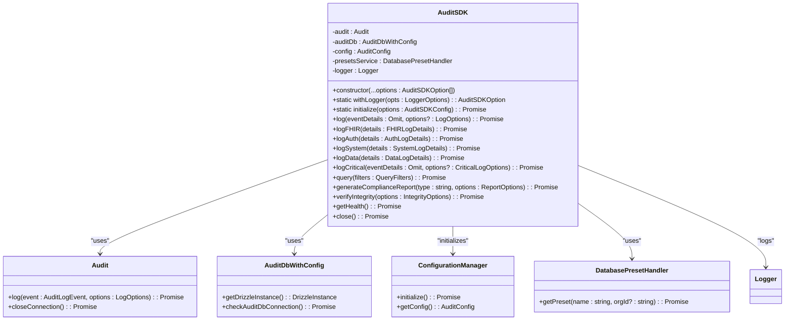
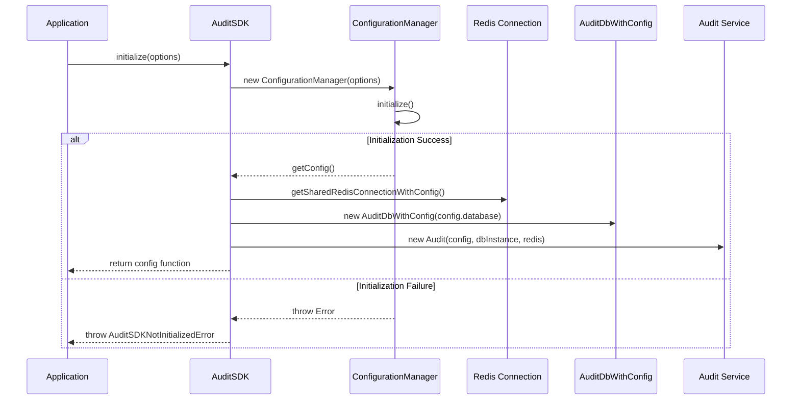
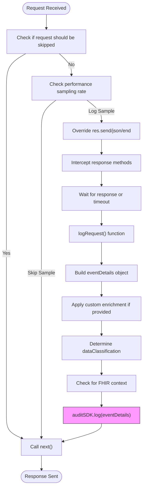
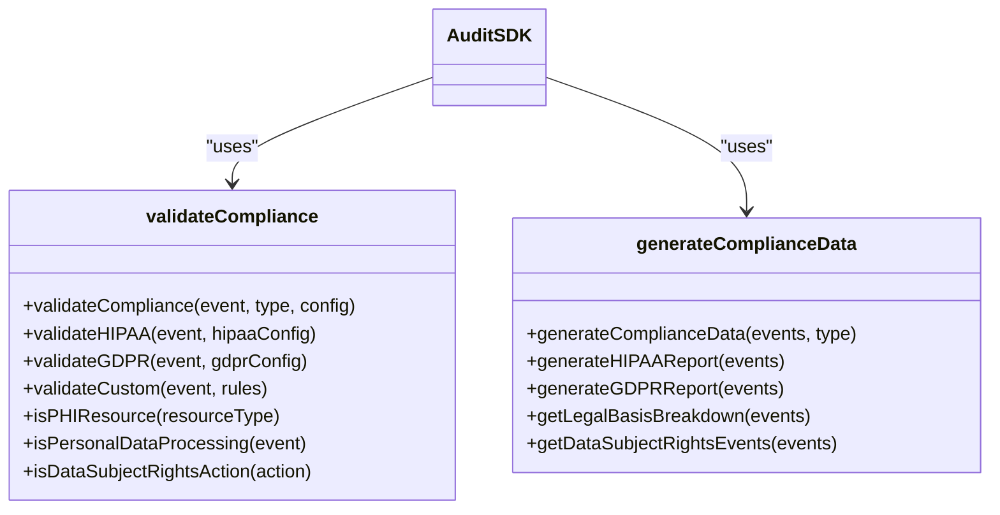

# Audit SDK

<cite>
**Referenced Files in This Document**   
- [sdk.ts](file://packages/audit-sdk/src/sdk.ts)
- [types.ts](file://packages/audit-sdk/src/types.ts)
- [compliance.ts](file://packages/audit-sdk/src/compliance.ts)
- [middleware.ts](file://packages/audit-sdk/src/middleware.ts)
- [basic-usage.ts](file://packages/audit-sdk/examples/basic-usage.ts)
- [express-integration.ts](file://packages/audit-sdk/examples/express-integration.ts)
</cite>

## Table of Contents
1. [Introduction](#introduction)
2. [Core Components](#core-components)
3. [Configuration Options](#configuration-options)
4. [Middleware System](#middleware-system)
5. [Compliance Module](#compliance-module)
6. [Usage Patterns](#usage-patterns)
7. [Error Handling](#error-handling)
8. [Troubleshooting Guide](#troubleshooting-guide)

## Introduction
The Audit SDK serves as the primary integration point for applications to emit audit events in a secure, compliant, and standardized manner. It abstracts the complexity of audit logging by providing a high-level interface with built-in support for regulatory compliance (GDPR, HIPAA), security features, and healthcare-specific operations (FHIR). The SDK integrates seamlessly with various frameworks and supports both programmatic event emission and automatic request logging via middleware.

The Audit SDK is designed for applications requiring robust audit trails with integrity verification, data classification, and compliance reporting. It connects to backend services for event storage, monitoring, and archival, ensuring durability and traceability of all system activities.

**Section sources**
- [sdk.ts](file://packages/audit-sdk/src/sdk.ts#L1-L20)

## Core Components

### AuditSDK Class
The `AuditSDK` class is the central component that orchestrates audit event creation, validation, and transmission. It encapsulates configuration management, connection handling, and compliance logic.



**Diagram sources**
- [sdk.ts](file://packages/audit-sdk/src/sdk.ts#L36-L84)

**Section sources**
- [sdk.ts](file://packages/audit-sdk/src/sdk.ts#L36-L84)

## Configuration Options

### AuditSDKConfig Interface
The SDK accepts configuration through the `AuditSDKConfig` interface, which defines how the SDK initializes its dependencies.

```typescript
export interface AuditSDKConfig {
	/** Config Path */
	configPath: string
	/** Storage type */
	storageType: 's3' | 'file'
}
```

### Initialization Process
The SDK uses a static `initialize` method that returns a configuration function to be passed to the constructor. This pattern enables asynchronous setup of dependencies like configuration managers, Redis connections, and database clients.



**Diagram sources**
- [sdk.ts](file://packages/audit-sdk/src/sdk.ts#L80-L124)

**Section sources**
- [sdk.ts](file://packages/audit-sdk/src/sdk.ts#L80-L124)

## Middleware System

### Request Augmentation and Security
The middleware system automatically captures HTTP requests and converts them into audit events with enriched context including session data, API details, and performance metrics.



**Diagram sources**
- [middleware.ts](file://packages/audit-sdk/src/middleware.ts#L7-L115)

**Section sources**
- [middleware.ts](file://packages/audit-sdk/src/middleware.ts#L7-L115)

### Middleware Options
The `createAuditMiddleware` function accepts optional configuration through `MiddlewareOptions`:

```typescript
export interface MiddlewareOptions {
	/** Skip certain routes or patterns */
	skip?: (req: any) => boolean
	/** Custom event enrichment */
	enrich?: (req: any, res: any, event: any) => any
	/** Error handling */
	onError?: (error: Error, req: any, res: any) => void
	/** Performance settings */
	performance?: {
		sampleRate?: number
		maxLatency?: number
	}
}
```

#### Data Classification Rules
The middleware automatically classifies data based on route patterns:

| Route Pattern | Data Classification |
|---------------|---------------------|
| `/fhir/`, `/patient/`, `/health/` | PHI |
| `/admin/`, `/config/` | CONFIDENTIAL |
| `/auth/`, `/login/`, `/user/` | INTERNAL |
| `/public/`, `/docs/`, `/health-check/` | PUBLIC |

**Section sources**
- [middleware.ts](file://packages/audit-sdk/src/middleware.ts#L200-L250)

## Compliance Module

### GDPR/HIPAA-Specific Operations
The compliance module provides validation and reporting capabilities for regulatory requirements. It automatically enforces field requirements, retention policies, and legal basis checks.



**Diagram sources**
- [compliance.ts](file://packages/audit-sdk/src/compliance.ts#L7-L297)

**Section sources**
- [compliance.ts](file://packages/audit-sdk/src/compliance.ts#L7-L297)

### HIPAA Validation Rules
When HIPAA compliance is enabled, the validator enforces:
- Required fields: `principalId`, `action`, `targetResourceType`, `targetResourceId`, `timestamp`, `sessionContext`
- PHI resources must have `dataClassification: 'PHI'`
- PHI access events must include `sessionContext`
- Automatic retention policy assignment (`hipaa-6-years` by default)

### GDPR Validation Rules
When GDPR compliance is enabled, the validator enforces:
- Automatic retention policy assignment (`gdpr-365-days` by default)
- Legal basis required for personal data processing
- Data subject ID required for rights-related actions (export, delete, etc.)
- Automatic classification of personal data processing events

**Section sources**
- [compliance.ts](file://packages/audit-sdk/src/compliance.ts#L50-L150)

## Usage Patterns

### Standalone Usage
The SDK can be used directly to emit audit events with various specialized methods:

```typescript
import { AuditSDK } from '@repo/audit-sdk'

// Initialize SDK
const initFunction = await AuditSDK.initialize({
  configPath: './config',
  storageType: 'file'
})
const auditSDK = new AuditSDK(initFunction)

// Log different types of events
await auditSDK.log({
  principalId: 'user-123',
  action: 'user.login',
  status: 'success',
  outcomeDescription: 'User logged in successfully'
})

await auditSDK.logFHIR({
  principalId: 'dr-smith',
  action: 'read',
  resourceType: 'Patient',
  resourceId: 'pat-789',
  status: 'success'
})

await auditSDK.logAuth({
  principalId: 'user-123',
  action: 'login',
  status: 'success'
})
```

**Section sources**
- [basic-usage.ts](file://packages/audit-sdk/examples/basic-usage.ts)

### Framework Integration (Express.js)
The SDK provides middleware for automatic request logging:

```typescript
import express from 'express'
import { createAuditMiddleware } from '@repo/audit-sdk'

const app = express()

// Add audit middleware
app.use(createAuditMiddleware(auditSDK, {
  skip: (req) => req.path === '/health',
  enrich: (req, res, event) => ({
    ...event,
    customField: req.headers['x-custom-header']
  }),
  performance: {
    sampleRate: 0.1, // 10% sampling
    maxLatency: 5000 // Skip if >5s
  }
}))
```

**Section sources**
- [express-integration.ts](file://packages/audit-sdk/examples/express-integration.ts)

## Error Handling

### SDK Error Types
The SDK defines two primary error classes:

```typescript
export class AuditSDKNotInitializedError extends Error {
	constructor(message = 'AuditSDK has not been initialized.') {
		super(message)
		this.name = 'AuditSDKNotInitializedError'
	}
}

export class AuditSDKError extends Error {
	constructor(
		message: string,
		public readonly cause?: unknown
	) {
		super(message)
		this.name = 'AuditSDKError'
	}
}
```

### Error Scenarios and Recovery
| Error Type | Cause | Recommended Action |
|-----------|------|-------------------|
| AuditSDKNotInitializedError | Configuration manager failed to initialize | Check config path and storage availability |
| AuditSDKError | Audit service not initialized | Ensure SDK was properly initialized before use |
| AuditSDKError | Database not configured | Provide valid database configuration |
| Compliance Validation Error | Missing required fields or invalid data | Fix event data before retrying |
| Network Failure | Redis or database connection issue | Implement retry logic with exponential backoff |

**Section sources**
- [sdk.ts](file://packages/audit-sdk/src/sdk.ts#L20-L35)

## Troubleshooting Guide

### Common Integration Issues
**Issue**: `AuditSDKNotInitializedError` during initialization  
**Cause**: Configuration manager cannot load configuration from specified path  
**Solution**: Verify `configPath` exists and is accessible, check file permissions

**Issue**: Events not being logged  
**Cause**: Audit service not properly initialized in SDK instance  
**Solution**: Ensure the initialization function is passed to the constructor

**Issue**: High memory usage with middleware  
**Cause**: Response interception creating closures for every request  
**Solution**: Use `performance.sampleRate` to sample requests, or disable middleware on high-volume endpoints

**Issue**: HIPAA compliance validation failures  
**Cause**: Missing required fields for PHI access  
**Solution**: Ensure all PHI-related events include `sessionContext` and proper `dataClassification`

**Issue**: Slow request processing with middleware  
**Cause**: Synchronous operations in `enrich` function or network latency to audit service  
**Solution**: Make enrichment logic asynchronous, implement circuit breaker pattern

### Network Failure Recovery
The SDK should be used with resilience patterns:

```typescript
import { circuitBreaker } from '@repo/audit'

const resilientLog = circuitBreaker(async (eventDetails) => {
  await auditSDK.log(eventDetails)
}, {
  threshold: 5,
  interval: 30000,
  fallback: (error, eventDetails) => {
    console.warn('Audit logging failed, storing locally:', error)
    // Store in local queue for later retry
  }
})
```

**Section sources**
- [sdk.ts](file://packages/audit-sdk/src/sdk.ts#L126-L150)
- [compliance.ts](file://packages/audit-sdk/src/compliance.ts#L50-L150)