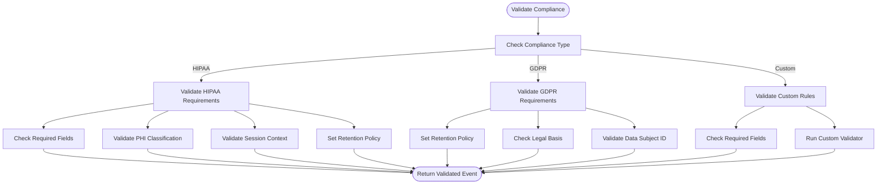
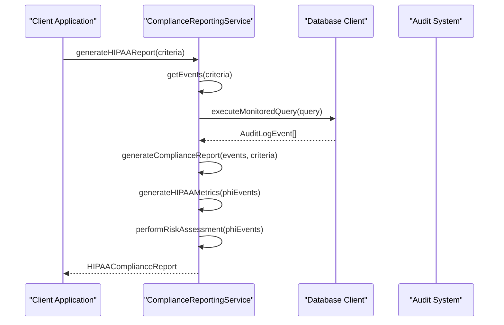

# Compliance Module

<cite>
**Referenced Files in This Document**   
- [compliance.ts](file://packages/audit-sdk/src/compliance.ts)
- [types.ts](file://packages/audit-sdk/src/types.ts)
- [gdpr-compliance.ts](file://packages/audit/src/gdpr/gdpr-compliance.ts)
- [compliance.test.ts](file://packages/audit-sdk/src/__tests__/compliance.test.ts)
- [compliance-reporting.ts](file://packages/audit/src/report/compliance-reporting.ts)
</cite>

## Table of Contents
1. [Introduction](#introduction)
2. [Core Compliance Framework](#core-compliance-framework)
3. [GDPR Implementation](#gdpr-implementation)
4. [HIPAA Implementation](#hipaa-implementation)
5. [Compliance Reporting](#compliance-reporting)
6. [Data Subject Rights Handling](#data-subject-rights-handling)
7. [Technical Safeguards](#technical-safeguards)
8. [Test Cases and Validation](#test-cases-and-validation)
9. [Integration with Core SDK](#integration-with-core-sdk)
10. [Compliance Challenges](#compliance-challenges)

## Introduction
The Compliance Module provides a comprehensive framework for implementing regulatory compliance requirements within the audit logging system. This module specifically addresses GDPR (General Data Protection Regulation) and HIPAA (Health Insurance Portability and Accountability Act) compliance, offering features for data subject access requests, right to erasure operations, protected health information (PHI) logging controls, and compliance reporting. The implementation ensures that audit events meet regulatory requirements through validation, retention policies, and technical safeguards.

**Section sources**
- [compliance.ts](file://packages/audit-sdk/src/compliance.ts#L0-L298)
- [gdpr-compliance.ts](file://packages/audit/src/gdpr/gdpr-compliance.ts#L0-L686)

## Core Compliance Framework

The compliance framework is built around a modular validation system that supports multiple regulatory standards. The core functionality is implemented in the `validateCompliance` function, which serves as the entry point for compliance validation across different regulatory frameworks.



**Diagram sources**
- [compliance.ts](file://packages/audit-sdk/src/compliance.ts#L4-L199)

**Section sources**
- [compliance.ts](file://packages/audit-sdk/src/compliance.ts#L4-L199)
- [types.ts](file://packages/audit-sdk/src/types.ts#L10-L50)

## GDPR Implementation

### GDPR Compliance Configuration
The GDPR implementation provides configurable options for compliance requirements through the `ComplianceConfig` interface. Key configuration options include:

:enabled: Boolean flag to enable GDPR compliance features
:defaultLegalBasis: Default legal basis for personal data processing when not specified
:retentionDays: Default retention period for GDPR-regulated data

```mermaid
classDiagram
class GDPRComplianceService {
+exportUserData(request) Promise~GDPRDataExport~
+pseudonymizeUserData(principalId, strategy, requestedBy) Promise~{pseudonymId, recordsAffected}~
+applyRetentionPolicies() Promise~ArchivalResult[]~
+deleteUserDataWithAuditTrail(principalId, requestedBy, preserveComplianceAudits) Promise~{recordsDeleted, complianceRecordsPreserved}~
-generateRequestId() string
-generatePseudonymId(originalId, strategy) string
-formatExportData(auditLogs, format, includeMetadata) Promise~Buffer~
-logGDPRActivity(event) Promise~void~
}
class GDPRDataExportRequest {
+principalId : string
+organizationId : string
+requestType : DataSubjectRightType
+format : GDPRExportFormat
+dateRange? : {start : string, end : string}
+includeMetadata? : boolean
+requestedBy : string
+requestTimestamp : string
}
class GDPRDataExport {
+requestId : string
+principalId : string
+organizationId : string
+exportTimestamp : string
+format : GDPRExportFormat
+recordCount : number
+dataSize : number
+data : Buffer
+metadata : {dateRange : {start : string, end : string}, categories : string[], retentionPolicies : string[], exportedBy : string}
}
GDPRComplianceService --> GDPRDataExportRequest : "uses"
GDPRComplianceService --> GDPRDataExport : "returns"
```

**Diagram sources**
- [gdpr-compliance.ts](file://packages/audit/src/gdpr/gdpr-compliance.ts#L30-L686)

**Section sources**
- [gdpr-compliance.ts](file://packages/audit/src/gdpr/gdpr-compliance.ts#L30-L686)
- [types.ts](file://packages/audit-sdk/src/types.ts#L10-L50)

### Data Subject Access Requests
The GDPR implementation supports data subject access requests through the `exportUserData` method, which retrieves and formats audit data for a specific user. The process involves:

1. Building query conditions based on the request parameters
2. Executing database queries with monitoring and caching
3. Collecting metadata about the exported data
4. Formatting the data according to the requested format (JSON, CSV, or XML)
5. Logging the export activity for audit trail purposes

The implementation ensures that data exports are comprehensive and include all relevant audit events while maintaining data integrity and security.

### Right to Erasure Operations
The right to erasure is implemented through two primary methods: pseudonymization and deletion. The `pseudonymizeUserData` method replaces identifiable information with pseudonyms while maintaining referential integrity, allowing for continued audit trail functionality without exposing personal data.

The `deleteUserDataWithAuditTrail` method implements a more comprehensive approach that preserves compliance-critical audit records while removing non-essential personal data. This method identifies compliance-critical actions (such as authentication events and GDPR operations) and either pseudonymizes or preserves these records while deleting other user data.

## HIPAA Implementation

### Protected Health Information (PHI) Logging Controls
The HIPAA implementation enforces strict controls on PHI logging through comprehensive validation rules. The `validateHIPAA` function ensures that all PHI-related events include required fields and proper classification.

:requiredFields: Array of fields that must be present in HIPAA-compliant events
:dataClassification: Must be set to "PHI" for events involving protected health information
:sessionContext: Required for all PHI access events to provide audit trail context
:retentionPolicy: Automatically set for PHI events based on organizational policy

The implementation includes a comprehensive list of resource types that contain PHI, including Patient, Observation, Condition, Procedure, and other healthcare-specific entities. When an event involves one of these resource types, the system enforces PHI-specific validation rules.

### PHI Event Validation
The HIPAA validation process follows a multi-step approach to ensure compliance:

1. Check for required fields in the audit event
2. Validate that PHI resources have the appropriate data classification
3. Ensure that session context is provided for PHI access events
4. Apply appropriate retention policies for PHI data

The validation is performed in the `validateHIPAA` function, which throws descriptive error messages when compliance requirements are not met. This ensures that non-compliant events are rejected before being logged to the audit system.

## Compliance Reporting

### Report Generation Framework
The compliance reporting system provides a flexible framework for generating regulatory reports. The `ComplianceReportingService` class implements methods for generating HIPAA, GDPR, and general compliance reports based on configurable criteria.



**Diagram sources**
- [compliance-reporting.ts](file://packages/audit/src/report/compliance-reporting.ts#L200-L600)

**Section sources**
- [compliance-reporting.ts](file://packages/audit/src/report/compliance-reporting.ts#L200-L600)
- [compliance.ts](file://packages/audit-sdk/src/compliance.ts#L200-L298)

### Report Criteria and Filtering
The reporting system supports comprehensive filtering through the `ReportCriteria` interface, which allows users to specify:

:dateRange: Start and end dates for the report period
:principalIds: Filter by specific users or principals
:organizationIds: Filter by organization
:actions: Filter by specific actions
:dataClassifications: Filter by data classification levels
:statuses: Filter by event status (attempt, success, failure)
:resourceTypes: Filter by resource types
:limit: Maximum number of events to include
:offset: Offset for pagination
:sortBy: Sorting criteria (timestamp, status)
:sortOrder: Sorting direction (asc, desc)

These criteria enable precise control over the data included in compliance reports, allowing organizations to generate targeted reports for specific compliance requirements.

## Data Subject Rights Handling

### Data Export Process
The data export process for data subject rights requests follows a structured workflow:

1. Receive export request with user identification and parameters
2. Query audit logs for the specified user and date range
3. Collect metadata about the exported data
4. Format the data according to the requested format
5. Log the export activity for audit purposes
6. Return the formatted data to the requester

The implementation supports multiple export formats (JSON, CSV, XML) and includes metadata about the export, such as date range, data categories, and retention policies.

### Right to Erasure Implementation
The right to erasure is implemented with careful consideration for maintaining audit trail integrity. The system provides two approaches:

1. **Pseudonymization**: Replace identifiable information with pseudonyms while maintaining referential integrity
2. **Selective Deletion**: Remove non-essential personal data while preserving compliance-critical audit records

The pseudonymization strategies include:
:hash: Generate a hash of the original ID using SHA-256
:token: Generate a random token to replace the original ID
:encryption: Encrypt the original ID using a secure algorithm

This approach ensures that organizations can comply with the "right to be forgotten" while maintaining the integrity of their audit trails for compliance purposes.

## Technical Safeguards

### Data Minimization
The compliance module implements data minimization principles by:

1. Validating that only necessary fields are included in audit events
2. Providing configuration options to control data collection
3. Supporting pseudonymization of personal data
4. Implementing retention policies to automatically remove data after specified periods

The system ensures that audit logs contain only the minimum necessary information required for compliance and security purposes.

### Encryption and Hashing
The technical safeguards include cryptographic protections for data integrity:

1. Event hashing using SHA-256 to ensure tamper-evidence
2. Support for digital signatures to verify event authenticity
3. Pseudonymization using cryptographic hashing
4. Secure storage of sensitive data

The `generateEventHash` method creates a cryptographic hash of audit events, which is stored alongside the event data. This allows for verification of data integrity and detection of unauthorized modifications.

### Cross-Border Data Transfer Considerations
The compliance module addresses cross-border data transfer requirements through:

1. Data classification to identify regulated data
2. Configurable retention policies that can be tailored to specific jurisdictions
3. Export controls that log all data access and transfer activities
4. Support for data localization requirements through organizational configuration

These features help organizations comply with data sovereignty requirements and prevent unauthorized cross-border data transfers.

## Test Cases and Validation

### Compliance Validation Tests
The test suite for compliance validation includes comprehensive test cases for both GDPR and HIPAA requirements:

```mermaid
flowchart TD
HIPAAValidation["HIPAA Validation Tests"] --> RequiredFields["Required Fields Test"]
HIPAAValidation --> PHIClassification["PHI Classification Test"]
HIPAAValidation --> SessionContext["Session Context Test"]
HIPAAValidation --> RetentionPolicy["Retention Policy Test"]
GDPRValidation["GDPR Validation Tests"] --> LegalBasis["Legal Basis Test"]
GDPRValidation --> DefaultBasis["Default Legal Basis Test"]
GDPRValidation --> DataSubject["Data Subject ID Test"]
GDPRValidation --> RetentionPolicyGDPR["Retention Policy Test"]
ReportingTests["Reporting Tests"] --> HIPAAReport["HIPAA Report Generation"]
ReportingTests --> GDPRReport["GDPR Report Generation"]
ReportingTests --> ErrorHandling["Error Handling Test"]
```



**Diagram sources**
- [compliance.test.ts](file://packages/audit-sdk/src/__tests__/compliance.test.ts#L0-L353)

**Section sources**
- [compliance.test.ts](file://packages/audit-sdk/src/__tests__/compliance.test.ts#L0-L353)
- [compliance.ts](file://packages/audit-sdk/src/compliance.ts#L0-L298)

The test cases verify that:
- Required fields are properly validated for HIPAA compliance
- PHI resources are correctly classified
- Session context is required for PHI access
- Legal basis is required for personal data processing
- Data subject IDs are required for rights-related actions
- Retention policies are properly applied
- Compliance reports are generated with accurate data

### Integration Testing
The integration tests validate the end-to-end functionality of the compliance module, ensuring that:

1. Events are properly validated against compliance requirements
2. Data subject access requests return complete and accurate data
3. Right to erasure operations properly handle data removal and pseudonymization
4. Compliance reports contain the expected information
5. Error conditions are properly handled and reported

These tests provide confidence that the compliance module functions correctly in real-world scenarios and meets regulatory requirements.

## Integration with Core SDK

### SDK Compliance Interface
The compliance module integrates with the core Audit SDK through a well-defined interface that provides compliance validation and reporting functionality.

```mermaid
classDiagram
class AuditSDK {
+log(event) Promise~void~
+validateCompliance(event, type, config) void
+generateComplianceData(events, type) any
}
class ComplianceModule {
+validateCompliance(event, type, config) void
+generateComplianceData(events, type) any
}
class GDPRComplianceService {
+exportUserData(request) Promise~GDPRDataExport~
+pseudonymizeUserData(principalId, strategy, requestedBy) Promise~{pseudonymId, recordsAffected}~
+applyRetentionPolicies() Promise~ArchivalResult[]~
+deleteUserDataWithAuditTrail(principalId, requestedBy, preserveComplianceAudits) Promise~{recordsDeleted, complianceRecordsPreserved}~
}
class ComplianceReportingService {
+generateComplianceReport(events, criteria, reportType) Promise~ComplianceReport~
+generateHIPAAReport(criteria) Promise~HIPAAComplianceReport~
+generateGDPRReport(criteria) Promise~GDPRComplianceReport~
+generateIntegrityVerificationReport(criteria, performVerification) Promise~IntegrityVerificationReport~
}
AuditSDK --> ComplianceModule : "uses"
ComplianceModule --> GDPRComplianceService : "delegates"
ComplianceModule --> ComplianceReportingService : "delegates"
```

**Diagram sources**
- [compliance.ts](file://packages/audit-sdk/src/compliance.ts#L0-L298)
- [gdpr-compliance.ts](file://packages/audit/src/gdpr/gdpr-compliance.ts#L30-L686)
- [compliance-reporting.ts](file://packages/audit/src/report/compliance-reporting.ts#L200-L600)

**Section sources**
- [compliance.ts](file://packages/audit-sdk/src/compliance.ts#L0-L298)
- [gdpr-compliance.ts](file://packages/audit/src/gdpr/gdpr-compliance.ts#L30-L686)
- [compliance-reporting.ts](file://packages/audit/src/report/compliance-reporting.ts#L200-L600)

The integration allows the core SDK to enforce organizational policies by:
1. Validating events against compliance requirements before logging
2. Automatically applying retention policies based on data classification
3. Providing reporting functionality for compliance audits
4. Supporting data subject rights requests through dedicated APIs

### Policy Enforcement
The compliance module enables policy enforcement by providing configuration options that can be set at the organizational level. These policies are automatically applied to all audit events, ensuring consistent compliance across the organization.

The policy enforcement mechanism includes:
- Default retention policies for different data classifications
- Required fields for specific compliance frameworks
- Automatic classification of sensitive data
- Default legal bases for personal data processing
- Configurable pseudonymization strategies

This approach ensures that compliance requirements are consistently applied without requiring individual developers to implement compliance logic in their applications.

## Compliance Challenges

### Audit Trail Integrity
Maintaining audit trail integrity while complying with data subject rights presents a significant challenge. The implementation addresses this by:

1. Using pseudonymization to protect personal data while preserving audit trail functionality
2. Preserving compliance-critical events even when implementing right to erasure
3. Logging all data access and modification activities
4. Using cryptographic hashing to detect tampering

The system strikes a balance between privacy rights and regulatory requirements for audit trail preservation.

### Data Minimization vs. Audit Requirements
The tension between data minimization principles and comprehensive audit requirements is addressed through:

1. Configurable field requirements that can be tailored to specific compliance frameworks
2. Data classification to identify and protect sensitive information
3. Retention policies that automatically remove data after compliance periods
4. Pseudonymization of personal data in audit logs

This approach ensures that audit logs contain sufficient information for security and compliance purposes while minimizing the collection and retention of personal data.

### Cross-Border Data Transfer
The compliance module addresses cross-border data transfer challenges by:

1. Providing clear data classification to identify regulated data
2. Supporting jurisdiction-specific retention policies
3. Logging all data access and transfer activities
4. Implementing export controls and approval workflows
5. Supporting data localization requirements

These features help organizations comply with data sovereignty regulations and prevent unauthorized cross-border data transfers, particularly important for healthcare organizations that handle PHI under HIPAA and personal data under GDPR.