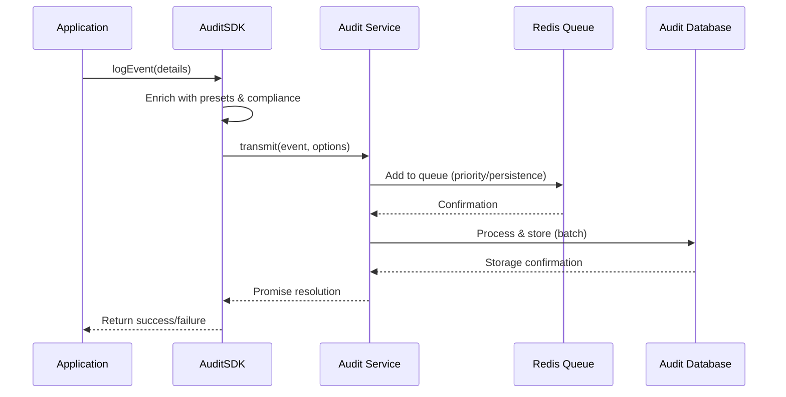

# Core SDK

<cite>
**Referenced Files in This Document**   
- [sdk.ts](file://packages/audit-sdk/src/sdk.ts#L45-L454)
</cite>

## Table of Contents
1. [Introduction](#introduction)
2. [Constructor Configuration](#constructor-configuration)
3. [Event Emission Methods](#event-emission-methods)
4. [Internal Queueing and Transmission](#internal-queueing-and-transmission)
5. [Error Handling and Validation](#error-handling-and-validation)
6. [Performance Considerations](#performance-considerations)
7. [Conclusion](#conclusion)

## Introduction
The AuditSDK module provides a comprehensive interface for logging, managing, and transmitting audit events within the system. It serves as the primary integration point for applications requiring secure, compliant, and reliable audit logging capabilities. The SDK abstracts complex backend operations such as encryption, compliance validation, and durable message queuing, enabling developers to focus on business logic while ensuring regulatory and operational requirements are met.

This document details the implementation of the `AuditSDK` class, covering its initialization process, event logging methods, internal transmission mechanisms, error handling strategies, and performance characteristics. The analysis is based on direct examination of the source code to ensure accuracy and completeness.

**Section sources**
- [sdk.ts](file://packages/audit-sdk/src/sdk.ts#L45-L454)

## Constructor Configuration
The `AuditSDK` class uses a flexible configuration model that supports both static factory methods and dynamic initialization via options. The constructor accepts a variadic list of configuration functions (`AuditSDKOption[]`), which are applied sequentially to configure the SDK instance.

```typescript
constructor(...options: AuditSDKOption[])
```

Each option is a function that receives the SDK instance and modifies its internal state. This pattern enables modular and composable configuration.

### Static Initialization Method
The SDK provides a static `initialize` method that returns a configuration function. This method handles the setup of core dependencies including configuration management, Redis connection, database access, and preset services.

```typescript
public static async initialize(options: AuditSDKConfig): Promise<AuditSDKOption>
```

**Parameters:**
- `options.configPath`: Path to configuration files
- `options.storageType`: Type of storage backend (e.g., file, database)

This method initializes:
- `ConfigurationManager`: Loads and validates configuration
- Redis connection via `getSharedRedisConnectionWithConfig`
- `AuditDbWithConfig`: Database service with Drizzle ORM
- Core `Audit` service with cryptographic and compliance features
- `DatabasePresetHandler`: For reusable event templates

If configuration fails, it throws an `AuditSDKNotInitializedError`.

### Logger Configuration
The SDK includes a static helper to configure logging output:

```typescript
public static withLogger(opts: {
	environment: string
	application: string
	module: string
	version?: string
	requestId?: string
	defaultFields?: Fields
}): AuditSDKOption
```

This sets up a `ConsoleLogger` instance with contextual metadata for debugging and monitoring.

**Section sources**
- [sdk.ts](file://packages/audit-sdk/src/sdk.ts#L45-L454)

## Event Emission Methods
The SDK provides multiple methods for emitting audit events, each tailored to specific use cases while maintaining consistency in data structure and compliance enforcement.

### Base Log Method
The primary method for logging events is `log()`:

```typescript
async log(
	eventDetails: Omit<AuditLogEvent, 'timestamp'>,
	options: {
		preset?: string
		compliance?: string[]
		skipValidation?: boolean
	} = {}
): Promise<void>
```

**Process Flow:**
1. Applies timestamp using `new Date().toISOString()`
2. Enriches event with preset values if specified
3. Applies default compliance values from configuration
4. Validates against compliance rules (e.g., HIPAA, GDPR)
5. Transmits to core audit service with cryptographic signing options

### Specialized Logging Methods
The SDK provides domain-specific wrappers around the base `log()` method:

#### Data Operation Logging
```typescript
async logData(details: {
	principalId: string
	organizationId?: string
	action: 'create' | 'read' | 'update' | 'delete' | 'export' | 'import'
	resourceType: string
	resourceId: string
	status: 'attempt' | 'success' | 'failure'
	dataClassification?: 'PUBLIC' | 'INTERNAL' | 'CONFIDENTIAL' | 'PHI'
	changes?: any
	outcomeDescription?: string
})
```

Automatically prefixes actions with `data.` and sets appropriate data classification.

#### FHIR Healthcare Events
```typescript
async logFHIR(details: { ... })
```

Specialized for healthcare interoperability standards, automatically applies HIPAA compliance checks and structures FHIR-specific context.

#### Authentication Events
```typescript
async logAuth(details: { ... })
```

Logs login, logout, password changes, and MFA operations with standardized action naming (`auth.login.success`).

#### System Events
```typescript
async logSystem(details: { ... })
```

For infrastructure and operational monitoring, using system-generated principal IDs.

#### Critical Events with Guaranteed Delivery
```typescript
async logCritical(
	eventDetails: Omit<AuditLogEvent, 'timestamp'>,
	options: {
		priority?: number
		preset?: string
		compliance?: string[]
	}
)
```

Ensures durability by enabling:
- High-priority queue processing
- `durabilityGuarantees: true`
- Mandatory hash generation
- Digital signatures

This method is designed for security-critical events that must not be lost.

**Section sources**
- [sdk.ts](file://packages/audit-sdk/src/sdk.ts#L45-L454)

## Internal Queueing and Transmission
The SDK leverages an internal queuing mechanism through the core `Audit` service to ensure reliable event delivery even under network instability or service outages.

### Batch Transmission Logic
While the exact batching implementation resides in the `Audit` class (external to this SDK file), the SDK configures transmission parameters including:
- Message priority levels
- Retry policies
- Connection durability settings

Events are transmitted asynchronously via Redis-backed queues using BullMQ patterns, allowing decoupling between event generation and persistence.

### Retry Strategy
The underlying `Audit` service implements resilience patterns including:
- Automatic retry with exponential backoff
- Circuit breaker protection
- Dead-letter queue for failed messages
- Connection health monitoring

These features are inherited by the SDK through its dependency on the `Audit` instance, requiring no additional configuration from the user.

### Secure Transmission Integration
The SDK integrates with `audit-client` for secure transmission by:
- Generating SHA-256 hashes of event payloads
- Creating digital signatures when enabled in config
- Encrypting sensitive fields based on data classification
- Validating compliance requirements before transmission

Transmission occurs over authenticated Redis connections with optional TLS encryption.



**Diagram sources**
- [sdk.ts](file://packages/audit-sdk/src/sdk.ts#L45-L454)

**Section sources**
- [sdk.ts](file://packages/audit-sdk/src/sdk.ts#L45-L454)

## Error Handling and Validation
The SDK implements comprehensive error handling and validation to ensure data integrity and system reliability.

### Validation Rules
All events undergo validation based on:
- Schema conformance (via Zod or similar)
- Compliance policy enforcement (HIPAA, GDPR)
- Required field presence
- Data type correctness
- Action naming conventions

Validation can be skipped using the `skipValidation` flag, though this is discouraged in production.

### Error Types
The SDK throws specific error classes:
- `AuditSDKError`: General SDK errors
- `AuditSDKNotInitializedError`: When service dependencies are missing
- Configuration-related errors during initialization

These are propagated as rejected promises, requiring caller-side handling.

### Contextual Error Logging
When available, the SDK uses its configured logger to record:
- Initialization failures
- Transmission errors
- Validation rejections
- Health check failures

This aids in debugging and operational monitoring.

**Section sources**
- [sdk.ts](file://packages/audit-sdk/src/sdk.ts#L45-L454)

## Performance Considerations
The SDK is designed for high-throughput scenarios with attention to memory usage and latency.

### Memory Usage
- Events are processed in-memory before queuing
- No internal buffering beyond single-event scope
- Preset and configuration data cached per-instance
- Minimal object allocation during hot paths

### High-Throughput Scenarios
In high-volume environments:
- Asynchronous queuing prevents blocking
- Batch processing reduces I/O overhead
- Connection pooling minimizes network latency
- Lightweight serialization format used

However, unbounded event creation without backpressure handling could lead to memory pressure. Applications should consider:
- Rate limiting for non-critical events
- Using `log()` instead of `logCritical()` for high-frequency actions
- Monitoring queue depth and processing lag

### Optimization Recommendations
1. Reuse SDK instances rather than creating new ones
2. Configure appropriate log levels to avoid noise
3. Use presets to reduce per-event processing
4. Monitor health status regularly via `getHealth()`
5. Close connections properly using `close()`

**Section sources**
- [sdk.ts](file://packages/audit-sdk/src/sdk.ts#L45-L454)

## Conclusion
The AuditSDK provides a robust, secure, and developer-friendly interface for audit logging. Its modular design allows flexible configuration while enforcing compliance and reliability standards. By abstracting complex backend operations, it enables consistent audit logging across diverse application contexts—from healthcare FHIR interactions to system-level monitoring.

Key strengths include:
- Composable configuration model
- Domain-specific logging methods
- Built-in compliance enforcement
- Resilient transmission with retry logic
- Clear error handling and diagnostics

Developers should leverage the provided logging methods according to their use case, initialize the SDK properly with required configuration, and monitor its health in production environments.

**Section sources**
- [sdk.ts](file://packages/audit-sdk/src/sdk.ts#L45-L454)