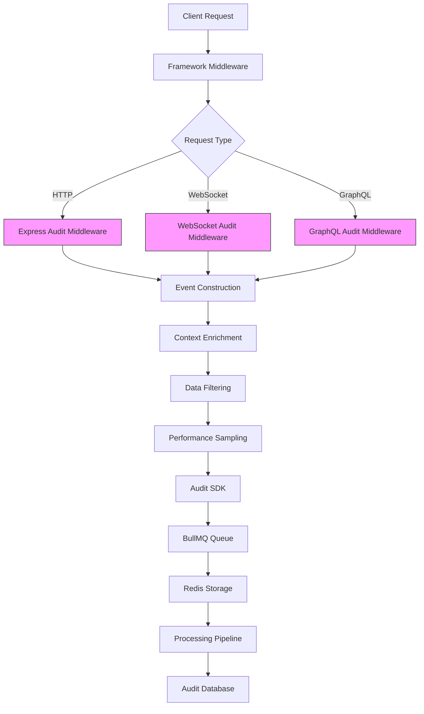
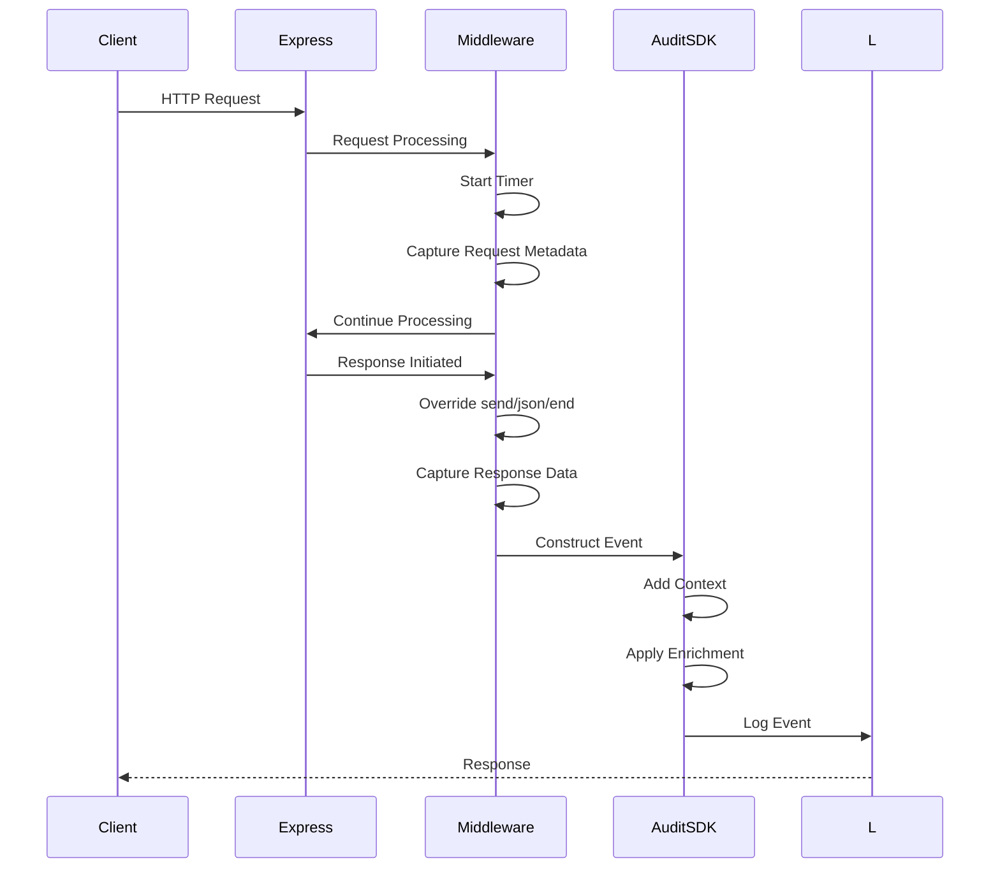
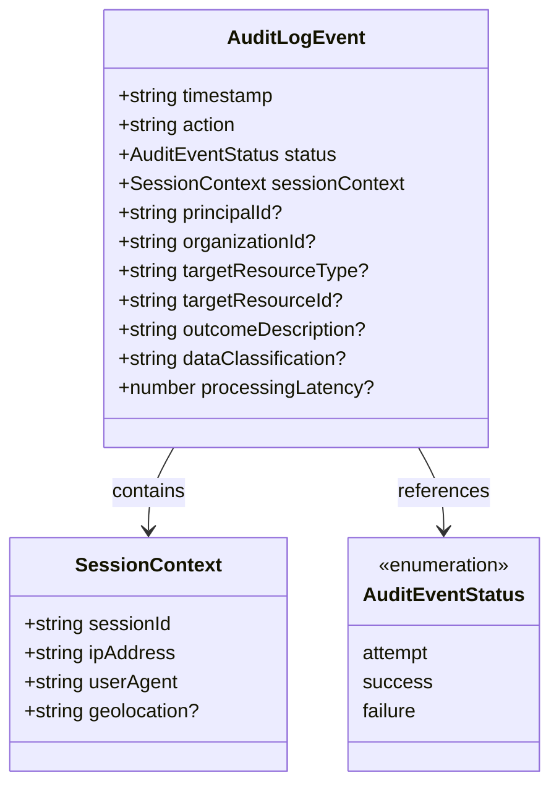
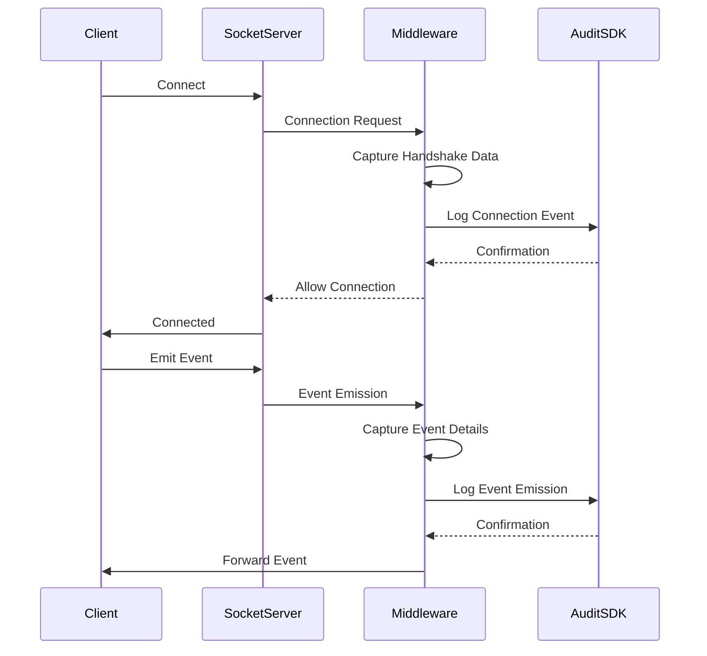
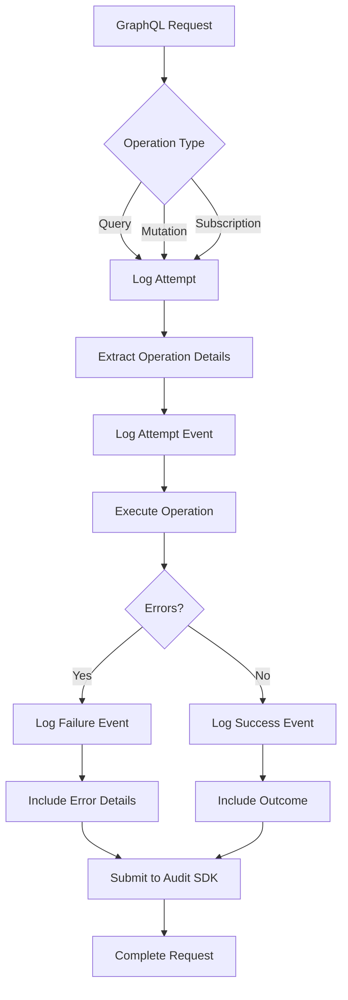
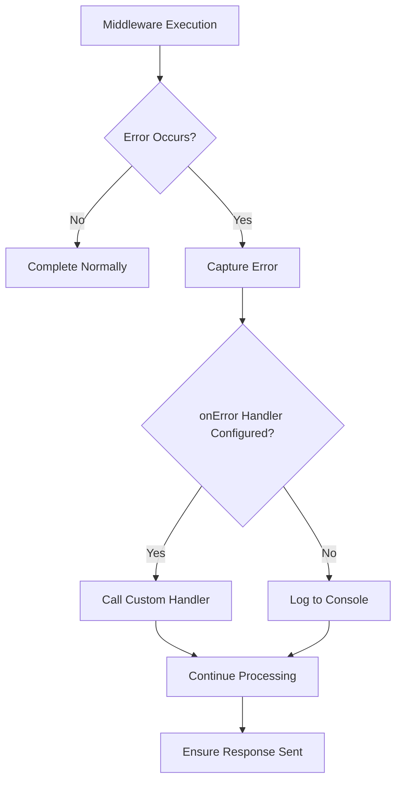

# Middleware Integration

<cite>
**Referenced Files in This Document**   
- [middleware.ts](file://packages/audit-sdk/src/middleware.ts#L7-L303)
- [types.ts](file://packages/audit/src/types.ts#L6-L21)
- [audit-sdk.md](file://apps/docs/src/content/docs/audit/audit-sdk.md#L149-L194)
- [README.md](file://packages/audit-sdk/README.md#L224-L243)
</cite>

## Table of Contents
1. [Introduction](#introduction)
2. [Core Components](#core-components)
3. [Architecture Overview](#architecture-overview)
4. [Detailed Component Analysis](#detailed-component-analysis)
5. [Configuration Options](#configuration-options)
6. [Error Handling and Troubleshooting](#error-handling-and-troubleshooting)
7. [Integration Examples](#integration-examples)

## Introduction
The Audit SDK provides comprehensive middleware solutions for automatic audit event generation across various frameworks including Express.js, WebSocket, and GraphQL. These middleware components capture critical request/response metadata, timing information, and user context to create structured audit logs for compliance, security, and operational monitoring purposes. The system is designed to integrate seamlessly with minimal code changes while providing extensive customization options for filtering, enrichment, and performance optimization.

## Core Components
The middleware system consists of three primary components that handle different types of application interfaces:
- **HTTP Middleware**: Captures Express.js request/response cycles
- **WebSocket Middleware**: Monitors WebSocket connection events and messages
- **GraphQL Middleware**: Intercepts GraphQL operations and errors

These components automatically generate audit events with standardized structure, including timestamps, user context, IP addresses, and performance metrics. The middleware operates non-intrusively by wrapping existing request/response methods without disrupting normal application flow.

**Section sources**
- [middleware.ts](file://packages/audit-sdk/src/middleware.ts#L7-L303)
- [audit-sdk.md](file://apps/docs/src/content/docs/audit/audit-sdk.md#L149-L194)

## Architecture Overview


**Diagram sources**
- [middleware.ts](file://packages/audit-sdk/src/middleware.ts#L7-L303)

## Detailed Component Analysis

### HTTP Middleware Implementation
The Express.js middleware captures HTTP transactions by intercepting request processing and response finalization. It uses method overriding to hook into the response lifecycle without blocking normal operations.



The middleware implementation follows these key steps:
1. **Request Interception**: The middleware function receives the Express request, response, and next function
2. **Skip Condition Check**: Evaluates if the request should be skipped based on configuration
3. **Performance Sampling**: Applies sampling rate to reduce volume for high-traffic endpoints
4. **Method Wrapping**: Overrides response methods (send, json, end) to capture response data
5. **Timing Measurement**: Records processing time from request start to response completion
6. **Event Construction**: Builds the audit event with captured metadata
7. **Context Enrichment**: Applies custom enrichment functions if configured
8. **Event Logging**: Submits the completed event to the Audit SDK

**Section sources**
- [middleware.ts](file://packages/audit-sdk/src/middleware.ts#L7-L115)

### Session Context Structure
The middleware captures comprehensive session context for each request, providing essential information for security and compliance auditing.



**Diagram sources**
- [types.ts](file://packages/audit/src/types.ts#L6-L21)

### WebSocket Middleware
The WebSocket middleware monitors socket connections and message events, capturing important security and usage patterns.



**Section sources**
- [middleware.ts](file://packages/audit-sdk/src/middleware.ts#L215-L247)

### GraphQL Middleware
The GraphQL middleware integrates with Apollo Server plugins to capture operation lifecycle events.



**Section sources**
- [middleware.ts](file://packages/audit-sdk/src/middleware.ts#L252-L303)

## Configuration Options
The middleware supports extensive configuration options to control behavior, filtering, and performance characteristics.

### Middleware Options Structure
```typescript
interface MiddlewareOptions {
  skip?: (req: Request) => boolean
  enrich?: (req: Request, res: Response, event: any) => any
  performance?: {
    sampleRate?: number
    maxLatency?: number
  }
  onError?: (error: Error, req: Request, res: Response) => void
}
```

**Key Configuration Parameters:**

:skip: Function to determine if a request should be excluded from auditing. Commonly used to skip health check endpoints or static assets.

:enrich: Function to add custom data to audit events. Receives the request, response, and current event object, and returns the modified event.

:performance.sampleRate: Sampling rate (0-1) to reduce audit volume. A value of 0.1 logs only 10% of requests.

:performance.maxLatency: Maximum processing time threshold. Requests exceeding this duration are not logged to avoid performance impact.

:onError: Custom error handler for audit logging failures. If not provided, errors are logged to console.

**Section sources**
- [middleware.ts](file://packages/audit-sdk/src/middleware.ts#L7-L115)

## Error Handling and Troubleshooting
The middleware includes robust error handling to prevent audit logging failures from affecting application functionality.

### Error Handling Flow


**Common Issues and Solutions:**

**Context Loss**: When using async operations in enrichment functions, ensure proper async/await usage to prevent context loss. Wrap enrichment logic in try-catch blocks to handle asynchronous errors.

**Performance Overhead**: High-volume endpoints may experience performance impact. Use sampling (sampleRate) to reduce audit volume, or exclude non-critical endpoints using the skip function.

**Memory Leaks**: Ensure response method overrides are properly implemented. The middleware captures response body references but should not store them beyond event construction.

**Circular References**: When enriching events with request/response objects, be aware of circular references that could cause serialization issues. Use JSON.stringify with a replacer function or manually extract needed properties.

**Section sources**
- [middleware.ts](file://packages/audit-sdk/src/middleware.ts#L7-L115)

## Integration Examples

### Express.js Integration
```typescript
import express from 'express'
import { createAuditMiddleware } from '@repo/audit-sdk'

const app = express()

app.use(
  createAuditMiddleware(auditSDK, {
    skip: (req) => req.path.startsWith('/health') || req.path.startsWith('/metrics'),
    enrich: (req, res, event) => ({
      ...event,
      customField: req.headers['x-custom-header'],
      tenantId: req.headers['x-tenant-id'],
    }),
    performance: {
      sampleRate: 0.1,
      maxLatency: 5000,
    },
    onError: (error, req, res) => {
      console.error('Audit middleware error:', error)
      // Send to error monitoring service
      errorService.capture(error, { request: req.path })
    },
  })
)
```

### WebSocket Integration
```typescript
import { createWebSocketAuditMiddleware } from '@repo/audit-sdk'

// For Socket.IO
io.use(createWebSocketAuditMiddleware(auditSDK))

// For raw WebSocket server
wss.on('connection', (socket) => {
  socket.use(createWebSocketAuditMiddleware(auditSDK))
})
```

### GraphQL Integration
```typescript
import { createGraphQLAuditMiddleware } from '@repo/audit-sdk'

const server = new ApolloServer({
  typeDefs,
  resolvers,
  plugins: [
    createGraphQLAuditMiddleware(auditSDK)
  ],
})
```

**Section sources**
- [README.md](file://packages/audit-sdk/README.md#L224-L243)
- [audit-sdk.md](file://apps/docs/src/content/docs/audit/audit-sdk.md#L149-L194)