# Audit System Enhancements Specifications

<cite>
**Referenced Files in This Document**   
- [audit.md](file://apps/docs/src/content/docs/audit/audit.md)
- [audit-db.md](file://apps/docs/src/content/docs/audit/audit-db.md)
- [archival-system.md](file://apps/docs/src/content/docs/audit/archival-system.md)
- [security.md](file://apps/docs/src/content/docs/audit/security.md)
- [audit.ts](file://packages/audit/src/audit.ts)
- [audit-db.ts](file://packages/audit-db/src/index.ts)
- [archival-service.ts](file://packages/audit/src/archival/archival-service.ts)
- [postgres-archival-service.ts](file://packages/audit/src/archival/postgres-archival-service.ts)
- [security-config.ts](file://packages/audit/src/crypto.ts)
</cite>

## Table of Contents
1. [Introduction](#introduction)
2. [Design Principles](#design-principles)
3. [Architectural Changes](#architectural-changes)
4. [Implementation Roadmap](#implementation-roadmap)
5. [Impact Analysis](#impact-analysis)
6. [Migration Guidance](#migration-guidance)
7. [Security Enhancements](#security-enhancements)
8. [Compliance and Regulatory Considerations](#compliance-and-regulatory-considerations)
9. [Performance and Scalability](#performance-and-scalability)
10. [Monitoring and Alerting](#monitoring-and-alerting)
11. [Conclusion](#conclusion)

## Introduction

The Audit System Enhancements specifications document outlines the comprehensive improvements to the SMEDREC platform's audit logging infrastructure. These enhancements focus on strengthening security, improving data lifecycle management, ensuring regulatory compliance, and optimizing performance for healthcare environments. The audit system serves as a critical component for maintaining data integrity, supporting compliance requirements, and enabling forensic analysis in the healthcare domain.

The enhancements build upon the existing `@repo/audit` package, which provides core audit logging functionality with cryptographic integrity verification, compliance features, and reliable event queuing. The system has been extended to include advanced archival capabilities, enhanced security measures, and improved integration patterns across the platform.

**Section sources**
- [audit.md](file://apps/docs/src/content/docs/audit/audit.md)

## Design Principles

The audit system enhancements are guided by several core design principles that ensure the system meets the stringent requirements of healthcare applications:

- **Security by Design**: Cryptographic integrity verification using SHA-256 hashing and HMAC signatures is implemented at the core of the system to prevent tampering with audit records.
- **Compliance First**: Built-in support for HIPAA and GDPR compliance ensures that audit logs meet regulatory requirements for healthcare data protection and privacy.
- **Reliability and Durability**: The system employs circuit breaker patterns, dead letter queues, and guaranteed delivery mechanisms to ensure no audit events are lost, even during system failures.
- **Performance at Scale**: Efficient queuing with BullMQ and Redis enables high-throughput scenarios while maintaining low latency for audit event processing.
- **Healthcare-Centric**: Specialized support for FHIR resources and Protected Health Information (PHI) handling addresses the unique requirements of healthcare applications.
- **Data Lifecycle Management**: Comprehensive archival and retention policies ensure that audit data is managed according to organizational and regulatory requirements.

These principles are reflected in the system's architecture and implementation, ensuring that audit logs remain trustworthy, accessible, and compliant throughout their lifecycle.

**Section sources**
- [audit.md](file://apps/docs/src/content/docs/audit/audit.md)
- [security.md](file://apps/docs/src/content/docs/audit/security.md)

## Architectural Changes

The audit system enhancements introduce significant architectural changes that improve the system's capabilities and integration patterns. The updated architecture follows a modular design with clear separation of concerns between components.

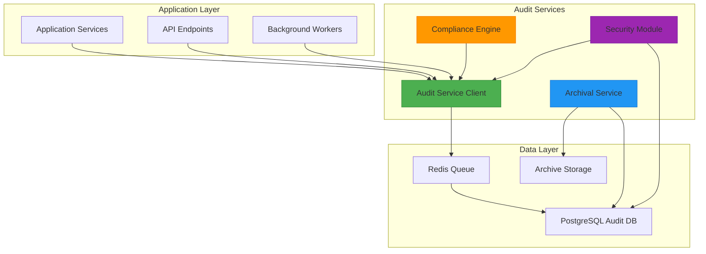

**Diagram sources**
- [audit.ts](file://packages/audit/src/audit.ts)
- [archival-service.ts](file://packages/audit/src/archival/archival-service.ts)
- [audit-db.ts](file://packages/audit-db/src/index.ts)

The key architectural changes include:

1. **Decoupled Event Processing**: Audit events are published to a Redis queue using BullMQ, decoupling event generation from processing and storage.
2. **Centralized Audit Database**: The `@repo/audit-db` package provides a standardized interface for accessing the PostgreSQL audit database, ensuring consistency across services.
3. **Modular Archival System**: The archival functionality has been separated into dedicated services that handle data lifecycle management based on retention policies.
4. **Enhanced Security Layer**: Cryptographic operations are centralized in a security module that handles hashing, signing, and verification of audit events.
5. **Compliance Engine**: A dedicated component manages compliance requirements, including data classification and retention policy enforcement.

The architecture supports both synchronous and asynchronous audit logging, allowing services to choose the appropriate pattern based on their requirements. Critical operations use guaranteed delivery mechanisms, while less critical events may use fire-and-forget patterns with appropriate error handling.

**Section sources**
- [audit.md](file://apps/docs/src/content/docs/audit/audit.md)
- [audit-db.md](file://apps/docs/src/content/docs/audit/audit-db.md)
- [archival-system.md](file://apps/docs/src/content/docs/audit/archival-system.md)

## Implementation Roadmap

The implementation of the audit system enhancements follows a phased approach to ensure minimal disruption to existing services while delivering incremental value.

### Phase 1: Core Infrastructure Enhancement

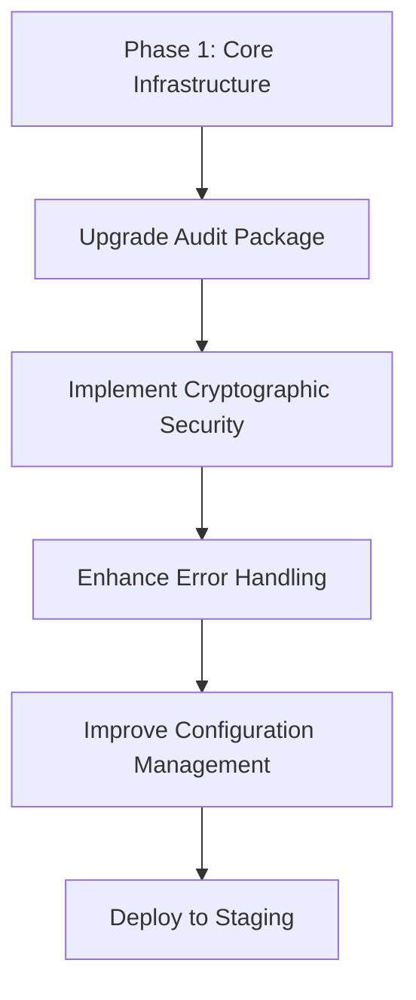

**Diagram sources**
- [audit.ts](file://packages/audit/src/audit.ts)
- [crypto.ts](file://packages/audit/src/crypto.ts)
- [config/manager.ts](file://packages/audit/src/config/manager.ts)

This phase focuses on strengthening the core audit package with enhanced security features and improved reliability. Key activities include:
- Implementing SHA-256 hashing and HMAC signatures for all audit events
- Enhancing error handling with circuit breaker patterns and dead letter queues
- Improving configuration management through environment variables and configuration objects
- Upgrading dependencies and addressing security vulnerabilities

### Phase 2: Data Lifecycle Management

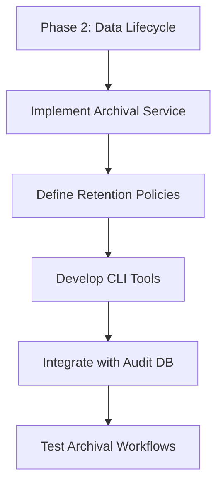

**Diagram sources**
- [archival-service.ts](file://packages/audit/src/archival/archival-service.ts)
- [postgres-archival-service.ts](file://packages/audit/src/archival/postgres-archival-service.ts)
- [audit-db.md](file://apps/docs/src/content/docs/audit/audit-db.md)

This phase introduces comprehensive data lifecycle management capabilities:
- Implementing the ArchivalService for automated data archival based on retention policies
- Defining retention policies for different data classifications (PUBLIC, INTERNAL, CONFIDENTIAL, PHI)
- Developing command-line tools for managing archives and performing data cleanup
- Integrating archival functionality with the audit database schema

### Phase 3: Compliance and Security Enhancement

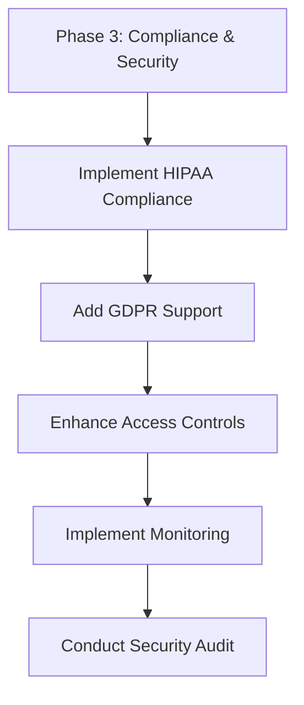

**Diagram sources**
- [security.md](file://apps/docs/src/content/docs/audit/security.md)
- [gdpr/gdpr-compliance.ts](file://packages/audit/src/gdpr/gdpr-compliance.ts)
- [monitor/monitoring.ts](file://packages/audit/src/monitor/monitoring.ts)

This phase focuses on regulatory compliance and advanced security features:
- Implementing HIPAA-compliant audit logging with required fields and retention periods
- Adding GDPR support with data subject identification and processing purpose tracking
- Enhancing access controls and authentication for audit system components
- Implementing monitoring and alerting for security events and integrity violations

### Phase 4: Integration and Optimization

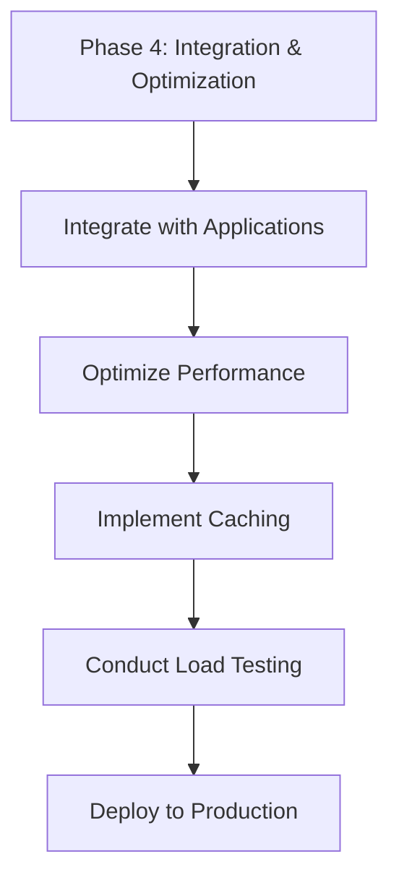

**Diagram sources**
- [audit.md](file://apps/docs/src/content/docs/audit/audit.md)
- [cache/cache-factory.ts](file://packages/audit-db/src/cache/cache-factory.ts)
- [performance-monitoring.ts](file://packages/audit-db/src/db/performance-monitoring.ts)

The final phase focuses on integration and optimization:
- Integrating the enhanced audit system with all platform applications
- Optimizing performance through query optimization and caching
- Implementing monitoring and alerting for production environments
- Conducting comprehensive load testing to validate scalability

**Section sources**
- [audit.md](file://apps/docs/src/content/docs/audit/audit.md)
- [archival-system.md](file://apps/docs/src/content/docs/audit/archival-system.md)
- [security.md](file://apps/docs/src/content/docs/audit/security.md)

## Impact Analysis

The audit system enhancements will have significant impacts across multiple dimensions of the platform. This section analyzes the technical, operational, and compliance implications of the changes.

### Technical Impact

The enhancements introduce several technical changes that affect system architecture and dependencies:

- **New Dependencies**: The system now requires Redis for queuing and PostgreSQL for audit storage, with specific version requirements for optimal performance.
- **API Changes**: The audit service API has been extended to support cryptographic features, data classification, and enhanced error handling.
- **Database Schema Changes**: The audit database schema has been updated to include fields for cryptographic hashes, signatures, and data classification.
- **Performance Characteristics**: The system introduces additional processing overhead for cryptographic operations, which must be accounted for in performance planning.

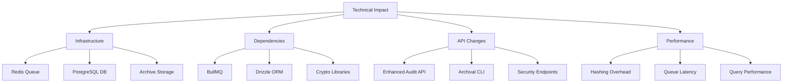

**Diagram sources**
- [audit.ts](file://packages/audit/src/audit.ts)
- [audit-db.ts](file://packages/audit-db/src/index.ts)
- [archival-service.ts](file://packages/audit/src/archival/archival-service.ts)

### Operational Impact

The enhancements introduce new operational requirements and processes:

- **Monitoring Requirements**: New metrics and logs must be monitored, including queue health, archival status, and security events.
- **Maintenance Procedures**: Regular archival jobs and integrity checks must be scheduled and maintained.
- **Incident Response**: New procedures are required for handling security incidents related to audit log integrity.
- **Backup Strategy**: The archive storage must be included in backup and disaster recovery plans.

### Compliance Impact

The enhancements significantly improve the platform's compliance posture:

- **HIPAA Compliance**: The system now supports all required elements for HIPAA audit logging, including user identification, action tracking, and PHI handling.
- **GDPR Compliance**: Data subject identification and processing purpose tracking enable compliance with GDPR requirements.
- **Audit Trail Integrity**: Cryptographic verification ensures that audit logs cannot be tampered with, meeting regulatory requirements for data integrity.

**Section sources**
- [audit.md](file://apps/docs/src/content/docs/audit/audit.md)
- [audit-db.md](file://apps/docs/src/content/docs/audit/audit-db.md)
- [security.md](file://apps/docs/src/content/docs/audit/security.md)

## Migration Guidance

Migrating to the enhanced audit system requires careful planning and execution to ensure a smooth transition with minimal disruption to existing services.

### Migration Prerequisites

Before beginning the migration, ensure the following prerequisites are met:

- **Infrastructure Readiness**: Verify that Redis and PostgreSQL instances are available and properly configured.
- **Configuration Setup**: Prepare environment variables for database connections, cryptographic keys, and other settings.
- **Backup Strategy**: Ensure that existing audit data is backed up before migration.
- **Testing Environment**: Set up a staging environment that mirrors production for testing.

### Migration Steps

The migration should be performed in the following sequence:

1. **Deploy Enhanced Audit Package**: Install the updated `@repo/audit` package in all services that generate audit events.
2. **Update Configuration**: Configure the audit service with connection details for Redis and cryptographic settings.
3. **Test Integration**: Verify that audit events are being generated and queued correctly in the staging environment.
4. **Deploy Audit Database**: Set up the enhanced audit database with the updated schema.
5. **Connect Services**: Update services to use the `@repo/audit-db` package for database access.
6. **Validate Data Flow**: Confirm that audit events are being processed from the queue and stored in the database.
7. **Enable Security Features**: Activate cryptographic hashing and signing for audit events.
8. **Configure Retention Policies**: Define and implement data retention policies based on compliance requirements.
9. **Test Archival Process**: Verify that the archival system works correctly with test data.
10. **Monitor Production**: After deployment to production, closely monitor system performance and error rates.

### Code Migration Examples

When migrating existing code to use the enhanced audit system, follow these patterns:

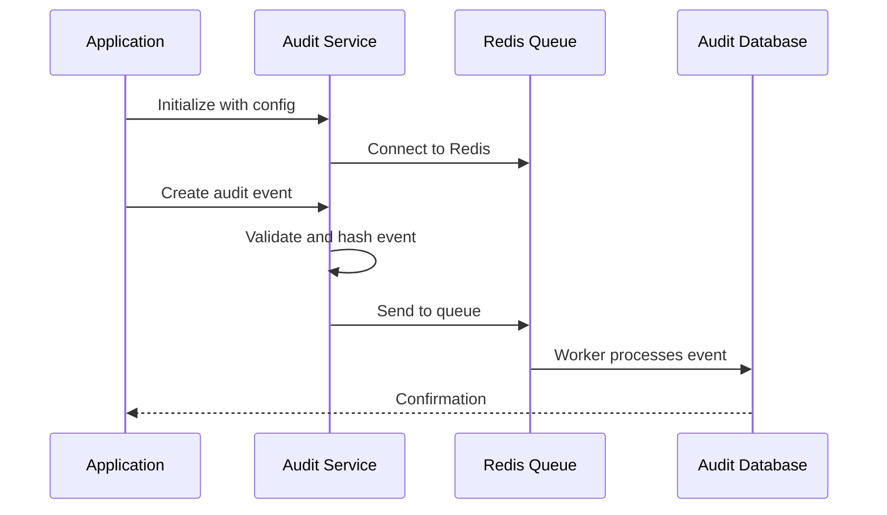

**Diagram sources**
- [audit.ts](file://packages/audit/src/audit.ts)
- [audit-db.ts](file://packages/audit-db/src/index.ts)

Key changes in code usage include:

- **Initialization**: The audit service now requires additional configuration for cryptographic operations.
- **Event Creation**: Audit events should include data classification and other metadata fields.
- **Error Handling**: Enhanced error handling should account for queue connectivity issues and cryptographic operations.

### Rollback Plan

In case of issues during migration, have a rollback plan ready:

1. **Revert Code Changes**: Deploy the previous version of services without the enhanced audit system.
2. **Restore Configuration**: Revert to the previous configuration settings.
3. **Data Migration**: If audit data was written in the new format, ensure it can be read by the previous system or plan for data transformation.
4. **Communication**: Notify stakeholders of the rollback and planned next steps.

**Section sources**
- [audit.md](file://apps/docs/src/content/docs/audit/audit.md)
- [audit-db.md](file://apps/docs/src/content/docs/audit/audit-db.md)
- [archival-system.md](file://apps/docs/src/content/docs/audit/archival-system.md)

## Security Enhancements

The audit system enhancements introduce several critical security improvements that strengthen the integrity and confidentiality of audit logs.

### Cryptographic Security

The system implements robust cryptographic protections to ensure audit log integrity:

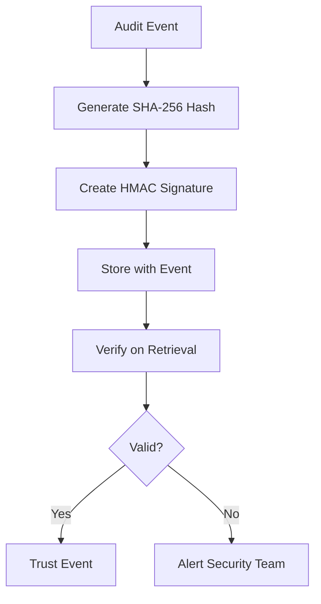

**Diagram sources**
- [crypto.ts](file://packages/audit/src/crypto.ts)
- [security.md](file://apps/docs/src/content/docs/audit/security.md)

Key cryptographic features include:
- **SHA-256 Hashing**: Every audit event is protected with a SHA-256 cryptographic hash to detect tampering.
- **HMAC Signatures**: Events can be signed with HMAC using a secret key for authentication.
- **Key Management**: Support for environment-specific keys and key rotation policies.

### Data Classification and Handling

The system implements a comprehensive data classification framework:

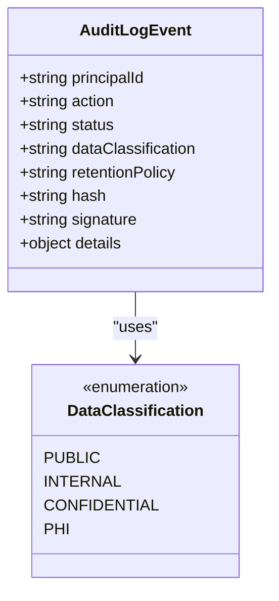

**Diagram sources**
- [types.ts](file://packages/audit/src/types.ts)
- [security.md](file://apps/docs/src/content/docs/audit/security.md)

Data is classified into four levels:
- **PUBLIC**: Non-sensitive data with minimal protection requirements.
- **INTERNAL**: Business data that should not be publicly disclosed.
- **CONFIDENTIAL**: Sensitive business data requiring strong protection.
- **PHI**: Protected Health Information with the highest protection level.

### Input Validation and Sanitization

The system includes robust input validation to prevent injection attacks:

- **Automatic Sanitization**: All input is automatically sanitized to prevent XSS and other injection attacks.
- **Custom Validation Rules**: Organizations can configure validation rules for their specific requirements.
- **Manual Validation**: Critical events can be validated with custom business logic before logging.

### Network Security

The system enforces secure network communications:

- **TLS Encryption**: Redis and database connections use TLS to encrypt data in transit.
- **Certificate Validation**: Server certificates are validated to prevent man-in-the-middle attacks.
- **Secure Configuration**: Environment variables store sensitive credentials and cryptographic keys.

**Section sources**
- [security.md](file://apps/docs/src/content/docs/audit/security.md)
- [crypto.ts](file://packages/audit/src/crypto.ts)

## Compliance and Regulatory Considerations

The audit system enhancements are designed to meet the stringent compliance requirements of healthcare applications, particularly HIPAA and GDPR.

### HIPAA Compliance

The system supports all key requirements for HIPAA audit logging:

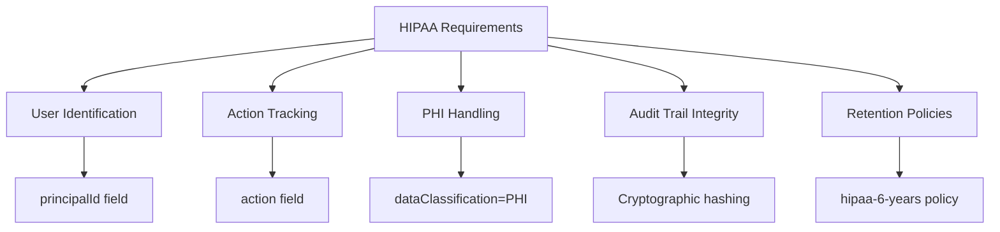

**Diagram sources**
- [security.md](file://apps/docs/src/content/docs/audit/security.md)
- [gdpr/gdpr-compliance.ts](file://packages/audit/src/gdpr/gdpr-compliance.ts)

Key HIPAA compliance features include:
- **Minimum Required Fields**: The system ensures that all HIPAA-required fields are present in audit events.
- **PHI Protection**: Protected Health Information is handled with the highest security level.
- **Retention Policies**: Data is retained for the required period (typically 6 years).
- **Integrity Verification**: Regular integrity checks ensure audit logs have not been tampered with.

### GDPR Compliance

The system supports GDPR requirements for personal data processing:

- **Data Subject Identification**: Audit events can include data subject IDs for tracking personal data processing.
- **Legal Basis Tracking**: The purpose and legal basis for data processing are recorded.
- **Data Category Classification**: Different categories of personal data are identified and protected.
- **Right to Erasure**: The system supports secure deletion of personal data when required.

### Compliance Monitoring

The system includes features for ongoing compliance monitoring:

- **Automated Checks**: Regular scans verify that audit logs meet compliance requirements.
- **Alerting**: Notifications are generated when compliance issues are detected.
- **Reporting**: Comprehensive reports document compliance status and audit trail integrity.

**Section sources**
- [security.md](file://apps/docs/src/content/docs/audit/security.md)
- [gdpr/gdpr-compliance.ts](file://packages/audit/src/gdpr/gdpr-compliance.ts)

## Performance and Scalability

The audit system enhancements include several performance optimizations to handle high-volume audit logging in production environments.

### Performance Characteristics

The system is designed to handle high-throughput scenarios with minimal impact on application performance:

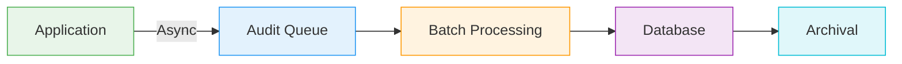

**Diagram sources**
- [audit.ts](file://packages/audit/src/audit.ts)
- [queue/reliable-processor.ts](file://packages/audit/src/queue/reliable-processor.ts)
- [archival-service.ts](file://packages/audit/src/archival/archival-service.ts)

Key performance features include:
- **Asynchronous Logging**: Audit events are queued asynchronously to avoid blocking application code.
- **Batch Processing**: Events are processed in batches to optimize database operations.
- **Efficient Indexing**: Database indexes are optimized for common query patterns.
- **Compression**: Archived data is compressed to reduce storage requirements.

### Scalability Considerations

The system is designed to scale with increasing audit volume:

- **Horizontal Scaling**: Multiple workers can process the audit queue in parallel.
- **Database Partitioning**: The audit database supports partitioning to improve query performance.
- **Caching**: Frequently accessed audit data can be cached to reduce database load.
- **Resource Monitoring**: System resources are monitored to identify scaling needs.

### Performance Testing

The system has been validated through comprehensive performance testing:

- **Load Testing**: Simulated high-volume scenarios to validate system behavior under stress.
- **Latency Measurement**: Measured end-to-end latency for audit event processing.
- **Resource Utilization**: Monitored CPU, memory, and I/O usage during testing.
- **Failure Recovery**: Tested system behavior during component failures.

**Section sources**
- [audit.md](file://apps/docs/src/content/docs/audit/audit.md)
- [performance-monitoring.ts](file://packages/audit-db/src/db/performance-monitoring.ts)

## Monitoring and Alerting

The enhanced audit system includes comprehensive monitoring and alerting capabilities to ensure system health and security.

### Monitoring Architecture

The monitoring system follows a layered approach to track system health and performance:

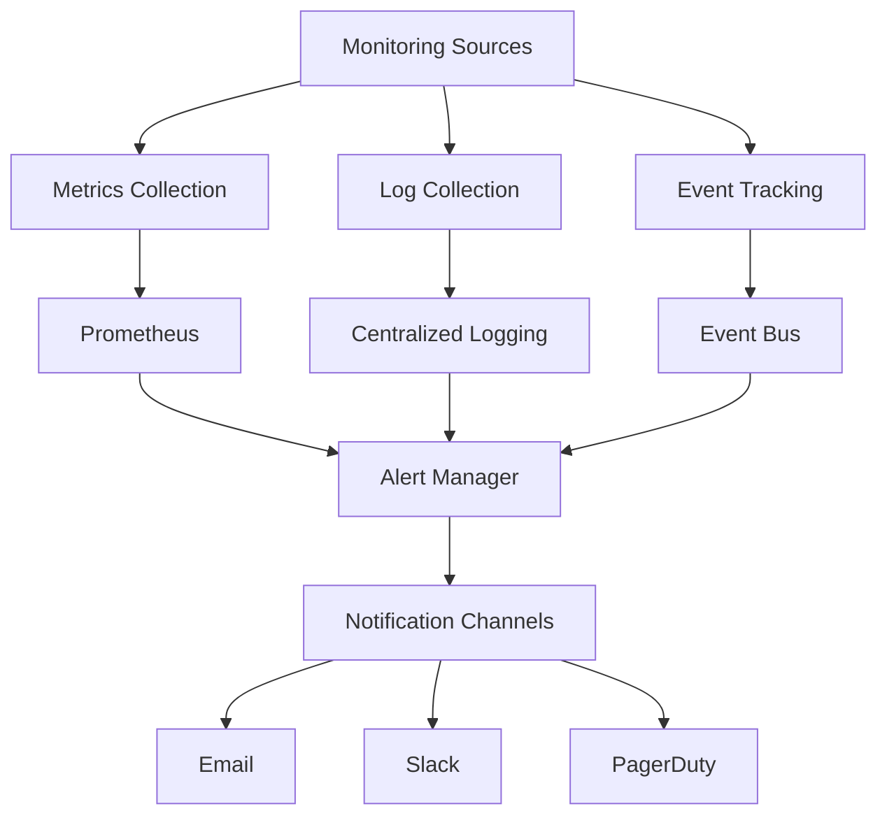

**Diagram sources**
- [monitor/monitoring.ts](file://packages/audit/src/monitor/monitoring.ts)
- [monitor/metrics-collector.ts](file://packages/audit/src/monitor/metrics-collector.ts)

Key monitoring components include:
- **Metrics Collection**: System metrics are collected using Prometheus.
- **Log Aggregation**: Audit logs and system logs are aggregated in a centralized logging system.
- **Event Tracking**: Critical system events are published to an event bus for real-time monitoring.

### Key Metrics

The system monitors several critical metrics:

- **Queue Health**: Redis queue length, processing rate, and error rates.
- **Database Performance**: Query latency, connection pool usage, and storage utilization.
- **Archival Status**: Archive creation rate, storage usage, and retrieval performance.
- **Security Events**: Failed integrity checks, unauthorized access attempts, and policy violations.

### Alerting Rules

The system includes predefined alerting rules for critical conditions:

- **Queue Backlog**: Alert when the audit queue exceeds a threshold length.
- **Database Errors**: Alert on database connectivity issues or query failures.
- **Integrity Violations**: Alert when audit log integrity checks fail.
- **Resource Exhaustion**: Alert when system resources (CPU, memory, storage) reach critical levels.

**Section sources**
- [monitor/monitoring.ts](file://packages/audit/src/monitor/monitoring.ts)
- [monitor/metrics-collector.ts](file://packages/audit/src/monitor/metrics-collector.ts)

## Conclusion

The Audit System Enhancements specifications document the comprehensive improvements to the SMEDREC platform's audit logging infrastructure. These enhancements significantly strengthen the system's security, compliance, and performance characteristics, making it suitable for healthcare applications with stringent regulatory requirements.

The key improvements include robust cryptographic protections, comprehensive data lifecycle management, enhanced compliance features, and optimized performance for high-volume scenarios. The modular architecture allows for flexible deployment and integration with existing services.

The implementation roadmap provides a clear path for adopting these enhancements, with phased delivery to minimize disruption. The migration guidance offers practical advice for transitioning existing systems to the enhanced audit framework.

By implementing these enhancements, the SMEDREC platform will have a robust, trustworthy audit system that supports regulatory compliance, enables forensic analysis, and protects sensitive healthcare data. The system's design ensures that audit logs remain tamper-evident, accessible, and reliable throughout their lifecycle.

Organizations adopting these enhancements should follow the recommended best practices for configuration, monitoring, and maintenance to ensure the continued effectiveness of the audit system. Regular reviews of security controls, compliance requirements, and performance characteristics will help maintain the system's integrity and effectiveness over time.