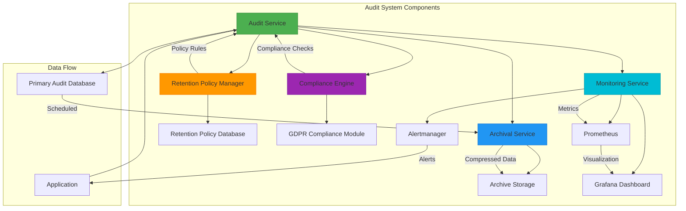
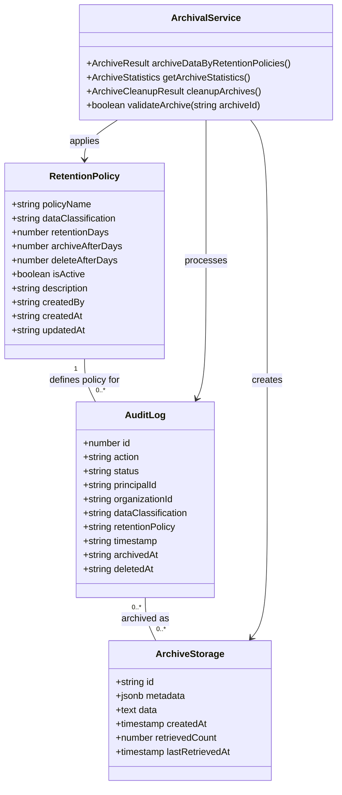
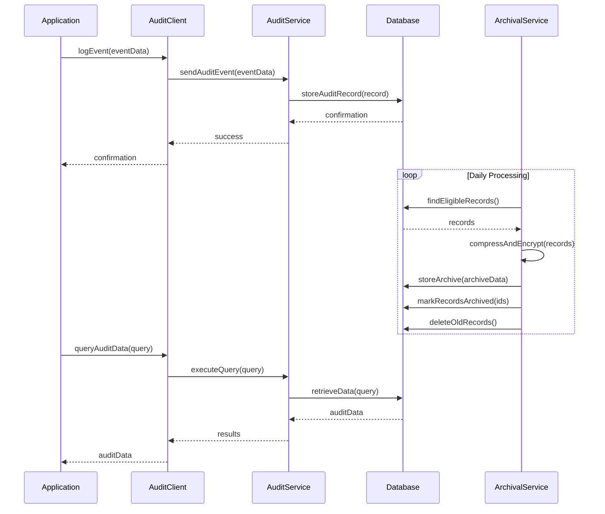
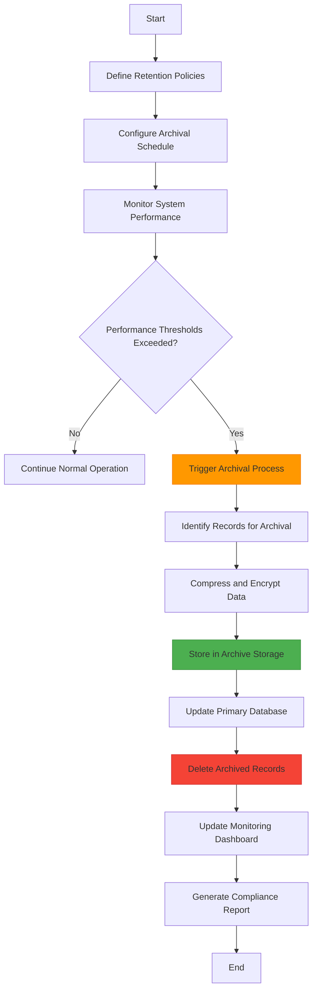
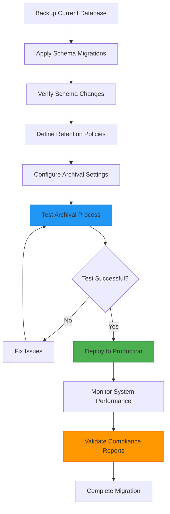
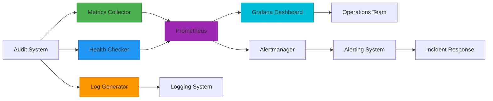
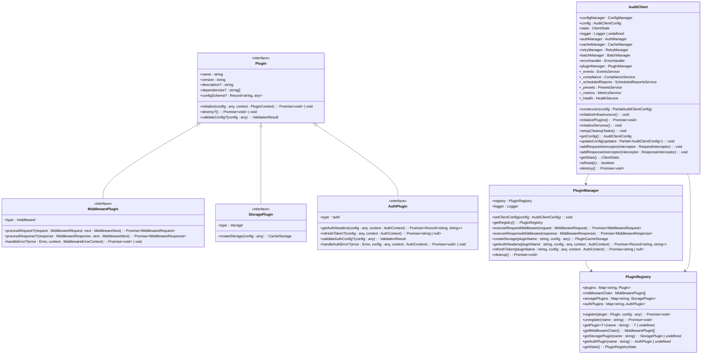

# Audit System Enhancements Specifications

<cite>
**Referenced Files in This Document**   
- [archival-service.ts](file://packages/audit/src/archival/archival-service.ts)
- [archival-system.md](file://apps/docs/src/content/docs/audit/archival-system.md)
- [audit-db.md](file://apps/docs/src/content/docs/audit/audit-db.md)
- [audit-sdk.md](file://apps/docs/src/content/docs/audit/audit-sdk.md)
- [audit.test.ts](file://packages/audit/src/__tests__/audit.test.ts)
- [audit.ts](file://packages/audit/src/audit.ts)
- [audit_retention_policy.sql](file://packages/audit-db/drizzle/migrations/0005_marvelous_christian_walker.sql)
- [audit_log.sql](file://packages/audit-db/drizzle/migrations/0003_easy_prowler.sql)
- [schema.ts](file://packages/audit-db/src/db/schema.ts)
- [migration-utils.ts](file://packages/audit-db/src/migration-utils.ts)
- [health-check.ts](file://packages/audit/src/monitor/health-check.ts)
- [monitoring.ts](file://packages/audit/src/monitor/monitoring.ts)
- [dashboard.ts](file://packages/audit/src/observability/dashboard.ts)
- [observability-api.ts](file://apps/server/src/routes/observability-api.ts)
- [health.ts](file://apps/server/src/lib/services/health.ts)
- [PERFORMANCE_OPTIMIZATION.md](file://packages/audit-db/PERFORMANCE_OPTIMIZATION.md)
- [cli.ts](file://packages/audit/src/cli.ts)
- [archival-cli.ts](file://packages/audit/src/archival/archival-cli.ts)
- [client.ts](file://packages/audit-client/src/core/client.ts) - *Updated in recent commit*
- [built-in.ts](file://packages/audit-client/src/infrastructure/plugins/built-in.ts) - *Updated in recent commit*
- [plugins.ts](file://packages/audit-client/src/infrastructure/plugins.ts) - *Updated in recent commit*
- [config.ts](file://packages/audit-client/src/core/config.ts) - *Updated in recent commit*
- [README.md](file://packages/audit-client/src/infrastructure/plugins/README.md) - *Updated in recent commit*
</cite>

## Update Summary
- Updated architectural diagrams to reflect the enhanced plugin architecture
- Added detailed class diagram for plugin system components
- Expanded core components section with comprehensive plugin architecture overview
- Enhanced integration points section with plugin configuration examples
- Updated migration guidance to include plugin system considerations
- Added new section on plugin architecture and extensibility
- Updated monitoring and observability section to include plugin performance tracking

## Table of Contents
1. [Introduction](#introduction)
2. [Architectural Improvements](#architectural-improvements)
3. [Design Rationale](#design-rationale)
4. [Integration Points](#integration-points)
5. [Operational Impact](#operational-impact)
6. [Migration Guidance](#migration-guidance)
7. [Monitoring and Observability](#monitoring-and-observability)
8. [Plugin Architecture](#plugin-architecture)
9. [Conclusion](#conclusion)

## Introduction

The Audit System Enhancements Specifications document outlines the comprehensive improvements made to the audit system to address scalability, compliance, and performance requirements. The enhancements focus on data lifecycle management, retention policies, archival mechanisms, and observability features that ensure the system meets regulatory requirements while maintaining high performance and reliability.

The audit system has been enhanced to support complex retention policies, automated archival, and secure deletion of audit data based on data classification and compliance requirements. These improvements enable organizations to maintain compliance with regulations such as HIPAA, GDPR, and other data protection standards while optimizing storage costs and system performance.

**Section sources**
- [archival-system.md](file://apps/docs/src/content/docs/audit/archival-system.md)
- [audit-db.md](file://apps/docs/src/content/docs/audit/audit-db.md)

## Architectural Improvements

The audit system architecture has been enhanced with several key components that improve data management, compliance, and system observability. The architecture now includes specialized services for data archival, retention policy management, and comprehensive monitoring.

**Diagram sources**
- [archival-service.ts](file://packages/audit/src/archival/archival-service.ts)
- [schema.ts](file://packages/audit-db/src/db/schema.ts)
- [monitoring.ts](file://packages/audit/src/monitor/monitoring.ts)

**Section sources**
- [archival-service.ts](file://packages/audit/src/archival/archival-service.ts)
- [schema.ts](file://packages/audit-db/src/db/schema.ts)

## Design Rationale

The design of the enhanced audit system is driven by the need to balance compliance requirements with system performance and storage efficiency. The system implements a tiered approach to data management, where frequently accessed recent audit data is stored in the primary database, while older data is automatically archived to optimize performance.

The retention policy system allows organizations to define different policies based on data classification, with specific rules for how long data should be retained and when it should be archived or deleted. This approach ensures compliance with various regulatory requirements while providing flexibility for different data types.

**Diagram sources**
- [schema.ts](file://packages/audit-db/src/db/schema.ts)
- [archival-service.ts](file://packages/audit/src/archival/archival-service.ts)
- [migration-utils.ts](file://packages/audit-db/src/migration-utils.ts)

**Section sources**
- [schema.ts](file://packages/audit-db/src/db/schema.ts)
- [archival-service.ts](file://packages/audit/src/archival/archival-service.ts)

## Integration Points

The enhanced audit system provides multiple integration points for applications and services to interact with the audit functionality. These integration points include REST APIs, GraphQL endpoints, and client libraries that enable seamless integration with various application architectures.

**Diagram sources**
- [audit.ts](file://packages/audit/src/audit.ts)
- [audit-api.ts](file://apps/server/src/routes/audit-api.ts)
- [archival-service.ts](file://packages/audit/src/archival/archival-service.ts)

**Section sources**
- [audit.ts](file://packages/audit/src/audit.ts)
- [audit-api.ts](file://apps/server/src/routes/audit-api.ts)

## Operational Impact

The enhancements to the audit system have significant operational impacts, particularly in terms of system performance, storage management, and compliance reporting. The automated archival process reduces the size of the primary audit database, improving query performance for recent data while maintaining access to historical data through the archive system.

The implementation of retention policies ensures that organizations can demonstrate compliance with data protection regulations by automatically enforcing data retention and deletion rules. This reduces the administrative burden of manual data management and minimizes the risk of non-compliance.

**Diagram sources**
- [archival-service.ts](file://packages/audit/src/archival/archival-service.ts)
- [health.ts](file://apps/server/src/lib/services/health.ts)
- [monitoring.ts](file://packages/audit/src/monitor/monitoring.ts)

**Section sources**
- [archival-service.ts](file://packages/audit/src/archival/archival-service.ts)
- [health.ts](file://apps/server/src/lib/services/health.ts)

## Migration Guidance

Migrating to the enhanced audit system requires careful planning and execution to ensure data integrity and system availability. The migration process involves updating the database schema, configuring retention policies, and validating the archival process before enabling it in production.

The following steps outline the recommended migration approach:

1. **Schema Update**: Apply the database migrations to add the new tables and columns required for the enhanced audit system.
2. **Policy Configuration**: Define retention policies based on organizational requirements and compliance obligations.
3. **Data Classification**: Review existing audit data and ensure proper data classification is applied.
4. **Testing**: Perform thorough testing of the archival process in a staging environment.
5. **Monitoring Setup**: Configure monitoring and alerting for the audit system components.
6. **Production Deployment**: Deploy the enhanced audit system to production with careful monitoring.

**Diagram sources**
- [migration-utils.ts](file://packages/audit-db/src/migration-utils.ts)
- [schema.ts](file://packages/audit-db/src/db/schema.ts)
- [archival-cli.ts](file://packages/audit/src/archival/archival-cli.ts)

**Section sources**
- [migration-utils.ts](file://packages/audit-db/src/migration-utils.ts)
- [archival-cli.ts](file://packages/audit/src/archival/archival-cli.ts)

## Monitoring and Observability

The enhanced audit system includes comprehensive monitoring and observability features that provide real-time insights into system health, performance, and compliance status. The monitoring system collects metrics on event processing rates, system resource utilization, and archival operations, enabling proactive identification of potential issues.

The observability framework integrates with industry-standard tools such as Prometheus for metrics collection, Grafana for visualization, and Alertmanager for alerting. This integration allows organizations to incorporate audit system monitoring into their existing observability infrastructure.

**Diagram sources**
- [monitoring.ts](file://packages/audit/src/monitor/monitoring.ts)
- [dashboard.ts](file://packages/audit/src/observability/dashboard.ts)
- [observability-api.ts](file://apps/server/src/routes/observability-api.ts)
- [PERFORMANCE_OPTIMIZATION.md](file://packages/audit-db/PERFORMANCE_OPTIMIZATION.md)

**Section sources**
- [monitoring.ts](file://packages/audit/src/monitor/monitoring.ts)
- [dashboard.ts](file://packages/audit/src/observability/dashboard.ts)

## Plugin Architecture

The Audit Client Library features a comprehensive plugin architecture that enables extensibility through middleware, storage backends, and authentication methods. This modular design allows developers to customize and extend functionality without modifying the core library.

**Diagram sources**
- [client.ts](file://packages/audit-client/src/core/client.ts#L15-L825) - *Updated architecture*
- [plugins.ts](file://packages/audit-client/src/infrastructure/plugins.ts#L1-L650) - *Core plugin interfaces*
- [built-in.ts](file://packages/audit-client/src/infrastructure/plugins/built-in.ts#L1-L783) - *Built-in plugin implementations*
- [config.ts](file://packages/audit-client/src/core/config.ts#L1-L530) - *Configuration management*

**Section sources**
- [client.ts](file://packages/audit-client/src/core/client.ts#L15-L825)
- [plugins.ts](file://packages/audit-client/src/infrastructure/plugins.ts#L1-L650)
- [built-in.ts](file://packages/audit-client/src/infrastructure/plugins/built-in.ts#L1-L783)
- [config.ts](file://packages/audit-client/src/core/config.ts#L1-L530)
- [README.md](file://packages/audit-client/src/infrastructure/plugins/README.md#L1-L631)

## Conclusion

The Audit System Enhancements Specifications document the comprehensive improvements made to the audit system to address the evolving requirements of data governance, compliance, and system performance. The enhancements provide a robust framework for managing audit data throughout its lifecycle, from creation to archival and eventual deletion.

The implementation of retention policies, automated archival, and comprehensive monitoring ensures that organizations can maintain compliance with regulatory requirements while optimizing system performance and storage costs. The integration points and client libraries enable seamless adoption across various application architectures, making the enhanced audit system a versatile solution for modern data governance needs.

The migration guidance provided in this document outlines a structured approach to adopting the enhanced audit system, minimizing risks and ensuring a smooth transition. With the comprehensive monitoring and observability features, organizations can maintain visibility into system health and performance, enabling proactive management of the audit infrastructure.