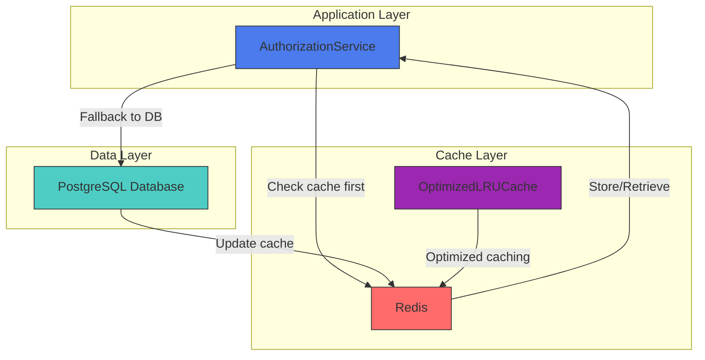

# Authorization Layer Caching

<cite>
**Referenced Files in This Document**   
- [permissions.ts](file://packages\auth\src\permissions.ts) - *Updated in recent commit*
- [redis.ts](file://packages\auth\src\redis.ts) - *Updated in recent commit*
- [optimized-lru-cache.ts](file://packages\audit-db\src\cache\optimized-lru-cache.ts) - *Added in recent commit*
- [cache-factory.ts](file://packages\audit-db\src\cache\cache-factory.ts) - *Added in recent commit*
</cite>

## Update Summary
**Changes Made**   
- Updated Cache Architecture section to reflect new LRU cache implementation
- Added Cache Optimization Strategies section for new optimized LRU cache
- Updated Cache Invalidation Methods to include pattern-based invalidation
- Added new section on Cache Metrics and Monitoring
- Updated references to include new cache implementation files

## Table of Contents
1. [Introduction](#introduction)
2. [Cache Architecture](#cache-architecture)
3. [Cache Optimization Strategies](#cache-optimization-strategies)
4. [Permission Caching](#permission-caching)
5. [Role Management Caching](#role-management-caching)
6. [Cache Key Structure](#cache-key-structure)
7. [Cache Invalidation Methods](#cache-invalidation-methods)
8. [Cache Metrics and Monitoring](#cache-metrics-and-monitoring)
9. [Integration Patterns](#integration-patterns)
10. [Practical Examples](#practical-examples)
11. [Troubleshooting Guide](#troubleshooting-guide)

## Introduction
The Authorization Layer Caching system is designed to optimize permission and role-based access control operations by reducing database queries and improving response times. This caching layer sits between the authentication system and data storage, providing fast access to frequently requested authorization data while maintaining consistency through proper invalidation strategies.

The system implements a Redis-based caching solution that stores both permission evaluations and role definitions, with configurable retention periods and fallback mechanisms to ensure reliability even during cache failures.

**Section sources**
- [permissions.ts](file://packages\auth\src\permissions.ts#L1-L50)

## Cache Architecture
The authorization caching system follows a multi-layer architecture with Redis as the primary caching backend. The system is initialized through the AuthorizationService class, which receives both database and Redis connections during instantiation.

The recent refactoring in audit-db has introduced optimized caching strategies that influence the authorization caching approach, particularly in terms of LRU cache implementation and memory management.



**Diagram sources**
- [permissions.ts](file://packages\auth\src\permissions.ts#L25-L35)
- [redis.ts](file://packages\auth\src\redis.ts#L25-L45)
- [optimized-lru-cache.ts](file://packages\audit-db\src\cache\optimized-lru-cache.ts#L1-L50)

**Section sources**
- [permissions.ts](file://packages\auth\src\permissions.ts#L25-L50)
- [redis.ts](file://packages\auth\src\redis.ts#L25-L50)
- [optimized-lru-cache.ts](file://packages\audit-db\src\cache\optimized-lru-cache.ts#L1-L100)

## Cache Optimization Strategies
The recent refactoring has introduced an optimized LRU cache implementation that addresses performance issues identified in previous versions. The new OptimizedLRUCache class provides O(1) operations for get, set, and delete operations through a combination of HashMap and Doubly Linked List data structures.

Key optimization features include:
- O(1) time complexity for all core operations
- Memory usage tracking and size-based eviction
- TTL-based expiration with periodic cleanup
- Detailed metrics collection for monitoring
- Configurable size limits and cleanup intervals

The cache configuration includes:
- `maxSizeMB`: Maximum cache size in megabytes
- `defaultTTL`: Default time-to-live for cached entries
- `keyPrefix`: Prefix for cache keys
- `maxKeys`: Maximum number of keys to store
- `cleanupInterval`: Interval for expired entry cleanup

**Section sources**
- [optimized-lru-cache.ts](file://packages\audit-db\src\cache\optimized-lru-cache.ts#L1-L200)
- [cache-factory.ts](file://packages\audit-db\src\cache\cache-factory.ts#L1-L50)

## Permission Caching
Permission caching is implemented through the `hasPermission` method in the AuthorizationService class. The system uses a two-tier approach to determine user permissions, first checking the cache before falling back to database queries.

The cache key for permission checks follows the pattern: `authz:permissions:{userId}:{resource}:{action}:{context}`. Each permission evaluation result is cached for 5 minutes (300 seconds) to balance performance with freshness of data.

When checking permissions, the system evaluates multiple factors:
- System-level roles (user, admin)
- Organization-level roles (org:member, org:admin, org:owner)
- Role inheritance hierarchies
- Resource-specific conditions and ownership


**Diagram sources**
- [permissions.ts](file://packages\auth\src\permissions.ts#L161-L210)

**Section sources**
- [permissions.ts](file://packages\auth\src\permissions.ts#L150-L250)

## Role Management Caching
Role definitions are cached to avoid repeated database queries when evaluating permissions. The system implements a role caching mechanism with the prefix `authz:roles:` followed by the role name.

Default roles are initialized during service startup and stored in Redis:
- System roles: user, admin
- Organization roles: org:member, org:admin, org:org:owner

The system supports custom role creation through the `addRole` method, which stores the role definition in both Redis and the database. Role retrieval first checks the cache, and if not found, queries the database and populates the cache.


**Diagram sources**
- [permissions.ts](file://packages\auth\src\permissions.ts#L10-L60)

**Section sources**
- [permissions.ts](file://packages\auth\src\permissions.ts#L50-L150)

## Cache Key Structure
The authorization caching system uses a consistent naming convention for cache keys to ensure predictability and avoid collisions. Two primary cache key patterns are used:

1. **Role Cache Keys**: `authz:roles:{roleName}`
   - Used for storing role definitions
   - Example: `authz:roles:org:admin`

2. **Permission Cache Keys**: `authz:permissions:{userId}:{resource}:{action}:{context}`
   - Used for storing permission evaluation results
   - Example: `authz:permissions:user-123:audit.events:read:{}`
   - The context is serialized as JSON and included in the key

The system uses the following constants for cache key prefixes:
- `roleCachePrefix = 'authz:roles:'`
- `permissionCachePrefix = 'authz:permissions:'`
- `retentionPeriod = 300` (5 minutes)

**Section sources**
- [permissions.ts](file://packages\auth\src\permissions.ts#L20-L25)

## Cache Invalidation Methods
The system implements several cache invalidation strategies to maintain data consistency:

### User-Specific Cache Clearing
The `clearUserCache` method removes all permission cache entries for a specific user. This is useful when a user's role or permissions change.


### Complete Cache Clearing
The `clearCache` method removes all permission cache entries. This is typically used during system maintenance or when widespread permission changes occur.

### Pattern-Based Invalidation
The optimized LRU cache implementation supports pattern-based invalidation through the `invalidate` method, which uses regex pattern matching to remove multiple cache entries at once.

### Automatic Expiration
All permission cache entries use Redis's SETEX command with a 5-minute expiration period. This ensures that even if invalidation fails, the cache will eventually refresh from the source data.

### Write-Through Caching
When roles are added or removed, the cache is updated immediately:
- `addRole`: Sets the role in Redis and database
- `removeRole`: Deletes from Redis and database

**Section sources**
- [permissions.ts](file://packages\auth\src\permissions.ts#L439-L488)
- [optimized-lru-cache.ts](file://packages\audit-db\src\cache\optimized-lru-cache.ts#L300-L350)

## Cache Metrics and Monitoring
The optimized LRU cache implementation provides comprehensive metrics for monitoring cache performance and health. The system tracks various statistics including:

- Total operations and hit/miss ratios
- Memory usage and eviction counts
- Average operation time
- Key count and average node size

These metrics can be accessed through the `getDetailedMetrics` method, which returns a comprehensive set of cache statistics for monitoring and optimization purposes.

```typescript
const cache = createOptimizedLRUCache({
  maxSizeMB: 100,
  defaultTTL: 300,
  keyPrefix: 'authz',
  enabled: true,
  maxKeys: 10000,
  cleanupInterval: 60000
});

const metrics = cache.getDetailedMetrics();
console.log('Cache hit ratio:', metrics.hitRatio);
console.log('Memory usage:', metrics.sizeMB, 'MB');
console.log('Average operation time:', metrics.avgOperationTime, 'ms');
```

**Section sources**
- [optimized-lru-cache.ts](file://packages\audit-db\src\cache\optimized-lru-cache.ts#L400-L500)

## Integration Patterns
The authorization caching system integrates with the broader application through several patterns:

### Service Initialization
The AuthorizationService is initialized with database and Redis connections, typically during application startup:

```typescript
const authService = createAuthorizationService(db, redis);
```

### Permission Checking
Applications check permissions through the `hasPermission` method, which handles all caching internally:

```typescript
const canReadEvents = await authService.hasPermission(
  session,
  'audit.events',
  'read'
);
```

### Role Management
Custom roles can be added and removed through the service interface:

```typescript
await authService.addRole({
  name: 'custom-role',
  permissions: [{ resource: 'custom.resource', action: 'read' }]
});
```

**Section sources**
- [permissions.ts](file://packages\auth\src\permissions.ts#L150-L500)
- [auth.ts](file://packages\auth\src\auth.ts#L100-L150)

## Practical Examples
### Checking User Permissions
```typescript
// In your application code
const session = getCurrentSession();
const canCreateEvent = await authService.hasPermission(
  session,
  'audit.events',
  'create'
);

if (canCreateEvent) {
  // Allow event creation
} else {
  // Show permission denied message
}
```

### Adding Custom Organization Role
```typescript
// Create a custom role for compliance officers
await authService.addRole({
  name: 'org:compliance-officer',
  permissions: [
    { resource: 'audit.events', action: 'read' },
    { resource: 'audit.reports', action: 'create' },
    { resource: 'audit.alerts', action: 'resolve' }
  ]
});
```

### Clearing Cache After Role Change
```typescript
// After updating a user's role
await updateUsersRole(userId, newRole);
// Clear their permission cache
await authService.clearUserCache(userId);
```

**Section sources**
- [permissions.ts](file://packages\auth\src\permissions.ts#L500-L600)
- [auth.ts](file://packages\auth\src\auth.ts#L200-L300)

## Troubleshooting Guide
### Cache Not Updating
If permission changes are not reflected immediately, remember that cache entries expire after 5 minutes. For immediate updates, clear the user's cache:

```typescript
await authService.clearUserCache(userId);
```

### Redis Connection Issues
Monitor Redis connection status using the provided utility:

```typescript
const status = getRedisConnectionStatus();
console.log('Redis status:', status);
```

Common connection statuses:
- `uninitialized`: Connection not yet established
- `connecting`: Attempting to connect
- `ready`: Connected and ready
- `reconnecting`: Attempting to reconnect
- `close`: Connection closed

### Performance Monitoring
The system logs cache operations and errors:
- `[RedisClient] Successfully connected to Redis.` - Connection established
- `[RedisClient] Redis Connection Error` - Connection issues
- `Failed to store permission cache` - Cache write failures

For high-volume environments, monitor Redis memory usage and consider adjusting the retention period based on your application's permission change frequency. Utilize the cache metrics system to identify performance bottlenecks and optimize cache configuration.

**Section sources**
- [redis.ts](file://packages\auth\src\redis.ts#L100-L130)
- [permissions.ts](file://packages\auth\src\permissions.ts#L190-L200)
- [optimized-lru-cache.ts](file://packages\audit-db\src\cache\optimized-lru-cache.ts#L400-L500)