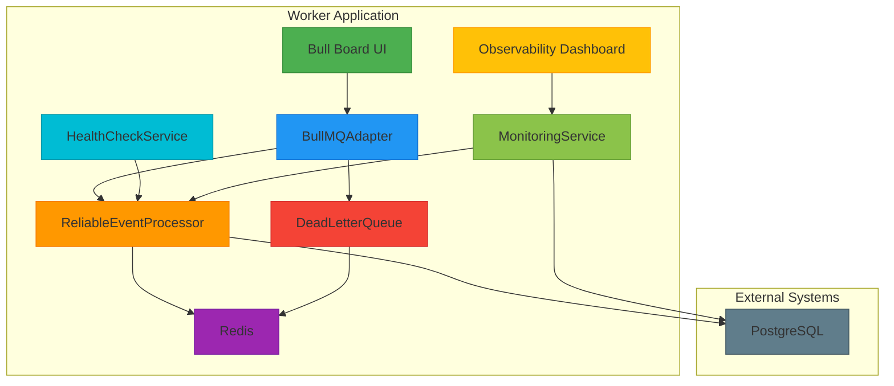
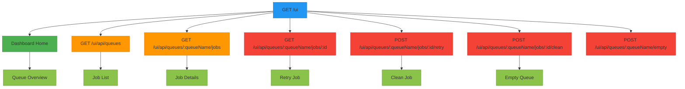
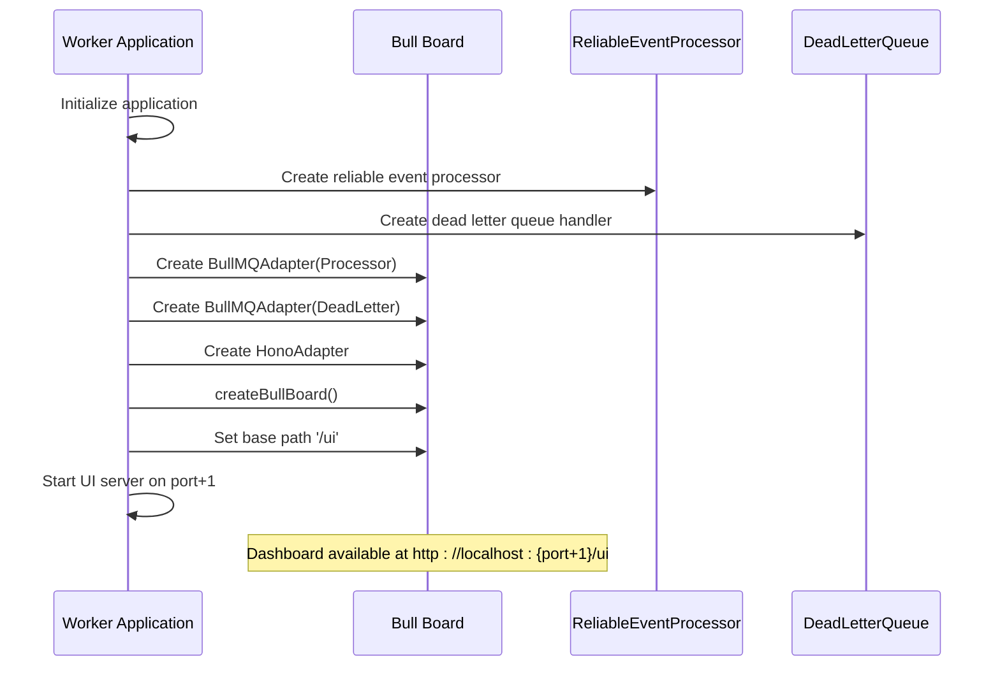

# Bull Board Integration

<cite>
**Referenced Files in This Document**   
- [index.ts](file://apps/worker/src/index.ts)
- [package.json](file://apps/worker/package.json)
- [dashboard.ts](file://packages/audit/src/observability/dashboard.ts)
</cite>

## Table of Contents
1. [Introduction](#introduction)
2. [Architecture Overview](#architecture-overview)
3. [Implementation Details](#implementation-details)
4. [API Interfaces](#api-interfaces)
5. [Integration Patterns](#integration-patterns)
6. [Practical Examples](#practical-examples)
7. [Troubleshooting Guide](#troubleshooting-guide)

## Introduction
Bull Board Integration provides a comprehensive monitoring and management interface for the BullMQ queue system within the Smart Logs application. This integration enables real-time visibility into queue operations, job processing, and system health metrics. The implementation combines Bull Board with custom observability components to create a robust monitoring solution for audit event processing.

The integration is specifically implemented in the worker application, where it monitors the reliable event processor and dead letter queue. This documentation covers the complete integration, including setup, configuration, API interfaces, and troubleshooting guidance.

## Architecture Overview
The Bull Board Integration is part of the worker application's observability layer, providing a web-based dashboard for monitoring queue operations. The architecture follows a multi-layered approach with clear separation of concerns between the queue processing system and the monitoring interface.



**Diagram sources**
- [index.ts](file://apps/worker/src/index.ts)

## Implementation Details
The Bull Board Integration is implemented in the worker application's main entry point, where it's configured to monitor both the primary reliable event processor queue and the dead letter queue. The integration uses the official Bull Board packages with Hono framework support.

The implementation creates a separate server instance on a different port (worker port + 1) to serve the Bull Board UI, ensuring that monitoring traffic doesn't interfere with the main application's health check endpoints. The integration uses the BullMQAdapter to connect to the queue instances and the HonoAdapter to serve the web interface.

Key implementation aspects include:
- Dual queue monitoring (reliable processor and dead letter queue)
- Separate server instance on incremented port
- Integration with the application's logging system
- Real-time queue status visualization
- Job management capabilities (clean, retry, etc.)

**Section sources**
- [index.ts](file://apps/worker/src/index.ts)

## API Interfaces
The Bull Board Integration provides a web-based interface for monitoring and managing queue operations. While Bull Board itself doesn't expose a traditional API, it provides several endpoints through the Hono server for dashboard functionality.

The integration exposes the following endpoints:



**Diagram sources**
- [index.ts](file://apps/worker/src/index.ts)

## Integration Patterns
The Bull Board Integration follows several key patterns for effective queue monitoring:

1. **Separate Monitoring Server**: The integration creates a dedicated server instance for the dashboard, running on a different port from the main application. This ensures that monitoring operations don't impact the primary application's performance.

2. **Dual Queue Monitoring**: Both the reliable event processor queue and the dead letter queue are monitored, providing comprehensive visibility into all job processing states.

3. **Real-time Updates**: The dashboard provides real-time updates on queue status, job processing, and system health metrics.

4. **Integrated Health Checks**: The integration works alongside the application's health check system, providing both high-level health status and detailed queue metrics.

5. **Centralized Configuration**: The integration is configured through the application's main entry point, ensuring consistent setup across environments.

The integration pattern demonstrates best practices for monitoring queue-based systems, providing both operational visibility and management capabilities.

**Section sources**
- [index.ts](file://apps/worker/src/index.ts)

## Practical Examples
### Basic Integration Setup
The Bull Board Integration is set up in the worker application's main entry point:



**Diagram sources**
- [index.ts](file://apps/worker/src/index.ts)

### Configuration Example
The integration is configured with the following key components:

```typescript
// Create Bull Board UI adapter
const ui = new Hono()
const uiServerAdapter = new HonoAdapter(serveStatic)

// Configure Bull Board with queues
createBullBoard({
    queues: [
        new BullMQAdapter(reliableProcessor.getQueue()),
        new BullMQAdapter(reliableProcessor.getDeadLetterHandler().getQueue()),
    ],
    serverAdapter: uiServerAdapter,
})

// Set base path and register plugin
const basePath = '/ui'
uiServerAdapter.setBasePath(basePath)
ui.route(basePath, uiServerAdapter.registerPlugin())

// Start UI server
const uiServer = serve({ fetch: ui.fetch, port: config.worker.port + 1 }, ({ address, port }) => {
    logger.info(`🎮 Bull Dashboard on http://localhost:${port}/ui`)
})
```

This configuration creates a comprehensive monitoring interface accessible at `/ui` on the incremented port.

**Section sources**
- [index.ts](file://apps/worker/src/index.ts)

## Troubleshooting Guide
### Common Issues and Solutions

#### Dashboard Not Accessible
**Symptoms:**
- Unable to access the Bull Board dashboard
- Connection refused errors
- Timeout when accessing the UI

**Solutions:**
1. Verify the worker application is running:
```bash
# Check if worker process is running
ps aux | grep worker

# Check application logs
docker logs audit-worker --tail 100
```

2. Verify the UI server port is available:
```bash
# Check if port is in use
netstat -an | grep <port+1>

# Test connection to UI server
curl http://localhost:<port+1>/ui
```

3. Check the application startup logs for Bull Board initialization:
```bash
# Look for Bull Board startup message
grep "Bull Dashboard" worker.log
# Expected: "🎮 Bull Dashboard on http://localhost:{port}/ui"
```

#### Queue Monitoring Issues
**Symptoms:**
- Queue depth not updating
- Job processing metrics not visible
- Incomplete queue information

**Solutions:**
1. Verify Redis connection:
```bash
# Check Redis connection status
redis-cli -h redis-host -p 6379 PING

# Check queue depth directly
redis-cli -h redis-host -p 6379 LLEN audit-events
```

2. Verify queue configuration:
```bash
# Check for stalled jobs
redis-cli -h redis-host -p 6379 ZRANGE "bull:audit-events:stalled" 0 -1

# Check failed jobs
redis-cli -h redis-host -p 6379 LLEN audit-events-failed
```

3. Restart stalled workers:
```bash
# Clean stalled jobs
curl -X POST http://worker:3001/admin/queue/clean-stalled

# Or via Redis CLI
redis-cli -h redis-host -p 6379 DEL "bull:audit-events:stalled"
```

#### Performance Issues
**Symptoms:**
- Dashboard loading slowly
- High latency in queue operations
- Resource utilization spikes

**Solutions:**
1. Monitor system resources:
```bash
# Memory and CPU usage
docker stats audit-worker

# Redis performance
redis-cli -h redis-host -p 6379 INFO stats
```

2. Check queue metrics:
```bash
# Queue metrics
curl http://worker:3001/observability/metrics | grep queue

# Performance dashboard
curl http://worker:3001/observability/dashboard
```

3. Optimize queue configuration:
```json
{
  "reliableProcessor": {
    "maxStalledCount": 1,
    "stalledInterval": 30000,
    "concurrency": 20
  }
}
```

**Section sources**
- [index.ts](file://apps/worker/src/index.ts)
- [faq.md](file://apps/worker/docs/faq.md)
- [troubleshooting.md](file://apps/worker/docs/troubleshooting.md)