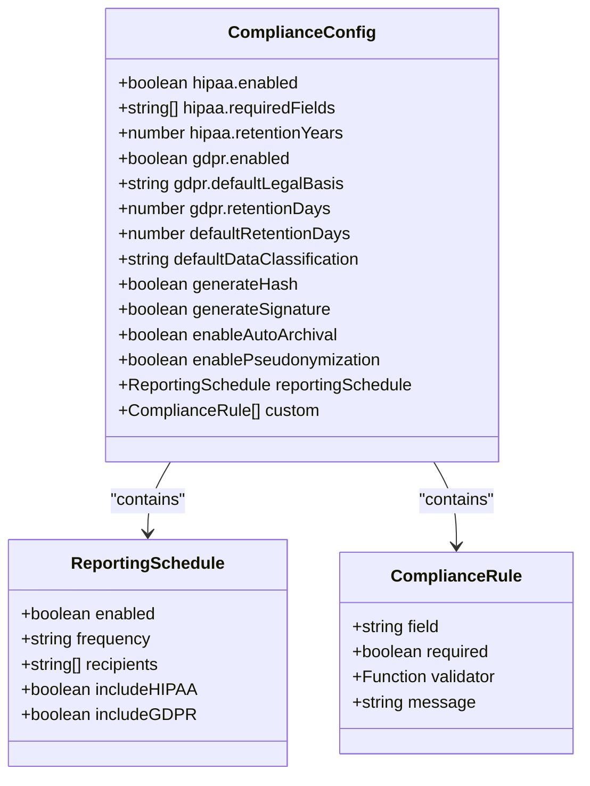
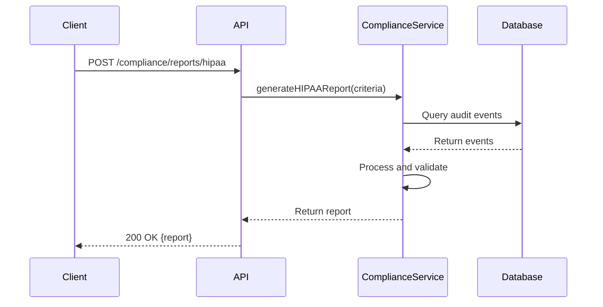
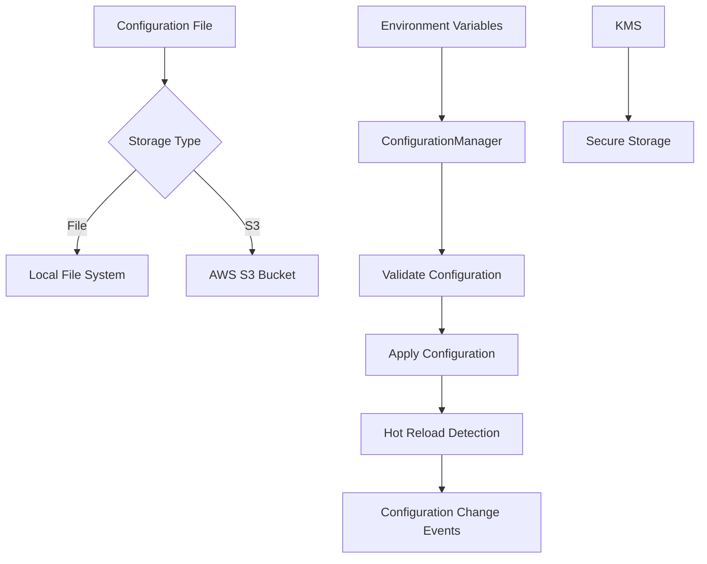

# Compliance Configuration

<cite>
**Referenced Files in This Document**   
- [compliance.ts](file://apps/server/src/lib/graphql/resolvers/compliance.ts)
- [compliance.ts](file://apps/server/src/routers/compliance.ts)
- [compliance-api.ts](file://apps/server/src/routes/compliance-api.ts)
- [compliance-reporting.ts](file://packages/audit/src/report/compliance-reporting.ts)
- [compliance.test.ts](file://packages/audit-client/src/services/compliance.ts)
- [types.ts](file://packages/audit/src/config/types.ts) - *Updated in recent commit*
- [manager.ts](file://packages/audit/src/config/manager.ts) - *Updated in recent commit*
- [factory.ts](file://packages/audit/src/config/factory.ts) - *Updated in recent commit*
- [configuration.md](file://packages/audit-db/docs/getting-started/configuration.md)
- [healthcare-compliance.md](file://packages/audit/docs/tutorials/healthcare-compliance.md)
- [compliance-features.md](file://apps/docs/src/content/docs/audit/compliance-features.md)
- [monitoring.md](file://apps/worker/docs/tutorials/monitoring.md)
- [faq.md](file://apps/worker/docs/faq.md)
</cite>

## Update Summary
- Added KMS encryption support in configuration manager
- Updated secure storage configuration options
- Enhanced configuration security with KMS integration
- Added secure configuration storage settings
- Updated configuration manager initialization with secure storage options

## Table of Contents
1. [Introduction](#introduction)
2. [Configuration Structure](#configuration-structure)
3. [HIPAA Configuration](#hipaa-configuration)
4. [GDPR Configuration](#gdpr-configuration)
5. [API Interfaces](#api-interfaces)
6. [Integration Patterns](#integration-patterns)
7. [Practical Examples](#practical-examples)
8. [Troubleshooting Guide](#troubleshooting-guide)
9. [Best Practices](#best-practices)

## Introduction
The Compliance Configuration system provides comprehensive support for regulatory compliance requirements, specifically HIPAA and GDPR. This documentation details the configuration options, API interfaces, and integration patterns for implementing compliance features in audit logging systems. The system enables organizations to meet legal requirements for data protection, privacy, and security through configurable policies, automated reporting, and data subject rights management.

## Configuration Structure

The compliance configuration system is built around a hierarchical structure that allows for granular control over compliance features. The core configuration interface defines the structure for both HIPAA and GDPR compliance settings, along with default retention policies and reporting schedules.



**Diagram sources**
- [types.ts](file://packages/audit/src/config/types.ts#L613-L673)

**Section sources**
- [types.ts](file://packages/audit/src/config/types.ts#L613-L673)
- [manager.ts](file://packages/audit/src/config/manager.ts#L0-L799)

## HIPAA Configuration

HIPAA configuration enables healthcare organizations to meet the requirements of the Health Insurance Portability and Accountability Act for protecting electronic Protected Health Information (ePHI). The configuration includes settings for audit controls, access management, and data integrity.

### Configuration Options

The HIPAA compliance configuration includes the following key parameters:

```json
{
  "compliance": {
    "hipaa": {
      "enabled": true,
      "baaCompliant": true,
      "auditLogging": {
        "detailedAuditing": true,
        "retentionYears": 6,
        "immutableLogs": true
      },
      "accessControls": {
        "minimumAccess": true,
        "sessionTimeouts": true,
        "automaticLogoff": true
      }
    }
  }
}
```

Key configuration options include:
- **enabled**: Enables HIPAA compliance features
- **baaCompliant**: Indicates Business Associate Agreement compliance
- **retentionYears**: Specifies the number of years to retain audit logs (minimum 6 years as required by HIPAA)
- **detailedAuditing**: Enables detailed audit trail recording
- **immutableLogs**: Ensures audit logs cannot be modified or deleted

### Required Fields and Validation

The system validates that all HIPAA-required fields are present in audit events:

```typescript
const requiredFields = ['principalId', 'action', 'targetResourceType', 'sessionContext']
```

For PHI (Protected Health Information) access, additional validation ensures compliance with the "Minimum Necessary" standard, requiring documented access reasons and justification for the minimum necessary information.

**Section sources**
- [configuration.md](file://packages/audit-db/docs/getting-started/configuration.md#L561-L635)
- [healthcare-compliance.md](file://packages/audit/docs/tutorials/healthcare-compliance.md#L284-L338)
- [faq.md](file://apps/worker/docs/faq.md#L551-L607)

## GDPR Configuration

GDPR configuration implements the requirements of the General Data Protection Regulation for processing personal data of individuals in the European Union. The system supports data subject rights, lawful processing, and privacy by design principles.

### Configuration Options

The GDPR compliance configuration includes comprehensive settings for data protection:

```json
{
  "compliance": {
    "gdpr": {
      "enabled": true,
      "lawfulBasis": "consent",
      "dataProcessing": {
        "purposes": ["audit", "compliance", "security"],
        "retentionPolicy": {
          "defaultDays": 1095,
          "personalDataDays": 730,
          "auditLogsDays": 2555
        }
      },
      "dataSubjectRights": {
        "rightToAccess": true,
        "rightToRectification": true,
        "rightToErasure": true,
        "rightToPortability": true,
        "rightToRestriction": true
      },
      "privacy": {
        "pseudonymization": true,
        "encryption": true,
        "accessControls": true,
        "dataMinimization": true
      },
      "breachNotification": {
        "enabled": true,
        "timeoutHours": 72,
        "supervisoryAuthority": "data-protection@company.com",
        "dataSubjects": true
      }
    }
  }
}
```

### Data Classification and Retention

The system supports data classification and retention policies based on data sensitivity:

```typescript
export const gdprConfig = {
  compliance: {
    gdprEnabled: true,
    dataClassification: {
      personalData: ['patient_id', 'name', 'email', 'phone'],
      sensitiveData: ['medical_record', 'diagnosis', 'treatment'],
      publicData: ['timestamp', 'action', 'status']
    },
    retentionPolicies: {
      personal_data: 2555,
      sensitive_data: 2555,
      public_data: 3650
    }
  }
}
```

**Section sources**
- [monitoring.md](file://apps/worker/docs/tutorials/monitoring.md#L722-L764)
- [configuration.md](file://packages/audit-db/docs/getting-started/configuration.md#L561-L635)

## API Interfaces

The compliance system provides REST and TRPC APIs for generating reports, managing data subject rights, and retrieving compliance information.

### Report Generation API

The system exposes endpoints for generating HIPAA and GDPR compliance reports:



**Diagram sources**
- [compliance-api.ts](file://apps/server/src/routes/compliance-api.ts#L275-L321)
- [compliance.ts](file://apps/server/src/routers/compliance.ts#L0-L291)

### Compliance Report Schema

The API defines structured schemas for compliance reports:

```typescript
const GDPRComplianceReportSchema = ComplianceReportSchema.extend({
	reportType: z.literal('GDPR_PROCESSING_ACTIVITIES'),
	gdprSpecific: z.object({
		personalDataEvents: z.number(),
		dataSubjectRights: z.number(),
		consentEvents: z.number(),
		dataBreaches: z.number(),
		crossBorderTransfers: z.number(),
		retentionViolations: z.number(),
	}),
	legalBasisBreakdown: z.record(z.string(), z.number()),
	dataSubjectRights: z.object({
		accessRequests: z.number(),
		rectificationRequests: z.number(),
		erasureRequests: z.number(),
		portabilityRequests: z.number(),
		objectionRequests: z.number(),
	}),
})
```

**Section sources**
- [compliance-api.ts](file://apps/server/src/routes/compliance-api.ts#L275-L321)
- [compliance.ts](file://apps/server/src/routers/compliance.ts#L0-L291)

## Integration Patterns

The compliance system can be integrated into applications through various patterns, including direct configuration, API calls, and client libraries.

### Configuration Management

The ConfigurationManager class provides a centralized way to manage compliance configuration:



The system supports hot reloading of configuration changes and maintains a change history for audit purposes.

**Section sources**
- [manager.ts](file://packages/audit/src/config/manager.ts#L0-L799)
- [types.ts](file://packages/audit/src/config/types.ts#L552-L609)
- [factory.ts](file://packages/audit/src/config/factory.ts#L83-L134)

## Practical Examples

### HIPAA Compliance Implementation

Implementing HIPAA compliance for patient data access:

```typescript
import { EnhancedAuditDb } from '@repo/audit-db'

class HIPAAComplianceLogger {
  private client: EnhancedAuditDb
  
  constructor() {
    this.client = new EnhancedAuditDb({
      compliance: {
        hipaaEnabled: true,
        integrityVerification: true,
        auditIntegrityChecks: true,
        retentionPolicies: {
          patient_data: 2555,
          audit_logs: 2555,
          access_logs: 2555
        }
      }
    })
  }
  
  async logPatientDataAccess({
    providerId,
    patientId,
    dataElements,
    accessReason,
    minimumNecessary = true
  }: HIPAAAccessEvent) {
    return await this.client.query(
      `INSERT INTO audit_log (timestamp, action, status, principal_id, 
       principal_type, resource_id, resource_type, source_ip, metadata) 
       VALUES ($1, $2, $3, $4, $5, $6, $7, $8, $9) RETURNING *`,
      [
        new Date().toISOString(),
        'hipaa.patient_data.access',
        'success',
        providerId,
        'healthcare_provider',
        patientId,
        'patient_record',
        this.getClientIP(),
        JSON.stringify({
          dataElements,
          accessReason,
          minimumNecessary,
          hipaaCompliant: true,
          patientConsent: await this.verifyPatientConsent(patientId),
          businessAssociateAccess: false,
          emergencyAccess: accessReason === 'emergency',
          auditTrailIntegrity: true
        })
      ]
    )
  }
}
```

### GDPR Data Subject Rights

Handling GDPR data subject rights requests:

```typescript
class GDPRComplianceManager {
  private client: EnhancedAuditDb
  
  async processDataSubjectAccessRequest({
    dataSubjectId,
    requestId,
    requestType,
    dataCategories
  }: GDPRRequest) {
    await this.client.query(
      `INSERT INTO audit_log (timestamp, action, status, principal_id, 
       resource_id, metadata) VALUES ($1, $2, $3, $4, $5, $6)`,
      [
        new Date().toISOString(),
        `gdpr.data_subject.${requestType}`,
        'success',
        dataSubjectId,
        requestId,
        JSON.stringify({
          requestType,
          dataCategories,
          legalBasis: 'data_subject_rights',
          processingLawfulness: true,
          gdprArticle: this.getGDPRArticle(requestType),
          responseTimeLimit: this.getResponseTimeLimit(requestType),
          requestTimestamp: new Date().toISOString()
        })
      ]
    )
    
    switch (requestType) {
      case 'access':
        return await this.handleAccessRequest(dataSubjectId, dataCategories)
      case 'rectification':
        return await this.handleRectificationRequest(dataSubjectId, dataCategories)
      case 'erasure':
        return await this.handleErasureRequest(dataSubjectId, dataCategories)
      case 'portability':
        return await this.handlePortabilityRequest(dataSubjectId, dataCategories)
    }
  }
}
```

**Section sources**
- [compliance-features.md](file://apps/docs/src/content/docs/audit/compliance-features.md#L0-L799)

## Troubleshooting Guide

### Common Issues and Solutions

#### HIPAA Compliance Issues

**Issue**: Missing required fields in audit events
- **Symptom**: Validation errors when generating HIPAA reports
- **Solution**: Ensure all required fields are present in audit events:
  - `principalId`: Unique identifier of the user or system
  - `action`: Specific action performed
  - `targetResourceType`: Type of resource accessed
  - `sessionContext`: Context of the user session

**Issue**: Insufficient minimum necessary justification
- **Symptom**: Compliance violations for PHI access
- **Solution**: Implement proper justification in metadata:
```json
{
  "complianceContext": {
    "accessReason": "treatment",
    "minimumNecessaryJustification": "Accessing only diagnosis and treatment data"
  }
}
```

#### GDPR Compliance Issues

**Issue**: Data subject erasure requests failing
- **Symptom**: Erasure requests rejected due to legal holds
- **Solution**: Check for legal obligations before processing:
```typescript
private async verifyErasureRights(dataSubjectId: string): Promise<boolean> {
  const legalHolds = await this.client.query(
    'SELECT * FROM legal_holds WHERE data_subject_id = $1 AND active = true',
    [dataSubjectId]
  )
  return legalHolds.length === 0
}
```

**Issue**: Consent management not properly recorded
- **Symptom**: Missing consent audit trail
- **Solution**: Ensure all consent changes are logged:
```typescript
await this.client.query(
  `INSERT INTO audit_log (timestamp, action, status, principal_id, 
   principal_type, metadata) VALUES ($1, $2, $3, $4, $5, $6)`,
  [
    new Date().toISOString(),
    'gdpr.consent.change',
    'success',
    dataSubjectId,
    'data_subject',
    JSON.stringify({
      consentType: 'marketing',
      granted: false,
      purpose: 'email marketing',
      legalBasis: 'consent',
      consentMethod: 'explicit',
      withdrawable: true
    })
  ]
)
```

**Section sources**
- [compliance-features.md](file://apps/docs/src/content/docs/audit/compliance-features.md#L0-L799)
- [healthcare-compliance.md](file://packages/audit/docs/tutorials/healthcare-compliance.md#L284-L338)

## Best Practices

### Configuration Management

1. **Environment Separation**: Maintain separate configurations for development, staging, and production environments
2. **Secure Storage**: Use KMS or secure storage for sensitive configuration data
3. **Version Control**: Track configuration changes with versioning and change history
4. **Validation**: Validate configuration before applying to prevent invalid settings

### Implementation Guidelines

1. **Data Minimization**: Collect only the data necessary for the specific purpose
2. **Purpose Limitation**: Clearly define and document data processing purposes
3. **Storage Limitation**: Implement automatic data retention policies
4. **Integrity Verification**: Regularly verify the integrity of audit logs
5. **Access Controls**: Implement role-based access controls with minimum necessary principle

### Monitoring and Reporting

1. **Automated Reports**: Schedule regular compliance reports
2. **Breach Detection**: Implement automated breach detection and notification
3. **Audit Trail**: Maintain comprehensive audit trails of all compliance-related activities
4. **Performance Monitoring**: Monitor the performance of compliance features to ensure they don't impact system performance

**Section sources**
- [configuration.md](file://packages/audit-db/docs/getting-started/configuration.md#L561-L635)
- [compliance-features.md](file://apps/docs/src/content/docs/audit/compliance-features.md#L0-L799)