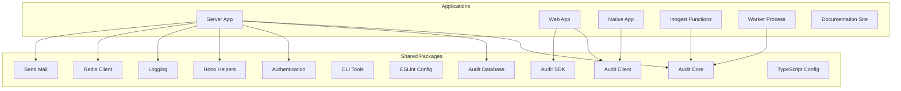
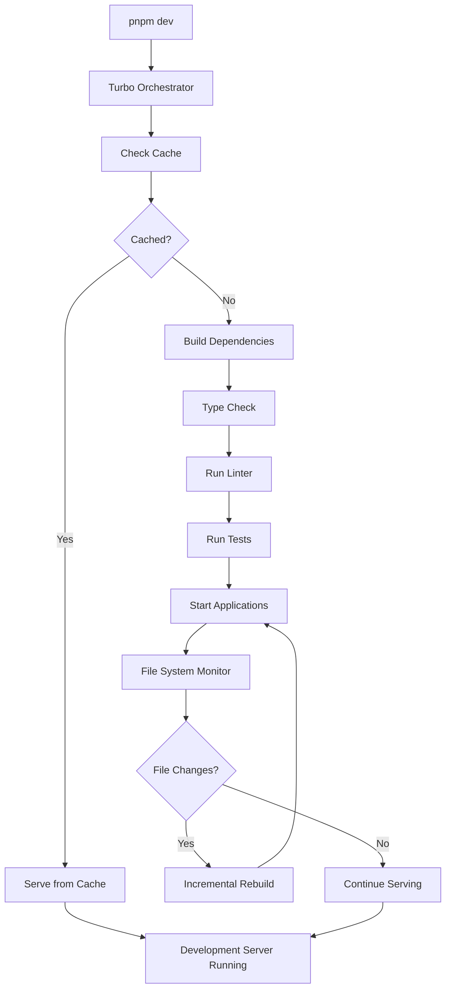
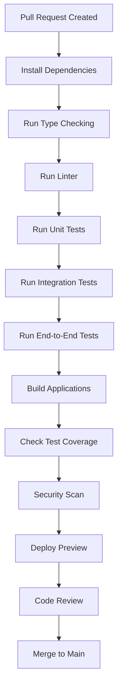

# Contributing Guide

<cite>
**Referenced Files in This Document**   
- [CONTRIBUTING.md](file://CONTRIBUTING.md)
- [package.json](file://package.json)
- [turbo.json](file://turbo.json)
- [pnpm-workspace.yaml](file://pnpm-workspace.yaml)
- [apps/server/package.json](file://apps/server/package.json)
- [apps/web/package.json](file://apps/web/package.json)
- [apps/native/package.json](file://apps/native/package.json)
- [apps/inngest/package.json](file://apps/inngest/package.json)
- [apps/docs/package.json](file://apps/docs/package.json)
- [apps/worker/package.json](file://apps/worker/package.json)
- [packages/audit/package.json](file://packages/audit/package.json)
- [packages/audit-client/package.json](file://packages/audit-client/package.json)
- [packages/audit-db/package.json](file://packages/audit-db/package.json)
- [packages/audit-sdk/package.json](file://packages/audit-sdk/package.json)
- [packages/auth/package.json](file://packages/auth/package.json)
- [packages/cli/package.json](file://packages/cli/package.json)
- [packages/eslint-config/package.json](file://packages/eslint-config/package.json)
- [packages/hono-helpers/package.json](file://packages/hono-helpers/package.json)
- [packages/logs/package.json](file://packages/logs/package.json)
- [packages/redis-client/package.json](file://packages/redis-client/package.json)
- [packages/send-mail/package.json](file://packages/send-mail/package.json)
- [packages/typescript-config/package.json](file://packages/typescript-config/package.json)
- [apps/docs/astro.config.mjs](file://apps/docs/astro.config.mjs) - *Updated in recent commit*
- [apps/docs/package.json](file://apps/docs/package.json) - *Updated in recent commit*
</cite>

## Update Summary
**Changes Made**   
- Updated documentation section to reflect recent changes in documentation tooling
- Added information about TypeDoc integration status and future plans
- Clarified the current state of API and type documentation generation
- Updated references to include newly relevant configuration files

## Table of Contents
1. [Introduction](#introduction)
2. [Development Environment Setup](#development-environment-setup)
3. [Monorepo Structure and Architecture](#monorepo-structure-and-architecture)
4. [Tool Configuration and Task Orchestration](#tool-configuration-and-task-orchestration)
5. [Code Organization and Naming Conventions](#code-organization-and-naming-conventions)
6. [Contribution Workflow](#contribution-workflow)
7. [Branching Strategy and Commit Guidelines](#branching-strategy-and-commit-guidelines)
8. [Code Quality and Testing](#code-quality-and-testing)
9. [Documentation Standards](#documentation-standards)
10. [Common Contribution Scenarios](#common-contribution-scenarios)

## Introduction

This guide provides comprehensive instructions for contributing to the Smart Logs project, a monorepo-based application designed for audit logging, compliance monitoring, and event tracking. The system follows modern development practices with a focus on maintainability, scalability, and developer experience. This document covers everything from initial setup to advanced contribution patterns, ensuring both new and experienced contributors can effectively participate in the project's development.

The project leverages a monorepo architecture powered by PNPM workspaces and Turbo for efficient task orchestration. It consists of multiple applications and shared packages that work together to provide a complete audit logging solution for enterprise environments.

**Section sources**
- [CONTRIBUTING.md](file://CONTRIBUTING.md#L1-L21)

## Development Environment Setup

To begin contributing to Smart Logs, you must first set up your local development environment. The project uses PNPM as its package manager and requires Node.js version 18 or higher.

### Prerequisites
- Node.js v18+
- PNPM v10+
- Git
- Docker (for database and service containers)

### Installation Steps
1. Clone the repository:
```bash
git clone https://github.com/joseantcordeiro/smart-logs.git
cd smart-logs
```

2. Install dependencies using PNPM:
```bash
pnpm install
```

3. Verify the installation by running the development server:
```bash
pnpm dev
```

The `pnpm install` command will bootstrap the entire monorepo, linking all workspace packages according to the configuration in `pnpm-workspace.yaml`. This file defines the workspace structure, including all applications under `apps/*` and shared packages under `packages/*`.

The root `package.json` contains the core development dependencies, including Turbo for task orchestration, TypeScript for type checking, and Prettier for code formatting. These tools are shared across all packages in the monorepo to ensure consistency.

**Section sources**
- [package.json](file://package.json#L1-L44)
- [pnpm-workspace.yaml](file://pnpm-workspace.yaml#L1-L10)

## Monorepo Structure and Architecture

The Smart Logs repository follows a monorepo architecture with a clear separation between applications and shared packages. This structure promotes code reuse, consistent tooling, and simplified dependency management.

### Application Layer
The `apps/` directory contains five distinct applications:

- **server**: The main backend API server built with Hono and GraphQL, handling audit events, compliance checks, and reporting
- **web**: A web interface for dashboard visualization and user interaction
- **native**: A React Native application for mobile access
- **inngest**: Background job processing and event-driven functions
- **worker**: Dedicated worker processes for intensive tasks
- **docs**: Documentation site built with Astro

### Shared Packages Layer
The `packages/` directory contains reusable libraries and utilities:

- **audit**: Core audit logic, event processing, and compliance features
- **audit-client**: Client library for interacting with the audit system
- **audit-db**: Database schema, migrations, and optimized queries using Drizzle ORM
- **audit-sdk**: SDK for integrating audit capabilities into external applications
- **auth**: Authentication and authorization services
- **cli**: Command-line interface tools
- **eslint-config**: Shared ESLint configuration
- **hono-helpers**: Utilities for Hono framework applications
- **logs**: Logging abstraction and utilities
- **redis-client**: Redis connection management
- **send-mail**: Email sending functionality
- **typescript-config**: Shared TypeScript configuration

This architecture enables independent development of applications while sharing common functionality through well-defined package interfaces.



**Diagram sources**
- [package.json](file://package.json#L1-L44)
- [pnpm-workspace.yaml](file://pnpm-workspace.yaml#L1-L10)

**Section sources**
- [package.json](file://package.json#L1-L44)
- [pnpm-workspace.yaml](file://pnpm-workspace.yaml#L1-L10)

## Tool Configuration and Task Orchestration

The Smart Logs project uses Turbo for efficient task orchestration across the monorepo. Turbo enables intelligent caching, parallel execution, and dependency-aware task running, significantly improving development workflow performance.

### Turbo Configuration
The `turbo.json` file defines the task pipeline with the following key tasks:

- **build**: Compiles TypeScript code with dependency awareness
- **dev**: Runs development servers with persistent processes
- **test**: Executes tests with proper build dependencies
- **check:lint**: Runs linting across the codebase
- **check-types**: Performs type checking
- **db:\***: Database management tasks (migrate, generate, studio, etc.)

The configuration specifies cache behavior and persistence for different task types. Development and database tasks are marked as non-cacheable and persistent, while build and test tasks leverage Turbo's caching for improved performance.

### PNPM Scripts
The root `package.json` exposes a comprehensive set of scripts that map to Turbo tasks:

```json
"scripts": {
  "dev": "turbo dev",
  "build": "tsc --build --verbose",
  "test": "turbo test",
  "check:lint": "turbo check-lint",
  "check-types": "turbo check-types",
  "db:migrate": "turbo -F server db:migrate",
  "db:studio": "turbo -F server db:studio"
}
```

The `-F` flag in some commands specifies a particular package or app to target, allowing granular control over task execution.

### Development Commands
Common development workflows include:

- `pnpm dev`: Start all development servers
- `pnpm dev:server`: Start only the server application
- `pnpm dev:web`: Start only the web application
- `pnpm test`: Run all tests across the monorepo
- `pnpm check-types`: Run type checking
- `pnpm db:studio`: Open Prisma Studio for database exploration



**Diagram sources**
- [turbo.json](file://turbo.json#L1-L62)
- [package.json](file://package.json#L1-L44)

**Section sources**
- [turbo.json](file://turbo.json#L1-L62)
- [package.json](file://package.json#L1-L44)

## Code Organization and Naming Conventions

The Smart Logs project follows consistent code organization patterns and naming conventions across all packages and applications.

### Directory Structure Patterns
Each application and package follows a similar structure:

- `src/`: Source code
- `src/__tests__/`: Test files (colocated with implementation)
- `src/lib/` or `src/utils/`: Utilities and helpers
- `src/types/`: Type definitions
- `src/middleware/`: Middleware functions (for server apps)
- `src/routers/` or `src/routes/`: API routes and handlers

### File Naming Conventions
- **Test files**: Suffix with `.test.ts` or `.test.tsx`
- **Type definitions**: Use `.types.ts` suffix
- **Configuration files**: Descriptive names like `drizzle.config.ts`
- **Entry points**: `index.ts` for package exports
- **Component files**: PascalCase for React components (e.g., `EventCalendar.tsx`)
- **Utility files**: Descriptive lowercase names (e.g., `date-utils.ts`)

### Code Style and Formatting
The project uses Prettier for code formatting with the `@ianvs/prettier-plugin-sort-imports` plugin to automatically sort imports. ESLint is configured through the shared `@repo/eslint-config` package, ensuring consistent linting rules across all code.

TypeScript configuration is standardized using the `@repo/typescript-config` package, which provides base configurations for different types of projects (libraries, React apps, etc.).

### API Design Patterns
The server application uses multiple API paradigms:
- **GraphQL**: For complex queries and relationships
- **REST**: For simple CRUD operations
- **tRPC**: For type-safe API calls
- **Hono**: As the underlying web framework

This multi-paradigm approach allows choosing the right tool for each use case while maintaining type safety and developer experience.

**Section sources**
- [apps/server/src/routers/](file://apps/server/src/routers/)
- [apps/server/src/routes/](file://apps/server/src/routes/)
- [packages/audit/src/](file://packages/audit/src/)
- [packages/eslint-config/](file://packages/eslint-config/)

## Contribution Workflow

The contribution workflow for Smart Logs follows a standard fork-branch-commit-pr process with specific tooling requirements.

### Fork and Clone
1. Fork the repository on GitHub
2. Clone your fork locally:
```bash
git clone https://github.com/your-username/smart-logs.git
```

### Creating a Feature Branch
Create a new branch for your contribution:
```bash
git checkout -b feature/descriptive-name
```

Branch names should follow the pattern: `[type]/[descriptive-name]` where type is one of:
- `feature`: New functionality
- `fix`: Bug fixes
- `docs`: Documentation changes
- `refactor`: Code restructuring
- `chore`: Maintenance tasks

### Making Changes
1. Make your code changes
2. Ensure all tests pass:
```bash
pnpm test
```
3. Run type checking:
```bash
pnpm check-types
```
4. Check linting:
```bash
pnpm check:lint
```

### Committing Changes
Use the `pnpm commit` command to create commits:
```bash
pnpm commit
```

This command launches an interactive prompt that guides you through creating a properly formatted commit message following the Conventional Commits specification. This ensures consistent commit messages that can be used for automatic changelog generation and versioning.

### Creating a Pull Request
1. Push your branch to your fork:
```bash
git push origin feature/descriptive-name
```
2. Create a pull request on GitHub
3. Fill out the PR template with:
   - Description of changes
   - Related issues
   - Screenshots (for UI changes)
   - Testing instructions

### Code Review Process
All pull requests undergo a code review process:
1. Automated checks run (linting, type checking, tests)
2. At least one maintainer reviews the code
3. Feedback is provided and addressed
4. PR is approved and merged

Maintainers may request changes to improve code quality, performance, or alignment with project architecture.

**Section sources**
- [CONTRIBUTING.md](file://CONTRIBUTING.md#L1-L21)
- [package.json](file://package.json#L1-L44)

## Branching Strategy and Commit Guidelines

The Smart Logs project follows a structured branching strategy and strict commit guidelines to maintain code quality and release stability.

### Branch Naming Convention
Branch names must follow the format: `[category]/[short-description]`

Valid categories include:
- **feature/**: New features and functionality
- **fix/**: Bug fixes and patches
- **docs/**: Documentation updates
- **refactor/**: Code refactoring without behavior changes
- **perf/**: Performance improvements
- **test/**: Test-related changes
- **chore/**: Maintenance tasks and tooling updates

Examples:
- `feature/user-profile-page`
- `fix/login-authentication-bug`
- `docs/contributing-guide-update`

### Commit Message Format
All commits must follow the Conventional Commits specification, which is enforced through the `pnpm commit` command. The format is:

```
[type](scope): description

[optional body]

[optional footer(s)]
```

Valid types:
- **feat**: A new feature
- **fix**: A bug fix
- **docs**: Documentation changes
- **style**: Code style changes (formatting, etc.)
- **refactor**: Code refactoring
- **perf**: Performance improvements
- **test**: Adding missing tests or correcting existing tests
- **build**: Changes that affect the build system
- **ci**: Changes to CI configuration files
- **chore**: Other changes that don't modify src or test files
- **revert**: Reverts a previous commit

The `pnpm commit` command provides an interactive interface that ensures proper formatting and validates the commit message against these rules.

### Pull Request Requirements
Pull requests must include:
- Clear description of changes and motivation
- Reference to related issues (using `Closes #123` syntax)
- Screenshots for UI changes
- Testing instructions
- Documentation updates if applicable

Large changes should be broken into smaller, focused PRs when possible to facilitate review.

**Section sources**
- [CONTRIBUTING.md](file://CONTRIBUTING.md#L1-L21)
- [package.json](file://package.json#L1-L44)

## Code Quality and Testing

Smart Logs maintains high code quality through comprehensive testing, static analysis, and automated checks.

### Testing Strategy
The project employs a multi-layered testing approach:

- **Unit tests**: Test individual functions and components
- **Integration tests**: Test interactions between components
- **End-to-end tests**: Test complete user workflows
- **Performance tests**: Ensure system responsiveness

Each package and application contains its own test suite in `__tests__` directories, colocated with the code they test.

### Test Execution
Run tests using the following commands:

```bash
# Run all tests in the monorepo
pnpm test

# Run tests in watch mode
pnpm test:watch

# Run tests for CI environment
pnpm test:ci

# Run tests for a specific app
turbo -F server test
```

The `vitest` testing framework is used across the codebase, providing a consistent testing experience with features like snapshot testing, mocking, and code coverage.

### Code Quality Tools
The project uses several tools to maintain code quality:

- **ESLint**: With custom rules from `@repo/eslint-config`
- **Prettier**: For consistent code formatting
- **TypeScript**: For static type checking
- **Vitest**: For testing and coverage
- **Turbo**: For task orchestration and caching

These tools are configured in the root of the repository and shared across all packages to ensure consistency.

### Continuous Integration
The CI pipeline performs the following checks on every pull request:
1. Install dependencies
2. Run type checking
3. Run linting
4. Execute all tests
5. Check test coverage
6. Build all applications

Only PRs that pass all checks can be merged into the main branch.



**Diagram sources**
- [package.json](file://package.json#L1-L44)
- [turbo.json](file://turbo.json#L1-L62)

**Section sources**
- [package.json](file://package.json#L1-L44)
- [turbo.json](file://turbo.json#L1-L62)
- [apps/server/vitest.config.ts](file://apps/server/vitest.config.ts)
- [packages/audit/vitest.config.ts](file://packages/audit/vitest.config.ts)

## Documentation Standards

The Smart Logs project maintains comprehensive documentation to support both users and contributors.

### Documentation Locations
- **User documentation**: In `apps/docs/` built with Astro
- **Contributor documentation**: In the root directory (CONTRIBUTING.md, TESTING.md)
- **Package documentation**: README.md files in each package
- **Code documentation**: JSDoc comments in source files

### Writing Documentation
When contributing documentation:

1. Use clear, concise language
2. Provide examples for complex concepts
3. Include screenshots for UI elements
4. Use consistent terminology
5. Follow the existing style and structure

The documentation site in `apps/docs/` uses Markdown files organized in a hierarchical structure under `src/content/docs/`, `src/content/guides/`, and `src/content/reference/`.

### API Documentation
API endpoints should be documented with:
- Purpose and use cases
- Request/response examples
- Parameter descriptions
- Error conditions
- Authentication requirements

GraphQL APIs are automatically documented through schema introspection, but important endpoints should also have guide-level documentation.

### Type Documentation
The project uses TypeDoc for generating API reference documentation from TypeScript code. However, due to a current compatibility issue between TypeDoc and the CommonJS module system, the TypeDoc integration is temporarily disabled in the documentation site configuration.

As noted in the `apps/docs/astro.config.mjs` file, the TypeDoc plugin is currently commented out with a TODO comment indicating it should be re-enabled when the compatibility issue is resolved:

```javascript
// TODO: Temporarily disabled due to TypeDoc CommonJS compatibility issue
// import { createStarlightTypeDocPlugin } from 'starlight-typedoc'

// TODO: Re-enable when TypeDoc compatibility is fixed
// const [publicStarlightTypeDoc, publicTypeDocSidebarGroup] = createStarlightTypeDocPlugin()
```

Until this issue is resolved, type documentation will not be automatically generated on the documentation site. Contributors should ensure that JSDoc comments are properly maintained in the source code, particularly in the core packages like `packages/audit/src/index.ts`, which is designated as the entry point for TypeDoc generation.

When the compatibility issue is resolved, the TypeDoc integration will be re-enabled by uncommenting the relevant code in `astro.config.mjs` and the sidebar configuration will automatically include the generated type documentation.

**Section sources**
- [CONTRIBUTING.md](file://CONTRIBUTING.md#L1-L21)
- [apps/docs/package.json](file://apps/docs/package.json)
- [apps/docs/src/content/docs/](file://apps/docs/src/content/docs/)
- [apps/docs/astro.config.mjs](file://apps/docs/astro.config.mjs)

## Common Contribution Scenarios

This section outlines recommended approaches for common contribution scenarios.

### Adding a New Feature
1. Create a feature branch: `git checkout -b feature/new-audit-dashboard`
2. Implement the feature in the appropriate application or package
3. Write unit and integration tests
4. Update documentation
5. Commit using `pnpm commit`
6. Create a pull request

For features that span multiple packages, consider the architecture:
- Core functionality belongs in `packages/audit`
- Database interactions in `packages/audit-db`
- Client interfaces in `packages/audit-client`
- UI components in the relevant app

### Fixing a Bug
1. Create a fix branch: `git checkout -b fix/authentication-timeout`
2. Write a test that reproduces the bug
3. Implement the fix
4. Verify the test passes
5. Commit using `pnpm commit`
6. Create a pull request

Include steps to reproduce the bug in the PR description.

### Improving Performance
1. Create a perf branch: `git checkout -b perf/database-query-optimization`
2. Use profiling tools to identify bottlenecks
3. Implement optimizations
4. Add performance tests if appropriate
5. Document the performance improvement
6. Commit and create PR

For database performance, consider:
- Query optimization
- Indexing strategies
- Caching with Redis
- Connection pooling

### Updating Dependencies
1. Create a chore branch: `git checkout -b chore/update-typescript`
2. Update the dependency in the appropriate package.json
3. Run tests to ensure compatibility
4. Update any code that breaks due to the update
5. Commit and create PR

For major version updates, document breaking changes and migration steps.

### Writing Tests
When adding tests:
1. Place tests in `__tests__` directory alongside the code
2. Use descriptive test names
3. Test both happy path and edge cases
4. Use appropriate test types (unit, integration, etc.)
5. Mock external dependencies

For UI components, use React Testing Library. For API endpoints, use Supertest or similar.

**Section sources**
- [CONTRIBUTING.md](file://CONTRIBUTING.md#L1-L21)
- [package.json](file://package.json#L1-L44)
- [turbo.json](file://turbo.json#L1-L62)