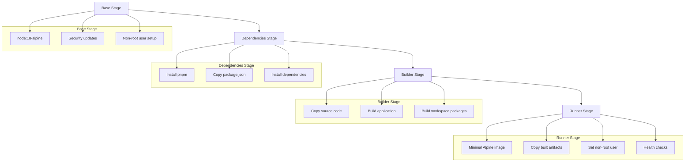
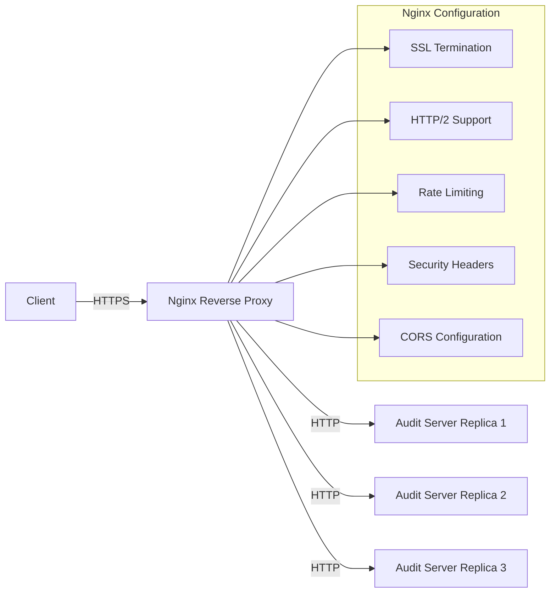
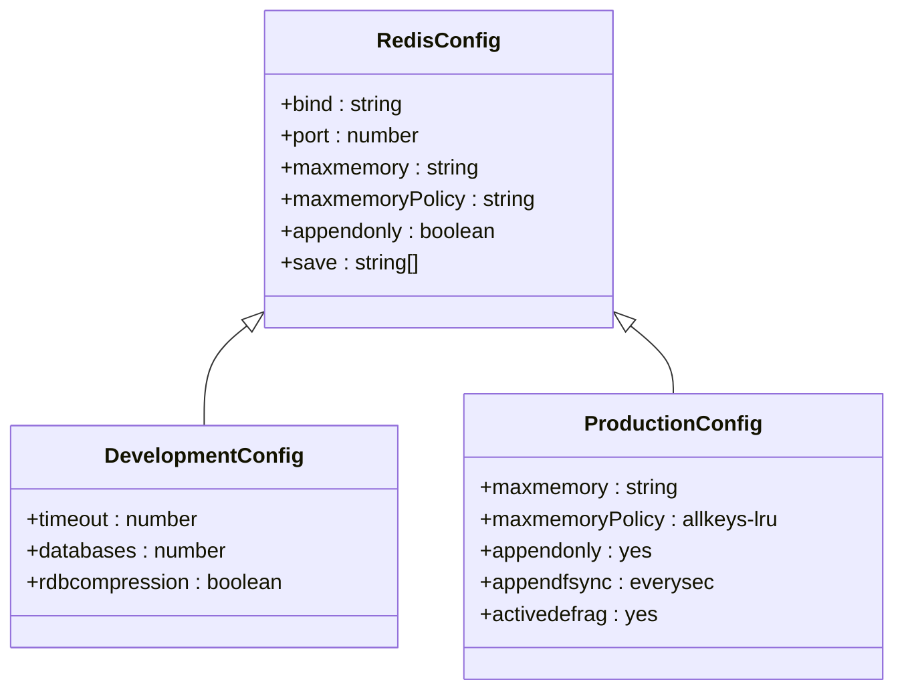
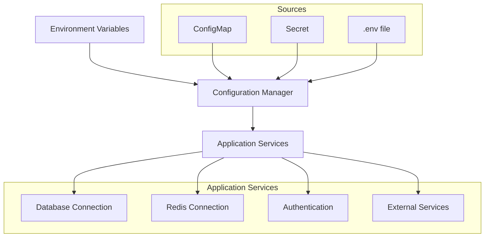
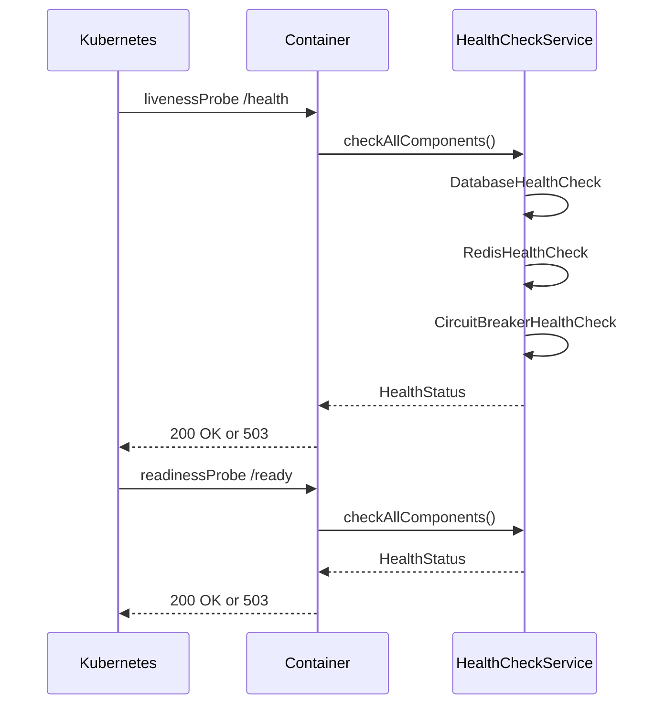
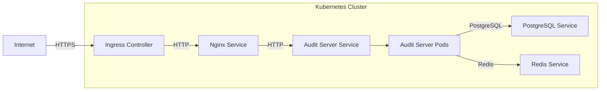
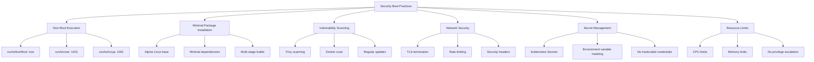
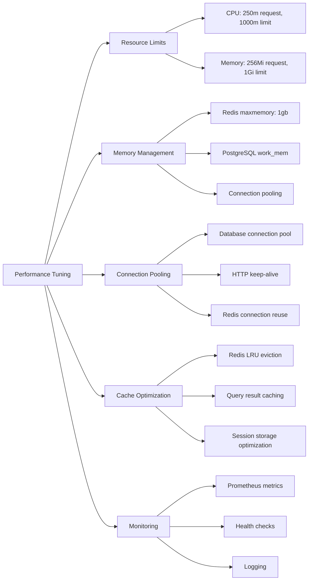

# Container Configuration

<cite>
**Referenced Files in This Document**   
- [redis.prod.conf](file://apps/server/docker/redis.prod.conf)
- [manager.ts](file://packages/audit/src/config/manager.ts)
- [health-check.ts](file://packages/audit/src/monitor/health-check.ts)
- [health.ts](file://apps/server/src/lib/graphql/resolvers/health.ts)
- [deployment.yaml](file://apps/server/k8s/deployment.yaml)
- [service.yaml](file://apps/server/k8s/service.yaml)
- [ingress.yaml](file://apps/server/k8s/ingress.yaml)
- [docker-build.sh](file://apps/server/scripts/docker-build.sh)
- [Dockerfile](file://apps/server/Dockerfile)
- [docker-compose.prod.yml](file://apps/server/docker-compose.prod.yml)
- [README.Docker.md](file://apps/server/README.Docker.md)
</cite>

## Table of Contents
1. [Introduction](#introduction)
2. [Docker Image Build Process](#docker-image-build-process)
3. [NGINX Reverse Proxy Configuration](#nginx-reverse-proxy-configuration)
4. [Redis Configuration](#redis-configuration)
5. [Environment Variable Injection](#environment-variable-injection)
6. [Health Checks and Readiness Probes](#health-checks-and-readiness-probes)
7. [Container Networking Setup](#container-networking-setup)
8. [Security Best Practices](#security-best-practices)
9. [Performance Tuning and Resource Limits](#performance-tuning-and-resource-limits)
10. [Conclusion](#conclusion)

## Introduction
This document provides comprehensive architectural documentation for the container configuration of the SMEDREC Audit Server. It details the Docker image build process, NGINX reverse proxy setup, Redis configuration, environment variable management, health checks, container networking, security practices, and performance optimization strategies. The system is designed for both development and production environments with a focus on reliability, security, and scalability.

## Docker Image Build Process

The Docker image build process for the SMEDREC Audit Server follows a multi-stage build approach to optimize image size and security. The process is managed through two Dockerfiles: `Dockerfile` for production and `Dockerfile.dev` for development.



**Diagram sources**
- [Dockerfile](file://apps/server/Dockerfile)
- [README.Docker.md](file://apps/server/README.Docker.md)

**Section sources**
- [Dockerfile](file://apps/server/Dockerfile)
- [docker-build.sh](file://apps/server/scripts/docker-build.sh)
- [README.Docker.md](file://apps/server/README.Docker.md)

### Multi-Stage Builds
The multi-stage build process consists of four stages:
1. **Base Stage**: Uses `node:18-alpine` as the base image, applies security updates, and sets up a non-root user (UID 1001).
2. **Dependencies Stage**: Installs pnpm package manager, copies package manifests, and installs all dependencies.
3. **Builder Stage**: Copies the complete source code, builds the application using the build script, and compiles all workspace packages.
4. **Runner Stage**: Uses a minimal Alpine Linux image, copies only the necessary built artifacts from previous stages, and sets up the runtime environment.

This approach significantly reduces the final image size by excluding development dependencies and build tools from the production image.

### Layer Optimization
The build process implements several layer optimization techniques:
- **Dependency Caching**: Dependencies are installed in a separate stage and layer, allowing Docker to cache them independently of application code changes.
- **.dockerignore**: The `.dockerignore` file excludes unnecessary files (node_modules, .git, logs) from being copied into the build context.
- **Layer Reuse**: By ordering Dockerfile instructions from least to most frequently changing, the build maximizes layer cache reuse.

### Base Image Selection
The production base image is `node:18-alpine`, chosen for its minimal size and reduced attack surface. The Alpine Linux distribution provides a small footprint (approximately 5MB) and includes only essential packages, enhancing security and reducing download times.

## NGINX Reverse Proxy Configuration

The NGINX reverse proxy is configured to handle routing, load balancing, SSL termination, and HTTP/2 support for the SMEDREC Audit Server.



**Diagram sources**
- [nginx.conf](file://apps/server/docker/nginx.conf)
- [docker-compose.prod.yml](file://apps/server/docker-compose.prod.yml)
- [ingress.yaml](file://apps/server/k8s/ingress.yaml)

**Section sources**
- [docker-compose.prod.yml](file://apps/server/docker-compose.prod.yml)
- [ingress.yaml](file://apps/server/k8s/ingress.yaml)
- [README.Docker.md](file://apps/server/README.Docker.md)

### Routing and Load Balancing
The NGINX configuration routes incoming requests to the appropriate backend services based on the URL path:
- `/health` and `/ready` - Health check endpoints (no rate limiting)
- `/api` - REST API endpoints
- `/trpc` - TRPC endpoints
- `/graphql` - GraphQL endpoint
- `/auth` - Authentication endpoints
- `/` - Default catch-all

Load balancing is implemented using the `upstream-hash-by: '$remote_addr'` directive in the Ingress configuration, which provides session persistence by routing requests from the same client IP to the same backend pod.

### SSL Termination
SSL termination is handled at the NGINX layer, offloading the encryption/decryption work from the application servers. The configuration includes:
- TLS 1.2 and 1.3 support
- Automatic certificate management via cert-manager with Let's Encrypt
- HSTS (HTTP Strict Transport Security) header with a 1-year max-age
- Secure cipher suites configuration

### HTTP/2 Support
HTTP/2 is enabled to improve performance through features like multiplexing, header compression, and server push. This reduces latency and improves page load times, especially for applications with many small resources.

## Redis Configuration

Redis is configured for caching and session storage in both development and production environments, with different configurations optimized for each environment.



**Diagram sources**
- [redis.conf](file://apps/server/docker/redis.conf)
- [redis.prod.conf](file://apps/server/docker/redis.prod.conf)

**Section sources**
- [redis.prod.conf](file://apps/server/docker/redis.prod.conf)
- [docker-compose.prod.yml](file://apps/server/docker-compose.prod.yml)

### Development Environment
In development, Redis is configured with minimal settings focused on ease of use and debugging:
- No password protection (for easy access)
- Default port 6379
- No memory limits
- RDB snapshotting enabled for data persistence
- Verbose logging for debugging

### Production Environment
The production Redis configuration is optimized for performance, reliability, and security:

**Memory Management**
- `maxmemory 1gb`: Limits Redis memory usage to 1GB to prevent out-of-memory issues
- `maxmemory-policy allkeys-lru`: Uses Least Recently Used eviction policy when memory limit is reached
- `maxmemory-samples 5`: Number of samples for LRU algorithm

**Persistence**
- `appendonly yes`: Enables AOF (Append Only File) persistence for durability
- `appendfsync everysec`: Fsyncs the AOF file every second for a balance of performance and durability
- `auto-aof-rewrite-percentage 100`: Triggers AOF rewrite when file size doubles
- `auto-aof-rewrite-min-size 64mb`: Minimum size for AOF rewrite

**Performance Optimization**
- `activedefrag yes`: Enables active defragmentation to reduce memory fragmentation
- `hz 10`: Sets server execution frequency to 10 times per second
- `jemalloc-bg-thread yes`: Enables jemalloc background thread for better memory management

**Security**
- `protected-mode yes`: Protects against unauthorized access when no password is set
- Password authentication can be enabled by uncommenting the `requirepass` directive
- Critical commands can be disabled by renaming them (e.g., FLUSHDB, FLUSHALL)

## Environment Variable Injection

Environment variables are used to configure the application across different environments, providing flexibility and security for sensitive configuration.



**Diagram sources**
- [manager.ts](file://packages/audit/src/config/manager.ts)
- [deployment.yaml](file://apps/server/k8s/deployment.yaml)

**Section sources**
- [manager.ts](file://packages/audit/src/config/manager.ts)
- [deployment.yaml](file://apps/server/k8s/deployment.yaml)

### Configuration Management
The application uses a configuration manager that sources settings from multiple locations:
- **Environment Variables**: Primary source for runtime configuration
- **ConfigMap**: Kubernetes ConfigMap for non-sensitive configuration
- **Secret**: Kubernetes Secret for sensitive data like passwords and API keys
- **Configuration Files**: JSON configuration files for complex nested settings

The `ConfigurationManager` class in `packages/audit/src/config/manager.ts` handles the loading, validation, and management of configuration values. It supports hot reloading of configuration changes and maintains an audit log of configuration changes.

### Key Environment Variables
The following environment variables are essential for the application:

**Database Configuration**
- `DATABASE_URL`: PostgreSQL connection string (required)
- `DATABASE_READ_REPLICA_URL`: Read replica connection string (optional)

**Caching and Queues**
- `REDIS_URL`: Redis connection string (required)
- `REDIS_TLS_ENABLED`: Enables TLS for Redis connections (optional)

**Security**
- `AUTH_SECRET`: Secret key for JWT token signing (required)
- `ENCRYPTION_KEY`: Key for data encryption (required)
- `NODE_ENV`: Environment mode (development, production, staging)

**External Services**
- `S3_BUCKET`: S3 bucket name for archival storage
- `S3_ENDPOINT`: S3 endpoint URL
- `AWS_ACCESS_KEY_ID`: AWS access key
- `AWS_SECRET_ACCESS_KEY`: AWS secret key

**Application Settings**
- `PORT`: Server port (default: 3000)
- `HOST`: Server host (default: 0.0.0.0)
- `LOG_LEVEL`: Logging level (debug, info, warn, error)

### Security Considerations
Sensitive environment variables are handled with security in mind:
- Secrets are stored in Kubernetes Secrets, not in environment files
- The configuration manager masks sensitive values when exporting configuration
- Environment variables containing credentials are validated for proper format
- Default values are avoided for security-critical settings

## Health Checks and Readiness Probes

Health checks and readiness probes are implemented to monitor container health and ensure reliable service operation.



**Diagram sources**
- [health-check.ts](file://packages/audit/src/monitor/health-check.ts)
- [health.ts](file://apps/server/src/lib/graphql/resolvers/health.ts)
- [deployment.yaml](file://apps/server/k8s/deployment.yaml)

**Section sources**
- [health-check.ts](file://packages/audit/src/monitor/health-check.ts)
- [health.ts](file://apps/server/src/lib/graphql/resolvers/health.ts)
- [deployment.yaml](file://apps/server/k8s/deployment.yaml)

### Health Check Implementation
The health check system is implemented in `packages/audit/src/monitor/health-check.ts` and provides comprehensive monitoring of system components:

**HealthCheckService Class**
- Central service that manages multiple health check components
- Aggregates results from individual component checks
- Implements retry logic and timeout handling
- Determines overall system health status

**Component Health Checks**
- `DatabaseHealthCheck`: Verifies database connectivity and response time
- `RedisHealthCheck`: Checks Redis connection status
- `CircuitBreakerHealthCheck`: Monitors circuit breaker state
- `ProcessingHealthCheck`: Evaluates processing queue health
- `QueueHealthCheck`: Checks message queue depth and processing rate

### Kubernetes Probes
The Kubernetes deployment defines three types of probes:

**Liveness Probe**
- Path: `/health`
- Purpose: Determines if the container is running
- Failure: Container is restarted
- Configuration:
  - `initialDelaySeconds: 30`: Wait 30 seconds before first check
  - `periodSeconds: 10`: Check every 10 seconds
  - `timeoutSeconds: 5`: Wait 5 seconds for response
  - `failureThreshold: 3`: Restart after 3 consecutive failures

**Readiness Probe**
- Path: `/ready`
- Purpose: Determines if the container is ready to serve traffic
- Failure: Container is removed from service endpoints
- Configuration:
  - `initialDelaySeconds: 10`: Wait 10 seconds before first check
  - `periodSeconds: 5`: Check every 5 seconds
  - `timeoutSeconds: 3`: Wait 3 seconds for response
  - `failureThreshold: 3`: Remove from service after 3 failures

**Startup Probe**
- Path: `/health`
- Purpose: Determines if the application has started successfully
- Failure: Container is restarted
- Configuration:
  - `initialDelaySeconds: 10`: Wait 10 seconds before first check
  - `periodSeconds: 5`: Check every 5 seconds
  - `failureThreshold: 30`: Allow up to 150 seconds for startup

### Health Status Levels
The system uses a three-tier health status model:
- **OK (Healthy)**: All components are functioning normally
- **WARNING (Degraded)**: Some components have issues but the system can continue operating
- **CRITICAL (Unhealthy)**: Critical components have failed, requiring immediate attention

The GraphQL resolver in `apps/server/src/lib/graphql/resolvers/health.ts` maps these statuses to a client-friendly format and logs health check results for monitoring.

## Container Networking Setup

The container networking setup ensures reliable communication between services and external access to the application.



**Diagram sources**
- [deployment.yaml](file://apps/server/k8s/deployment.yaml)
- [service.yaml](file://apps/server/k8s/service.yaml)
- [ingress.yaml](file://apps/server/k8s/ingress.yaml)
- [docker-compose.prod.yml](file://apps/server/docker-compose.prod.yml)

**Section sources**
- [deployment.yaml](file://apps/server/k8s/deployment.yaml)
- [service.yaml](file://apps/server/k8s/service.yaml)
- [ingress.yaml](file://apps/server/k8s/ingress.yaml)
- [docker-compose.prod.yml](file://apps/server/docker-compose.prod.yml)

### Docker Compose Networking
In the production Docker Compose setup (`docker-compose.prod.yml`), a custom bridge network named `audit-network` is created:

```yaml
networks:
  audit-network:
    driver: bridge
```

Services are connected to this network:
- `audit-server`: Application server
- `nginx`: Reverse proxy
- `postgres`: Database
- `redis`: Cache and queue

This allows services to communicate using service names as hostnames (e.g., `http://postgres:5432`).

### Kubernetes Networking
The Kubernetes deployment uses several networking components:

**Services**
- `ClusterIP` service: Exposes the audit server within the cluster
- Headless service: Enables direct pod access for stateful operations
- Service exposes port 80, forwarding to container port 3000

**Ingress**
- Routes external traffic to the service
- Handles SSL termination
- Implements rate limiting and CORS policies
- Directs different paths to appropriate backend services

**Network Policies**
- Not explicitly defined but implied by service isolation
- DNS policy set to `ClusterFirst` for cluster DNS resolution

### Communication Patterns
The system follows a layered communication pattern:
1. External clients connect to the Ingress controller over HTTPS
2. Ingress routes traffic to the Nginx service
3. Nginx forwards requests to the audit server service
4. Audit server pods communicate with PostgreSQL and Redis services
5. Database and cache services are only accessible within the cluster

## Security Best Practices

The container configuration implements multiple security best practices to protect the application and its data.



**Diagram sources**
- [deployment.yaml](file://apps/server/k8s/deployment.yaml)
- [docker-compose.prod.yml](file://apps/server/docker-compose.prod.yml)
- [README.Docker.md](file://apps/server/README.Docker.md)

**Section sources**
- [deployment.yaml](file://apps/server/k8s/deployment.yaml)
- [docker-compose.prod.yml](file://apps/server/docker-compose.prod.yml)
- [README.Docker.md](file://apps/server/README.Docker.md)

### Non-Root User Execution
All containers run as non-root users to minimize the impact of potential security breaches:

**Kubernetes Security Context**
```yaml
securityContext:
  runAsNonRoot: true
  runAsUser: 1001
  runAsGroup: 1001
  fsGroup: 1001
  seccompProfile:
    type: RuntimeDefault
```

**Container Security Context**
```yaml
securityContext:
  allowPrivilegeEscalation: false
  readOnlyRootFilesystem: true
  runAsNonRoot: true
  runAsUser: 1001
  capabilities:
    drop:
      - ALL
```

### Minimal Package Installation
The production image is minimized to reduce the attack surface:
- Base image: `node:18-alpine` (minimal footprint)
- Only essential packages installed
- Development dependencies excluded from production image
- Multi-stage builds ensure only necessary files are included

### Vulnerability Scanning
The build process includes vulnerability scanning using multiple tools:
- **Trivy**: Open source vulnerability scanner for containers and dependencies
- **Docker scan**: Docker's built-in vulnerability scanning
- Scanning is integrated into the `docker-build.sh` script
- Images are scanned before deployment

### Additional Security Measures
- **Read-only root filesystem**: Prevents malicious writes to the container filesystem
- **No new privileges**: Prevents processes from gaining additional privileges
- **Seccomp profile**: Restricts system calls using RuntimeDefault profile
- **Resource limits**: Prevents resource exhaustion attacks
- **Security headers**: HSTS, XSS protection, frame protection, etc.

## Performance Tuning and Resource Limits

Performance tuning and resource limits ensure the application runs efficiently and reliably under various load conditions.



**Diagram sources**
- [deployment.yaml](file://apps/server/k8s/deployment.yaml)
- [redis.prod.conf](file://apps/server/docker/redis.prod.conf)
- [manager.ts](file://packages/audit/src/config/manager.ts)

**Section sources**
- [deployment.yaml](file://apps/server/k8s/deployment.yaml)
- [redis.prod.conf](file://apps/server/docker/redis.prod.conf)
- [manager.ts](file://packages/audit/src/config/manager.ts)

### Resource Limits
Kubernetes resource limits prevent any single pod from consuming excessive resources:

**CPU Limits**
- Request: 250m (0.25 CPU core)
- Limit: 1000m (1 CPU core)
- Ensures fair resource distribution across nodes

**Memory Limits**
- Request: 256Mi
- Limit: 1Gi
- Prevents out-of-memory crashes
- Allows for graceful degradation under load

### Performance Tuning Tips
**For Containerized Services**
- **Optimize Docker layering**: Order Dockerfile instructions from least to most frequently changing
- **Use appropriate base images**: Alpine Linux for production, larger images only when necessary
- **Implement health checks**: Proper liveness and readiness probes prevent traffic to unhealthy instances
- **Configure graceful shutdowns**: Use preStop hooks to allow in-flight requests to complete

**For Redis**
- **Tune maxmemory settings**: Set appropriate memory limits based on available resources
- **Choose the right eviction policy**: `allkeys-lru` for general caching, `volatile-lru` for session storage
- **Enable active defragmentation**: Reduces memory fragmentation and improves performance
- **Configure AOF persistence**: Balance durability and performance with `appendfsync everysec`

**For Database**
- **Implement connection pooling**: Reuse database connections to reduce overhead
- **Use read replicas**: Offload read queries to replicas to reduce load on primary
- **Optimize queries**: Use indexes and avoid N+1 query patterns
- **Monitor slow queries**: Use PostgreSQL's slow query log to identify performance bottlenecks

**For Application**
- **Enable compression**: Use gzip compression for HTTP responses
- **Implement caching**: Cache frequently accessed data in Redis
- **Optimize logging**: Use appropriate log levels and avoid logging sensitive data
- **Monitor metrics**: Expose Prometheus metrics for monitoring key performance indicators

## Conclusion
The container configuration for the SMEDREC Audit Server demonstrates a comprehensive approach to modern application deployment. The multi-stage Docker build process creates optimized images with minimal attack surface. The NGINX reverse proxy provides secure routing, load balancing, and SSL termination. Redis is configured for optimal performance and reliability in both development and production environments.

Environment variable injection through ConfigMaps and Secrets ensures secure configuration management. Comprehensive health checks and readiness probes enable reliable service operation and automatic recovery from failures. The container networking setup follows best practices for service isolation and external access.

Security is prioritized throughout the configuration with non-root user execution, minimal package installation, vulnerability scanning, and multiple layers of protection. Performance tuning and resource limits ensure the application runs efficiently under various load conditions.

This configuration provides a solid foundation for a reliable, secure, and scalable audit server that can handle the demands of a production environment while maintaining high availability and performance.