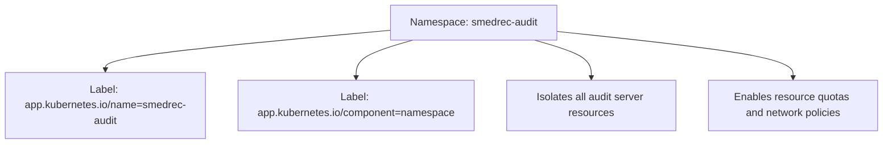
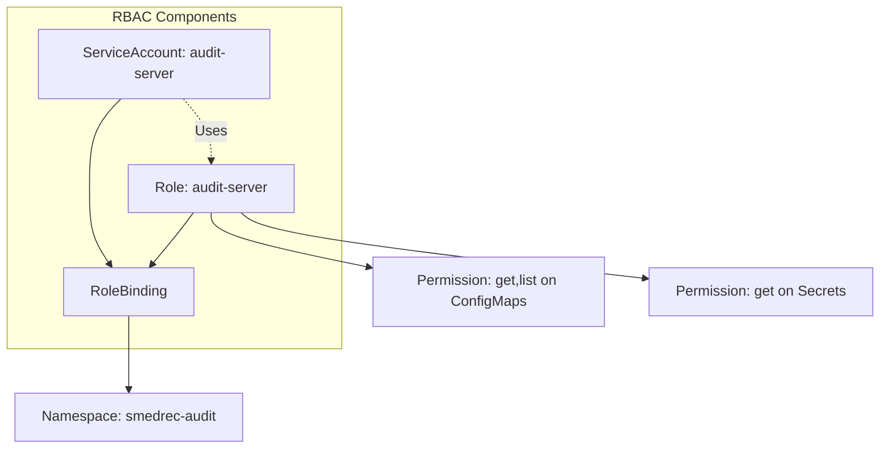
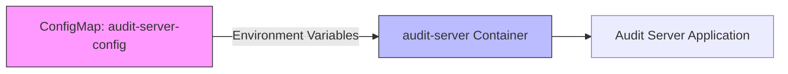
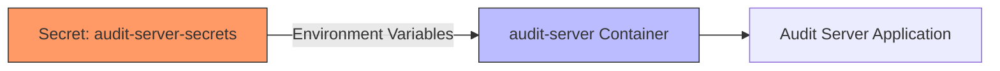
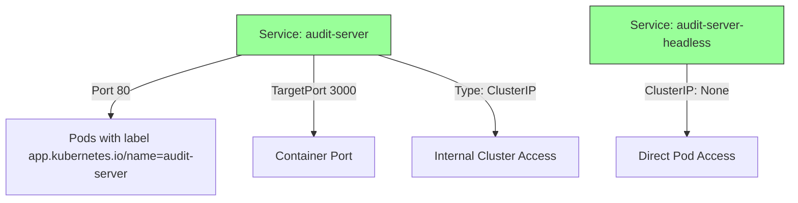
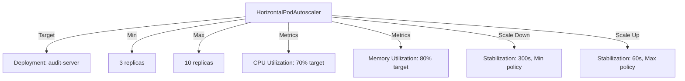
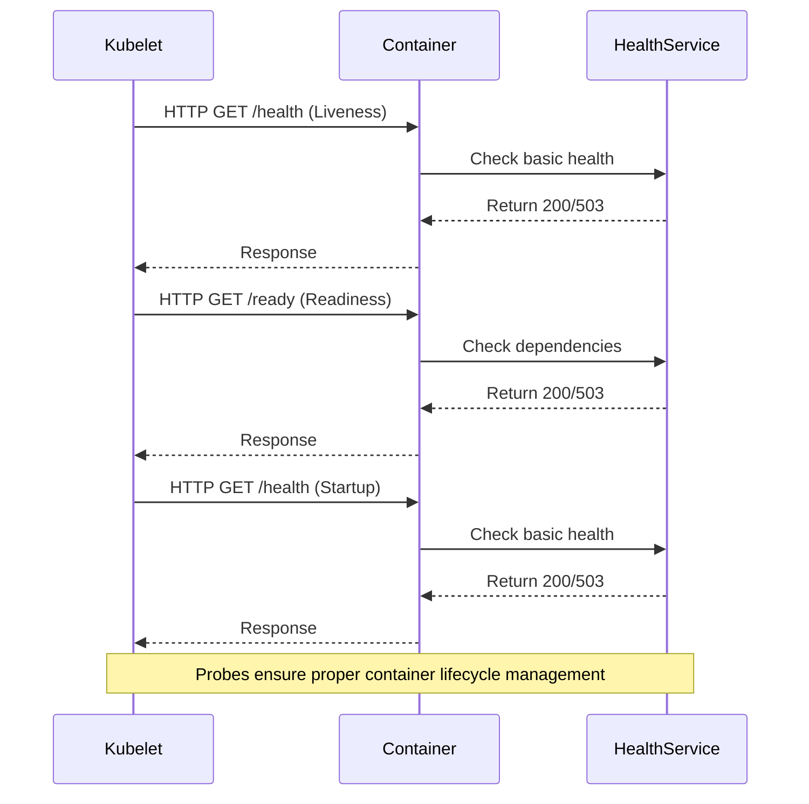
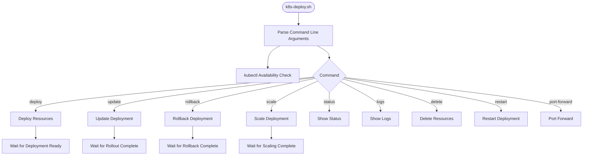

# Kubernetes Orchestration

<cite>
**Referenced Files in This Document**   
- [namespace.yaml](file://apps/server/k8s/namespace.yaml)
- [serviceaccount.yaml](file://apps/server/k8s/serviceaccount.yaml)
- [configmap.yaml](file://apps/server/k8s/configmap.yaml)
- [secret.yaml](file://apps/server/k8s/secret.yaml)
- [service.yaml](file://apps/server/k8s/service.yaml)
- [ingress.yaml](file://apps/server/k8s/ingress.yaml)
- [hpa.yaml](file://apps/server/k8s/hpa.yaml)
- [deployment.yaml](file://apps/server/k8s/deployment.yaml)
- [k8s-deploy.sh](file://apps/server/scripts/k8s-deploy.sh)
- [health-api.ts](file://apps/server/src/routes/health-api.ts)
- [health.ts](file://apps/server/src/lib/services/health.ts)
</cite>

## Table of Contents
1. [Introduction](#introduction)
2. [Namespace and Resource Isolation](#namespace-and-resource-isolation)
3. [ServiceAccount and RBAC Configuration](#serviceaccount-and-rbac-configuration)
4. [ConfigMap for Configuration Management](#configmap-for-configuration-management)
5. [Secret for Sensitive Data Storage](#secret-for-sensitive-data-storage)
6. [Service for Internal Load Balancing](#service-for-internal-load-balancing)
7. [Ingress for External Access](#ingress-for-external-access)
8. [Horizontal Pod Autoscaler (HPA)](#horizontal-pod-autoscaler-hpa)
9. [Deployment Manifest Structure](#deployment-manifest-structure)
10. [Health Probes Implementation](#health-probes-implementation)
11. [Deployment Script Usage](#deployment-script-usage)
12. [Production Best Practices](#production-best-practices)

## Introduction
This document provides comprehensive architectural documentation for the Kubernetes orchestration system of the SMEDREC Audit Server. It details the deployment configuration, service networking, autoscaling, security setup, and operational procedures. The system is designed for high availability, security, and scalability in a production environment. The orchestration leverages Kubernetes best practices for resource isolation, role-based access control, configuration management, and zero-downtime deployments.

## Namespace and Resource Isolation
The Kubernetes namespace provides a logical boundary for resource isolation, enabling better organization, access control, and resource management for the audit server application.



**Diagram sources**
- [namespace.yaml](file://apps/server/k8s/namespace.yaml#L1-L10)

**Section sources**
- [namespace.yaml](file://apps/server/k8s/namespace.yaml#L1-L10)

## ServiceAccount and RBAC Configuration
The ServiceAccount, Role, and RoleBinding configuration implements the principle of least privilege, granting the audit server only the minimum permissions required to function.



**Diagram sources**
- [serviceaccount.yaml](file://apps/server/k8s/serviceaccount.yaml#L1-L50)

**Section sources**
- [serviceaccount.yaml](file://apps/server/k8s/serviceaccount.yaml#L1-L50)

## ConfigMap for Configuration Management
The ConfigMap stores non-sensitive configuration values that can be injected into the application container as environment variables, enabling configuration decoupling from code.

**Configuration Data:**
- NODE_ENV: 'production'
- PORT: '3000'
- HOST: '0.0.0.0'
- LOG_LEVEL: 'info'
- CORS_ORIGIN: 'https://app.smedrec.com,https://admin.smedrec.com'



**Diagram sources**
- [configmap.yaml](file://apps/server/k8s/configmap.yaml#L1-L18)

**Section sources**
- [configmap.yaml](file://apps/server/k8s/configmap.yaml#L1-L18)

## Secret for Sensitive Data Storage
The Secret stores sensitive configuration data such as database URLs, Redis connections, and authentication secrets, which are injected into the container environment securely.

**Sensitive Data:**
- DATABASE_URL: Base64 encoded PostgreSQL connection string
- REDIS_URL: Base64 encoded Redis connection string
- AUTH_SECRET: Base64 encoded authentication secret key



**Diagram sources**
- [secret.yaml](file://apps/server/k8s/secret.yaml#L1-L19)

**Section sources**
- [secret.yaml](file://apps/server/k8s/secret.yaml#L1-L19)

## Service for Internal Load Balancing
The Service configuration provides internal load balancing within the Kubernetes cluster, exposing the audit server pods via a stable IP address and DNS name.



**Diagram sources**
- [service.yaml](file://apps/server/k8s/service.yaml#L1-L43)

**Section sources**
- [service.yaml](file://apps/server/k8s/service.yaml#L1-L43)

## Ingress for External Access
The Ingress configuration manages external access to the audit server services, providing host and path-based routing, SSL termination, and various security features.

```mermaid
flowchart TD
Client[External Client] --> |HTTPS| Ingress[Ingress Controller]
Ingress --> |TLS Termination| Rules[Routing Rules]
Rules --> Health[/health] --> Service
Rules --> Ready[/ready] --> Service
Rules --> API[/api] --> Service
Rules --> TRPC[/trpc] --> Service
Rules --> GraphQL[/graphql] --> Service
Rules --> Auth[/auth] --> Service
Rules --> Default[/] --> Service
Service[Service: audit-server] --> Pods[Pods]
Ingress --> |Security Headers| Security[Add X-Frame-Options, HSTS, etc.]
Ingress --> |Rate Limiting| RateLimit[100 requests/minute]
Ingress --> |CORS| CORS[Allow app.smedrec.com, admin.smedrec.com]
```

**Diagram sources**
- [ingress.yaml](file://apps/server/k8s/ingress.yaml#L1-L120)

**Section sources**
- [ingress.yaml](file://apps/server/k8s/ingress.yaml#L1-L120)

## Horizontal Pod Autoscaler (HPA)
The Horizontal Pod Autoscaler automatically scales the number of pod replicas based on CPU and memory utilization metrics, ensuring optimal resource usage and performance.



**Diagram sources**
- [hpa.yaml](file://apps/server/k8s/hpa.yaml#L1-L67)

**Section sources**
- [hpa.yaml](file://apps/server/k8s/hpa.yaml#L1-L67)

## Deployment Manifest Structure
The Deployment configuration defines the pod template, container specifications, resource requests/limits, and lifecycle management for the audit server application.

```mermaid
classDiagram
class Deployment {
+replicas : 3
+strategy : RollingUpdate
+maxSurge : 1
+maxUnavailable : 0
}
class PodTemplate {
+labels : app.kubernetes.io/name=audit-server
+annotations : prometheus.io/scrape=true
}
class Container {
+name : audit-server
+image : smedrec/audit-server : latest
+port : 3000
+envFrom : configMap, secret
+resources : requests/limits
+livenessProbe : /health
+readinessProbe : /ready
+startupProbe : /health
+lifecycle : preStop sleep 15s
}
class SecurityContext {
+runAsNonRoot : true
+runAsUser : 1001
+readOnlyRootFilesystem : true
+capabilities : drop ALL
}
class InitContainer {
+name : wait-for-postgres
+image : postgres : 16-alpine
+command : pg_isready check
}
Deployment --> PodTemplate
PodTemplate --> Container
PodTemplate --> InitContainer
Container --> SecurityContext
PodTemplate --> Volumes
class Volumes {
+tmp : emptyDir{}
+var-cache : emptyDir{}
}
```

**Diagram sources**
- [deployment.yaml](file://apps/server/k8s/deployment.yaml#L1-L163)

**Section sources**
- [deployment.yaml](file://apps/server/k8s/deployment.yaml#L1-L163)

## Health Probes Implementation
The health probes implementation includes liveness, readiness, and startup probes that integrate with the application's health check endpoints to ensure reliable service operation.



**Diagram sources**
- [deployment.yaml](file://apps/server/k8s/deployment.yaml#L94-L161)
- [health-api.ts](file://apps/server/src/routes/health-api.ts#L1-L537)
- [health.ts](file://apps/server/src/lib/services/health.ts#L1-L625)

**Section sources**
- [deployment.yaml](file://apps/server/k8s/deployment.yaml#L94-L161)
- [health-api.ts](file://apps/server/src/routes/health-api.ts#L1-L537)
- [health.ts](file://apps/server/src/lib/services/health.ts#L1-L625)

## Deployment Script Usage
The k8s-deploy.sh script provides a comprehensive command-line interface for deploying, managing, and monitoring the Kubernetes resources for the audit server.

**Available Commands:**
- deploy: Deploy all resources to Kubernetes
- update: Update existing deployment
- rollback: Rollback to previous deployment
- scale: Scale the deployment
- status: Show deployment status
- logs: Show application logs
- delete: Delete all resources
- restart: Restart the deployment
- port-forward: Forward local port to service
- help: Show help message



**Diagram sources**
- [k8s-deploy.sh](file://apps/server/scripts/k8s-deploy.sh#L1-L423)

**Section sources**
- [k8s-deploy.sh](file://apps/server/scripts/k8s-deploy.sh#L1-L423)

## Production Best Practices
This section documents the production best practices implemented in the Kubernetes orchestration configuration for reliability, security, and performance.

### Liveness and Readiness Probes
The deployment implements three types of health probes:
- **Liveness Probe**: Checks /health endpoint to determine if the container should be restarted
- **Readiness Probe**: Checks /ready endpoint to determine if the container should receive traffic
- **Startup Probe**: Checks /health endpoint during container startup with a longer timeout

These probes ensure that unhealthy containers are restarted and that only ready containers receive traffic, preventing request failures during startup or degradation.

### Resource Requests and Limits
The container has defined resource requests and limits:
- **CPU**: Request 250m, Limit 1000m
- **Memory**: Request 256Mi, Limit 1Gi

These values ensure the container has sufficient resources while preventing resource starvation in the cluster.

### Security Context
The deployment implements multiple security best practices:
- Runs as non-root user (UID 1001)
- Drops all capabilities
- Uses read-only root filesystem
- Applies RuntimeDefault seccomp profile
- Disables privilege escalation

### Rolling Update Strategy
The deployment uses a rolling update strategy with:
- maxSurge: 1 (one extra pod during update)
- maxUnavailable: 0 (zero downtime)

This ensures zero-downtime updates while minimizing resource usage during the rollout.

### Init Containers
The init container waits for the PostgreSQL database to be ready before starting the main application container, ensuring proper startup ordering and preventing application failures due to unavailable dependencies.

### Termination Grace Period
The terminationGracePeriodSeconds is set to 30 seconds, allowing time for the preStop lifecycle hook to execute and for connections to drain gracefully before the pod is terminated.

### Monitoring Integration
The pod is configured for Prometheus monitoring with annotations that enable scraping of metrics from the /metrics endpoint on port 3000.