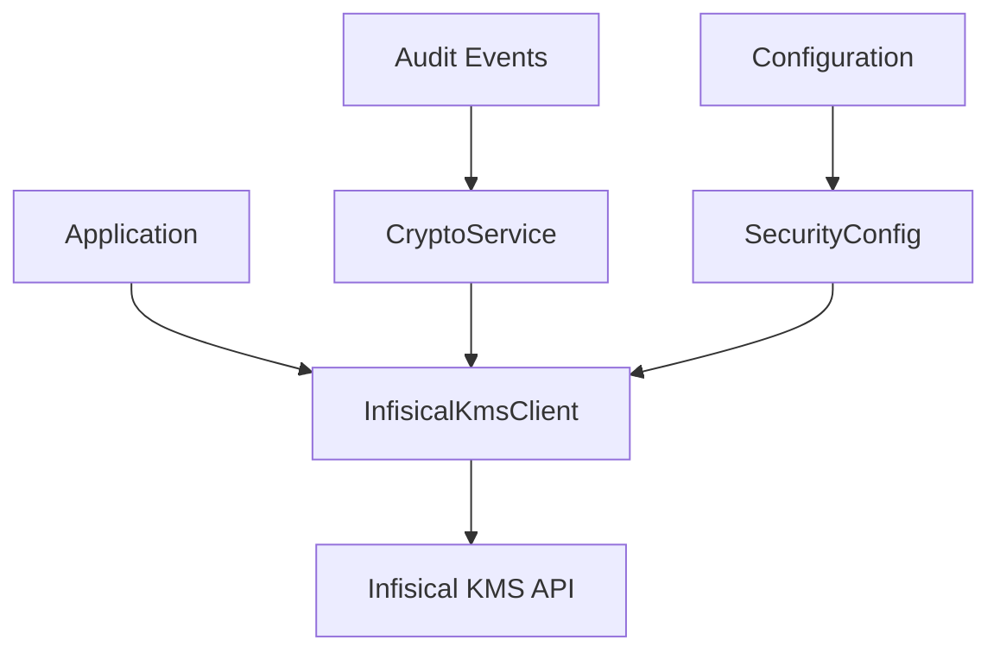
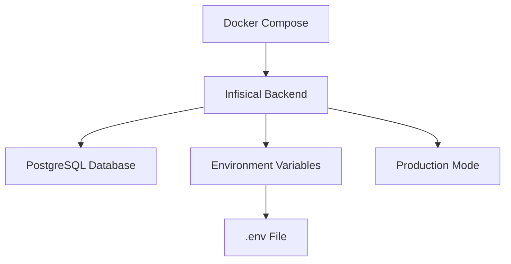
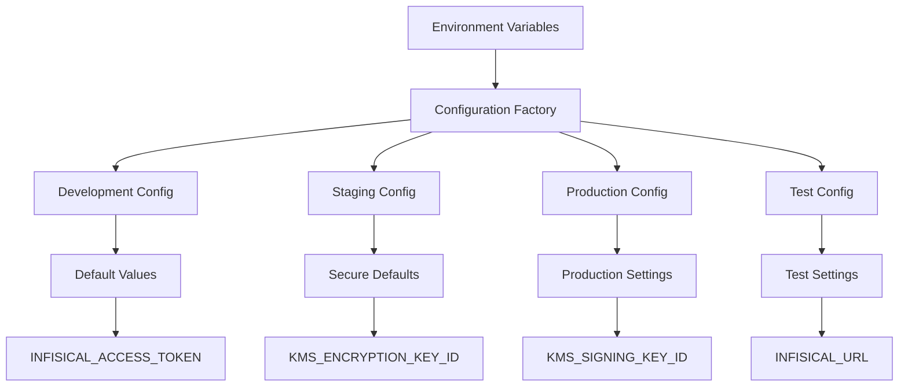
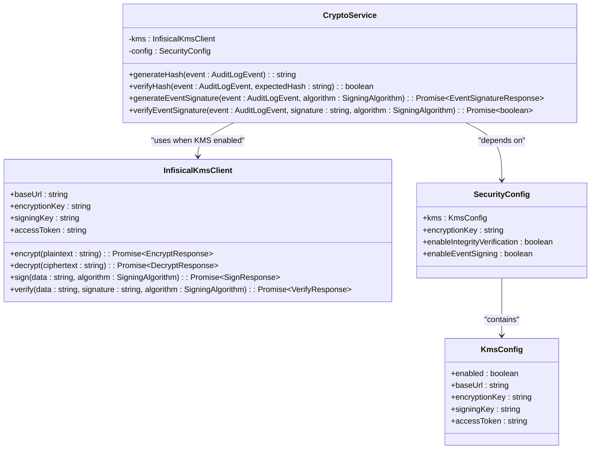
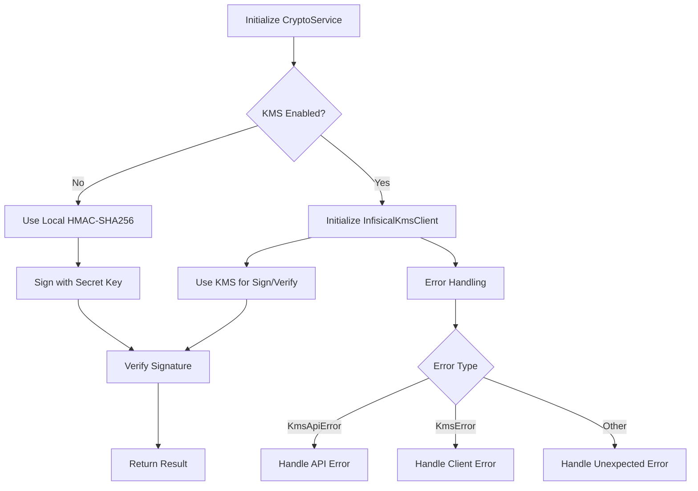
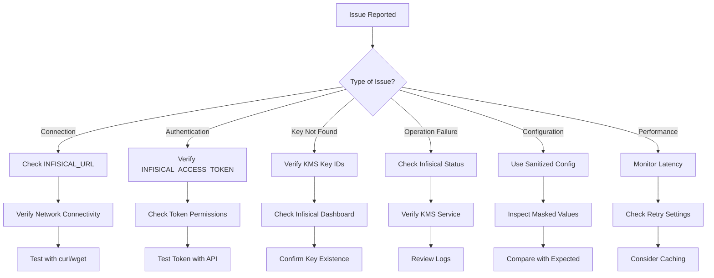

# Infisical Secret Management Integration

<cite>
**Referenced Files in This Document**   
- [docker-compose.prod.yml](file://docker/infisical/docker-compose.prod.yml)
- [client.ts](file://packages/infisical-kms/src/client.ts)
- [types.ts](file://packages/infisical-kms/src/types.ts)
- [crypto.ts](file://packages/audit/src/crypto.ts)
- [factory.ts](file://packages/audit/src/config/factory.ts)
- [manager.ts](file://packages/audit/src/config/manager.ts)
- [README.md](file://packages/infisical-kms/README.md)
</cite>

## Table of Contents
1. [Introduction](#introduction)
2. [Infisical Integration Overview](#infisical-integration-overview)
3. [Deployment Configuration](#deployment-configuration)
4. [Secret Injection Patterns](#secret-injection-patterns)
5. [Integration with Main Application](#integration-with-main-application)
6. [Security Considerations](#security-considerations)
7. [Troubleshooting Guidance](#troubleshooting-guidance)
8. [Conclusion](#conclusion)

## Introduction
This document provides comprehensive documentation for the Infisical secret management integration within the smart-logs application. It details the purpose, deployment configuration, secret injection patterns, and integration with the main application. The documentation also covers security considerations and troubleshooting guidance to ensure proper implementation and maintenance of the secret management system.

## Infisical Integration Overview
The Infisical integration provides a secure key management system (KMS) for cryptographic operations within the application. The integration is implemented through the `@repo/infisical-kms` package, which serves as a wrapper around the Infisical KMS API, enabling encryption, decryption, signing, and verification of data.

The integration is primarily used for audit event integrity verification, where cryptographic signatures and hashes are generated and verified to ensure data integrity. The system leverages Infisical for managing encryption and signing keys, providing a centralized and secure approach to key management.

**Diagram sources**
- [client.ts](file://packages/infisical-kms/src/client.ts)
- [crypto.ts](file://packages/audit/src/crypto.ts)

**Section sources**
- [client.ts](file://packages/infisical-kms/src/client.ts)
- [crypto.ts](file://packages/audit/src/crypto.ts)

## Deployment Configuration
The Infisical deployment is configured through Docker Compose for production environments. The configuration defines a backend service that uses the official Infisical image with PostgreSQL support.

The deployment configuration includes environment variables that are loaded from an `.env` file, ensuring sensitive information is not exposed in the configuration file. The service is configured to restart automatically and always pull the latest image version.

**Diagram sources**
- [docker-compose.prod.yml](file://docker/infisical/docker-compose.prod.yml)

**Section sources**
- [docker-compose.prod.yml](file://docker/infisical/docker-compose.prod.yml)

## Secret Injection Patterns
The secret injection pattern follows a configuration-driven approach where sensitive values are injected through environment variables. The system uses a hierarchical configuration model that prioritizes environment variables over default values.

Key secrets are injected through the following environment variables:
- `INFISICAL_ACCESS_TOKEN`: Authentication token for accessing the Infisical API
- `KMS_ENCRYPTION_KEY_ID`: Identifier for the encryption key in Infisical
- `KMS_SIGNING_KEY_ID`: Identifier for the signing key in Infisical
- `INFISICAL_URL`: Base URL for the Infisical instance

The configuration factory pattern creates environment-specific configurations, with development, staging, production, and test variants. Each environment has appropriate defaults and security settings.

**Diagram sources**
- [factory.ts](file://packages/audit/src/config/factory.ts)
- [manager.ts](file://packages/audit/src/config/manager.ts)

**Section sources**
- [factory.ts](file://packages/audit/src/config/factory.ts)
- [manager.ts](file://packages/audit/src/config/manager.ts)

## Integration with Main Application
The Infisical integration is tightly coupled with the audit system's cryptographic service. The `CryptoService` class initializes the `InfisicalKmsClient` when KMS functionality is enabled in the security configuration.

The integration follows a conditional pattern where the system can operate with or without Infisical. When Infisical is disabled, the system falls back to local cryptographic operations using HMAC-SHA256 signatures. When enabled, all cryptographic operations are delegated to the Infisical KMS.

The integration is configured through the security configuration object, which contains the necessary connection details and credentials for the Infisical instance.

**Diagram sources**
- [client.ts](file://packages/infisical-kms/src/client.ts)
- [crypto.ts](file://packages/audit/src/crypto.ts)
- [factory.ts](file://packages/audit/src/config/factory.ts)

**Section sources**
- [client.ts](file://packages/infisical-kms/src/client.ts)
- [crypto.ts](file://packages/audit/src/crypto.ts)
- [factory.ts](file://packages/audit/src/config/factory.ts)

## Security Considerations
The Infisical integration implements several security measures to protect sensitive data and cryptographic operations:

1. **Environment Variable Protection**: The configuration manager masks sensitive values when logging or displaying configuration, replacing them with '***MASKED***' to prevent accidental exposure.

2. **Conditional KMS Usage**: The system can operate with or without Infisical, providing flexibility for different deployment environments while maintaining cryptographic security.

3. **Secure Defaults**: The system provides secure default configurations for different environments, with increasingly strict security settings from development to production.

4. **Error Handling**: The integration includes specific error classes (`KmsApiError`, `KmsError`) that allow for proper error handling without exposing sensitive information.

5. **Key Management**: Cryptographic keys are managed externally through Infisical, reducing the risk of key exposure in the application code or configuration.

6. **Fallback Mechanism**: When Infisical is not available, the system falls back to local HMAC-SHA256 signatures using a secret key, ensuring cryptographic integrity is maintained.

**Diagram sources**
- [crypto.ts](file://packages/audit/src/crypto.ts)
- [client.ts](file://packages/infisical-kms/src/client.ts)

**Section sources**
- [crypto.ts](file://packages/audit/src/crypto.ts)
- [client.ts](file://packages/infisical-kms/src/client.ts)
- [manager.ts](file://packages/audit/src/config/manager.ts)

## Troubleshooting Guidance
When troubleshooting issues with the Infisical integration, consider the following common scenarios and solutions:

1. **Connection Issues**: Verify that the `INFISICAL_URL` environment variable points to a reachable Infisical instance. Check network connectivity and firewall rules.

2. **Authentication Failures**: Ensure the `INFISICAL_ACCESS_TOKEN` has the necessary permissions to access the specified encryption and signing keys.

3. **Key Not Found**: Verify that the `KMS_ENCRYPTION_KEY_ID` and `KMS_SIGNING_KEY_ID` match existing keys in the Infisical instance.

4. **Cryptographic Operations Failing**: Check that the Infisical instance is running and accessible. Verify that the KMS service is enabled in Infisical.

5. **Configuration Issues**: Use the configuration manager's sanitization feature to inspect the active configuration without exposing sensitive values.

6. **Performance Problems**: Monitor the latency of cryptographic operations. Consider caching frequently used operations or adjusting retry settings.

The integration provides detailed error classes that can be used to identify and handle specific issues:
- `KmsApiError`: Indicates problems with the Infisical API (authentication, invalid requests, etc.)
- `KmsError`: Indicates client-side issues (network problems, JSON parsing errors, etc.)

**Diagram sources**
- [client.ts](file://packages/infisical-kms/src/client.ts)
- [crypto.ts](file://packages/audit/src/crypto.ts)
- [manager.ts](file://packages/audit/src/config/manager.ts)

**Section sources**
- [client.ts](file://packages/infisical-kms/src/client.ts)
- [crypto.ts](file://packages/audit/src/crypto.ts)
- [manager.ts](file://packages/audit/src/config/manager.ts)

## Conclusion
The Infisical secret management integration provides a robust and secure solution for cryptographic operations within the smart-logs application. By leveraging Infisical as a key management system, the application benefits from centralized key management, enhanced security, and flexible deployment options.

The integration is designed with security in mind, featuring environment-specific configurations, sensitive data masking, and comprehensive error handling. The system's ability to operate with or without Infisical provides deployment flexibility while maintaining cryptographic integrity.

For production deployments, it is recommended to enable the KMS integration and use Infisical for all cryptographic operations. This approach provides the highest level of security and auditability for sensitive operations.