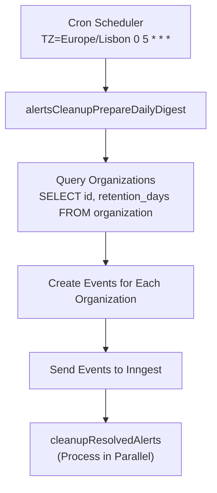
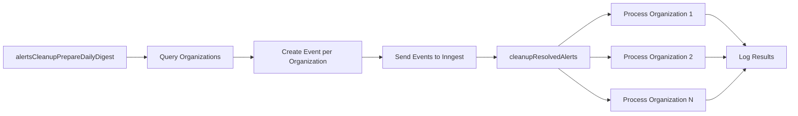
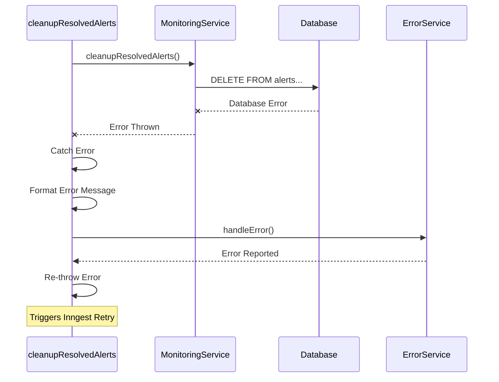
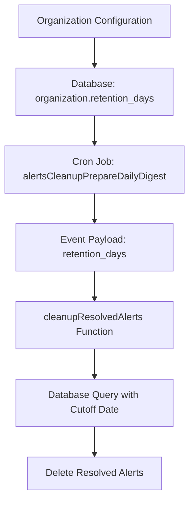
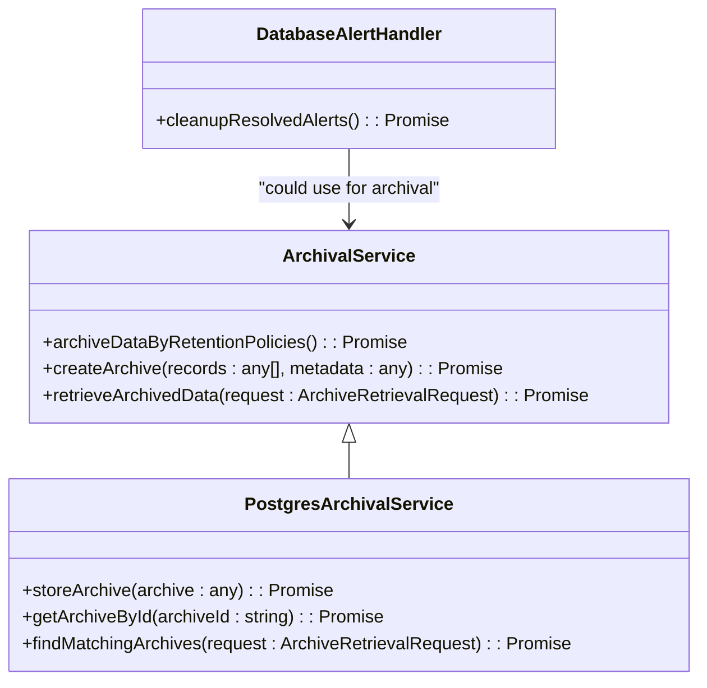
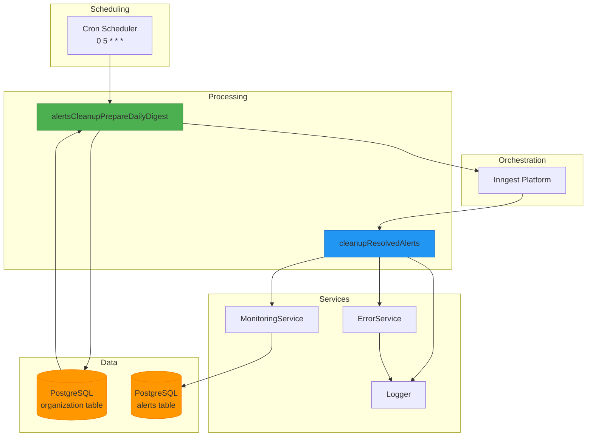

# Cleanup Old Alerts Function

<cite>
**Referenced Files in This Document**   
- [cleanup-old-alerts.ts](file://apps/inngest/src/inngest/functions/alerts/cleanup-old-alerts.ts)
- [database-alert-handler.ts](file://packages/audit/src/monitor/database-alert-handler.ts)
- [monitoring.ts](file://packages/audit/src/monitor/monitoring.ts)
- [archival-service.ts](file://packages/audit/src/archival/archival-service.ts)
- [postgres-archival-service.ts](file://packages/audit/src/archival/postgres-archival-service.ts)
</cite>

## Table of Contents
1. [Introduction](#introduction)
2. [Function Overview](#function-overview)
3. [Trigger and Scheduling](#trigger-and-scheduling)
4. [Implementation Logic](#implementation-logic)
5. [Database Integration](#database-integration)
6. [Error Handling and Retry Policies](#error-handling-and-retry-policies)
7. [Monitoring and Metrics](#monitoring-and-metrics)
8. [Configuration Options](#configuration-options)
9. [Extensibility and Custom Rules](#extensibility-and-custom-rules)
10. [Architecture Diagram](#architecture-diagram)

## Introduction
The **Cleanup Old Alerts Function** is a critical component of the audit system responsible for maintaining data hygiene by removing resolved alerts that have exceeded their retention period. This function operates as part of a scheduled maintenance workflow, ensuring compliance with data retention policies while optimizing database performance. The implementation leverages Inngest for orchestration, integrates with the audit-db package for database operations, and follows a fan-out pattern to process multiple organizations efficiently.

**Section sources**
- [cleanup-old-alerts.ts](file://apps/inngest/src/inngest/functions/alerts/cleanup-old-alerts.ts#L0-L108)

## Function Overview
The cleanup-old-alerts function consists of two primary components:
1. **alertsCleanupPrepareDailyDigest**: A cron-triggered function that initiates the cleanup process
2. **cleanupResolvedAlerts**: An event-driven function that performs the actual alert deletion

This architecture implements a fan-out pattern where the preparatory function queries all organizations and dispatches individual events for each organization, enabling parallel processing and improved scalability.

The function targets resolved alerts based on organization-specific retention policies, defaulting to 90 days if not specified. It integrates with the monitoring system to emit metrics and handles errors through structured logging and error reporting.

**Section sources**
- [cleanup-old-alerts.ts](file://apps/inngest/src/inngest/functions/alerts/cleanup-old-alerts.ts#L0-L108)

## Trigger and Scheduling
The cleanup process is triggered by a cron expression that executes daily at 5:00 AM in the Europe/Lisbon timezone:

```cron
TZ=Europe/Lisbon 0 5 * * *
```

This scheduling ensures the cleanup runs during off-peak hours, minimizing impact on system performance. The cron trigger activates the `alertsCleanupPrepareDailyDigest` function, which serves as the entry point for the entire cleanup workflow.

The use of timezone-specific scheduling (Europe/Lisbon) ensures consistent execution regardless of server location, providing predictable maintenance windows for all organizations in the system.



**Diagram sources**
- [cleanup-old-alerts.ts](file://apps/inngest/src/inngest/functions/alerts/cleanup-old-alerts.ts#L0-L41)

**Section sources**
- [cleanup-old-alerts.ts](file://apps/inngest/src/inngest/functions/alerts/cleanup-old-alerts.ts#L0-L41)

## Implementation Logic
The cleanup function implements a two-stage processing pipeline:

### Stage 1: Preparation and Fan-out
The `alertsCleanupPrepareDailyDigest` function:
1. Queries the database for all organizations and their retention policies
2. Creates an event for each organization with organization-specific parameters
3. Dispatches all events in a single batch using Inngest's `step.sendEvent`

This fan-out pattern allows the system to process multiple organizations in parallel, significantly improving throughput and reducing overall execution time.

### Stage 2: Parallel Processing
The `cleanupResolvedAlerts` function processes each organization independently:
1. Extracts organization ID and retention days from the event payload
2. Calls the monitoring service to clean up resolved alerts
3. Logs successful completion or handles errors appropriately

The parallel processing model ensures that issues with one organization do not affect the cleanup process for others, enhancing system reliability.



**Diagram sources**
- [cleanup-old-alerts.ts](file://apps/inngest/src/inngest/functions/alerts/cleanup-old-alerts.ts#L0-L108)

**Section sources**
- [cleanup-old-alerts.ts](file://apps/inngest/src/inngest/functions/alerts/cleanup-old-alerts.ts#L0-L108)

## Database Integration
The cleanup function integrates with the audit database through the `DatabaseAlertHandler` class, which provides a clean interface for alert management operations.

### Database Schema
The alerts table contains the following key columns:
- **id**: Unique identifier for the alert
- **organization_id**: Organization that owns the alert
- **resolved**: Boolean flag indicating if the alert has been resolved
- **resolved_at**: Timestamp when the alert was resolved
- **retention_days**: Organization-specific retention period

### Cleanup Query
The actual cleanup is performed using the following SQL query:

```sql
DELETE FROM alerts 
WHERE organization_id = ${organizationId}
AND resolved = 'true'
AND resolved_at < ${cutoffDate.toISOString()}
RETURNING id
```

The query deletes all resolved alerts older than the calculated cutoff date, which is determined by subtracting the retention period from the current date.

### Default Retention
The `cleanupResolvedAlerts` method in `DatabaseAlertHandler` specifies a default retention period of 90 days:

```typescript
async cleanupResolvedAlerts(organizationId: string, retentionDays: number = 90): Promise<number>
```

Organizations can override this default through their configuration, allowing for customized retention policies across different tenants.

```mermaid
classDiagram
class DatabaseAlertHandler {
+cleanupResolvedAlerts(organizationId : string, retentionDays : number = 90) : Promise<number>
+getAlertStatistics(organizationId : string) : Promise<AlertStatistics>
}
class MonitoringService {
+alert : DatabaseAlertHandler
}
class InngestFunction {
+services : { monitor, logger, error }
}
MonitoringService --> DatabaseAlertHandler : "uses"
InngestFunction --> MonitoringService : "depends on"
```

**Diagram sources**
- [database-alert-handler.ts](file://packages/audit/src/monitor/database-alert-handler.ts#L386-L432)
- [monitoring.ts](file://packages/audit/src/monitor/monitoring.ts#L0-L199)

**Section sources**
- [database-alert-handler.ts](file://packages/audit/src/monitor/database-alert-handler.ts#L386-L432)

## Error Handling and Retry Policies
The cleanup function implements comprehensive error handling to ensure reliability and data integrity.

### Error Handling Strategy
Both functions in the cleanup pipeline implement try-catch blocks to gracefully handle exceptions:

1. **Preparation Function**: Catches database query errors when loading organizations
2. **Processing Function**: Catches errors during the alert cleanup operation

When an error occurs, the function:
1. Logs the error with detailed context
2. Reports the error through the error handling service
3. Re-throws the error to trigger Inngest's retry mechanism

### Error Reporting
Errors are reported with rich metadata including:
- **organizationId**: The organization being processed
- **message**: Error message
- **name**: Error name
- **cause**: Error cause
- **event**: Original event payload

This comprehensive error reporting enables effective troubleshooting and monitoring of cleanup failures.

### Retry Mechanism
The function relies on Inngest's built-in retry policies, which automatically retry failed executions with exponential backoff. The exact retry configuration is managed by the Inngest platform, ensuring reliable delivery and processing even during transient failures.



**Diagram sources**
- [cleanup-old-alerts.ts](file://apps/inngest/src/inngest/functions/alerts/cleanup-old-alerts.ts#L73-L107)
- [database-alert-handler.ts](file://packages/audit/src/monitor/database-alert-handler.ts#L386-L432)

**Section sources**
- [cleanup-old-alerts.ts](file://apps/inngest/src/inngest/functions/alerts/cleanup-old-alerts.ts#L73-L107)
- [database-alert-handler.ts](file://packages/audit/src/monitor/database-alert-handler.ts#L386-L432)

## Monitoring and Metrics
The cleanup function integrates with the monitoring system to provide visibility into its operations and performance.

### Metric Collection
The function contributes to several key metrics:
- **Events Processed**: Count of successfully processed cleanup operations
- **Errors Generated**: Count of failed cleanup attempts
- **Alerts Generated**: Count of alerts related to cleanup failures
- **Processing Latency**: Time taken to complete cleanup operations

### Logging
The function uses structured logging to record important events:
- **Info Level**: Successful cleanup operations with count of deleted alerts
- **Error Level**: Failed cleanup attempts with detailed error information

Example log entries:
```
INFO: Cleaned up 25 resolved alerts for organization org-123
ERROR: Failed to cleanup resolved alerts for organization org-456: Database connection timeout
```

### Alert Integration
While the cleanup function itself doesn't generate alerts, it integrates with the broader alerting system. If cleanup fails repeatedly, the monitoring service may detect patterns of failure and generate operational alerts to notify administrators.

The monitoring service also tracks suspicious patterns that could indicate issues with the cleanup process, such as:
- Unusually high error rates
- Consistent failures across multiple organizations
- Abnormal processing latency

**Section sources**
- [cleanup-old-alerts.ts](file://apps/inngest/src/inngest/functions/alerts/cleanup-old-alerts.ts#L73-L107)
- [monitoring.ts](file://packages/audit/src/monitor/monitoring.ts#L0-L199)

## Configuration Options
The cleanup function supports several configuration options to accommodate different organizational requirements.

### Retention Period
The retention period can be configured at the organization level:
- **Default**: 90 days (hardcoded in the `cleanupResolvedAlerts` method)
- **Custom**: Organizations can specify their own retention period in days

The retention period is passed from the organization record in the database through the event payload to the cleanup function.

### Input Validation
When called through the API (as opposed to the scheduled job), the function validates input parameters:
- **retentionDays**: Must be a number between 1 and 365
- **organizationId**: Must be a valid organization identifier

This validation ensures data integrity and prevents accidental deletion of alerts due to invalid parameters.

### Configuration Flow


**Diagram sources**
- [cleanup-old-alerts.ts](file://apps/inngest/src/inngest/functions/alerts/cleanup-old-alerts.ts#L33-L75)
- [database-alert-handler.ts](file://packages/audit/src/monitor/database-alert-handler.ts#L386-L432)

**Section sources**
- [cleanup-old-alerts.ts](file://apps/inngest/src/inngest/functions/alerts/cleanup-old-alerts.ts#L33-L75)
- [database-alert-handler.ts](file://packages/audit/src/monitor/database-alert-handler.ts#L386-L432)

## Extensibility and Custom Rules
While the current implementation focuses on simple time-based retention, the architecture supports extension for more complex archival rules.

### Potential Extensions
1. **Conditional Archival**: Move alerts to archival storage instead of deletion based on severity or type
2. **Multi-tier Retention**: Different retention periods for different alert types (security vs. performance)
3. **Compliance-Based Rules**: Special handling for alerts related to regulatory compliance
4. **Hierarchical Deletion**: Soft-delete with recovery window before permanent deletion

### Integration with Archival System
The codebase includes an archival service that could be integrated with the cleanup function:



**Diagram sources**
- [archival-service.ts](file://packages/audit/src/archival/archival-service.ts#L0-L799)
- [postgres-archival-service.ts](file://packages/audit/src/archival/postgres-archival-service.ts#L0-L238)

**Section sources**
- [archival-service.ts](file://packages/audit/src/archival/archival-service.ts#L0-L799)
- [postgres-archival-service.ts](file://packages/audit/src/archival/postgres-archival-service.ts#L0-L238)

## Architecture Diagram
The following diagram illustrates the complete architecture of the cleanup-old-alerts function and its integration points:



**Diagram sources**
- [cleanup-old-alerts.ts](file://apps/inngest/src/inngest/functions/alerts/cleanup-old-alerts.ts#L0-L108)
- [database-alert-handler.ts](file://packages/audit/src/monitor/database-alert-handler.ts#L386-L432)

**Section sources**
- [cleanup-old-alerts.ts](file://apps/inngest/src/inngest/functions/alerts/cleanup-old-alerts.ts#L0-L108)
- [database-alert-handler.ts](file://packages/audit/src/monitor/database-alert-handler.ts#L386-L432)