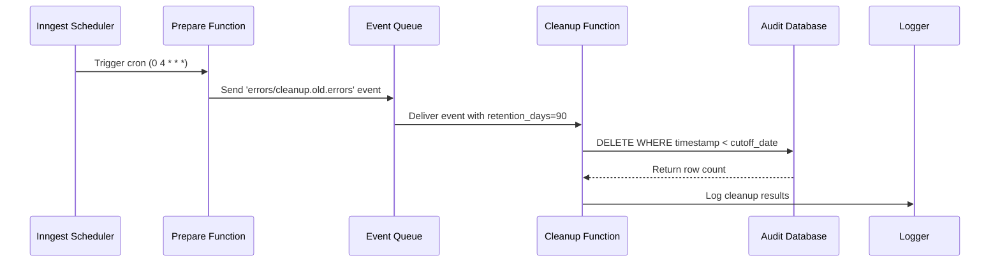
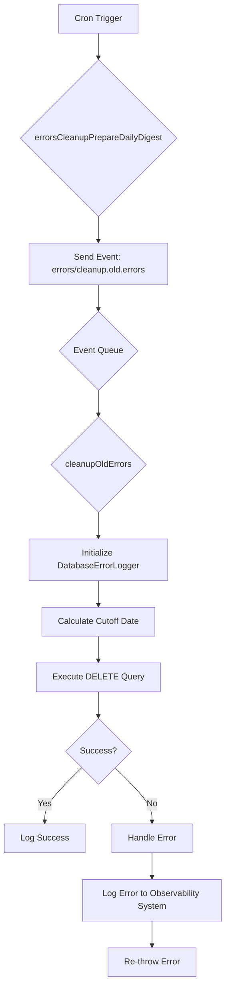
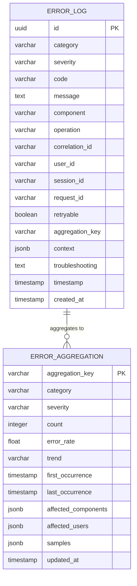
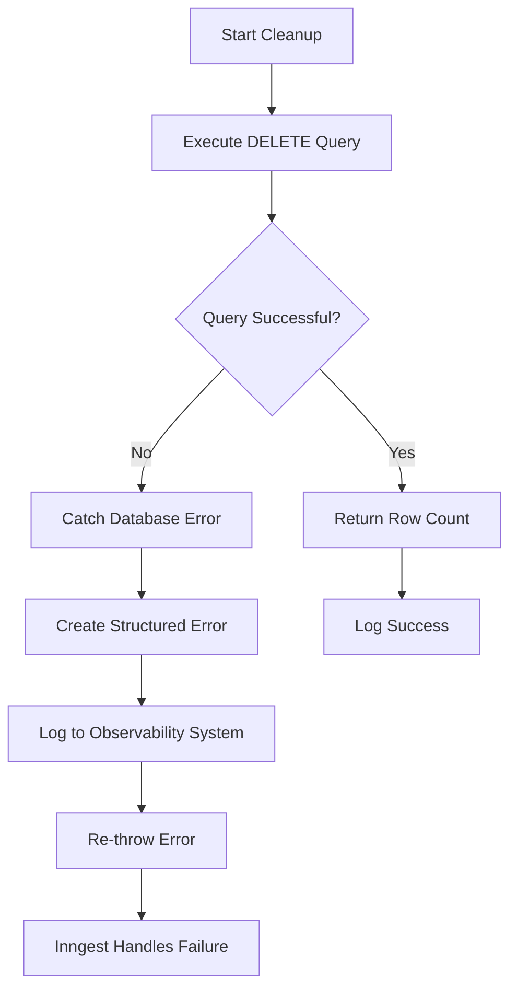

# Cleanup Old Errors Function

<cite>
**Referenced Files in This Document**   
- [cleanup-old-errors.ts](file://apps/inngest/src/inngest/functions/errors/cleanup-old-errors.ts)
- [client.ts](file://apps/inngest/src/inngest/client.ts)
- [types.ts](file://apps/inngest/src/inngest/types.ts)
- [database-error-logger.ts](file://packages/audit/src/error/database-error-logger.ts)
- [schema.ts](file://packages/audit-db/src/db/schema.ts)
</cite>

## Table of Contents
1. [Introduction](#introduction)
2. [Function Overview](#function-overview)
3. [Architecture and Workflow](#architecture-and-workflow)
4. [Implementation Details](#implementation-details)
5. [Database Schema and Data Model](#database-schema-and-data-model)
6. [Retention Policy and Compliance](#retention-policy-and-compliance)
7. [Error Handling and Reliability](#error-handling-and-reliability)
8. [Performance Considerations](#performance-considerations)
9. [Operational Guidance](#operational-guidance)

## Introduction
The Cleanup Old Errors function is a critical maintenance component in the smart-logs system, designed to maintain optimal system performance by removing stale error records from the database according to defined retention policies. This function operates as part of the Inngest workflow system, executing on a scheduled basis to identify and remove obsolete error records that have exceeded their retention period. The function plays a vital role in database maintenance, ensuring that error data is managed in compliance with regulatory requirements while preventing uncontrolled database growth that could impact system performance.

**Section sources**
- [cleanup-old-errors.ts](file://apps/inngest/src/inngest/functions/errors/cleanup-old-errors.ts)

## Function Overview
The cleanup-old-errors function serves as a scheduled maintenance task that removes expired error records from the audit database. It operates through a two-step process: first, a cron-triggered function prepares the cleanup operation by sending an event, and second, an event-driven function executes the actual deletion of old error records. This separation of concerns allows for flexible scheduling while maintaining the benefits of event-driven architecture.

The primary purpose of this function is to maintain system performance by preventing the uncontrolled accumulation of error records in the database. By removing records that have exceeded their retention period, the function helps maintain optimal database size, improves query performance, and ensures compliance with data retention policies. The function is designed to be resilient, with comprehensive error handling that ensures failures in the cleanup process do not cascade to other system components.



**Diagram sources**
- [cleanup-old-errors.ts](file://apps/inngest/src/inngest/functions/errors/cleanup-old-errors.ts)

**Section sources**
- [cleanup-old-errors.ts](file://apps/inngest/src/inngest/functions/errors/cleanup-old-errors.ts)

## Architecture and Workflow
The cleanup-old-errors function implements a decoupled architecture that separates the scheduling mechanism from the execution logic. This design follows the event-driven architecture pattern, where a cron-triggered function initiates the process by sending an event to the Inngest event queue, and a separate event-driven function consumes this event to perform the actual cleanup operation.

The workflow begins with the `errorsCleanupPrepareDailyDigest` function, which is triggered daily at 4:00 AM Lisbon time via a cron expression. This function's sole responsibility is to send an event named 'errors/cleanup.old.errors' with a payload containing the retention period (90 days by default). This event is then processed by the `cleanupOldErrors` function, which receives the event and executes the cleanup operation.

This architectural approach provides several benefits: it decouples scheduling from execution, allows for retry mechanisms if the cleanup fails, enables monitoring of both the scheduling and execution phases separately, and provides a clear audit trail of when cleanup operations were initiated and completed. The use of Inngest as the orchestration layer ensures reliable event delivery and provides built-in observability for monitoring the function's execution.



**Diagram sources**
- [cleanup-old-errors.ts](file://apps/inngest/src/inngest/functions/errors/cleanup-old-errors.ts)

**Section sources**
- [cleanup-old-errors.ts](file://apps/inngest/src/inngest/functions/errors/cleanup-old-errors.ts)

## Implementation Details
The implementation of the cleanup-old-errors function consists of two primary components: the event preparation function and the event processing function. The preparation function, `errorsCleanupPrepareDailyDigest`, is defined with a cron trigger that executes daily at 4:00 AM Lisbon time. It uses the Inngest step primitives to send an event with the name 'errors/cleanup.old.errors' and includes the retention period (90 days) in the event data.

The core cleanup logic resides in the `cleanupOldErrors` function, which is triggered by the 'errors/cleanup.old.errors' event. This function receives the Inngest context containing services such as the database connection, error handling service, and logger. It first ensures that a DatabaseErrorLogger instance is available, creating one if necessary by injecting the audit database connection and error log table references.

The cleanup process calculates a cutoff date by subtracting the retention period (in days) from the current date. It then executes a DELETE query on the error log table, removing all records with a timestamp earlier than the cutoff date. The function returns the number of deleted records, which is logged for monitoring purposes. The implementation uses parameterized queries through the Drizzle ORM to prevent SQL injection and ensure query safety.

```typescript
// Simplified code example from cleanup-old-errors.ts
export const cleanupOldErrors = inngest.createFunction(
	{ id: 'cleanup-old-errors' },
	{ event: 'errors/cleanup.old.errors' },
	async ({ event, services }) => {
		const { db, error, logger } = services
		if (!databaseErrorLogger) {
			databaseErrorLogger = new DatabaseErrorLogger(db.audit, errorLog, errorAggregation)
		}
		const { retention_days } = event.data

		try {
			const errors = await databaseErrorLogger.cleanupOldErrors(retention_days)
			logger.info(`Cleaned up ${errors} errors`)
		} catch (e) {
			// Error handling logic
		}
	}
)
```

**Section sources**
- [cleanup-old-errors.ts](file://apps/inngest/src/inngest/functions/errors/cleanup-old-errors.ts)
- [database-error-logger.ts](file://packages/audit/src/error/database-error-logger.ts)

## Database Schema and Data Model
The cleanup operation targets the error logging system implemented in the audit database package. The primary table involved in the cleanup process is the error log table, which stores individual error records with comprehensive metadata. Each error record includes fields such as ID, category, severity, code, message, component, operation, correlation ID, user ID, session ID, request ID, retryable flag, aggregation key, troubleshooting information, and timestamps.

The data model for error records is defined by the `StructuredError` interface, which represents the application-level structure of error information. This interface includes properties for error identification, classification, context, and metadata. The actual database storage uses a normalized schema with specific data types and constraints to ensure data integrity and optimize storage efficiency.

The error log table is indexed on key fields including timestamp, category, severity, and component to support efficient querying patterns. The timestamp field is particularly important for the cleanup operation, as it enables range-based queries to identify records that have exceeded their retention period. The database schema also includes a separate error aggregation table that maintains summarized information about error patterns, which is not directly affected by the cleanup operation.



**Diagram sources**
- [schema.ts](file://packages/audit-db/src/db/schema.ts)
- [database-error-logger.ts](file://packages/audit/src/error/database-error-logger.ts)

**Section sources**
- [schema.ts](file://packages/audit-db/src/db/schema.ts)
- [database-error-logger.ts](file://packages/audit/src/error/database-error-logger.ts)

## Retention Policy and Compliance
The cleanup-old-errors function aligns with the organization's data retention policies and compliance requirements by implementing a configurable retention period for error records. The default retention period of 90 days is specified in the event payload and can be adjusted based on organizational policies or regulatory requirements.

The system supports a comprehensive retention policy framework through the audit_retention_policy table, which defines retention rules for different data classifications. This table includes fields for policy name, retention days, archive after days, delete after days, data classification, and active status. The cleanup function respects these policies by using the retention_days value from the event data, which should be configured according to the appropriate retention policy for the error data.

Compliance with data protection regulations such as GDPR is ensured through the implementation of data lifecycle management practices. The cleanup function represents the final stage of the data lifecycle for error records, ensuring that personal data and other sensitive information are not retained longer than necessary. The function's operation is logged for audit purposes, providing a record of when data deletion operations were performed.

```typescript
// Example retention policy configuration
interface RetentionPolicy {
  policyName: string
  dataClassification: string
  retentionDays: number
  archiveAfterDays?: number
  deleteAfterDays?: number
  isActive: boolean
}

// Example policy for error logs
const errorLogPolicy: RetentionPolicy = {
  policyName: "error-log-retention",
  dataClassification: "INTERNAL",
  retentionDays: 90,
  isActive: true
}
```

**Section sources**
- [schema.ts](file://packages/audit-db/src/db/schema.ts)
- [cleanup-old-errors.ts](file://apps/inngest/src/inngest/functions/errors/cleanup-old-errors.ts)

## Error Handling and Reliability
The cleanup-old-errors function implements comprehensive error handling to ensure reliability and prevent cascading failures. The function is wrapped in a try-catch block that captures any exceptions that occur during the cleanup process. When an error is caught, it is processed through the system's error handling service, which creates a structured error representation and logs it to the observability system.

The error handling process includes several key steps: extracting the error message and metadata, creating a structured error object, logging the error to the monitoring system, and re-throwing the error to signal failure to the Inngest orchestration layer. This approach ensures that cleanup failures are properly recorded and can be investigated, while also allowing Inngest to implement retry mechanisms if configured.

The DatabaseErrorLogger class, which performs the actual database operations, also includes its own error handling mechanisms. If a database operation fails, it logs the error to the console as a fallback, ensuring that even if the primary logging system is unavailable, the error is still recorded. This layered approach to error handling provides resilience and ensures that issues with the cleanup process are not silently ignored.



**Diagram sources**
- [cleanup-old-errors.ts](file://apps/inngest/src/inngest/functions/errors/cleanup-old-errors.ts)
- [database-error-logger.ts](file://packages/audit/src/error/database-error-logger.ts)

**Section sources**
- [cleanup-old-errors.ts](file://apps/inngest/src/inngest/functions/errors/cleanup-old-errors.ts)
- [database-error-logger.ts](file://packages/audit/src/error/database-error-logger.ts)

## Performance Considerations
The performance of the cleanup-old-errors function is critical to system stability, as inefficient cleanup operations could impact database performance during execution. The function is designed to minimize performance impact through several optimization strategies.

The cleanup operation uses a simple DELETE query with a WHERE clause on the timestamp field, which is indexed in the database. This allows the database to efficiently identify and remove records without requiring a full table scan. The operation is performed as a single atomic transaction, reducing overhead compared to row-by-row deletion.

The function is scheduled to run during off-peak hours (4:00 AM Lisbon time) to minimize impact on user-facing operations. This timing ensures that the cleanup process does not compete with peak system usage for database resources. Additionally, the use of the Inngest orchestration layer provides built-in monitoring and alerting capabilities, allowing operations teams to track the duration and resource usage of cleanup operations.

For very large datasets, the current implementation could be enhanced with batch processing to prevent long-running transactions and excessive memory usage. This could involve deleting records in smaller batches with pauses between batches to allow the database to recover. The Drizzle ORM used in the implementation supports query optimization features that could be leveraged to further improve performance.

**Section sources**
- [cleanup-old-errors.ts](file://apps/inngest/src/inngest/functions/errors/cleanup-old-errors.ts)
- [database-error-logger.ts](file://packages/audit/src/error/database-error-logger.ts)

## Operational Guidance
To effectively manage the cleanup-old-errors function, operations teams should follow several best practices for monitoring, tuning, and troubleshooting.

**Retention Policy Tuning**: The retention period should be reviewed periodically based on storage requirements, compliance needs, and operational requirements for error analysis. The default 90-day retention may be adjusted up or down based on organizational policies. When changing the retention period, it should be updated in the event data payload of the preparation function.

**Monitoring and Alerting**: Key metrics to monitor include the number of records cleaned up per execution, execution duration, and error rates. Alerts should be configured for failed executions or unusually high cleanup volumes that might indicate system issues. The Inngest dashboard provides visibility into function execution history and performance.

**Performance Optimization**: For databases with very high error volumes, consider implementing batch processing to avoid long-running transactions. Monitor database performance metrics during cleanup operations and adjust the schedule if necessary to avoid peak usage periods. Ensure that appropriate indexes are in place on the timestamp field to optimize the cleanup query.

**Troubleshooting**: Common issues include database connectivity problems, permission issues, and schema mismatches. When troubleshooting, check the function logs in the observability system, verify database connectivity, and confirm that the error log table schema matches the expected structure. The function's error handling should provide detailed information about the nature of any failures.

**Compliance Verification**: Regularly audit the cleanup process to ensure it aligns with data retention policies. Verify that records are being removed according to the specified retention period and that the process is properly logged for compliance purposes.

**Section sources**
- [cleanup-old-errors.ts](file://apps/inngest/src/inngest/functions/errors/cleanup-old-errors.ts)
- [database-error-logger.ts](file://packages/audit/src/error/database-error-logger.ts)