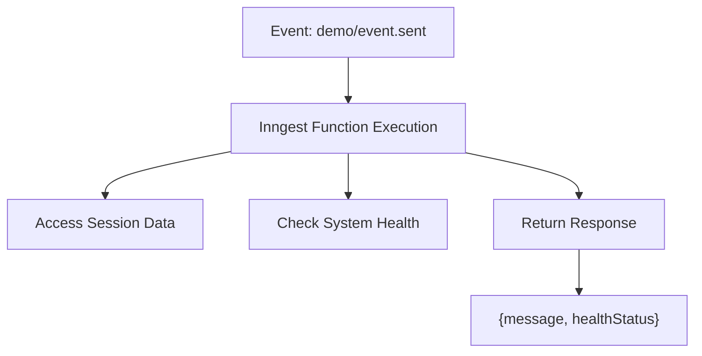
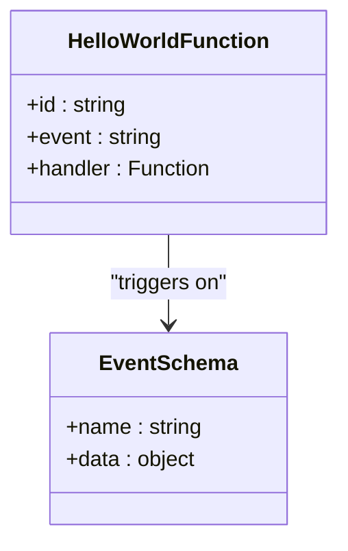
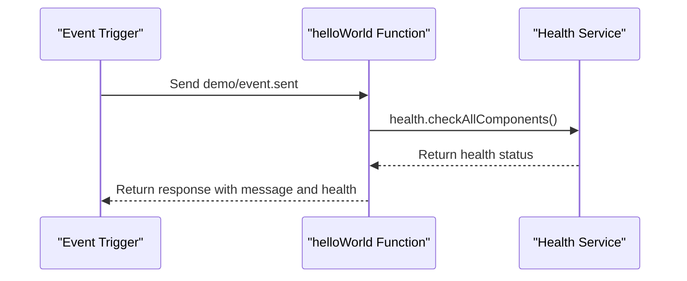
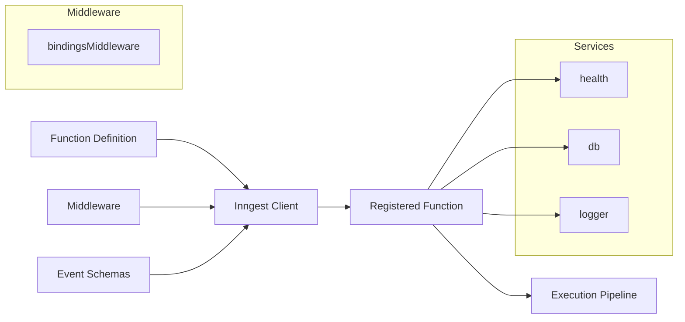
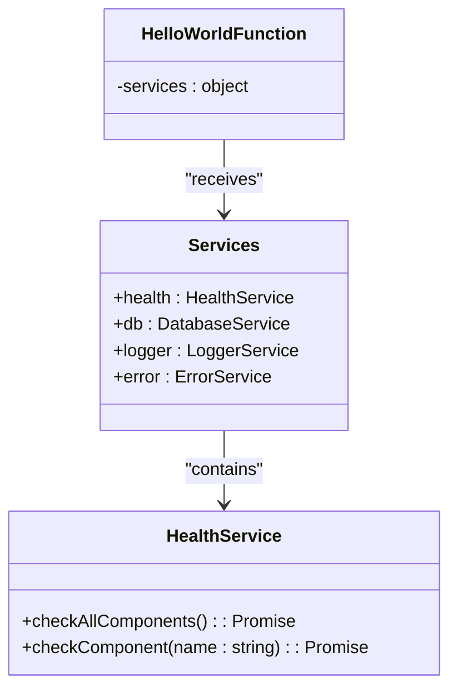
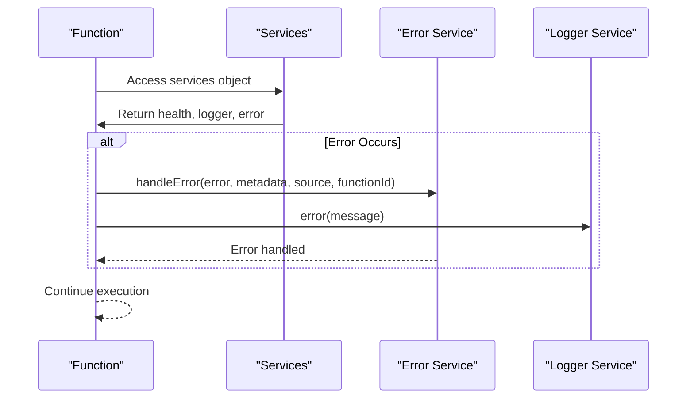
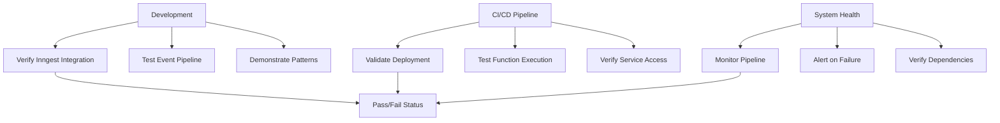

# Hello World Function

<cite>
**Referenced Files in This Document**   
- [helloWorld.ts](file://apps/inngest/src/inngest/functions/helloWorld.ts)
- [client.ts](file://apps/inngest/src/inngest/client.ts)
- [middleware.ts](file://apps/inngest/src/inngest/middleware.ts)
- [types.ts](file://apps/inngest/src/inngest/types.ts)
- [index.ts](file://apps/inngest/src/index.ts)
- [health-check.ts](file://packages/audit/src/monitor/health-check.ts)
- [cleanup-old-alerts.ts](file://apps/inngest/src/inngest/functions/alerts/cleanup-old-alerts.ts)
- [cleanup-old-errors.ts](file://apps/inngest/src/inngest/functions/errors/cleanup-old-errors.ts)
</cite>

## Table of Contents
1. [Introduction](#introduction)
2. [Function Overview](#function-overview)
3. [Event Trigger and Signature](#event-trigger-and-signature)
4. [Execution Logic](#execution-logic)
5. [Response Format](#response-format)
6. [Function Registration and Pipeline](#function-registration-and-pipeline)
7. [Template and Development Utility](#template-and-development-utility)
8. [Integration with System Services](#integration-with-system-services)
9. [Error Handling and Logging Practices](#error-handling-and-logging-practices)
10. [Usage in Development and CI/CD](#usage-in-development-and-cicd)
11. [Extensibility and Customization](#extensibility-and-customization)

## Introduction
The helloWorld function serves as a foundational example within the Inngest event processing system, designed to verify integration, demonstrate proper function structure, and provide a template for new function development. This document provides a comprehensive analysis of the function's implementation, architecture, and utility within the broader system context.

## Function Overview
The helloWorld function is a sample Inngest function that demonstrates the basic structure and patterns used throughout the event processing system. It serves multiple purposes: as a verification tool for the Inngest integration, as a template for new function development, and as a demonstration of proper logging, error handling, and service integration patterns.



**Diagram sources**
- [helloWorld.ts](file://apps/inngest/src/inngest/functions/helloWorld.ts#L1-L18)

**Section sources**
- [helloWorld.ts](file://apps/inngest/src/inngest/functions/helloWorld.ts#L1-L18)

## Event Trigger and Signature
The helloWorld function is triggered by the `demo/event.sent` event, which is defined in the event schemas. This event-based trigger demonstrates the core event-driven architecture of the Inngest system. The function's signature follows the standard Inngest pattern with an ID, event trigger, and asynchronous handler.



**Diagram sources**
- [helloWorld.ts](file://apps/inngest/src/inngest/functions/helloWorld.ts#L3-L4)
- [types.ts](file://apps/inngest/src/inngest/types.ts#L3-L6)

**Section sources**
- [helloWorld.ts](file://apps/inngest/src/inngest/functions/helloWorld.ts#L3-L4)
- [types.ts](file://apps/inngest/src/inngest/types.ts#L3-L6)

## Execution Logic
The execution logic of the helloWorld function is intentionally simple yet comprehensive, demonstrating key patterns used throughout the system. It accesses the health service from the injected services, performs a comprehensive health check, and returns a personalized message based on session data.



**Diagram sources**
- [helloWorld.ts](file://apps/inngest/src/inngest/functions/helloWorld.ts#L7-L15)
- [health-check.ts](file://packages/audit/src/monitor/health-check.ts#L390-L437)

**Section sources**
- [helloWorld.ts](file://apps/inngest/src/inngest/functions/helloWorld.ts#L7-L15)

## Response Format
The helloWorld function returns a structured JSON response containing a personalized message and comprehensive system health status. This response format demonstrates the standard pattern for function outputs in the system, providing both user-facing information and system diagnostic data.

```json
{
  "message": "Hello John Doe!",
  "healthStatus": {
    "status": "OK",
    "components": {
      "database": { "status": "OK", "message": "Database connection ok" },
      "redis": { "status": "OK", "message": "Redis connection ready" }
    },
    "timestamp": "2024-01-01T00:00:00.000Z"
  }
}
```

**Section sources**
- [helloWorld.ts](file://apps/inngest/src/inngest/functions/helloWorld.ts#L13-L17)

## Function Registration and Pipeline
The helloWorld function is registered with the Inngest client through a well-defined pipeline that ensures proper middleware application and service injection. The registration process demonstrates the system's modular architecture and dependency injection patterns.



**Diagram sources**
- [client.ts](file://apps/inngest/src/inngest/client.ts#L1-L14)
- [middleware.ts](file://apps/inngest/src/inngest/middleware.ts#L1-L30)
- [index.ts](file://apps/inngest/src/inngest/index.ts#L1-L20)

**Section sources**
- [client.ts](file://apps/inngest/src/inngest/client.ts#L1-L14)
- [middleware.ts](file://apps/inngest/src/inngest/middleware.ts#L1-L30)

## Template and Development Utility
The helloWorld function serves as a comprehensive template for creating new Inngest functions, demonstrating best practices in structure, service access, and error handling. Its implementation provides a clear example of the standard patterns used throughout the codebase, making it an essential reference for developers.

```mermaid
classDiagram
class InngestFunctionTemplate {
+id : string
+trigger : object
+handler : Function
}
class HelloWorld {
+id : 'hello-world'
+trigger : {event : 'demo/event.sent'}
+handler : async ({event, step, env, session, services})
}
class NewFunction {
+id : string
+trigger : object
+handler : Function
}
InngestFunctionTemplate <|-- HelloWorld
InngestFunctionTemplate <|-- NewFunction
```

**Diagram sources**
- [helloWorld.ts](file://apps/inngest/src/inngest/functions/helloWorld.ts#L1-L18)
- [cleanup-old-alerts.ts](file://apps/inngest/src/inngest/functions/alerts/cleanup-old-alerts.ts#L1-L109)
- [cleanup-old-errors.ts](file://apps/inngest/src/inngest/functions/errors/cleanup-old-errors.ts#L1-L60)

**Section sources**
- [helloWorld.ts](file://apps/inngest/src/inngest/functions/helloWorld.ts#L1-L18)

## Integration with System Services
The helloWorld function demonstrates the system's service integration pattern by accessing the health service through the injected services object. This dependency injection approach ensures loose coupling and testability, allowing functions to access shared services without direct dependencies.



**Diagram sources**
- [helloWorld.ts](file://apps/inngest/src/inngest/functions/helloWorld.ts#L7-L8)
- [health-check.ts](file://packages/audit/src/monitor/health-check.ts#L390-L437)
- [middleware.ts](file://apps/inngest/src/inngest/middleware.ts#L15-L25)

**Section sources**
- [helloWorld.ts](file://apps/inngest/src/inngest/functions/helloWorld.ts#L7-L8)

## Error Handling and Logging Practices
While the helloWorld function itself has minimal error handling due to its simplicity, it demonstrates the standard context and service access patterns used for error handling in more complex functions. The function's structure shows how error services and logging would be accessed in production functions.



**Diagram sources**
- [cleanup-old-alerts.ts](file://apps/inngest/src/inngest/functions/alerts/cleanup-old-alerts.ts#L25-L40)
- [cleanup-old-errors.ts](file://apps/inngest/src/inngest/functions/errors/cleanup-old-errors.ts#L45-L60)
- [middleware.ts](file://apps/inngest/src/inngest/middleware.ts#L15-L25)

## Usage in Development and CI/CD
The helloWorld function plays a critical role in development workflows, CI/CD pipelines, and system health validation. It serves as a canary for the Inngest integration, allowing developers to quickly verify that the event processing pipeline is functioning correctly.



**Section sources**
- [index.ts](file://apps/inngest/src/index.ts#L34-L45)
- [helloWorld.ts](file://apps/inngest/src/inngest/functions/helloWorld.ts#L1-L18)

## Extensibility and Customization
The helloWorld function demonstrates how Inngest functions can be extended and customized while maintaining compatibility with the overall event processing architecture. Developers can use this function as a starting point for creating new functions with custom logic, additional services, and different trigger patterns.

```mermaid
classDiagram
class BaseFunction {
+id : string
+trigger : object
+handler : Function
}
class HelloWorld {
+id : 'hello-world'
+trigger : {event : 'demo/event.sent'}
+handler : returns message and health
}
class CustomFunction {
+id : string
+trigger : object
+handler : custom logic
}
class ScheduledFunction {
+id : string
+trigger : {cron : string}
+handler : scheduled logic
}
BaseFunction <|-- HelloWorld
BaseFunction <|-- CustomFunction
BaseFunction <|-- ScheduledFunction
```

**Diagram sources**
- [helloWorld.ts](file://apps/inngest/src/inngest/functions/helloWorld.ts#L1-L18)
- [cleanup-old-alerts.ts](file://apps/inngest/src/inngest/functions/alerts/cleanup-old-alerts.ts#L15-L41)
- [cleanup-old-errors.ts](file://apps/inngest/src/inngest/functions/errors/cleanup-old-errors.ts#L15-L25)

**Section sources**
- [helloWorld.ts](file://apps/inngest/src/inngest/functions/helloWorld.ts#L1-L18)