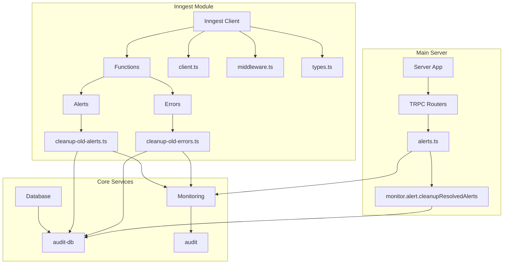
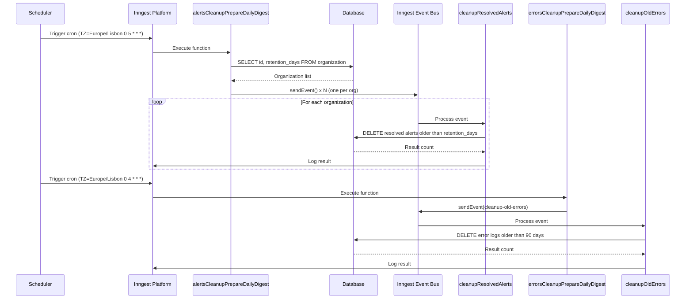
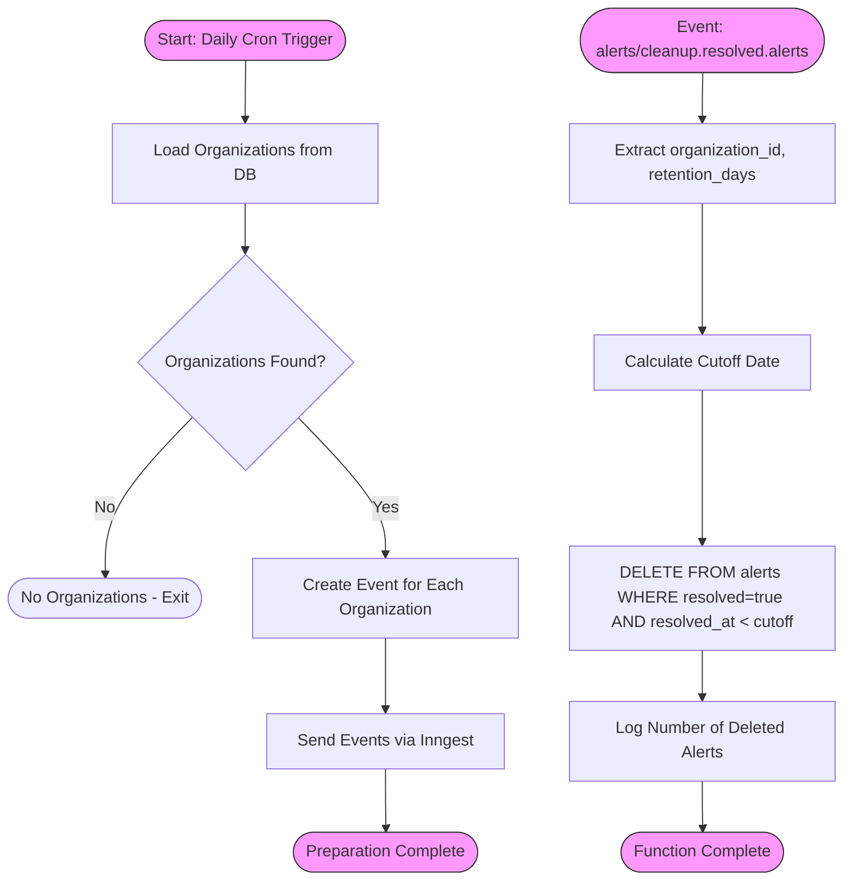
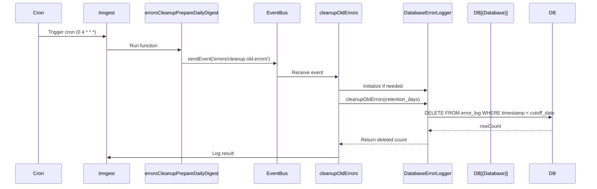
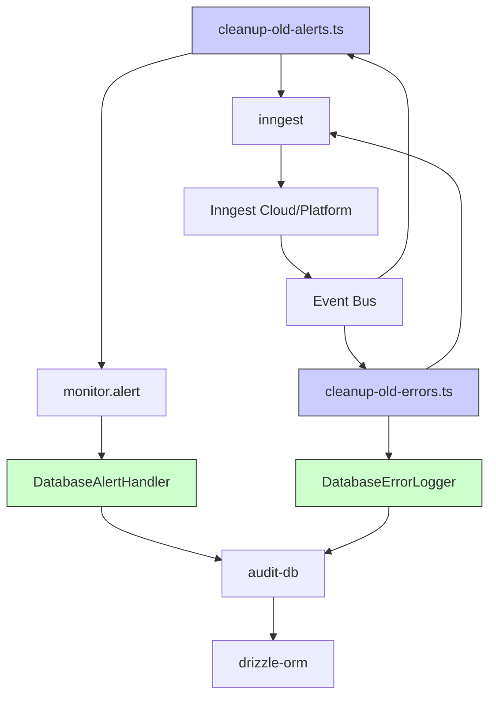

# Inngest Functions

<cite>
**Referenced Files in This Document**   
- [cleanup-old-alerts.ts](file://apps/inngest/src/inngest/functions/alerts/cleanup-old-alerts.ts)
- [cleanup-old-errors.ts](file://apps/inngest/src/inngest/functions/errors/cleanup-old-errors.ts)
- [client.ts](file://apps/inngest/src/inngest/client.ts)
- [index.ts](file://apps/inngest/src/inngest/index.ts)
- [database-alert-handler.ts](file://packages/audit/src/monitor/database-alert-handler.ts)
- [database-error-logger.ts](file://packages/audit/src/error/database-error-logger.ts)
- [alerts.ts](file://apps/server/src/routers/alerts.ts)
- [index.ts](file://apps/server/src/index.ts)
</cite>

## Table of Contents
1. [Introduction](#introduction)
2. [Project Structure](#project-structure)
3. [Core Components](#core-components)
4. [Architecture Overview](#architecture-overview)
5. [Detailed Component Analysis](#detailed-component-analysis)
6. [Dependency Analysis](#dependency-analysis)
7. [Performance Considerations](#performance-considerations)
8. [Troubleshooting Guide](#troubleshooting-guide)
9. [Conclusion](#conclusion)

## Introduction
Inngest Functions serve as asynchronous background workers responsible for system maintenance and event processing within the smart-logs application. These functions are designed to handle time-consuming tasks outside the main request-response cycle, ensuring optimal performance and reliability. Key responsibilities include cleaning up stale data such as resolved alerts and old error records based on configurable retention policies. The Inngest framework enables these operations through scheduled cron jobs and event-driven triggers, supporting patterns like fan-out for parallel processing across multiple organizations. This document provides a comprehensive overview of the implementation details, execution logic, error handling, integration points with the audit database, and observability features.

## Project Structure
The Inngest functions are organized under the `apps/inngest` directory, which contains all background processing logic. This modular structure separates concerns between real-time API handling (in `apps/server`) and deferred background tasks. The functions are grouped by domain—alerts and errors—within dedicated subdirectories, promoting clarity and maintainability. Shared utilities such as the Inngest client configuration, middleware, and type definitions reside at the root of the `inngest` module. The main server application does not directly invoke these functions but instead relies on the Inngest platform to trigger them based on cron schedules or incoming events. Configuration values such as retention periods are managed externally via the `ConfigurationManager`, allowing dynamic control without code changes.

**Diagram sources**
- [cleanup-old-alerts.ts](file://apps/inngest/src/inngest/functions/alerts/cleanup-old-alerts.ts)
- [cleanup-old-errors.ts](file://apps/inngest/src/inngest/functions/errors/cleanup-old-errors.ts)
- [client.ts](file://apps/inngest/src/inngest/client.ts)
- [alerts.ts](file://apps/server/src/routers/alerts.ts)

**Section sources**
- [cleanup-old-alerts.ts](file://apps/inngest/src/inngest/functions/alerts/cleanup-old-alerts.ts)
- [cleanup-old-errors.ts](file://apps/inngest/src/inngest/functions/errors/cleanup-old-errors.ts)

## Core Components
The core components of the Inngest system include the function definitions for alert and error cleanup, the Inngest client configuration, and the service integrations that enable database access and monitoring. Each function is defined using the `inngest.createFunction` method, specifying either a cron schedule or an event trigger. The `cleanup-old-alerts` function implements a fan-out pattern where a single preparatory function queries all organizations and dispatches individual events for each one, enabling parallel execution. Similarly, the `cleanup-old-errors` function removes outdated error logs based on a global retention policy. Both functions leverage shared services such as logging, error handling, and database access through the `services` context injected by Inngest.

**Section sources**
- [cleanup-old-alerts.ts](file://apps/inngest/src/inngest/functions/alerts/cleanup-old-alerts.ts#L1-L108)
- [cleanup-old-errors.ts](file://apps/inngest/src/inngest/functions/errors/cleanup-old-errors.ts#L1-L59)

## Architecture Overview
The architecture leverages Inngest’s event-driven model to decouple background processing from the main application flow. Scheduled functions trigger at specific times (e.g., daily at 4 AM or 5 AM Lisbon time), initiating cleanup workflows. For alerts, a two-phase process ensures scalability: first, a coordinator function retrieves all organizations from the database; second, it emits one event per organization, allowing independent and concurrent processing. This fan-out pattern prevents long-running transactions and improves fault isolation. Error cleanup follows a simpler direct model due to its global scope. All operations interact with the audit database via dedicated service classes (`DatabaseAlertHandler`, `DatabaseErrorLogger`) that abstract SQL execution and provide resilience features like retry logic and circuit breakers.

**Diagram sources**
- [cleanup-old-alerts.ts](file://apps/inngest/src/inngest/functions/alerts/cleanup-old-alerts.ts)
- [cleanup-old-errors.ts](file://apps/inngest/src/inngest/functions/errors/cleanup-old-errors.ts)

## Detailed Component Analysis

### Alert Cleanup Function Analysis
The alert cleanup functionality is implemented in two parts: a preparatory function that orchestrates the process and a worker function that performs the actual deletion. The preparatory function, `alertsCleanupPrepareDailyDigest`, runs daily at 5:00 AM Lisbon time and queries the `organization` table to retrieve all tenant IDs along with their respective alert retention policies. It then uses the Inngest `step.sendEvent` method to emit one `alerts/cleanup.resolved.alerts` event per organization, enabling parallel execution. This fan-out strategy ensures that large numbers of organizations do not cause timeouts or performance degradation in a single function invocation.

The worker function, `cleanupResolvedAlerts`, listens for these events and calls the `monitor.alert.cleanupResolvedAlerts` method with the organization ID and retention days from the event payload. This method executes a parameterized SQL DELETE statement targeting resolved alerts whose `resolved_at` timestamp is older than the calculated cutoff date. The operation returns the number of deleted rows, which is logged for observability.

#### Alert Cleanup Flowchart

**Diagram sources**
- [cleanup-old-alerts.ts](file://apps/inngest/src/inngest/functions/alerts/cleanup-old-alerts.ts#L1-L108)

**Section sources**
- [cleanup-old-alerts.ts](file://apps/inngest/src/inngest/functions/alerts/cleanup-old-alerts.ts#L1-L108)
- [database-alert-handler.ts](file://packages/audit/src/monitor/database-alert-handler.ts#L380-L400)

### Error Cleanup Function Analysis
The error cleanup function operates on a global retention policy of 90 days and is triggered daily at 4:00 AM Lisbon time. Unlike the alert cleanup, it does not require per-organization processing, making its design simpler. The preparatory function, `errorsCleanupPrepareDailyDigest`, immediately sends a single `errors/cleanup.old.errors` event with the retention period embedded in the payload. This event triggers the `cleanupOldErrors` worker function, which initializes a `DatabaseErrorLogger` instance if not already created.

The `DatabaseErrorLogger.cleanupOldErrors` method calculates a cutoff date by subtracting the retention days from the current date and issues a DELETE query against the `error_log` table for entries older than this threshold. The result includes the number of affected rows, which is reported in the logs. This function demonstrates efficient resource usage by reusing the logger instance across invocations and delegating low-level database operations to a well-tested service class.

#### Error Cleanup Sequence Diagram

**Diagram sources**
- [cleanup-old-errors.ts](file://apps/inngest/src/inngest/functions/errors/cleanup-old-errors.ts#L1-L59)
- [database-error-logger.ts](file://packages/audit/src/error/database-error-logger.ts#L350-L370)

**Section sources**
- [cleanup-old-errors.ts](file://apps/inngest/src/inngest/functions/errors/cleanup-old-errors.ts#L1-L59)
- [database-error-logger.ts](file://packages/audit/src/error/database-error-logger.ts#L350-L370)

## Dependency Analysis
The Inngest functions depend on several internal and external modules to fulfill their responsibilities. The primary dependencies include:
- `@repo/audit`: Provides the `DatabaseErrorLogger` and `monitor` service for interacting with error and alert data.
- `@repo/audit-db`: Supplies database schema definitions and query execution utilities used by both cleanup functions.
- `drizzle-orm`: Enables type-safe SQL queries for database interactions.
- `Inngest SDK`: Facilitates function definition, event triggering, scheduling, and step-based execution.

These dependencies are resolved through the monorepo structure using package aliases (`@repo/*`). Circular dependencies are avoided by clearly separating concerns: the `audit` package handles business logic, while `audit-db` manages data access. The Inngest functions themselves have no direct HTTP exposure, reducing attack surface and simplifying testing.

**Diagram sources**
- [cleanup-old-alerts.ts](file://apps/inngest/src/inngest/functions/alerts/cleanup-old-alerts.ts)
- [cleanup-old-errors.ts](file://apps/inngest/src/inngest/functions/errors/cleanup-old-errors.ts)
- [database-alert-handler.ts](file://packages/audit/src/monitor/database-alert-handler.ts)
- [database-error-logger.ts](file://packages/audit/src/error/database-error-logger.ts)

**Section sources**
- [cleanup-old-alerts.ts](file://apps/inngest/src/inngest/functions/alerts/cleanup-old-alerts.ts)
- [cleanup-old-errors.ts](file://apps/inngest/src/inngest/functions/errors/cleanup-old-errors.ts)

## Performance Considerations
Both cleanup functions are optimized for performance and scalability. The alert cleanup uses a fan-out pattern to distribute work across multiple function instances, preventing bottlenecks when dealing with many organizations. Each organization is processed independently, allowing for horizontal scaling and fault tolerance. Database queries are optimized using indexed fields such as `organization_id`, `resolved`, and `resolved_at`. The error cleanup function benefits from a single global operation, minimizing coordination overhead.

Retention policies are configurable and applied dynamically from organization settings, avoiding hard-coded values. The use of parameterized SQL queries prevents injection risks and allows query plan caching. Logging is kept minimal but sufficient for monitoring, with structured logs capturing key metrics like deletion counts and error details. Retry policies are implicitly handled by Inngest's built-in retry mechanism for failed function executions, ensuring eventual consistency even during transient failures.

## Troubleshooting Guide
Common issues with Inngest functions typically involve database connectivity, permission errors, or misconfigured environment variables. Key troubleshooting steps include:
- Verify `INNGEST_EVENT_KEY` and `INNGEST_SIGNING_KEY` are correctly set in environment variables.
- Check database connection health and ensure the `alerts` and `error_log` tables exist with proper indexes.
- Monitor function logs in the Inngest dashboard for execution duration, retries, and error messages.
- Validate that the `monitor` and `db` services are properly injected into the function context.
- Ensure the `retention_days` value is within expected bounds (1–365) and not null.

When debugging locally, use the Inngest CLI to replay events and inspect payloads. For production issues, correlate function logs with application metrics and tracing data to identify performance bottlenecks or cascading failures.

**Section sources**
- [client.ts](file://apps/inngest/src/inngest/client.ts#L1-L15)
- [cleanup-old-alerts.ts](file://apps/inngest/src/inngest/functions/alerts/cleanup-old-alerts.ts)
- [cleanup-old-errors.ts](file://apps/inngest/src/inngest/functions/errors/cleanup-old-errors.ts)

## Conclusion
Inngest Functions provide a robust mechanism for executing background maintenance tasks in the smart-logs application. By leveraging scheduled triggers and event-driven architectures, they ensure critical data cleanup operations occur reliably without impacting user-facing performance. The modular design, clear separation of concerns, and integration with monitoring and error handling systems make these functions maintainable and observable. Future enhancements could include configurable cron schedules via the UI, enhanced reporting on cleanup results, and integration with alerting systems to notify administrators of anomalies.