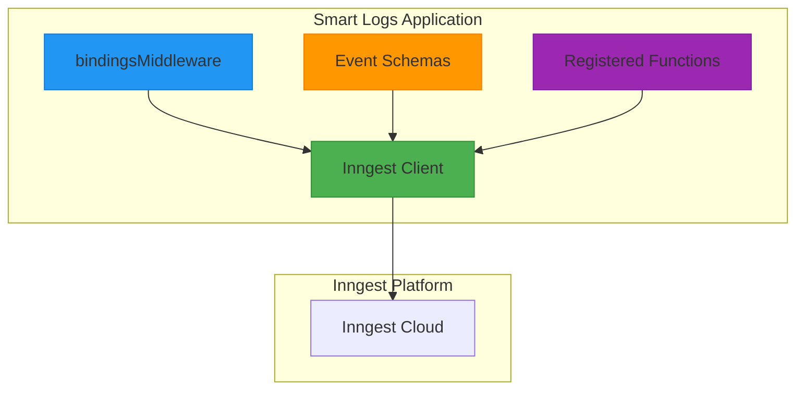
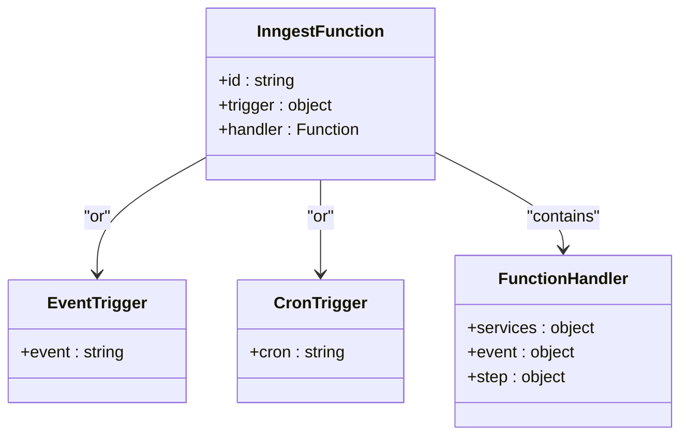
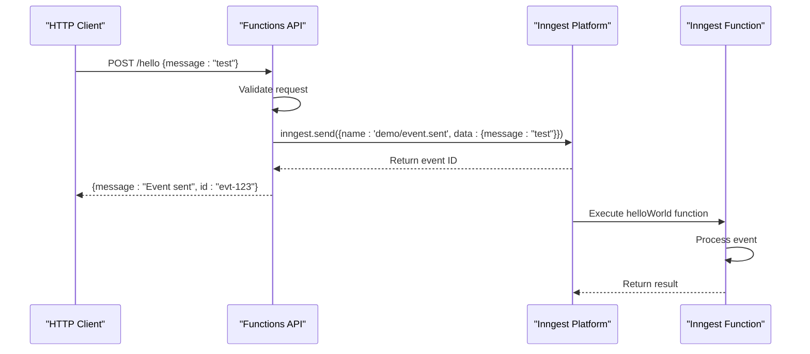
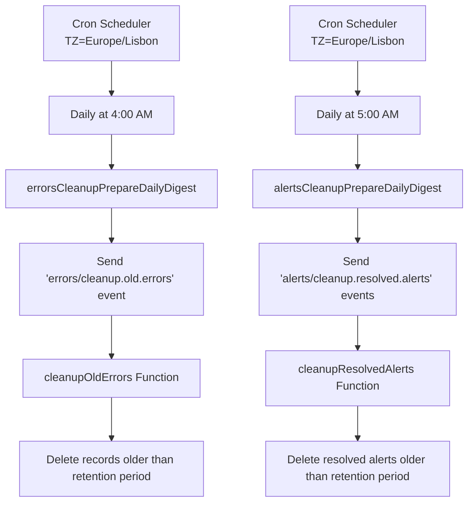
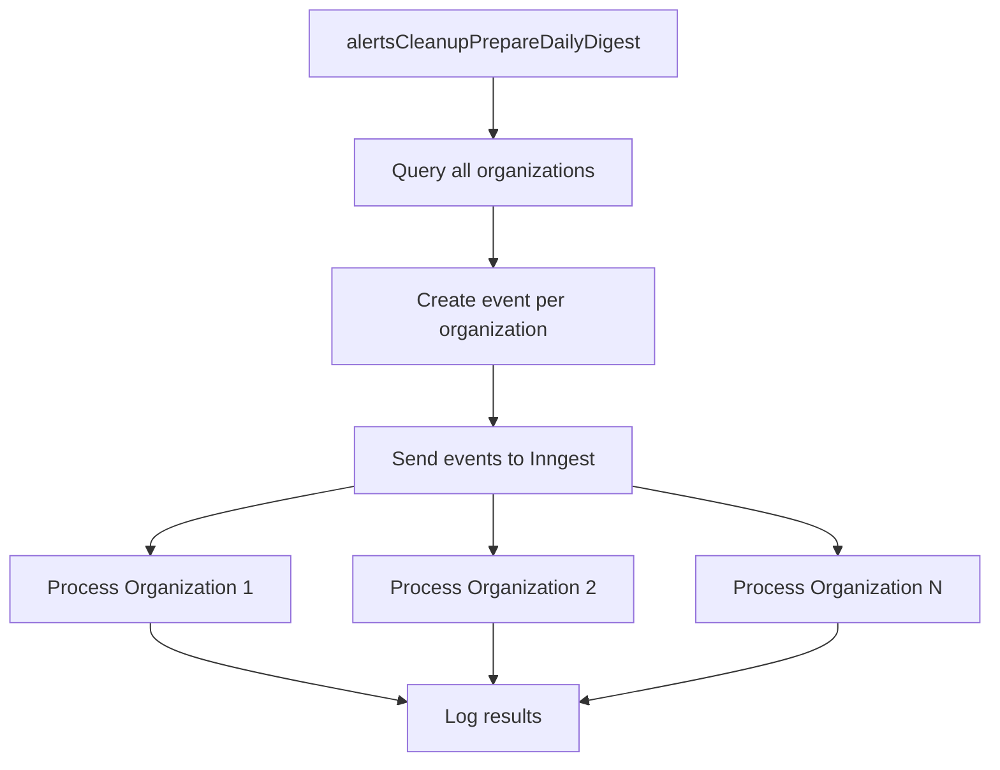
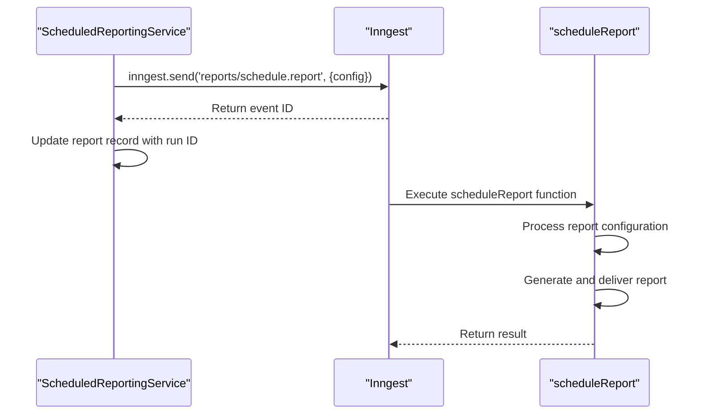
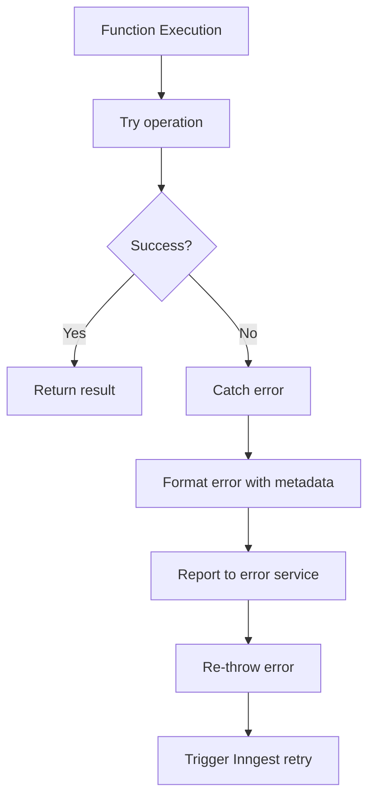

# Inngest Workflow Orchestration

<cite>
**Referenced Files in This Document**   
- [client.ts](file://apps/server/src/lib/inngest/client.ts)
- [middleware.ts](file://apps/server/src/lib/inngest/middleware.ts)
- [types.ts](file://apps/server/src/lib/inngest/types.ts)
- [helloWorld.ts](file://apps/server/src/lib/inngest/functions/helloWorld.ts)
- [cleanup-old-alerts.ts](file://apps/server/src/lib/inngest/functions/alerts/cleanup-old-alerts.ts)
- [cleanup-old-errors.ts](file://apps/server/src/lib/inngest/functions/errors/cleanup-old-errors.ts)
- [scheduleReport.ts](file://apps/server/src/lib/inngest/functions/reports/scheduleReport.ts)
- [sendEmail.ts](file://apps/server/src/lib/inngest/functions/emails/sendEmail.ts)
- [functions-api.ts](file://apps/server/src/routes/functions-api.ts)
- [scheduled-reporting.ts](file://packages/audit/src/report/scheduled-reporting.ts)
</cite>

## Table of Contents
1. [Introduction](#introduction)
2. [Inngest Integration Overview](#inngest-integration-overview)
3. [Workflow Definition and Function Registration](#workflow-definition-and-function-registration)
4. [Event Triggering Mechanisms](#event-triggering-mechanisms)
5. [Common Workflow Patterns](#common-workflow-patterns)
6. [Error Handling and Reliability](#error-handling-and-reliability)
7. [Monitoring and Observability](#monitoring-and-observability)
8. [Conclusion](#conclusion)

## Introduction
This document provides comprehensive documentation for the Inngest workflow orchestration system within the Smart Logs application. The Inngest integration enables event-driven automation, scheduled maintenance tasks, and complex workflow orchestration across multiple services. This documentation covers the core architecture, workflow definition patterns, event triggering mechanisms, error handling strategies, and monitoring capabilities that form the foundation of the system's background processing and automation capabilities.

## Inngest Integration Overview
The Inngest integration is implemented as a centralized workflow orchestration system that coordinates background tasks, scheduled jobs, and event-driven processes throughout the Smart Logs application. The integration is configured through a dedicated module in the server application that sets up the Inngest client, defines event schemas, and registers functions for execution.

The core components of the Inngest integration include:
- **Client Configuration**: The Inngest client is initialized with environment-specific settings including event key, signing key, and base URL
- **Middleware**: Custom middleware passes Hono context variables (session, services, environment) to Inngest functions
- **Event Schemas**: Type-safe definitions of events that can trigger functions
- **Function Registry**: Centralized registration of all Inngest functions

**Diagram sources**
- [client.ts](file://apps/server/src/lib/inngest/client.ts#L1-L14)
- [middleware.ts](file://apps/server/src/lib/inngest/middleware.ts#L1-L29)
- [types.ts](file://apps/server/src/lib/inngest/types.ts#L1-L85)

**Section sources**
- [client.ts](file://apps/server/src/lib/inngest/client.ts#L1-L14)
- [middleware.ts](file://apps/server/src/lib/inngest/middleware.ts#L1-L29)
- [types.ts](file://apps/server/src/lib/inngest/types.ts#L1-L85)

## Workflow Definition and Function Registration
Workflows in the Inngest system are defined as functions that respond to specific events or cron schedules. Each function is registered with the Inngest client and includes metadata about its trigger conditions and execution logic.

### Function Structure
Each Inngest function follows a consistent structure:
- **ID**: Unique identifier for the function
- **Trigger**: Event name or cron schedule that activates the function
- **Handler**: Asynchronous function that contains the business logic

The system registers several types of functions:
- **Event-triggered functions**: Respond to specific events in the system
- **Cron-triggered functions**: Execute on a scheduled basis
- **Fan-out patterns**: Distribute work across multiple parallel executions

**Diagram sources**
- [helloWorld.ts](file://apps/server/src/lib/inngest/functions/helloWorld.ts#L1-L18)
- [cleanup-old-alerts.ts](file://apps/server/src/lib/inngest/functions/alerts/cleanup-old-alerts.ts#L1-L108)
- [cleanup-old-errors.ts](file://apps/server/src/lib/inngest/functions/errors/cleanup-old-errors.ts#L1-L58)

**Section sources**
- [helloWorld.ts](file://apps/server/src/lib/inngest/functions/helloWorld.ts#L1-L18)
- [cleanup-old-alerts.ts](file://apps/server/src/lib/inngest/functions/alerts/cleanup-old-alerts.ts#L1-L108)
- [cleanup-old-errors.ts](file://apps/server/src/lib/inngest/functions/errors/cleanup-old-errors.ts#L1-L58)

## Event Triggering Mechanisms
The Inngest system supports multiple mechanisms for triggering workflows, including direct event emission, cron scheduling, and API-based invocation.

### Event Emission
Events can be triggered from various parts of the application, most commonly through API endpoints. The functions-api.ts file defines a REST endpoint that accepts POST requests and sends events to Inngest.

**Diagram sources**
- [functions-api.ts](file://apps/server/src/routes/functions-api.ts#L1-L59)
- [helloWorld.ts](file://apps/server/src/lib/inngest/functions/helloWorld.ts#L1-L18)

**Section sources**
- [functions-api.ts](file://apps/server/src/routes/functions-api.ts#L1-L59)
- [helloWorld.ts](file://apps/server/src/lib/inngest/functions/helloWorld.ts#L1-L18)

### Cron Scheduling
Time-based workflows are implemented using cron expressions that trigger functions at specified intervals. The system uses timezone-aware scheduling to ensure consistent execution.

**Diagram sources**
- [cleanup-old-alerts.ts](file://apps/server/src/lib/inngest/functions/alerts/cleanup-old-alerts.ts#L1-L43)
- [cleanup-old-errors.ts](file://apps/server/src/lib/inngest/functions/errors/cleanup-old-errors.ts#L1-L58)

**Section sources**
- [cleanup-old-alerts.ts](file://apps/server/src/lib/inngest/functions/alerts/cleanup-old-alerts.ts#L1-L43)
- [cleanup-old-errors.ts](file://apps/server/src/lib/inngest/functions/errors/cleanup-old-errors.ts#L1-L58)

## Common Workflow Patterns
The Inngest implementation employs several common workflow patterns to handle different types of background processing requirements.

### Fan-out Pattern
The fan-out pattern is used to distribute work across multiple parallel executions, improving scalability and performance. This pattern is implemented in the alerts cleanup workflow.

**Diagram sources**
- [cleanup-old-alerts.ts](file://apps/server/src/lib/inngest/functions/alerts/cleanup-old-alerts.ts#L43-L80)

**Section sources**
- [cleanup-old-alerts.ts](file://apps/server/src/lib/inngest/functions/alerts/cleanup-old-alerts.ts#L43-L80)

### Scheduled Reporting
The scheduled reporting workflow demonstrates how complex business processes are orchestrated through Inngest. Reports are scheduled and executed based on configuration.

**Diagram sources**
- [scheduled-reporting.ts](file://packages/audit/src/report/scheduled-reporting.ts#L752-L802)
- [scheduleReport.ts](file://apps/server/src/lib/inngest/functions/reports/scheduleReport.ts)

**Section sources**
- [scheduled-reporting.ts](file://packages/audit/src/report/scheduled-reporting.ts#L752-L802)
- [scheduleReport.ts](file://apps/server/src/lib/inngest/functions/reports/scheduleReport.ts)

## Error Handling and Reliability
The Inngest integration implements comprehensive error handling to ensure reliability and data integrity across all workflows.

### Error Handling Strategy
Each Inngest function includes try-catch blocks to gracefully handle exceptions. When an error occurs, it is logged through the system's error handling service with detailed metadata.

**Diagram sources**
- [cleanup-old-alerts.ts](file://apps/server/src/lib/inngest/functions/alerts/cleanup-old-alerts.ts#L77-L107)
- [cleanup-old-errors.ts](file://apps/server/src/lib/inngest/functions/errors/cleanup-old-errors.ts#L45-L58)

**Section sources**
- [cleanup-old-alerts.ts](file://apps/server/src/lib/inngest/functions/alerts/cleanup-old-alerts.ts#L77-L107)
- [cleanup-old-errors.ts](file://apps/server/src/lib/inngest/functions/errors/cleanup-old-errors.ts#L45-L58)

### Retry Mechanism
The system leverages Inngest's built-in retry policies, which automatically retry failed executions with exponential backoff. Error reporting includes rich metadata to facilitate troubleshooting:

- **organizationId**: For organization-specific operations
- **message**: Error message
- **name**: Error name
- **cause**: Error cause
- **event**: Original event payload

## Monitoring and Observability
The Inngest integration provides comprehensive monitoring and observability capabilities through structured logging and integration with the system's monitoring services.

### Logging and Metrics
Functions use structured logging to record important events at different levels:
- **Info Level**: Successful operations with relevant metrics
- **Error Level**: Failed operations with detailed error information

Key metrics collected include:
- Events processed
- Errors generated
- Processing latency
- Records affected

### Operational Monitoring
Operations teams can monitor Inngest workflows through several channels:
- **Inngest Dashboard**: Provides visibility into function execution history and performance
- **Application Logs**: Structured logs in the observability system
- **Error Aggregation**: Systematic tracking of error patterns

Operational guidance includes:
- **Retention Policy Tuning**: Adjust retention periods based on storage and compliance needs
- **Performance Monitoring**: Track execution duration and resource usage
- **Alert Configuration**: Set up alerts for failed executions or unusual patterns

## Conclusion
The Inngest workflow orchestration system provides a robust foundation for background processing and automation within the Smart Logs application. By implementing event-driven architecture, scheduled tasks, and complex workflow patterns, the system enables reliable and scalable execution of critical maintenance operations. The integration demonstrates best practices in error handling, monitoring, and operational reliability, ensuring that background processes contribute to system stability rather than introducing points of failure. The modular design and clear patterns make it easy to extend the system with new workflows as requirements evolve.