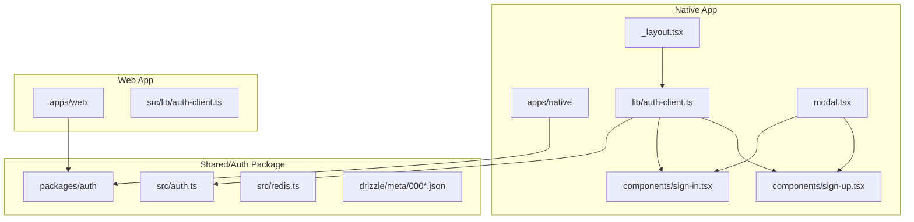
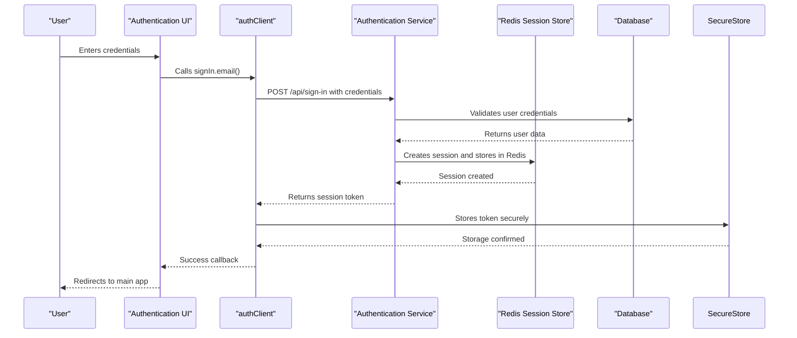
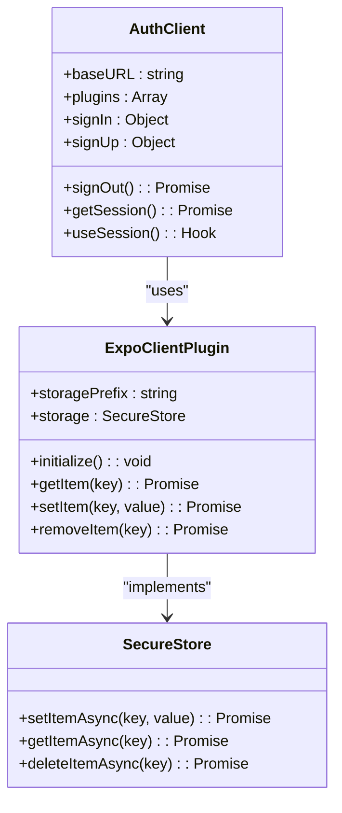
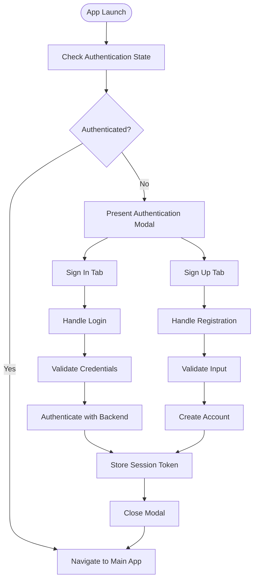

# Authentication Flow

<cite>
**Referenced Files in This Document**   
- [auth-client.ts](file://apps/native/lib/auth-client.ts)
- [sign-in.tsx](file://apps/native/components/sign-in.tsx)
- [sign-up.tsx](file://apps/native/components/sign-up.tsx)
- [auth-client.ts](file://apps/web/src/lib/auth-client.ts)
- [app.json](file://apps/native/app.json)
- [auth.ts](file://packages/auth/src/auth.ts)
- [redis.ts](file://packages/auth/src/redis.ts)
- [0000_snapshot.json](file://packages/auth/drizzle/meta/0000_snapshot.json)
- [0003_snapshot.json](file://packages/auth/drizzle/meta/0003_snapshot.json)
- [_layout.tsx](file://apps/native/app/_layout.tsx)
- [modal.tsx](file://apps/native/app/modal.tsx)
</cite>

## Table of Contents
1. [Introduction](#introduction)
2. [Project Structure](#project-structure)
3. [Core Components](#core-components)
4. [Architecture Overview](#architecture-overview)
5. [Detailed Component Analysis](#detailed-component-analysis)
6. [Authentication State Management](#authentication-state-management)
7. [Security Considerations](#security-considerations)
8. [Troubleshooting Guide](#troubleshooting-guide)
9. [Conclusion](#conclusion)

## Introduction
This document provides a comprehensive analysis of the authentication flow in the Native Application, focusing on session management, token storage, and integration with backend services. The implementation leverages the `better-auth` framework with platform-specific adaptations for secure and seamless user authentication. The system supports email/password sign-in and sign-up flows, with modal-based UI patterns and persistent sessions across app restarts. Special attention is given to security practices including secure token storage using Expo SecureStore and backend session management via Redis.

## Project Structure
The authentication functionality is distributed across multiple directories in the monorepo, with clear separation between native and web implementations. The core authentication logic resides in the `packages/auth` directory, while platform-specific implementations are located in their respective app directories.



**Diagram sources**
- [auth-client.ts](file://apps/native/lib/auth-client.ts)
- [auth.ts](file://packages/auth/src/auth.ts)
- [redis.ts](file://packages/auth/src/redis.ts)
- [0000_snapshot.json](file://packages/auth/drizzle/meta/0000_snapshot.json)

**Section sources**
- [auth-client.ts](file://apps/native/lib/auth-client.ts)
- [sign-in.tsx](file://apps/native/components/sign-in.tsx)
- [sign-up.tsx](file://apps/native/components/sign-up.tsx)

## Core Components
The authentication system consists of several key components that work together to provide a secure and user-friendly experience:

- **auth-client**: The central authentication client that manages sessions and communicates with the backend
- **sign-in.tsx**: Component handling user login with form validation and error handling
- **sign-up.tsx**: Component managing user registration with input validation
- **expoClient plugin**: Platform-specific plugin for Expo that integrates with SecureStore
- **SecureStore**: Secure storage mechanism for tokens on mobile devices

These components follow a modular design pattern, allowing for easy maintenance and extension of authentication functionality.

**Section sources**
- [auth-client.ts](file://apps/native/lib/auth-client.ts)
- [sign-in.tsx](file://apps/native/components/sign-in.tsx)
- [sign-up.tsx](file://apps/native/components/sign-up.tsx)

## Architecture Overview
The authentication architecture follows a client-server pattern with secure token-based authentication. The native application uses the `better-auth/react` library to create an authentication client that communicates with a backend authentication service. Sessions are managed server-side using Redis for high-performance session storage, while tokens are securely stored on the client using Expo SecureStore.



**Diagram sources**
- [auth-client.ts](file://apps/native/lib/auth-client.ts)
- [auth.ts](file://packages/auth/src/auth.ts)
- [redis.ts](file://packages/auth/src/redis.ts)

## Detailed Component Analysis

### Authentication Client Implementation
The authentication client is implemented using the `better-auth/react` library with the Expo client plugin for secure storage. It serves as the central interface for all authentication operations.



**Diagram sources**
- [auth-client.ts](file://apps/native/lib/auth-client.ts)

**Section sources**
- [auth-client.ts](file://apps/native/lib/auth-client.ts)

#### Sign-In Component Analysis
The sign-in component provides a user interface for existing users to authenticate with their credentials. It includes form validation, loading states, and error handling.

```typescript
function SignIn() {
    const [email, setEmail] = useState("");
    const [password, setPassword] = useState("");
    const [isLoading, setIsLoading] = useState(false);
    const [error, setError] = useState<string | null>(null);

    const handleLogin = async () => {
        setIsLoading(true);
        setError(null);

        await authClient.signIn.email(
            {
                email,
                password,
            },
            {
                onError: (error) => {
                    setError(error.error?.message || "Failed to sign in");
                    setIsLoading(false);
                },
                onSuccess: () => {
                    setEmail("");
                    setPassword("");
                    queryClient.refetchQueries();
                },
                onFinished: () => {
                    setIsLoading(false);
                },
            },
        );
    };

    return (
        <View className="mt-6 p-4 bg-card rounded-lg border border-border">
            <Text className="text-lg font-semibold text-foreground mb-4">
                Sign In
            </Text>

            {error && (
                <View className="mb-4 p-3 bg-destructive/10 rounded-md">
                    <Text className="text-destructive text-sm">{error}</Text>
                </View>
            )}

            <TextInput
                className="mb-3 p-4 rounded-md bg-input text-foreground border border-input"
                placeholder="Email"
                value={email}
                onChangeText={setEmail}
                placeholderTextColor="#9CA3AF"
                keyboardType="email-address"
                autoCapitalize="none"
            />

            <TextInput
                className="mb-4 p-4 rounded-md bg-input text-foreground border border-input"
                placeholder="Password"
                value={password}
                onChangeText={setPassword}
                placeholderTextColor="#9CA3AF"
                secureTextEntry
            />

            <TouchableOpacity
                onPress={handleLogin}
                disabled={isLoading}
                className="bg-primary p-4 rounded-md flex-row justify-center items-center"
            >
                {isLoading ? (
                    <ActivityIndicator size="small" color="#fff" />
                ) : (
                    <Text className="text-primary-foreground font-medium">Sign In</Text>
                )}
            </TouchableOpacity>
        </View>
    );
}
```

**Diagram sources**
- [sign-in.tsx](file://apps/native/components/sign-in.tsx)

**Section sources**
- [sign-in.tsx](file://apps/native/components/sign-in.tsx)

#### Sign-Up Component Analysis
The sign-up component enables new users to create an account with name, email, and password fields. It follows the same pattern as the sign-in component with similar error handling and state management.

```typescript
function SignUp() {
    const [name, setName] = useState("");
    const [email, setEmail] = useState("");
    const [password, setPassword] = useState("");
    const [isLoading, setIsLoading] = useState(false);
    const [error, setError] = useState<string | null>(null);

    const handleSignUp = async () => {
        setIsLoading(true);
        setError(null);

        await authClient.signUp.email(
            {
                name,
                email,
                password,
            },
            {
                onError: (error) => {
                    setError(error.error?.message || "Failed to sign up");
                    setIsLoading(false);
                },
                onSuccess: () => {
                    setName("");
                    setEmail("");
                    setPassword("");
                    queryClient.refetchQueries();
                },
                onFinished: () => {
                    setIsLoading(false);
                },
            },
        );
    };

    return (
        <View className="mt-6 p-4 bg-card rounded-lg border border-border">
            <Text className="text-lg font-semibold text-foreground mb-4">
                Create Account
            </Text>

            {error && (
                <View className="mb-4 p-3 bg-destructive/10 rounded-md">
                    <Text className="text-destructive text-sm">{error}</Text>
                </View>
            )}

            <TextInput
                className="mb-3 p-4 rounded-md bg-input text-foreground border border-input"
                placeholder="Name"
                value={name}
                onChangeText={setName}
                placeholderTextColor="#9CA3AF"
            />

            <TextInput
                className="mb-3 p-4 rounded-md bg-input text-foreground border border-input"
                placeholder="Email"
                value={email}
                onChangeText={setEmail}
                placeholderTextColor="#9CA3AF"
                keyboardType="email-address"
                autoCapitalize="none"
            />

            <TextInput
                className="mb-4 p-4 rounded-md bg-input text-foreground border border-input"
                placeholder="Password"
                value={password}
                onChangeText={setPassword}
                placeholderTextColor="#9CA3AF"
                secureTextEntry
            />

            <TouchableOpacity
                onPress={handleSignUp}
                disabled={isLoading}
                className="bg-primary p-4 rounded-md flex-row justify-center items-center"
            >
                {isLoading ? (
                    <ActivityIndicator size="small" color="#fff" />
                ) : (
                    <Text className="text-primary-foreground font-medium">Sign Up</Text>
                )}
            </TouchableOpacity>
        </View>
    );
}
```

**Diagram sources**
- [sign-up.tsx](file://apps/native/components/sign-up.tsx)

**Section sources**
- [sign-up.tsx](file://apps/native/components/sign-up.tsx)

## Authentication State Management
The authentication state is managed through a combination of client-side and server-side mechanisms. The `auth-client` maintains the current session state and provides hooks for components to access authentication status.

### Modal-Based Authentication UI Pattern
The application uses a modal-based approach for authentication, allowing users to access login and registration forms without leaving the main application context. The `_layout.tsx` file configures the stack navigator with a modal presentation option:



**Diagram sources**
- [_layout.tsx](file://apps/native/app/_layout.tsx)
- [modal.tsx](file://apps/native/app/modal.tsx)

**Section sources**
- [_layout.tsx](file://apps/native/app/_layout.tsx)
- [modal.tsx](file://apps/native/app/modal.tsx)

## Security Considerations
The authentication system implements multiple security measures to protect user data and prevent common vulnerabilities.

### Secure Token Storage
Tokens are securely stored using Expo SecureStore, which provides an encrypted storage mechanism for sensitive information on mobile devices:

```typescript
export const authClient = createAuthClient({
  baseURL: process.env.EXPO_PUBLIC_SERVER_URL,
  plugins: [
    expoClient({
      storagePrefix: "my-better-t-app",
      storage: SecureStore,
    }),
  ],
});
```

This configuration ensures that authentication tokens are encrypted and protected from unauthorized access.

### Backend Session Management
The backend authentication service uses Redis to store session data with appropriate expiration policies. The database schema includes security-related fields:

```json
{
  "name": "session",
  "columns": {
    "token": {
      "name": "token",
      "type": "text",
      "primaryKey": false,
      "notNull": true
    },
    "ip_address": {
      "name": "ip_address",
      "type": "text",
      "primaryKey": false,
      "notNull": false
    },
    "user_agent": {
      "name": "user_agent",
      "type": "text",
      "primaryKey": false,
      "notNull": false
    },
    "user_id": {
      "name": "user_id",
      "type": "text",
      "primaryKey": false,
      "notNull": true
    }
  }
}
```

### OAuth and Refresh Token Support
The system supports OAuth flows with secure storage of access and refresh tokens:

```json
{
  "name": "oauth_access_token",
  "columns": {
    "access_token": {
      "name": "access_token",
      "type": "text",
      "primaryKey": false,
      "notNull": false
    },
    "refresh_token": {
      "name": "refresh_token",
      "type": "text",
      "primaryKey": false,
      "notNull": false
    },
    "access_token_expires_at": {
      "name": "access_token_expires_at",
      "type": "timestamp",
      "primaryKey": false,
      "notNull": false
    },
    "refresh_token_expires_at": {
      "name": "refresh_token_expires_at",
      "type": "timestamp",
      "primaryKey": false,
      "notNull": false
    }
  }
}
```

**Section sources**
- [auth-client.ts](file://apps/native/lib/auth-client.ts)
- [0000_snapshot.json](file://packages/auth/drizzle/meta/0000_snapshot.json)
- [0003_snapshot.json](file://packages/auth/drizzle/meta/0003_snapshot.json)

## Troubleshooting Guide
This section addresses common authentication issues and their solutions.

### Expired Sessions
When a session expires, users may encounter authentication errors. The system automatically handles token refresh when possible, but if refresh fails:

1. Clear the stored tokens from SecureStore
2. Prompt the user to sign in again
3. Ensure the backend Redis service is running and accessible

### Failed Provider Callbacks
For OAuth integrations, failed callbacks can occur due to misconfigured redirect URIs:

1. Verify the redirect URI in the OAuth provider matches the app's configuration
2. Check that the `EXPO_PUBLIC_SERVER_URL` environment variable is correctly set
3. Ensure the backend authentication service is properly configured to handle OAuth callbacks

### Biometric Authentication Issues
If biometric authentication fails:

1. Verify the device supports biometric authentication
2. Check that the user has enrolled biometric credentials
3. Ensure the app has the necessary permissions in `app.json`:

```json
{
  "expo": {
    "plugins": [
      "expo-router",
      "expo-secure-store",
      "expo-web-browser"
    ]
  }
}
```

**Section sources**
- [auth-client.ts](file://apps/native/lib/auth-client.ts)
- [app.json](file://apps/native/app.json)

## Conclusion
The authentication flow in the Native Application provides a secure and user-friendly experience through a well-structured implementation. By leveraging the `better-auth` framework with platform-specific adaptations, the system achieves robust session management, secure token storage, and seamless integration with backend services. The modal-based UI pattern allows for flexible authentication workflows while maintaining context within the main application. Security is prioritized through encrypted storage, proper session management, and support for modern authentication standards. This comprehensive approach ensures both security and usability for end users.