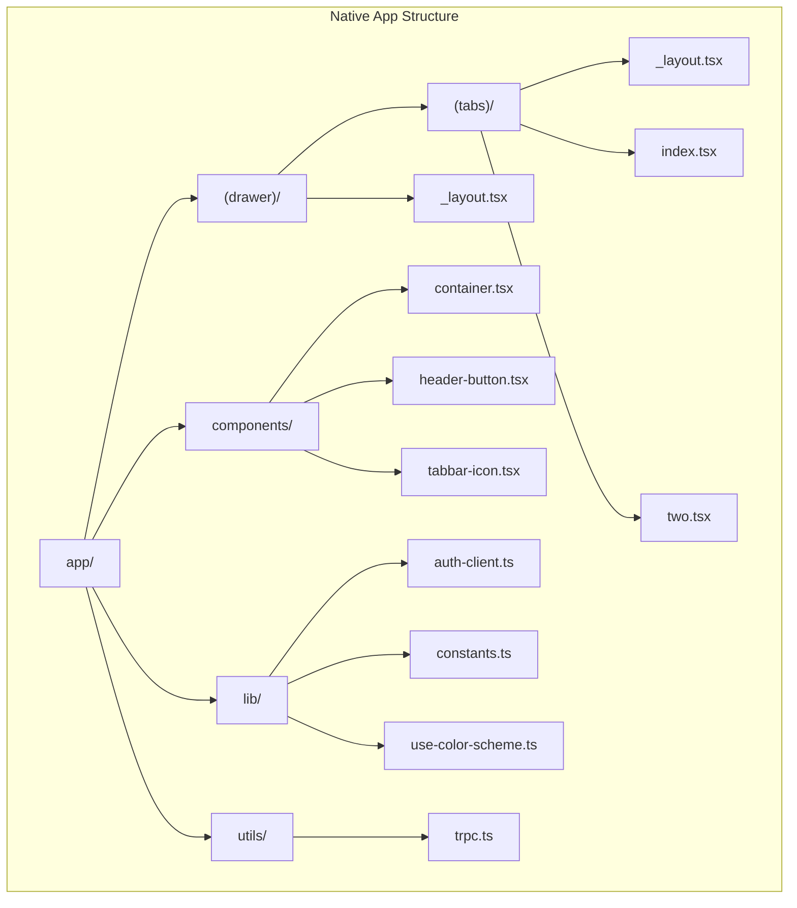
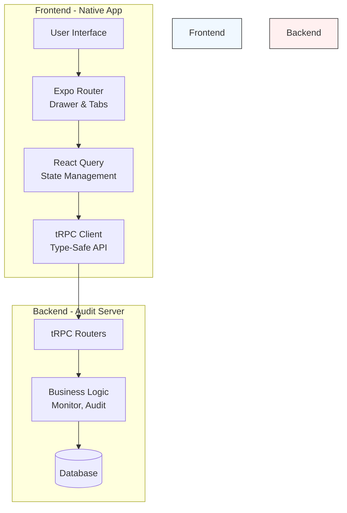
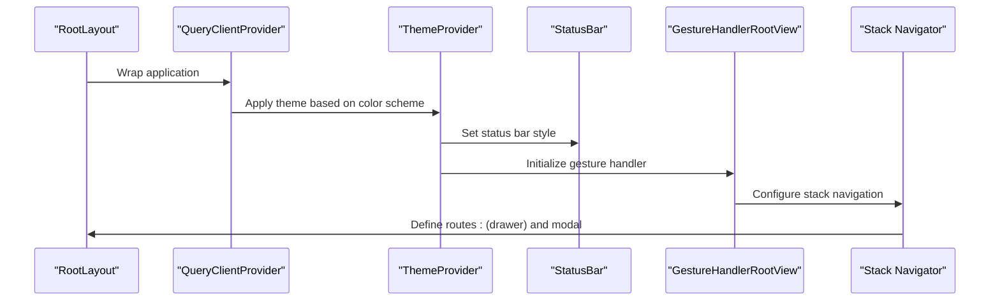
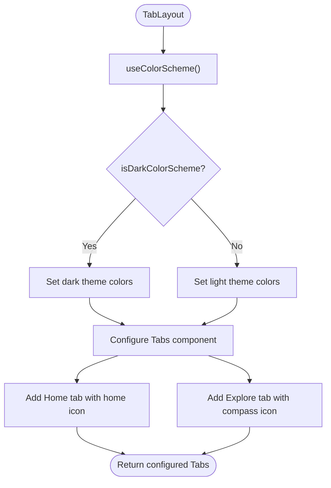
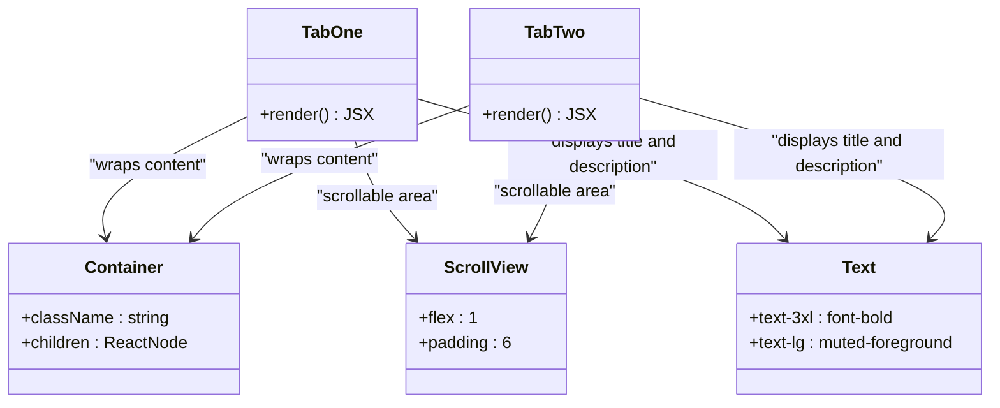
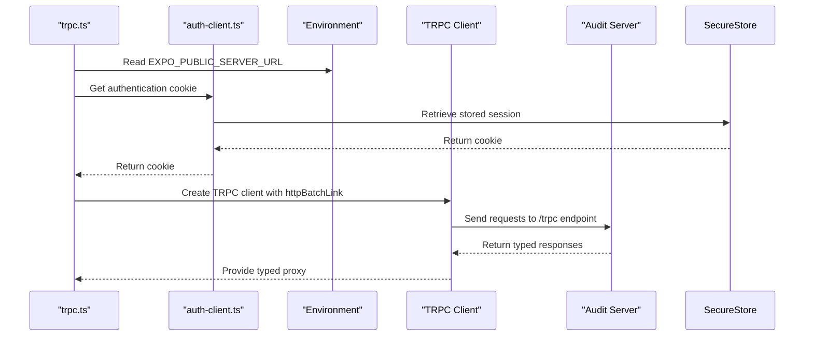
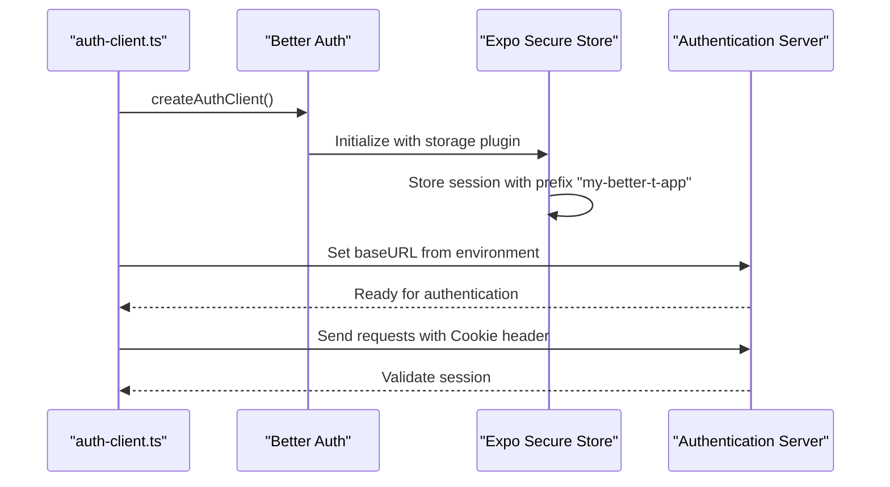

# Native Application

<cite>
**Referenced Files in This Document**   
- [apps/native/app/_layout.tsx](file://apps/native/app/_layout.tsx)
- [apps/native/app/(drawer)/_layout.tsx](file://apps/native/app/(drawer)/_layout.tsx)
- [apps/native/app/(drawer)/(tabs)/_layout.tsx](file://apps/native/app/(drawer)/(tabs)/_layout.tsx)
- [apps/native/utils/trpc.ts](file://apps/native/utils/trpc.ts)
- [apps/native/lib/auth-client.ts](file://apps/native/lib/auth-client.ts)
- [apps/server/src/routers/index.ts](file://apps/server/src/routers/index.ts)
- [apps/server/src/routers/events.ts](file://apps/server/src/routers/events.ts)
- [apps/server/src/routers/alerts.ts](file://apps/server/src/routers/alerts.ts)
- [apps/server/src/routers/health.ts](file://apps/server/src/routers/health.ts)
- [apps/native/app/(drawer)/(tabs)/index.tsx](file://apps/native/app/(drawer)/(tabs)/index.tsx)
- [apps/native/app/(drawer)/(tabs)/two.tsx](file://apps/native/app/(drawer)/(tabs)/two.tsx)
</cite>

## Table of Contents
1. [Introduction](#introduction)
2. [Project Structure](#project-structure)
3. [Core Components](#core-components)
4. [Architecture Overview](#architecture-overview)
5. [Detailed Component Analysis](#detailed-component-analysis)
6. [Data Flow and tRPC Integration](#data-flow-and-trpc-integration)
7. [Authentication and Session Management](#authentication-and-session-management)
8. [Mobile-Specific Considerations](#mobile-specific-considerations)
9. [Infrastructure and Deployment](#infrastructure-and-deployment)
10. [Conclusion](#conclusion)

## Introduction
The Native Application is a React Native mobile application built using Expo Router for navigation and native navigation components. It serves as a client interface for interacting with an audit server, enabling users to view alerts, submit audit events, and monitor system health. The application leverages tRPC for type-safe communication with the backend, ensuring robust data flow and error handling. This document provides comprehensive architectural documentation, detailing component interactions, data flows, technical decisions, and integration patterns.

## Project Structure
The native application follows a modular structure organized around Expo's file-based routing system. Key directories include:
- **app**: Contains all screen components and layout files using Expo Router conventions
- **components**: Reusable UI components such as buttons, containers, and navigation elements
- **lib**: Utility libraries for authentication, theme management, and platform-specific functionality
- **utils**: Shared utilities including the tRPC client configuration
- Configuration files: `app.json`, `tailwind.config.js`, `metro.config.js`, and `tsconfig.json` for project setup

The routing structure uses Expo's convention-based approach with nested layouts for drawer and tab navigation.



**Diagram sources**
- [apps/native/app](file://apps/native/app)
- [apps/native/components](file://apps/native/components)
- [apps/native/lib](file://apps/native/lib)
- [apps/native/utils](file://apps/native/utils)

## Core Components
The application's core components establish the foundation for navigation, theming, and state management. The root layout component wraps the entire application with essential providers including React Query, React Navigation, and gesture handling. Authentication is managed through Better Auth with secure token storage using Expo Secure Store.

Key components include:
- Root layout with theme and query providers
- Drawer navigation for primary navigation
- Tab navigation for secondary navigation
- Custom UI components (Container, HeaderButton, TabBarIcon)
- Authentication client integration
- tRPC client for API communication

**Section sources**
- [apps/native/app/_layout.tsx](file://apps/native/app/_layout.tsx)
- [apps/native/components/container.tsx](file://apps/native/components/container.tsx)
- [apps/native/components/header-button.tsx](file://apps/native/components/header-button.tsx)
- [apps/native/components/tabbar-icon.tsx](file://apps/native/components/tabbar-icon.tsx)

## Architecture Overview
The Native Application follows a layered architecture with clear separation between presentation, business logic, and data access layers. Built on React Native with Expo, it uses Expo Router for navigation and integrates with a backend audit server via tRPC.



**Diagram sources**
- [apps/native/app/_layout.tsx](file://apps/native/app/_layout.tsx)
- [apps/native/utils/trpc.ts](file://apps/native/utils/trpc.ts)
- [apps/server/src/routers/index.ts](file://apps/server/src/routers/index.ts)

## Detailed Component Analysis

### Root Layout Analysis
The root layout component serves as the entry point for the application, configuring global providers and initializing essential services.



**Diagram sources**
- [apps/native/app/_layout.tsx](file://apps/native/app/_layout.tsx#L1-L75)

**Section sources**
- [apps/native/app/_layout.tsx](file://apps/native/app/_layout.tsx#L1-L75)

### Navigation Structure Analysis
The application implements a nested navigation structure with drawer and tab navigation components.

#### Drawer Navigation
```mermaid
classDiagram
class DrawerLayout {
+render() JSX
}
class Drawer {
+Screen components
+headerTitle : string
+drawerLabel : string
+drawerIcon : function
+headerRight : function
}
DrawerLayout --> Drawer : "uses"
Drawer --> HomeScreen : "links to index"
Drawer --> TabsScreen : "links to (tabs)"
TabsScreen --> HeaderButton : "headerRight"
note right of DrawerLayout
Implements drawer navigation with
Home and Tabs screens
end note
```

**Diagram sources**
- [apps/native/app/(drawer)/_layout.tsx](file://apps/native/app/(drawer)/_layout.tsx#L1-L39)

#### Tab Navigation


**Diagram sources**
- [apps/native/app/(drawer)/(tabs)/_layout.tsx](file://apps/native/app/(drawer)/(tabs)/_layout.tsx#L1-L46)

**Section sources**
- [apps/native/app/(drawer)/_layout.tsx](file://apps/native/app/(drawer)/_layout.tsx#L1-L39)
- [apps/native/app/(drawer)/(tabs)/_layout.tsx](file://apps/native/app/(drawer)/(tabs)/_layout.tsx#L1-L46)

### Screen Components
The application includes two primary tab screens that serve as content areas.



**Diagram sources**
- [apps/native/app/(drawer)/(tabs)/index.tsx](file://apps/native/app/(drawer)/(tabs)/index.tsx#L1-L19)
- [apps/native/app/(drawer)/(tabs)/two.tsx](file://apps/native/app/(drawer)/(tabs)/two.tsx#L1-L19)

**Section sources**
- [apps/native/app/(drawer)/(tabs)/index.tsx](file://apps/native/app/(drawer)/(tabs)/index.tsx#L1-L19)
- [apps/native/app/(drawer)/(tabs)/two.tsx](file://apps/native/app/(drawer)/(tabs)/two.tsx#L1-L19)

## Data Flow and tRPC Integration
The application uses tRPC for type-safe communication with the backend audit server, enabling seamless data exchange with strong typing guarantees.

### tRPC Client Configuration


**Diagram sources**
- [apps/native/utils/trpc.ts](file://apps/native/utils/trpc.ts#L1-L28)
- [apps/native/lib/auth-client.ts](file://apps/native/lib/auth-client.ts#L1-L13)

### Available tRPC Endpoints
The backend exposes several routers that the native application can interact with:

```mermaid
erDiagram
HEALTH {
string check
}
ALERTS {
query active
query resolved
query statistics
mutation resolve
mutation cleanup
}
EVENTS {
mutation create
mutation bulkCreate
query query
query get
query export
mutation verify
mutation delete
}
HEALTH ||--o{ NATIVE_APP : "health checks"
ALERTS ||--o{ NATIVE_APP : "alert management"
EVENTS ||--o{ NATIVE_APP : "event operations"
class NATIVE_APP {
+tRPC client
+QueryClient
+React components
}
```

**Diagram sources**
- [apps/server/src/routers/index.ts](file://apps/server/src/routers/index.ts#L1-L23)
- [apps/server/src/routers/alerts.ts](file://apps/server/src/routers/alerts.ts#L1-L230)
- [apps/server/src/routers/events.ts](file://apps/server/src/routers/events.ts#L1-L199)
- [apps/server/src/routers/health.ts](file://apps/server/src/routers/health.ts#L1-L64)

**Section sources**
- [apps/native/utils/trpc.ts](file://apps/native/utils/trpc.ts#L1-L28)
- [apps/server/src/routers/index.ts](file://apps/server/src/routers/index.ts#L1-L23)

## Authentication and Session Management
The application implements secure authentication using Better Auth with Expo integration, ensuring user sessions are properly managed and protected.



**Diagram sources**
- [apps/native/lib/auth-client.ts](file://apps/native/lib/auth-client.ts#L1-L13)

**Section sources**
- [apps/native/lib/auth-client.ts](file://apps/native/lib/auth-client.ts#L1-L13)

## Mobile-Specific Considerations
The application addresses several mobile-specific requirements to ensure optimal user experience across devices.

### Platform Adaptation
The application handles platform differences through conditional logic and native modules:
- Android navigation bar color is set based on color scheme
- Web platform adds CSS classes for background styling
- Gesture handling is wrapped with GestureHandlerRootView for consistent touch interactions
- Status bar style adapts to the current color theme

### Offline Support
While not explicitly implemented in the current code, the architecture supports offline capabilities through:
- React Query's built-in caching and background synchronization
- Persistent storage via Expo Secure Store for authentication tokens
- Potential for local data storage using AsyncStorage or SQLite

### Push Notifications
The current implementation does not show push notification integration, but the architecture could support it through:
- Expo Notifications API
- Integration with the alert system on the server
- Background fetch capabilities for checking new alerts

## Infrastructure and Deployment
The native application is designed to work within a larger ecosystem that includes backend services and infrastructure components.

### Technology Stack
**Frontend:**
- React Native 0.79.1
- Expo SDK 53
- Expo Router 5.0.3
- React 19.0.0
- TypeScript 5.8.2
- Tailwind CSS with NativeWind
- React Query for state management
- tRPC for type-safe API communication

**Dependencies:**
- @react-navigation for navigation
- react-native-reanimated for animations
- react-native-gesture-handler for touch interactions
- expo-secure-store for secure data storage

### Deployment Topology
The application connects to a backend server exposed through an environment variable (EXPO_PUBLIC_SERVER_URL). The server is containerized and deployed using Docker and Kubernetes, as evidenced by the presence of Dockerfiles and Kubernetes manifests in the server application.

### Platform Compatibility
The application is compatible with both iOS and Android platforms, leveraging React Native's cross-platform capabilities. The use of Expo simplifies the build and deployment process for both platforms.

## Conclusion
The Native Application is a well-structured React Native application that effectively leverages Expo Router for navigation and tRPC for type-safe communication with a backend audit server. The architecture demonstrates clear separation of concerns, with modular components and well-defined data flows. Key strengths include the use of modern React patterns, type safety throughout the stack, and integration with secure authentication. The application provides a solid foundation for viewing alerts and submitting audit events, with potential for further enhancement in areas like offline support and push notifications.