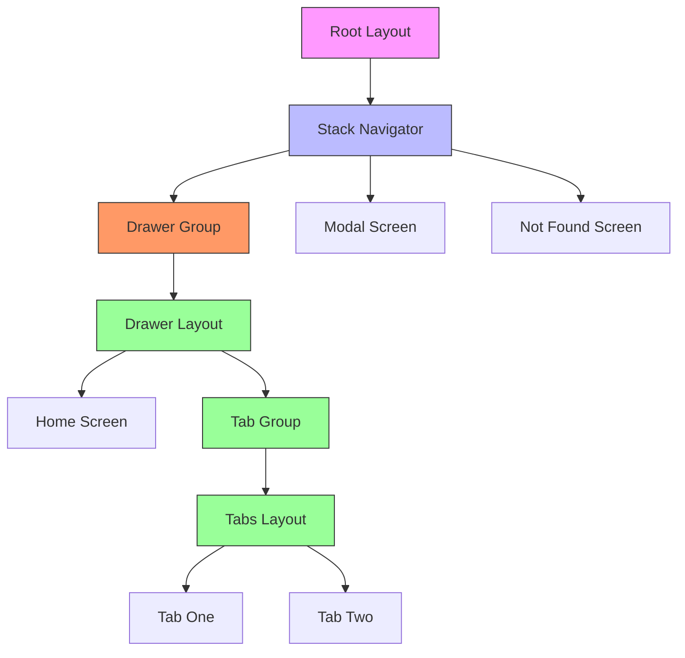
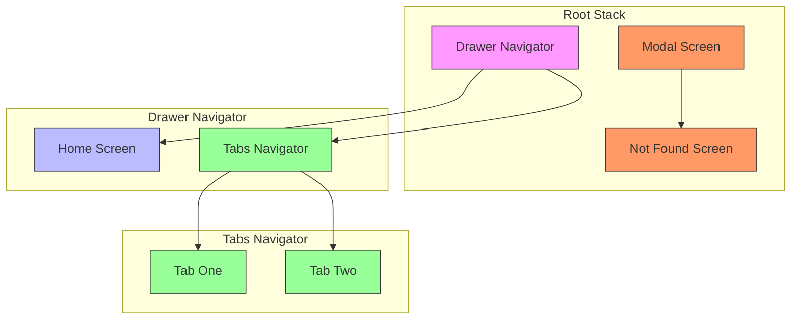
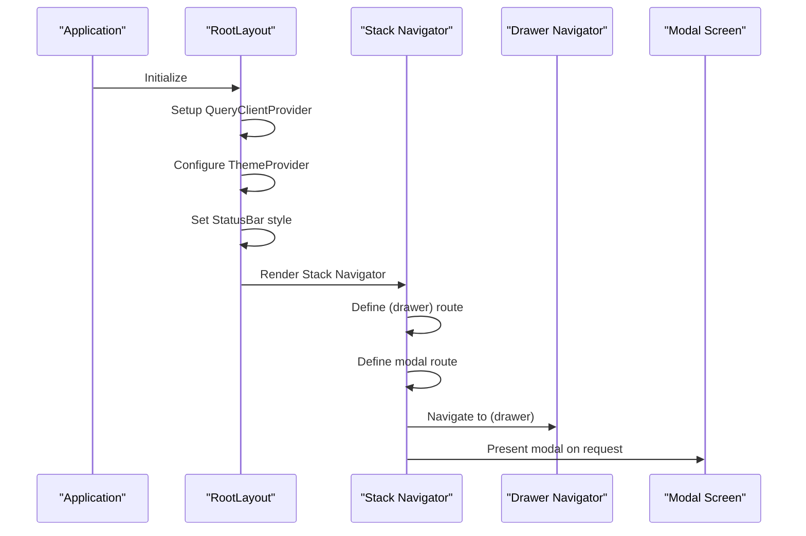
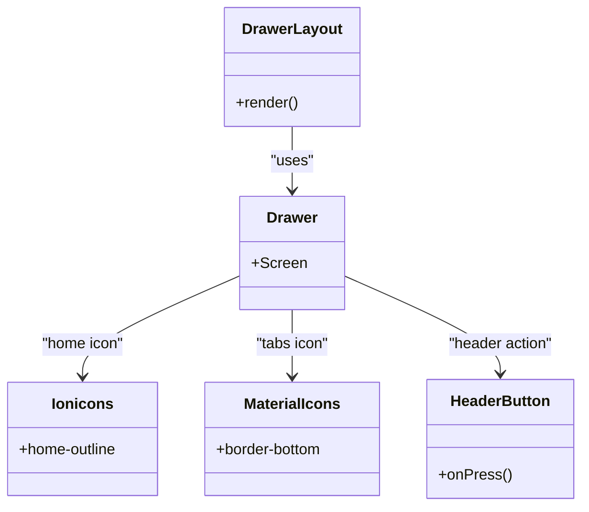
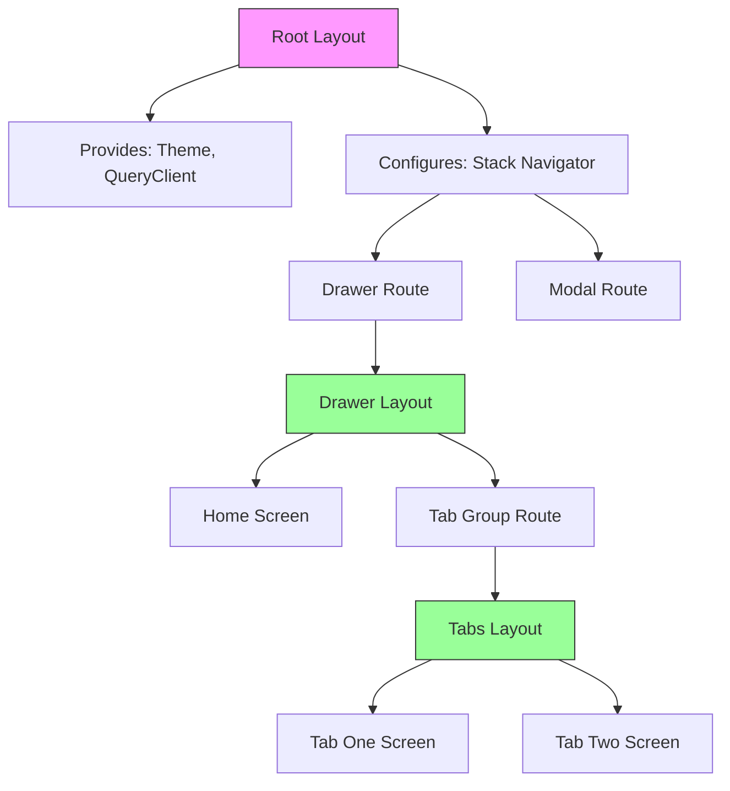
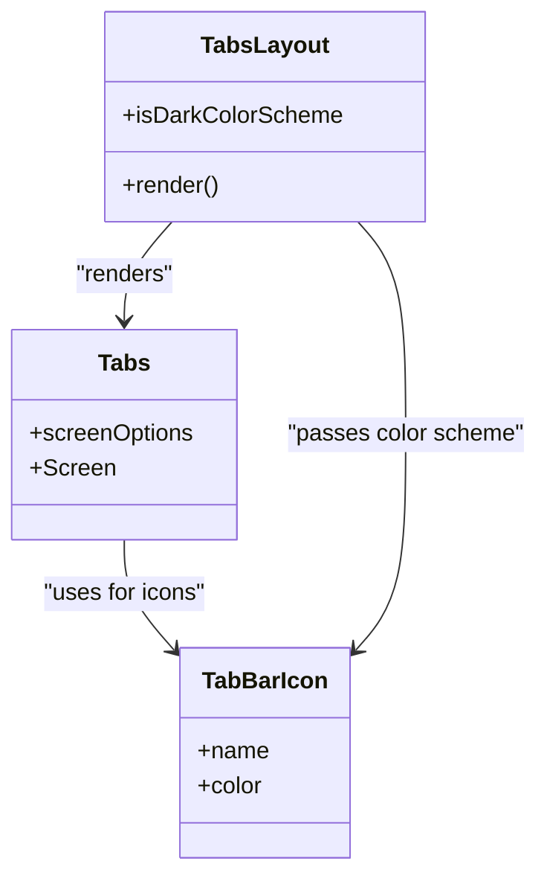

# Navigation Architecture

<cite>
**Referenced Files in This Document**   
- [Root Layout](file://apps/native/app/_layout.tsx)
- [Drawer Layout](file://apps/native/app/(drawer)/_layout.tsx)
- [Tabs Layout](file://apps/native/app/(drawer)/(tabs)/_layout.tsx)
- [Tab One Screen](file://apps/native/app/(drawer)/(tabs)/index.tsx)
- [Tab Two Screen](file://apps/native/app/(drawer)/(tabs)/two.tsx)
- [Modal Screen](file://apps/native/app/modal.tsx)
- [Not Found Screen](file://apps/native/app/+not-found.tsx)
- [Constants](file://apps/native/lib/constants.ts)
- [Tab Bar Icon Component](file://apps/native/components/tabbar-icon.tsx)
- [Header Button Component](file://apps/native/components/header-button.tsx)
- [Android Navigation Bar](file://apps/native/lib/android-navigation-bar.tsx)
- [App Configuration](file://apps/native/app.json)
</cite>

## Table of Contents
1. [Introduction](#introduction)
2. [Project Structure](#project-structure)
3. [Core Components](#core-components)
4. [Architecture Overview](#architecture-overview)
5. [Detailed Component Analysis](#detailed-component-analysis)
6. [Nested Layouts and Route Groups](#nested-layouts-and-route-groups)
7. [Tab-Based Navigation](#tab-based-navigation)
8. [Drawer Navigation](#drawer-navigation)
9. [Modal Presentation](#modal-presentation)
10. [Deep Linking and Dynamic Routes](#deep-linking-and-dynamic-routes)
11. [Performance Optimization](#performance-optimization)
12. [Best Practices](#best-practices)

## Introduction
The navigation architecture of the Native Application is built on Expo Router, a file-based routing system that provides a structured approach to navigation in React Native applications. This document details the implementation of Expo Router with file-based routing, nested layouts, and tab-based navigation using route groups such as (tabs) and (drawer). The architecture leverages React Navigation under the hood to manage screen transitions, deep linking, and dynamic route handling. The layout hierarchy is designed to efficiently manage shared UI elements like headers, tab bars, and drawer menus while maintaining optimal performance through code splitting and proper state management.

## Project Structure
The navigation structure follows Expo Router's file-based routing convention, where the file system directly maps to the application's navigation hierarchy. Special route groups in parentheses, such as (tabs) and (drawer), are used to organize related screens without creating visible route segments.

**Diagram sources**
- [Root Layout](file://apps/native/app/_layout.tsx)
- [Drawer Layout](file://apps/native/app/(drawer)/_layout.tsx)
- [Tabs Layout](file://apps/native/app/(drawer)/(tabs)/_layout.tsx)

**Section sources**
- [Root Layout](file://apps/native/app/_layout.tsx)
- [Drawer Layout](file://apps/native/app/(drawer)/_layout.tsx)
- [Tabs Layout](file://apps/native/app/(drawer)/(tabs)/_layout.tsx)

## Core Components
The navigation system is composed of several core components that work together to create a seamless user experience. The Root Layout serves as the entry point, wrapping the entire application with necessary providers and configuring the initial navigation stack. The Drawer and Tabs components from Expo Router enable hierarchical navigation patterns, while custom components like TabBarIcon and HeaderButton provide consistent UI elements across the application.

**Section sources**
- [Root Layout](file://apps/native/app/_layout.tsx)
- [Tab Bar Icon Component](file://apps/native/components/tabbar-icon.tsx)
- [Header Button Component](file://apps/native/components/header-button.tsx)

## Architecture Overview
The navigation architecture implements a multi-layered approach with Stack, Drawer, and Tabs navigators working in concert. The root Stack navigator manages the primary navigation flow, including modal presentations. Within this stack, the Drawer navigator provides a side menu for top-level navigation, which includes both a direct screen and a Tabs group. The Tabs navigator creates a bottom tab interface for switching between related content sections.

**Diagram sources**
- [Root Layout](file://apps/native/app/_layout.tsx)
- [Drawer Layout](file://apps/native/app/(drawer)/_layout.tsx)
- [Tabs Layout](file://apps/native/app/(drawer)/(tabs)/_layout.tsx)

## Detailed Component Analysis

### Root Layout Analysis
The Root Layout component configures the top-level navigation structure and application providers. It uses Expo Router's Stack component to define the main navigation stack, with the initial route pointing to the (drawer) group. The layout also sets up theme providers, status bar configuration, and React Query for data management.

**Diagram sources**
- [Root Layout](file://apps/native/app/_layout.tsx)

**Section sources**
- [Root Layout](file://apps/native/app/_layout.tsx)

### Drawer Layout Analysis
The Drawer Layout component implements a side navigation menu using Expo Router's Drawer component. It defines two primary navigation options: a direct Home screen and a Tabs group. The drawer includes custom icons from Expo Vector Icons and configures a header action that navigates to a modal screen.

**Diagram sources**
- [Drawer Layout](file://apps/native/app/(drawer)/_layout.tsx)
- [Header Button Component](file://apps/native/components/header-button.tsx)

**Section sources**
- [Drawer Layout](file://apps/native/app/(drawer)/_layout.tsx)

## Nested Layouts and Route Groups
The application utilizes Expo Router's route groups feature to organize navigation without creating visible URL segments. The (drawer) and (tabs) folders are special route groups that group related screens while maintaining a clean navigation hierarchy. This approach allows for nested layouts where parent layouts can provide shared UI elements and context to child screens.

The layout nesting follows a hierarchical pattern:
1. Root Layout (_layout.tsx) - Provides app-wide providers and theme
2. Drawer Layout ((drawer)/_layout.tsx) - Manages drawer navigation state
3. Tabs Layout ((drawer)/(tabs)/_layout.tsx) - Controls tab bar appearance and behavior

Each layout level can define its own navigation options and screen configurations, creating a cascading system of layout wrappers that manage shared UI elements.

**Diagram sources**
- [Root Layout](file://apps/native/app/_layout.tsx)
- [Drawer Layout](file://apps/native/app/(drawer)/_layout.tsx)
- [Tabs Layout](file://apps/native/app/(drawer)/(tabs)/_layout.tsx)

**Section sources**
- [Root Layout](file://apps/native/app/_layout.tsx)
- [Drawer Layout](file://apps/native/app/(drawer)/_layout.tsx)
- [Tabs Layout](file://apps/native/app/(drawer)/(tabs)/_layout.tsx)

## Tab-Based Navigation
The tab-based navigation is implemented using Expo Router's Tabs component within the (tabs) route group. The Tabs Layout component configures the appearance and behavior of the tab bar, including active/inactive text colors, background colors, and border styling that adapts to the user's color scheme preference.

The tab navigation includes two screens:
- Home (index) - Displays primary content with a home icon
- Explore (two) - Provides secondary content with a compass icon

The tab bar styling is dynamically adjusted based on the current color scheme, using HSL color values defined in the application's constants. This ensures visual consistency across light and dark modes.

**Diagram sources**
- [Tabs Layout](file://apps/native/app/(drawer)/(tabs)/_layout.tsx)
- [Tab Bar Icon Component](file://apps/native/components/tabbar-icon.tsx)

**Section sources**
- [Tabs Layout](file://apps/native/app/(drawer)/(tabs)/_layout.tsx)

## Drawer Navigation
The drawer navigation provides a side menu for accessing top-level application sections. Implemented using Expo Router's Drawer component, it includes two navigation items: a direct Home screen and the Tabs group. Each drawer item is configured with a title, label, and icon from Expo Vector Icons.

The drawer configuration also demonstrates how to add custom header actions. The Tabs screen includes a headerRight configuration that renders a HeaderButton component, which navigates to the modal screen when pressed. This pattern allows for screen-specific header controls while maintaining a consistent navigation structure.

**Section sources**
- [Drawer Layout](file://apps/native/app/(drawer)/_layout.tsx)

## Modal Presentation
The modal screen is configured as a separate route in the root stack navigator with a presentation style of "modal". This creates a native-like modal presentation that slides up from the bottom of the screen on mobile platforms. The modal route is defined in the Root Layout with specific options that control its appearance and behavior.

The modal can be accessed from any screen through navigation, with the HeaderButton in the drawer navigator providing one access point. This implementation demonstrates how Expo Router handles different screen presentations within the same navigation hierarchy.

**Section sources**
- [Root Layout](file://apps/native/app/_layout.tsx)
- [Modal Screen](file://apps/native/app/modal.tsx)

## Deep Linking and Dynamic Routes
While the current implementation does not explicitly show deep linking configuration, Expo Router automatically supports deep linking through the app.json configuration. The scheme property in app.json ("my-better-t-app") defines the custom URL scheme that can be used to open the application with specific routes.

The file-based routing system inherently supports dynamic routes through filename conventions, though no dynamic route files are present in the current structure. The +not-found.tsx file provides a custom 404 page that is displayed when navigation occurs to a non-existent route, enhancing the user experience for invalid URLs.

**Section sources**
- [App Configuration](file://apps/native/app.json)
- [Not Found Screen](file://apps/native/app/+not-found.tsx)

## Performance Optimization
The navigation architecture incorporates several performance optimization techniques:

1. **Code Splitting**: Expo Router automatically code-splits routes, loading only the necessary components for the current screen.
2. **Layout Memoization**: Layout components are designed to minimize re-renders through proper state management.
3. **Theme Optimization**: The use of useRef to track mounting state prevents unnecessary re-renders during initialization.
4. **Efficient State Management**: The color scheme state is managed centrally and passed down through context, avoiding prop drilling.

The integration with React Query provides efficient data fetching and caching, while the use of React Navigation's native stack ensures smooth animations and transitions.

**Section sources**
- [Root Layout](file://apps/native/app/_layout.tsx)
- [use-color-scheme.ts](file://apps/native/lib/use-color-scheme.ts)

## Best Practices
The navigation implementation follows several best practices for React Native applications:

1. **Consistent Layout Hierarchy**: Using nested layouts to share common UI elements and state
2. **Semantic Route Grouping**: Organizing related screens with route groups like (tabs) and (drawer)
3. **Theme Consistency**: Centralizing theme configuration and adapting to system preferences
4. **Accessibility**: Proper screen titles and semantic navigation structure
5. **Error Handling**: Custom 404 page for invalid routes
6. **Platform Adaptation**: Conditional logic for web and native platforms

The architecture demonstrates a scalable approach to navigation that can easily accommodate additional screens, tabs, or navigation patterns as the application grows.