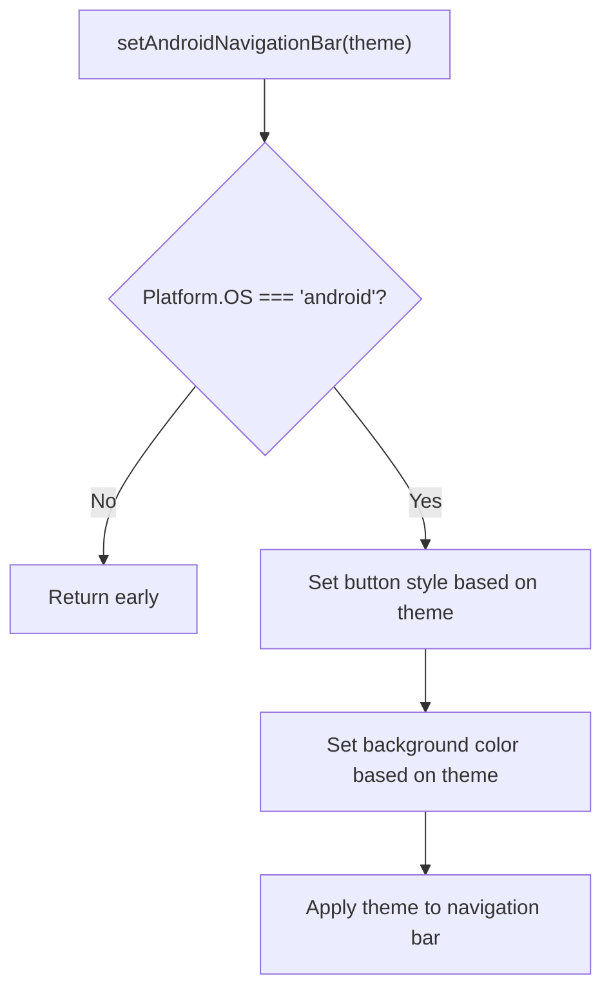
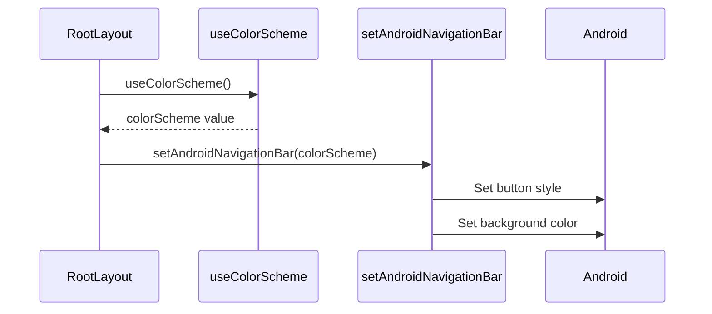
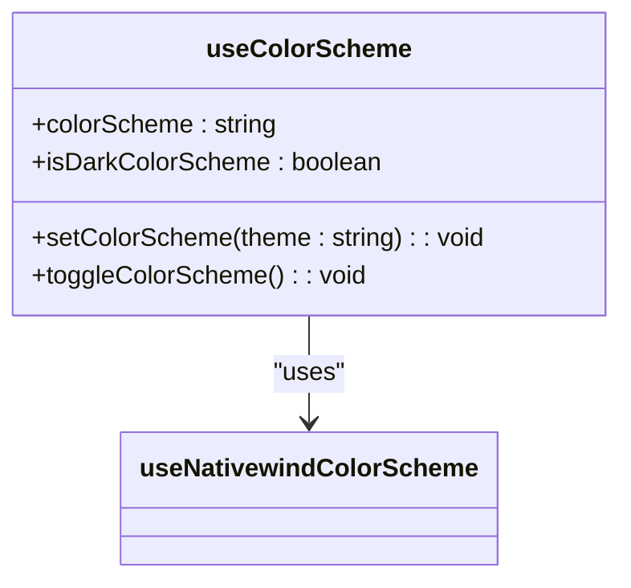
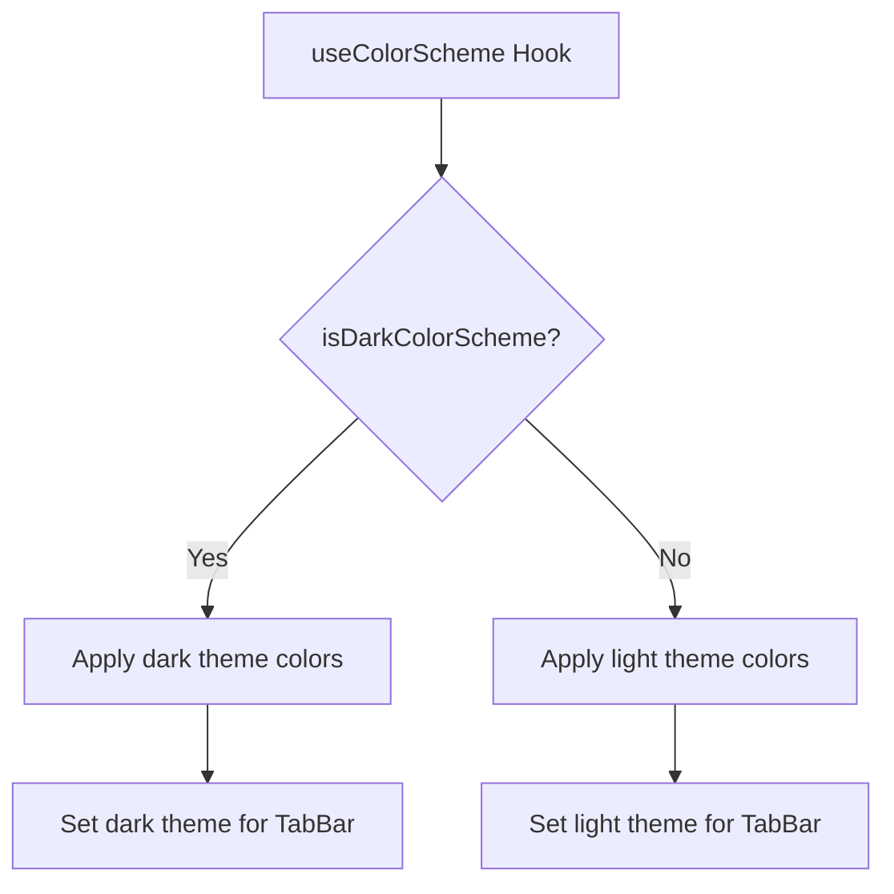
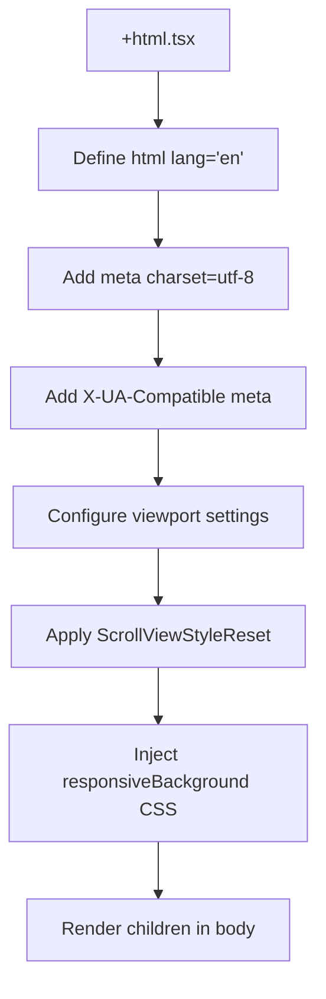
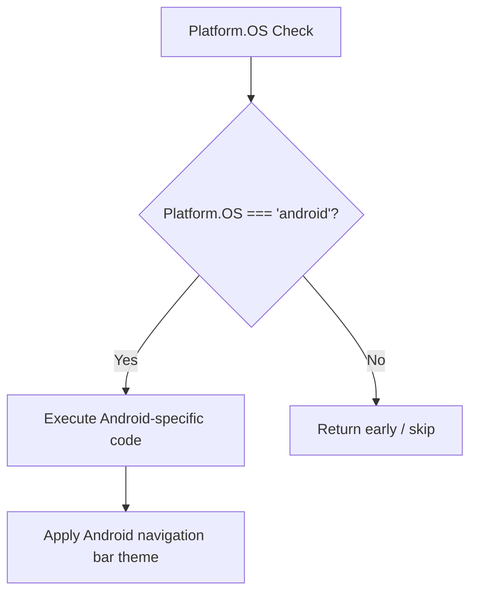

# Platform-Specific Features

<cite>
**Referenced Files in This Document**   
- [android-navigation-bar.tsx](file://apps/native/lib/android-navigation-bar.tsx)
- [use-color-scheme.ts](file://apps/native/lib/use-color-scheme.ts)
- [+html.tsx](file://apps/native/app/+html.tsx)
- [+not-found.tsx](file://apps/native/app/+not-found.tsx)
- [_layout.tsx](file://apps/native/app/_layout.tsx)
- [constants.ts](file://apps/native/lib/constants.ts)
</cite>

## Table of Contents
1. [Introduction](#introduction)
2. [Android Navigation Bar Customization](#android-navigation-bar-customization)
3. [Dynamic Color Scheme Detection](#dynamic-color-scheme-detection)
4. [Web Compatibility with +html.tsx](#web-compatibility-with-htmltsx)
5. [Custom Error Routing with +not-found.tsx](#custom-error-routing-with-not-foundtsx)
6. [Platform Detection and Conditional Rendering](#platform-detection-and-conditional-rendering)
7. [Cross-Platform Consistency and Best Practices](#cross-platform-consistency-and-best-practices)

## Introduction
This document provides a comprehensive overview of platform-specific features implemented in the Native Application. It details how Android navigation bar customization, dynamic dark/light mode detection, web compatibility, and custom error routing are achieved. The analysis covers implementation patterns, integration points, and best practices for maintaining cross-platform consistency while leveraging native capabilities.

**Section sources**
- [android-navigation-bar.tsx](file://apps/native/lib/android-navigation-bar.tsx#L1-L12)
- [use-color-scheme.ts](file://apps/native/lib/use-color-scheme.ts#L1-L13)
- [+html.tsx](file://apps/native/app/+html.tsx#L1-L48)
- [+not-found.tsx](file://apps/native/app/+not-found.tsx#L1-L30)

## Android Navigation Bar Customization

The application implements Android navigation bar customization through the `setAndroidNavigationBar` function in `android-navigation-bar.tsx`. This function allows for dynamic theming of the navigation bar based on the current color scheme (light or dark), ensuring visual consistency across the app interface.

The implementation uses the `expo-navigation-bar` library to control both the button style and background color of the navigation bar. When the theme is set to "dark", the button style is set to "light" for better visibility against the dark background, and vice versa. The background color is determined by the `NAV_THEME` constants defined in the application's theme configuration.



**Diagram sources**
- [android-navigation-bar.tsx](file://apps/native/lib/android-navigation-bar.tsx#L4-L12)

**Section sources**
- [android-navigation-bar.tsx](file://apps/native/lib/android-navigation-bar.tsx#L1-L12)
- [constants.ts](file://apps/native/lib/constants.ts#L1-L19)

### Integration with Root Layout
The `setAndroidNavigationBar` function is integrated into the root layout component (`_layout.tsx`) where it is called during the initial rendering phase. This ensures that the navigation bar theme is synchronized with the application's color scheme from the moment the app loads.



**Diagram sources**
- [_layout.tsx](file://apps/native/app/_layout.tsx#L34-L45)
- [android-navigation-bar.tsx](file://apps/native/lib/android-navigation-bar.tsx#L4-L12)

## Dynamic Color Scheme Detection

The `use-color-scheme.ts` hook provides a wrapper around `nativewind`'s color scheme detection system, enabling dynamic detection and synchronization of the application's theme with the system's dark/light mode settings. This hook returns an object containing the current color scheme, a boolean indicating if the dark theme is active, and functions to programmatically change or toggle the theme.

The implementation ensures that if no color scheme is detected (possibly due to initialization timing), it defaults to "dark" mode, providing a consistent user experience even during the initial load phase.



**Diagram sources**
- [use-color-scheme.ts](file://apps/native/lib/use-color-scheme.ts#L2-L11)

**Section sources**
- [use-color-scheme.ts](file://apps/native/lib/use-color-scheme.ts#L1-L13)
- [_layout.tsx](file://apps/native/app/_layout.tsx#L34-L35)

### Usage in Nested Components
The `useColor-scheme` hook is utilized in multiple layout components throughout the application, including nested tab layouts. This allows child components to access the current theme state and adjust their appearance accordingly, such as changing tab bar colors based on the current theme.

For example, in the tab layout component, the hook is used to determine the active and inactive tint colors of the tab bar, as well as its background and border colors, creating a cohesive visual experience that adapts to the user's preferred theme.



**Diagram sources**
- [use-color-scheme.ts](file://apps/native/lib/use-color-scheme.ts#L2-L11)
- [(drawer)/(tabs)/_layout.tsx](file://apps/native/app/(drawer)/(tabs)/_layout.tsx#L5-L25)

## Web Compatibility with +html.tsx

The `+html.tsx` file plays a crucial role in ensuring web compatibility for the native application. As a web-only file, it configures the root HTML structure for every web page during static rendering, operating exclusively in Node.js environments without access to the DOM or browser APIs.

This component defines essential HTML elements including meta tags for character encoding, viewport configuration, and language specification. Notably, it includes a viewport meta tag that disables scaling, making the mobile website behave more like a native application, though this does reduce built-in accessibility features.



**Diagram sources**
- [+html.tsx](file://apps/native/app/+html.tsx#L1-L48)

A key feature of this implementation is the inclusion of raw CSS styles through the `responsiveBackground` constant, which ensures the background color never flickers when switching between dark and light modes. This CSS uses media queries to detect the user's preferred color scheme and applies the appropriate background color (`#fff` for light mode, `#000` for dark mode).

**Section sources**
- [+html.tsx](file://apps/native/app/+html.tsx#L1-L48)

## Custom Error Routing with +not-found.tsx

The `+not-found.tsx` file implements custom error routing and 404 handling for the application. This component is displayed when users navigate to a route that doesn't exist, providing a user-friendly error message and navigation options.

The implementation uses Expo Router's `Stack.Screen` component to set the title of the error page to "Oops!" and wraps the content in a `Container` component for consistent styling. The error screen features a prominent emoji (🤔), a clear "Page Not Found" heading, and a descriptive message explaining that the requested page doesn't exist.

```mermaid
flowchart TD
A[NotFoundScreen] --> B[Set Stack Screen title]
B --> C[Render Container]
C --> D[Display emoji]
D --> E[Show "Page Not Found" heading]
E --> F[Display descriptive message]
F --> G[Render "Go to Home" link]
G --> H[Link to root route]
```

**Diagram sources**
- [+not-found.tsx](file://apps/native/app/+not-found.tsx#L1-L30)

The component includes a styled link that navigates users back to the home page, implemented using Expo Router's `Link` component with the `href="/"` property. The link is styled with a primary color background and padding to make it easily tappable on mobile devices.

**Section sources**
- [+not-found.tsx](file://apps/native/app/+not-found.tsx#L1-L30)

## Platform Detection and Conditional Rendering

The application employs several patterns for platform detection and conditional rendering to deliver optimized experiences across different platforms. The most prominent pattern uses React Native's `Platform` module to detect the current operating system and conditionally execute platform-specific code.

For Android-specific functionality, the code checks `Platform.OS !== "android"` and returns early if the platform is not Android, preventing unnecessary execution of Android-specific APIs on iOS or web platforms. This pattern is used in the `setAndroidNavigationBar` function to ensure it only attempts to modify the navigation bar on Android devices.



**Diagram sources**
- [android-navigation-bar.tsx](file://apps/native/lib/android-navigation-bar.tsx#L5-L6)

Additionally, the application uses a custom `useIsomorphicLayoutEffect` hook that adapts behavior based on whether the code is running on the web platform. This hook uses `React.useEffect` for web environments when running on the server (where `window` is undefined) and `React.useLayoutEffect` otherwise, ensuring proper execution timing across different environments.

The application also includes web-specific optimizations such as adding CSS classes to the document element (`document.documentElement.classList.add("bg-background")`) when running on the web platform, demonstrating how platform detection enables targeted styling and performance optimizations.

**Section sources**
- [android-navigation-bar.tsx](file://apps/native/lib/android-navigation-bar.tsx#L5-L6)
- [_layout.tsx](file://apps/native/app/_layout.tsx#L42-L44)
- [_layout.tsx](file://apps/native/app/_layout.tsx#L74-L76)

## Cross-Platform Consistency and Best Practices

The application demonstrates several best practices for maintaining cross-platform consistency while leveraging native capabilities. The architecture separates platform-specific concerns into dedicated modules (like `android-navigation-bar.tsx`) while providing a unified interface through hooks (like `use-color-scheme.ts`).

Key best practices evident in the implementation include:

1. **Separation of Concerns**: Platform-specific code is isolated in dedicated files, making it easier to maintain and modify without affecting other parts of the application.

2. **Graceful Degradation**: Functions include early returns for unsupported platforms, preventing errors when native APIs are not available.

3. **Theme Consistency**: The application uses a centralized theme configuration (`NAV_THEME`) that is shared across components, ensuring visual consistency regardless of the platform.

4. **Web Optimization**: Web-specific files like `+html.tsx` provide targeted optimizations for the web environment without affecting native app performance.

5. **User Experience Focus**: Error states are handled with user-friendly interfaces that guide users back to valid routes.

When extending platform-specific functionality, developers should follow these patterns by creating dedicated modules for platform-specific code, using feature detection rather than platform detection when possible, and ensuring fallback behaviors for unsupported platforms. Testing should include various device configurations, particularly different theme settings and screen sizes, to ensure consistent behavior across all supported platforms.

**Section sources**
- [android-navigation-bar.tsx](file://apps/native/lib/android-navigation-bar.tsx#L1-L12)
- [use-color-scheme.ts](file://apps/native/lib/use-color-scheme.ts#L1-L13)
- [+html.tsx](file://apps/native/app/+html.tsx#L1-L48)
- [_layout.tsx](file://apps/native/app/_layout.tsx#L1-L76)
- [constants.ts](file://apps/native/lib/constants.ts#L1-L19)