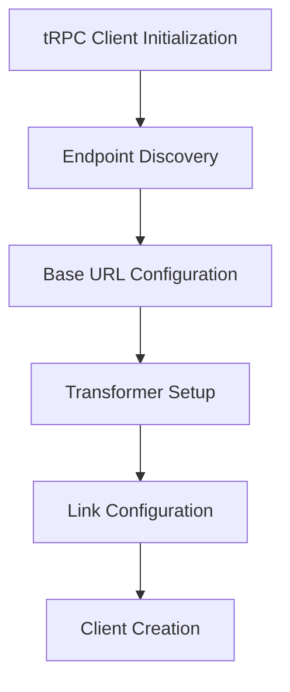
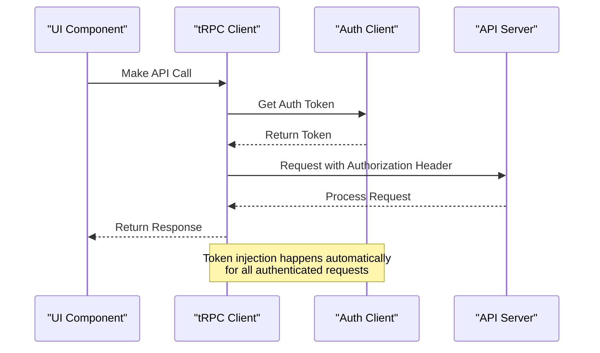
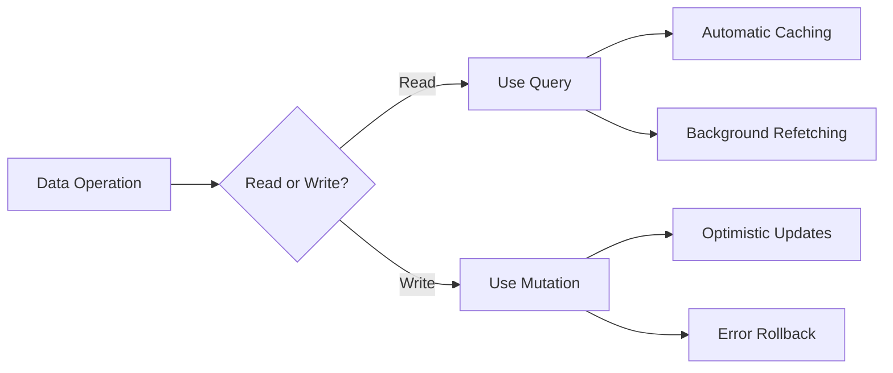
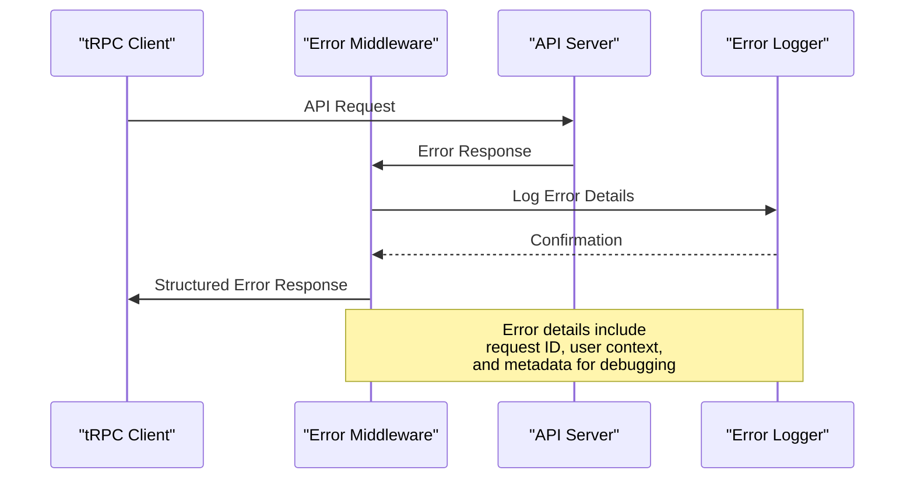
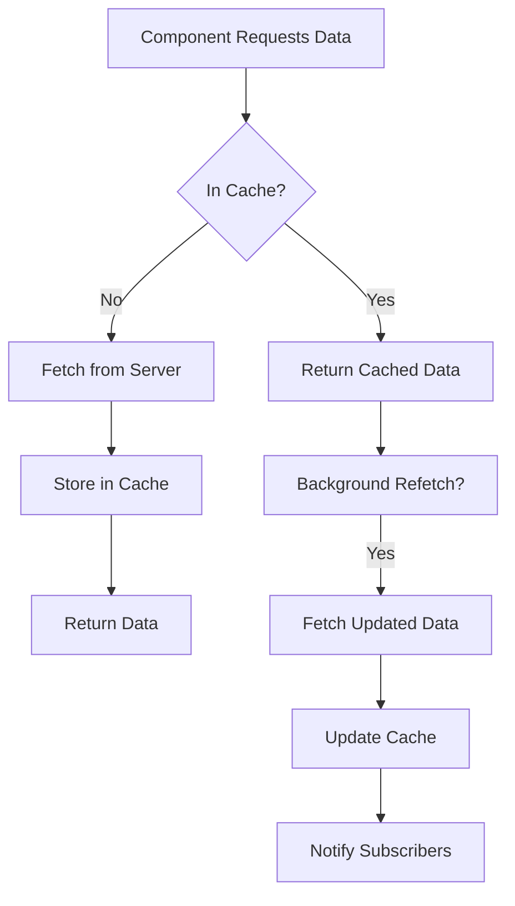
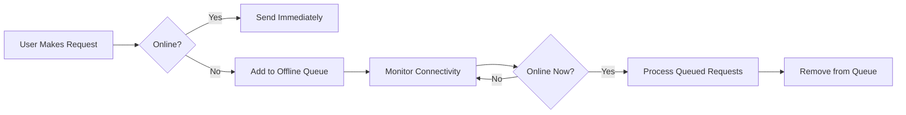
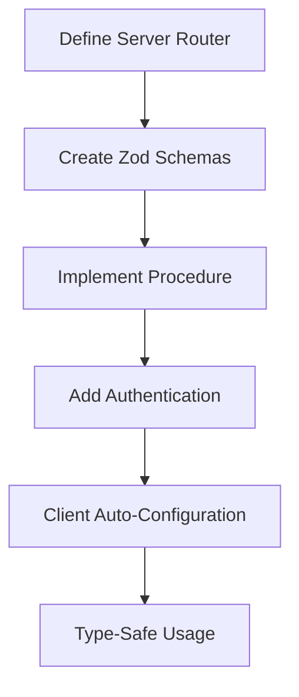
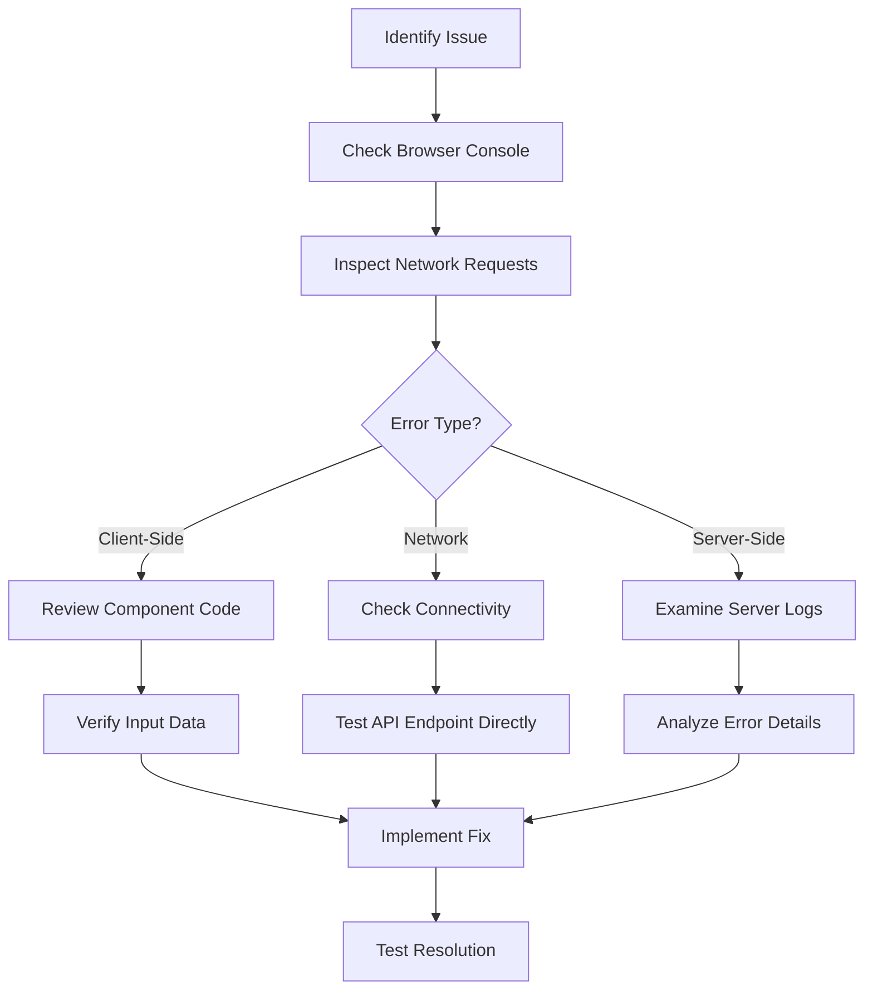

# tRPC Integration

<cite>
**Referenced Files in This Document**   
- [trpc.ts](file://apps/native/utils/trpc.ts)
- [index.ts](file://apps/server/src/lib/trpc/index.ts)
- [events.ts](file://apps/server/src/routers/events.ts)
- [context.ts](file://apps/server/src/lib/trpc/context.ts)
- [auth-client.ts](file://apps/native/lib/auth-client.ts)
</cite>

## Table of Contents
1. [Introduction](#introduction)
2. [tRPC Client Setup](#trpc-client-setup)
3. [Authentication Integration](#authentication-integration)
4. [Query and Mutation Patterns](#query-and-mutation-patterns)
5. [Error Handling and Middleware](#error-handling-and-middleware)
6. [Data Fetching and Caching](#data-fetching-and-caching)
7. [Network Resilience Features](#network-resilience-features)
8. [Extending the tRPC Client](#extending-the-trpc-client)
9. [Debugging API Communication](#debugging-api-communication)
10. [Conclusion](#conclusion)

## Introduction
This document provides a comprehensive overview of the tRPC integration within the Native Application. It details the configuration, implementation patterns, and best practices for using tRPC to enable type-safe API communication between the client and server. The documentation covers endpoint discovery, authentication, error handling, data fetching strategies, and network resilience features that ensure reliable operation in various network conditions.

## tRPC Client Setup

The tRPC client is configured in the `trpc.ts` file located in the native application's utils directory. This setup enables seamless communication with the backend server through type-safe endpoints.



**Diagram sources**
- [trpc.ts](file://apps/native/utils/trpc.ts#L1-L50)

**Section sources**
- [trpc.ts](file://apps/native/utils/trpc.ts#L1-L50)

The client configuration includes several key components:

- **Endpoint Discovery**: The client automatically discovers available endpoints from the server
- **Base URL Configuration**: The API endpoint is configured through environment variables
- **Transformer Setup**: SuperJSON transformer enables serialization of complex data types
- **Link Configuration**: Custom links handle request/response processing

The client is initialized with proper type inference to ensure end-to-end type safety across the application.

## Authentication Integration

Authentication is seamlessly integrated into the tRPC client through the auth-client module, which injects authentication headers on every request.



**Diagram sources**
- [trpc.ts](file://apps/native/utils/trpc.ts#L20-L40)
- [auth-client.ts](file://apps/native/lib/auth-client.ts#L15-L30)

**Section sources**
- [trpc.ts](file://apps/native/utils/trpc.ts#L20-L40)
- [auth-client.ts](file://apps/native/lib/auth-client.ts#L15-L30)

The authentication flow works as follows:

1. When a tRPC request is initiated, the client calls the auth-client to retrieve the current session token
2. The auth-client checks for an active session and returns a valid JWT token
3. The token is automatically injected into the Authorization header of the HTTP request
4. The server validates the token and processes the request accordingly

This integration ensures that all API calls are properly authenticated without requiring manual token management in individual components.

## Query and Mutation Patterns

The application implements consistent patterns for data fetching and state modification using tRPC queries and mutations.

### Query Patterns

Queries are used for data retrieval operations and follow a standardized pattern:

```typescript
// Example query usage
const { data, isLoading, error } = trpc.events.query.useQuery({
  filter: {
    dateRange: {
      startDate: "2023-01-01T00:00:00Z",
      endDate: "2023-12-31T23:59:59Z"
    }
  },
  pagination: {
    limit: 50,
    offset: 0
  }
});
```

### Mutation Patterns

Mutations are used for data modification operations and include proper error handling:

```typescript
// Example mutation usage
const createEvent = trpc.events.create.useMutation({
  onSuccess: (data) => {
    // Handle successful creation
    console.log("Event created:", data);
  },
  onError: (error) => {
    // Handle error
    console.error("Failed to create event:", error);
  }
});
```



**Diagram sources**
- [events.ts](file://apps/server/src/routers/events.ts#L50-L200)
- [trpc.ts](file://apps/native/utils/trpc.ts#L40-L60)

**Section sources**
- [events.ts](file://apps/server/src/routers/events.ts#L50-L200)
- [trpc.ts](file://apps/native/utils/trpc.ts#L40-L60)

## Error Handling and Middleware

The tRPC integration includes comprehensive error handling through middleware that standardizes error responses and provides detailed debugging information.



**Diagram sources**
- [index.ts](file://apps/server/src/lib/trpc/index.ts#L20-L80)
- [events.ts](file://apps/server/src/routers/events.ts#L100-L150)

**Section sources**
- [index.ts](file://apps/server/src/lib/trpc/index.ts#L20-L80)

The error handling system features:

- **Structured Error Responses**: All errors follow a consistent format with code, message, and metadata
- **Detailed Logging**: Errors are logged with contextual information including request ID and user session
- **Client-Side Handling**: Errors are properly propagated to the client for user feedback
- **Development Mode Details**: Stack traces are included in development for easier debugging

Common error codes used throughout the application:
- `INTERNAL_SERVER_ERROR`: Server-side processing failures
- `NOT_FOUND`: Resource not found
- `FORBIDDEN`: Insufficient permissions
- `UNAUTHORIZED`: Authentication required or failed
- `BAD_REQUEST`: Invalid input parameters

## Data Fetching and Caching

The application implements sophisticated data fetching strategies with automatic caching to optimize performance and reduce server load.

### Caching Behavior

The tRPC client leverages React Query for client-side caching with the following characteristics:

- **Automatic Caching**: Query results are automatically cached based on input parameters
- **Stale-While-Revalidate**: Data is served from cache while background refresh occurs
- **Cache Invalidation**: Mutations automatically invalidate relevant queries
- **Time-Based Expiration**: Cache entries expire after configurable time periods



**Diagram sources**
- [events.ts](file://apps/server/src/routers/events.ts#L200-L300)
- [trpc.ts](file://apps/native/utils/trpc.ts#L60-L80)

**Section sources**
- [events.ts](file://apps/server/src/routers/events.ts#L200-L300)
- [trpc.ts](file://apps/native/utils/trpc.ts#L60-L80)

### Real-Time Updates

For real-time data requirements, the application implements subscription patterns:

```typescript
// Example subscription usage
const subscription = trpc.events.onUpdate.useSubscription(undefined, {
  onData: (event) => {
    // Handle real-time update
    console.log("Received update:", event);
  },
  onError: (error) => {
    // Handle subscription error
    console.error("Subscription error:", error);
  }
});
```

## Network Resilience Features

The tRPC integration includes several features to ensure reliable operation under various network conditions.

### Retry Logic

The client implements configurable retry policies for failed requests:

- **Exponential Backoff**: Retry intervals increase exponentially
- **Configurable Attempts**: Maximum retry attempts can be set per request
- **Error Type Filtering**: Only certain error types trigger retries

### Offline Queueing

When the application is offline, mutation requests are queued and automatically retried when connectivity is restored:



**Diagram sources**
- [trpc.ts](file://apps/native/utils/trpc.ts#L80-L100)

**Section sources**
- [trpc.ts](file://apps/native/utils/trpc.ts#L80-L100)

### Conflict Resolution

For scenarios where multiple clients modify the same data, the system implements optimistic concurrency control:

- **Version Tracking**: Data includes version identifiers
- **Conditional Updates**: Updates only succeed if version matches
- **Merge Strategies**: Conflicts are resolved using predefined rules
- **User Notification**: Users are informed of conflicts when they occur

## Extending the tRPC Client

Adding new endpoints to the tRPC client follows a standardized process that ensures type safety and consistency.

### Adding New Endpoints

To extend the tRPC client with new endpoints:

1. Define the endpoint in the appropriate router file on the server
2. Create proper Zod validation schemas for input and output
3. Implement the procedure with appropriate authentication and authorization
4. The client automatically gains type safety through end-to-end TypeScript inference



**Diagram sources**
- [events.ts](file://apps/server/src/routers/events.ts#L1-L50)
- [index.ts](file://apps/server/src/routers/index.ts#L10-L20)

**Section sources**
- [events.ts](file://apps/server/src/routers/events.ts#L1-L50)
- [index.ts](file://apps/server/src/routers/index.ts#L10-L20)

### Best Practices for Extension

When extending the tRPC client, follow these guidelines:

- Use consistent naming conventions for procedures
- Implement comprehensive input validation with Zod
- Apply appropriate authentication and authorization
- Include detailed JSDoc comments for documentation
- Consider performance implications of new endpoints
- Test thoroughly with both positive and negative cases

## Debugging API Communication

Several tools and techniques are available for debugging tRPC API communication issues.

### Built-in Debugging Tools

The application includes several debugging features:

- **Request Logging**: Detailed logs of all API requests and responses
- **Error Tracing**: Comprehensive error information with stack traces in development
- **Network Inspection**: Integration with browser developer tools
- **Client-Side Debug Panel**: Visual interface for monitoring API activity

### Common Issues and Solutions

| Issue | Symptoms | Solution |
|------|---------|----------|
| Authentication Failure | 401 responses, login loops | Check token expiration, verify auth-client configuration |
| Type Errors | Compilation errors, type mismatches | Verify schema definitions, regenerate types if needed |
| Network Timeouts | Slow responses, connection failures | Check server status, verify network connectivity |
| Caching Issues | Stale data, missing updates | Inspect cache configuration, verify invalidation patterns |
| Validation Errors | 400 responses, rejected inputs | Review Zod schemas, validate input data structure |

### Debugging Workflow



**Diagram sources**
- [index.ts](file://apps/server/src/lib/trpc/index.ts#L80-L100)
- [events.ts](file://apps/server/src/routers/events.ts#L1000-L1200)

**Section sources**
- [index.ts](file://apps/server/src/lib/trpc/index.ts#L80-L100)
- [events.ts](file://apps/server/src/routers/events.ts#L1000-L1200)

## Conclusion

The tRPC integration in the Native Application provides a robust, type-safe foundation for API communication. By leveraging tRPC's features for endpoint discovery, authentication, error handling, and data fetching, the application achieves high reliability and developer productivity. The comprehensive caching strategy, network resilience features, and debugging tools ensure optimal performance and maintainability. Following the documented patterns for extending the client will maintain consistency and type safety across the codebase as new features are developed.