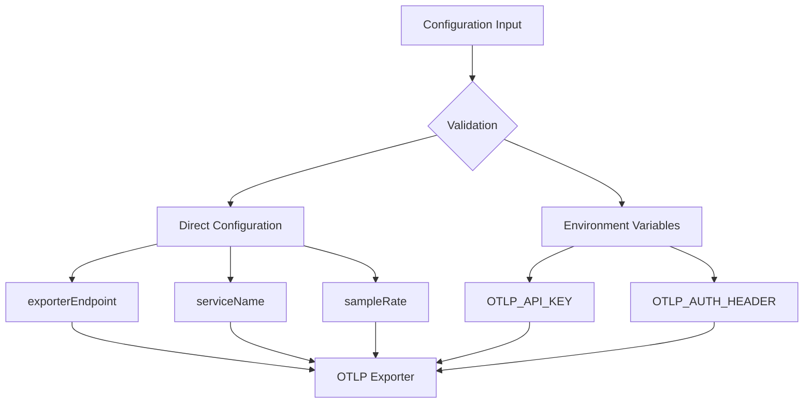
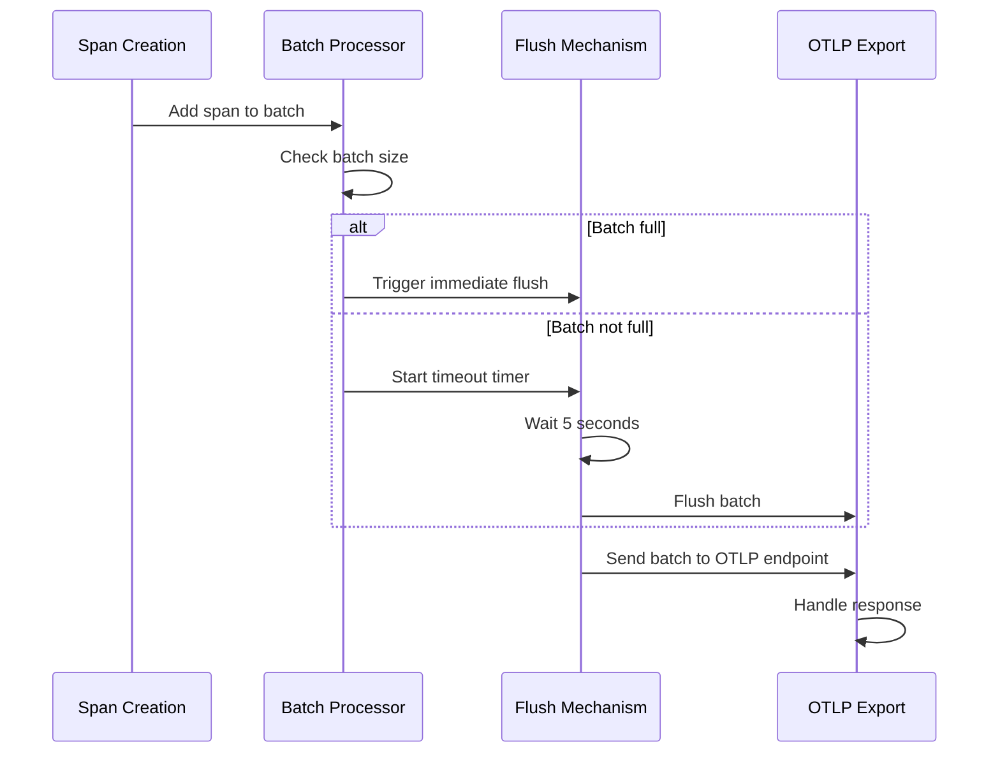
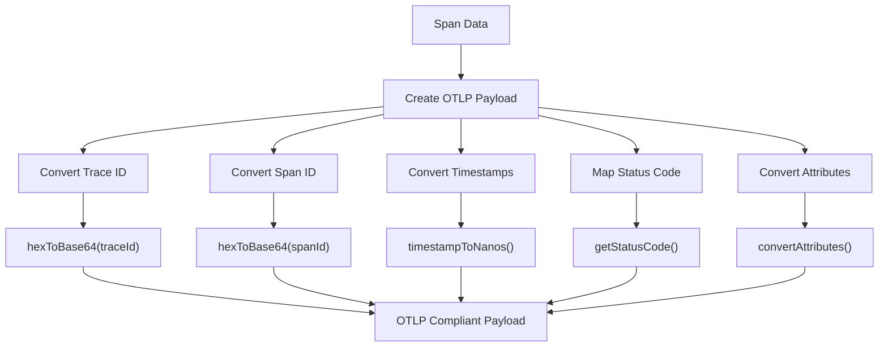
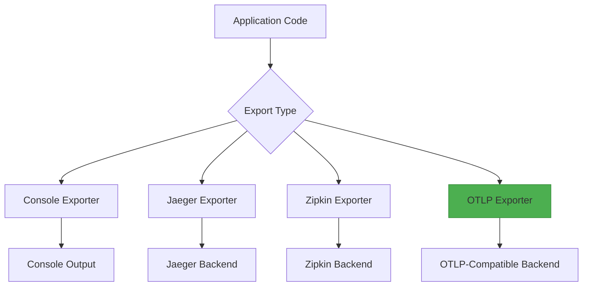
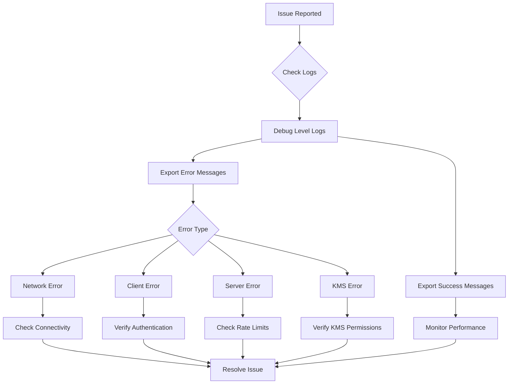

# OTLP Observability Configuration

<cite>
**Referenced Files in This Document**   
- [otlp-configuration.md](file://packages/audit/docs/observability/otlp-configuration.md) - *Updated with enhanced logging integration*
- [tracer.ts](file://packages/audit/src/observability/tracer.ts) - *Enhanced with KMS encryption and retry logic*
- [types.ts](file://packages/audit/src/observability/types.ts) - *Updated with new configuration types*
- [config/types.ts](file://packages/audit/src/config/types.ts) - *Added logging configuration types*
- [otpl.ts](file://packages/logs/src/otpl.ts) - *New structured logging implementation*
- [logging.ts](file://packages/logs/src/logging.ts) - *Enhanced with OTLP exporter*
- [init.ts](file://apps/server/src/lib/hono/init.ts) - *Integrated structured logging*
- [error-handling.ts](file://apps/server/src/lib/middleware/error-handling.ts) - *Enhanced error logging*
- [index.ts](file://apps/worker/src/index.ts) - *Worker logging integration*
</cite>

## Update Summary
**Changes Made**   
- Added comprehensive structured logging documentation with OTLP integration
- Enhanced authentication section with KMS encryption support
- Updated error handling with improved retry logic details
- Added new integration patterns for server and worker services
- Expanded practical examples with real-world usage scenarios
- Updated troubleshooting guide with new error cases

## Table of Contents
1. [Introduction](#introduction)
2. [Configuration](#configuration)
3. [Implementation Details](#implementation-details)
4. [API Interfaces](#api-interfaces)
5. [Integration Patterns](#integration-patterns)
6. [Practical Examples](#practical-examples)
7. [Troubleshooting Guide](#troubleshooting-guide)
8. [Best Practices](#best-practices)

## Introduction
The OTLP (OpenTelemetry Protocol) Observability Configuration provides a standardized approach for exporting distributed traces and structured logs from the audit system to various observability platforms. This configuration enables comprehensive monitoring, performance analysis, and troubleshooting capabilities across the system's components.

The implementation supports multiple OTLP-compatible backends including Jaeger, Grafana Tempo, DataDog, New Relic, AWS X-Ray, Honeycomb, Lightstep, and OpenObserve. The configuration is designed to be flexible, secure, and production-ready, with features such as batch processing, error handling, authentication support, and KMS encryption for sensitive data.

**Section sources**
- [otlp-configuration.md](file://packages/audit/docs/observability/otlp-configuration.md#L0-L282)

## Configuration
The OTLP exporter configuration is defined through the `ObservabilityConfig` interface, which specifies the tracing parameters for the audit system. The configuration supports both direct parameter setting and environment variable-based authentication.

### Basic Configuration Parameters
The core configuration parameters include:

- **enabled**: Boolean flag to enable or disable tracing
- **serviceName**: Identifier for the service being traced
- **sampleRate**: Sampling rate for traces (0.0 to 1.0)
- **exporterType**: Type of exporter ('otlp' for OTLP)
- **exporterEndpoint**: URL of the OTLP-compatible backend
- **headers**: Additional HTTP headers for the export request



### Authentication Methods
The system supports multiple authentication methods for secure communication with OTLP endpoints:

- **Bearer Token Authentication**: Using the `OTLP_API_KEY` environment variable
- **Custom Header Authentication**: Using the `OTLP_AUTH_HEADER` environment variable with key-value pairs
- **KMS Encryption**: Sensitive configuration values encrypted using AWS KMS

The authentication headers are automatically included in export requests based on the configured method.

### Platform-Specific Configuration
The configuration supports various observability platforms with specific endpoint requirements:

- **Jaeger**: Uses `/api/traces` endpoint with HTTP
- **Grafana Tempo**: Uses `/tempo/v1/traces` endpoint with HTTPS
- **DataDog**: Uses `/v1/traces` endpoint with HTTPS
- **OpenObserve**: Uses `/api/default/traces` endpoint with HTTPS
- **Honeycomb**: Uses `/v1/traces/your-dataset` endpoint with HTTPS

**Section sources**
- [types.ts](file://packages/audit/src/observability/types.ts#L254-L287)
- [otlp-configuration.md](file://packages/audit/docs/observability/otlp-configuration.md#L59-L114)

## Implementation Details
The OTLP exporter implementation provides robust features for reliable trace export, including batch processing, error handling, payload formatting, and enhanced structured logging.

### Batch Processing
The implementation uses a batch processing mechanism to optimize network utilization and reduce the number of HTTP requests:

- **Batch Size**: Default of 100 spans per batch
- **Batch Timeout**: 5 seconds for automatic flushing
- **Immediate Flushing**: Triggered when batch reaches maximum size
- **Memory Management**: Automatic cleanup of processed batches

The batch processing system ensures efficient transmission of trace data while minimizing the impact on application performance.



**Diagram sources**
- [tracer.ts](file://packages/audit/src/observability/tracer.ts#L304-L358)

### Error Handling and Reliability
The implementation includes comprehensive error handling to ensure reliable trace export:

- **Exponential Backoff**: Retry delays increase exponentially
- **Rate Limiting Support**: Respects `Retry-After` headers from servers
- **Circuit Breaking**: Client errors (4xx) are not retried
- **Network Resilience**: Network failures are retried up to 3 times
- **KMS Integration**: Failed decryption attempts trigger security alerts

The error handling system automatically manages transient failures and ensures trace data is not lost during temporary outages.

### Payload Formatting
The implementation formats trace data according to the OTLP specification:

- **Base64 Encoding**: Trace and span IDs are converted from hex to base64
- **Nanosecond Timestamps**: Millisecond timestamps are converted to nanoseconds
- **OTLP Status Codes**: Status codes are mapped to OTLP numeric values
- **Attribute Conversion**: Tags and fields are converted to OTLP attribute format

The payload formatting ensures compatibility with all OTLP-compatible backends.



**Diagram sources**
- [tracer.ts](file://packages/audit/src/observability/tracer.ts#L404-L452)
- [tracer.ts](file://packages/audit/src/observability/tracer.ts#L534-L597)

### Structured Logging Integration
The enhanced logging system integrates structured logging with OTLP export capabilities:

- **Log Levels**: debug, info, warn, error, fatal
- **Context Preservation**: Request IDs and correlation IDs
- **Field Structuring**: Typed fields with proper serialization
- **Batch Processing**: Same batching mechanism as traces
- **Compression**: Payload compression for large log entries

**Section sources**
- [otpl.ts](file://packages/logs/src/otpl.ts#L0-L165)
- [logging.ts](file://packages/logs/src/logging.ts#L448-L495)

## API Interfaces
The OTLP Observability Configuration exposes a well-defined API interface for integration with the audit system.

### Tracer Interface
The `Tracer` interface defines the core methods for distributed tracing:

- **startSpan**: Creates a new span with the specified operation name
- **finishSpan**: Completes a span and triggers export
- **injectContext**: Injects trace context into headers
- **extractContext**: Extracts trace context from headers
- **createChildSpan**: Creates a child span from a parent span

### Span Interface
The `Span` interface provides methods for span manipulation:

- **setTag**: Adds a single tag to the span
- **setTags**: Adds multiple tags to the span
- **log**: Adds a log entry with level, message, and fields
- **setStatus**: Sets the span status (OK, ERROR, TIMEOUT, CANCELLED)
- **finish**: Completes the span and calculates duration

### Configuration Interface
The `ObservabilityConfig` interface defines the configuration structure:

```typescript
interface ObservabilityConfig {
  tracing: {
    enabled: boolean
    serviceName: string
    sampleRate: number
    exporterType: 'console' | 'jaeger' | 'zipkin' | 'otlp'
    exporterEndpoint?: string
    headers?: Record<string, string>
  }
  metrics: {
    enabled: boolean
    collectionInterval: number
    retentionPeriod: number
    exporterType: 'prometheus' | 'console' | 'custom'
    exporterEndpoint?: string
  }
  profiling: {
    enabled: boolean
    sampleRate: number
    maxProfiles: number
    profileDuration: number
  }
  dashboard: {
    enabled: boolean
    refreshInterval: number
    historyRetention: number
  }
}
```

**Section sources**
- [types.ts](file://packages/audit/src/observability/types.ts#L1-L253)

## Integration Patterns
The OTLP Observability Configuration supports various integration patterns for different deployment scenarios.

### Direct Integration
The most common pattern involves direct configuration of the tracer with the OTLP endpoint:

```typescript
const tracer = new AuditTracer({
  enabled: true,
  serviceName: 'audit-system',
  sampleRate: 0.1,
  exporterType: 'otlp',
  exporterEndpoint: process.env.OTLP_ENDPOINT || 'http://localhost:4318/v1/traces'
})
```

This pattern is suitable for most applications and provides full control over the configuration.

### Environment-Based Configuration
For enhanced security, sensitive configuration can be managed through environment variables:

```bash
OTLP_API_KEY=your-api-key-here
OTLP_AUTH_HEADER="Authorization: Basic base64credentials"
```

This pattern separates configuration from code and allows for secure credential management.

### Migration Pattern
When migrating from other tracing systems, the configuration can be updated with minimal code changes:

```typescript
// From console exporter
const oldConfig = {
  exporterType: 'console'
}

// To OTLP exporter
const newConfig = {
  exporterType: 'otlp',
  exporterEndpoint: 'https://your-platform.com/v1/traces'
}
```

The migration pattern allows for seamless transition between tracing backends without changing the tracing API usage.



**Diagram sources**
- [otlp-configuration.md](file://packages/audit/docs/observability/otlp-configuration.md#L265-L282)

### Server and Worker Integration
The enhanced structured logging is integrated across server and worker services:

```typescript
// Server integration
import { initLogging } from '@repo/server/lib/hono/init'
initLogging({
  exporterType: 'otlp',
  exporterEndpoint: process.env.OTLP_ENDPOINT
})

// Worker integration
import { OTPLLogger } from '@repo/logs'
const logger = new OTPLLogger(
  { application: 'worker-service', module: 'processing' },
  { exporterType: 'otlp', exporterEndpoint: process.env.OTLP_ENDPOINT }
)
```

**Section sources**
- [init.ts](file://apps/server/src/lib/hono/init.ts)
- [index.ts](file://apps/worker/src/index.ts)

## Practical Examples
The following examples demonstrate practical usage of the OTLP Observability Configuration.

### Basic Usage
```typescript
import { AuditTracer } from '@repo/audit'

// Initialize tracer with OTLP configuration
const tracer = new AuditTracer({
  enabled: true,
  serviceName: 'audit-system',
  sampleRate: 0.1,
  exporterType: 'otlp',
  exporterEndpoint: process.env.OTLP_ENDPOINT || 'http://localhost:4318/v1/traces'
})

// Create and finish spans
async function processAuditEvent(eventData: any) {
  const span = tracer.startSpan('process-audit-event')
  
  try {
    span.setTags({
      'event.type': eventData.type,
      'event.size': eventData.size,
      'user.id': eventData.userId
    })

    // Simulate processing
    await processEvent(eventData)
    
    span.setStatus('OK')
  } catch (error) {
    span.setStatus('ERROR', error.message)
    span.log('error', 'Processing failed', { error: error.message })
    throw error
  } finally {
    tracer.finishSpan(span)
  }
}

// Cleanup on shutdown
process.on('SIGTERM', () => {
  tracer.cleanup() // Flushes pending batches
})
```

### Health Monitoring
```typescript
// Check if spans are being generated
const activeSpans = tracer.getActiveSpans()
console.log(`Active spans: ${activeSpans.length}`)

// Monitor span batching
const tracesForEvent = tracer.getTraceSpans(traceId)
console.log(`Spans in trace: ${tracesForEvent.length}`)
```

### Decorator Pattern
```typescript
@trace('process-audit-event')
async function processAuditEvent(eventData: any) {
  // Function logic here
  await processEvent(eventData)
}
```

The decorator pattern automatically creates spans for method execution, reducing boilerplate code.

### Structured Logging
```typescript
import { OTPLLogger } from '@repo/logs'

const logger = new OTPLLogger(
  { 
    environment: 'production',
    application: 'audit-system',
    module: 'event-processing'
  },
  {
    exporterType: 'otlp',
    exporterEndpoint: process.env.OTLP_ENDPOINT
  }
)

// Log with structured fields
logger.info('Event processing started', {
  eventId: '12345',
  eventType: 'user-login',
  userId: 'user-67890'
})

logger.error('Processing failed', {
  eventId: '12345',
  errorType: 'DatabaseTimeout',
  durationMs: 5000
})
```

**Section sources**
- [otlp-configuration.md](file://packages/audit/docs/observability/otlp-configuration.md#L115-L171)
- [otpl.ts](file://packages/logs/src/otpl.ts#L38-L87)

## Troubleshooting Guide
This section provides guidance for diagnosing and resolving common issues with OTLP configuration.

### Common Issues
#### Endpoint Not Reachable
```
Error: Failed after 3 attempts: 503 Service Unavailable
```
**Solution**: Verify network connectivity and ensure the OTLP endpoint URL is correct.

#### Authentication Failures
```
Error: Client error: 401 Unauthorized
```
**Solution**: Check that the API key or authentication header is correctly configured in environment variables.

#### Rate Limiting
```
Error: Client error: 429 Too Many Requests
```
**Solution**: Reduce the sampling rate or increase the batch flush interval to decrease the volume of exported traces.

#### Large Payload Issues
```
Error: Client error: 413 Payload Too Large
```
**Solution**: Reduce the batch size or implement payload compression.

#### KMS Decryption Failures
```
Error: KMS decryption failed: AccessDeniedException
```
**Solution**: Verify IAM permissions for KMS key access and key policy configuration.

### Debugging Steps
1. Enable debug logging to monitor export success and failures
2. Verify environment variables are properly set
3. Test endpoint accessibility using curl or similar tools
4. Start with minimal configuration and gradually add complexity
5. Monitor network traffic to verify requests are being sent



**Diagram sources**
- [otlp-configuration.md](file://packages/audit/docs/observability/otlp-configuration.md#L223-L264)
- [otpl.ts](file://packages/logs/src/otpl.ts#L84-L129)

## Best Practices
Adhering to these best practices ensures optimal performance and reliability of the OTLP Observability Configuration.

### Production Configuration
1. **Use appropriate sampling rates** (0.01-0.1 for high traffic systems)
2. **Set resource limits** to prevent memory issues from accumulating spans
3. **Monitor export success rates** to detect connectivity or configuration issues
4. **Use HTTPS endpoints** for secure transmission of trace data
5. **Implement proper authentication** using environment variables for credential management

### Performance Tuning
1. **Batch size**: Adjust based on traffic patterns and network conditions
2. **Sampling rate**: Use higher rates for debugging, lower rates for production
3. **Flush intervals**: Balance between latency requirements and network efficiency
4. **Cleanup intervals**: Implement regular cleanup to prevent memory leaks

### Security Considerations
1. **Use environment variables** for sensitive configuration like API keys
2. **Rotate API keys** regularly to minimize the impact of potential leaks
3. **Use HTTPS** for all endpoints to encrypt trace data in transit
4. **Limit trace data sensitivity** by avoiding logging sensitive information in span tags or logs
5. **Implement KMS encryption** for sensitive configuration values

**Section sources**
- [otlp-configuration.md](file://packages/audit/docs/observability/otlp-configuration.md#L172-L222)
- [config/types.ts](file://packages/audit/src/config/types.ts#L488-L555)