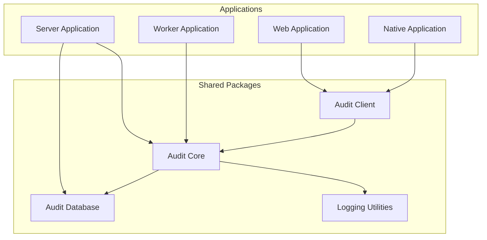
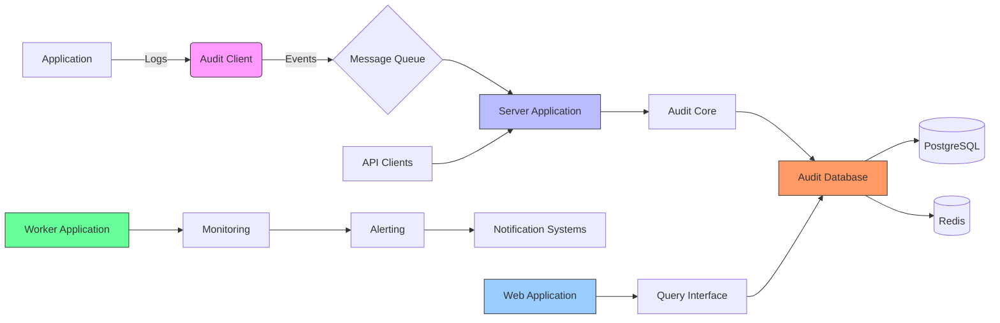
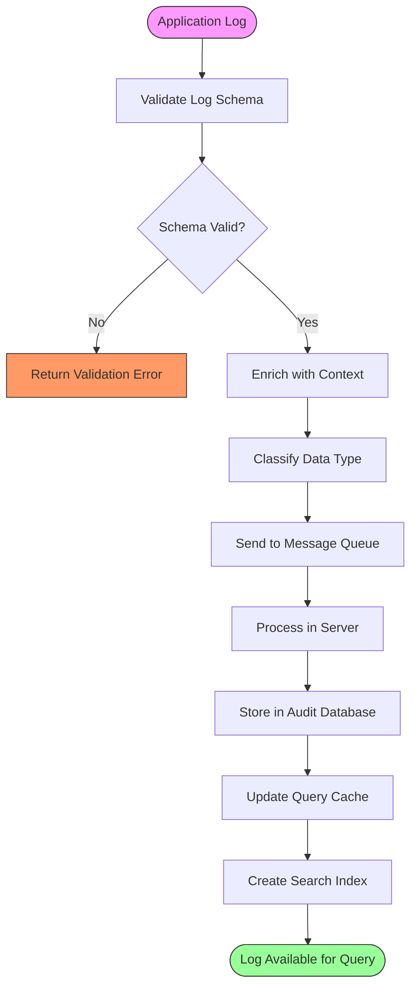
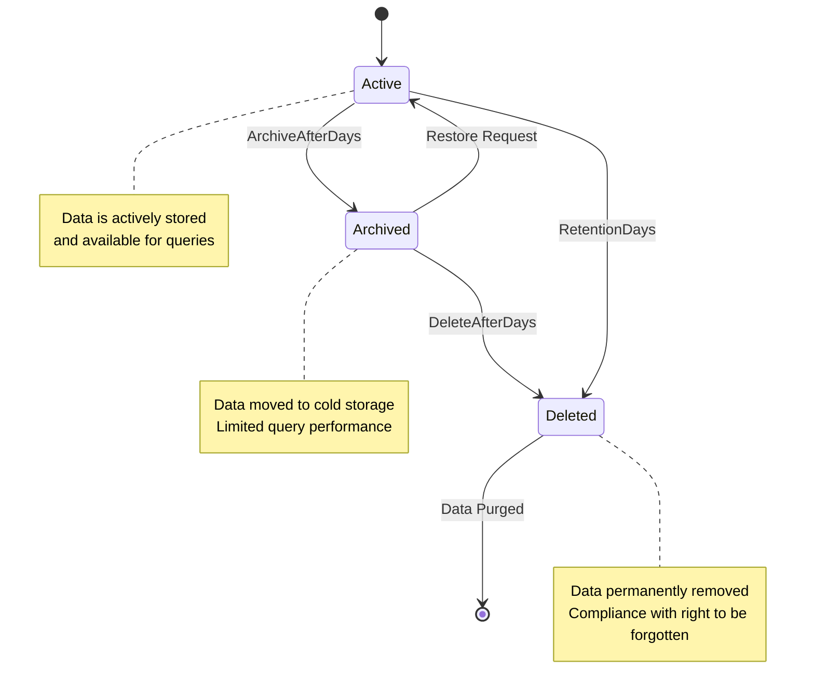
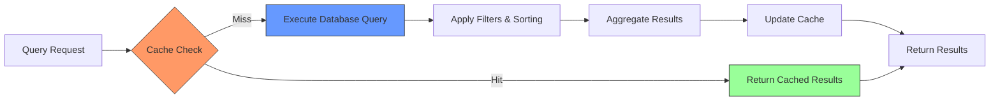
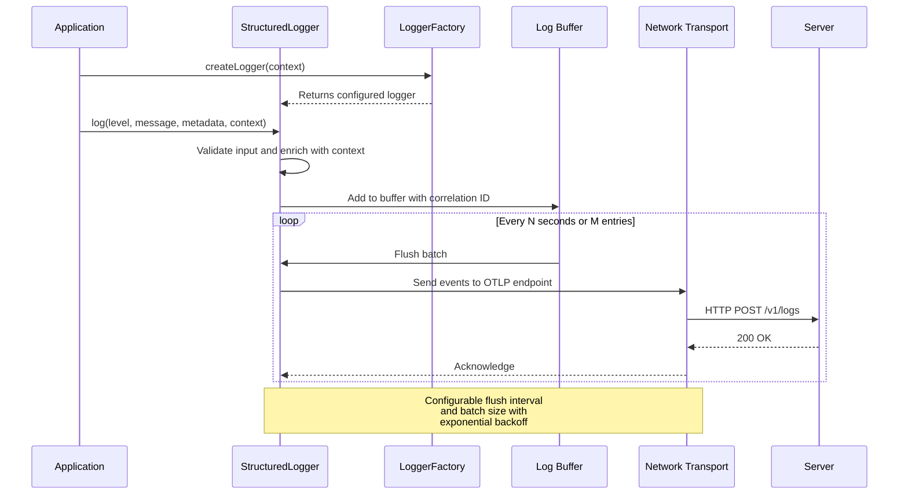
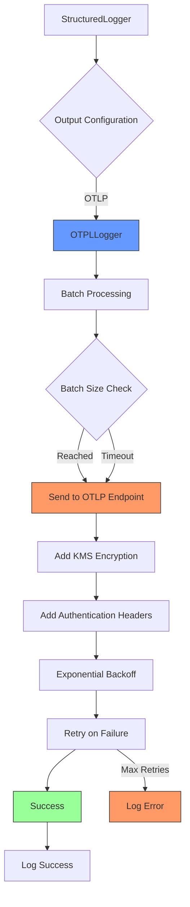
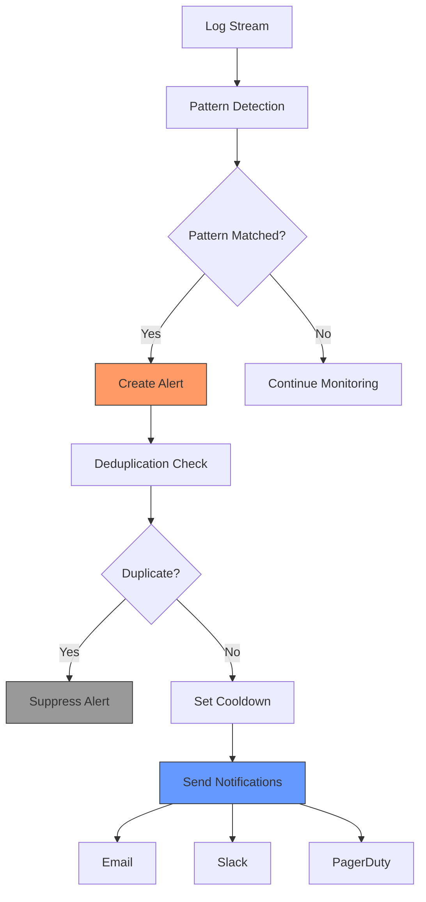
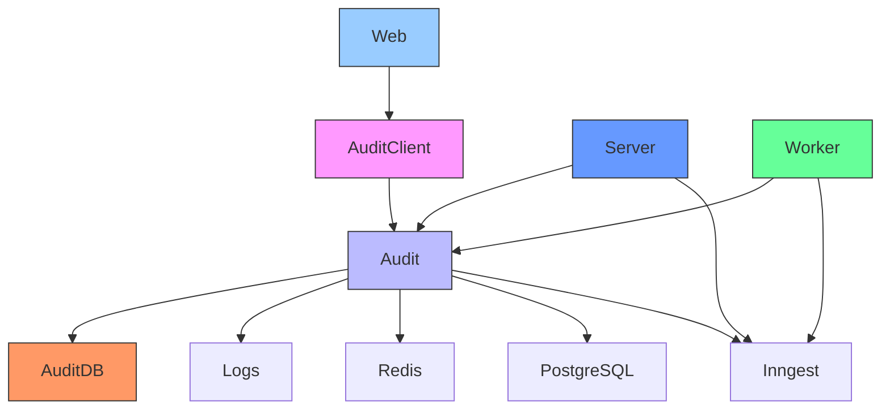

# OpenObserve Logging and Observability

<cite>
**Referenced Files in This Document**   
- [audit.ts](file://packages/audit/src/audit.ts) - *Updated in recent commit*
- [log.ts](file://packages/logs/src/log.ts)
- [gdpr-utils.ts](file://packages/audit/src/gdpr/gdpr-utils.ts)
- [monitoring.ts](file://packages/audit/src/monitor/monitoring.ts)
- [audit-client.ts](file://apps/web/src/lib/audit-client.ts)
- [observability-api.ts](file://apps/server/src/routes/observability-api.ts)
- [alerts.ts](file://apps/server/src/routers/alerts.ts)
- [enhanced-client.md](file://packages/audit-db/docs/api-reference/enhanced-client.md)
- [REDIS_CACHE_GUIDE.md](file://packages/audit-db/REDIS_CACHE_GUIDE.md)
- [logging-example.ts](file://packages/audit-client/src/examples/logging-example.ts)
- [monitoring.md](file://apps/worker/docs/tutorials/monitoring.md)
- [index.ts](file://packages/logs/src/index.ts) - *Refactored in commit b3e1bbbbb94dd38669309f15bf50eaca5e2c3693*
- [logging.ts](file://packages/logs/src/logging.ts) - *Updated with StructuredLogger in commit b3e1bbbbb94dd38669309f15bf50eaca5e2c3693*
- [otpl.ts](file://packages/logs/src/otpl.ts) - *Enhanced with KMS and OTLP features in commit 437f4502e77146ee0ef1b9762251df91232bc6f4*
- [tracer.ts](file://packages/audit/src/observability/tracer.ts) - *Integrated with KMS and OTLP exporter in commit 437f4502e77146ee0ef1b9762251df91232bc6f4*
- [otlp-configuration.md](file://packages/audit/docs/observability/otlp-configuration.md) - *Added OTLP configuration guide in commit 437f4502e77146ee0ef1b9762251df91232bc6f4*
</cite>

## Update Summary
**Changes Made**   
- Updated logging package documentation to reflect the replacement of ConsoleLogger with StructuredLogger and LoggerFactory
- Added documentation for KMS encryption integration and enhanced OTLP exporter with structured logging
- Updated application logging integration section to reflect new structured logging approach
- Added new section on OTLP Exporter Configuration
- Updated referenced files to include new and modified files

## Table of Contents
1. [Introduction](#introduction)
2. [Project Structure](#project-structure)
3. [Core Components](#core-components)
4. [Architecture Overview](#architecture-overview)
5. [Detailed Component Analysis](#detailed-component-analysis)
6. [Dependency Analysis](#dependency-analysis)
7. [Performance Considerations](#performance-considerations)
8. [Troubleshooting Guide](#troubleshooting-guide)
9. [Conclusion](#conclusion)

## Introduction
OpenObserve is a comprehensive logging and observability platform designed to provide robust audit logging, data retention management, and real-time monitoring capabilities. The system enables organizations to maintain compliance with regulatory requirements while gaining deep insights into system behavior through advanced querying and alerting mechanisms. This documentation covers the core functionality of OpenObserve, including its log ingestion pipeline, data retention policies, querying interface, application logging integration, and alerting setup.

## Project Structure
The OpenObserve implementation is organized as a monorepo with multiple applications and shared packages. The architecture follows a modular design with clear separation between client, server, database, and worker components. Key structural elements include dedicated applications for web, native, server, and worker processes, along with shared packages for audit functionality, database operations, and logging utilities.

**Diagram sources**
- [package.json](file://package.json#L1-L20)
- [pnpm-workspace.yaml](file://pnpm-workspace.yaml#L1-L10)

**Section sources**
- [package.json](file://package.json#L1-L50)
- [pnpm-workspace.yaml](file://pnpm-workspace.yaml#L1-L15)

## Core Components
The OpenObserve system comprises several core components that work together to provide comprehensive logging and observability. The audit core package handles event processing and compliance management, while the audit client provides application-level integration. The audit database package manages data storage with advanced caching capabilities, and the logging utilities package standardizes log formats across the system. The server application exposes REST and GraphQL APIs for data ingestion and querying, while the worker application handles background processing and monitoring tasks.

**Section sources**
- [audit.ts](file://packages/audit/src/audit.ts#L1-L100)
- [logs](file://packages/logs)
- [audit-client](file://packages/audit-client)

## Architecture Overview
OpenObserve follows a distributed architecture with multiple entry points for log ingestion and various processing layers for data transformation, storage, and analysis. The system is designed to handle high-volume log data while maintaining low latency for querying and alerting operations.

**Diagram sources**
- [server](file://apps/server)
- [worker](file://apps/worker)
- [audit](file://packages/audit)
- [audit-db](file://packages/audit-db)

## Detailed Component Analysis

### Log Ingestion Pipeline
The log ingestion pipeline in OpenObserve is designed for reliability, scalability, and performance. It begins with the audit client in applications, which standardizes log formats before transmission to the server application. The server processes incoming events through a series of validation, enrichment, and routing steps before storing them in the audit database.

**Diagram sources**
- [audit.ts](file://packages/audit/src/audit.ts#L150-L300)
- [log.ts](file://packages/logs/src/log.ts#L1-L50)
- [observability-api.ts](file://apps/server/src/routes/observability-api.ts#L20-L80)

**Section sources**
- [audit.ts](file://packages/audit/src/audit.ts#L1-L400)
- [log.ts](file://packages/logs/src/log.ts#L1-L60)

### Data Retention Policies
OpenObserve implements sophisticated data retention policies based on data classification and regulatory requirements. The system supports different retention periods for various data classifications (PUBLIC, INTERNAL, CONFIDENTIAL, PHI) and provides automated archiving and deletion workflows.

**Diagram sources**
- [gdpr-utils.ts](file://packages/audit/src/gdpr/gdpr-utils.ts#L150-L250)
- [audit-db](file://packages/audit-db)

**Section sources**
- [gdpr-utils.ts](file://packages/audit/src/gdpr/gdpr-utils.ts#L1-L300)
- [audit-db](file://packages/audit-db)

### Querying Interface
The querying interface in OpenObserve provides both programmatic and user-friendly access to log data. It supports structured queries through REST and GraphQL APIs, with advanced filtering, sorting, and aggregation capabilities. The interface is optimized for performance through intelligent caching and indexing strategies.

**Diagram sources**
- [enhanced-client.md](file://packages/audit-db/docs/api-reference/enhanced-client.md#L1-L100)
- [REDIS_CACHE_GUIDE.md](file://packages/audit-db/REDIS_CACHE_GUIDE.md#L1-L150)

**Section sources**
- [enhanced-client.md](file://packages/audit-db/docs/api-reference/enhanced-client.md#L1-L150)
- [REDIS_CACHE_GUIDE.md](file://packages/audit-db/REDIS_CACHE_GUIDE.md#L1-L200)

### Application Logging Integration
OpenObserve has been updated to use a structured logging approach with the new StructuredLogger and LoggerFactory classes. The integration now supports enhanced context, performance metrics, and multiple output destinations including OTLP.

**Diagram sources**
- [logging.ts](file://packages/logs/src/logging.ts#L1-L620)
- [index.ts](file://packages/logs/src/index.ts#L1-L3)
- [otpl.ts](file://packages/logs/src/otpl.ts#L1-L165)

**Section sources**
- [logging.ts](file://packages/logs/src/logging.ts#L1-L620) - *Updated in commit b3e1bbbbb94dd38669309f15bf50eaca5e2c3693*
- [index.ts](file://packages/logs/src/index.ts#L1-L3) - *Updated in commit b3e1bbbbb94dd38669309f15bf50eaca5e2c3693*
- [otpl.ts](file://packages/logs/src/otpl.ts#L1-L165) - *Updated in commit 437f4502e77146ee0ef1b9762251df91232bc6f4*

### OTLP Exporter Configuration
The OpenObserve system now includes an enhanced OTLP (OpenTelemetry Protocol) exporter for sending logs and traces to observability platforms. This feature integrates KMS encryption and supports multiple OTLP-compatible backends.

**Diagram sources**
- [otpl.ts](file://packages/logs/src/otpl.ts#L1-L165)
- [tracer.ts](file://packages/audit/src/observability/tracer.ts#L1-L677)
- [otlp-configuration.md](file://packages/audit/docs/observability/otlp-configuration.md#L1-L283)

**Section sources**
- [otpl.ts](file://packages/logs/src/otpl.ts#L1-L165) - *Updated in commit 437f4502e77146ee0ef1b9762251df91232bc6f4*
- [tracer.ts](file://packages/audit/src/observability/tracer.ts#L1-L677) - *Updated in commit 437f4502e77146ee0ef1b9762251df91232bc6f4*
- [otlp-configuration.md](file://packages/audit/docs/observability/otlp-configuration.md#L1-L283) - *Added in commit 437f4502e77146ee0ef1b9762251df91232bc6f4*

### Alerting Setup
The alerting system in OpenObserve monitors log data for specific patterns and conditions, generating alerts when predefined thresholds are exceeded. The system supports multiple notification channels and severity levels, with deduplication and cooldown mechanisms to prevent alert storms.

**Diagram sources**
- [monitoring.ts](file://packages/audit/src/monitor/monitoring.ts#L400-L600)
- [alerts.ts](file://apps/server/src/routers/alerts.ts#L1-L50)
- [monitoring.md](file://apps/worker/docs/tutorials/monitoring.md#L1-L100)

**Section sources**
- [monitoring.ts](file://packages/audit/src/monitor/monitoring.ts#L1-L700)
- [alerts.ts](file://apps/server/src/routers/alerts.ts#L1-L100)

## Dependency Analysis
The OpenObserve system has a well-defined dependency structure with clear boundaries between components. The core dependencies include the audit package as the central processing engine, the audit-db package for data storage with Redis caching, and the audit-client package for application integration. The system relies on external services for message queuing, notification delivery, and monitoring.

**Diagram sources**
- [package.json](file://package.json#L20-L50)
- [tsconfig.json](file://tsconfig.json#L1-L10)
- [pnpm-workspace.yaml](file://pnpm-workspace.yaml#L1-L15)

**Section sources**
- [package.json](file://package.json#L1-L60)
- [pnpm-workspace.yaml](file://pnpm-workspace.yaml#L1-L20)

## Performance Considerations
OpenObserve incorporates several performance optimization strategies to handle high-volume log data efficiently. These include multi-level caching (hybrid Redis and local cache), batch processing of events, connection pooling for database operations, and asynchronous processing for non-critical operations. The system is designed to scale horizontally, with stateless server components that can be deployed across multiple instances.

**Section sources**
- [REDIS_CACHE_GUIDE.md](file://packages/audit-db/REDIS_CACHE_GUIDE.md#L1-L300)
- [audit-db](file://packages/audit-db)
- [performance.test.ts](file://packages/audit/src/__tests__/performance.test.ts)

## Troubleshooting Guide
When encountering issues with OpenObserve, consider checking the following areas: network connectivity between components, Redis and PostgreSQL availability, proper configuration of the audit client, and sufficient system resources. Common issues include cache misconfiguration, database connection limits, and alert notification delivery failures. The system provides comprehensive monitoring metrics that can help diagnose performance bottlenecks and error conditions.

**Section sources**
- [error-handling.test.ts](file://packages/audit/src/__tests__/error-handling.test.ts#L1-L50)
- [monitoring-integration.test.ts](file://apps/worker/src/__tests__/monitoring-integration.test.ts#L1-L30)

## Conclusion
OpenObserve provides a comprehensive solution for logging and observability with robust features for log ingestion, data retention management, querying, and alerting. The system's modular architecture allows for flexible deployment and scaling, while its compliance-focused design ensures adherence to regulatory requirements. By following the integration patterns and best practices outlined in this documentation, organizations can effectively implement OpenObserve to gain valuable insights into their systems while maintaining data governance and security standards.