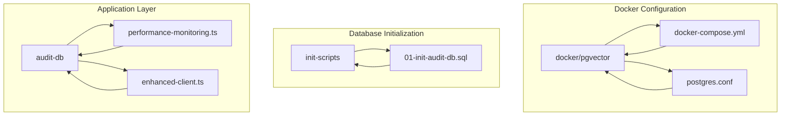
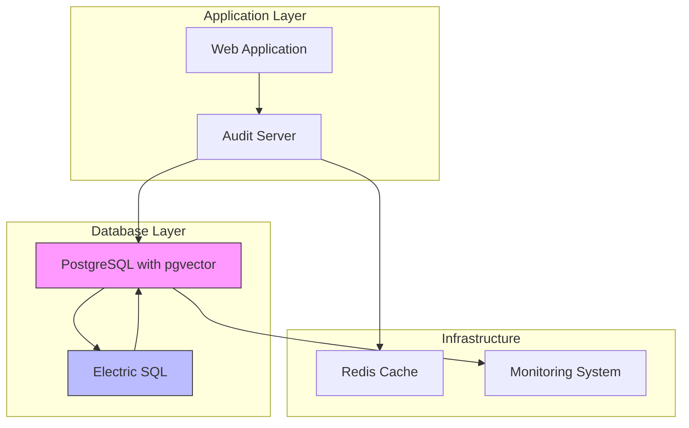
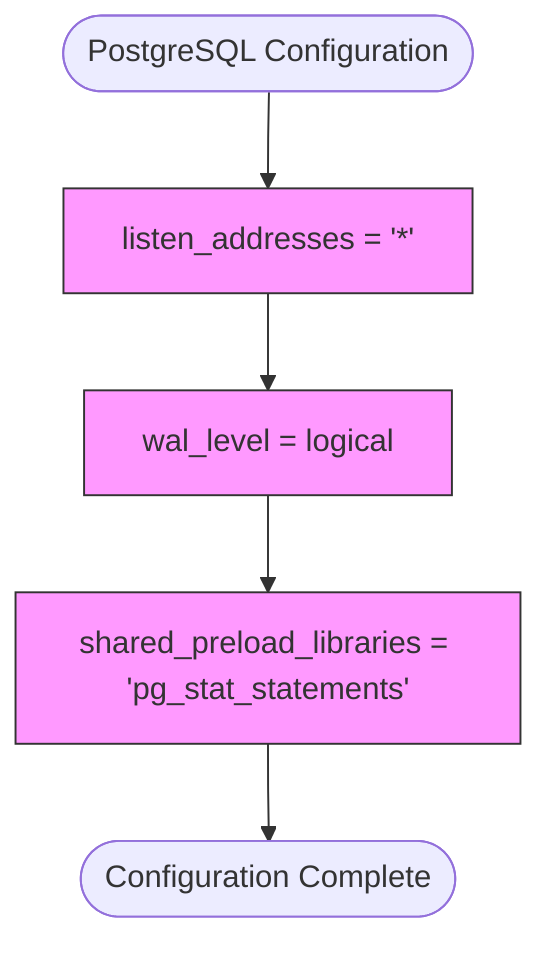
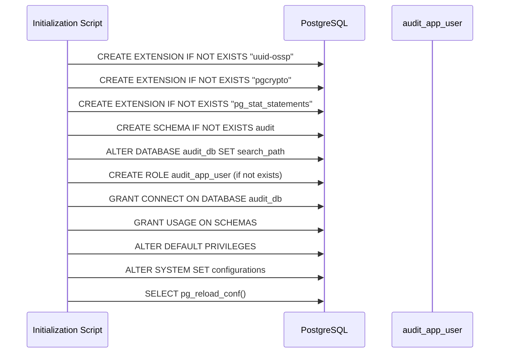
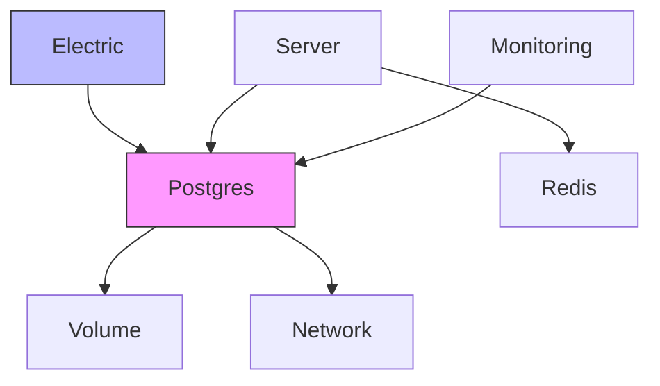
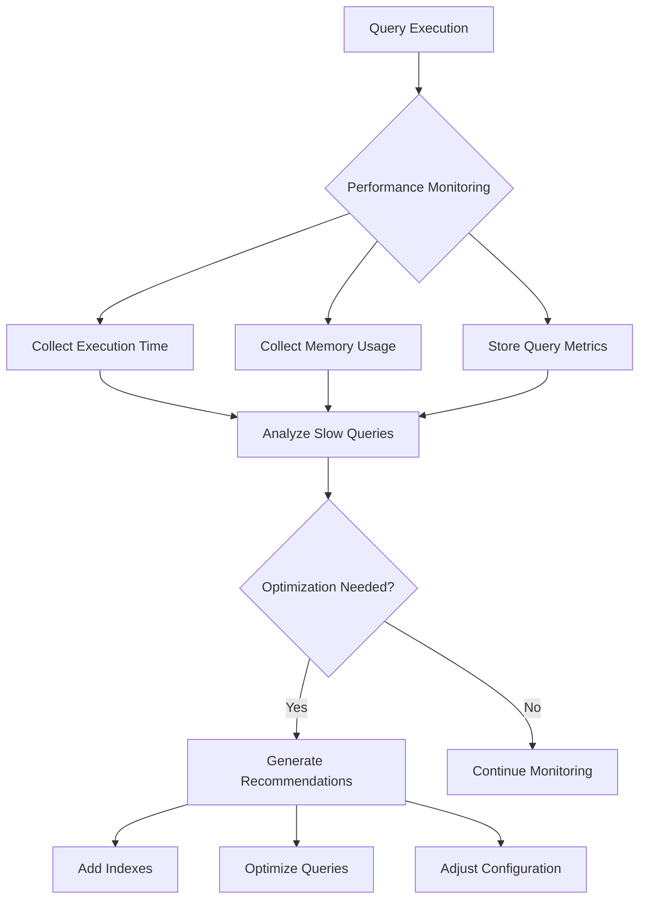

# Pgvector Database Extension Configuration

<cite>
**Referenced Files in This Document**   
- [docker-compose.yml](file://docker/pgvector/docker-compose.yml)
- [postgres.conf](file://docker/pgvector/postgres.conf)
- [01-init-audit-db.sql](file://apps/server/init-scripts/01-init-audit-db.sql)
- [performance-monitoring.ts](file://packages/audit-db/src/db/performance-monitoring.ts)
- [enhanced-client.ts](file://packages/audit-db/src/db/enhanced-client.ts)
</cite>

## Table of Contents
1. [Introduction](#introduction)
2. [Project Structure](#project-structure)
3. [Core Components](#core-components)
4. [Architecture Overview](#architecture-overview)
5. [Detailed Component Analysis](#detailed-component-analysis)
6. [Dependency Analysis](#dependency-analysis)
7. [Performance Considerations](#performance-considerations)
8. [Troubleshooting Guide](#troubleshooting-guide)
9. [Conclusion](#conclusion)

## Introduction
This document provides comprehensive documentation for pgvector integration within the SMEDREC Audit Server ecosystem. It covers the purpose of pgvector, PostgreSQL configuration requirements, vector indexing strategies, query patterns, performance considerations, and migration guidance. The pgvector extension enables efficient storage and querying of vector embeddings in PostgreSQL, facilitating advanced similarity search capabilities for audit data analysis.

## Project Structure
The pgvector configuration is organized within a dedicated Docker environment that integrates with the main application stack. The structure includes configuration files for PostgreSQL with pgvector support and initialization scripts for database setup.



**Diagram sources**
- [docker-compose.yml](file://docker/pgvector/docker-compose.yml)
- [postgres.conf](file://docker/pgvector/postgres.conf)
- [01-init-audit-db.sql](file://apps/server/init-scripts/01-init-audit-db.sql)

**Section sources**
- [docker-compose.yml](file://docker/pgvector/docker-compose.yml)
- [postgres.conf](file://docker/pgvector/postgres.conf)

## Core Components
The core components of the pgvector integration include the Docker configuration for the PostgreSQL container with pgvector extension, the PostgreSQL configuration file that enables necessary extensions, and the database initialization script that sets up the required environment. These components work together to provide a robust vector database capability for the audit system.

**Section sources**
- [docker-compose.yml](file://docker/pgvector/docker-compose.yml)
- [postgres.conf](file://docker/pgvector/postgres.conf)
- [01-init-audit-db.sql](file://apps/server/init-scripts/01-init-audit-db.sql)

## Architecture Overview
The architecture implements pgvector as a PostgreSQL extension within a Docker container, integrated with the Electric SQL replication system. The setup provides vector similarity search capabilities while maintaining compatibility with existing database operations and monitoring tools.



**Diagram sources**
- [docker-compose.yml](file://docker/pgvector/docker-compose.yml)
- [01-init-audit-db.sql](file://apps/server/init-scripts/01-init-audit-db.sql)

## Detailed Component Analysis

### Pgvector Configuration Analysis
The pgvector configuration is implemented through Docker Compose, specifying the pgvector/pgvector:pg17 image with appropriate environment variables and volume mappings. The configuration exposes port 25432 and includes health checks to ensure database availability before dependent services start.

#### Configuration Parameters:
```mermaid
classDiagram
class PgvectorConfig {
+string image : pgvector/pgvector : pg17
+string container_name : pgvector
+string restart : always
+string[] ports : ['25432 : 5432']
+string[] volumes : [pgvector : /var/lib/postgresql/data]
+string command : postgres -c shared_preload_libraries='pg_stat_statements' -c wal_level=logical
}
class HealthCheckConfig {
+string[] test : ['CMD-SHELL', 'pg_isready -U ${POSTGRES_USER} -d ${AUDIT_DB}']
+string interval : 10s
+string timeout : 5s
+int retries : 5
}
class ElectricConfig {
+string image : docker.io/electricsql/electric : latest
+string container_name : electric
+string DATABASE_URL : postgresql : //${POSTGRES_USER} : ${POSTGRES_PASSWORD}@postgres : 5432/${AUDIT_DB}?sslmode=disable
+boolean ELECTRIC_INSECURE : true
}
PgvectorConfig --> HealthCheckConfig : "has"
PgvectorConfig --> ElectricConfig : "depends on"
```

**Diagram sources**
- [docker-compose.yml](file://docker/pgvector/docker-compose.yml)

### PostgreSQL Configuration Analysis
The PostgreSQL configuration file enables essential extensions and settings for optimal pgvector performance. It configures the database to support logical replication and statement statistics collection, which are critical for monitoring and performance optimization.

#### Key Configuration Settings:


**Diagram sources**
- [postgres.conf](file://docker/pgvector/postgres.conf)

### Database Initialization Analysis
The database initialization script creates necessary extensions, schemas, and users for the audit system. It establishes proper permissions and configuration settings to support pgvector operations and ensures the database is properly configured for production use.

#### Initialization Workflow:


**Diagram sources**
- [01-init-audit-db.sql](file://apps/server/init-scripts/01-init-audit-db.sql)

## Dependency Analysis
The pgvector implementation has dependencies on several components within the system architecture. The primary dependency is on PostgreSQL 17 with the pgvector extension, which provides the vector storage and similarity search capabilities. The Electric SQL service depends on the pgvector container and requires it to be healthy before starting. The audit application server depends on both the database and caching layers to provide complete functionality.



**Diagram sources**
- [docker-compose.yml](file://docker/pgvector/docker-compose.yml)
- [01-init-audit-db.sql](file://apps/server/init-scripts/01-init-audit-db.sql)

## Performance Considerations
The system includes comprehensive performance monitoring capabilities that can be leveraged for pgvector operations. The performance monitoring module collects index usage statistics, query execution metrics, and system resource utilization to identify optimization opportunities for vector queries.



**Diagram sources**
- [performance-monitoring.ts](file://packages/audit-db/src/db/performance-monitoring.ts)
- [enhanced-client.ts](file://packages/audit-db/src/db/enhanced-client.ts)

## Troubleshooting Guide
When troubleshooting pgvector integration issues, check the following common problem areas:

1. **Container Health**: Verify the pgvector container is running and passing health checks
2. **Extension Loading**: Ensure pgvector extension is properly loaded in PostgreSQL
3. **Network Configuration**: Confirm network settings allow communication between services
4. **Resource Limits**: Check memory and CPU allocation for the database container
5. **Index Performance**: Monitor vector index usage and query performance

**Section sources**
- [docker-compose.yml](file://docker/pgvector/docker-compose.yml)
- [postgres.conf](file://docker/pgvector/postgres.conf)
- [01-init-audit-db.sql](file://apps/server/init-scripts/01-init-audit-db.sql)

## Conclusion
The pgvector integration provides powerful vector database capabilities for the SMEDREC Audit Server, enabling advanced similarity search and analysis of audit data. The configuration is robust, with proper Docker setup, PostgreSQL configuration, and initialization scripts. The system is designed with performance monitoring and optimization in mind, ensuring efficient operation of vector queries. Future enhancements could include specialized vector indexing strategies and optimized query patterns for specific use cases.