# Plugin Architecture

<cite>
**Referenced Files in This Document**   
- [PLUGIN_ARCHITECTURE.md](file://packages/audit-client/docs/PLUGIN_ARCHITECTURE.md)
- [plugin-usage.ts](file://packages/audit-client/src/examples/plugin-usage.ts)
- [plugins.ts](file://packages/audit-client/src/infrastructure/plugins.ts)
- [built-in.ts](file://packages/audit-client/src/infrastructure/plugins/built-in.ts)
</cite>

## Table of Contents
1. [Introduction](#introduction)
2. [Core Concepts](#core-concepts)
3. [Built-in Plugins](#built-in-plugins)
4. [Creating Custom Plugins](#creating-custom-plugins)
5. [Plugin Configuration](#plugin-configuration)
6. [Plugin Management](#plugin-management)
7. [Integration Patterns](#integration-patterns)
8. [Performance and Monitoring](#performance-and-monitoring)
9. [Best Practices](#best-practices)
10. [Troubleshooting Guide](#troubleshooting-guide)

## Introduction
The plugin architecture system provides a flexible and extensible framework for enhancing the functionality of the Audit Client Library. This document details the plugin system's design, implementation, and usage patterns for middleware, storage, and authentication plugins. The system enables developers to customize and extend client behavior through a well-defined interface and registration mechanism.

**Section sources**
- [PLUGIN_ARCHITECTURE.md](file://packages/audit-client/docs/PLUGIN_ARCHITECTURE.md#L1-L50)

## Core Concepts

### Plugin Interface
All plugins must implement the base `Plugin` interface which defines essential properties and lifecycle methods. The interface includes metadata (name, version, description), dependency declarations, configuration schema, and lifecycle hooks for initialization and cleanup.

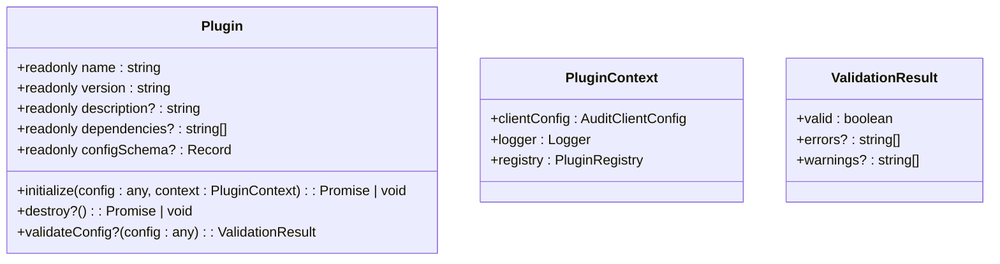

**Diagram sources**
- [plugins.ts](file://packages/audit-client/src/infrastructure/plugins.ts#L20-L80)

### Plugin Types
The system supports three primary plugin types, each serving a specific purpose in the client's operation.

#### Middleware Plugin
Processes HTTP requests and responses through a chain of handlers. Middleware plugins can modify request/response objects, add headers, implement logging, or enforce rate limiting.

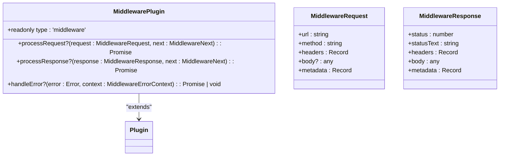

**Diagram sources**
- [plugins.ts](file://packages/audit-client/src/infrastructure/plugins.ts#L100-L180)

#### Storage Plugin
Enables custom cache storage backends, allowing integration with various storage systems like Redis, IndexedDB, or file system storage.

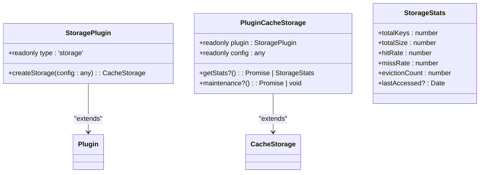

**Diagram sources**
- [plugins.ts](file://packages/audit-client/src/infrastructure/plugins.ts#L200-L260)

#### Authentication Plugin
Provides custom authentication methods for securing API requests, supporting various authentication schemes including JWT, OAuth2, and custom header-based authentication.

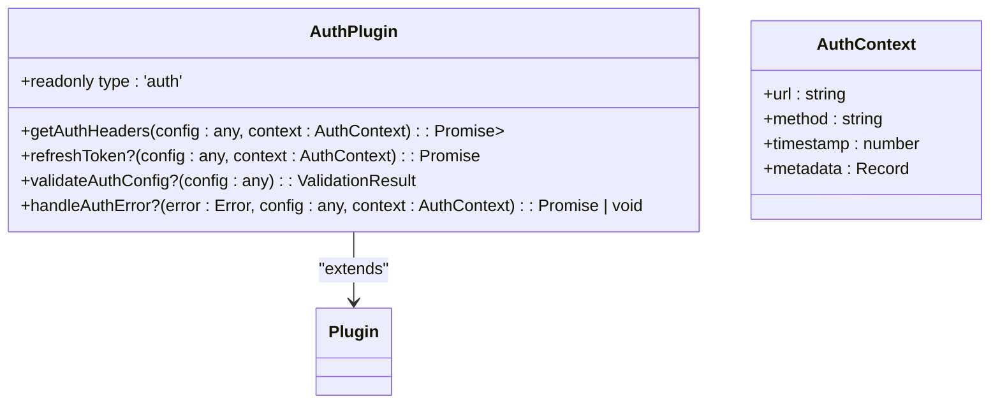

**Diagram sources**
- [plugins.ts](file://packages/audit-client/src/infrastructure/plugins.ts#L280-L340)

## Built-in Plugins

### Middleware Plugins
The system includes several built-in middleware plugins that address common use cases.

#### Request Logging Plugin
Logs HTTP requests and responses with configurable detail levels, supporting different log levels and selective logging of headers and bodies.

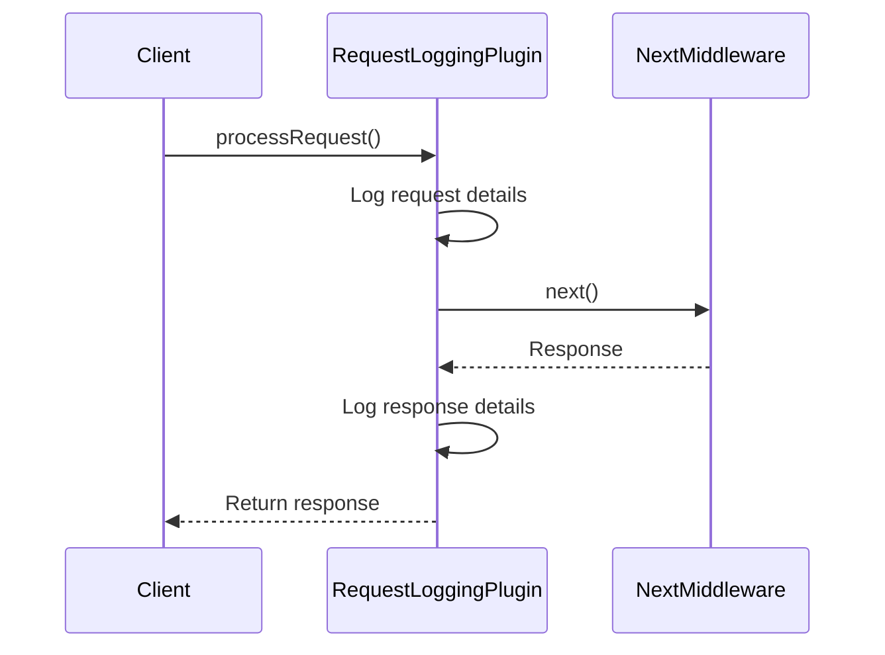

**Diagram sources**
- [built-in.ts](file://packages/audit-client/src/infrastructure/plugins/built-in.ts#L50-L150)

#### Correlation ID Plugin
Adds correlation IDs to requests for distributed tracing, enabling request tracking across system boundaries.

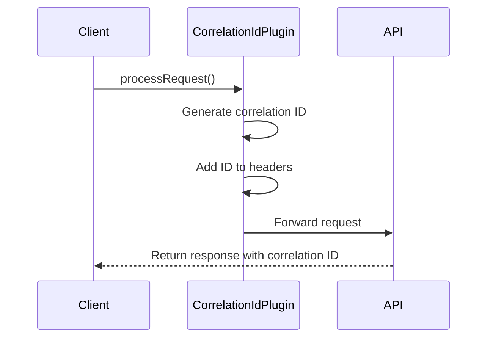

**Diagram sources**
- [built-in.ts](file://packages/audit-client/src/infrastructure/plugins/built-in.ts#L150-L250)

#### Rate Limiting Plugin
Implements client-side rate limiting to prevent excessive API requests within specified time windows.

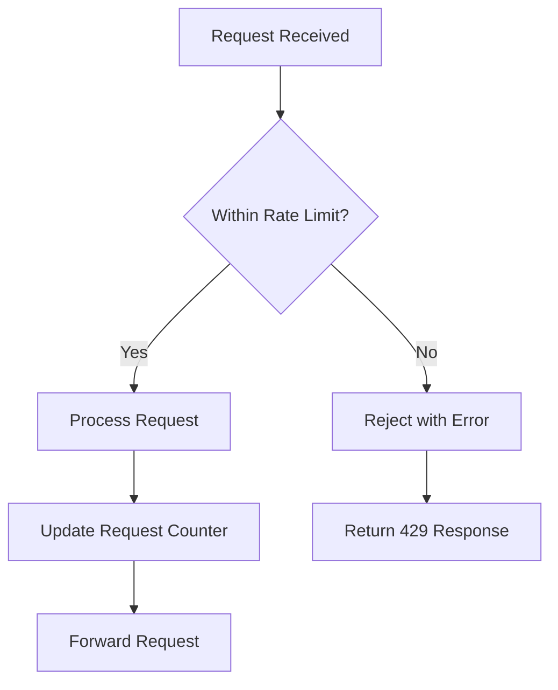

**Diagram sources**
- [built-in.ts](file://packages/audit-client/src/infrastructure/plugins/built-in.ts#L250-L350)

### Storage Plugins
Built-in storage plugins provide ready-to-use caching solutions for different environments.

#### Redis Storage Plugin
Enables Redis-based caching for distributed applications, supporting connection configuration and key prefixing.

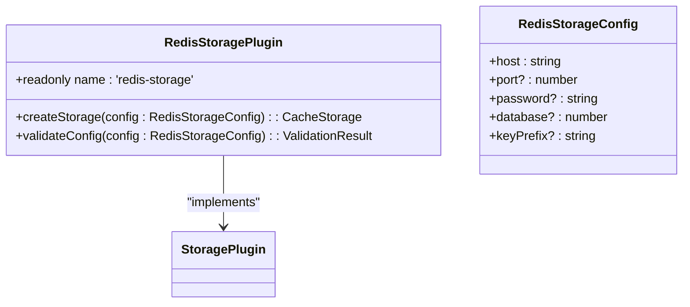

**Diagram sources**
- [built-in.ts](file://packages/audit-client/src/infrastructure/plugins/built-in.ts#L350-L450)

#### IndexedDB Storage Plugin
Provides browser-based caching using IndexedDB, suitable for client-side applications.

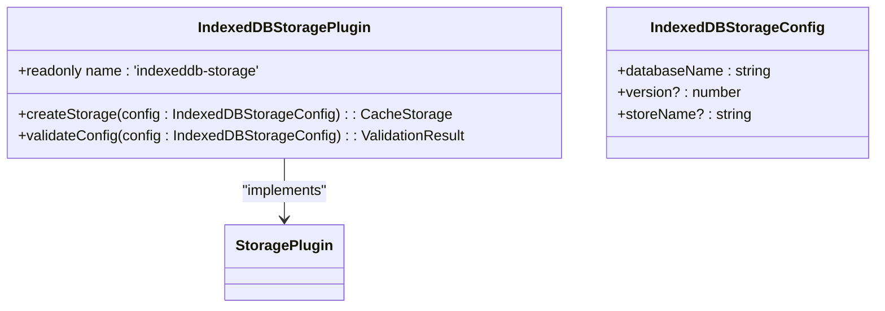

**Diagram sources**
- [built-in.ts](file://packages/audit-client/src/infrastructure/plugins/built-in.ts#L450-L550)

### Authentication Plugins
Built-in authentication plugins support common authentication schemes.

#### JWT Authentication Plugin
Handles JWT-based authentication with automatic token refresh capabilities.

```mermaid
sequenceDiagram
participant Client
JWTAuthPlugin
AuthServer
Client->>JWTAuthPlugin : getAuthHeaders()
JWTAuthPlugin->>JWTAuthPlugin : Check token validity
alt Token valid
JWTAuthPlugin-->>Client : Return Authorization header
else Token expired
JWTAuthPlugin->>AuthServer : refreshToken()
AuthServer-->>JWTAuthPlugin : New token
JWTAuthPlugin-->>Client : Return Authorization header
end
```

**Diagram sources**
- [built-in.ts](file://packages/audit-client/src/infrastructure/plugins/built-in.ts#L550-L650)

#### OAuth2 Authentication Plugin
Implements OAuth2 client credentials flow for secure API access.

```mermaid
sequenceDiagram
participant Client
OAuth2AuthPlugin
AuthServer
Client->>OAuth2AuthPlugin : getAuthHeaders()
OAuth2AuthPlugin->>AuthServer : Request access token
AuthServer-->>OAuth2AuthPlugin : Access token
OAuth2AuthPlugin-->>Client : Return Authorization header
```

**Diagram sources**
- [built-in.ts](file://packages/audit-client/src/infrastructure/plugins/built-in.ts#L650-L750)

## Creating Custom Plugins

### Custom Middleware Plugin
Creating a custom middleware plugin involves implementing the `MiddlewarePlugin` interface and defining request/response processing logic.

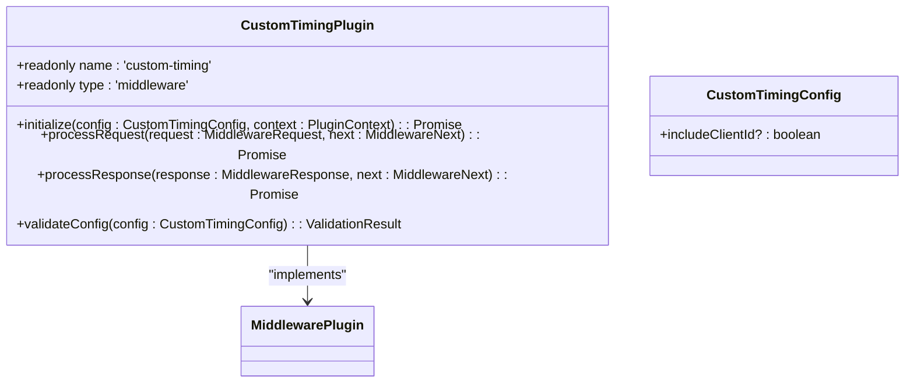

**Diagram sources**
- [plugin-usage.ts](file://packages/audit-client/src/examples/plugin-usage.ts#L150-L250)

### Custom Storage Plugin
Custom storage plugins require implementing the `StoragePlugin` interface and providing a storage instance factory.

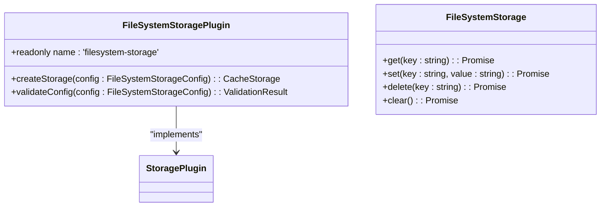

**Diagram sources**
- [plugin-usage.ts](file://packages/audit-client/src/examples/plugin-usage.ts#L350-L450)

### Custom Authentication Plugin
Custom authentication plugins implement the `AuthPlugin` interface to provide unique authentication mechanisms.

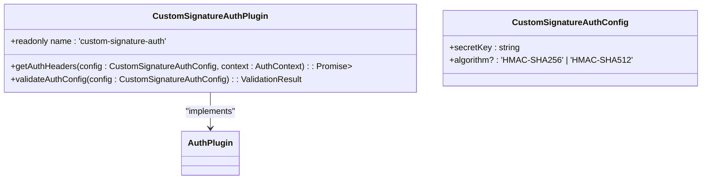

**Diagram sources**
- [plugin-usage.ts](file://packages/audit-client/src/examples/plugin-usage.ts#L450-L550)

## Plugin Configuration

### Configuration Structure
Plugin configuration follows a hierarchical structure that enables fine-grained control over plugin behavior.

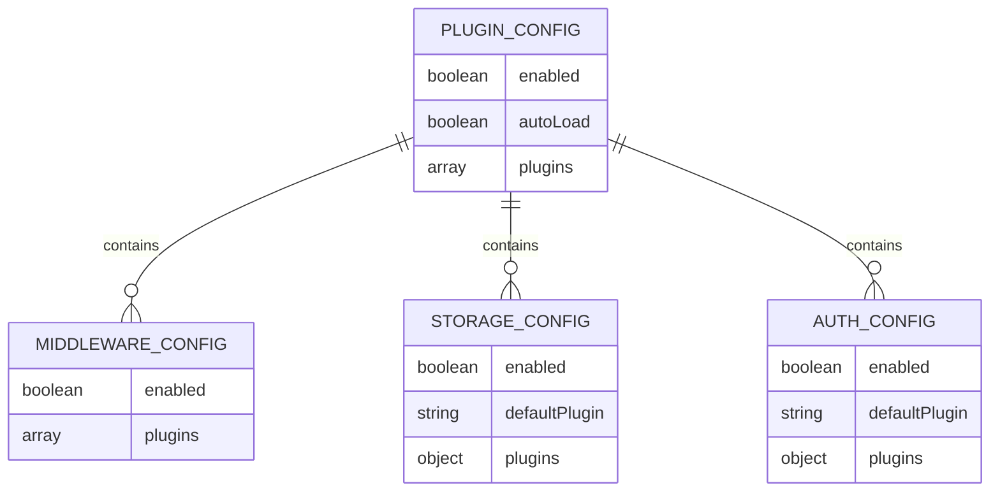

**Diagram sources**
- [PLUGIN_ARCHITECTURE.md](file://packages/audit-client/docs/PLUGIN_ARCHITECTURE.md#L400-L450)

### Environment-based Configuration
The system supports environment-based configuration loading and default configuration profiles.

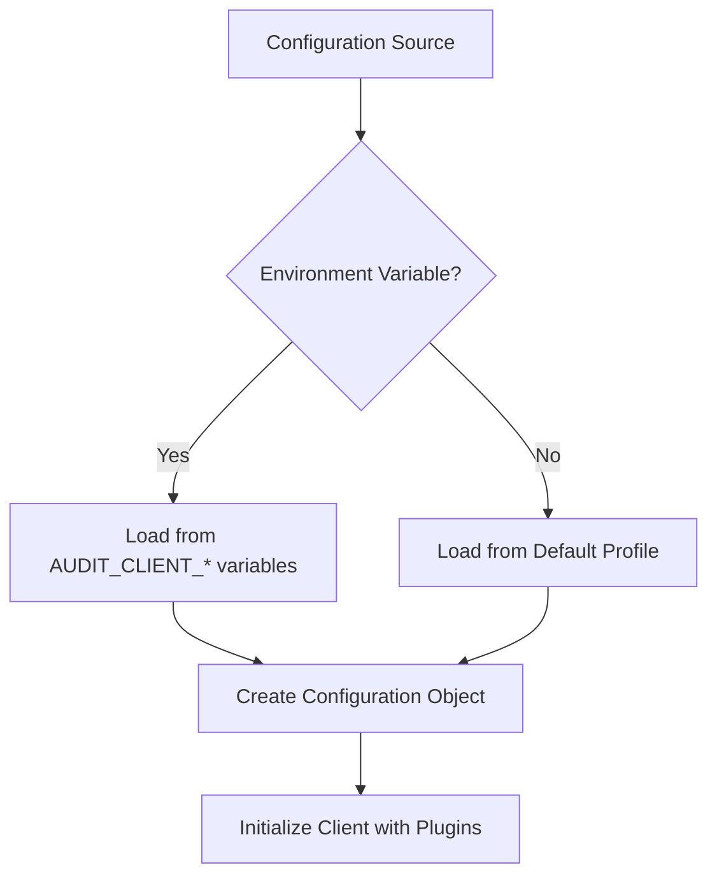

**Diagram sources**
- [PLUGIN_ARCHITECTURE.md](file://packages/audit-client/docs/PLUGIN_ARCHITECTURE.md#L450-L500)

## Plugin Management

### Plugin Registry
The plugin registry manages all registered plugins, handling registration, dependency resolution, and lifecycle management.

```mermaid
classDiagram
class PluginRegistry {
+plugins : Map<string, Plugin>
+middlewareChain : MiddlewarePlugin[]
+storagePlugins : Map<string, StoragePlugin>
+authPlugins : Map<string, AuthPlugin>
+register(plugin : Plugin, config : any) : Promise<void>
+unregister(name : string) : Promise<void>
+getPlugin(name : string) : Plugin | undefined
+getStats() : PluginRegistryStats
}
class PluginRegistryStats {
+totalPlugins : number
+middlewarePlugins : number
+storagePlugins : number
+authPlugins : number
+plugins : Array<{name : string, version : string, type : string, dependencies : string[]}>
}
```

**Diagram sources**
- [plugins.ts](file://packages/audit-client/src/infrastructure/plugins.ts#L350-L500)

### Plugin Manager
The plugin manager orchestrates plugin operations, executing middleware chains and coordinating plugin interactions.

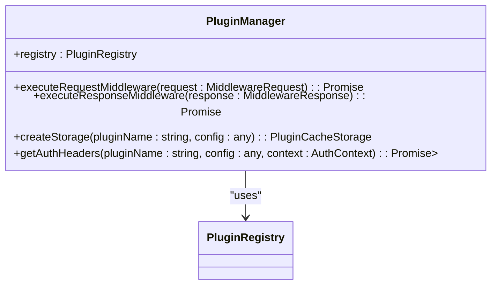

**Diagram sources**
- [plugins.ts](file://packages/audit-client/src/infrastructure/plugins.ts#L520-L600)

## Integration Patterns

### Express.js Integration
The plugin system can be integrated with Express.js applications to provide enhanced logging, caching, and authentication.

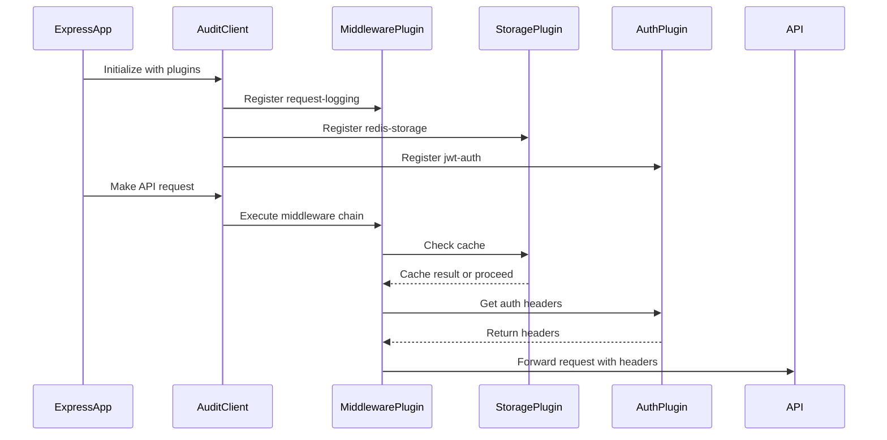

**Section sources**
- [plugin-usage.ts](file://packages/audit-client/src/examples/plugin-usage.ts#L50-L100)

### Next.js Integration
Next.js applications can leverage the plugin architecture for server-side and client-side functionality.

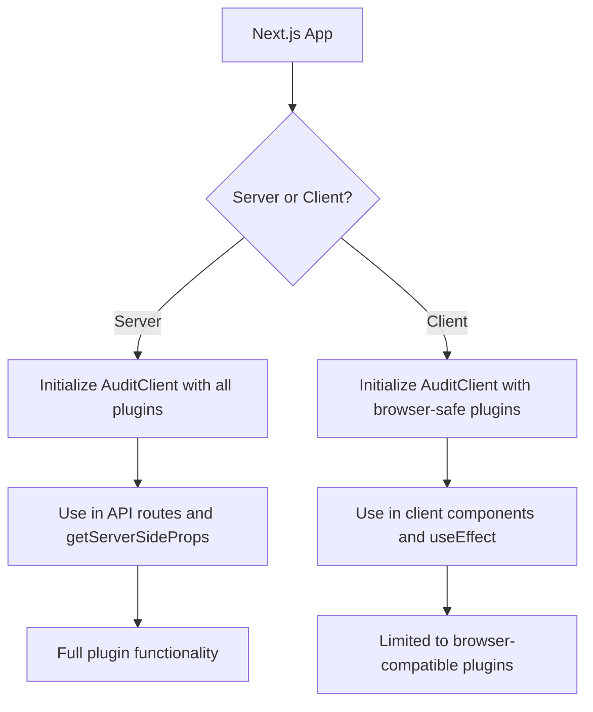

**Section sources**
- [plugin-usage.ts](file://packages/audit-client/src/examples/plugin-usage.ts#L50-L100)

## Performance and Monitoring

### Plugin Performance Tracking
The system includes performance tracking capabilities to monitor plugin execution metrics.

```mermaid
classDiagram
class PluginPerformanceTracker {
+metrics : Map<string, PluginPerformanceMetrics>
+trackExecution(pluginName : string, operation : () => Promise<T> | T) : Promise<T>
+getMetrics(pluginName : string) : PluginPerformanceMetrics
+getAllMetrics() : Map<string, PluginPerformanceMetrics>
}
class PluginPerformanceMetrics {
+pluginName : string
+executionCount : number
+totalExecutionTime : number
+averageExecutionTime : number
+minExecutionTime : number
+maxExecutionTime : number
+errorCount : number
+lastExecuted? : Date
}
```

**Diagram sources**
- [plugins.ts](file://packages/audit-client/src/infrastructure/plugins.ts#L620-L650)

### Dependency Resolution
The system handles plugin dependencies with cycle detection and proper loading order.

```mermaid
flowchart TD
A[Plugin A] --> B[Plugin B]
B --> C[Plugin C]
C --> D[Plugin D]
D --> |Dependency| A
A --> |Circular Dependency| Error[Throw Circular Dependency Error]
E[Plugin X] --> F[Plugin Y]
F --> G[Plugin Z]
G --> H[No circular dependencies]
H --> I[Load in dependency order]
```

**Diagram sources**
- [plugins.ts](file://packages/audit-client/src/infrastructure/plugins/utils.ts#L288-L340)

## Best Practices

### Plugin Development Guidelines
Follow these best practices when developing custom plugins to ensure reliability and maintainability.

```mermaid
flowchart TD
A[Start Plugin Development] --> B[Implement Plugin Interface]
B --> C[Validate Configuration]
C --> D[Handle Errors Gracefully]
D --> E[Document Dependencies]
E --> F[Use Semantic Versioning]
F --> G[Test Thoroughly]
G --> H[Optimize Performance]
H --> I[Secure Sensitive Data]
I --> J[Complete Plugin]
```

**Section sources**
- [PLUGIN_ARCHITECTURE.md](file://packages/audit-client/docs/PLUGIN_ARCHITECTURE.md#L550-L600)

### Performance Considerations
Optimize plugin performance by following these guidelines.

```mermaid
flowchart TD
A[Performance Considerations] --> B[Minimize Middleware Overhead]
A --> C[Cache Expensive Operations]
A --> D[Use Async Operations]
A --> E[Monitor Performance Metrics]
A --> F[Avoid Blocking Main Thread]
A --> G[Optimize Configuration Validation]
A --> H[Implement Proper Cleanup]
```

**Section sources**
- [PLUGIN_ARCHITECTURE.md](file://packages/audit-client/docs/PLUGIN_ARCHITECTURE.md#L600-L620)

## Troubleshooting Guide

### Common Issues and Solutions
Address common plugin-related issues with these troubleshooting steps.

```mermaid
flowchart TD
A[Plugin Not Loading] --> B[Check Registration]
B --> C[Verify Dependencies]
C --> D[Validate Configuration]
E[Configuration Errors] --> F[Check Schema]
F --> G[Validate Required Fields]
G --> H[Test with Minimal Config]
I[Performance Issues] --> J[Enable Debug Logging]
J --> K[Check Performance Metrics]
K --> L[Identify Bottlenecks]
M[Memory Leaks] --> N[Implement Cleanup]
N --> O[Check for Circular References]
O --> P[Monitor Resource Usage]
```

**Diagram sources**
- [PLUGIN_ARCHITECTURE.md](file://packages/audit-client/docs/PLUGIN_ARCHITECTURE.md#L600-L620)

**Section sources**
- [PLUGIN_ARCHITECTURE.md](file://packages/audit-client/docs/PLUGIN_ARCHITECTURE.md#L600-L630)
- [plugin-usage.ts](file://packages/audit-client/src/examples/plugin-usage.ts#L500-L550)