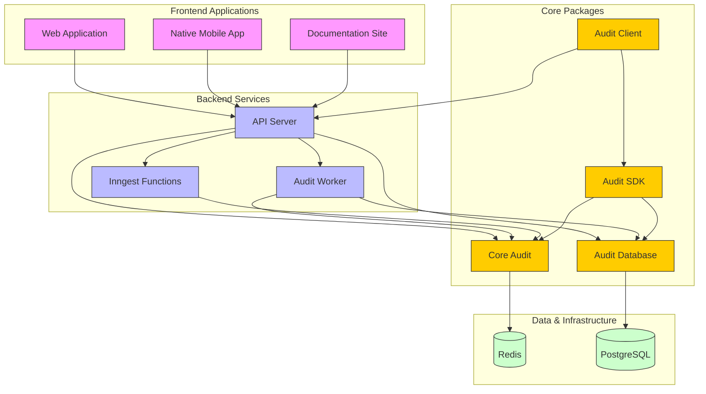
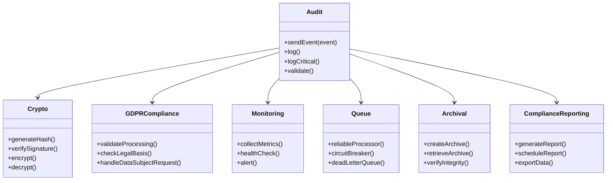
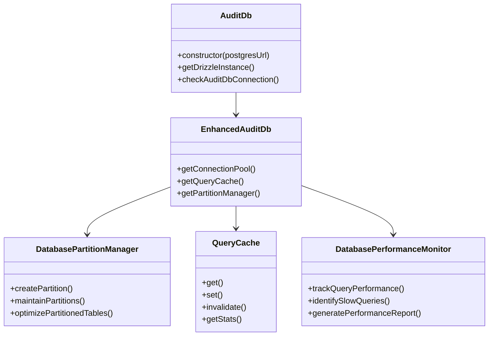
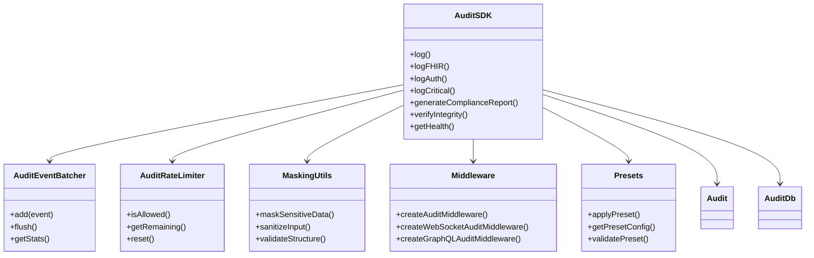
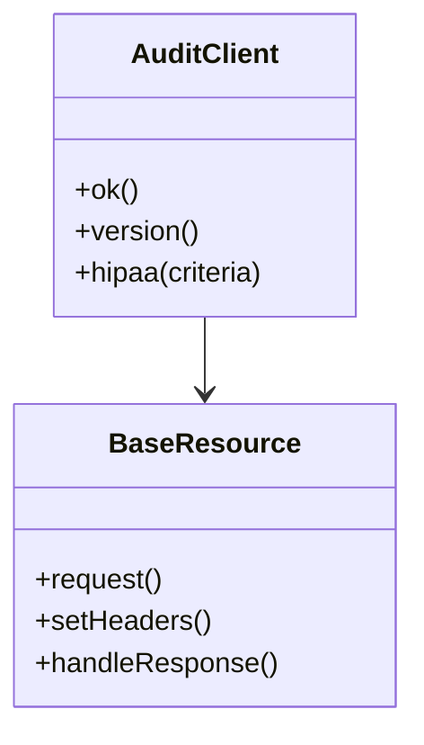
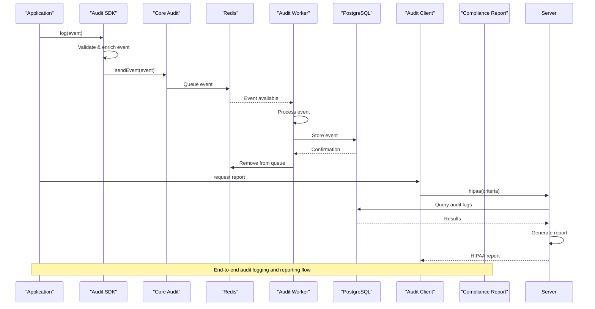

# Project Overview

<cite>
**Referenced Files in This Document**   
- [README.md](file://README.md)
- [apps/server/src/index.ts](file://apps/server/src/index.ts)
- [packages/audit/src/index.ts](file://packages/audit/src/index.ts)
- [packages/audit-db/src/index.ts](file://packages/audit-db/src/index.ts)
- [packages/audit-sdk/src/index.ts](file://packages/audit-sdk/src/index.ts)
- [packages/audit-client/src/index.ts](file://packages/audit-client/src/index.ts)
- [apps/docs/src/content/docs/audit/audit.md](file://apps/docs/src/content/docs/audit/audit.md)
- [apps/docs/src/content/docs/audit/audit-db.md](file://apps/docs/src/content/docs/audit/audit-db.md)
- [apps/docs/src/content/docs/audit/audit-sdk.md](file://apps/docs/src/content/docs/audit/audit-sdk.md)
- [packages/audit-client/src/client.ts](file://packages/audit-client/src/client.ts)
</cite>

## Table of Contents
1. [Project Overview](#project-overview)
2. [System Architecture](#system-architecture)
3. [Core Components](#core-components)
4. [Data Flow and Processing](#data-flow-and-processing)
5. [Deployment and Integration](#deployment-and-integration)

## System Architecture

The smart-logs project is a comprehensive audit and compliance logging system designed for regulatory adherence (GDPR, HIPAA), security auditing, and operational observability in healthcare applications. The system follows a multi-service architecture orchestrated via PNPM workspace, with distinct components for web, native, server, worker, and Inngest function execution.

**Diagram sources**
- [README.md](file://README.md)
- [apps/server/src/index.ts](file://apps/server/src/index.ts)

**Section sources**
- [README.md](file://README.md)

## Core Components

### Core Audit Package (`@repo/audit`)

The `@repo/audit` package provides the foundational audit logging functionality for the SMEDREC platform. It handles the generation, validation, and queuing of audit events with built-in security and compliance features.

**Key Features:**
- **Security**: Cryptographic integrity verification with SHA-256 hashing and HMAC signatures
- **Compliance**: Built-in HIPAA and GDPR compliance validation and data handling
- **Reliability**: Guaranteed delivery with circuit breaker patterns and dead letter queues
- **Performance**: Efficient queuing with BullMQ and Redis for high-throughput scenarios
- **Healthcare Focus**: Specialized support for FHIR resources and PHI data handling

The package exports a comprehensive set of modules for different aspects of audit logging:

**Diagram sources**
- [packages/audit/src/index.ts](file://packages/audit/src/index.ts)
- [apps/docs/src/content/docs/audit/audit.md](file://apps/docs/src/content/docs/audit/audit.md)

**Section sources**
- [packages/audit/src/index.ts](file://packages/audit/src/index.ts)
- [apps/docs/src/content/docs/audit/audit.md](file://apps/docs/src/content/docs/audit/audit.md)

### Audit Database Package (`@repo/audit-db`)

The `@repo/audit-db` package provides a standardized interface for interacting with the PostgreSQL database designated for storing audit logs. It simplifies the initialization of a Drizzle ORM client pre-configured with the audit log schema.

**Key Features:**
- **Centralized Audit Logging**: Single, consistent interface for database interactions
- **Reusable Database Client**: Multiple applications can connect without duplicating logic
- **Schema Management**: Drizzle Kit for robust schema definition and migration
- **Performance Optimization**: Connection pooling, query caching, and partitioning

The package exports the `AuditDb` class as its primary interface:

**Diagram sources**
- [packages/audit-db/src/index.ts](file://packages/audit-db/src/index.ts)
- [apps/docs/src/content/docs/audit/audit-db.md](file://apps/docs/src/content/docs/audit/audit-db.md)

**Section sources**
- [packages/audit-db/src/index.ts](file://packages/audit-db/src/index.ts)
- [apps/docs/src/content/docs/audit/audit-db.md](file://apps/docs/src/content/docs/audit/audit-db.md)

### Audit SDK (`@repo/audit-sdk`)

The `@repo/audit-sdk` package provides a high-level interface for audit logging, building on top of the core audit and audit-db packages. It offers enhanced features, compliance validation, and developer-friendly APIs.

**Key Features:**
- **Security First**: Built-in cryptographic hashing and signatures
- **Healthcare Ready**: FHIR-specific audit events and PHI handling
- **Compliance Built-in**: HIPAA and GDPR compliance validation
- **High Performance**: Batching, rate limiting, and guaranteed delivery
- **Easy Integration**: Express, WebSocket, and GraphQL middleware
- **Rich Reporting**: Compliance reports and integrity verification

The SDK's architecture is designed to simplify audit logging while providing comprehensive functionality:

**Diagram sources**
- [packages/audit-sdk/src/index.ts](file://packages/audit-sdk/src/index.ts)
- [apps/docs/src/content/docs/audit/audit-sdk.md](file://apps/docs/src/content/docs/audit/audit-sdk.md)

**Section sources**
- [packages/audit-sdk/src/index.ts](file://packages/audit-sdk/src/index.ts)
- [apps/docs/src/content/docs/audit/audit-sdk.md](file://apps/docs/src/content/docs/audit/audit-sdk.md)

### Audit Client (`@repo/audit-client`)

The `@repo/audit-client` package provides a lightweight client for interacting with the audit API. It serves as a simple interface for applications that need to consume audit services without the full SDK overhead.

**Key Features:**
- **API Connectivity**: Simple methods to connect to the audit API
- **Health Checking**: Methods to verify API availability
- **Report Generation**: Client-side access to compliance reporting
- **Version Management**: API version checking

**Diagram sources**
- [packages/audit-client/src/client.ts](file://packages/audit-client/src/client.ts)
- [packages/audit-client/src/index.ts](file://packages/audit-client/src/index.ts)

**Section sources**
- [packages/audit-client/src/client.ts](file://packages/audit-client/src/client.ts)
- [packages/audit-client/src/index.ts](file://packages/audit-client/src/index.ts)

## Data Flow and Processing

The smart-logs system follows a well-defined data flow pattern from event generation to storage and reporting. The process begins when an application generates an audit event, which is then processed through multiple stages before being stored and made available for compliance reporting.

**Diagram sources**
- [apps/server/src/index.ts](file://apps/server/src/index.ts)
- [packages/audit/src/index.ts](file://packages/audit/src/index.ts)
- [packages/audit-db/src/index.ts](file://packages/audit-db/src/index.ts)

**Section sources**
- [apps/server/src/index.ts](file://apps/server/src/index.ts)

## Deployment and Integration

The smart-logs system supports multiple deployment options and integration patterns, making it adaptable to various infrastructure requirements.

### Deployment Options

**Docker Deployment:**
The system includes Docker configuration files for containerized deployment:
- `apps/server/Dockerfile` - Server application container
- `apps/server/docker-compose.yml` - Development environment
- `apps/server/docker-compose.prod.yml` - Production environment
- `apps/server/k8s/` - Kubernetes configuration files

**Kubernetes Deployment:**
For production environments, the system provides Kubernetes manifests:
- `deployment.yaml` - Application deployment
- `service.yaml` - Service configuration
- `ingress.yaml` - Ingress rules
- `configmap.yaml` - Configuration
- `secret.yaml` - Secrets management
- `hpa.yaml` - Horizontal Pod Autoscaler

### Integration Patterns

The system supports multiple integration patterns for different application types:

**API Integration:**
Applications can integrate with the audit system through REST, tRPC, or GraphQL APIs exposed by the server component.

**SDK Integration:**
Applications can use the `@repo/audit-sdk` for a higher-level, feature-rich integration with built-in compliance validation and error handling.

**Direct Package Integration:**
Applications can directly use the core packages (`@repo/audit`, `@repo/audit-db`) for maximum control over the audit logging process.

**Client Integration:**
Applications can use the `@repo/audit-client` for simple API consumption and reporting without the overhead of the full SDK.

The integration architecture allows for flexible deployment patterns while maintaining a consistent audit logging interface across all applications.

**Section sources**
- [README.md](file://README.md)
- [apps/server/Dockerfile](file://apps/server/Dockerfile)
- [apps/server/docker-compose.yml](file://apps/server/docker-compose.yml)
- [apps/server/k8s/deployment.yaml](file://apps/server/k8s/deployment.yaml)