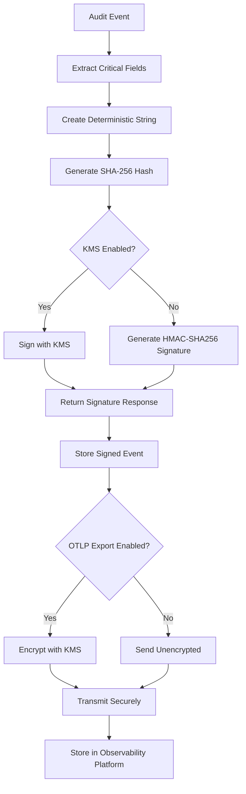
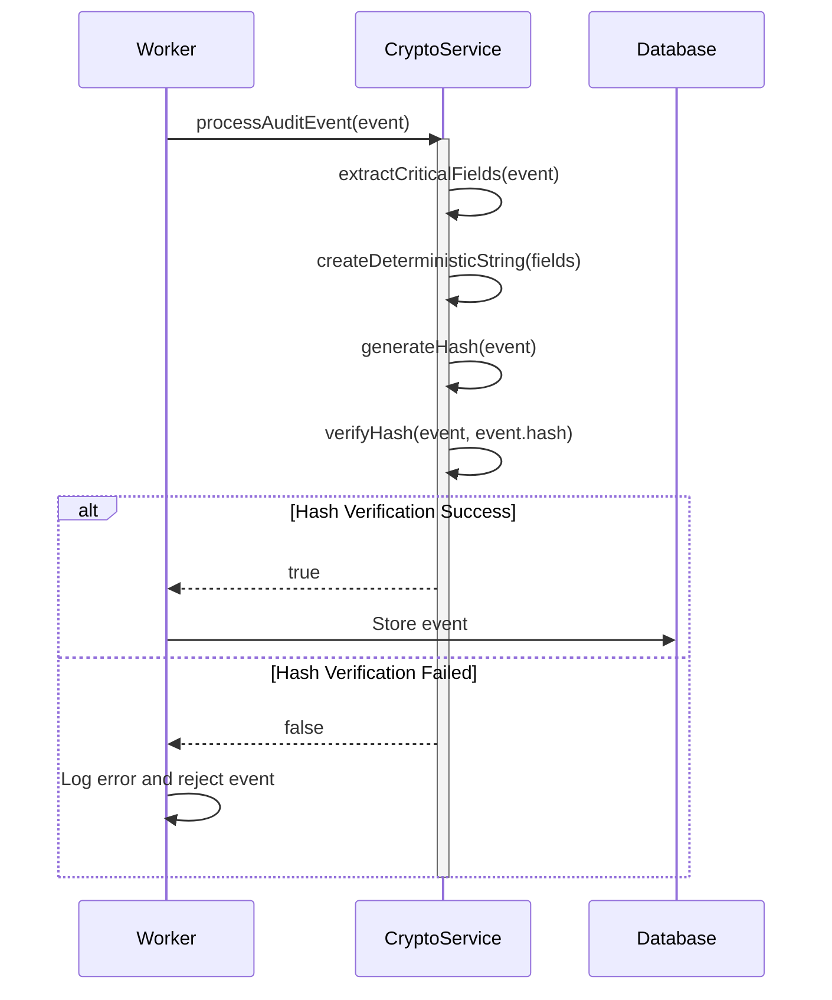
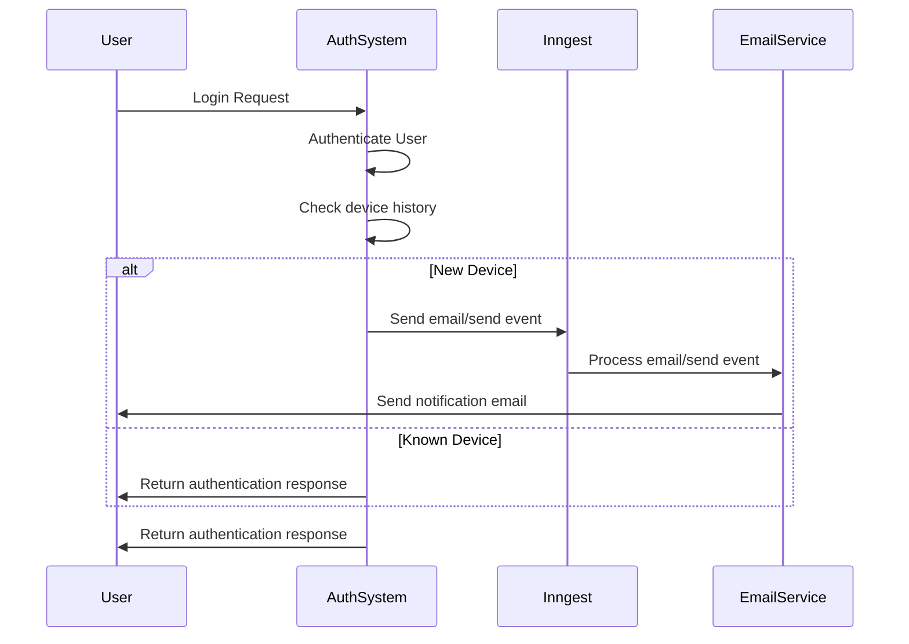
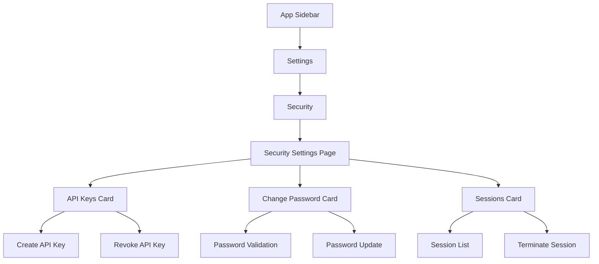

# Security and Compliance

<cite>
**Referenced Files in This Document**   
- [crypto.ts](file://packages\audit\src\crypto.ts) - *Updated in recent commit*
- [index.ts](file://apps\worker\src\index.ts) - *Updated in recent commit*
- [permissions.ts](file://packages\auth\src\permissions.ts) - *Updated in recent commit*
- [compliance-features.md](file://apps\docs\src\content\docs\audit\compliance-features.md) - *Updated in recent commit*
- [best-practices.md](file://packages\audit-db\docs\guides\best-practices.md) - *Added Redis caching for authorization*
- [auth.ts](file://packages\auth\src\auth.ts) - *Added new device login notification feature*
- [tracer.ts](file://packages\audit\src\observability\tracer.ts) - *Enhanced OTLP exporter with KMS encryption*
- [otpl.ts](file://packages\logs\src\otpl.ts) - *Added structured logging with OTLP support*
- [types.ts](file://packages\infisical-kms\src\types.ts) - *Updated KMS types for enhanced security*
- [app-sidebar.tsx](file://apps\app\src\components\app-sidebar.tsx) - *Updated in recent commit*
- [security.tsx](file://apps\app\src\routes\_authenticated\settings\security.tsx) - *Added API keys management*
</cite>

## Update Summary
**Changes Made**   
- Added new section on Security Settings Page to reflect updated navigation and functionality
- Updated New Device Login Notifications section with additional context on security settings
- Enhanced Compliance Requirements section with reference to security configuration interface
- Added sources for new and updated sections
- Updated Table of Contents to include new Security Settings Page section

## Table of Contents
1. [Introduction](#introduction)
2. [Cryptographic Protocols](#cryptographic-protocols)
3. [Cryptographic Verification in Event Processing](#cryptographic-verification-in-event-processing)
4. [KMS Integration](#kms-integration)
5. [Compliance Requirements](#compliance-requirements)
6. [Practical Examples](#practical-examples)
7. [Troubleshooting Guide](#troubleshooting-guide)
8. [New Device Login Notifications](#new-device-login-notifications)
9. [Security Settings Page](#security-settings-page)

## Introduction
The Security and Compliance framework provides robust mechanisms for ensuring data integrity, confidentiality, and regulatory compliance within the audit system. This documentation details the cryptographic protocols, KMS integration, and compliance requirements that form the foundation of the system's security posture. The framework supports HIPAA and GDPR compliance reporting, cryptographic integrity verification, and secure key management through external KMS integration.

## Cryptographic Protocols
The framework implements SHA-256 hashing and HMAC-SHA256 signatures to ensure audit event integrity. Each audit event is processed through a deterministic hashing algorithm that extracts critical fields in a consistent order, preventing tampering and ensuring data consistency across the system.

The cryptographic service generates SHA-256 hashes of critical audit event fields including timestamp, action, status, principal ID, organization ID, and target resource information. These hashes are used for integrity verification, ensuring that any modification to the event data can be detected. Additionally, HMAC-SHA256 signatures provide an extra layer of security by authenticating events with a secret key.

For environments requiring higher security, the framework supports integration with external Key Management Systems (KMS) for cryptographic operations, allowing organizations to leverage centralized key management and hardware security modules. The integration now includes KMS-based encryption for OTLP telemetry data, ensuring end-to-end security for observability data.



**Section sources**   
- [crypto.ts](file://packages\audit\src\crypto.ts#L0-L383)
- [types.ts](file://packages\infisical-kms\src\types.ts#L0-L56)

## Cryptographic Verification in Event Processing
The framework now integrates cryptographic verification during event processing to ensure data integrity throughout the audit workflow. When an audit event is processed, the system verifies the event's hash before storing it in the database, providing an additional layer of security against tampering.

The verification process occurs in the worker service, where each incoming audit event is checked against its cryptographic hash. If the hash verification fails, the event is rejected and an error is logged. This verification step is critical for maintaining the integrity of the audit trail and preventing malicious modifications to audit data.

The CryptoService is initialized with security configuration and used to verify event hashes during processing. The service extracts critical fields from the event, generates a deterministic string representation, and computes the SHA-256 hash for comparison with the expected hash value.



**Section sources**
- [index.ts](file://apps\worker\src\index.ts#L450-L480)
- [crypto.ts](file://packages\audit\src\crypto.ts#L150-L280)

## KMS Integration
The framework integrates with Infisical KMS for secure cryptographic operations, providing encryption, decryption, signing, and verification capabilities. The integration follows a standardized client pattern with built-in retry mechanisms and error handling.

The KMS client configuration requires the base URL, encryption key ID, signing key ID, and access token. These credentials enable the system to perform cryptographic operations through the KMS API. The client implements exponential backoff with configurable retry parameters, ensuring resilience against transient network failures.

Cryptographic operations are performed through a well-defined interface that abstracts the underlying KMS implementation. The framework supports both local HMAC generation and KMS-based signing, allowing organizations to choose their preferred security model based on their compliance requirements and infrastructure capabilities. The integration has been enhanced to support KMS encryption for OTLP telemetry data, ensuring secure transmission of observability information.

```mermaid
classDiagram
class InfisicalKmsClient {
+string baseUrl
+string encryptionKey
+string signingKey
+string accessToken
+encrypt(plaintext) Promise~EncryptResponse~
+decrypt(ciphertext) Promise~DecryptResponse~
+sign(data) Promise~SignResponse~
+verify(data, signature) Promise~VerifyResponse~
}
class BaseResource {
+InfisicalKmsClientConfig config
+request(path, options) Promise~T~
}
class KmsError {
+string message
+constructor(message)
}
class KmsApiError {
+number status
+string statusText
+constructor(message, status, statusText)
}
InfisicalKmsClient --> BaseResource : "extends"
KmsApiError --> KmsError : "extends"
InfisicalKmsClient ..> KmsApiError : "throws"
InfisicalKmsClient ..> KmsError : "throws"
note right of InfisicalKmsClient
Supports encryption for :
- Audit event signing
- Log data protection
- OTLP telemetry transmission
- Configuration storage
end note
```

**Diagram sources**
- [client.ts](file://packages\infisical-kms\src\client.ts#L0-L146)
- [base.ts](file://packages\infisical-kms\src\base.ts#L0-L99)

**Section sources**
- [client.ts](file://packages\infisical-kms\src\client.ts#L0-L146)
- [base.ts](file://packages\infisical-kms\src\base.ts#L0-L99)
- [types.ts](file://packages\infisical-kms\src\types.ts#L0-L56)
- [tracer.ts](file://packages\audit\src\observability\tracer.ts#L0-L677)
- [otpl.ts](file://packages\logs\src\otpl.ts#L0-L166)

## Compliance Requirements
The framework supports comprehensive compliance reporting for HIPAA and GDPR regulations. Compliance reports include detailed event summaries, integrity verification results, and risk assessments tailored to specific regulatory requirements.

HIPAA compliance reports track PHI (Protected Health Information) access and modification events, unauthorized access attempts, emergency access usage, and minimum necessary violations. The reports include risk assessments that identify high-risk events and suspicious patterns, providing actionable recommendations for improving security posture.

GDPR compliance reports focus on data processing activities, consent management, and data subject rights. The framework tracks data classification levels (PUBLIC, INTERNAL, CONFIDENTIAL, PHI) and ensures appropriate handling of personal data according to regulatory requirements.

The framework has been enhanced with organization role management using Redis caching and PostgreSQL persistence. This enables fine-grained access control and ensures that compliance requirements are met through proper authorization mechanisms. The role-based access control system supports inheritance and permission caching for improved performance.

### Redis-Based Authorization Caching
The authorization system implements a multi-layer caching strategy using Redis to optimize permission checks and role management. Permission evaluations are cached for 5 minutes with automatic invalidation on role changes, significantly reducing database load and improving response times.

The caching architecture follows a write-through pattern where role definitions are stored in both Redis and PostgreSQL. When a user's permissions are checked, the system first queries the Redis cache using a composite key of user ID, resource, and action. If the permission is not found in cache, the system evaluates the role hierarchy and stores the result in Redis for subsequent requests.

Cache invalidation occurs automatically when roles are modified, added, or removed. The system also provides methods to clear individual user caches or the entire permission cache, ensuring consistency between cached and persistent data.

```mermaid
classDiagram
class AuthorizationService {
+string roleCachePrefix
+string permissionCachePrefix
+number retentionPeriod
+hasPermission(session, resource, action, context)
+getUserPermissions(session)
+canAccessOrganization(session, organizationId)
+getOrganizationRole(session, organizationId)
+clearUserCache(userId)
+clearCache()
+addRole(role)
+removeRole(roleName)
+getRole(roleName)
}
class Redis {
+set(key, value)
+get(key)
+exists(key)
+del(key)
+keys(pattern)
+setex(key, seconds, value)
}
class PostgreSQL {
+insert(table, values)
+delete(table, condition)
+query(table, condition)
+update(table, values, condition)
}
AuthorizationService --> Redis : "Uses for caching"
AuthorizationService --> PostgreSQL : "Uses for persistence"
Redis ..> AuthorizationService : "Returns cached data"
PostgreSQL ..> AuthorizationService : "Returns persistent data"
note right of AuthorizationService
Caches permissions for 5 minutes
Supports role inheritance
Automatic cache invalidation
Write-through caching strategy
end note
```

**Diagram sources**
- [permissions.ts](file://packages\auth\src\permissions.ts#L0-L691) - *Implementation of caching strategy*
- [best-practices.md](file://packages\audit-db\docs\guides\best-practices.md#L0-L676) - *Caching strategy documentation*

**Section sources**
- [compliance-reporting.ts](file://packages\audit\src\report\compliance-reporting.ts#L99-L156)
- [compliance-api.ts](file://apps\server\src\routes\compliance-api.ts#L201-L241)
- [types.ts](file://apps\server\src\lib\graphql\types.ts#L104-L171)
- [permissions.ts](file://packages\auth\src\permissions.ts#L0-L691)
- [best-practices.md](file://packages\audit-db\docs\guides\best-practices.md#L0-L676)

## Practical Examples
The Security and Compliance framework provides practical implementations for common security scenarios. Organizations can configure the system to meet their specific regulatory requirements and security policies.

For cryptographic operations, the framework automatically detects whether KMS integration is enabled and routes signing operations accordingly. When KMS is enabled, the system uses the external KMS for signing and verification. When KMS is disabled, the system falls back to local HMAC generation using the configured encryption key.

Compliance reporting is accessible through both REST and GraphQL APIs, allowing integration with various client applications. The system supports generating HIPAA and GDPR reports with customizable criteria, including date ranges, organization IDs, and event types.

The following example demonstrates how to generate a HIPAA compliance report through the GraphQL API:

```graphql
query {
  complianceReports(
    type: HIPAA
    criteria: {
      startDate: "2023-01-01"
      endDate: "2023-12-31"
      organizationIds: ["org-123"]
    }
  ) {
    id
    generatedAt
    status
    summary {
      totalEvents
      uniquePrincipals
      highRiskEvents
    }
    hipaaSpecific {
      phiAccessEvents
      phiModificationEvents
      unauthorizedAttempts
      emergencyAccess
      breakGlassEvents
      minimumNecessaryViolations
    }
    riskAssessment {
      highRiskEvents {
        timestamp
        principalId
        action
        outcomeDescription
      }
      suspiciousPatterns
      recommendations
    }
  }
}
```

**Section sources**
- [compliance.ts](file://apps\server\src\lib\graphql\resolvers\compliance.ts#L0-L56)
- [compliance-api.ts](file://apps\server\src\routes\compliance-api.ts#L201-L241)

## Troubleshooting Guide
When encountering issues with the Security and Compliance framework, follow these troubleshooting steps:

### KMS Connection Issues
If cryptographic operations fail with KMS-related errors, verify the following configuration settings:
- Ensure the KMS base URL is correct and accessible
- Verify the encryption and signing key IDs are valid
- Confirm the access token has the necessary permissions
- Check network connectivity between the application and KMS service

The framework implements automatic retries with exponential backoff for KMS operations. If requests continue to fail after multiple retries, check the KMS service status and review the error details in the logs.

### Compliance Report Generation Failures
If compliance reports fail to generate, check the following:
- Verify the requested report type is supported (HIPAA, GDPR)
- Ensure the criteria includes valid date ranges and organization IDs
- Confirm the requesting user has appropriate permissions
- Check database connectivity and query performance

Common error responses include:
- `UNAUTHENTICATED`: Authentication is required to access compliance reports
- `KmsApiError`: Issues with the KMS service or credentials
- `KmsError`: Network or connectivity issues with the KMS service

### Cryptographic Verification Failures
When event integrity verification fails, consider the following:
- Verify the hash algorithm matches between generation and verification
- Ensure critical event fields have not been modified
- Check that the secret key used for HMAC generation matches the verification key
- If using KMS, confirm the signing key ID is correct and accessible
- Review the worker logs for hash verification failures during event processing

### Redis Cache Issues
When experiencing authorization or permission issues, check the Redis caching system:
- Verify Redis connection is established and stable
- Check that permission cache keys are being created with proper TTL (5 minutes)
- Ensure cache invalidation occurs when roles are modified
- Monitor cache hit rate to identify potential performance bottlenecks
- Validate that role inheritance is properly cached and accessible

The framework logs detailed error messages for cache operations, which can be used to diagnose and resolve issues. Use the `clearUserCache` and `clearCache` methods to resolve consistency issues between cached and persistent role data.

**Section sources**
- [base.ts](file://packages\infisical-kms\src\base.ts#L0-L50)
- [client.ts](file://packages\infisical-kms\src\client.ts#L0-L146)
- [crypto.ts](file://packages\audit\src\crypto.ts#L0-L383)
- [compliance.ts](file://apps\server\src\lib\graphql\resolvers\compliance.ts#L0-L56)
- [index.ts](file://apps\worker\src\index.ts#L450-L480)
- [permissions.ts](file://packages\auth\src\permissions.ts#L0-L691)

## New Device Login Notifications
The framework now includes enhanced security features that notify users when they log in from a new device. This feature helps users detect potential unauthorized access to their accounts and improves overall account security posture.

When a user successfully authenticates from a new device (identified by unique IP address and user agent combination), the system automatically sends an email notification containing details about the login event. The notification includes the timestamp, IP address, and user agent information to help users verify the legitimacy of the login.

The implementation uses Inngest to handle the asynchronous email delivery, ensuring that the authentication process is not delayed by email transmission. The email content is templated and includes clear instructions for users to take action if they believe the login was unauthorized.



**Section sources**
- [auth.ts](file://packages\auth\src\auth.ts#L159-L245)
- [sendEmail.ts](file://apps\server\src\lib\inngest\functions\emails\sendEmail.ts#L101-L154)

## Security Settings Page
The application now includes a dedicated Security Settings page accessible through the Settings section in the application sidebar. This page provides users with comprehensive control over their account security features and configurations.

The Security Settings page is accessible via the navigation path: Settings → Security. It is implemented as a React component that renders multiple security management cards, each providing specific functionality for account protection.

The page includes the following security management components:
- **API Keys Card**: Allows users to create, view, and manage API keys for programmatic access to the system
- **Change Password Card**: Enables users to update their account password with proper validation and security checks
- **Sessions Card**: Displays active sessions and allows users to terminate sessions from specific devices or locations

The implementation follows a modular card-based design pattern, where each security feature is encapsulated in its own component. This design promotes reusability and makes it easy to add new security features in the future.



**Section sources**
- [app-sidebar.tsx](file://apps\app\src\components\app-sidebar.tsx#L0-L187)
- [security.tsx](file://apps\app\src\routes\_authenticated\settings\security.tsx#L0-L19)