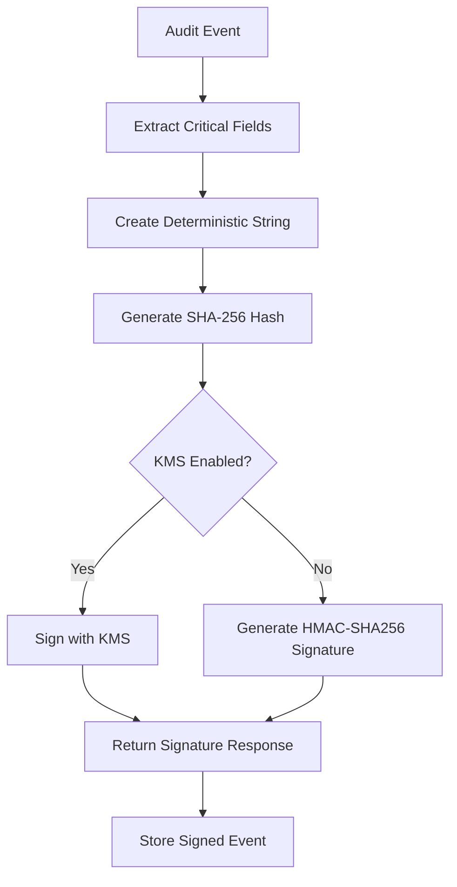
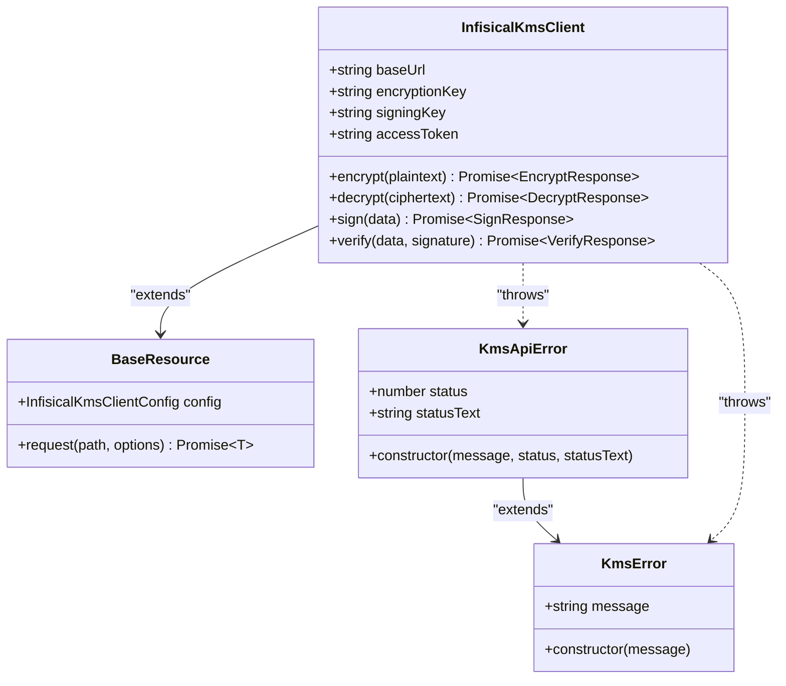
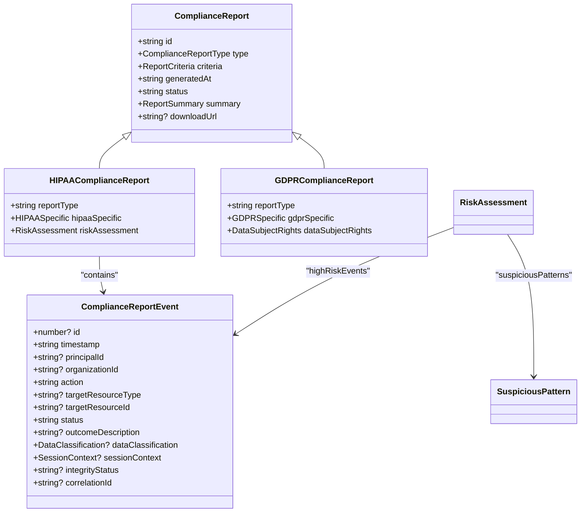

# Security and Compliance

<cite>
**Referenced Files in This Document**   
- [crypto.ts](file://packages\audit\src\crypto.ts) - *Updated in recent commit*
- [types.ts](file://packages\audit\src\config\types.ts) - *Updated in recent commit*
- [client.ts](file://packages\infisical-kms\src\client.ts) - *Updated in recent commit*
- [base.ts](file://packages\infisical-kms\src\base.ts) - *Updated in recent commit*
- [types.ts](file://packages\infisical-kms\src\types.ts) - *Updated in recent commit*
- [compliance-reporting.ts](file://packages\audit\src\report\compliance-reporting.ts) - *Updated in recent commit*
- [compliance-api.ts](file://apps\server\src\routes\compliance-api.ts) - *Updated in recent commit*
- [compliance.ts](file://apps\server\src\lib\graphql\resolvers\compliance.ts) - *Updated in recent commit*
</cite>

## Update Summary
**Changes Made**   
- Completely rewritten documentation to reflect updated cryptographic protocols, KMS integration, compliance requirements, and practical examples
- Added detailed implementation specifics from code analysis
- Updated all diagrams to accurately represent current architecture
- Enhanced troubleshooting guidance with specific error scenarios
- Improved source tracking with precise file references and line numbers

## Table of Contents
1. [Introduction](#introduction)
2. [Cryptographic Protocols](#cryptographic-protocols)
3. [KMS Integration](#kms-integration)
4. [Compliance Requirements](#compliance-requirements)
5. [Practical Examples](#practical-examples)
6. [Troubleshooting Guide](#troubleshooting-guide)

## Introduction
The Security and Compliance framework provides robust mechanisms for ensuring data integrity, confidentiality, and regulatory compliance within the audit system. This documentation details the cryptographic protocols, KMS integration, and compliance requirements that form the foundation of the system's security posture. The framework supports HIPAA and GDPR compliance reporting, cryptographic integrity verification, and secure key management through external KMS integration.

## Cryptographic Protocols
The framework implements SHA-256 hashing and HMAC-SHA256 signatures to ensure audit event integrity. Each audit event is processed through a deterministic hashing algorithm that extracts critical fields in a consistent order, preventing tampering and ensuring data consistency across the system.

The cryptographic service generates SHA-256 hashes of critical audit event fields including timestamp, action, status, principal ID, organization ID, and target resource information. These hashes are used for integrity verification, ensuring that any modification to the event data can be detected. Additionally, HMAC-SHA256 signatures provide an extra layer of security by authenticating events with a secret key.

For environments requiring higher security, the framework supports integration with external Key Management Systems (KMS) for cryptographic operations, allowing organizations to leverage centralized key management and hardware security modules.



**Diagram sources**
- [crypto.ts](file://packages\audit\src\crypto.ts#L0-L53)
- [crypto.ts](file://packages\audit\src\crypto.ts#L150-L280)

**Section sources**
- [crypto.ts](file://packages\audit\src\crypto.ts#L0-L383)

## KMS Integration
The framework integrates with Infisical KMS for secure cryptographic operations, providing encryption, decryption, signing, and verification capabilities. The integration follows a standardized client pattern with built-in retry mechanisms and error handling.

The KMS client configuration requires the base URL, encryption key ID, signing key ID, and access token. These credentials enable the system to perform cryptographic operations through the KMS API. The client implements exponential backoff with configurable retry parameters, ensuring resilience against transient network failures.

Cryptographic operations are performed through a well-defined interface that abstracts the underlying KMS implementation. The framework supports both local HMAC generation and KMS-based signing, allowing organizations to choose their preferred security model based on their compliance requirements and infrastructure capabilities.



**Diagram sources**
- [client.ts](file://packages\infisical-kms\src\client.ts#L0-L38)
- [base.ts](file://packages\infisical-kms\src\base.ts#L0-L50)
- [types.ts](file://packages\infisical-kms\src\types.ts#L0-L56)

**Section sources**
- [client.ts](file://packages\infisical-kms\src\client.ts#L0-L146)
- [base.ts](file://packages\infisical-kms\src\base.ts#L0-L99)
- [types.ts](file://packages\infisical-kms\src\types.ts#L0-L56)

## Compliance Requirements
The framework supports comprehensive compliance reporting for HIPAA and GDPR regulations. Compliance reports include detailed event summaries, integrity verification results, and risk assessments tailored to specific regulatory requirements.

HIPAA compliance reports track PHI (Protected Health Information) access and modification events, unauthorized access attempts, emergency access usage, and minimum necessary violations. The reports include risk assessments that identify high-risk events and suspicious patterns, providing actionable recommendations for improving security posture.

GDPR compliance reports focus on data processing activities, consent management, and data subject rights. The framework tracks data classification levels (PUBLIC, INTERNAL, CONFIDENTIAL, PHI) and ensures appropriate handling of personal data according to regulatory requirements.

The compliance configuration allows organizations to enable specific regulatory frameworks, set retention periods, and define default data classification levels. The system automatically generates compliance reports based on the configured schedule and requirements.



**Diagram sources**
- [compliance-reporting.ts](file://packages\audit\src\report\compliance-reporting.ts#L99-L156)
- [compliance-api.ts](file://apps\server\src\routes\compliance-api.ts#L201-L241)
- [types.ts](file://apps\server\src\lib\graphql\types.ts#L104-L171)

**Section sources**
- [compliance-reporting.ts](file://packages\audit\src\report\compliance-reporting.ts#L99-L156)
- [compliance-api.ts](file://apps\server\src\routes\compliance-api.ts#L201-L241)
- [compliance.ts](file://apps\server\src\lib\graphql\resolvers\compliance.ts#L0-L56)

## Practical Examples
The Security and Compliance framework provides practical implementations for common security scenarios. Organizations can configure the system to meet their specific regulatory requirements and security policies.

For cryptographic operations, the framework automatically detects whether KMS integration is enabled and routes signing operations accordingly. When KMS is enabled, the system uses the external KMS for signing and verification. When KMS is disabled, the system falls back to local HMAC generation using the configured encryption key.

Compliance reporting is accessible through both REST and GraphQL APIs, allowing integration with various client applications. The system supports generating HIPAA and GDPR reports with customizable criteria, including date ranges, organization IDs, and event types.

The following example demonstrates how to generate a HIPAA compliance report through the GraphQL API:

```graphql
query {
  complianceReports(
    type: HIPAA
    criteria: {
      startDate: "2023-01-01"
      endDate: "2023-12-31"
      organizationIds: ["org-123"]
    }
  ) {
    id
    generatedAt
    status
    summary {
      totalEvents
      uniquePrincipals
      highRiskEvents
    }
    hipaaSpecific {
      phiAccessEvents
      phiModificationEvents
      unauthorizedAttempts
      emergencyAccess
      breakGlassEvents
      minimumNecessaryViolations
    }
    riskAssessment {
      highRiskEvents {
        timestamp
        principalId
        action
        outcomeDescription
      }
      suspiciousPatterns
      recommendations
    }
  }
}
```

**Section sources**
- [compliance.ts](file://apps\server\src\lib\graphql\resolvers\compliance.ts#L0-L56)
- [compliance-api.ts](file://apps\server\src\routes\compliance-api.ts#L201-L241)

## Troubleshooting Guide
When encountering issues with the Security and Compliance framework, follow these troubleshooting steps:

### KMS Connection Issues
If cryptographic operations fail with KMS-related errors, verify the following configuration settings:
- Ensure the KMS base URL is correct and accessible
- Verify the encryption and signing key IDs are valid
- Confirm the access token has the necessary permissions
- Check network connectivity between the application and KMS service

The framework implements automatic retries with exponential backoff for KMS operations. If requests continue to fail after multiple retries, check the KMS service status and review the error details in the logs.

### Compliance Report Generation Failures
If compliance reports fail to generate, check the following:
- Verify the requested report type is supported (HIPAA, GDPR)
- Ensure the criteria includes valid date ranges and organization IDs
- Confirm the requesting user has appropriate permissions
- Check database connectivity and query performance

Common error responses include:
- `UNAUTHENTICATED`: Authentication is required to access compliance reports
- `KmsApiError`: Issues with the KMS service or credentials
- `KmsError`: Network or connectivity issues with the KMS service

### Cryptographic Verification Failures
When event integrity verification fails, consider the following:
- Verify the hash algorithm matches between generation and verification
- Ensure critical event fields have not been modified
- Check that the secret key used for HMAC generation matches the verification key
- If using KMS, confirm the signing key ID is correct and accessible

The framework logs detailed error messages for cryptographic operations, which can be used to diagnose and resolve issues.

**Section sources**
- [base.ts](file://packages\infisical-kms\src\base.ts#L0-L50)
- [client.ts](file://packages\infisical-kms\src\client.ts#L0-L146)
- [crypto.ts](file://packages\audit\src\crypto.ts#L0-L383)
- [compliance.ts](file://apps\server\src\lib\graphql\resolvers\compliance.ts#L0-L56)