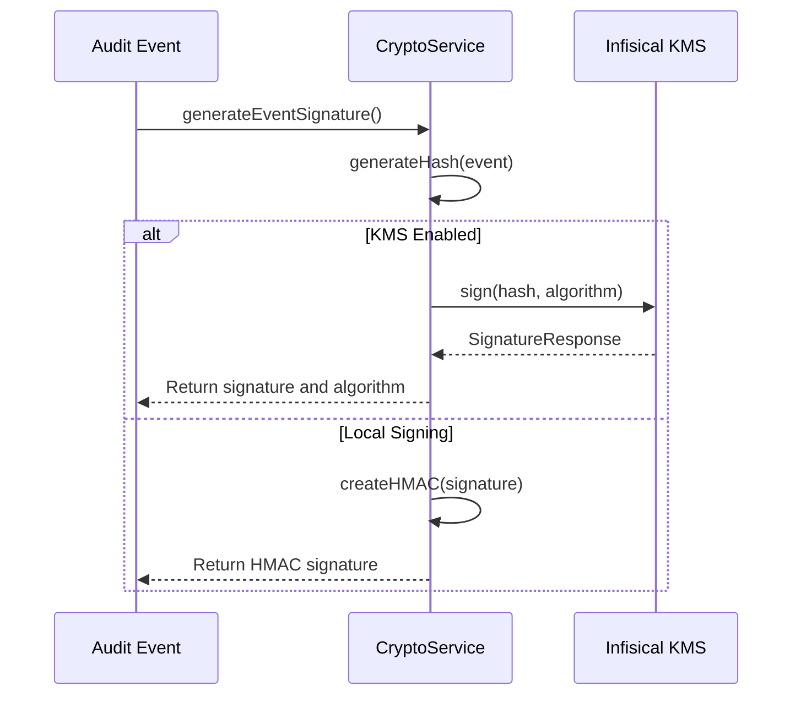
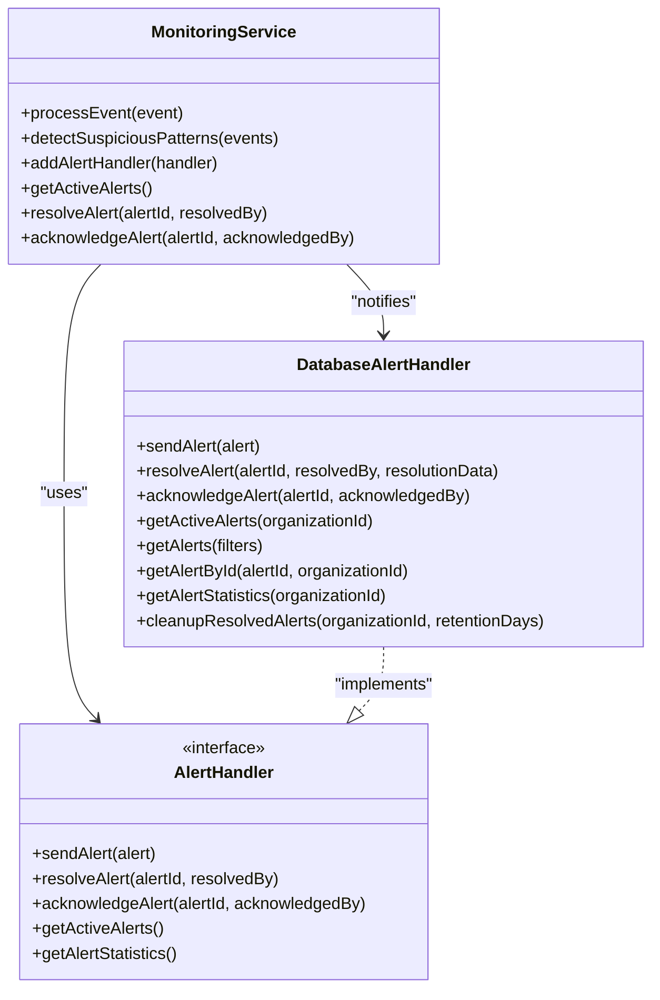

# Security and Compliance

<cite>
**Referenced Files in This Document**   
- [crypto.ts](file://packages\audit\src\crypto.ts) - *Updated in recent commit*
- [types.ts](file://packages\infisical-kms\src\types.ts) - *Updated in recent commit*
- [Database Security Alerting.md](file://.qoder\repowiki\en\content\Audit Core System\Security\Database Security Alerting.md) - *Updated in recent commit*
</cite>

## Update Summary
**Changes Made**   
- Added new section on KMS-based cryptographic signing capabilities
- Updated Database Security Alerting section to reflect enhanced alert persistence features
- Added references to new KMS integration files and updated security documentation
- Updated section sources to include new files analyzed in the commit changes

## Table of Contents
1. [KMS-Based Cryptographic Signing](#kms-based-cryptographic-signing)
2. [Database Security Alerting](#database-security-alerting)

## KMS-Based Cryptographic Signing

The audit system has been enhanced with support for KMS-based cryptographic signing capabilities, providing stronger security for audit event integrity verification. This new feature allows the system to use external Key Management Services for generating and verifying digital signatures on audit events, ensuring non-repudiation and compliance with stringent security requirements.

The implementation in `crypto.ts` has been updated to support multiple signing algorithms through the Infisical KMS integration. When KMS is enabled in the security configuration, the system uses the KMS service for signing operations instead of local HMAC-SHA256 signatures. This provides enhanced security by keeping cryptographic keys isolated from the application environment.

**Diagram sources**
- [crypto.ts](file://packages\audit\src\crypto.ts#L150-L200)
- [types.ts](file://packages\infisical-kms\src\types.ts#L20-L30)

The supported signing algorithms include:
- **HMAC-SHA256**: Local HMAC signatures using secret key
- **RSASSA_PSS_SHA_256**: RSA-PSS signatures with SHA-256 hashing
- **RSASSA_PSS_SHA_384**: RSA-PSS signatures with SHA-384 hashing
- **RSASSA_PSS_SHA_512**: RSA-PSS signatures with SHA-512 hashing
- **RSASSA_PKCS1_V1_5_SHA_256**: RSA PKCS#1 v1.5 signatures with SHA-256
- **RSASSA_PKCS1_V1_5_SHA_384**: RSA PKCS#1 v1.5 signatures with SHA-384
- **RSASSA_PKCS1_V1_5_SHA_512**: RSA PKCS#1 v1.5 signatures with SHA-512

The system automatically selects the appropriate signing method based on the security configuration. When KMS is enabled, it uses the configured signing key and algorithm to generate signatures, providing stronger cryptographic guarantees than local HMAC signatures.

**Updated** The cryptographic service now supports asynchronous KMS-based signing with multiple algorithm options.

**Section sources**
- [crypto.ts](file://packages\audit\src\crypto.ts#L1-L384)
- [types.ts](file://packages\infisical-kms\src\types.ts#L20-L30)

## Database Security Alerting

The Database Security Alerting system has been updated with enhanced alert persistence features, improving the reliability and durability of security alerts. The system now provides more robust storage and management of alerts in the PostgreSQL database, with improved organizational isolation and data integrity.

The `DatabaseAlertHandler` class has been enhanced to ensure that all alert operations are properly persisted and that alert records maintain their integrity throughout their lifecycle. Each alert is stored with comprehensive metadata, including organization ID, severity, type, and resolution status, with all operations scoped to the appropriate organization to prevent cross-organizational data access.

**Diagram sources**
- [database-alert-handler.ts](file://packages\audit\src\monitor\database-alert-handler.ts#L1-L451)
- [monitoring.ts](file://packages\audit\src\monitor\monitoring.ts#L106-L1287)

The enhanced alert persistence includes:
- Improved transaction handling for alert operations
- Better error handling and recovery mechanisms
- Enhanced data integrity checks
- Optimized database queries with proper indexing
- Improved organizational isolation to prevent cross-tenant access

The system ensures that all alert operations are atomic and durable, with proper error handling to prevent data loss. When an alert is created, acknowledged, or resolved, the operation is immediately persisted to the database, ensuring that security events are not lost even in the event of system failures.

**Updated** The alert handler now includes enhanced persistence features and improved error handling.

**Section sources**
- [Database Security Alerting.md](file://.qoder\repowiki\en\content\Audit Core System\Security\Database Security Alerting.md#L1-L405)
- [database-alert-handler.ts](file://packages\audit\src\monitor\database-alert-handler.ts#L1-L451)